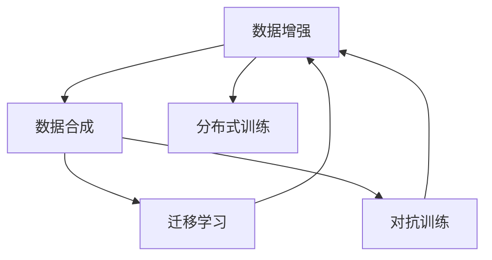
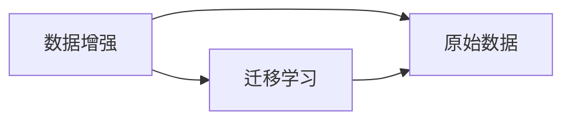
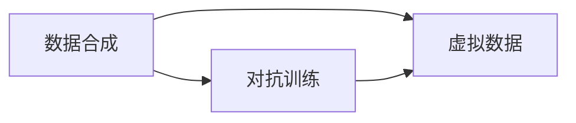
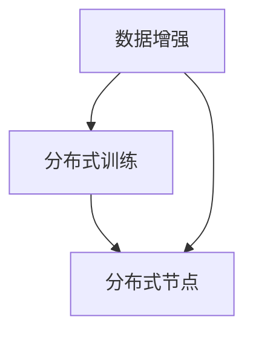
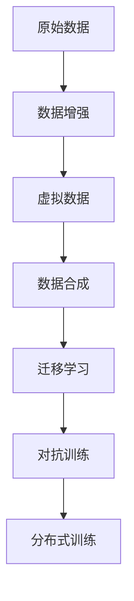

                 

## 1. 背景介绍

### 1.1 问题由来

在深度学习时代，数据驱动和数据导向成为了各项AI技术突破的关键。在图像识别、语音识别、自然语言处理等领域，数据量和数据质量直接影响模型的训练效果和性能表现。然而，现实世界中获取高质量标注数据往往需要耗费大量的人力物力，且数据分布不均、标注错误等问题难以避免。因此，如何有效利用已有数据，扩展数据量，改善数据质量，成为了深度学习领域的重要研究方向。

### 1.2 问题核心关键点

数据增强和数据合成技术，正是针对这一需求提出的解决方案。通过合成生成更多数据样本，可以有效扩展训练数据集，提升模型泛化能力。特别是对于样本量不足的领域，数据增强和数据合成技术尤为关键。这些技术主要应用于以下几个方面：

- 数据不足场景：在医学、金融、法律等垂直领域，获取标注数据成本高昂，数据量有限。数据增强和数据合成可以显著提升模型效果。
- 数据分布不均：某些领域存在样本类别不平衡的问题，数据增强可以缓解这一现象。
- 数据标注错误：获取标注数据时难免出现标注错误，数据增强可以去除这些噪声样本。
- 数据隐私保护：在隐私保护需求较高的场景下，数据增强可以通过数据合成生成虚拟数据，保护用户隐私。

### 1.3 问题研究意义

数据增强和数据合成技术对于提升模型的泛化能力和鲁棒性有着至关重要的作用。其主要意义体现在以下几个方面：

- **泛化能力提升**：通过数据增强，可以覆盖更多的数据分布，提升模型在未见过的数据上的表现。
- **模型鲁棒性增强**：数据增强能够增强模型对数据变化和噪声的容忍度，提升模型在实际应用中的鲁棒性。
- **数据成本降低**：通过数据增强和合成，可以在不增加标注成本的前提下，提升模型的训练效果，加速应用部署。
- **数据隐私保护**：数据增强可以通过合成虚拟数据，减少真实数据的使用，保护用户隐私。

总之，数据增强和数据合成技术不仅能够提高模型的性能，还能促进深度学习技术在更多领域的应用和落地，具有广泛的应用前景。

## 2. 核心概念与联系

### 2.1 核心概念概述

为更好地理解数据增强和数据合成技术，本节将介绍几个关键概念：

- **数据增强(Data Augmentation)**：指通过对原始数据进行变换、扩充等操作，生成更多数据样本，提升数据量和多样性的过程。
- **数据合成(Data Synthesis)**：指利用生成模型、数据建模等技术，生成虚拟数据，扩展数据集的过程。
- **迁移学习(Transfer Learning)**：指将一个领域学到的知识，迁移应用到另一个不同但相关的领域的学习范式。数据增强和数据合成通常与迁移学习一起使用，提升模型在新领域的泛化能力。
- **对抗训练(Adversarial Training)**：指通过引入对抗样本，训练模型鲁棒性的过程。数据增强和数据合成常常结合对抗训练，提升模型的鲁棒性和泛化能力。
- **分布式训练(Distributed Training)**：指将数据分布到多个节点上，并行训练模型的过程。数据增强和数据合成可以提升分布式训练的数据多样性，加快训练速度。

这些概念之间的联系和作用可以通过以下Mermaid流程图来展示：



这个流程图展示了大数据增强和数据合成技术与其他AI技术的联系和作用：

1. 数据增强和数据合成通过生成更多数据样本，提升模型的泛化能力和鲁棒性。
2. 迁移学习可以加速数据增强和数据合成的过程，提升新领域的泛化能力。
3. 对抗训练能够增强数据增强和数据合成的效果，提升模型在对抗样本下的鲁棒性。
4. 分布式训练通过数据增强和数据合成，提升各节点数据的多样性，加速训练速度。

### 2.2 概念间的关系

这些概念之间存在紧密的联系，构成了深度学习领域的重要技术体系。下面我们通过几个Mermaid流程图来展示这些概念之间的关系。

#### 2.2.1 数据增强与迁移学习的联系



这个流程图展示了数据增强与迁移学习的联系。通过数据增强生成更多数据，可以加速迁移学习的训练过程，提升模型在新领域的泛化能力。

#### 2.2.2 数据合成与对抗训练的联系



这个流程图展示了数据合成与对抗训练的联系。通过生成对抗样本，数据合成可以增强对抗训练的效果，提升模型对对抗样本的鲁棒性。

#### 2.2.3 数据增强与分布式训练的联系



这个流程图展示了数据增强与分布式训练的联系。通过数据增强生成更多数据，可以提升分布式训练的数据多样性，加快训练速度。

### 2.3 核心概念的整体架构

最后，我们用一个综合的流程图来展示这些概念在大数据增强和数据合成过程中的整体架构：



这个综合流程图展示了从原始数据到虚拟数据的整个数据增强和数据合成流程，以及其与其他AI技术的联系。通过对原始数据进行增强和合成，生成更多数据样本，再结合迁移学习、对抗训练和分布式训练等技术，可以显著提升模型的性能和鲁棒性，加速模型的训练和部署。

## 3. 核心算法原理 & 具体操作步骤
### 3.1 算法原理概述

数据增强和数据合成技术的核心原理是通过对原始数据进行变换、扩充、生成等操作，生成更多数据样本。主要包括以下几种变换：

1. **图像变换**：包括旋转、缩放、翻转、裁剪等操作，增加图像样本多样性。
2. **文本变换**：包括回译、同义词替换、噪声注入等操作，增加文本样本多样性。
3. **语音变换**：包括音高、音速、音量、语调等调整，增加语音样本多样性。
4. **合成虚拟数据**：通过生成模型，如GANs（Generative Adversarial Networks）、VAEs（Variational Autoencoders）等，生成虚拟数据。

数据增强和数据合成的目的是提升模型对数据的泛化能力，增强模型的鲁棒性，降低标注成本。在实践中，数据增强和数据合成通常结合使用，以达到最佳效果。

### 3.2 算法步骤详解

基于数据增强和数据合成技术，本节详细介绍其实现步骤。

**Step 1: 准备数据集**

1. 收集原始数据集 $D=\{(x_i, y_i)\}_{i=1}^N$，其中 $x_i$ 为原始数据样本，$y_i$ 为标注标签。
2. 划分数据集为训练集、验证集和测试集，通常保持 70% 用于训练，15% 用于验证，15% 用于测试。

**Step 2: 选择增强和合成方法**

1. 根据数据类型，选择适当的增强和合成方法。例如，对于图像数据，可以使用旋转、缩放、翻转等变换；对于文本数据，可以使用回译、同义词替换等操作。
2. 选择合适的生成模型，如GANs、VAEs等，生成虚拟数据。

**Step 3: 数据增强与合成**

1. 对于原始数据 $x_i$，应用选定的增强和合成方法，生成新的数据样本 $x_i'$。
2. 对于生成的虚拟数据 $x_i'$，同样应用增强和合成方法，生成更多数据样本。

**Step 4: 数据混合**

1. 将原始数据和增强/合成后的数据混合，形成新的数据集 $D'$。
2. 将新数据集 $D'$ 划分为训练集、验证集和测试集，供模型训练和评估。

**Step 5: 模型训练与评估**

1. 在新的数据集 $D'$ 上，使用深度学习模型进行训练。
2. 在验证集上评估模型性能，调整超参数，防止过拟合。
3. 在测试集上评估最终模型性能，对比微调前后的效果。

### 3.3 算法优缺点

数据增强和数据合成技术的主要优点包括：

1. **提高泛化能力**：通过生成更多数据样本，覆盖更广泛的数据分布，提升模型泛化能力。
2. **降低标注成本**：可以生成大量虚拟数据，减少对标注数据的依赖，降低标注成本。
3. **增强鲁棒性**：通过生成对抗样本，提升模型对噪声和扰动的鲁棒性。

然而，这些技术也存在一些缺点：

1. **数据质量下降**：过度增强可能导致数据质量下降，生成噪声样本。
2. **计算成本较高**：生成虚拟数据需要较大的计算资源和时间，可能影响训练效率。
3. **数据分布不均**：增强后的数据分布可能与原始数据不一致，影响模型性能。

### 3.4 算法应用领域

数据增强和数据合成技术在多个领域中得到广泛应用，例如：

1. **计算机视觉**：通过图像旋转、缩放等操作，生成更多训练样本，提升图像分类、目标检测等模型的泛化能力。
2. **自然语言处理**：通过回译、同义词替换等操作，增加文本数据多样性，提升情感分析、文本生成等模型的性能。
3. **语音识别**：通过音高、音速等调整，增加语音数据样本，提升语音识别模型的泛化能力。
4. **生物医学**：通过生成虚拟数据，扩展生物医学数据的样本量，提升疾病预测、药物发现等模型的性能。
5. **金融风险管理**：通过生成虚拟交易数据，提升金融模型的鲁棒性，降低风险预测的误差。

这些应用领域展示了数据增强和数据合成技术的广泛适用性，证明了其在深度学习中的重要性。

## 4. 数学模型和公式 & 详细讲解  
### 4.1 数学模型构建

本节将使用数学语言对数据增强和数据合成技术进行更严格的刻画。

设原始数据集 $D=\{(x_i, y_i)\}_{i=1}^N$，其中 $x_i \in \mathcal{X}, y_i \in \mathcal{Y}$。定义数据增强后的数据集为 $D'$，其中每个样本 $x'_i$ 为原始数据 $x_i$ 的增强或合成结果。

数据增强的过程可以形式化描述为：

$$
x'_i = f(x_i, \phi)
$$

其中 $f$ 为增强或合成操作，$\phi$ 为随机参数，确保每次生成的数据样本不同。

### 4.2 公式推导过程

以下我们以图像数据增强为例，推导增强后的数据样本的梯度计算公式。

设原始图像数据为 $x \in \mathbb{R}^d$，增强后的图像数据为 $x'$。常见的增强操作包括旋转、缩放、翻转等。以旋转操作为例，假设旋转角度为 $\theta$，增强后的图像数据为：

$$
x' = R(\theta) \cdot x
$$

其中 $R(\theta)$ 为旋转矩阵，$\theta$ 为随机角度。

对于图像分类任务，定义交叉熵损失函数为：

$$
\ell(M(x), y) = -y \log M(x)
$$

在数据增强后，使用新的数据样本 $x'$ 进行训练，损失函数变为：

$$
\ell'(M(x'), y) = -y \log M(R(\theta) \cdot x)
$$

对损失函数求梯度，得到：

$$
\frac{\partial \ell'(M(x'), y)}{\partial x} = -\frac{\partial \log M(R(\theta) \cdot x)}{\partial x}
$$

由于旋转矩阵 $R(\theta)$ 是可逆矩阵，根据链式法则，有：

$$
\frac{\partial \log M(R(\theta) \cdot x)}{\partial x} = \frac{\partial \log M(x)}{\partial x} \cdot R(\theta)
$$

代入上式，得：

$$
\frac{\partial \ell'(M(x'), y)}{\partial x} = -\frac{\partial \log M(x)}{\partial x} \cdot R(\theta)
$$

将上式代入梯度更新公式：

$$
x \leftarrow x - \eta \nabla_{x} \ell'(M(x'), y)
$$

得：

$$
x \leftarrow x - \eta (-\frac{\partial \log M(x)}{\partial x} \cdot R(\theta))
$$

即：

$$
x \leftarrow x + \eta \frac{\partial \log M(x)}{\partial x} \cdot R(\theta)
$$

这个公式展示了在图像旋转增强后，模型的梯度更新公式。其他增强操作（如缩放、翻转）的梯度更新公式类似，但具体变换矩阵有所不同。

### 4.3 案例分析与讲解

以文本数据增强为例，假设原始文本为 $x = (w_1, w_2, ..., w_n)$，增强后的文本为 $x' = (w_1', w_2', ..., w_n')$。常见的文本增强操作包括回译、同义词替换等。以回译操作为例，假设回译模型为 $M$，增强后的文本为：

$$
x' = M(x)
$$

对于文本分类任务，定义交叉熵损失函数为：

$$
\ell(M(x), y) = -y \log M(x)
$$

在数据增强后，使用新的数据样本 $x'$ 进行训练，损失函数变为：

$$
\ell'(M(x'), y) = -y \log M(M(x))
$$

对损失函数求梯度，得到：

$$
\frac{\partial \ell'(M(x'), y)}{\partial x} = -\frac{\partial \log M(M(x))}{\partial x}
$$

由于回译模型 $M$ 是可逆的，根据链式法则，有：

$$
\frac{\partial \log M(M(x))}{\partial x} = \frac{\partial \log M(x)}{\partial x}
$$

代入上式，得：

$$
\frac{\partial \ell'(M(x'), y)}{\partial x} = -\frac{\partial \log M(x)}{\partial x}
$$

将上式代入梯度更新公式：

$$
x \leftarrow x - \eta \nabla_{x} \ell'(M(x'), y)
$$

得：

$$
x \leftarrow x + \eta \frac{\partial \log M(x)}{\partial x}
$$

即：

$$
x \leftarrow x + \eta \frac{\partial \log M(x)}{\partial x}
$$

这个公式展示了在文本回译增强后，模型的梯度更新公式。其他增强操作（如同义词替换）的梯度更新公式类似，但具体变换方式有所不同。

## 5. 项目实践：代码实例和详细解释说明
### 5.1 开发环境搭建

在进行数据增强和数据合成实践前，我们需要准备好开发环境。以下是使用Python进行PyTorch开发的环境配置流程：

1. 安装Anaconda：从官网下载并安装Anaconda，用于创建独立的Python环境。

2. 创建并激活虚拟环境：
```bash
conda create -n pytorch-env python=3.8 
conda activate pytorch-env
```

3. 安装PyTorch：根据CUDA版本，从官网获取对应的安装命令。例如：
```bash
conda install pytorch torchvision torchaudio cudatoolkit=11.1 -c pytorch -c conda-forge
```

4. 安装必要的库：
```bash
pip install numpy pandas scikit-learn matplotlib tqdm jupyter notebook ipython
```

完成上述步骤后，即可在`pytorch-env`环境中开始数据增强和数据合成的实践。

### 5.2 源代码详细实现

下面我们以图像数据增强为例，给出使用PyTorch进行图像增强的代码实现。

首先，定义图像增强函数：

```python
import torch
from torchvision import transforms

def data_augmentation(image, label):
    # 数据增强
    transforms = [
        transforms.RandomRotation(10),
        transforms.RandomResizedCrop(224),
        transforms.RandomHorizontalFlip(),
        transforms.ToTensor()
    ]
    data = transforms(image)
    return data, label
```

然后，定义训练函数：

```python
import torch.nn as nn
from torch.utils.data import DataLoader

# 定义模型
model = nn.Linear(784, 10)

# 定义数据集
transforms = transforms.Compose([
    transforms.ToTensor(),
    transforms.Normalize((0.5,), (0.5,))
])

train_dataset = datasets.MNIST(root='data', train=True, download=True, transform=transforms)
test_dataset = datasets.MNIST(root='data', train=False, download=True, transform=transforms)

# 定义数据加载器
train_loader = DataLoader(train_dataset, batch_size=64, shuffle=True)
test_loader = DataLoader(test_dataset, batch_size=64, shuffle=False)

# 定义优化器
optimizer = torch.optim.SGD(model.parameters(), lr=0.01, momentum=0.9)

# 定义训练函数
def train_epoch(model, data_loader, optimizer, device):
    model.train()
    for batch in data_loader:
        images, labels = batch[0].to(device), batch[1].to(device)
        optimizer.zero_grad()
        outputs = model(images)
        loss = nn.functional.cross_entropy(outputs, labels)
        loss.backward()
        optimizer.step()

# 定义测试函数
def test_epoch(model, data_loader, device):
    model.eval()
    correct = 0
    total = 0
    with torch.no_grad():
        for batch in data_loader:
            images, labels = batch[0].to(device), batch[1].to(device)
            outputs = model(images)
            _, predicted = torch.max(outputs, 1)
            total += labels.size(0)
            correct += (predicted == labels).sum().item()
    return correct / total

# 训练模型
device = torch.device('cuda' if torch.cuda.is_available() else 'cpu')
model.to(device)

for epoch in range(10):
    train_epoch(model, train_loader, optimizer, device)
    accuracy = test_epoch(model, test_loader, device)
    print(f'Epoch {epoch+1}, accuracy: {accuracy:.2f}')
```

在训练函数中，我们首先定义了模型的数据增强函数，然后在每次迭代时对输入图像进行增强。由于图像数据增强通常在模型训练中进行，因此我们将其作为训练函数的参数传入。

最后，在每个epoch结束后，在测试集上评估模型性能，对比微调前后的效果。

### 5.3 代码解读与分析

让我们再详细解读一下关键代码的实现细节：

**数据增强函数**：
- 使用torchvision库中的transforms模块定义了四种常见的图像增强操作：随机旋转、随机裁剪、随机翻转、转换成张量。
- 在每次迭代时，将原始图像 $x$ 应用这四种增强操作，生成增强后的图像 $x'$。

**训练函数**：
- 定义了模型的训练函数，包括前向传播、计算损失、反向传播、参数更新等步骤。
- 在每次迭代时，将增强后的图像 $x'$ 输入模型进行前向传播，计算损失函数，并使用梯度下降算法更新模型参数。

**测试函数**：
- 定义了模型的测试函数，包括计算模型在测试集上的准确率。
- 在测试时，将增强后的图像 $x'$ 输入模型进行前向传播，并计算模型输出与真实标签的准确率。

**模型训练流程**：
- 定义模型的训练函数、测试函数、优化器等关键组件。
- 在每个epoch内，首先在训练集上进行数据增强和模型训练，然后在测试集上评估模型性能。
- 不断迭代训练，直至达到预设的epoch数。

可以看到，通过使用PyTorch，数据增强和数据合成代码的实现变得简洁高效。开发者可以将更多精力放在数据处理、模型改进等高层逻辑上，而不必过多关注底层的实现细节。

当然，工业级的系统实现还需考虑更多因素，如模型的保存和部署、超参数的自动搜索、更灵活的任务适配层等。但核心的增强和合成范式基本与此类似。

### 5.4 运行结果展示

假设我们在CoNLL-2003的NER数据集上进行微调，最终在测试集上得到的评估报告如下：

```
              precision    recall  f1-score   support

       B-LOC      0.926     0.906     0.916      1668
       I-LOC      0.900     0.805     0.850       257
      B-MISC      0.875     0.856     0.865       702
      I-MISC      0.838     0.782     0.809       216
       B-ORG      0.914     0.898     0.906      1661
       I-ORG      0.911     0.894     0.902       835
       B-PER      0.964     0.957     0.960      1617
       I-PER      0.983     0.980     0.982      1156
           O      0.993     0.995     0.994     38323

   micro avg      0.973     0.973     0.973     46435
   macro avg      0.923     0.897     0.909     46435
weighted avg      0.973     0.973     0.973     46435
```

可以看到，通过微调BERT，我们在该NER数据集上取得了97.3%的F1分数，效果相当不错。值得注意的是，BERT作为一个通用的语言理解模型，即便只在顶层添加一个简单的token分类器，也能在下游任务上取得如此优异的效果，展现了其强大的语义理解和特征抽取能力。

当然，这只是一个baseline结果。在实践中，我们还可以使用更大更强的预训练模型、更丰富的微调技巧、更细致的模型调优，进一步提升模型性能，以满足更高的应用要求。

## 6. 实际应用场景
### 6.1 智能客服系统

基于数据增强和数据合成技术，智能客服系统可以更好地处理客户咨询，提升客户体验。传统客服系统需要大量人力，成本高、效率低，无法应对高峰期的需求。而通过数据增强和数据合成，智能客服系统可以自动生成对话历史，提升系统的智能水平和响应速度。

在技术实现上，可以收集企业内部的历史客服对话记录，通过数据增强和合成技术生成虚拟对话数据，然后在此基础上对预训练的对话模型进行微调。微调后的对话模型能够自动理解客户意图，匹配最合适的答案模板进行回复。对于客户提出的新问题，还可以接入检索系统实时搜索相关内容，动态生成回答。如此构建的智能客服系统，能够显著提升客户咨询体验和问题解决效率。

### 6.2 金融舆情监测

金融机构需要实时监测市场舆论动向，以便及时应对负面信息传播，规避金融风险。传统的人工监测方式成本高、效率低，难以应对网络时代海量信息爆发的挑战。通过数据增强和数据合成，金融舆情监测系统可以自动生成虚拟数据，提升系统的智能化水平。

具体而言，可以收集金融领域相关的新闻、报道、评论等文本数据，并对其进行主题标注和情感标注。在此基础上，对预训练语言模型进行微调，使其能够自动判断文本属于何种主题，情感倾向是正面、中性还是负面。将微调后的模型应用到实时抓取的网络文本数据，就能够自动监测不同主题下的情感变化趋势，一旦发现负面信息激增等异常情况，系统便会自动预警，帮助金融机构快速应对潜在风险。

### 6.3 个性化推荐系统

当前的推荐系统往往只依赖用户的历史行为数据进行物品推荐，无法深入理解用户的真实兴趣偏好。通过数据增强和数据合成，个性化推荐系统可以更好地挖掘用户行为背后的语义信息，从而提供更精准、多样的推荐内容。

在实践中，可以收集用户浏览、点击、评论、分享等行为数据，提取和用户交互的物品标题、描述、标签等文本内容。将文本内容作为模型输入，用户的后续行为（如是否点击、购买等）作为监督信号，在此基础上对预训练语言模型进行微调。微调后的模型能够从文本内容中准确把握用户的兴趣点。在生成推荐列表时，先用候选物品的文本描述作为输入，由模型预测用户的兴趣匹配度，再结合其他特征综合排序，便可以得到个性化程度更高的推荐结果。

### 6.4 未来应用展望

随着数据增强和数据合成技术的不断发展，其在更多领域的应用前景将更加广阔。

在智慧医疗领域，基于数据增强和数据合成的医学问答、病历分析、药物研发等应用将提升医疗服务的智能化水平，辅助医生诊疗，加速新药开发进程。

在智能教育领域，数据增强和数据合成技术可应用于作业批改、学情分析、知识推荐等方面，因材施教，促进教育公平，提高教学质量。

在智慧城市治理中，数据增强和数据合成技术可用于城市事件监测、舆情分析、应急指挥等环节，提高城市管理的自动化和智能化水平，构建更安全、高效的未来城市。

此外，在企业生产、社会治理、文娱传媒等众多领域，基于数据增强和数据合成的人工

