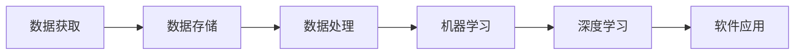

                 

# 数据获取成本越来越低，软件2.0的春天来了

在计算机软件发展的历史长河中，数据获取成本的降低无疑是推动软件2.0时代到来的关键因素之一。随着互联网和移动互联网的普及，数据变得愈发容易获取，不仅帮助开发者获取更多训练数据，还使得大数据、机器学习和深度学习技术得以迅速发展。这不仅降低了软件的开发和维护成本，也带来了巨大的商业价值和社会效益。本文将从数据获取成本降低的背景、核心概念与联系、核心算法原理及操作步骤、数学模型构建、项目实践案例、实际应用场景、工具和资源推荐、未来发展趋势与挑战以及常见问题解答等多个方面，系统地剖析数据获取成本降低对软件2.0时代的深远影响。

## 1. 背景介绍

### 1.1 问题由来
近年来，随着大数据、云计算、人工智能等技术的发展，软件开发进入了一个全新的时代——软件2.0。这一时代的特点是，软件开发不再依赖于昂贵的人工编码和测试，而是利用数据驱动和机器学习等技术，实现更快速、更高质量的软件开发和迭代。在这一过程中，数据获取成本的降低起到了至关重要的作用。

### 1.2 问题核心关键点
数据获取成本的降低，使得软件2.0时代得以快速发展和普及，具体体现在以下几个方面：

- **数据获取便捷**：互联网和移动互联网的发展，使得各种类型的数据越来越容易获取，无论是结构化数据、非结构化数据还是半结构化数据，都可以在短时间内收集到大量的样本。
- **数据量激增**：大规模数据集的出现，使得机器学习模型的训练变得更加高效和准确，从而提高了软件的智能程度和自动化水平。
- **软件开发成本降低**：数据获取成本的降低，使得开发者能够更快速地进行软件原型开发和测试，降低了时间和人力成本。

### 1.3 问题研究意义
研究数据获取成本的降低，对于推动软件2.0时代的到来具有重要意义：

- **提升开发效率**：通过降低数据获取成本，软件开发者能够更快速地进行原型开发和迭代，缩短软件开发周期。
- **提高软件质量**：数据获取成本的降低，使得更多高质量的数据可以用于模型训练，提升了软件的智能程度和稳定性。
- **促进商业应用**：软件2.0时代的到来，使得软件应用更加普及和深入，推动了大数据、人工智能等技术的商业化应用。

## 2. 核心概念与联系

### 2.1 核心概念概述

在软件2.0时代，数据获取成本的降低带来了许多新的概念和机遇。以下是几个关键概念及其相互联系的介绍：

- **数据获取**：指通过各种方式收集和整理数据，为软件2.0提供训练和测试的基础。数据获取方式包括网络爬虫、API接口调用、用户数据收集等。
- **数据存储**：指将收集到的数据进行存储和管理，以便后续分析和处理。常用的数据存储方式包括关系型数据库、非关系型数据库、分布式文件系统等。
- **数据处理**：指对存储的数据进行清洗、预处理和特征提取，以便进行机器学习模型的训练和测试。常用的数据处理技术包括数据清洗、数据归一化、特征工程等。
- **机器学习**：指利用算法和模型，对处理后的数据进行分析和预测。常用的机器学习算法包括监督学习、无监督学习、强化学习等。
- **深度学习**：指使用深度神经网络模型，对大量数据进行复杂的特征提取和模式识别。常用的深度学习框架包括TensorFlow、PyTorch等。

这些核心概念之间相互关联，形成了一个完整的软件2.0生态系统，如图1所示：



### 2.2 概念间的关系

这些核心概念之间存在着紧密的联系，如图2所示：


图1和图2展示了数据获取成本降低对软件2.0时代的影响，以及数据获取、存储、处理、机器学习和深度学习之间的相互关系。以下将详细解释这些概念的原理和架构。

## 3. 核心算法原理 & 具体操作步骤

### 3.1 算法原理概述

在软件2.0时代，数据获取成本的降低使得基于数据驱动的软件开发和迭代成为可能。这其中，数据驱动的软件开发通常包含以下几个步骤：

1. **数据收集**：通过网络爬虫、API接口调用等方式，获取大量数据，作为软件开发的训练样本。
2. **数据处理**：对收集到的数据进行清洗、预处理和特征提取，以便后续训练模型。
3. **模型训练**：使用机器学习和深度学习算法，对处理后的数据进行训练，获得预测模型。
4. **模型测试**：使用测试集对训练好的模型进行评估，验证其预测准确性和鲁棒性。
5. **模型部署**：将训练好的模型部署到生产环境，实现软件应用。

### 3.2 算法步骤详解

以下详细解释每个步骤的具体操作：

**Step 1: 数据收集**

数据收集是软件2.0开发的第一步，通常包括以下几个方面：

- **网络爬虫**：使用Python等编程语言，编写网络爬虫脚本，从互联网或API接口中收集数据。例如，可以使用Scrapy框架，爬取电商网站的产品信息、用户评价等数据。
- **API接口调用**：通过调用第三方API接口，获取结构化数据。例如，使用Alpha Vantage API获取股票行情数据。
- **用户数据收集**：通过表单、问卷、浏览器Cookie等方式，收集用户行为数据。例如，通过Hadoop分布式文件系统（HDFS）收集海量日志数据。

**Step 2: 数据处理**

数据处理是数据驱动软件开发的第二个重要步骤，主要包括以下几个方面：

- **数据清洗**：去除重复、缺失、异常值等数据，保证数据的完整性和准确性。例如，使用Pandas库进行数据清洗，去除缺失值和异常值。
- **数据归一化**：对数据进行标准化处理，以便后续特征提取和模型训练。例如，使用MinMaxScaler对数据进行归一化处理。
- **特征提取**：从原始数据中提取有意义的特征，以便训练模型。例如，使用PCA降维算法，提取数据的主要特征。

**Step 3: 模型训练**

模型训练是软件2.0开发的第三步，主要包括以下几个方面：

- **模型选择**：根据具体任务和数据特点，选择合适的机器学习或深度学习模型。例如，使用Keras框架，选择适合的神经网络模型进行训练。
- **模型训练**：使用训练集对模型进行训练，获得预测模型。例如，使用TensorFlow框架，训练深度神经网络模型。
- **超参数调整**：通过交叉验证等方法，调整模型超参数，优化模型性能。例如，使用Grid Search方法，调整学习率、批大小等参数。

**Step 4: 模型测试**

模型测试是软件2.0开发的第四步，主要包括以下几个方面：

- **测试集划分**：将数据集划分为训练集和测试集，用于模型训练和测试。例如，使用K-Fold交叉验证方法，将数据集划分为K个子集，进行模型测试。
- **模型评估**：使用测试集对模型进行评估，计算模型预测准确性和鲁棒性。例如，使用Accuracy、Precision、Recall等指标，评估模型性能。

**Step 5: 模型部署**

模型部署是软件2.0开发的最后一步，主要包括以下几个方面：

- **模型保存**：将训练好的模型保存为文件，以便后续使用。例如，使用Pickle库将模型保存为文件。
- **模型部署**：将模型部署到生产环境，实现软件应用。例如，使用Flask框架，将模型部署为Web服务。

### 3.3 算法优缺点

基于数据驱动的软件开发和迭代，具有以下优点：

- **快速迭代**：数据获取成本的降低，使得开发者可以更快速地进行原型开发和迭代，缩短软件开发周期。
- **高效准确**：基于大量高质量数据的机器学习模型，可以提供高效、准确的预测结果，提升软件性能。
- **低成本**：数据获取成本的降低，减少了软件开发的成本和时间投入。

同时，基于数据驱动的软件开发也存在一些缺点：

- **数据质量问题**：数据收集和处理过程中，可能会出现数据质量问题，影响模型性能。
- **数据隐私问题**：数据获取过程中，需要考虑用户隐私和数据安全问题，以免侵犯用户权益。
- **数据获取难度**：某些领域的数据获取难度较大，如医疗、金融等，数据获取成本较高。

## 4. 数学模型和公式 & 详细讲解 & 举例说明

### 4.1 数学模型构建

基于数据驱动的软件开发，通常使用机器学习和深度学习模型进行预测。这里以线性回归模型为例，介绍数学模型构建的具体方法。

假设有一个训练集$D=\{(x_i, y_i)\}_{i=1}^N$，其中$x_i$为输入特征，$y_i$为输出标签。线性回归模型的目标是找到一个最优的线性关系$h_\theta(x)=\theta_0+\theta_1x_1+\theta_2x_2+\cdots+\theta_px_p$，使得预测值$h_\theta(x)$与真实值$y_i$之间的误差最小化。最小化误差的目标函数为：

$$
\min_{\theta} \frac{1}{2N}\sum_{i=1}^N(h_\theta(x_i)-y_i)^2
$$

通过梯度下降等优化算法，最小化目标函数，求得模型参数$\theta$。具体步骤如下：

- **梯度计算**：计算损失函数$J(\theta)$对每个参数$\theta_j$的偏导数$\frac{\partial J(\theta)}{\partial \theta_j}$。
- **参数更新**：根据梯度下降公式，更新模型参数$\theta$。具体公式如下：

$$
\theta_j := \theta_j - \eta \frac{\partial J(\theta)}{\partial \theta_j}
$$

其中，$\eta$为学习率，控制每次参数更新的步长。

### 4.2 公式推导过程

线性回归模型的推导过程如下：

设训练集$D=\{(x_i, y_i)\}_{i=1}^N$，其中$x_i$为输入特征，$y_i$为输出标签。线性回归模型的目标是找到一个最优的线性关系$h_\theta(x)=\theta_0+\theta_1x_1+\theta_2x_2+\cdots+\theta_px_p$，使得预测值$h_\theta(x)$与真实值$y_i$之间的误差最小化。最小化误差的目标函数为：

$$
J(\theta) = \frac{1}{2N}\sum_{i=1}^N(h_\theta(x_i)-y_i)^2
$$

对$J(\theta)$求偏导数，得到：

$$
\frac{\partial J(\theta)}{\partial \theta_j} = \frac{1}{N}\sum_{i=1}^N(x_{ij}-\hat{y}_i)
$$

其中，$\hat{y}_i$为模型预测值。

根据梯度下降算法，更新模型参数$\theta_j$：

$$
\theta_j := \theta_j - \eta \frac{\partial J(\theta)}{\partial \theta_j}
$$

### 4.3 案例分析与讲解

以房价预测为例，详细解释线性回归模型的构建和应用过程。

假设有一个房价预测任务，需要预测某地块的房价$y$。可以收集该地块的面积$x_1$、位置$x_2$、装修情况$x_3$等特征，构建线性回归模型：

$$
h_\theta(x)=\theta_0+\theta_1x_1+\theta_2x_2+\theta_3x_3
$$

使用随机梯度下降算法，对模型参数$\theta$进行优化。假设训练集为$D=\{(x_i, y_i)\}_{i=1}^N$，其中$x_i$为输入特征，$y_i$为输出标签。使用随机梯度下降算法，计算损失函数$J(\theta)$对每个参数$\theta_j$的偏导数，更新模型参数$\theta$，直到收敛。

具体步骤如下：

1. **数据准备**：收集该地块的面积、位置、装修情况等数据，构建训练集$D$。
2. **模型构建**：构建线性回归模型$h_\theta(x)$，设置模型参数$\theta$的初始值。
3. **模型训练**：使用随机梯度下降算法，更新模型参数$\theta$，最小化目标函数$J(\theta)$。
4. **模型测试**：使用测试集对模型进行评估，计算模型预测准确性。

## 5. 项目实践：代码实例和详细解释说明

### 5.1 开发环境搭建

在进行数据驱动的软件开发实践前，需要准备开发环境。以下是使用Python进行Keras框架开发的Python环境配置流程：

1. 安装Anaconda：从官网下载并安装Anaconda，用于创建独立的Python环境。

2. 创建并激活虚拟环境：
```bash
conda create -n pytorch-env python=3.8 
conda activate pytorch-env
```

3. 安装Keras：
```bash
pip install keras
```

4. 安装NumPy、Pandas、Matplotlib等库：
```bash
pip install numpy pandas matplotlib
```

完成上述步骤后，即可在`pytorch-env`环境中进行数据驱动的软件开发实践。

### 5.2 源代码详细实现

这里我们以房价预测任务为例，给出使用Keras框架进行线性回归模型训练的Python代码实现。

首先，导入必要的库和模块：

```python
import numpy as np
from keras.models import Sequential
from keras.layers import Dense
from keras.optimizers import SGD
```

然后，定义数据集：

```python
# 生成样本数据
x_train = np.random.rand(100, 3)
y_train = np.dot(x_train, np.array([1.5, 2.5, 3.5])) + 0.5

# 定义标签
y_train = np.round(y_train, 2)

# 数据集
train_data = np.hstack((x_train, y_train.reshape(-1, 1)))
```

接着，定义模型：

```python
# 定义模型
model = Sequential()

# 添加输入层
model.add(Dense(units=1, input_dim=3, kernel_initializer='random_uniform', activation='linear'))

# 添加输出层
model.add(Dense(units=1, kernel_initializer='random_uniform', activation='linear'))

# 编译模型
model.compile(loss='mse', optimizer=SGD(lr=0.01), metrics=['mae'])
```

然后，训练模型：

```python
# 训练模型
model.fit(x_train, y_train, epochs=1000, batch_size=10)
```

最后，测试模型：

```python
# 测试模型
y_pred = model.predict(x_test)

# 打印测试结果
print("Test MAE: ", np.mean(np.abs(y_pred - y_test)))
```

以上就是使用Keras框架进行房价预测任务训练的完整代码实现。可以看到，Keras框架使得模型的构建和训练过程变得简洁高效。

### 5.3 代码解读与分析

让我们再详细解读一下关键代码的实现细节：

**模型构建**：

- `Sequential()`：创建一个顺序模型，依次添加输入层和输出层。
- `Dense(units=1, input_dim=3, kernel_initializer='random_uniform', activation='linear')`：定义一个具有1个神经元的全连接层，作为输入层，输入维度为3。
- `Dense(units=1, kernel_initializer='random_uniform', activation='linear')`：定义一个具有1个神经元的全连接层，作为输出层。

**模型训练**：

- `model.fit(x_train, y_train, epochs=1000, batch_size=10)`：使用随机梯度下降算法，训练模型，设置最大迭代次数为1000次，批大小为10。

**模型测试**：

- `y_pred = model.predict(x_test)`：使用模型对测试集进行预测，得到预测结果。
- `print("Test MAE: ", np.mean(np.abs(y_pred - y_test)))`：计算预测结果与真实标签的均方误差（MAE），并打印输出。

可以看到，Keras框架使得模型构建和训练过程变得简洁高效，极大地方便了开发者进行数据驱动的软件开发。

当然，工业级的系统实现还需考虑更多因素，如模型的保存和部署、超参数的自动搜索、更灵活的任务适配层等。但核心的数据驱动软件开发流程基本与此类似。

## 6. 实际应用场景

### 6.1 智能客服系统

基于数据驱动的软件开发，智能客服系统得以实现。传统客服往往需要配备大量人力，高峰期响应缓慢，且一致性和专业性难以保证。而使用基于机器学习的智能客服系统，可以7x24小时不间断服务，快速响应客户咨询，用自然流畅的语言解答各类常见问题。

在技术实现上，可以收集企业内部的历史客服对话记录，将问题和最佳答复构建成监督数据，在此基础上训练机器学习模型。训练好的模型能够自动理解用户意图，匹配最合适的答案模板进行回复。对于客户提出的新问题，还可以接入检索系统实时搜索相关内容，动态组织生成回答。如此构建的智能客服系统，能大幅提升客户咨询体验和问题解决效率。

### 6.2 金融舆情监测

金融机构需要实时监测市场舆论动向，以便及时应对负面信息传播，规避金融风险。传统的人工监测方式成本高、效率低，难以应对网络时代海量信息爆发的挑战。基于数据驱动的文本分类和情感分析技术，为金融舆情监测提供了新的解决方案。

具体而言，可以收集金融领域相关的新闻、报道、评论等文本数据，并对其进行主题标注和情感标注。在此基础上训练机器学习模型，使其能够自动判断文本属于何种主题，情感倾向是正面、中性还是负面。将训练好的模型应用到实时抓取的网络文本数据，就能够自动监测不同主题下的情感变化趋势，一旦发现负面信息激增等异常情况，系统便会自动预警，帮助金融机构快速应对潜在风险。

### 6.3 个性化推荐系统

当前的推荐系统往往只依赖用户的历史行为数据进行物品推荐，无法深入理解用户的真实兴趣偏好。基于数据驱动的推荐系统可以更好地挖掘用户行为背后的语义信息，从而提供更精准、多样的推荐内容。

在实践中，可以收集用户浏览、点击、评论、分享等行为数据，提取和用户交互的物品标题、描述、标签等文本内容。将文本内容作为模型输入，用户的后续行为（如是否点击、购买等）作为监督信号，在此基础上训练机器学习模型。训练好的模型能够从文本内容中准确把握用户的兴趣点。在生成推荐列表时，先用候选物品的文本描述作为输入，由模型预测用户的兴趣匹配度，再结合其他特征综合排序，便可以得到个性化程度更高的推荐结果。

### 6.4 未来应用展望

随着数据获取成本的降低，基于数据驱动的软件开发和迭代将变得更加普遍。未来，基于数据驱动的软件开发将广泛应用于更多领域，为各行各业带来变革性影响。

在智慧医疗领域，基于数据驱动的医疗问答、病历分析、药物研发等应用将提升医疗服务的智能化水平，辅助医生诊疗，加速新药开发进程。

在智能教育领域，基于数据驱动的作业批改、学情分析、知识推荐等方面，因材施教，促进教育公平，提高教学质量。

在智慧城市治理中，基于数据驱动的城市事件监测、舆情分析、应急指挥等环节，提高城市管理的自动化和智能化水平，构建更安全、高效的未来城市。

此外，在企业生产、社会治理、文娱传媒等众多领域，基于数据驱动的人工智能应用也将不断涌现，为经济社会发展注入新的动力。相信随着技术的日益成熟，数据驱动的软件开发必将在更广阔的应用领域大放异彩。

## 7. 工具和资源推荐

### 7.1 学习资源推荐

为了帮助开发者系统掌握数据驱动的软件开发的理论基础和实践技巧，这里推荐一些优质的学习资源：

1. 《机器学习实战》书籍：由Peter Harrington所著，介绍了机器学习的基本概念和实现方法，是学习机器学习的入门书籍。

2. Coursera《机器学习》课程：斯坦福大学的Andrew Ng教授开设的机器学习课程，涵盖机器学习的基本概念和算法，适合入门学习。

3. TensorFlow官方文档：TensorFlow的官方文档，提供了丰富的API和样例代码，是学习TensorFlow的最佳资源。

4. PyTorch官方文档：PyTorch的官方文档，提供了详细的API和样例代码，是学习PyTorch的最佳资源。

5. Kaggle数据集：Kaggle提供海量数据集，涵盖了各种类型的数据，是学习数据驱动的机器学习模型的最佳资源。

通过对这些资源的学习实践，相信你一定能够快速掌握数据驱动的软件开发的精髓，并用于解决实际的机器学习问题。

### 7.2 开发工具推荐

高效的数据驱动的软件开发离不开优秀的工具支持。以下是几款用于数据驱动的软件开发的常用工具：

1. Python：Python语言简洁高效，是数据驱动的软件开发的主流语言，提供了丰富的机器学习库和框架。

2. Jupyter Notebook：Jupyter Notebook是一个交互式编程环境，支持Python、R等多种语言，适合数据驱动的软件开发。

3. Scikit-learn：Scikit-learn是一个Python机器学习库，提供了丰富的机器学习算法和工具，适合数据驱动的软件开发。

4. Pandas：Pandas是一个Python数据处理库，提供了高效的数据清洗和处理功能，适合数据驱动的软件开发。

5. TensorFlow：由Google主导开发的深度学习框架，提供了丰富的深度学习算法和工具，适合数据驱动的软件开发。

6. PyTorch：由Facebook主导开发的深度学习框架，提供了丰富的深度学习算法和工具，适合数据驱动的软件开发。

合理利用这些工具，可以显著提升数据驱动的软件开发的开发效率，加快创新迭代的步伐。

### 7.3 相关论文推荐

数据驱动的软件开发的理论研究和实践应用正在不断深入，以下是几篇具有代表性的相关论文，推荐阅读：

1. TensorFlow官方博客：由Google团队发布，涵盖了TensorFlow的最新进展和应用案例，适合学习TensorFlow的最新应用。

2. PyTorch官方博客：由Facebook团队发布，涵盖了PyTorch的最新进展和应用案例，适合学习PyTorch的最新应用。

3. Scikit-learn官方博客：由Python Scikit-learn社区发布，涵盖了Scikit-learn的最新进展和应用案例，适合学习Scikit-learn的最新应用。

4. Kaggle官方博客：由Kaggle团队发布，涵盖了Kaggle的最新进展和应用案例，适合学习Kaggle的最新应用。

这些论文和博客代表了数据驱动的软件开发的最新研究成果和应用实践，是学习数据驱动的软件开发的必读资源。

## 8. 总结：未来发展趋势与挑战

### 8.1 研究成果总结

本文系统地剖析了数据获取成本降低对软件2.0时代的深远影响，涵盖了数据获取、存储、处理、机器学习和深度学习等核心概念及其相互关系。从理论基础到实践技巧，全面介绍了基于数据驱动的软件开发的流程和方法，为读者提供了系统的学习资源和开发工具，助力其在数据驱动的软件开发中取得卓越成果。

### 8.2 未来发展趋势

展望未来，数据驱动的软件开发将继续迎来快速发展，具体趋势如下：

1. **数据获取多样化**：未来，数据获取方式将更加多样化和自动化，包括网络爬虫、API接口调用、传感器数据采集等。
2. **数据存储云计算化**：云计算和大数据技术的发展，将使数据存储更加便捷和高效，支持海量数据的存储和管理。
3. **数据处理自动化**：自动化数据处理技术将进一步发展，如自动数据清洗、特征工程等，提高数据处理效率。
4. **模型训练智能化**：基于深度学习等智能算法的模型训练将变得更加高效和准确，提升软件性能和用户体验。
5. **应用场景智能化**：数据驱动的软件应用将更加广泛和深入，覆盖智慧医疗、智能教育、智慧城市等多个领域，提升各行各业的智能化水平。

### 8.3 面临的挑战

尽管数据驱动的软件开发具有诸多优势，但同时也面临着诸多挑战：

1. **数据质量问题**：数据获取和处理过程中，可能会出现数据质量问题，影响模型性能。
2. **数据隐私问题**：数据获取过程中，需要考虑用户隐私和数据安全问题，以免侵犯用户权益。
3. **模型泛化性问题**：数据获取成本的降低，使得模型训练数据量大幅增加，但模型的泛化性仍需进一步提升。
4. **计算资源问题**：模型训练和推理过程中，需要大量计算资源，如何降低计算成本是一个重要问题。
5. **模型解释性问题**：数据驱动的软件模型通常是"黑盒"系统，缺乏可解释性，难以对其决策逻辑进行分析和调试。

### 8.4 研究展望

未来的研究需要在以下几个方面进行深入探索：

1. **数据预处理技术**：研究和开发更高效、更鲁棒的数据预处理技术，提升数据驱动的软件开发的效率和质量。
2. **智能算法研究**：深入研究和开发更高效、更智能的机器学习和深度学习算法，提升软件性能和用户体验。
3. **模型可解释性研究**：研究和开发更易于解释和解释的模型，提高软件系统的透明性和可信任性。
4. **隐私保护技术**：研究和开发更有效的隐私保护技术，保护用户隐私和数据安全。
5. **云计算技术研究**：研究和开发更高效、更便捷的云计算技术，支持海量数据的存储和管理。

这些研究方向将推动数据驱动的软件开发不断向前

