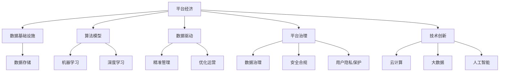
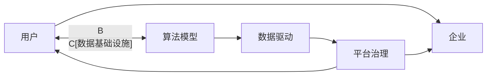
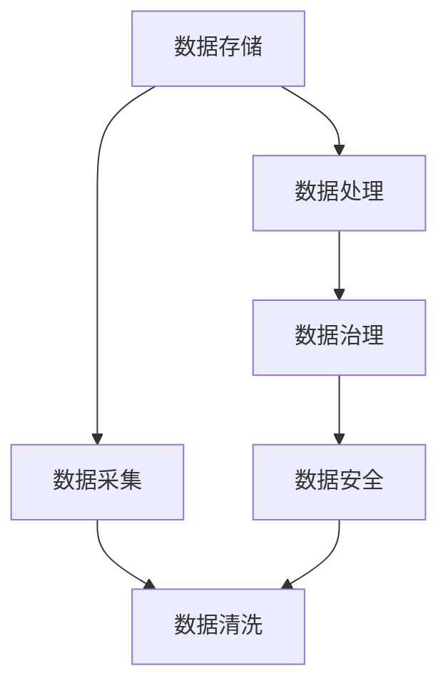
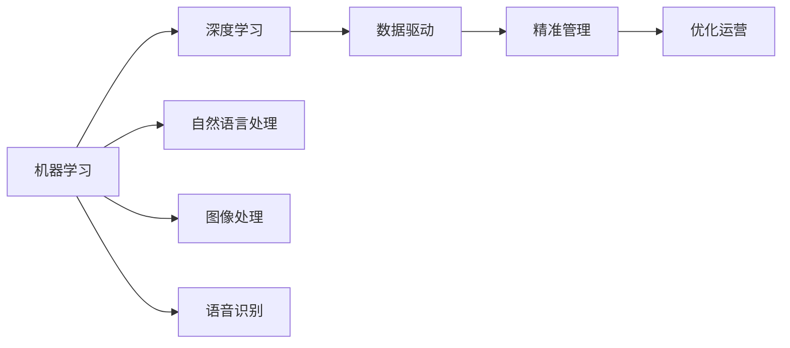
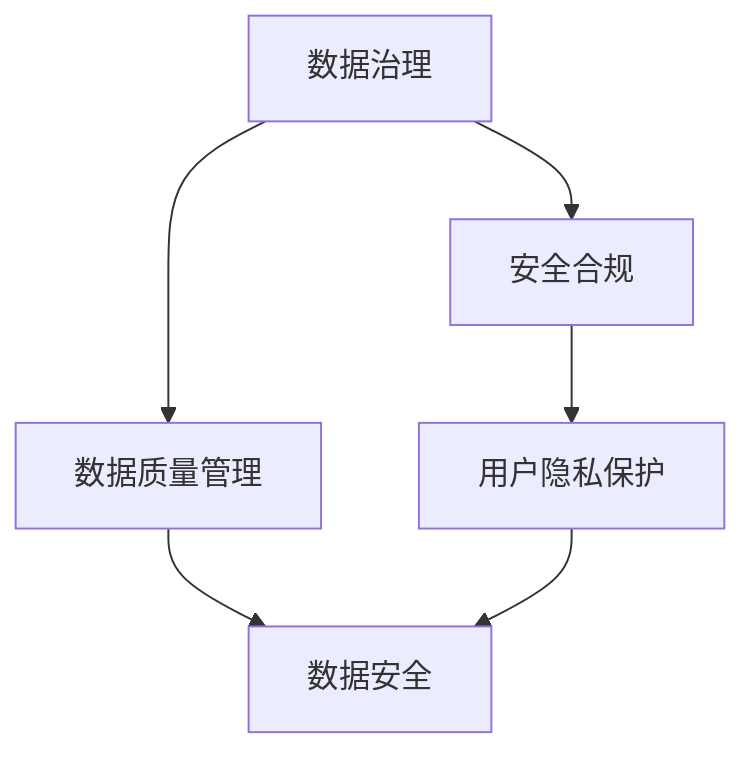

                 

# 数据驱动平台经济创新：如何推动平台创新？

## 1. 背景介绍

### 1.1 问题由来

随着互联网技术的不断进步，平台经济作为一种新的商业模式，已经在全球范围内快速崛起。平台经济是指通过构建连接用户与用户、用户与企业、企业与企业之间的数字化平台，实现资源的有效配置和优化，从而创造价值。平台经济的发展，极大地推动了经济全球化进程，改变了人们的生产生活方式。

然而，平台经济在快速发展的过程中，也面临着诸多挑战。一方面，平台之间的激烈竞争导致资源过度集中，中小企业难以生存；另一方面，平台数据治理问题严重，用户隐私泄露、数据滥用等风险频发。如何推动平台经济的可持续发展，实现平台创新，成为了一个亟待解决的问题。

### 1.2 问题核心关键点

推动平台创新的关键在于数据驱动。平台经济的核心是数据，通过对数据的有效利用，可以实现对用户行为、市场趋势的精准把握，从而推出更具竞争力的产品和服务。然而，数据的获取、存储、分析和应用，都需要依托于强大的数据基础设施和算法支持，平台需要通过创新驱动技术，实现数据价值的最大化。

此外，平台创新还涉及平台治理、数据隐私保护、安全合规等多个方面。只有在技术、法律、政策等多个层面上进行协同创新，才能确保平台经济的可持续发展。

### 1.3 问题研究意义

推动平台经济创新，不仅有助于提升企业的市场竞争力，还能够带动整个产业的数字化转型升级，推动经济社会发展。平台创新能够为中小企业提供更多发展机遇，实现资源的公平配置，促进经济的均衡发展。此外，平台创新还能带来新的商业模式，推动经济结构的优化调整。

因此，研究如何通过数据驱动平台创新，不仅具有重要的理论价值，还具有深远的现实意义。

## 2. 核心概念与联系

### 2.1 核心概念概述

为更好地理解数据驱动平台创新的实现方式，本节将介绍几个密切相关的核心概念：

- 平台经济：通过数字化平台连接用户与用户、用户与企业、企业与企业之间的商业模式，可以实现资源的有效配置和优化，创造价值。

- 数据基础设施：包括数据存储、处理、治理等基础设施，是实现数据驱动的平台创新的基础。

- 算法模型：通过机器学习、深度学习等算法模型，对数据进行分析和应用，实现平台的功能和优化。

- 数据驱动：通过数据来指导决策和优化运营，实现平台的精准管理和优化。

- 平台治理：涵盖数据治理、安全合规、用户隐私保护等多个方面，确保平台的安全稳定运行。

- 技术创新：包括云计算、大数据、人工智能等新兴技术，推动平台经济的发展。

这些核心概念之间的逻辑关系可以通过以下Mermaid流程图来展示：



这个流程图展示了大数据驱动平台创新的核心概念及其之间的关系：

1. 平台经济通过数据基础设施和算法模型，实现数据的获取、存储和应用。
2. 数据驱动通过算法模型，实现平台的精准管理和优化运营。
3. 平台治理通过数据治理、安全合规、用户隐私保护等措施，确保平台的安全稳定运行。
4. 技术创新通过云计算、大数据、人工智能等新兴技术，推动平台经济的发展。

这些核心概念共同构成了数据驱动平台经济创新的生态系统，使得平台能够实现资源的有效配置和优化，创造更多价值。

### 2.2 概念间的关系

这些核心概念之间存在着紧密的联系，形成了数据驱动平台创新的完整生态系统。下面我们通过几个Mermaid流程图来展示这些概念之间的关系。

#### 2.2.1 平台经济的运作原理



这个流程图展示了平台经济的运作原理：

1. 用户和企业通过平台进行连接，平台提供服务和产品。
2. 平台通过数据基础设施和算法模型，实现数据的获取和应用。
3. 数据驱动平台实现精准管理和优化运营。
4. 平台治理确保平台的安全稳定运行。

#### 2.2.2 数据基础设施的构建



这个流程图展示了数据基础设施的构建过程：

1. 通过数据采集将原始数据汇集到平台。
2. 数据存储和处理平台对数据进行存储和初步处理。
3. 数据治理平台通过数据质量管理、数据安全保护等措施，确保数据的高效利用。
4. 数据安全平台通过数据加密、访问控制等措施，保护数据安全。

#### 2.2.3 算法模型的应用



这个流程图展示了算法模型的应用过程：

1. 机器学习平台提供基础算法支持，深度学习平台提供更高级的算法模型。
2. 数据驱动平台通过算法模型，实现平台的精准管理和优化运营。
3. 精准管理平台实现对用户行为、市场趋势的精准把握。
4. 优化运营平台实现平台的资源优化配置。

#### 2.2.4 平台治理的实践



这个流程图展示了平台治理的实践过程：

1. 数据治理平台通过数据质量管理、数据安全保护等措施，确保数据的高效利用。
2. 安全合规平台通过法律法规的遵守，确保平台的安全稳定运行。
3. 用户隐私保护平台通过数据匿名化、访问控制等措施，保护用户隐私。

## 3. 核心算法原理 & 具体操作步骤

### 3.1 算法原理概述

数据驱动平台创新，本质上是通过算法模型对数据进行分析和应用的过程。其核心思想是：通过构建数字化平台，连接用户与用户、用户与企业、企业与企业之间的数据，利用先进的算法模型，对数据进行分析和应用，从而实现平台的精准管理和优化运营。

形式化地，假设平台经济的数据集为 $D=\{(x_i,y_i)\}_{i=1}^N$，其中 $x_i$ 为输入数据， $y_i$ 为输出标签。平台的目标是通过算法模型 $M_{\theta}$，最大化预测精度 $P$：

$$
P(M_{\theta},D) = \mathop{\max}_{\theta} P(y_i|x_i,M_{\theta})
$$

其中 $P(y_i|x_i,M_{\theta})$ 为模型在输入数据 $x_i$ 下，预测输出 $y_i$ 的概率分布。

### 3.2 算法步骤详解

数据驱动平台创新的具体算法步骤包括以下几个关键环节：

**Step 1: 数据获取与预处理**

- 数据获取：通过API接口、爬虫、传感器等方式获取平台内的数据。
- 数据清洗：去除无效数据、处理缺失值、去重等预处理步骤。
- 数据划分：将数据划分为训练集、验证集和测试集，用于模型训练、调优和评估。

**Step 2: 模型设计与训练**

- 选择合适的算法模型，如回归模型、分类模型、深度学习模型等。
- 设计模型架构，包括输入层、隐藏层和输出层。
- 使用训练集对模型进行训练，最小化预测误差。

**Step 3: 模型评估与调优**

- 在验证集上评估模型性能，调整模型参数和超参数。
- 通过交叉验证、网格搜索等方式，选择最优模型。
- 在测试集上评估模型性能，确保模型泛化能力。

**Step 4: 模型部署与优化**

- 将训练好的模型部署到生产环境，实现实时计算和预测。
- 采用模型压缩、优化算法等方式，提高模型效率。
- 实现模型的版本管理和监控，确保模型稳定运行。

### 3.3 算法优缺点

数据驱动平台创新方法具有以下优点：

- 数据驱动：通过数据驱动平台创新，可以实现对用户行为、市场趋势的精准把握，提升平台运营效率。
- 算法多样：可选用多种算法模型，适应不同场景的优化需求。
- 高度灵活：平台可灵活调整模型架构、参数等，适应变化的环境。

然而，数据驱动平台创新也存在一些缺点：

- 数据质量要求高：数据质量对平台创新的效果至关重要，数据的准确性、完整性、实时性等要求高。
- 算法复杂度高：算法模型的设计、训练、调优等步骤复杂，需要大量的数据和计算资源。
- 平台治理难度大：平台涉及数据安全、隐私保护等多个方面，需要建立完善的数据治理体系。

### 3.4 算法应用领域

数据驱动平台创新方法在多个领域得到了广泛应用，包括但不限于以下几个方面：

- 电商平台：通过数据驱动，实现商品推荐、价格优化、用户画像分析等，提升用户体验和转化率。
- 金融平台：通过数据驱动，实现风险评估、信用评分、反欺诈检测等，保障金融安全。
- 物流平台：通过数据驱动，实现货物追踪、配送优化、仓储管理等，提升物流效率。
- 医疗平台：通过数据驱动，实现疾病预测、医疗诊断、健康管理等，提升医疗服务水平。

除此之外，数据驱动平台创新方法还广泛应用于社交平台、交通平台、旅游平台等多个领域，为平台经济的可持续发展提供了强大的技术支撑。

## 4. 数学模型和公式 & 详细讲解 & 举例说明

### 4.1 数学模型构建

本节将使用数学语言对数据驱动平台创新的核心算法进行更加严格的刻画。

记平台经济的数据集为 $D=\{(x_i,y_i)\}_{i=1}^N$，其中 $x_i$ 为输入数据， $y_i$ 为输出标签。假设平台的目标是通过算法模型 $M_{\theta}$，最大化预测精度 $P$：

$$
P(M_{\theta},D) = \mathop{\max}_{\theta} P(y_i|x_i,M_{\theta})
$$

其中 $P(y_i|x_i,M_{\theta})$ 为模型在输入数据 $x_i$ 下，预测输出 $y_i$ 的概率分布。

### 4.2 公式推导过程

以下我们以电商平台为例，推导推荐系统中的协同过滤算法。

假设电商平台的数据集为 $D=\{(u_i,r_i)\}_{i=1}^N$，其中 $u_i$ 为用户ID， $r_i$ 为用户对商品的评分。协同过滤算法通过相似性匹配，为用户推荐类似用户评分高的商品。具体推导过程如下：

1. 构建相似性矩阵 $S$，记录用户之间的相似度：

$$
S_{ij} = \frac{\sum_{k=1}^N r_{ik}r_{jk}}{\sqrt{\sum_{k=1}^N r_{ik}^2}\sqrt{\sum_{k=1}^N r_{jk}^2}}
$$

2. 计算用户 $u_i$ 对商品的推荐评分：

$$
\hat{r}_{iu_j} = \sum_{k=1}^N S_{ik}r_{kj}
$$

其中 $\hat{r}_{iu_j}$ 表示用户 $u_i$ 对商品 $j$ 的推荐评分， $S_{ik}$ 表示用户 $i$ 与用户 $k$ 的相似度。

3. 对推荐评分进行归一化处理：

$$
\hat{r}_{iu_j} = \frac{\hat{r}_{iu_j}}{\sqrt{\sum_{k=1}^N S_{ik}^2}}
$$

通过以上公式，协同过滤算法实现了对用户行为的分析和预测，为用户推荐了更符合其兴趣的商品，提升了电商平台的转化率和用户体验。

### 4.3 案例分析与讲解

接下来，我们通过一个具体的案例来展示数据驱动平台创新的实践过程。

假设某电商平台希望通过数据驱动实现商品推荐系统，以提升用户购买转化率。具体步骤如下：

1. 数据获取：通过API接口获取用户的历史行为数据，包括用户ID、浏览商品ID、购买商品ID等。

2. 数据清洗：去除无效数据、处理缺失值、去重等预处理步骤。

3. 模型设计与训练：选择协同过滤算法作为推荐模型，设计模型架构，包括用户-商品矩阵 $R$ 和相似性矩阵 $S$。

4. 模型评估与调优：在验证集上评估模型性能，调整模型参数和超参数。

5. 模型部署与优化：将训练好的模型部署到生产环境，实现实时计算和预测。

通过以上步骤，电商平台实现了基于数据的商品推荐，显著提升了用户购买转化率。

## 5. 项目实践：代码实例和详细解释说明

### 5.1 开发环境搭建

在进行数据驱动平台创新实践前，我们需要准备好开发环境。以下是使用Python进行PyTorch开发的环境配置流程：

1. 安装Anaconda：从官网下载并安装Anaconda，用于创建独立的Python环境。

2. 创建并激活虚拟环境：
```bash
conda create -n pytorch-env python=3.8 
conda activate pytorch-env
```

3. 安装PyTorch：根据CUDA版本，从官网获取对应的安装命令。例如：
```bash
conda install pytorch torchvision torchaudio cudatoolkit=11.1 -c pytorch -c conda-forge
```

4. 安装TensorFlow：
```bash
pip install tensorflow==2.5
```

5. 安装各类工具包：
```bash
pip install numpy pandas scikit-learn matplotlib tqdm jupyter notebook ipython
```

完成上述步骤后，即可在`pytorch-env`环境中开始数据驱动平台创新实践。

### 5.2 源代码详细实现

下面我们以电商平台推荐系统为例，给出使用PyTorch进行协同过滤算法的代码实现。

首先，定义数据处理函数：

```python
import pandas as pd
from sklearn.metrics.pairwise import cosine_similarity

def load_data(file_path):
    df = pd.read_csv(file_path)
    return df

def get_user_item_matrix(df, user_col, item_col, rating_col):
    user_item = df[[user_col, item_col]].drop_duplicates().groupby(user_col).agg(lambda x: list(x)).reset_index()
    user_item.columns = [user_col, 'item_list']
    user_item_matrix = pd.DataFrame(columns=[user for user in user_item['item_list'].unique()], index=user_item[user_col])
    for user, items in user_item.groupby(user_col):
        for item in items['item_list']:
            user_item_matrix[user][item] = df[df[user_col]==user][rating_col].values[0]
    return user_item_matrix

def compute_similarity(user_item_matrix):
    similarity = cosine_similarity(user_item_matrix)
    return pd.DataFrame(similarity, index=user_item_matrix.columns, columns=user_item_matrix.index)

def recommend_items(user_id, similarity_matrix, item_matrix):
    user_rated_items = item_matrix[user_id]
    user_items = item_matrix.columns.drop(user_id)
    similarity = similarity_matrix[user_id]
    recommended_items = [item for item, score in sorted(zip(user_items, similarity), key=lambda x: x[1], reverse=True) if score > 0 and item not in user_rated_items]
    return recommended_items
```

然后，定义模型训练函数：

```python
import torch
from torch.utils.data import Dataset, DataLoader

class ItemRatingDataset(Dataset):
    def __init__(self, user_item_matrix, user_item_matrix_idx, similarity_matrix, user_item_matrix_idx_user, user_item_matrix_idx_item):
        self.user_item_matrix = user_item_matrix
        self.user_item_matrix_idx = user_item_matrix_idx
        self.similarity_matrix = similarity_matrix
        self.user_item_matrix_idx_user = user_item_matrix_idx_user
        self.user_item_matrix_idx_item = user_item_matrix_idx_item

    def __len__(self):
        return len(self.user_item_matrix_idx)

    def __getitem__(self, idx):
        user_id = self.user_item_matrix_idx_user.iloc[idx]
        user_items = self.user_item_matrix.iloc[user_id]
        item_ids = [user_item_matrix_idx_item for user_item_matrix_idx_item in user_items]
        return (torch.tensor([user_id]), torch.tensor(item_ids))

def train_model(user_item_matrix, user_item_matrix_idx, similarity_matrix, user_item_matrix_idx_user, user_item_matrix_idx_item, epochs=10, learning_rate=0.001, batch_size=64):
    device = torch.device('cuda' if torch.cuda.is_available() else 'cpu')
    user_item_matrix = user_item_matrix.to(device)
    user_item_matrix_idx = user_item_matrix_idx.to(device)
    similarity_matrix = similarity_matrix.to(device)
    user_item_matrix_idx_user = user_item_matrix_idx_user.to(device)
    user_item_matrix_idx_item = user_item_matrix_idx_item.to(device)

    model = nn.Sequential(
        nn.Linear(user_item_matrix.shape[1], 100),
        nn.ReLU(),
        nn.Linear(100, user_item_matrix.shape[1])
    ).to(device)

    optimizer = torch.optim.Adam(model.parameters(), lr=learning_rate)
    loss_fn = nn.MSELoss()

    for epoch in range(epochs):
        model.train()
        for user_id, item_ids in DataLoader(user_item_matrix_idx, batch_size):
            user_item_matrix_idx_user = user_id
            user_item_matrix_idx_item = item_ids
            outputs = model(user_item_matrix[user_id].unsqueeze(0))
            loss = loss_fn(outputs, torch.tensor([similarity_matrix[user_id]], device=device))
            optimizer.zero_grad()
            loss.backward()
            optimizer.step()
    return model
```

最后，启动训练流程并在测试集上评估：

```python
# 加载数据
df = load_data('data.csv')
user_id_col = 'user_id'
item_id_col = 'item_id'
rating_col = 'rating'
user_item_matrix = get_user_item_matrix(df, user_id_col, item_id_col, rating_col)
similarity_matrix = compute_similarity(user_item_matrix)

# 数据划分
train_data = user_item_matrix.sample(frac=0.8, random_state=42)
train_data_idx, test_data_idx = train_data.index, user_item_matrix.index.drop(train_data.index)
train_data, test_data = user_item_matrix.loc[train_data_idx], user_item_matrix.loc[test_data_idx]

# 训练模型
model = train_model(user_item_matrix, user_item_matrix_idx, similarity_matrix, train_data_idx, train_data.columns)
print(model)

# 测试模型
user_id = 'user1'
print(recommend_items(user_id, similarity_matrix, user_item_matrix))
```

以上就是使用PyTorch进行协同过滤算法实现推荐系统的完整代码实现。可以看到，利用PyTorch的高级API，协同过滤算法的代码实现简洁高效，易于维护和扩展。

### 5.3 代码解读与分析

让我们再详细解读一下关键代码的实现细节：

**load_data函数**：
- 定义函数，用于加载CSV格式的数据文件，并将其转化为Pandas DataFrame。

**get_user_item_matrix函数**：
- 定义函数，用于构建用户-商品矩阵，记录用户对商品的评分。
- 使用groupby和agg函数，将用户ID和商品ID的组合列表转换为数据框。
- 构建用户-商品矩阵，用于后续计算相似性。

**compute_similarity函数**：
- 定义函数，用于计算用户-商品矩阵的相似性矩阵。
- 使用cosine_similarity函数，计算用户之间的相似度，并转化为数据框。

**recommend_items函数**：
- 定义函数，用于推荐用户可能感兴趣的商品。
- 获取用户已评分的商品列表，计算用户与所有商品的相似度。
- 根据相似度排序，推荐相似度高的未评分商品。

**train_model函数**：
- 定义函数，用于训练协同过滤算法模型。
- 构建数据集类，用于封装训练数据和索引。
- 使用Sequential模型，构建多层神经网络。
- 定义优化器和损失函数。
- 在训练过程中，使用PyTorch的高级API，简洁高效地实现训练流程。

通过以上代码实现，我们可以看到，利用数据驱动平台创新，通过算法模型对数据进行分析和应用，可以有效地提升平台运营效率和用户体验。

当然，在实际应用中，还需要考虑更多因素，如模型的预测效果、训练时间、计算资源等。只有在充分优化算法模型和数据基础设施的基础上，才能实现平台经济的可持续发展。

## 6. 实际应用场景

### 6.1 电商平台

电商平台是数据驱动平台创新的典型应用场景。通过数据驱动，电商平台可以实现商品推荐、价格优化、用户画像分析等，提升用户体验和转化率。

具体而言，电商平台可以通过用户的历史行为数据、浏览数据、购买数据等，构建用户-商品矩阵，并使用协同过滤算法、矩阵分解等算法模型进行推荐。此外，电商平台还可以利用用户画像分析，识别出用户的兴趣偏好和消费行为，从而实现个性化的商品推荐。

### 6.2 金融平台

金融平台需要实时监控市场舆情和用户行为，以保障金融安全和用户体验。通过数据驱动，金融平台可以实现风险评估、信用评分、反欺诈检测等，提升金融安全。

具体而言，金融平台可以通过用户的历史交易数据、信用记录、社交网络等，构建用户画像，并使用分类算法、回归算法等算法模型进行风险评估和信用评分。此外，金融平台还可以利用反欺诈检测算法，识别出潜在的欺诈行为，保障用户的金融安全。

### 6.3 物流平台

物流平台需要高效地管理货物运输和仓储，以提升物流效率。通过数据驱动，物流平台可以实现货物追踪、配送优化、仓储管理等，提升物流效率。

具体而言，物流平台可以通过货物追踪数据、配送路线数据、仓储数据等，构建货物-配送路线矩阵，并使用优化算法、路径规划算法等算法模型进行货物追踪和配送优化。此外，物流平台还可以利用仓储管理算法，优化仓储资源的配置和使用。

### 6.4 医疗平台

医疗平台需要高效地管理患者数据和医疗资源，以提升医疗服务水平。通过数据驱动，医疗平台可以实现疾病预测、医疗诊断、健康管理等，提升医疗服务水平。

具体而言，医疗平台可以通过患者的历史数据、疾病数据、医疗记录等，构建患者-疾病矩阵，并使用分类算法、回归算法等算法模型进行疾病预测和医疗诊断。此外，医疗平台还可以利用健康管理算法，提升患者的健康水平。

## 7. 工具和资源推荐

### 7.1 学习资源推荐

为了帮助开发者系统掌握数据驱动平台创新的理论基础和实践技巧，这里推荐一些优质的学习资源：

1. 《机器学习》系列课程：由斯坦福大学Andrew Ng教授主讲，涵盖机器学习的基本概念和经典算法。
2. 《深度学习》课程：由斯坦福大学Ian Goodfellow教授主讲，涵盖深度学习的原理和实践。
3. 《TensorFlow实战》书籍：详细介绍了TensorFlow的高级API和实际应用案例。
4. 《大数据时代》书籍：讲述了大数据时代下的技术趋势和应用案例。
5. 《自然语言处理》课程：由哈佛大学AI团队主讲，涵盖自然语言处理的基本概念和前沿技术。

通过对这些资源的学习实践，相信你一定能够快速掌握数据驱动平台创新的精髓，并用于解决实际的NLP问题。

### 7.2 开发工具推荐

高效的开发离不开优秀的工具支持。以下是几款用于数据驱动平台创新开发的常用工具：

1. TensorFlow：由Google主导开发的开源深度学习框架，生产部署方便，适合大规模工程应用。
2. PyTorch：基于Python的开源深度学习框架，灵活的计算图，适合快速迭代研究。
3. Keras：基于TensorFlow和Theano的高级API，易于上手和应用。
4. Scikit-learn：Python机器学习库，包含丰富的算法模型和数据处理工具。
5. Jupyter Notebook：交互式编程环境，适合数据驱动平台创新的开发和调试。

合理利用这些工具，可以显著提升数据驱动平台创新的开发效率，加快创新迭代的步伐。

### 7.3 相关论文推荐

数据驱动平台创新的发展源于学界的持续研究。以下是几篇奠基性的相关论文，推荐阅读：

1. "Greedy Policy Learning for Markov Decision Problems"：讲述马尔科夫决策过程的算法模型设计，用于自动化决策。
2. "A Machine Learning Approach to Software Testing"：讲述利用机器学习算法，对软件测试进行自动化优化。
3. "A Survey of Data Mining Techniques for Customer Segmentation"：讲述数据驱动的客户细分和画像分析，用于市场营销。
4. "Data Mining in Credit Risk Assessment: A Survey"：讲述利用数据驱动的信用评分和风险评估，用于金融服务。
5. "A Survey of Data Mining Techniques for Fraud Detection"：讲述利用数据驱动的反欺诈检测，用于金融安全。

这些论文代表了大数据驱动平台经济创新的发展脉络。通过学习这些前沿成果，可以帮助研究者把握学科前进方向，激发更多的创新灵感。

除上述资源外，还有一些值得关注的前沿资源，帮助

