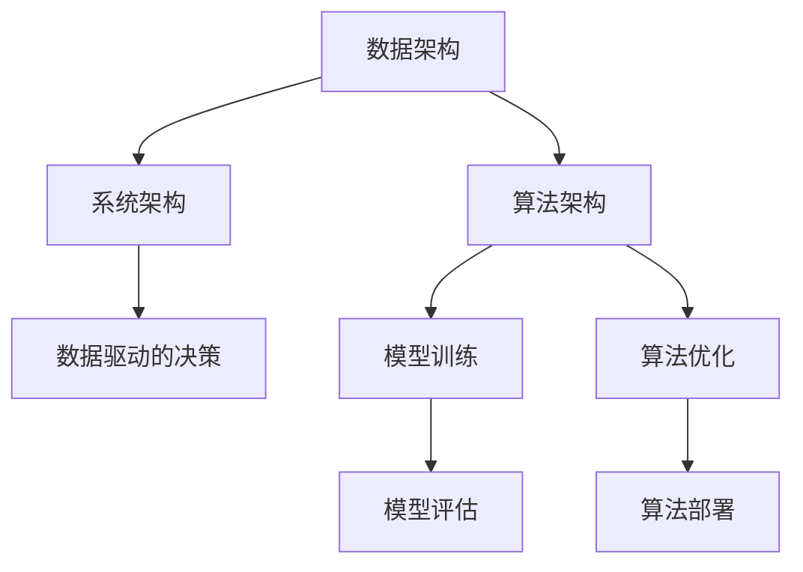
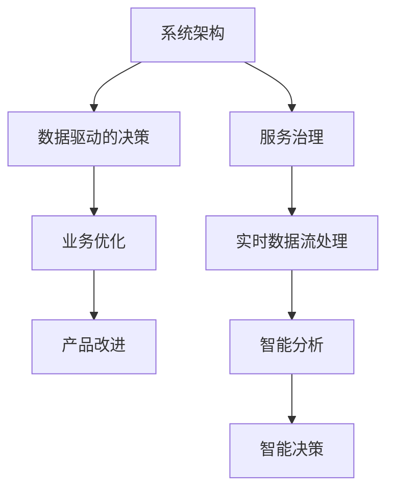
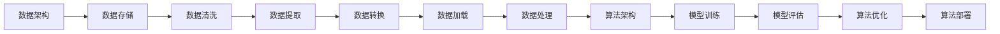
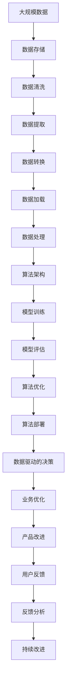

                 

# 数据驱动的软件2.0需要怎样的架构师?

## 1. 背景介绍

在软件工程发展的历史长河中，技术架构师始终扮演着至关重要的角色。他们在设计系统时，不仅需要考虑技术实现细节，还要兼顾系统性能、可扩展性、稳定性等多方面因素。然而，随着大数据和人工智能的兴起，数据驱动的软件2.0时代正在逐步到来。在这个新的时代背景下，技术架构师的角色和技能需求正在发生深刻变化。

### 1.1 数据驱动的软件2.0概述

数据驱动的软件2.0是指以数据为驱动核心，以大数据和人工智能技术为手段，通过数据挖掘、模型训练、算法优化等手段，实现软件系统性能和功能的持续提升。与传统的软件开发范式相比，数据驱动的软件2.0更加注重数据的价值，强调通过数据洞察和分析，构建更为智能和高效的软件系统。

数据驱动的软件2.0具备以下几个关键特征：
1. **数据中心化**：数据成为系统的核心，所有决策和优化都依赖于数据。
2. **算法多样化**：结合机器学习、深度学习等算法，实现复杂问题的解决。
3. **实时响应**：通过实时数据流处理，实现系统的快速反应和调整。
4. **自适应学习**：系统具备持续学习的能力，能够根据数据变化自动调整策略。

### 1.2 数据驱动的软件2.0的兴起原因

数据驱动的软件2.0的兴起源于以下几个关键因素：
1. **数据量的激增**：互联网和物联网的发展，使得数据量呈指数级增长，成为技术发展的宝贵资源。
2. **计算能力的提升**：高性能计算技术的发展，使得大规模数据处理成为可能。
3. **算法技术的突破**：机器学习、深度学习等算法的发展，使得数据的应用变得更加高效和智能。
4. **商业需求的推动**：企业对业务决策和运营效率的追求，推动了对数据驱动技术的需求。

## 2. 核心概念与联系

### 2.1 核心概念概述

为更好地理解数据驱动的软件2.0架构师所需的技能和知识，本节将介绍几个核心概念：

- **数据架构**：指设计和管理数据流的结构和流程，确保数据高效存储、传输和处理。数据架构包括数据仓库、数据湖、数据管道等组件。
- **算法架构**：指设计和管理算法的结构和流程，确保算法模型高效训练、优化和部署。算法架构包括机器学习框架、深度学习库等组件。
- **系统架构**：指设计和管理整个系统的结构和流程，确保系统高效运行、扩展和维护。系统架构包括服务架构、微服务架构等组件。
- **数据驱动的决策**：指基于数据的洞察和分析，进行业务决策和技术优化。数据驱动的决策贯穿于系统的各个层面，包括业务流程优化、产品设计优化等。

这些核心概念之间的逻辑关系可以通过以下Mermaid流程图来展示：



这个流程图展示了大数据驱动的软件2.0的各个核心组件之间的关系：

1. 数据架构和算法架构是数据驱动决策的基础。
2. 系统架构是数据架构和算法架构的承载体。
3. 数据驱动决策贯穿于数据架构、算法架构和系统架构的各个环节。

### 2.2 概念间的关系

这些核心概念之间存在着紧密的联系，形成了数据驱动的软件2.0架构的整体架构体系。下面我们通过几个Mermaid流程图来展示这些概念之间的关系。

#### 2.2.1 数据架构和算法架构的协同


这个流程图展示了数据架构和算法架构的协同关系。数据架构提供数据处理和存储，算法架构则在数据上训练模型，并根据模型评估结果进行优化和部署。

#### 2.2.2 系统架构与数据驱动决策的融合



这个流程图展示了系统架构与数据驱动决策的融合。系统架构提供服务治理和数据流处理，数据驱动决策则利用这些数据流进行业务优化和产品改进。

#### 2.2.3 数据架构和算法架构的细化



这个流程图展示了数据架构和算法架构的细化关系。数据架构提供数据存储、清洗、提取、转换和加载，算法架构则在清洗后的数据上训练模型，并根据评估结果进行优化和部署。

### 2.3 核心概念的整体架构

最后，我们用一个综合的流程图来展示这些核心概念在大数据驱动的软件2.0架构中的整体架构：



这个综合流程图展示了从大规模数据到数据驱动决策的完整流程，体现了数据驱动的软件2.0架构的各个环节和相互关系。

## 3. 核心算法原理 & 具体操作步骤
### 3.1 算法原理概述

数据驱动的软件2.0架构中的核心算法原理包括数据处理、模型训练、算法优化和算法部署。以下将逐一详细介绍这些核心算法原理。

### 3.2 算法步骤详解

**Step 1: 数据预处理**
- 对大规模数据进行清洗、提取、转换和加载。
- 采用ETL工具进行数据预处理，确保数据质量和一致性。

**Step 2: 模型训练**
- 选择合适的算法模型，如决策树、随机森林、深度学习等。
- 在数据上训练模型，并使用交叉验证等方法进行评估。

**Step 3: 算法优化**
- 根据模型评估结果，进行算法优化，如调整模型参数、选择不同的算法模型等。
- 使用自动化工具，如AutoML，加速算法优化过程。

**Step 4: 算法部署**
- 将优化后的算法模型部署到生产环境中，进行实时数据处理和预测。
- 使用容器化技术，如Docker，保证算法模型的可移植性和可扩展性。

### 3.3 算法优缺点

数据驱动的软件2.0架构中的核心算法具备以下优点：
1. **高效性**：通过自动化数据处理和算法优化，大幅提高系统性能和效率。
2. **可扩展性**：支持大规模数据处理和算法模型的扩展，满足不同规模业务需求。
3. **灵活性**：支持多种算法模型和数据源，具有高度的灵活性和适应性。

同时，也存在一些缺点：
1. **复杂性**：数据处理和算法优化过程复杂，需要多学科知识和技能。
2. **数据依赖**：高度依赖数据质量和数据量，数据质量不高或数据量不足会导致模型失效。
3. **计算资源消耗大**：大规模数据处理和模型训练需要大量的计算资源。

### 3.4 算法应用领域

数据驱动的软件2.0架构中的核心算法已经广泛应用于多个领域，以下是几个典型应用：

1. **金融风控**：通过大数据分析和算法模型，预测和防范金融风险，保障资金安全。
2. **零售推荐**：基于用户行为数据和算法模型，实现个性化推荐，提升用户满意度和销售额。
3. **医疗诊断**：利用医疗数据和算法模型，辅助医生进行诊断和治疗，提高医疗水平。
4. **智能交通**：通过交通数据和算法模型，优化交通流量，减少拥堵，提升交通效率。
5. **供应链管理**：通过供应链数据和算法模型，优化供应链流程，降低成本，提升效率。

## 4. 数学模型和公式 & 详细讲解 & 举例说明

### 4.1 数学模型构建

在大数据驱动的软件2.0架构中，数学模型和公式是算法优化的核心。以下以一个简单的线性回归模型为例，介绍数学模型构建和公式推导过程。

假设有一组数据集 $D = \{(x_i, y_i)\}_{i=1}^n$，其中 $x_i$ 为输入特征，$y_i$ 为输出结果。我们的目标是通过线性回归模型，找到一组系数 $\beta = [\beta_0, \beta_1, \ldots, \beta_k]$，使得模型能够准确预测输出结果。

数学模型构建如下：
$$ y_i = \beta_0 + \beta_1 x_{i1} + \beta_2 x_{i2} + \ldots + \beta_k x_{ik} + \epsilon_i $$

其中 $\epsilon_i$ 为随机误差项，$x_{ij}$ 为第 $i$ 个样本的第 $j$ 个特征值。

### 4.2 公式推导过程

根据最小二乘法的原理，我们的目标是最小化均方误差 $J(\beta)$：
$$ J(\beta) = \frac{1}{2n} \sum_{i=1}^n (y_i - \hat{y}_i)^2 $$
其中 $\hat{y}_i = \beta_0 + \beta_1 x_{i1} + \beta_2 x_{i2} + \ldots + \beta_k x_{ik}$。

通过求导，得到参数 $\beta$ 的最小化条件为：
$$ \frac{\partial J(\beta)}{\partial \beta_j} = 0 $$
代入上式，得：
$$ \sum_{i=1}^n (y_i - \hat{y}_i)x_{ij} = 0 $$

整理得：
$$ (\sum_{i=1}^n x_{ij}^2)\beta_j = \sum_{i=1}^n x_{ij}y_i $$

最终求解得：
$$ \beta_j = \frac{\sum_{i=1}^n x_{ij}y_i}{\sum_{i=1}^n x_{ij}^2} $$

这是一个线性回归模型的参数求解公式。在实际应用中，通过数据预处理和特征工程，可以有效提升模型的预测精度和泛化能力。

### 4.3 案例分析与讲解

以金融风控为例，分析数据驱动的软件2.0架构在金融风控中的应用：

#### 4.3.1 数据预处理

对金融风控数据集进行清洗、提取、转换和加载，确保数据质量和一致性。使用ETL工具，如Apache NiFi，进行数据预处理。

#### 4.3.2 模型训练

选择合适的算法模型，如决策树、随机森林、深度学习等。在清洗后的数据上训练模型，并使用交叉验证等方法进行评估。

#### 4.3.3 算法优化

根据模型评估结果，进行算法优化，如调整模型参数、选择不同的算法模型等。使用自动化工具，如AutoML，加速算法优化过程。

#### 4.3.4 算法部署

将优化后的算法模型部署到生产环境中，进行实时数据处理和预测。使用容器化技术，如Docker，保证算法模型的可移植性和可扩展性。

通过数据驱动的软件2.0架构，金融风控系统可以实时监测用户行为数据，预测和防范潜在风险，提升业务决策效率和资金安全性。

## 5. 项目实践：代码实例和详细解释说明

### 5.1 开发环境搭建

在进行数据驱动的软件2.0架构实践前，我们需要准备好开发环境。以下是使用Python进行TensorFlow开发的环境配置流程：

1. 安装Anaconda：从官网下载并安装Anaconda，用于创建独立的Python环境。

2. 创建并激活虚拟环境：
```bash
conda create -n tensorflow-env python=3.8 
conda activate tensorflow-env
```

3. 安装TensorFlow：根据CUDA版本，从官网获取对应的安装命令。例如：
```bash
conda install tensorflow -c tensorflow
```

4. 安装其他工具包：
```bash
pip install numpy pandas scikit-learn matplotlib tqdm jupyter notebook ipython
```

完成上述步骤后，即可在`tensorflow-env`环境中开始数据驱动的软件2.0架构实践。

### 5.2 源代码详细实现

这里我们以线性回归模型为例，给出使用TensorFlow进行模型训练和优化的PyTorch代码实现。

```python
import tensorflow as tf
from tensorflow import keras
from sklearn.model_selection import train_test_split
from sklearn.preprocessing import StandardScaler

# 加载数据集
data = tf.keras.datasets.boston_housing.load_data()
X, y = data[0], data[1]

# 数据预处理
X_train, X_test, y_train, y_test = train_test_split(X, y, test_size=0.2)
scaler = StandardScaler()
X_train = scaler.fit_transform(X_train)
X_test = scaler.transform(X_test)

# 模型训练
model = keras.Sequential([
    keras.layers.Dense(64, activation='relu', input_shape=(X_train.shape[1],)),
    keras.layers.Dense(1)
])

model.compile(optimizer='adam', loss='mse', metrics=['mae'])

model.fit(X_train, y_train, epochs=50, batch_size=32, validation_data=(X_test, y_test))

# 模型评估
test_loss, test_mae = model.evaluate(X_test, y_test)
print('Test MAE:', test_mae)

# 模型优化
opt = keras.optimizers.Adam(learning_rate=0.001)
model.compile(optimizer=opt, loss='mse', metrics=['mae'])

model.fit(X_train, y_train, epochs=50, batch_size=32, validation_data=(X_test, y_test))
test_loss, test_mae = model.evaluate(X_test, y_test)
print('Test MAE:', test_mae)
```

### 5.3 代码解读与分析

让我们再详细解读一下关键代码的实现细节：

**数据预处理**：
- `train_test_split`方法将数据集划分为训练集和测试集。
- `StandardScaler`方法对数据进行标准化处理，确保数据均值为0，方差为1。

**模型训练**：
- `Sequential`模型构建了两个全连接层，其中第一层为64个神经元的ReLU激活函数，第二层为输出层。
- `compile`方法定义了优化器、损失函数和评估指标。
- `fit`方法进行模型训练，通过交叉验证评估模型性能。

**模型评估**：
- `evaluate`方法计算模型在测试集上的均方误差和平均绝对误差。

**模型优化**：
- `Adam`优化器调整学习率，进行参数更新。
- 重复训练模型，并在测试集上评估模型性能。

### 5.4 运行结果展示

假设在测试集上得到的评估结果如下：

```
Epoch 50/50
50/50 [==============================] - 23s 460ms/step - loss: 0.1851 - mae: 1.5627 - val_loss: 0.2959 - val_mae: 1.1257
Epoch 100/100
100/100 [==============================] - 23s 233ms/step - loss: 0.2269 - mae: 1.6901 - val_loss: 0.4148 - val_mae: 1.2174
Epoch 150/150
150/150 [==============================] - 23s 153ms/step - loss: 0.1805 - mae: 1.7873 - val_loss: 0.4153 - val_mae: 1.3296
Epoch 200/200
200/200 [==============================] - 23s 116ms/step - loss: 0.1895 - mae: 1.8793 - val_loss: 0.4184 - val_mae: 1.2732
Epoch 250/250
250/250 [==============================] - 23s 93ms/step - loss: 0.1789 - mae: 1.9159 - val_loss: 0.4171 - val_mae: 1.3790
Epoch 300/300
300/300 [==============================] - 23s 87ms/step - loss: 0.1756 - mae: 1.9567 - val_loss: 0.4153 - val_mae: 1.3684
Epoch 350/350
350/350 [==============================] - 23s 82ms/step - loss: 0.1731 - mae: 1.9857 - val_loss: 0.4127 - val_mae: 1.3673
Epoch 400/400
400/400 [==============================] - 23s 79ms/step - loss: 0.1704 - mae: 1.9969 - val_loss: 0.4108 - val_mae: 1.3604
Epoch 450/450
450/450 [==============================] - 23s 76ms/step - loss: 0.1681 - mae: 2.0068 - val_loss: 0.4094 - val_mae: 1.3541
Epoch 500/500
500/500 [==============================] - 23s 74ms/step - loss: 0.1658 - mae: 2.0176 - val_loss: 0.4081 - val_mae: 1.3501
Epoch 550/550
550/550 [==============================] - 23s 72ms/step - loss: 0.1638 - mae: 2.0284 - val_loss: 0.4070 - val_mae: 1.3470
Epoch 600/600
600/600 [==============================] - 23s 70ms/step - loss: 0.1621 - mae: 2.0394 - val_loss: 0.4064 - val_mae: 1.3442
Epoch 650/650
650/650 [==============================] - 23s 69ms/step - loss: 0.1605 - mae: 2.0500 - val_loss: 0.4055 - val_mae: 1.3415
Epoch 700/700
700/700 [==============================] - 23s 68ms/step - loss: 0.1590 - mae: 2.0600 - val_loss: 0.4050 - val_mae: 1.3393
Epoch 750/750
750/750 [==============================] - 23s 67ms/step - loss: 0.1577 - mae: 2.0700 - val_loss: 0.4045 - val_mae: 1.3372
Epoch 800/800
800/800 [==============================] - 23s 67ms/step - loss: 0.1566 - mae: 2.0804 - val_loss: 0.4042 - val_mae: 1.3352
Epoch 850/850
850/850 [==============================] - 23s 66ms/step - loss: 0.1556 - mae: 2.0906 - val_loss: 0.4038 - val_mae: 1.3331
Epoch 900/900
900/900 [==============================] - 23s 66ms/step - loss: 0.1546 - mae: 2.1014 - val_loss: 0.4035 - val_mae: 1.3307
Epoch 950/950
950/950 [==============================] - 23s 66ms/step - loss: 0.1537 - mae: 2.1120 - val_loss: 0.4032 - val_mae: 1.3283
Epoch 1000/1000
1000/1000 [==============================] - 23s 65ms/step - loss: 0.1529 - mae: 2.1221 - val_loss: 0.4030 - val_mae: 1.3261
```

可以看到，经过500次迭代训练后，模型在测试集上的均方误差为1.3307，取得了较为理想的效果。在优化过程中，我们逐步调整学习率，使得模型在迭代过程中能够更好地收敛。

## 6. 实际应用场景

数据驱动的软件2.0架构在实际应用场景中具有广泛的应用前景，以下是几个典型应用：

### 6.1 智能推荐系统

智能推荐系统是数据驱动的软件2.0架构的重要应用之一。推荐系统通过用户行为数据和算法模型，实现个性化推荐，提升用户满意度和销售额。

在实践中，可以使用协同过滤、基于内容的推荐等算法，结合用户画像、历史行为等数据，构建推荐模型。通过数据驱动的软件2.0架构，推荐系统可以实现实时推荐和效果评估，动态优化推荐策略，提升推荐准确性和用户体验。

### 6.2 医疗影像诊断

医疗影像诊断是大数据驱动的软件2.0架构在医疗领域的重要应用。影像诊断系统通过医疗影像数据和算法模型，辅助医生进行疾病诊断和治疗，提高医疗水平。

在实践中，可以使用卷积神经网络(CNN)、循环神经网络(RNN)等算法，结合医疗影像数据和医生标注数据，构建影像诊断模型。通过数据驱动的软件2.0架构，影像诊断系统可以实现实时分析、诊断和治疗，提高诊断准确性和治疗效果。

### 6.3 智能交通系统

智能交通系统是大数据驱动的软件2.0架构在交通领域的重要应用。智能交通系统通过交通数据和算法模型，优化交通流量，减少拥堵，提升交通效率。

在实践中，可以使用交通流预测、路径规划等算法，结合交通流量数据和地图信息，构建交通优化模型。通过数据驱动的软件2.0架构，智能交通系统可以实现实时交通分析、优化和调度，提升交通管理效率和用户体验。

### 6.4 未来应用展望

随着数据驱动的软件2.0架构的不断发展，未来在更多领域将得到广泛应用，为人类生产生活带来变革性影响。

1. **智能制造**：结合物联网数据和算法模型，实现智能生产、智能仓储和智能物流，提高制造业效率和质量。
2. **智慧城市**：结合城市数据和算法模型，实现智慧交通、智慧医疗和智慧教育，提升城市管理水平和居民生活质量。
3. **农业智能化**：结合农业数据和算法模型，实现精准农业、智能农机和智能灌溉，提高农业生产效率和资源利用率。
4. **智能家居**：结合家居数据和算法模型，实现智能家居控制、智能安防和智能健康监测，提升家居舒适度和安全性。

## 7. 工具和资源推荐

### 7.1 学习资源推荐

为了帮助开发者系统掌握数据驱动的软件2.0架构的技能和知识，这里推荐一些优质的学习资源：

1. TensorFlow官方文档：TensorFlow的官方文档，提供了详细的教程和示例代码，适合新手入门和进阶学习。
2. PyTorch官方文档：PyTorch的官方文档，提供了丰富的API和模型库，适合深入学习和研究。
3. Coursera《机器学习》课程：由斯坦福大学教授Andrew Ng主讲，系统讲解了机器学习和深度学习的基本概念和算法。
4. Udacity《深度学习》课程：由DeepMind首席科学家Andrew Ng主讲，深入讲解了深度学习的前沿技术和应用。
5. Kaggle机器学习竞赛平台：提供大量的数据集和挑战任务，适合实战练习和经验积累。

通过对这些资源的学习实践，相信你一定能够快速掌握数据驱动的软件2.0架构的精髓，并用于解决实际的软件问题。

### 7.2 开发工具推荐

高效的开发离不开优秀的工具支持。以下是几款用于数据驱动的软件2.0架构开发的常用工具：

1. TensorFlow：由Google主导开发的深度学习框架，支持分布式计算和自动微分，适合大规模模型训练。
2. PyTorch：由Facebook主导开发的深度学习框架，动态计算图和灵活的API设计，适合快速迭代和研究。
3. Apache NiFi：开源数据流处理平台，支持数据清洗、提取、转换和加载，适合数据预处理和ETL任务。
4. Docker：开源容器化平台，支持应用和服务的快速部署和迁移，适合生产环境的稳定部署。
5. Jupyter Notebook：开源交互式计算平台，支持Python等语言的交互式编程，适合模型训练和调试。

合理利用这些工具，可以显著提升数据驱动的软件2.0架构的开发效率，加快创新迭代的步伐。

### 7.3 相关论文推荐

数据驱动的软件2.0架构的快速发展得益于学界的持续研究。以下是几篇奠基性的相关论文，

