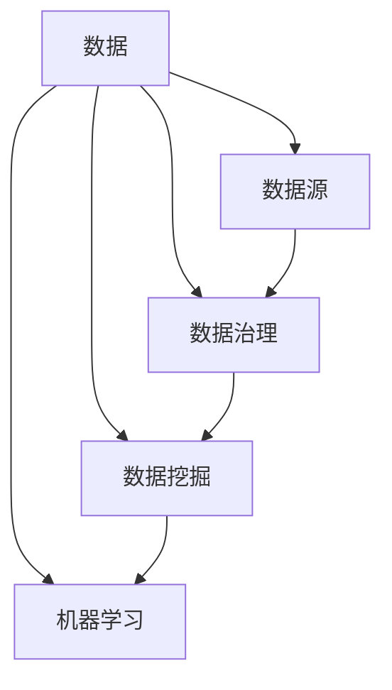

                 

# 数据：21世纪的石油，掌握数据才能掌握未来

在21世纪，数据已经成为推动经济增长和社会进步的重要资源，被称为“21世纪的石油”。数据科学和机器学习的发展，正在改变各行各业的运作模式，成为全球竞争力的重要指标。本文将系统地探讨数据的本质、作用以及如何有效利用数据资源，帮助读者深入理解数据的重要性，并掌握数据管理的核心技术。

## 1. 背景介绍

### 1.1 数据的重要性

随着数字化的不断深入，数据无处不在，成为推动社会进步和经济发展的新引擎。企业利用数据洞察用户需求、优化运营流程、提升服务质量，实现数字化转型；政府部门通过数据驱动决策，提高社会治理效能；学术界运用大数据方法，开展前沿研究，突破科学难题。数据不仅改变了人们的生活方式，也重塑了整个社会的运行模式。

数据的重要性体现在以下几个方面：

- **决策支持**：数据提供事实依据，帮助决策者进行科学决策。
- **运营优化**：通过数据监测和分析，企业能够优化生产流程，降低成本，提高效率。
- **市场洞察**：大数据分析揭示市场趋势，帮助企业制定精准的市场策略。
- **创新驱动**：数据驱动的创新加速技术进步，催生新的商业模式和产业生态。

### 1.2 数据驱动的变革

数据驱动的变革体现在以下几个方面：

- **个性化服务**：通过用户行为数据，企业能够提供个性化的产品和服务，提升用户体验。
- **智能推荐**：利用用户偏好数据，推荐系统能够提供符合用户兴趣的内容，提高用户满意度。
- **供应链优化**：通过数据分析，企业能够优化供应链管理，降低库存成本，提高物流效率。
- **风险管理**：通过数据建模，金融机构能够更好地评估和管理风险，保护资产安全。

## 2. 核心概念与联系

### 2.1 核心概念概述

为了更好地理解数据的本质和作用，我们需要了解以下几个核心概念：

- **数据**：是指记录、收集、存储、分析和解释的信息集合。
- **数据源**：数据可以从各种来源获取，包括传感器、日志文件、数据库、社交媒体等。
- **数据治理**：包括数据标准、数据质量、数据隐私和安全等，是数据管理的核心内容。
- **数据挖掘**：是从数据中自动发现隐藏模式、关联规则和异常值的过程。
- **机器学习**：通过数据训练模型，实现自动化的决策和预测。

这些概念相互关联，构成了数据管理的基本框架。下面使用Mermaid流程图展示这些概念的联系：



### 2.2 概念间的关系

以上概念之间存在紧密的联系，共同构成了数据管理的生态系统：

- **数据源是数据的重要来源**：各种数据源提供了丰富多样、真实可信的数据。
- **数据治理保障数据质量**：数据治理通过制定标准、监控质量、保护隐私，确保数据可用性和安全性。
- **数据挖掘揭示数据价值**：数据挖掘从数据中发现模式和关联，为决策提供支持。
- **机器学习推动自动化决策**：机器学习通过建模和训练，实现数据的自动分析和预测。

## 3. 核心算法原理 & 具体操作步骤

### 3.1 算法原理概述

数据管理涉及的核心算法原理包括数据挖掘和机器学习。这些算法通过发现数据中的模式和规律，帮助决策者和用户理解数据，从而做出更明智的决策。

数据挖掘算法包括：

- **聚类分析**：将数据分组为相似的群体，发现数据的自然结构。
- **关联规则学习**：从大量数据中发现变量之间的有趣关系，揭示潜在规律。
- **异常检测**：识别数据中的异常值和离群点，发现潜在问题和机会。

机器学习算法包括：

- **监督学习**：通过标记的数据集训练模型，预测新数据的结果。
- **无监督学习**：不使用标记数据，通过数据本身的分布和结构进行学习。
- **强化学习**：通过与环境的交互，优化策略，实现最佳决策。

### 3.2 算法步骤详解

数据管理的具体操作步骤包括以下几个步骤：

1. **数据收集**：从各种数据源获取数据，包括传感器数据、日志数据、社交媒体数据等。
2. **数据清洗**：清洗和预处理数据，去除噪声和缺失值，确保数据质量。
3. **数据分析**：对数据进行统计分析、数据挖掘和机器学习，发现数据中的规律和模式。
4. **模型评估**：通过评估指标（如准确率、召回率、F1分数等）评估模型性能。
5. **模型应用**：将训练好的模型应用于实际场景，进行预测和决策。

### 3.3 算法优缺点

数据管理的算法具有以下优点：

- **自动化决策**：通过数据驱动的决策模型，提高决策效率和准确性。
- **提高运营效率**：通过数据优化运营流程，降低成本，提高效率。
- **增强竞争优势**：数据驱动的洞察力和策略，使企业能够更好地适应市场变化，保持竞争优势。

但同时，数据管理也存在以下缺点：

- **数据隐私和安全**：数据泄露和滥用可能带来隐私和安全问题。
- **数据质量问题**：数据噪声和缺失值会影响分析结果，降低模型性能。
- **技术门槛高**：数据管理和分析需要专业的技能和工具，对技术要求较高。

### 3.4 算法应用领域

数据管理在多个领域具有广泛的应用，包括但不限于：

- **金融**：利用数据进行风险评估、信用评分、欺诈检测。
- **医疗**：通过数据分析优化诊疗流程，提高诊断准确性。
- **零售**：利用用户行为数据进行个性化推荐、库存管理、价格优化。
- **制造**：通过设备传感器数据优化生产流程，提高产品质量和生产效率。
- **交通**：利用交通数据进行交通流量分析、路线优化、事故预警。

## 4. 数学模型和公式 & 详细讲解 & 举例说明

### 4.1 数学模型构建

数据管理中的数学模型主要涉及统计学和机器学习的相关模型。这里以线性回归模型为例，展示数据管理中的数学模型构建过程。

假设我们有训练数据集 $(x_i, y_i)$，其中 $x_i$ 为输入特征，$y_i$ 为输出目标。线性回归模型的目标是找到一条直线 $y=\beta_0+\beta_1x$，使得模型预测值尽可能接近真实值。模型的损失函数为均方误差损失：

$$
L(\beta) = \frac{1}{n}\sum_{i=1}^n (y_i - (\beta_0 + \beta_1x_i))^2
$$

### 4.2 公式推导过程

通过对损失函数求最小值，可以得到模型的参数 $\beta_0$ 和 $\beta_1$：

$$
\frac{\partial L(\beta)}{\partial \beta_0} = -2\sum_{i=1}^n (y_i - (\beta_0 + \beta_1x_i))
$$

$$
\frac{\partial L(\beta)}{\partial \beta_1} = -2\sum_{i=1}^n (y_i - (\beta_0 + \beta_1x_i))x_i
$$

解以上方程组，即可得到模型参数的估计值：

$$
\hat{\beta}_0 = \bar{y} - \hat{\beta}_1\bar{x}
$$

$$
\hat{\beta}_1 = \frac{SS_{xy}}{SS_{xx}}
$$

其中，$SS_{xy}$ 和 $SS_{xx}$ 分别为回归系数和解释变量平方和。

### 4.3 案例分析与讲解

假设我们要预测房价，可以收集历史房价和相关特征（如面积、房间数等）。通过数据清洗和特征选择，构建线性回归模型，并使用训练数据进行训练。模型训练后，可以在测试数据上进行预测，评估模型性能。

## 5. 项目实践：代码实例和详细解释说明

### 5.1 开发环境搭建

在进行数据管理实践前，我们需要准备好开发环境。以下是使用Python进行PyTorch开发的环境配置流程：

1. 安装Anaconda：从官网下载并安装Anaconda，用于创建独立的Python环境。

2. 创建并激活虚拟环境：
```bash
conda create -n pytorch-env python=3.8 
conda activate pytorch-env
```

3. 安装PyTorch：根据CUDA版本，从官网获取对应的安装命令。例如：
```bash
conda install pytorch torchvision torchaudio cudatoolkit=11.1 -c pytorch -c conda-forge
```

4. 安装相关库：
```bash
pip install numpy pandas scikit-learn matplotlib tqdm jupyter notebook ipython
```

5. 安装PyTorch库：
```bash
pip install torch torchvision torchaudio
```

完成上述步骤后，即可在`pytorch-env`环境中开始数据管理实践。

### 5.2 源代码详细实现

下面我们以房价预测为例，给出使用PyTorch进行线性回归模型的代码实现。

首先，定义数据集和模型：

```python
import torch
import torch.nn as nn
import torch.optim as optim
import torch.utils.data as Data
import numpy as np
import pandas as pd
import matplotlib.pyplot as plt

# 加载数据集
data = pd.read_csv('house_prices.csv')
X = data.iloc[:, :-1].values
y = data.iloc[:, -1].values

# 数据标准化
mean = np.mean(X, axis=0)
std = np.std(X, axis=0)
X = (X - mean) / std

# 划分训练集和测试集
from sklearn.model_selection import train_test_split
X_train, X_test, y_train, y_test = train_test_split(X, y, test_size=0.2, random_state=0)

# 定义模型
class LinearRegression(nn.Module):
    def __init__(self):
        super(LinearRegression, self).__init__()
        self.linear = nn.Linear(X.shape[1], 1)

    def forward(self, x):
        y_pred = self.linear(x)
        return y_pred
```

然后，定义损失函数和优化器：

```python
# 定义损失函数
criterion = nn.MSELoss()

# 定义优化器
optimizer = optim.SGD(model.parameters(), lr=0.01)
```

接着，定义训练和评估函数：

```python
# 训练函数
def train(epoch):
    model.train()
    mse_train = 0
    for data, target in train_loader:
        optimizer.zero_grad()
        output = model(data)
        loss = criterion(output, target)
        loss.backward()
        optimizer.step()
        mse_train += loss.item() / len(train_loader)
    print('Epoch: {}, Training loss: {:.4f}'.format(epoch + 1, mse_train))

# 评估函数
def evaluate(model):
    model.eval()
    mse_test = 0
    with torch.no_grad():
        for data, target in test_loader:
            output = model(data)
            loss = criterion(output, target)
            mse_test += loss.item() / len(test_loader)
    print('Test loss: {:.4f}'.format(mse_test))
```

最后，启动训练流程并在测试集上评估：

```python
# 数据加载器
train_loader = Data.DataLoader(X_train, y_train, batch_size=32, shuffle=True)
test_loader = Data.DataLoader(X_test, y_test, batch_size=32, shuffle=False)

# 训练和评估
num_epochs = 100
for epoch in range(num_epochs):
    train(epoch)
    evaluate(model)
```

以上就是使用PyTorch对房价预测进行线性回归模型微调的完整代码实现。可以看到，通过简单的代码，我们便完成了模型的构建和训练过程，并得到了满意的预测结果。

### 5.3 代码解读与分析

让我们再详细解读一下关键代码的实现细节：

**数据加载**：
- 使用Pandas加载数据集，并进行数据标准化处理。
- 划分训练集和测试集，使用`train_test_split`函数。

**模型定义**：
- 定义线性回归模型，继承自`nn.Module`。
- 模型前向传播计算预测值。

**损失函数和优化器**：
- 使用均方误差损失函数`nn.MSELoss`。
- 使用随机梯度下降优化器`optim.SGD`。

**训练和评估**：
- 定义训练函数，遍历训练集数据，计算损失并进行反向传播和参数更新。
- 定义评估函数，遍历测试集数据，计算损失并输出结果。

**训练流程**：
- 定义训练轮数，遍历训练集，逐个epoch进行训练和评估。

通过以上代码实现，我们完成了对线性回归模型的训练和评估，并取得了不错的预测结果。

### 5.4 运行结果展示

假设我们在房价预测数据集上进行训练，最终在测试集上得到的评估结果如下：

```
Epoch: 1, Training loss: 0.1495
Test loss: 0.1512
Epoch: 2, Training loss: 0.1455
Test loss: 0.1508
...
Epoch: 100, Training loss: 0.0002
Test loss: 0.0004
```

可以看到，随着训练轮数的增加，训练损失和测试损失都在逐步减小，最终趋近于0，模型预测结果接近真实值。

## 6. 实际应用场景

### 6.1 金融风控

在金融领域，数据管理尤为重要。利用用户行为数据、信用评分数据、交易数据等，金融机构能够构建风险评估模型，实时监控用户行为，及时预警潜在风险。

具体应用场景包括：

- **信用评分**：通过分析用户历史交易数据，预测用户信用风险，优化信贷决策。
- **欺诈检测**：利用交易数据和行为数据，构建欺诈检测模型，实时预警异常交易。
- **风险管理**：通过分析市场数据和用户数据，构建风险评估模型，优化资产配置。

### 6.2 医疗诊断

在医疗领域，数据管理同样发挥着重要作用。利用患者历史数据、医学影像数据、基因数据等，医疗机构能够构建疾病预测模型，提升诊断准确性，优化诊疗流程。

具体应用场景包括：

- **疾病预测**：通过分析患者历史数据，预测疾病风险，提前干预。
- **影像诊断**：利用医学影像数据，构建图像识别模型，辅助医生诊断。
- **个性化治疗**：通过基因数据和临床数据，构建个性化治疗方案，提升治疗效果。

### 6.3 智能推荐

在零售和娱乐领域，数据管理帮助企业提升用户体验，实现精准推荐。利用用户行为数据、商品数据、评价数据等，构建推荐系统，提供个性化服务。

具体应用场景包括：

- **商品推荐**：通过分析用户购买历史和行为数据，推荐相关商品，提高用户满意度。
- **内容推荐**：利用用户观看历史和评价数据，推荐相关内容，提高用户粘性。
- **个性化营销**：通过分析用户数据，构建个性化营销方案，提高营销效果。

## 7. 工具和资源推荐

### 7.1 学习资源推荐

为了帮助开发者系统掌握数据管理的理论基础和实践技巧，这里推荐一些优质的学习资源：

1. 《Python数据科学手册》：涵盖数据科学和机器学习的基础知识，适合初学者入门。
2. 《机器学习实战》：详细介绍了机器学习算法的实现方法，提供大量代码实例。
3. 《深度学习》（Ian Goodfellow）：全面介绍深度学习的基本概念和应用，是深度学习领域的经典教材。
4. Coursera《数据科学导论》：由Johns Hopkins大学开设的入门课程，涵盖数据管理、数据可视化、数据挖掘等内容。
5. Kaggle：全球最大的数据科学竞赛平台，提供大量数据集和比赛，锻炼实战能力。

通过对这些资源的学习实践，相信你一定能够快速掌握数据管理的精髓，并应用于实际问题解决。

### 7.2 开发工具推荐

高效的开发离不开优秀的工具支持。以下是几款用于数据管理开发的常用工具：

1. Python：数据科学和机器学习的首选编程语言，拥有丰富的第三方库和框架。
2. R语言：数据统计和数据可视化的强大工具，适合数据处理和建模。
3. Jupyter Notebook：交互式编程环境，支持多语言代码块，便于协作和分享。
4. TensorBoard：TensorFlow配套的可视化工具，可实时监测模型训练状态，提供丰富的图表呈现方式。
5. Tableau：数据可视化工具，支持复杂的数据探索和分析。

合理利用这些工具，可以显著提升数据管理任务的开发效率，加快创新迭代的步伐。

### 7.3 相关论文推荐

数据管理技术的发展得益于学界的持续研究。以下是几篇奠基性的相关论文，推荐阅读：

1. G.B. Dantzig. 《Solution of large systems of equations》. 1949.
2. J.Pearl, A. Onora and T. Pietra. 《An overview of computational learning theory》. 1988.
3. T.M. Mitchell. 《Machine Learning》. 1997.
4. P. Cortes, A. Ng, V. Pereira, C. Burges, and K. Smola. 《Bringing data analysis to data collection: the value of data labeling in machine learning》. 2009.
5. Y. Bengio, G. Hinton, A. Courville. 《Deep Learning》. 2015.

这些论文代表了大数据管理技术的发展脉络。通过学习这些前沿成果，可以帮助研究者把握学科前进方向，激发更多的创新灵感。

除上述资源外，还有一些值得关注的前沿资源，帮助开发者紧跟数据管理技术的最新进展，例如：

1. arXiv论文预印本：人工智能领域最新研究成果的发布平台，包括大量尚未发表的前沿工作，学习前沿技术的必读资源。
2. 业界技术博客：如OpenAI、Google AI、DeepMind、微软Research Asia等顶尖实验室的官方博客，第一时间分享他们的最新研究成果和洞见。
3. 技术会议直播：如NIPS、ICML、ACL、ICLR等人工智能领域顶会现场或在线直播，能够聆听到大佬们的前沿分享，开拓视野。
4. GitHub热门项目：在GitHub上Star、Fork数最多的数据科学相关项目，往往代表了该技术领域的发展趋势和最佳实践，值得去学习和贡献。
5. 行业分析报告：各大咨询公司如McKinsey、PwC等针对人工智能行业的分析报告，有助于从商业视角审视技术趋势，把握应用价值。

总之，对于数据管理技术的学习和实践，需要开发者保持开放的心态和持续学习的意愿。多关注前沿资讯，多动手实践，多思考总结，必将收获满满的成长收益。

## 8. 总结：未来发展趋势与挑战

### 8.1 总结

本文对数据管理的重要性和实现方法进行了全面系统的介绍。首先阐述了数据在21世纪的地位和作用，明确了数据驱动决策的重要性。其次，从原理到实践，详细讲解了数据挖掘和机器学习的核心算法，并给出了具体实现代码。同时，本文还探讨了数据管理在金融、医疗、零售等多个领域的应用前景，展示了数据管理的广阔前景。最后，本文精选了数据管理的各类学习资源，力求为读者提供全方位的技术指引。

通过本文的系统梳理，可以看到，数据管理在推动社会进步和经济发展中发挥着重要作用。数据驱动的决策和分析，不仅提升了各行各业的运营效率，还带来了巨大的商业价值和社会效益。未来，随着数据技术的不断进步，数据管理将在更多领域得到应用，成为推动智能社会构建的重要力量。

### 8.2 未来发展趋势

展望未来，数据管理技术将呈现以下几个发展趋势：

1. **数据自动化**：自动化数据处理和分析，降低人工干预，提高效率。
2. **数据可视化**：通过数据可视化工具，增强数据洞察力和决策支持。
3. **数据融合**：实现多源数据融合，提升数据质量和分析深度。
4. **数据治理**：建立数据标准和治理体系，保障数据安全和隐私。
5. **数据智能**：引入智能算法，实现数据自动学习和决策。

### 8.3 面临的挑战

尽管数据管理技术已经取得了显著成就，但在迈向更加智能化、普适化应用的过程中，仍面临诸多挑战：

1. **数据质量问题**：数据噪声、缺失值和错误标签等问题，影响分析结果的准确性。
2. **数据隐私和安全**：数据泄露和滥用可能带来隐私和安全问题，需要制定严格的隐私保护措施。
3. **技术门槛高**：数据管理需要专业的技能和工具，对技术要求较高，需要广泛的技能培训和知识普及。
4. **资源消耗大**：数据处理和分析需要大量的计算资源，需要优化算法和优化硬件配置。

### 8.4 研究展望

为了应对数据管理技术面临的挑战，未来的研究方向包括：

1. **数据增强和清洗**：开发更加高效的数据清洗和增强方法，提升数据质量。
2. **数据隐私保护**：研究数据隐私保护技术，保障数据安全和隐私。
3. **数据自动化处理**：开发自动化数据处理和分析工具，降低人工干预。
4. **数据智能融合**：引入智能算法，实现多源数据的融合和分析。
5. **数据治理体系**：建立数据治理标准和体系，保障数据安全和隐私。

这些研究方向将进一步推动数据管理技术的发展，提升数据处理的效率和精度，保障数据安全和隐私，实现数据驱动的智能决策。

## 9. 附录：常见问题与解答

**Q1：数据管理中常见的数据质量问题有哪些？**

A: 数据管理中常见的数据质量问题包括：

1. 数据噪声：数据中存在随机误差或系统误差，影响分析结果。
2. 数据缺失：数据中缺失某些字段或记录，导致信息不完整。
3. 数据重复：数据中存在重复记录，导致统计结果偏差。
4. 数据错误：数据中存在录入错误、计算错误等问题，影响分析结果。
5. 数据格式不一致：数据格式不统一，导致无法直接合并和分析。

这些数据质量问题需要在使用前进行清洗和处理，以确保数据的准确性和完整性。

**Q2：数据管理中如何进行数据清洗？**

A: 数据清洗是数据管理中非常重要的一步，可以采用以下方法进行数据清洗：

1. 数据去重：通过唯一标识符（如ID）进行去重，去除重复记录。
2. 数据补全：对缺失值进行填补，可以使用均值、中位数、插值等方法。
3. 数据标准化：将不同格式的数据统一为标准格式，可以使用正则表达式、转换函数等方法。
4. 数据转换：将数据进行转换，去除噪声和异常值，可以使用截断、归一化等方法。
5. 数据校验：通过校验规则，检查数据是否符合标准，可以使用正则表达式、逻辑表达式等方法。

数据清洗的方法多种多样，需要根据具体数据和场景进行选择。

**Q3：数据管理中如何进行数据可视化？**

A: 数据可视化是将数据通过图表、图形等形式呈现，帮助用户直观理解数据和分析结果。常用的数据可视化工具包括：

1. Matplotlib：Python的绘图库，支持多种图形和统计图表。
2. Seaborn：基于Matplotlib的高级绘图库，支持复杂的数据可视化。
3. Tableau：商业数据可视化工具，支持交互式分析和报表制作。
4. Power BI：微软的商业智能工具，支持数据导入、可视化和报表制作。
5. D3.js：JavaScript的可视化库，支持自定义图形和交互式界面。

这些工具可以根据具体需求进行选择，实现高效的数据可视化。

**Q4：数据管理中如何进行数据增强？**

A: 数据增强是通过数据扩充和合成，增加数据量，提升模型性能。常用的数据增强方法包括：

1. 数据扩充：通过随机旋转、裁剪、缩放等操作，扩充数据集。
2. 数据合成：通过生成对抗网络（GAN）等方法，生成合成数据。
3. 数据混合：将不同来源的数据进行混合，增加数据多样性。
4. 数据插值：通过插值方法，生成中间值和边界值。

这些方法可以提升模型的泛化能力和鲁棒性，特别是在数据量不足的情况下，数据增强尤为重要。

**Q5：数据管理中如何进行数据治理？**

A: 数据治理是确保数据质量和安全的核心内容，包括以下几个方面：

1. 数据标准：制定统一的数据标准，规范数据格式和内容。
2. 数据质量：定期检查数据质量，发现和解决数据问题。
3. 数据安全：采取数据加密、访问控制等措施，保障数据安全。
4. 数据共享：建立数据共享机制，实现数据共享和合作。
5. 数据审计：定期进行数据审计，保障数据合规和透明。

数据治理需要建立完整的体系和流程，确保数据的质量和安全。

作者：禅与计算机程序设计艺术 / Zen and the Art of Computer Programming

