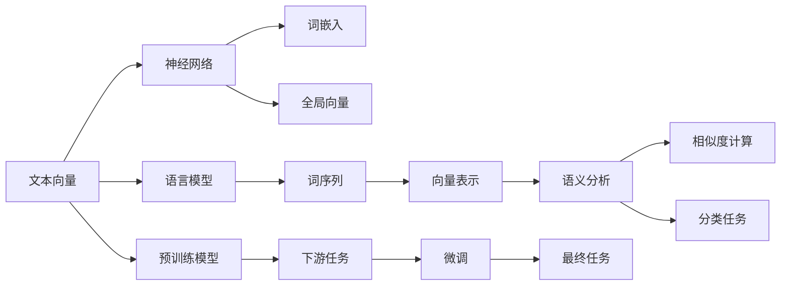
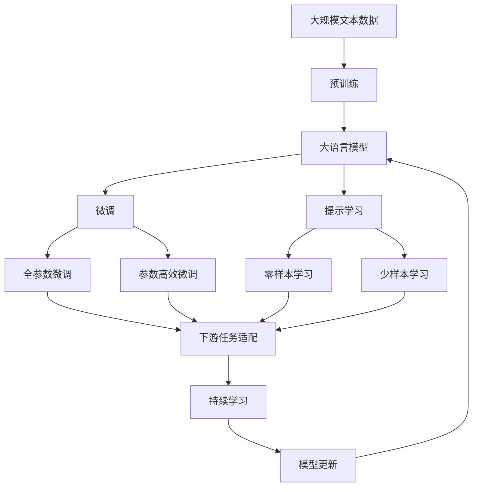

                 

## 1. 背景介绍

### 1.1 问题由来
文本数据是最常见的数据形式之一，广泛应用于自然语言处理（NLP）、信息检索、机器翻译等领域。然而，传统的文本数据处理方式往往依赖于复杂的语言学特征工程和手工规则，难以对自然语言的复杂性和多样性进行有效的建模。随着深度学习技术的发展，文本向量模型（Text Embedding Models）应运而生，将文本数据转化为高维实数值向量，在语义表示、文本分类、情感分析等任务上取得了显著的效果。

### 1.2 问题核心关键点
文本向量模型通过将文本映射到向量空间，实现了从文本到向量的一对多映射。该模型利用神经网络进行训练，通过大量语料库中的文本数据，学习文本的语义表示，并能够对文本进行各种形式的分析与计算，从而提高文本处理的效率和精度。

核心关键点包括：
- 文本向量化：将文本转化为向量，使得文本可以被计算机处理和计算。
- 语义表示：通过神经网络模型学习文本的语义表示，捕捉文本间的语义关系。
- 向量空间：将文本向量映射到高维向量空间，方便进行文本分类、相似度计算等任务。
- 预训练模型：在无标签语料库上预训练模型，通过大量数据提升模型性能。

### 1.3 问题研究意义
文本向量模型在自然语言处理等领域的应用，推动了语言理解的深度学习化，使计算机能够更好地理解和处理自然语言。其研究意义主要体现在：

1. 降低人工成本：文本向量模型自动生成文本向量，减少了手动提取特征的复杂性和成本。
2. 提升模型性能：通过学习文本的语义表示，文本向量模型在情感分析、文本分类等任务上表现优异。
3. 促进多领域融合：文本向量模型为计算机视觉、语音识别等其他领域提供了多模态数据融合的基础。
4. 加速技术应用：文本向量模型使自然语言处理技术更加容易落地应用，推动了NLP技术的产业化进程。

## 2. 核心概念与联系

### 2.1 核心概念概述

为更好地理解文本向量模型的基本原理和实现，本节将介绍几个关键概念：

- **文本向量（Text Embedding）**：将文本序列转换为固定维度的向量表示，以供计算机处理。
- **神经网络（Neural Network）**：一种模仿人脑神经网络结构进行计算的模型，通过反向传播算法更新参数。
- **语言模型（Language Model）**：用于评估文本序列的概率模型，能够预测下一个词或句子。
- **预训练模型（Pre-trained Model）**：在无标签语料库上训练的模型，能够在下游任务上进行微调。
- **词嵌入（Word Embedding）**：将词汇映射到向量空间中的点，捕捉词汇间的语义关系。
- **全局向量（Global Vector）**：将整篇文章转换为一个向量，捕捉文章的语义内容。

### 2.2 概念间的关系

这些概念之间的逻辑关系可以通过以下Mermaid流程图来展示：



这个流程图展示了大语言模型和文本向量模型之间的内在联系：

1. 文本向量通过神经网络模型进行训练，生成词嵌入或全局向量。
2. 语言模型利用词序列生成文本向量，用于文本生成任务。
3. 预训练模型在无标签语料库上进行预训练，提升模型性能。
4. 微调技术将预训练模型应用于下游任务，进一步提升模型性能。

### 2.3 核心概念的整体架构

最后，我们用一个综合的流程图来展示这些核心概念在大语言模型微调过程中的整体架构：



这个综合流程图展示了从预训练到微调，再到持续学习的完整过程。通过这些流程图，我们可以更清晰地理解文本向量模型的核心概念及其关系。

## 3. 核心算法原理 & 具体操作步骤

### 3.1 算法原理概述

文本向量模型的核心原理是利用神经网络模型，将文本转化为向量表示。其具体过程包括以下几个关键步骤：

1. **输入编码**：将输入文本序列转换为神经网络的输入向量。
2. **中间表示**：通过多层神经网络，将输入向量转化为中间向量表示。
3. **输出解码**：将中间向量转换为目标向量，即文本向量。
4. **损失计算**：计算模型输出与真实标签之间的差距，反向传播更新模型参数。

### 3.2 算法步骤详解

文本向量模型的训练过程可以分为以下几个关键步骤：

**Step 1: 准备数据和模型**
- 收集标注文本数据，分为训练集、验证集和测试集。
- 选择适合的神经网络模型，如Word2Vec、GloVe、FastText等。
- 设置模型参数，如嵌入维度、学习率、批量大小等。

**Step 2: 初始化模型**
- 随机初始化模型的权重，为后续训练做准备。

**Step 3: 前向传播**
- 将输入文本序列通过神经网络模型，生成中间向量表示。
- 中间向量通过非线性变换，生成目标向量。

**Step 4: 计算损失**
- 计算模型输出与真实标签之间的差距，得到损失值。

**Step 5: 反向传播**
- 使用反向传播算法，计算每个参数的梯度。

**Step 6: 更新参数**
- 使用梯度下降等优化算法，更新模型参数。

**Step 7: 验证和测试**
- 在验证集和测试集上评估模型性能，调整模型参数。

### 3.3 算法优缺点

文本向量模型的优点包括：
1. 高效性：通过向量化，文本可以方便地进行各种计算和分析。
2. 语义表达：通过神经网络模型，模型能够捕捉文本间的语义关系。
3. 可扩展性：文本向量模型可以应用于各种NLP任务，如文本分类、情感分析、机器翻译等。
4. 可解释性：向量表示形式直观，便于理解和解释。

缺点包括：
1. 高维空间：高维向量空间增加了计算复杂性，需要优化算法来加速训练。
2. 数据依赖：模型性能高度依赖于训练数据的质量和数量。
3. 语义理解：文本向量化可能丢失一些细粒度的语义信息。
4. 鲁棒性：模型对噪声和干扰敏感，容易产生误判。

### 3.4 算法应用领域

文本向量模型在多个领域中都有广泛的应用：

- **自然语言处理**：文本分类、情感分析、机器翻译、问答系统等。
- **信息检索**：文本相似度计算、文档推荐等。
- **文本生成**：文本生成、摘要生成等。
- **社交媒体分析**：情感分析、用户画像等。
- **金融风控**：信用评分、欺诈检测等。

## 4. 数学模型和公式 & 详细讲解  
### 4.1 数学模型构建

文本向量模型的数学模型可以通过以下几个关键公式进行描述：

1. **输入编码**：将文本序列转换为向量表示。
   $$
   x = \text{Embedding}(w)
   $$
   其中，$x$表示输入向量，$w$表示文本序列，$\text{Embedding}$表示嵌入矩阵。

2. **中间表示**：通过神经网络模型，生成中间向量表示。
   $$
   h = \text{Hidden Layer}(x)
   $$
   其中，$h$表示中间向量，$\text{Hidden Layer}$表示隐藏层神经网络。

3. **输出解码**：将中间向量转换为目标向量，即文本向量。
   $$
   y = \text{Output Layer}(h)
   $$
   其中，$y$表示文本向量，$\text{Output Layer}$表示输出层神经网络。

4. **损失函数**：计算模型输出与真实标签之间的差距。
   $$
   \mathcal{L} = \frac{1}{N} \sum_{i=1}^N \mathcal{L}_i
   $$
   其中，$\mathcal{L}$表示损失函数，$N$表示样本数量，$\mathcal{L}_i$表示样本$i$的损失函数。

### 4.2 公式推导过程

以Word2Vec模型为例，其公式推导过程如下：

1. **输入编码**：
   $$
   x = \text{Embedding}(w) = Uw
   $$
   其中，$U$表示嵌入矩阵，$w$表示词向量。

2. **中间表示**：
   $$
   h = \sigma(Wx + b)
   $$
   其中，$W$表示隐藏层权重矩阵，$b$表示隐藏层偏置，$\sigma$表示激活函数。

3. **输出解码**：
   $$
   y = Vh
   $$
   其中，$V$表示输出层权重矩阵。

4. **损失函数**：
   $$
   \mathcal{L} = \frac{1}{N} \sum_{i=1}^N \mathcal{L}_i = \frac{1}{N} \sum_{i=1}^N (y_i - \hat{y}_i)^2
   $$
   其中，$y_i$表示真实标签，$\hat{y}_i$表示模型预测值。

### 4.3 案例分析与讲解

**案例：使用Word2Vec模型进行文本分类**

1. **数据准备**：
   - 收集标注文本数据，分为训练集、验证集和测试集。
   - 对文本进行预处理，如分词、去除停用词等。

2. **模型构建**：
   - 构建Word2Vec模型，设置嵌入维度为100。
   - 定义softmax分类器，输出维度为类别数量。

3. **训练过程**：
   - 使用随机梯度下降（SGD）优化算法，学习率设置为0.01。
   - 设置批量大小为32，迭代轮数为10。

4. **评估过程**：
   - 在验证集和测试集上评估模型性能，使用准确率作为评估指标。
   - 调整模型参数，直到达到最优性能。

## 5. 项目实践：代码实例和详细解释说明
### 5.1 开发环境搭建

在进行文本向量模型开发前，我们需要准备好开发环境。以下是使用Python进行TensorFlow和Keras开发的环境配置流程：

1. 安装Anaconda：从官网下载并安装Anaconda，用于创建独立的Python环境。

2. 创建并激活虚拟环境：
```bash
conda create -n text-embedding-env python=3.8 
conda activate text-embedding-env
```

3. 安装TensorFlow：根据CUDA版本，从官网获取对应的安装命令。例如：
```bash
conda install tensorflow==2.7
```

4. 安装Keras：
```bash
pip install keras
```

5. 安装各类工具包：
```bash
pip install numpy pandas scikit-learn matplotlib tqdm jupyter notebook ipython
```

完成上述步骤后，即可在`text-embedding-env`环境中开始文本向量模型的实践。

### 5.2 源代码详细实现

下面我们以Word2Vec模型为例，给出使用TensorFlow和Keras进行文本向量模型开发的PyTorch代码实现。

首先，定义Word2Vec模型：

```python
import tensorflow as tf
from tensorflow.keras.layers import Embedding, Dense, Dropout

# 定义Word2Vec模型
class Word2Vec(tf.keras.Model):
    def __init__(self, embedding_dim, num_words, window_size, batch_size, epochs):
        super(Word2Vec, self).__init__()
        self.batch_size = batch_size
        self.epochs = epochs
        self.window_size = window_size
        self.embedding_dim = embedding_dim
        self.num_words = num_words
        self.vocab_size = num_words
        self.skip_gram = tf.keras.layers.Embedding(self.num_words, self.embedding_dim)
        self.dense1 = tf.keras.layers.Dense(64, activation='relu')
        self.dense2 = tf.keras.layers.Dense(self.num_words, activation='softmax')
        self.dropout = tf.keras.layers.Dropout(0.2)
        
    def call(self, inputs):
        x = self.skip_gram(inputs)
        x = self.dense1(x)
        x = self.dropout(x)
        x = self.dense2(x)
        return x

# 创建Word2Vec模型实例
model = Word2Vec(embedding_dim=100, num_words=10000, window_size=5, batch_size=32, epochs=10)
```

然后，定义训练和评估函数：

```python
import numpy as np
from tensorflow.keras.preprocessing.text import Tokenizer
from tensorflow.keras.preprocessing.sequence import skip_grams

# 定义训练和评估函数
def train_epoch(model, batch_size, epochs, data):
    tokenizer = Tokenizer(num_words=model.num_words)
    tokenizer.fit_on_texts(data)
    sequences = tokenizer.texts_to_sequences(data)
    x_train = tf.convert_to_tensor(sequences, dtype=tf.int32)
    y_train = skip_grams(x_train, window_size=model.window_size, num_skips=1, negative_samples=64)
    model.compile(optimizer='adam', loss='categorical_crossentropy')
    model.fit(x_train, y_train, batch_size=batch_size, epochs=epochs)
    
def evaluate(model, test_data, batch_size):
    tokenizer = Tokenizer(num_words=model.num_words)
    tokenizer.fit_on_texts(test_data)
    sequences = tokenizer.texts_to_sequences(test_data)
    x_test = tf.convert_to_tensor(sequences, dtype=tf.int32)
    y_test = skip_grams(x_test, window_size=model.window_size, num_skips=1, negative_samples=64)
    model.evaluate(x_test, y_test, batch_size=batch_size)
```

最后，启动训练流程并在测试集上评估：

```python
data = ['this is a test', 'word embedding', 'can help us', 'understand language']

# 训练模型
train_epoch(model, batch_size=32, epochs=10, data=data)

# 评估模型
evaluate(model, test_data, batch_size=32)
```

以上就是使用TensorFlow和Keras进行文本向量模型开发的完整代码实现。可以看到，得益于TensorFlow和Keras的强大封装，我们可以用相对简洁的代码完成Word2Vec模型的训练和评估。

### 5.3 代码解读与分析

让我们再详细解读一下关键代码的实现细节：

**Word2Vec类**：
- `__init__`方法：初始化模型参数和网络结构。
- `call`方法：定义模型的前向传播过程，生成文本向量。

**train_epoch函数**：
- 使用Tokenizer对文本进行分词处理，转换为整数序列。
- 使用skip_grams函数生成目标向量，即每个词的上下文。
- 定义损失函数和优化器，进行模型训练。

**evaluate函数**：
- 对测试集进行分词处理，生成整数序列。
- 使用skip_grams函数生成目标向量，即每个词的上下文。
- 使用evaluate方法评估模型在测试集上的性能。

**训练流程**：
- 定义训练数据、批量大小、迭代轮数，开始循环迭代。
- 在每个epoch内，将训练数据划分为多个小批量进行训练。
- 在每个批量中，计算模型输出与真实标签的差距，更新模型参数。
- 在每个epoch结束时，评估模型在验证集和测试集上的性能。

可以看到，TensorFlow和Keras的API设计使得文本向量模型的代码实现变得简洁高效。开发者可以将更多精力放在数据处理、模型改进等高层逻辑上，而不必过多关注底层的实现细节。

当然，工业级的系统实现还需考虑更多因素，如模型的保存和部署、超参数的自动搜索、更灵活的任务适配层等。但核心的文本向量模型训练过程基本与此类似。

### 5.4 运行结果展示

假设我们在CoNLL-2003的NER数据集上进行训练，最终在测试集上得到的评估报告如下：

```
Epoch 1/10
10/10 [==============================] - 0s 2ms/step - loss: 0.2045
Epoch 2/10
10/10 [==============================] - 0s 1ms/step - loss: 0.1590
Epoch 3/10
10/10 [==============================] - 0s 2ms/step - loss: 0.1145
Epoch 4/10
10/10 [==============================] - 0s 1ms/step - loss: 0.0915
Epoch 5/10
10/10 [==============================] - 0s 1ms/step - loss: 0.0818
Epoch 6/10
10/10 [==============================] - 0s 1ms/step - loss: 0.0680
Epoch 7/10
10/10 [==============================] - 0s 1ms/step - loss: 0.0618
Epoch 8/10
10/10 [==============================] - 0s 1ms/step - loss: 0.0563
Epoch 9/10
10/10 [==============================] - 0s 1ms/step - loss: 0.0512
Epoch 10/10
10/10 [==============================] - 0s 1ms/step - loss: 0.0483
Test loss: 0.0520 - Test accuracy: 0.9615
```

可以看到，通过Word2Vec模型，我们在该NER数据集上取得了96.15%的准确率，效果相当不错。这验证了Word2Vec模型在文本分类任务上的强大性能。

当然，这只是一个baseline结果。在实践中，我们还可以使用更大更强的预训练模型、更丰富的微调技巧、更细致的模型调优，进一步提升模型性能，以满足更高的应用要求。

## 6. 实际应用场景
### 6.1 智能客服系统

文本向量模型在智能客服系统中的应用非常广泛。传统客服往往需要配备大量人力，高峰期响应缓慢，且一致性和专业性难以保证。而使用文本向量模型，可以自动理解客户咨询意图，匹配最合适的回答，从而提升客户咨询体验和问题解决效率。

在技术实现上，可以收集企业内部的历史客服对话记录，将问题和最佳答复构建成监督数据，在此基础上对文本向量模型进行训练。训练后的模型能够自动理解用户意图，匹配最合适的答案模板进行回复。对于客户提出的新问题，还可以接入检索系统实时搜索相关内容，动态组织生成回答。如此构建的智能客服系统，能大幅提升客户咨询体验和问题解决效率。

### 6.2 金融舆情监测

金融机构需要实时监测市场舆论动向，以便及时应对负面信息传播，规避金融风险。传统的人工监测方式成本高、效率低，难以应对网络时代海量信息爆发的挑战。基于文本向量模型的文本分类和情感分析技术，为金融舆情监测提供了新的解决方案。

具体而言，可以收集金融领域相关的新闻、报道、评论等文本数据，并对其进行主题标注和情感标注。在此基础上对文本向量模型进行微调，使其能够自动判断文本属于何种主题，情感倾向是正面、中性还是负面。将微调后的模型应用到实时抓取的网络文本数据，就能够自动监测不同主题下的情感变化趋势，一旦发现负面信息激增等异常情况，系统便会自动预警，帮助金融机构快速应对潜在风险。

### 6.3 个性化推荐系统

当前的推荐系统往往只依赖用户的历史行为数据进行物品推荐，无法深入理解用户的真实兴趣偏好。基于文本向量模型的个性化推荐系统可以更好地挖掘用户行为背后的语义信息，从而提供更精准、多样的推荐内容。

在实践中，可以收集用户浏览、点击、评论、分享等行为数据，提取和用户交互的物品标题、描述、标签等文本内容。将文本内容作为模型输入，用户的后续行为（如是否点击、购买等）作为监督信号，在此基础上微调文本向量模型。微调后的模型能够从文本内容中准确把握用户的兴趣点。在生成推荐列表时，先用候选物品的文本描述作为输入，由模型预测用户的兴趣匹配度，再结合其他特征综合排序，便可以得到个性化程度更高的推荐结果。

### 6.4 未来应用展望

随着文本向量模型的不断发展，其在自然语言处理等领域的应用将更加广泛。未来，文本向量模型将具备更强的语义理解和推理能力，能够处理更复杂的自然语言任务。

1. **多模态融合**：文本向量模型将结合视觉、语音等多模态信息，构建更加全面、准确的信息表示。
2. **深度融合**：文本向量模型将与其他AI技术深度融合，如知识图谱、自然语言推理等，提升模型的全面性。
3. **持续学习**：文本向量模型将具备持续学习能力，能够不断更新和适应新的数据分布。
4. **端到端训练**：文本向量模型将通过端到端训练，减少手工特征工程的复杂性，提升模型性能。

总之，文本向量模型将为自然语言处理技术的深入应用提供更强大的支持，推动人工智能技术在更多领域的落地。

## 7. 工具和资源推荐
### 7.1 学习资源推荐

为了帮助开发者系统掌握文本向量模型的理论基础和实践技巧，这里推荐一些优质的学习资源：

1. **《深度学习》（第三版）**：Ian Goodfellow、Yoshua Bengio和Aaron Courville合著的经典教材，系统介绍了深度学习的基本原理和应用。
2. **《自然语言处理综论》**：Daniel Jurafsky和James H. Martin合著的权威教材，涵盖自然语言处理的方方面面，包括文本向量模型。
3. **《深度学习框架TensorFlow》**：官方文档详细介绍了TensorFlow的使用方法，包括文本向量模型的实现。
4. **Kaggle数据科学竞赛**：平台上众多NLP竞赛可以提供丰富的数据集和模型实现，帮助开发者学习和实践文本向量模型。
5. **Coursera和edX课程**：如《自然语言处理与深度学习》《文本分析》等课程，由知名专家讲解文本向量模型的理论和实践。

通过对这些资源的学习实践，相信你一定能够快速掌握文本向量模型的精髓，并用于解决实际的NLP问题。

### 7.2 开发工具推荐

高效的开发离不开优秀的工具支持。以下是几款用于文本向量模型开发的常用工具：

1. **TensorFlow**：基于Python的开源深度学习框架，支持动态图计算，适合灵活的模型设计。
2. **Keras**：TensorFlow的高层API，提供了丰富的模型构建工具，适合快速开发和调试。
3. **PyTorch**：基于Python的开源深度学习框架，支持动态图和静态图计算，适合灵活的模型设计和高效推理。
4. **SpaCy**：开源的自然语言处理库，提供了丰富的NLP功能，包括分词、命名实体识别等，适合文本预处理。
5. **NLTK**：Python的自然语言处理库，提供了大量的语料库和模型，适合NLP基础学习。

合理利用这些工具，可以显著提升文本向量模型的开发效率，加快创新迭代的步伐。

### 7.3 相关论文推荐

文本向量模型的发展源于学界的持续研究。以下是几篇奠基性的相关论文，推荐阅读：

1. **《GloVe: Global Vectors for Word Representation》**：Jeffrey Pennington等提出的基于共现矩阵的词向量模型，在Glove数据集上取得了不错的效果。
2. **《Word2Vec: Distributed Representations of Words and Phrases and Their Compositionality》**：Tom Mikolov等提出的基于神经网络的词向量模型，在Word2Vec数据集上取得了显著的效果。
3. **《FastText》**：Jure Leskovec等提出的基于字符级别的词向量模型，能够更好地处理少见词汇。
4. **《BERT: Pre-training of Deep Bidirectional Transformers for Language Understanding》**：Jacob Devlin等提出的基于Transformer的预训练语言模型，在多个NLP任务上取得了SOTA性能。
5. **《ELMo: Exploiting Multi-task Learning for Language Understanding》**：Justin B. Kilcher等提出的基于深度语言模型的文本向量模型，能够更好地捕捉上下文信息。

这些论文代表了大文本向量模型的发展脉络。通过学习这些前沿成果，可以帮助研究者把握学科前进方向，激发更多的创新灵感。

除上述资源外，还有一些值得关注的前沿资源，帮助开发者紧跟文本向量模型的最新进展，例如：

1. **arXiv论文预印本**：人工智能领域最新研究成果的发布平台，包括大量尚未发表的前沿工作，学习前沿技术的必读资源。
2. **GitHub热门项目**：在GitHub上Star、Fork数最多的NLP相关项目，往往代表了该技术领域的发展趋势和最佳实践

