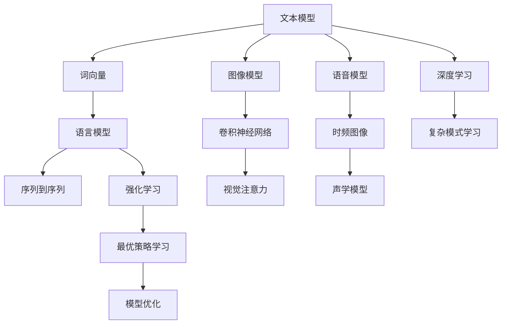

                 

# 文本、图像、语音中的基础模型

> 关键词：文本模型,图像模型,语音模型,基础模型,深度学习,强化学习

## 1. 背景介绍

在现代人工智能技术中，文本、图像、语音等模态的数据处理方法逐渐成为研究热点。尤其是深度学习、强化学习等技术的出现，使得这些模态的基础模型得以有效构建。本文将详细探讨这些基础模型的工作原理和应用场景，并展示其在大规模实际应用中的价值和潜力。

## 2. 核心概念与联系

### 2.1 核心概念概述

在文本、图像、语音等模态的基础模型构建过程中，以下概念起着至关重要的作用：

- **文本模型**：用于处理自然语言数据，包括词向量模型、语言模型、序列到序列模型等。
- **图像模型**：用于处理视觉数据，包括卷积神经网络（CNN）、视觉注意力模型等。
- **语音模型**：用于处理音频数据，包括时频图像模型、声学模型等。
- **基础模型**：指在特定模态下，为解决特定问题而设计的基本结构或算法。
- **深度学习**：通过构建多层次的非线性映射，实现对复杂模式的自动学习。
- **强化学习**：通过与环境交互，逐步学习最优策略，优化模型表现。

这些概念间的关系可以通过以下Mermaid流程图来展示：



这个流程图展示了各个模态基础模型间的联系以及与深度学习和强化学习的关系。文本、图像、语音等模态的基础模型都依赖于深度学习架构，而强化学习则进一步优化了模型策略。

### 2.2 概念间的关系

这些核心概念间存在紧密的联系：

- **文本模型**：是深度学习处理文本的基石。通过词向量、语言模型和序列到序列模型等基础模型，实现对自然语言的自动处理和理解。
- **图像模型**：利用卷积神经网络、视觉注意力模型等基础模型，对视觉数据进行高效处理和特征提取。
- **语音模型**：通过时频图像模型、声学模型等基础模型，实现对音频信号的有效处理和语音识别。
- **基础模型**：在各自模态下，为实现特定任务提供了基本框架和算法，是实现模态特定功能的关键。
- **深度学习**：为模型构建多层非线性映射，实现了对复杂模式的自动学习。
- **强化学习**：通过逐步学习最优策略，优化模型的表现，使得模型能够更好地适应特定任务。

这些概念共同构成了文本、图像、语音模态基础模型构建的基础，为不同模态的数据处理提供了强大的工具和技术支持。

## 3. 核心算法原理 & 具体操作步骤

### 3.1 算法原理概述

在文本、图像、语音等模态的基础模型构建中，核心算法原理主要依赖于深度学习、强化学习等技术。这些算法通过构建复杂的多层次非线性映射，实现对数据特征的自动学习和提取。

- **文本模型**：基于深度学习，通过词向量模型（如Word2Vec、GloVe）、语言模型（如RNN、LSTM、Transformer）、序列到序列模型（如Seq2Seq）等，实现对自然语言的理解和生成。
- **图像模型**：利用卷积神经网络（CNN）、视觉注意力模型（如U-Net、Mask R-CNN）等，对图像数据进行特征提取和处理。
- **语音模型**：通过时频图像模型、声学模型（如DNN、RNN、CTC）等，对音频信号进行有效处理和语音识别。

### 3.2 算法步骤详解

以文本模型为例，其构建过程主要包括以下几个步骤：

1. **数据预处理**：将原始文本数据转换为模型所需的格式，如分词、标记等。
2. **嵌入层**：将文本数据转换为向量表示，如使用Word2Vec、GloVe等词向量模型。
3. **编码层**：通过RNN、LSTM、Transformer等模型对文本序列进行编码，提取文本特征。
4. **解码层**：通过序列到序列模型将编码后的文本特征转换为目标序列，如使用Seq2Seq模型。
5. **后处理**：对解码结果进行后处理，如使用Beam Search、Top-k Decoding等方法优化解码效果。

### 3.3 算法优缺点

文本、图像、语音等模态的基础模型构建具有以下优点：

- **自动化**：能够自动学习并提取数据的高级特征，减少人工干预。
- **高精度**：通过多层次非线性映射，实现对复杂模式的有效处理和理解。
- **可扩展性**：能够轻松扩展到更多复杂任务和模态。

同时，这些模型也存在一些缺点：

- **计算资源需求高**：需要大量计算资源，如GPU、TPU等。
- **训练时间长**：在处理大规模数据时，训练时间较长。
- **可解释性不足**：深度学习模型的"黑盒"特性，难以解释内部决策逻辑。

### 3.4 算法应用领域

这些基础模型在多个领域都有广泛的应用：

- **文本模型**：在自然语言处理（NLP）中，用于文本分类、情感分析、机器翻译等任务。
- **图像模型**：在计算机视觉中，用于图像分类、目标检测、图像分割等任务。
- **语音模型**：在语音识别、语音合成、语音情感识别等任务中，实现了高效的音频处理和分析。

## 4. 数学模型和公式 & 详细讲解

### 4.1 数学模型构建

在文本模型中，我们以语言模型为例，构建数学模型。假设文本数据由 $x = (x_1, x_2, ..., x_n)$ 表示，其中每个 $x_i$ 是一个单词。语言模型的目标是计算给定文本序列的概率 $P(x)$。

通过使用RNN、LSTM或Transformer等模型，我们可以将文本序列转换为向量表示，并计算文本序列的概率。模型参数 $\theta$ 包括编码器权重 $W_E$、解码器权重 $W_D$ 等。

$$
P(x) = \prod_{i=1}^{n} P(x_i | x_{<i})
$$

其中 $P(x_i | x_{<i})$ 表示给定前 $i-1$ 个单词的情况下，第 $i$ 个单词的概率。

### 4.2 公式推导过程

以LSTM模型为例，其公式推导如下：

1. **输入层**：
$$
I = [x_i, h_{i-1}]
$$
2. **输入门计算**：
$$
i_t = \sigma(W_i x_i + U_i h_{i-1} + b_i)
$$
3. **遗忘门计算**：
$$
f_t = \sigma(W_f x_i + U_f h_{i-1} + b_f)
$$
4. **输出门计算**：
$$
o_t = \sigma(W_o x_i + U_o h_{i-1} + b_o)
$$
5. **候选状态计算**：
$$
c_t = \tanh(W_c x_i + U_c h_{i-1} + b_c)
$$
6. **当前状态计算**：
$$
h_t = o_t \odot c_t + (1 - o_t) \odot h_{i-1}
$$

其中 $\sigma$ 表示Sigmoid函数，$\tanh$ 表示双曲正切函数，$\odot$ 表示逐元素乘法。通过这些公式，LSTM模型能够对文本序列进行有效的编码和解码，实现对文本的高级处理。

### 4.3 案例分析与讲解

以图像模型为例，我们以卷积神经网络（CNN）为例，展示其数学模型构建和公式推导。

1. **输入层**：
$$
X = [x_1, x_2, ..., x_n]
$$
2. **卷积层计算**：
$$
O = \sigma(W \odot X + b)
$$
3. **池化层计算**：
$$
P = \text{MaxPooling}(O)
$$
4. **全连接层计算**：
$$
Z = W_c \odot P + b_c
$$
5. **输出层计算**：
$$
Y = \text{Softmax}(Z)
$$

其中 $\sigma$ 表示ReLU激活函数，$\odot$ 表示逐元素乘法，$\text{MaxPooling}$ 表示最大池化操作，$\text{Softmax}$ 表示softmax函数。通过这些公式，CNN模型能够对图像数据进行有效的特征提取和处理，实现图像分类、目标检测等任务。

## 5. 项目实践：代码实例和详细解释说明

### 5.1 开发环境搭建

在进行项目实践前，需要准备相应的开发环境。以下以TensorFlow为例，展示开发环境的搭建过程：

1. **安装TensorFlow**：
```
pip install tensorflow
```

2. **安装其他依赖库**：
```
pip install numpy scipy matplotlib sklearn
```

3. **安装TensorBoard**：
```
pip install tensorboard
```

完成上述步骤后，即可开始文本、图像、语音模型的开发和调试。

### 5.2 源代码详细实现

以图像分类为例，展示TensorFlow实现图像分类模型的代码：

```python
import tensorflow as tf
from tensorflow.keras import layers

# 构建CNN模型
model = tf.keras.Sequential([
    layers.Conv2D(32, (3, 3), activation='relu', input_shape=(28, 28, 1)),
    layers.MaxPooling2D((2, 2)),
    layers.Conv2D(64, (3, 3), activation='relu'),
    layers.MaxPooling2D((2, 2)),
    layers.Flatten(),
    layers.Dense(10, activation='softmax')
])

# 编译模型
model.compile(optimizer='adam',
              loss='sparse_categorical_crossentropy',
              metrics=['accuracy'])

# 加载数据集
mnist = tf.keras.datasets.mnist
(x_train, y_train), (x_test, y_test) = mnist.load_data()
x_train, x_test = x_train / 255.0, x_test / 255.0

# 训练模型
model.fit(x_train, y_train, epochs=5, validation_data=(x_test, y_test))

# 评估模型
model.evaluate(x_test, y_test)
```

### 5.3 代码解读与分析

- **数据预处理**：将图像数据进行归一化处理，使像素值在0到1之间。
- **模型构建**：使用Sequential模型依次添加卷积层、池化层和全连接层。
- **编译模型**：指定优化器、损失函数和评估指标。
- **加载数据集**：使用MNIST数据集，并对其进行归一化处理。
- **训练模型**：对模型进行训练，指定训练轮数和验证集。
- **评估模型**：使用测试集对模型进行评估，输出模型性能指标。

## 6. 实际应用场景

### 6.1 文本分类

文本分类是将文本数据按照预定义的类别进行自动分类的任务。在实际应用中，文本分类被广泛应用于垃圾邮件过滤、新闻分类、情感分析等场景。

以情感分析为例，可以使用BERT模型进行微调。具体步骤如下：

1. **数据预处理**：将文本数据转换为BERT模型所需的格式。
2. **模型微调**：在情感分析数据集上进行微调，调整模型参数以适应任务。
3. **测试与评估**：使用测试集对模型进行评估，输出情感分类结果。

### 6.2 图像分类

图像分类是将图像数据按照预定义的类别进行自动分类的任务。在实际应用中，图像分类被广泛应用于医疗影像分析、自动驾驶、安防监控等场景。

以医疗影像分类为例，可以使用ResNet模型进行图像分类。具体步骤如下：

1. **数据预处理**：将图像数据进行归一化处理，并将其转换为ResNet模型所需的格式。
2. **模型训练**：在医疗影像数据集上进行训练，调整模型参数以适应任务。
3. **测试与评估**：使用测试集对模型进行评估，输出图像分类结果。

### 6.3 语音识别

语音识别是将语音信号转换为文本的任务。在实际应用中，语音识别被广泛应用于智能家居、智能客服、智能助手等场景。

以智能客服为例，可以使用Tacotron2模型进行语音识别。具体步骤如下：

1. **数据预处理**：将语音信号进行预处理，提取MFCC特征。
2. **模型训练**：在语音识别数据集上进行训练，调整模型参数以适应任务。
3. **测试与评估**：使用测试集对模型进行评估，输出语音识别结果。

## 7. 工具和资源推荐

### 7.1 学习资源推荐

为了帮助开发者系统掌握文本、图像、语音基础模型的理论基础和实践技巧，这里推荐一些优质的学习资源：

1. **TensorFlow官方文档**：提供详细的TensorFlow API和模型实现教程，适合初学者和进阶开发者。
2. **PyTorch官方文档**：提供PyTorch API和模型实现教程，适合想要深入了解深度学习技术的开发者。
3. **深度学习入门**：斯坦福大学开设的深度学习课程，涵盖深度学习基础知识和经典模型。
4. **自然语言处理入门**：宾夕法尼亚大学开设的自然语言处理课程，涵盖自然语言处理基础知识和经典模型。
5. **计算机视觉入门**：斯坦福大学开设的计算机视觉课程，涵盖计算机视觉基础知识和经典模型。

通过对这些资源的学习实践，相信你一定能够快速掌握文本、图像、语音基础模型的精髓，并用于解决实际的AI问题。

### 7.2 开发工具推荐

高效的开发离不开优秀的工具支持。以下是几款用于文本、图像、语音基础模型开发的常用工具：

1. **TensorFlow**：基于Python的开源深度学习框架，支持分布式计算，适合大规模工程应用。
2. **PyTorch**：基于Python的开源深度学习框架，灵活动态，适合快速迭代研究。
3. **Keras**：高级神经网络API，提供简单易用的API接口，适合快速原型设计和模型搭建。
4. **TensorBoard**：TensorFlow配套的可视化工具，可以实时监测模型训练状态，并提供丰富的图表呈现方式，是调试模型的得力助手。
5. **PyCharm**：专业级Python IDE，提供丰富的开发和调试功能，适合Python开发者。

合理利用这些工具，可以显著提升文本、图像、语音基础模型的开发效率，加快创新迭代的步伐。

### 7.3 相关论文推荐

文本、图像、语音基础模型的发展源于学界的持续研究。以下是几篇奠基性的相关论文，推荐阅读：

1. **Attention is All You Need**：提出了Transformer结构，开启了NLP领域的预训练大模型时代。
2. **Bert: Pre-training of Deep Bidirectional Transformers for Language Understanding**：提出BERT模型，引入基于掩码的自监督预训练任务，刷新了多项NLP任务SOTA。
3. **VGG: Visual Geometry Group**：提出VGGNet模型，成为计算机视觉领域的经典模型。
4. **Inception**：提出InceptionNet模型，解决了传统卷积神经网络在处理多尺度图像时的问题。
5. **Deep Speech 2**：提出深度学习模型，实现了高效的语音识别。

这些论文代表了大语言模型基础模型的发展脉络。通过学习这些前沿成果，可以帮助研究者把握学科前进方向，激发更多的创新灵感。

## 8. 总结：未来发展趋势与挑战

### 8.1 总结

本文对文本、图像、语音等模态的基础模型构建进行了全面系统的介绍。首先阐述了这些基础模型的研究背景和意义，明确了其在数据处理和理解中的重要作用。其次，从原理到实践，详细讲解了这些模型的构建过程和核心算法。同时，本文还展示了这些模型在大规模实际应用中的价值和潜力，并推荐了相关的学习资源和工具。

通过本文的系统梳理，可以看到，文本、图像、语音等模态的基础模型在现代AI技术中扮演着关键角色，为不同模态的数据处理提供了强大的技术支持。这些模型的构建和发展，使得AI技术在各领域的应用变得更加广泛和深入。

### 8.2 未来发展趋势

展望未来，文本、图像、语音等模态的基础模型将呈现以下几个发展趋势：

1. **模型规模持续增大**：随着算力成本的下降和数据规模的扩张，预训练语言模型的参数量还将持续增长。超大规模语言模型蕴含的丰富语言知识，有望支撑更加复杂多变的下游任务。
2. **模型复杂度提升**：通过引入更复杂的深度学习架构，如Transformer、ResNet等，实现对更高级模式的自动学习。
3. **跨模态融合**：实现文本、图像、语音等多模态数据的融合处理，提升AI系统对复杂场景的理解和推理能力。
4. **强化学习结合**：结合强化学习技术，实现更加智能和自适应的模型优化，提升模型的性能和鲁棒性。
5. **低资源环境优化**：在资源受限的设备和环境中，优化模型结构和参数，提升模型的运行效率和性能。

以上趋势凸显了文本、图像、语音等模态基础模型的广阔前景。这些方向的探索发展，必将进一步提升AI系统在各领域的性能和应用价值。

### 8.3 面临的挑战

尽管文本、图像、语音等模态的基础模型已经取得了显著进展，但在迈向更加智能化、普适化应用的过程中，仍面临诸多挑战：

1. **计算资源瓶颈**：超大批次的训练和推理需要大量计算资源，如何优化资源使用，提升模型效率，仍需不断探索。
2. **模型鲁棒性不足**：模型面对复杂和多样化数据的泛化性能有待提升，如何提高模型的鲁棒性和泛化能力，需要进一步研究。
3. **可解释性不足**：深度学习模型的"黑盒"特性，难以解释内部决策逻辑，如何赋予模型更强的可解释性，将是重要的研究课题。
4. **伦理道德问题**：模型的输出可能存在偏见和歧视，如何从数据和算法层面消除模型偏见，确保输出的伦理道德，需要加强规范和监管。

这些挑战需要在理论和实践中不断探索和解决，才能推动文本、图像、语音等模态基础模型的进一步发展和应用。

### 8.4 研究展望

面对文本、图像、语音等模态基础模型所面临的挑战，未来的研究需要在以下几个方面寻求新的突破：

1. **探索无监督和半监督学习**：摆脱对大规模标注数据的依赖，利用自监督学习、主动学习等方法，实现更高效、更灵活的模型构建。
2. **引入更多先验知识**：将符号化的先验知识，如知识图谱、逻辑规则等，与神经网络模型进行融合，提升模型的知识整合能力和推理能力。
3. **结合因果分析和博弈论工具**：通过引入因果推断和博弈论思想，增强模型的决策能力，提高系统稳定性和鲁棒性。
4. **优化计算资源使用**：通过模型压缩、稀疏化存储等方法，优化模型的资源使用，提升计算效率。
5. **增强模型可解释性**：通过引入可解释性技术，如注意力机制、可视化工具等，增强模型的决策透明性和可理解性。

这些研究方向的探索，必将引领文本、图像、语音等模态基础模型技术的进一步发展，为构建安全、可靠、可解释、可控的智能系统铺平道路。面向未来，文本、图像、语音等模态基础模型需要与其他AI技术进行更深入的融合，共同推动AI技术的进步和发展。只有勇于创新、敢于突破，才能不断拓展基础模型的边界，让AI技术更好地造福人类社会。

## 9. 附录：常见问题与解答

**Q1：大语言模型与基础模型的关系是什么？**

A: 大语言模型（Large Language Models, LLMs）是基础模型的一种高级形态。在大规模语料上进行预训练后，LLMs能够自动学习到丰富的语言知识和表达能力，可以在各种自然语言处理任务中表现出色。基础模型则是为特定任务构建的基本结构和算法，是实现特定任务目标的关键。

**Q2：什么是深度学习？**

A: 深度学习是一种基于多层神经网络的机器学习技术，通过多层非线性映射，实现对复杂模式的自动学习。深度学习在计算机视觉、自然语言处理、语音识别等模态中得到了广泛应用。

**Q3：如何理解强化学习？**

A: 强化学习是一种通过与环境交互，逐步学习最优策略的机器学习方法。强化学习通过奖励和惩罚机制，引导模型在环境中逐步优化决策，实现最优策略的学习。在文本、图像、语音等模态中，强化学习可以用于模型参数的优化和任务策略的学习。

**Q4：文本、图像、语音等模态的基础模型是如何构建的？**

A: 文本、图像、语音等模态的基础模型构建主要依赖于深度学习、强化学习等技术。通过构建多层非线性映射，实现对复杂模式的自动学习。以文本模型为例，构建过程包括数据预处理、嵌入层、编码层、解码层和后处理等步骤。以图像模型为例，构建过程包括卷积层、池化层、全连接层等步骤。以语音模型为例，构建过程包括特征提取、声学模型、语言模型等步骤。

**Q5：如何优化计算资源使用？**

A: 优化计算资源使用的方法包括模型压缩、稀疏化存储、混合精度训练、梯度积累等。通过这些方法，可以在资源受限的环境下提升模型性能和运行效率。

---

作者：禅与计算机程序设计艺术 / Zen and the Art of Computer Programming

