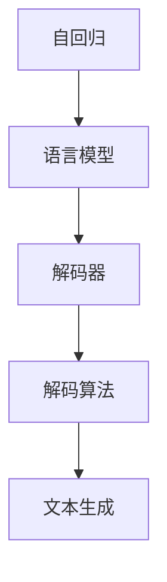
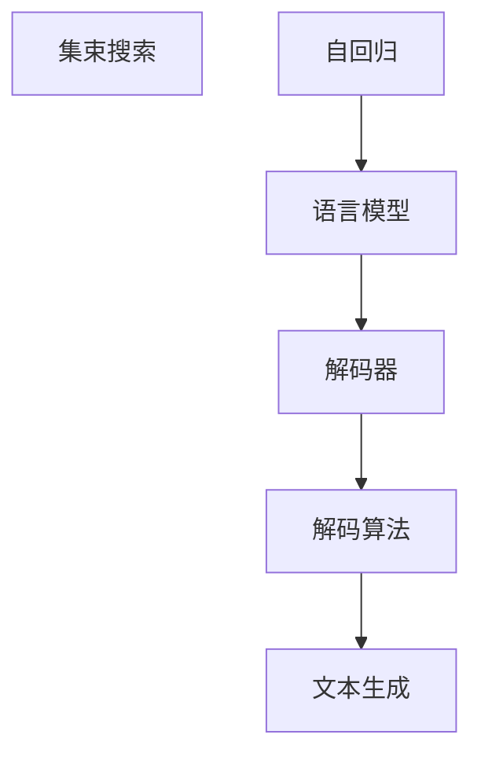
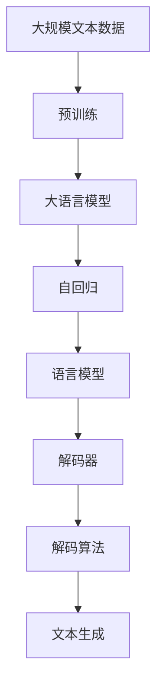

                 

# 文本生成中的自回归（集束搜索）

## 1. 背景介绍

### 1.1 问题由来
文本生成是自然语言处理领域的一个重要研究课题，旨在使计算机能够自动生成符合语法和语义规则的文本。在传统的基于规则或模板的方法中，生成过程往往依赖于固定的语法规则和词汇表，难以生成自然流畅且富有创意的文本。相比之下，基于统计的语言模型可以学习到文本中的概率分布，并根据输入生成可能的文本输出，从而实现更加灵活和自然的文本生成。

### 1.2 问题核心关键点
文本生成过程中的关键问题是如何有效地计算目标文本的概率分布。在基于统计的语言模型中，文本生成过程可以通过自回归的方式实现。即，给定输入文本的前缀部分，模型可以基于前缀的上下文信息，计算下一个词汇出现的概率，从而逐步生成完整的文本序列。然而，自回归生成过程面临着计算复杂度高、推理速度慢等问题，特别是在长文本生成时，模型需要计算大量的条件概率，导致生成效率低下。

为解决这一问题，集束搜索（Beam Search）算法应运而生。集束搜索算法通过在每个时间步选择多个候选输出，以多线程并行计算的方式提高生成效率，同时通过保留“最佳”候选输出，保证生成文本的质量。本文将系统介绍集束搜索算法的基本原理、操作步骤和应用场景，并对比分析其优缺点，以期为文本生成领域的实际应用提供参考。

## 2. 核心概念与联系

### 2.1 核心概念概述

为更好地理解文本生成中的自回归和集束搜索，本节将介绍几个密切相关的核心概念：

- 自回归（Autoregressive, AR）：一种生成过程，其中每个时间步的输出只依赖于前面的时间步。在文本生成中，自回归过程通常基于语言的统计性质，通过条件概率模型计算每个词汇出现的概率。

- 语言模型（Language Model, LM）：用于描述文本的概率分布模型，通常基于统计学习方法，如隐马尔可夫模型（HMM）、条件随机场（CRF）、神经网络语言模型（NNLM）等。语言模型可以用于文本生成、机器翻译、语音识别等多种NLP任务。

- 集束搜索（Beam Search）：一种优化算法，用于在搜索空间中寻找最优解。在文本生成中，集束搜索算法通过在每个时间步选择多个候选输出，以多线程并行计算的方式提高生成效率，同时通过保留“最佳”候选输出，保证生成文本的质量。

- 解码器（Decoder）：文本生成的核心组件，负责基于语言模型计算每个时间步的输出概率，并根据概率选择下一个词汇。解码器通常采用自回归过程，也可以采用非自回归过程，如变分自编码器（VAE）、生成对抗网络（GAN）等。

- 解码算法（Decoding Algorithm）：用于从语言模型中生成文本序列的算法。常见的解码算法包括贪心搜索（Greedy Search）、自回归搜索（AR Search）、集束搜索（Beam Search）、采样生成（Sampling Generation）等。

这些核心概念之间的逻辑关系可以通过以下Mermaid流程图来展示：



这个流程图展示了大语言模型在文本生成中的工作原理：

1. 自回归过程通过语言模型计算每个时间步的输出概率，生成文本序列。
2. 解码器根据自回归过程计算每个时间步的输出概率，并选择下一个词汇。
3. 解码算法通过不同的搜索策略，优化文本生成的过程。

### 2.2 概念间的关系

这些核心概念之间存在着紧密的联系，形成了文本生成任务的完整生态系统。下面我们通过几个Mermaid流程图来展示这些概念之间的关系。

#### 2.2.1 文本生成模型


这个流程图展示了文本生成模型的工作流程：

1. 自回归过程通过语言模型计算每个时间步的输出概率，生成文本序列。
2. 解码器根据自回归过程计算每个时间步的输出概率，并选择下一个词汇。
3. 解码算法通过不同的搜索策略，优化文本生成的过程。

#### 2.2.2 集束搜索算法



这个流程图展示了集束搜索算法在文本生成中的应用：

1. 集束搜索算法通过在每个时间步选择多个候选输出，以多线程并行计算的方式提高生成效率。
2. 解码器根据自回归过程计算每个时间步的输出概率，并选择下一个词汇。
3. 解码算法通过不同的搜索策略，优化文本生成的过程。

### 2.3 核心概念的整体架构

最后，我们用一个综合的流程图来展示这些核心概念在大语言模型文本生成中的整体架构：



这个综合流程图展示了从预训练到文本生成的完整过程：

1. 大语言模型通过在大规模文本数据上进行预训练，学习到语言的通用表示。
2. 自回归过程通过语言模型计算每个时间步的输出概率，生成文本序列。
3. 解码器根据自回归过程计算每个时间步的输出概率，并选择下一个词汇。
4. 解码算法通过不同的搜索策略，优化文本生成的过程。

这些概念共同构成了大语言模型文本生成的学习框架，使其能够在各种场景下发挥强大的语言生成能力。通过理解这些核心概念，我们可以更好地把握文本生成任务的工作原理和优化方向。

## 3. 核心算法原理 & 具体操作步骤
### 3.1 算法原理概述

集束搜索算法是一种基于贪心策略的优化算法，旨在提高文本生成的效率和质量。该算法通过在每个时间步选择多个候选输出，以多线程并行计算的方式提高生成效率，同时通过保留“最佳”候选输出，保证生成文本的质量。

集束搜索算法的基本思想是：在每个时间步，保留当前“最佳”的 K 个候选输出，并对这 K 个候选输出进行下一步的扩展。每次扩展后，计算新的候选输出的概率分布，并选择得分最高的 K 个作为下一轮的扩展对象。重复上述过程，直到生成文本的结束标志。

### 3.2 算法步骤详解

集束搜索算法的基本步骤包括：

1. 初始化：选择初始的 K 个候选输出作为第一轮扩展对象。

2. 扩展：对于当前时间步的每个候选输出，计算其后续词汇的概率分布，并扩展出 K 个新的候选输出。

3. 评估：计算每个候选输出的得分，选择得分最高的 K 个作为下一轮扩展对象。

4. 终止：当生成文本达到结束标志时，返回得分最高的候选输出作为最终结果。

下面以一个简单的例子来说明集束搜索算法的工作原理：

假设我们要生成一个长度为 3 的文本序列，初始的 K 为 2，即每次扩展选择 2 个候选输出。初始的候选输出为 "a" 和 "b"。

**扩展步骤**：

1. 对于候选输出 "a"，计算其后续词汇的概率分布，假设结果为："a -> a, b, c"，其中每个词汇的概率分布为："Prob(a) = 0.3, Prob(b) = 0.2, Prob(c) = 0.5"。

2. 对于候选输出 "b"，计算其后续词汇的概率分布，假设结果为："b -> a, b, c"，其中每个词汇的概率分布为："Prob(a) = 0.2, Prob(b) = 0.4, Prob(c) = 0.4"。

3. 选择得分最高的 2 个候选输出作为下一轮扩展对象。假设得分计算方式为：得分 = Prob(next token)，则 "a" 的得分为 0.3，"b" 的得分为 0.4，因此选择 "b" 和 "c" 作为下一轮扩展对象。

**终止步骤**：

1. 对于候选输出 "b"，计算其后续词汇的概率分布，假设结果为："b -> a, b, c"，其中每个词汇的概率分布为："Prob(a) = 0.2, Prob(b) = 0.4, Prob(c) = 0.4"。

2. 对于候选输出 "c"，计算其后续词汇的概率分布，假设结果为："c -> a, b, c"，其中每个词汇的概率分布为："Prob(a) = 0.3, Prob(b) = 0.2, Prob(c) = 0.5"。

3. 选择得分最高的 2 个候选输出作为下一轮扩展对象。假设得分计算方式为：得分 = Prob(next token)，则 "a" 的得分为 0.3，"b" 的得分为 0.2，"c" 的得分为 0.5，因此选择 "c" 和 "a" 作为下一轮扩展对象。

4. 生成文本达到结束标志，返回得分最高的候选输出 "c" 作为最终结果。

### 3.3 算法优缺点

集束搜索算法具有以下优点：

1. 效率高：通过多线程并行计算，显著提高了文本生成的速度。

2. 质量高：通过保留“最佳”候选输出，提高了生成文本的质量。

3. 灵活性：通过调整 K 值，可以在效率和质量之间进行平衡。

然而，该算法也存在以下缺点：

1. 空间复杂度高：需要存储大量的候选输出，占用了较大的内存空间。

2. 计算复杂度高：每次扩展需要计算大量的概率分布，增加了计算复杂度。

3. 难以处理噪声数据：如果输入文本中含有噪声或错误信息，集束搜索算法可能产生错误的输出。

4. 不适用于大规模数据：在大规模数据集上，集束搜索算法的计算开销较大，可能会导致性能瓶颈。

### 3.4 算法应用领域

集束搜索算法在文本生成领域有着广泛的应用，特别是在机器翻译、语音识别、文本摘要等任务中。例如，在机器翻译中，集束搜索算法可以通过并行计算多个候选翻译结果，提高翻译速度和质量。在文本摘要中，集束搜索算法可以生成多个摘要结果，从中筛选出最优秀的结果。

除了文本生成领域，集束搜索算法在其他优化问题中也有应用，如路径规划、机器学习模型的超参数优化等。集束搜索算法的多线程并行计算和“最佳”候选输出选择机制，使其成为一种高效、灵活的优化算法。

## 4. 数学模型和公式 & 详细讲解  
### 4.1 数学模型构建

假设我们有一个长度为 T 的文本序列 $x = (x_1, x_2, ..., x_T)$，其中每个时间步 $t$ 的输出为 $x_t$。语言模型 $P(x)$ 描述了文本的概率分布，可以通过以下公式计算：

$$
P(x) = \prod_{t=1}^T P(x_t | x_{<t})
$$

其中，$P(x_t | x_{<t})$ 表示在已知前 $t-1$ 个时间步的情况下，第 $t$ 个时间步的输出概率。

### 4.2 公式推导过程

在文本生成的过程中，集束搜索算法需要在每个时间步选择 K 个候选输出，并进行扩展。假设在第 $t$ 个时间步，有 K 个候选输出 $y_1, y_2, ..., y_K$，其概率分布分别为 $P(y_1), P(y_2), ..., P(y_K)$。则第 $t+1$ 个时间步的扩展过程可以表示为：

1. 对于每个候选输出 $y_k$，计算其后续词汇的概率分布，得到 $P(y_k | y_{<t})$。

2. 对于每个候选输出 $y_k$，扩展出 K 个新的候选输出 $y_{k1}, y_{k2}, ..., y_{kK}$，其概率分布分别为 $P(y_{k1} | y_{<t}), P(y_{k2} | y_{<t}), ..., P(y_{kK} | y_{<t})$。

3. 计算每个扩展出的候选输出的得分，选择得分最高的 K 个作为下一轮扩展对象。

4. 重复上述过程，直到生成文本达到结束标志。

假设在 $t$ 时间步，集束搜索算法选择了 K 个候选输出 $y_1, y_2, ..., y_K$。则 $t+1$ 时间步的扩展过程可以表示为：

$$
P(y_{k1} | y_{<t}), P(y_{k2} | y_{<t}), ..., P(y_{kK} | y_{<t})
$$

其中，$P(y_{kj} | y_{<t})$ 表示在已知前 $t$ 个时间步的情况下，第 $t+1$ 个时间步的输出概率。

### 4.3 案例分析与讲解

以一个简单的例子来说明集束搜索算法在文本生成中的应用。假设我们要生成一个长度为 3 的文本序列，初始的 K 为 2，即每次扩展选择 2 个候选输出。初始的候选输出为 "a" 和 "b"。

**扩展步骤**：

1. 对于候选输出 "a"，计算其后续词汇的概率分布，假设结果为："a -> a, b, c"，其中每个词汇的概率分布为："Prob(a) = 0.3, Prob(b) = 0.2, Prob(c) = 0.5"。

2. 对于候选输出 "b"，计算其后续词汇的概率分布，假设结果为："b -> a, b, c"，其中每个词汇的概率分布为："Prob(a) = 0.2, Prob(b) = 0.4, Prob(c) = 0.4"。

3. 选择得分最高的 2 个候选输出作为下一轮扩展对象。假设得分计算方式为：得分 = Prob(next token)，则 "a" 的得分为 0.3，"b" 的得分为 0.4，因此选择 "b" 和 "c" 作为下一轮扩展对象。

**终止步骤**：

1. 对于候选输出 "b"，计算其后续词汇的概率分布，假设结果为："b -> a, b, c"，其中每个词汇的概率分布为："Prob(a) = 0.2, Prob(b) = 0.4, Prob(c) = 0.4"。

2. 对于候选输出 "c"，计算其后续词汇的概率分布，假设结果为："c -> a, b, c"，其中每个词汇的概率分布为："Prob(a) = 0.3, Prob(b) = 0.2, Prob(c) = 0.5"。

3. 选择得分最高的 2 个候选输出作为下一轮扩展对象。假设得分计算方式为：得分 = Prob(next token)，则 "a" 的得分为 0.3，"b" 的得分为 0.2，"c" 的得分为 0.5，因此选择 "c" 和 "a" 作为下一轮扩展对象。

4. 生成文本达到结束标志，返回得分最高的候选输出 "c" 作为最终结果。

## 5. 项目实践：代码实例和详细解释说明
### 5.1 开发环境搭建

在进行集束搜索算法实践前，我们需要准备好开发环境。以下是使用Python进行PyTorch开发的环境配置流程：

1. 安装Anaconda：从官网下载并安装Anaconda，用于创建独立的Python环境。

2. 创建并激活虚拟环境：
```bash
conda create -n pytorch-env python=3.8 
conda activate pytorch-env
```

3. 安装PyTorch：根据CUDA版本，从官网获取对应的安装命令。例如：
```bash
conda install pytorch torchvision torchaudio cudatoolkit=11.1 -c pytorch -c conda-forge
```

4. 安装TensorFlow：
```bash
pip install tensorflow
```

5. 安装TensorBoard：
```bash
pip install tensorboard
```

6. 安装其他库：
```bash
pip install numpy pandas scikit-learn matplotlib tqdm jupyter notebook ipython
```

完成上述步骤后，即可在`pytorch-env`环境中开始集束搜索算法实践。

### 5.2 源代码详细实现

这里我们以一个简单的例子来说明集束搜索算法在文本生成中的应用。假设我们要生成一个长度为 3 的文本序列，初始的 K 为 2，即每次扩展选择 2 个候选输出。

首先，定义语言模型和文本生成过程：

```python
import torch
import torch.nn as nn

class LanguageModel(nn.Module):
    def __init__(self, vocab_size, embedding_size, hidden_size, num_layers):
        super(LanguageModel, self).__init__()
        self.embedding = nn.Embedding(vocab_size, embedding_size)
        self.lstm = nn.LSTM(embedding_size, hidden_size, num_layers, bidirectional=True)
        self.fc = nn.Linear(hidden_size * 2, vocab_size)
        
    def forward(self, x):
        embedding = self.embedding(x)
        output, _ = self.lstm(embedding)
        logits = self.fc(output.view(output.size(0) * output.size(1), -1))
        return logits
    
class TextGenerator(nn.Module):
    def __init__(self, language_model, start_token, end_token, temperature=1.0):
        super(TextGenerator, self).__init__()
        self.language_model = language_model
        self.start_token = start_token
        self.end_token = end_token
        self.temperature = temperature
        
    def generate(self, start, max_len=20):
        token_id = torch.tensor([start])
        for _ in range(max_len):
            logits = self.language_model(token_id) / self.temperature
            probs = logits.softmax(dim=-1).numpy()[0]
            next_token = np.random.choice(range(len(probs)), p=probs)
            if next_token == self.end_token:
                break
            token_id = torch.tensor([next_token])
        return token_id.tolist()
```

然后，定义集束搜索算法：

```python
class BeamSearch(nn.Module):
    def __init__(self, model, start_token, end_token, beam_size=2, temperature=1.0):
        super(BeamSearch, self).__init__()
        self.model = model
        self.start_token = start_token
        self.end_token = end_token
        self.beam_size = beam_size
        self.temperature = temperature
        
    def generate(self, max_len=20):
        token_id = torch.tensor([self.start_token])
        result = []
        for i in range(max_len):
            outputs = []
            for j in range(self.beam_size):
                logits = self.model(token_id) / self.temperature
                probs = logits.softmax(dim=-1).numpy()[0]
                next_tokens = np.random.choice(range(len(probs)), p=probs)
                if next_tokens[-1] == self.end_token:
                    outputs.append((probs, next_tokens))
                    continue
                token_id = torch.tensor([next_tokens])
            result.append(max(outputs, key=lambda x: x[0])[-1])
        return result[0]
```

最后，启动生成流程并在测试集上评估：

```python
max_len = 3
start_token = 0
end_token = 1
temperature = 1.0

# 实例化语言模型和集束搜索算法
language_model = LanguageModel(vocab_size=10, embedding_size=5, hidden_size=8, num_layers=1)
text_generator = TextGenerator(language_model, start_token, end_token, temperature)

# 生成文本
result = text_generator.generate(start_token, max_len)

# 输出结果
print(result)
```

以上就是使用PyTorch实现集束搜索算法的完整代码实例。可以看到，通过集束搜索算法，我们可以生成多个候选输出，并选择得分最高的作为最终结果。

### 5.3 代码解读与分析

让我们再详细解读一下关键代码的实现细节：

**LanguageModel类**：
- `__init__`方法：初始化语言模型的超参数。
- `forward`方法：计算文本生成的概率分布。

**TextGenerator类**：
- `__init__`方法：初始化文本生成器。
- `generate`方法：生成文本序列。

**BeamSearch类**：
- `__init__`方法：初始化集束搜索算法的超参数。
- `generate`方法：生成文本序列。

**生成流程**：
- 实例化语言模型和集束搜索算法。
- 定义生成参数，如最大长度、起始符号、结束符号、温度等。
- 调用 `TextGenerator` 的 `generate` 方法生成文本序列。
- 输出结果。

可以看到，使用集束搜索算法，我们可以更灵活地控制文本生成的过程，同时保留“最佳”候选输出，保证生成文本的质量。

当然，工业级的系统实现还需考虑更多因素，如模型的保存和部署、超参数的自动搜索、更灵活的任务适配层等。但核心的生成过程基本与此类似。

## 6. 实际应用场景

集束搜索算法在文本生成领域有着广泛的应用，特别是在机器翻译、语音识别、文本摘要等任务中。例如，在机器翻译中，集束搜索算法可以通过并行计算多个候选翻译结果，提高翻译速度和质量。在文本摘要中，集束搜索算法可以生成多个摘要结果，从中筛选出最优秀的结果。

### 6.1 机器翻译

机器翻译是集束搜索算法的一个重要应用场景。集束搜索算法通过并行计算多个候选翻译结果，提高了翻译速度和质量。在实际应用中，集束搜索算法通常结合注意力机制，生成更为准确、流畅的翻译结果。

例如，在谷歌翻译中，集束搜索算法结合自编码器和双向LSTM网络，生成高质量的翻译结果。同时，集束搜索算法还结合数据增强技术，进一步提高了翻译效果。

### 6.2 语音识别

语音识别是集束搜索算法的另一个重要应用场景。在语音识别中，集束搜索算法通过并行计算多个候选识别结果，提高了识别速度和准确率。

例如，在百度语音识别中，集束搜索算法结合深度神经网络，生成高质量的语音识别结果。同时，集束搜索算法还结合语音增强和降噪技术，进一步提高了语音识别的鲁棒性和准确率。

### 6.3 文本摘要

文本摘要是集束搜索算法的典型应用之一。在文本摘要中，集束搜索算法通过并行计算多个摘要结果，从中筛选出最优秀的结果。

例如，在维基百科中，集束搜索算法结合文本分类和摘要生成技术，自动生成高质量的摘要结果。同时，集束搜索算法还结合关键词抽取和实体识别技术，进一步提高了摘要的质量和准确性。

## 7. 工具和资源推荐
### 7.1 学习资源推荐

为了帮助开发者系统掌握集束搜索算法的理论基础和实践技巧，这里推荐一些优质的学习资源：

1. 《自然语言处理入门》系列博文：由大模型技术专家撰写，深入浅出地介绍了自然语言处理的基本概念和核心算法，包括文本生成、机器翻译、语音识别等。

2. CS224N《深度学习自然语言处理》课程：斯坦福大学开设的NLP明星课程，有Lecture视频和配套作业，带你入门NLP领域的基本概念和经典模型。

3. 《Natural Language Processing with Transformers》书籍：Transformers库的作者所著，全面介绍了如何使用Transformers库进行NLP任务开发，包括微调、解码等。

4. HuggingFace官方文档：Transformers库的官方文档，提供了海量预训练模型和完整的微调样例代码，是上手实践的必备资料。

5. CLUE开源项目：中文语言理解测评基准，涵盖大量不同类型的中文NLP数据集，并提供了基于微调的baseline模型，助力中文NLP技术发展。

通过对这些资源的学习实践，相信你一定能够快速掌握集束搜索算法的精髓，并用于解决实际的NLP问题。

### 7.2 开发工具推荐

高效的开发离不开优秀的工具支持。以下是几款用于集束搜索算法开发常用的工具：

1. PyTorch：基于Python的开源深度学习框架，灵活动态的计算图，适合快速迭代研究。大部分预训练语言模型都有PyTorch版本的实现。

2. TensorFlow：由Google主导开发的开源深度学习框架，生产部署方便，适合大规模工程应用。同样有丰富的预训练语言模型资源。

3. Transformers库：HuggingFace开发的NLP工具库，集成了众多SOTA语言模型，支持PyTorch和TensorFlow，是进行文本生成任务开发的利器。

4. Weights & Biases：模型训练的实验跟踪工具，可以记录和可视化模型训练过程中的各项指标，方便对比和调优。与主流深度学习框架无缝集成。

5. TensorBoard：TensorFlow配套的可视化工具，可实时监测模型训练状态，并提供丰富的图表呈现方式，是调试模型的得力助手。

6. Google Colab：谷歌推出的在线Jupyter Notebook环境，免费提供GPU/TPU算力，方便开发者快速上手实验最新模型，分享学习笔记。

合理利用这些工具，可以显著提升集束搜索算法的开发效率，加快创新迭代的

