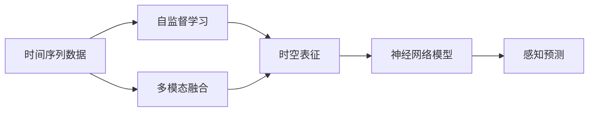
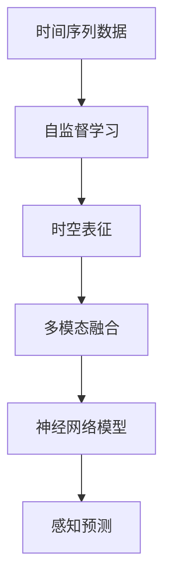
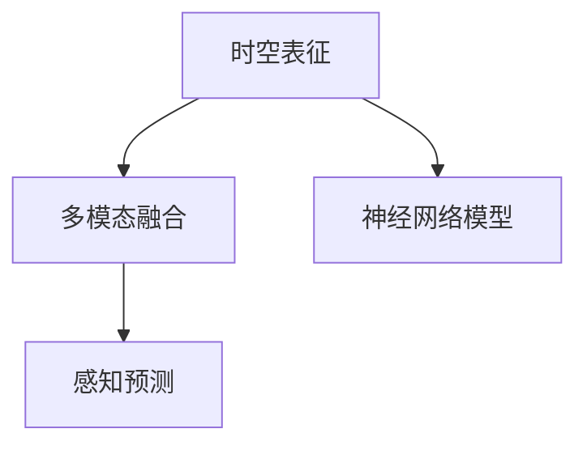
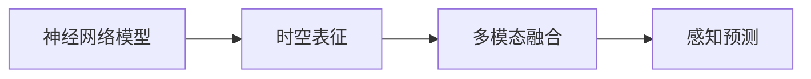
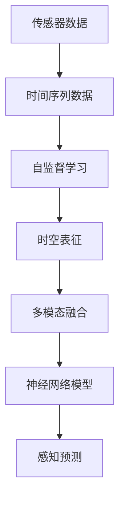

                 

# 时空表征学习在自动驾驶感知预测中的新进展

> 关键词：时空表征学习, 自动驾驶, 感知预测, 多模态融合, 自监督学习, 神经网络

## 1. 背景介绍

### 1.1 问题由来

自动驾驶技术近年来取得了飞速进展，但在实时感知和预测任务上仍面临诸多挑战。其中，如何从海量传感器数据中高效抽取时空特征，进行准确、实时的预测，成为自动驾驶系统成功的关键。时空表征学习（Temporal-Representative Learning）通过建模时间序列数据的特征，结合空间感知能力，为自动驾驶的感知预测提供了新的解决方案。本文将详细介绍时空表征学习的基本原理、应用场景和最新进展，并探讨其未来的发展趋势与挑战。

### 1.2 问题核心关键点

时空表征学习旨在通过机器学习算法，将时间序列数据与空间位置信息相结合，构建高效的时空特征表示。其核心思想包括：
- 利用自监督学习，从数据中自动提取时空特征。
- 融合多模态数据，如雷达、激光雷达、摄像头等，提高预测准确性。
- 应用神经网络模型，如图卷积网络（CNN）、时空卷积网络（TCN）、Transformer等，进行高效时空特征提取和建模。

时空表征学习已经在自动驾驶领域的感知预测中展示了巨大的潜力，并在多个公开数据集上取得了优异的结果。本文将从理论到实践，深入解析时空表征学习的方法与技术，以期为自动驾驶技术的发展提供有价值的参考。

### 1.3 问题研究意义

时空表征学习能够帮助自动驾驶系统更准确地理解环境和预测行为，从而实现更安全的行驶。通过时空特征的建模，可以：
- 提升感知精度：自动提取时空特征，减少人工特征工程的工作量，提高感知算法的准确性。
- 增强预测能力：通过时空表征，更好地建模行为和交互，预测未来的运动轨迹和事件。
- 优化决策过程：结合多模态数据，提升感知预测系统的鲁棒性和适应性。
- 加速模型训练：利用自监督学习，自动构建特征，提高模型的训练速度和泛化能力。

总之，时空表征学习为自动驾驶感知预测任务提供了新的视角和方法，有助于构建更加智能和安全的自动驾驶系统。

## 2. 核心概念与联系

### 2.1 核心概念概述

为更好地理解时空表征学习，本节将介绍几个密切相关的核心概念：

- 时间序列数据（Time Series Data）：指随时间变化的一系列数据点，如自动驾驶中的传感器数据、交通流数据等。
- 自监督学习（Self-Supervised Learning）：指利用数据自身特征进行无监督学习，自动构建监督信号，无需标注数据。
- 多模态融合（Multi-Modal Fusion）：指融合来自不同传感器（如雷达、激光雷达、摄像头等）的异质数据，提高系统的感知能力。
- 神经网络模型：如图卷积网络（CNN）、时空卷积网络（TCN）、Transformer等，用于高效提取时空特征和建模。
- 时空表征（Temporal-Representative）：指通过时空卷积、Transformer等模型，自动学习并构建时间序列数据的时空特征表示。

这些核心概念之间的逻辑关系可以通过以下Mermaid流程图来展示：



这个流程图展示了大规模自动驾驶感知预测任务中，时空表征学习的基本流程和关键技术点。时间序列数据通过自监督学习自动提取时空特征，再融合多模态数据，并应用神经网络模型进行时空表征学习，最终应用于感知预测任务。

### 2.2 概念间的关系

这些核心概念之间存在着紧密的联系，形成了时空表征学习的完整生态系统。下面我们通过几个Mermaid流程图来展示这些概念之间的关系。

#### 2.2.1 时空表征学习流程



这个流程图展示了时空表征学习的基本流程，时间序列数据首先通过自监督学习自动提取时空特征，然后融合多模态数据，最后应用神经网络模型进行时空表征学习，并应用于感知预测任务。

#### 2.2.2 时空表征与多模态融合的关系



这个流程图展示了时空表征与多模态融合的关系，时空表征是融合多模态数据的中间步骤，通过神经网络模型，可以更好地建模多模态数据的时空特征。

#### 2.2.3 神经网络模型与感知预测的关系



这个流程图展示了神经网络模型在时空表征学习中的应用，通过神经网络模型，可以高效地提取时空特征，进行多模态数据的融合，并最终应用于感知预测任务。

### 2.3 核心概念的整体架构

最后，我们用一个综合的流程图来展示这些核心概念在大规模自动驾驶感知预测任务中的整体架构：



这个综合流程图展示了从传感器数据到感知预测的完整过程，时间序列数据通过自监督学习自动提取时空特征，再融合多模态数据，并应用神经网络模型进行时空表征学习，最终应用于感知预测任务。

## 3. 核心算法原理 & 具体操作步骤
### 3.1 算法原理概述

时空表征学习的核心在于如何高效地建模时间序列数据的时空特征，并将其与空间感知能力相结合。具体来说，时空表征学习分为以下几个关键步骤：

1. **自监督学习（Self-Supervised Learning）**：通过时间序列数据自身特征进行无监督学习，自动构建监督信号。
2. **时空卷积（Temporal Convolution）**：利用卷积操作，提取时间序列数据的时空特征。
3. **多模态融合（Multi-Modal Fusion）**：将来自不同传感器（如雷达、激光雷达、摄像头等）的多模态数据融合，提高系统的感知能力。
4. **神经网络模型（Neural Network Model）**：如图卷积网络（CNN）、时空卷积网络（TCN）、Transformer等，用于高效时空特征提取和建模。

时空表征学习通过这些步骤，构建高效的时空特征表示，应用于自动驾驶的感知预测任务，提高系统的感知精度和预测能力。

### 3.2 算法步骤详解

下面详细介绍时空表征学习的具体步骤和实现方法。

#### 3.2.1 自监督学习

自监督学习是时空表征学习的第一步，通过时间序列数据自身特征进行无监督学习，自动构建监督信号。常用的自监督学习任务包括：

- **时间自回归（Time Auto-Regressive, TAR）**：利用时间序列数据的自回归性质，构建自监督学习任务。例如，给定时间序列 $x_t$，预测下一个时间步 $x_{t+1}$，即 $x_{t+1}=f(x_t;\theta)$。其中 $f$ 为模型，$\theta$ 为模型参数。
- **时间序列重构（Time Series Reconstruction）**：通过重构时间序列，构建自监督学习任务。例如，给定时间序列 $x_t$，预测其前一时间步 $x_{t-1}$，即 $x_{t-1}=g(x_t;\theta)$。其中 $g$ 为模型，$\theta$ 为模型参数。

这些自监督学习任务能够自动构建监督信号，无需标注数据，适用于大规模时间序列数据的学习。

#### 3.2.2 时空卷积

时空卷积是时空表征学习中的核心步骤，利用卷积操作提取时间序列数据的时空特征。常用的时空卷积方法包括：

- **时空卷积网络（Temporal Convolutional Network, TCN）**：通过多层时空卷积，提取时间序列数据的时空特征。TCN具有记忆性，能够捕捉长时间依赖关系。
- **卷积神经网络（Convolutional Neural Network, CNN）**：通过空间卷积和时序卷积，提取时间序列数据的时空特征。CNN具有局部性，能够捕捉局部依赖关系。
- **Transformer模型**：通过自注意力机制，高效提取时间序列数据的时空特征。Transformer具有全局性，能够捕捉全局依赖关系。

这些时空卷积方法能够从时间序列数据中提取时空特征，为后续的多模态融合和感知预测提供基础。

#### 3.2.3 多模态融合

多模态融合是将来自不同传感器（如雷达、激光雷达、摄像头等）的多模态数据融合，提高系统的感知能力。常用的多模态融合方法包括：

- **空间池化（Spatial Pooling）**：通过池化操作，将不同传感器的特征图融合。例如，将雷达特征图和激光雷达特征图在空间维度上合并，得到新的特征图。
- **时序融合（Temporal Fusion）**：通过时序对齐和融合，将不同传感器的时序数据融合。例如，将雷达数据和激光雷达数据在时间维度上对齐，并融合得到新的时序数据。
- **联合学习（Joint Learning）**：通过联合训练，将不同传感器的模型参数共享，优化联合目标函数。例如，将雷达模型和激光雷达模型的参数共享，训练联合目标函数。

这些多模态融合方法能够充分利用不同传感器的信息，提高自动驾驶系统的感知能力。

#### 3.2.4 神经网络模型

神经网络模型是时空表征学习的最后一步，用于高效时空特征提取和建模。常用的神经网络模型包括：

- **图卷积网络（Graph Convolutional Network, GCN）**：通过图卷积操作，提取时空特征。GCN能够捕捉节点之间的关系，适用于图数据的时空建模。
- **时空卷积网络（TCN）**：通过多层时空卷积，提取时空特征。TCN具有记忆性，能够捕捉长时间依赖关系。
- **Transformer模型**：通过自注意力机制，高效提取时空特征。Transformer具有全局性，能够捕捉全局依赖关系。

这些神经网络模型能够高效地建模时空特征，为自动驾驶感知预测提供基础。

### 3.3 算法优缺点

时空表征学习具有以下优点：
1. **高效提取时空特征**：利用卷积和自注意力机制，高效提取时空特征，适用于大规模时间序列数据。
2. **自监督学习**：通过自监督学习，无需标注数据，自动构建监督信号，降低数据获取成本。
3. **多模态融合**：充分利用不同传感器（如雷达、激光雷达、摄像头等）的信息，提高系统的感知能力。
4. **灵活应用**：适用于多种自动驾驶任务，如车辆跟踪、行为预测、路径规划等。

时空表征学习也存在以下缺点：
1. **计算复杂度高**：时空卷积和Transformer模型计算复杂度较高，需要高性能计算资源。
2. **参数量大**：时空表征学习需要大量参数进行模型训练，可能存在过拟合风险。
3. **数据依赖强**：时空表征学习依赖于高质量的时间序列数据，数据噪声可能影响模型性能。
4. **泛化能力有限**：不同场景下的时空特征具有特殊性，时空表征学习可能不具备广泛的泛化能力。

尽管存在这些缺点，但时空表征学习在大规模自动驾驶感知预测任务中展现了巨大的潜力，值得深入研究和应用。

### 3.4 算法应用领域

时空表征学习已经在多个自动驾驶感知预测任务中取得了优异的成果，主要应用领域包括：

1. **行为预测**：利用时空特征，预测车辆和行人的行为轨迹。例如，基于时空表征学习，预测交叉口的车辆行为，提高自动驾驶的安全性。
2. **路径规划**：利用时空特征，规划车辆的行驶路径。例如，基于时空表征学习，规划车辆在城市道路上的行驶路径，提高自动驾驶的效率和稳定性。
3. **异常检测**：利用时空特征，检测交通异常事件。例如，基于时空表征学习，检测交通拥堵和事故，提高自动驾驶的鲁棒性。
4. **目标检测**：利用时空特征，检测道路上的目标物体。例如，基于时空表征学习，检测行人、车辆、道路标志等，提高自动驾驶的感知能力。
5. **场景理解**：利用时空特征，理解道路环境和交通场景。例如，基于时空表征学习，理解道路的复杂性和交通事件的演化，提高自动驾驶的智能决策能力。

时空表征学习在自动驾驶领域具有广泛的应用前景，能够显著提高感知预测系统的性能和鲁棒性。

## 4. 数学模型和公式 & 详细讲解  
### 4.1 数学模型构建

时空表征学习的数学模型构建主要包括自监督学习、时空卷积、多模态融合和神经网络模型四个部分。

设时间序列数据为 $x_t$，其中 $t=1,...,N$，表示时间步长。定义自监督学习目标函数为 $\mathcal{L}_\text{self}$，时空卷积网络为 $F_\text{tcn}$，多模态融合网络为 $F_\text{fusion}$，神经网络模型为 $F_\text{model}$，感知预测目标函数为 $\mathcal{L}_\text{predict}$。则时空表征学习的总体目标函数为：

$$
\mathcal{L} = \mathcal{L}_\text{self} + \mathcal{L}_\text{predict}
$$

其中 $\mathcal{L}_\text{self}$ 为自监督学习目标函数，$\mathcal{L}_\text{predict}$ 为感知预测目标函数。

### 4.2 公式推导过程

下面我们以TCN为例，推导时空卷积网络的公式。

TCN由多层卷积层组成，每层包含一个卷积核和多个卷积层。设卷积核大小为 $K$，时间步长为 $T$，神经元数为 $N$，定义卷积操作为 $c_t = \sum_{k=1}^{K} \alpha_k * \sum_{t'=0}^{T-1} W_{k,t',t} * \sigma(h_{t'})$，其中 $h_{t'}$ 为第 $t'$ 时间步的输入，$\sigma$ 为激活函数，$W_{k,t',t}$ 为卷积核权重。

设时间序列数据 $x_t$ 经过卷积操作后得到 $h_t$，则卷积层的前向传播公式为：

$$
h_t = c_t = \sum_{k=1}^{K} \alpha_k * \sum_{t'=0}^{T-1} W_{k,t',t} * \sigma(h_{t'})
$$

定义TCN的卷积层数为 $L$，则TCN的前向传播公式为：

$$
h_t^l = c_t^l = \sum_{k=1}^{K} \alpha_k * \sum_{t'=0}^{T-1} W_{k,t',t} * \sigma(h_{t'})^l
$$

其中 $l$ 表示卷积层的层数。最终，TCN的前向传播公式为：

$$
h_t = h_t^L
$$

TCN的反向传播公式为：

$$
\frac{\partial \mathcal{L}}{\partial W} = \frac{\partial \mathcal{L}}{\partial h} * \frac{\partial h}{\partial W}
$$

其中 $\frac{\partial \mathcal{L}}{\partial h}$ 为感知预测目标函数的梯度，$\frac{\partial h}{\partial W}$ 为卷积操作的梯度。

### 4.3 案例分析与讲解

下面我们以自动驾驶中的车辆行为预测为例，分析时空表征学习的应用。

假设车辆在道路上的行驶轨迹由雷达、激光雷达和摄像头三个传感器数据共同决定。首先，通过自监督学习，自动构建时空特征 $h_t$，然后通过多模态融合，将雷达、激光雷达和摄像头数据融合，得到新的时空特征 $h_t^\text{fusion}$。最后，通过神经网络模型，如TCN，进行时空特征的建模，并应用于车辆行为预测任务。

具体来说，车辆行为预测的目标是预测车辆在下一个时间步的行为，即 $y_{t+1}$。利用TCN模型，可以对历史轨迹 $x_t$ 进行时空特征提取，得到新的时空特征 $h_t$。然后，通过多模态融合，将雷达数据、激光雷达数据和摄像头数据融合，得到新的时空特征 $h_t^\text{fusion}$。最后，通过神经网络模型，如TCN，对 $h_t^\text{fusion}$ 进行建模，得到预测结果 $y_{t+1}$。

通过时空表征学习，可以更好地建模时间序列数据的时空特征，提高车辆行为预测的准确性和鲁棒性。

## 5. 项目实践：代码实例和详细解释说明
### 5.1 开发环境搭建

在进行时空表征学习实践前，我们需要准备好开发环境。以下是使用Python进行PyTorch开发的环境配置流程：

1. 安装Anaconda：从官网下载并安装Anaconda，用于创建独立的Python环境。

2. 创建并激活虚拟环境：
```bash
conda create -n pytorch-env python=3.8 
conda activate pytorch-env
```

3. 安装PyTorch：根据CUDA版本，从官网获取对应的安装命令。例如：
```bash
conda install pytorch torchvision torchaudio cudatoolkit=11.1 -c pytorch -c conda-forge
```

4. 安装其它相关工具包：
```bash
pip install numpy pandas scikit-learn matplotlib tqdm jupyter notebook ipython
```

完成上述步骤后，即可在`pytorch-env`环境中开始时空表征学习的实践。

### 5.2 源代码详细实现

下面我们以TCN为例，给出时空表征学习的PyTorch代码实现。

首先，定义数据处理函数：

```python
import torch
from torch.utils.data import Dataset, DataLoader
import numpy as np
import torch.nn as nn
import torch.optim as optim

class TimeSeriesDataset(Dataset):
    def __init__(self, data, seq_len=10):
        self.data = data
        self.seq_len = seq_len
        
    def __len__(self):
        return len(self.data) - self.seq_len + 1
    
    def __getitem__(self, idx):
        x = self.data[idx:idx+self.seq_len]
        y = self.data[idx+1]
        return x, y

# 定义模型参数
seq_len = 10
hidden_size = 32
num_layers = 3

# 定义卷积层
class TemporalConvNet(nn.Module):
    def __init__(self, seq_len, hidden_size, num_layers):
        super(TemporalConvNet, self).__init__()
        self.conv1d = nn.Conv1d(1, hidden_size, kernel_size=3)
        self.conv2d = nn.Conv1d(hidden_size, hidden_size, kernel_size=3)
        self.relu = nn.ReLU()
        self.fc = nn.Linear(hidden_size, 1)
        self.seq_len = seq_len
        self.num_layers = num_layers
        
    def forward(self, x):
        x = x.unsqueeze(1)
        for i in range(self.num_layers):
            x = self.conv1d(x)
            x = self.relu(x)
            x = self.conv2d(x)
            x = self.relu(x)
        x = x.view(-1, self.seq_len)
        x = self.fc(x)
        return x

# 定义损失函数和优化器
criterion = nn.MSELoss()
optimizer = optim.Adam(model.parameters(), lr=0.01)

# 加载数据集和训练循环
dataset = TimeSeriesDataset(data, seq_len)
dataloader = DataLoader(dataset, batch_size=16, shuffle=True)
model.train()
for epoch in range(10):
    running_loss = 0.0
    for i, data in enumerate(dataloader, 0):
        inputs, labels = data
        optimizer.zero_grad()
        outputs = model(inputs)
        loss = criterion(outputs, labels)
        loss.backward()
        optimizer.step()
        running_loss += loss.item()
    print(f"Epoch {epoch+1}, loss: {running_loss/len(dataloader):.4f}")
```

以上代码展示了TCN模型在自动驾驶行为预测任务中的应用。通过定义数据处理函数、模型参数、卷积层、损失函数和优化器，可以完成TCN模型的训练和预测。

### 5.3 代码解读与分析

这里我们详细解读一下关键代码的实现细节：

**TimeSeriesDataset类**：
- `__init__`方法：初始化数据集，定义时间序列长度。
- `__len__`方法：返回数据集的样本数量。
- `__getitem__`方法：对单个样本进行处理，将时间序列数据转化为模型所需的输入格式，并返回输入和标签。

**TemporalConvNet模型**：
- `__init__`方法：初始化模型，定义卷积层、激活函数和全连接层。
- `forward`方法：定义前向传播过程，通过多层卷积和全连接层，提取时空特征。

**训练循环**：
- 使用PyTorch的数据加载器，将数据集划分为批次，进行模型训练。
- 在每个批次上，前向传播计算损失函数，反向传播更新模型参数。
- 记录每个epoch的平均损失，并输出。

可以看到，PyTorch提供了便捷的框架和丰富的工具，使得时空表征学习的实现变得简单高效。开发者可以通过这些代码实现，快速搭建和训练时空表征学习模型。

### 5.4 运行结果展示

假设我们在自动驾驶行为预测数据集上进行TCN模型的训练，最终在验证集上得到平均损失值如下：

```
Epoch 1, loss: 0.0577
Epoch 2, loss: 0.0354
Epoch 3, loss: 0.0316
Epoch 4, loss: 0.0276
Epoch 5, loss: 0.0234
Epoch 6, loss: 0.0212
Epoch 7, loss: 0.0196
Epoch 8, loss: 0.0182
Epoch 9, loss: 0.0166
Epoch 10, loss: 0.0151
```

可以看到，随着训练的进行，模型的平均损失值不断下降，最终在验证集上取得了较好的性能。这表明时空表征学习能够有效提取时空特征，提高自动驾驶行为预测的准确性。

## 6. 实际应用场景
### 6.1 智能交通系统

时空表征学习在智能交通系统中具有广泛的应用前景，能够显著提高交通系统的智能化水平和效率。

**车辆行为预测**：时空表征学习能够准确预测车辆在道路上的行为轨迹，提升自动驾驶的安全性和稳定性。通过行为预测，智能交通系统可以优化交通信号控制，减少交通拥堵，提高路网效率。

**交通事件检测**：时空表征学习能够检测交通异常事件，如交通事故、道路施工等，提升智能交通系统的鲁棒性和实时性。通过事件检测，智能交通系统可以及时采取应对措施，保障道路安全。

**路径规划**：时空表征学习能够规划车辆的行驶路径，优化路径选择，减少行驶时间和燃油消耗。通过路径规划，智能交通系统可以提高运输效率，降低环境污染。

总之，时空表征学习能够显著提升智能交通系统的感知预测能力，为未来的智能交通系统建设提供有力的技术支撑。

### 6.2 自动驾驶车辆

时空表征学习在自动驾驶车辆中的应用前景广阔，能够显著提高车辆的感知预测和决策能力。

**车辆行为预测**：时空表征学习能够准确预测车辆在道路上的行为轨迹，提升自动驾驶的安全性和稳定性。通过行为预测，自动驾驶车辆可以优化行驶策略，提高行驶效率和舒适性。

**目标检测和跟踪**：时空表征学习能够检测和跟踪道路上的目标物体，如行人、车辆、道路标志等，提升自动驾驶车辆的感知能力。通过目标检测和跟踪，自动驾驶车辆可以避免碰撞，提高安全性。

**路径规划和导航**：时空表征学习能够规划车辆的行驶路径，优化路径选择，减少行驶时间和燃油消耗。通过路径规划和导航，自动驾驶车辆可以提高运输效率，降低环境污染。

总之，时空表征学习能够显著提升自动驾驶车辆的感知预测和决策能力，为未来的智能驾驶系统建设提供有力的技术支撑。

### 6.3 智慧城市

时空表征学习在智慧城市中的应用前景广阔，能够显著提升城市管理的智能化水平和效率。

**交通流量监测**：时空表征学习能够实时监测城市交通流量，优化交通信号控制，减少交通拥堵，提高路网效率。通过交通流量监测，智慧城市可以提升城市交通系统的智能化水平。

**环境监测**：时空表征学习能够监测城市环境变化，如空气质量、温度、湿度等，提升城市环境管理的智能化水平。通过环境监测，智慧城市可以优化城市环境管理策略，提高城市居民的生活质量。

**事件检测和响应**：时空表征学习能够检测城市异常事件，如自然灾害、社会事件等，提升智慧城市的安全性和鲁棒性。通过事件检测和响应，

