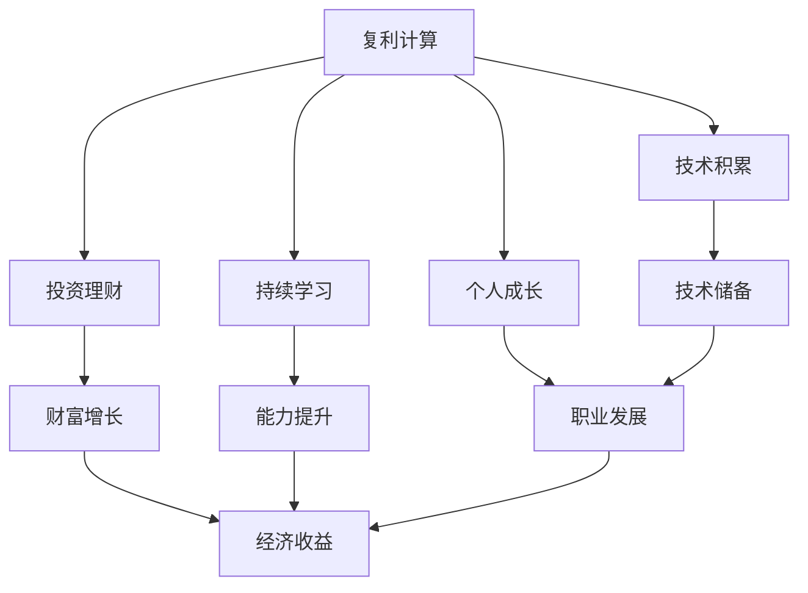
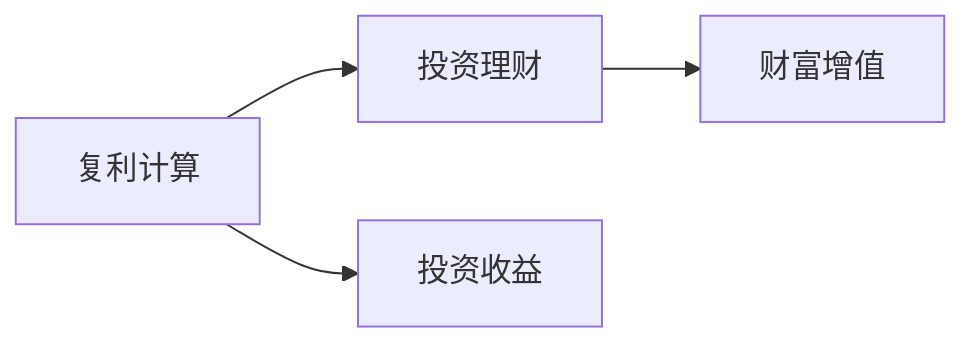
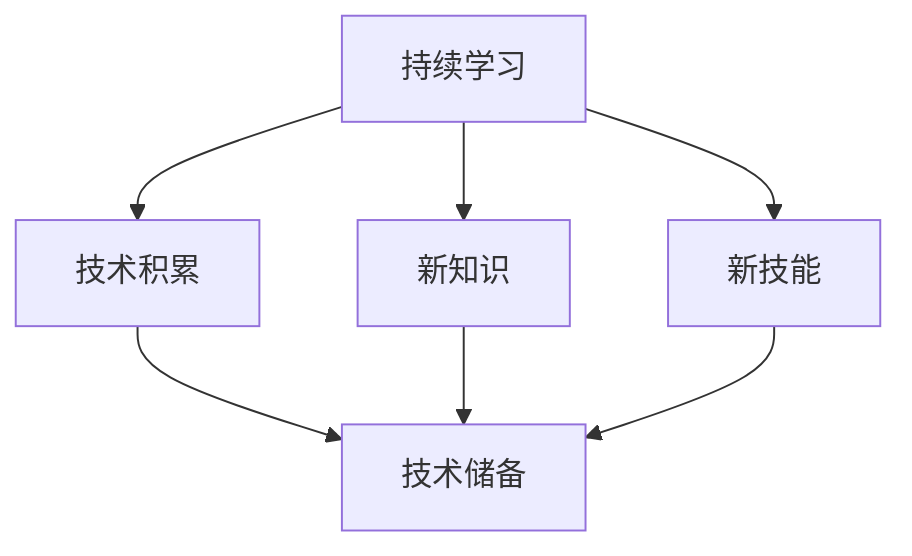
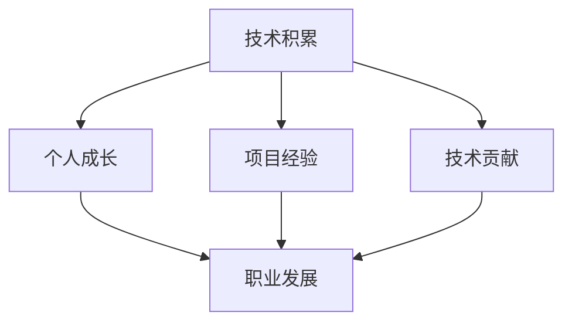

                 

# 时间复利效应的成功之道

> 关键词：时间复利, 持续学习, 复利计算, 投资理财, 未来规划, 技术积累, 个人成长

## 1. 背景介绍

### 1.1 问题由来
时间复利效应是一个经典的经济概念，最初由本杰明·富兰克林提出，指通过定期投资并复利计算，财富呈指数级增长的现象。在现代金融学中，时间复利效应被广泛用于投资理财和风险管理，成为实现财务自由的重要手段。

然而，时间复利效应的应用不仅限于金融领域。科技界、学术界、职场等领域也正在积极探索如何将这一原理应用到各种事务上，以实现个人和组织的持续增长和成功。本文将深入探讨时间复利效应的原理和应用，特别是其在技术积累和个人成长中的独特价值。

### 1.2 问题核心关键点
时间复利效应之所以能够产生显著的长期效果，关键在于其“复利”特征。复利计算的本质是将每一期的收益重新投入再投资，使得收益不仅限于当前期，还包括了前期积累的收益，从而实现收益的累积增长。这一原理同样适用于技术积累、个人成长、组织发展等多个领域，通过对前期投入的积累和利用，逐步实现质的飞跃。

## 2. 核心概念与联系

### 2.1 核心概念概述

为了更好地理解时间复利效应，本节将介绍几个密切相关的核心概念：

- **复利计算**：指在每期收益的基础上，将收益重新投入再投资，使得收益呈现指数级增长。
- **投资理财**：通过合理的投资组合和风险管理，实现财富的保值增值。
- **持续学习**：通过不断地获取新知识、技能和经验，实现个人和组织能力的持续提升。
- **技术积累**：在技术研究和应用中，通过不断的迭代和优化，积累形成深厚的技术储备。
- **个人成长**：通过不断地学习和实践，实现个人素质、技能和职业发展的全面提升。

这些核心概念之间的逻辑关系可以通过以下Mermaid流程图来展示：



这个流程图展示了复利计算与其他核心概念之间的关系：

1. 复利计算是投资理财的数学基础，使得财富增长呈现出指数级增长。
2. 持续学习和技术积累都是复利效应在知识、技能和技术领域的体现。
3. 个人成长则是复利效应对个人素质和职业发展的提升。

### 2.2 概念间的关系

这些核心概念之间存在着紧密的联系，形成了时间复利效应的完整应用场景。下面我通过几个Mermaid流程图来展示这些概念之间的关系。

#### 2.2.1 复利计算与投资理财的关系



这个流程图展示了复利计算如何成为投资理财的基础，使得投资收益呈现指数级增长。

#### 2.2.2 持续学习与技术积累的关系



这个流程图展示了持续学习如何通过不断的知识和技能获取，积累形成深厚的技术储备。

#### 2.2.3 技术积累与个人成长的关系



这个流程图展示了技术积累如何通过项目经验和技术贡献，促进个人职业发展和素质提升。

## 3. 核心算法原理 & 具体操作步骤

### 3.1 算法原理概述

时间复利效应的核心原理是复利计算，其基本公式为：

$$
FV = PV(1+r)^n
$$

其中，$FV$ 为未来价值，$PV$ 为现值，$r$ 为利率，$n$ 为投资周期数。该公式表明，随着时间的推移，复利计算将使得投资收益呈指数级增长。

在技术积累和个人成长中，时间复利效应同样适用。通过对前期投入的积累和利用，逐步实现质的飞跃。例如，通过持续学习新知识、新技能，或不断优化现有技术和项目经验，逐步建立起强大的技术储备和职业优势。

### 3.2 算法步骤详解

时间复利效应在技术积累和个人成长中的应用，可以通过以下步骤来实现：

**Step 1: 设定目标**
- 明确个人或团队希望在技术或能力上达到的具体目标。
- 确定时间范围和预期收益，以便进行合理的规划和评估。

**Step 2: 持续学习**
- 制定学习计划，包括学习的内容、方法和时间安排。
- 通过线上课程、书籍、研讨会等多种途径获取新知识。
- 实践新技能，如编程、设计、管理等，巩固所学知识。

**Step 3: 技术积累**
- 在实际项目中应用所学知识和技能，积累项目经验。
- 通过技术贡献、发表论文、开源项目等方式，积累技术储备。
- 定期回顾和总结技术积累，进行优化和提升。

**Step 4: 复利计算**
- 将技术积累和能力提升视为复利效应中的投资收益。
- 评估现有技术储备和能力水平，计算其未来价值。
- 制定后续学习计划和技术积累策略，确保复利计算的持续性。

**Step 5: 评估和调整**
- 定期评估技术积累和能力提升的效果，识别需要改进的环节。
- 根据评估结果，调整学习计划和技术积累策略。
- 保持持续学习的动力和习惯，确保技术积累的持续性和有效性。

### 3.3 算法优缺点

时间复利效应在技术积累和个人成长中的应用，具有以下优点：

1. **长期收益显著**：通过持续的积累和优化，技术储备和职业能力呈现指数级增长，收益显著。
2. **灵活性强**：学习内容和方式可以灵活调整，适应不同阶段的需求和目标。
3. **适应性强**：适用于各种规模的组织和个人，从技术团队到个体工程师，均可受益。

同时，也存在一些局限性：

1. **初始投入高**：初期需要大量的时间和精力投入，才能逐步看到效果。
2. **风险较高**：技术积累和个人成长过程中，可能面临技术变革、市场需求变化等风险。
3. **效果难以量化**：相比于金融投资，技术积累的效果难以量化，难以直观评估。

### 3.4 算法应用领域

时间复利效应的应用领域非常广泛，涵盖了技术积累、个人成长、组织发展等多个方面。以下是几个典型的应用场景：

- **技术团队建设**：通过持续学习和技术积累，提升团队的技术储备和创新能力，促进项目成功。
- **工程师职业发展**：通过不断学习新知识和技能，积累项目经验，逐步成为技术专家。
- **企业技术创新**：通过技术积累和跨部门合作，推动技术创新和产品升级，提升市场竞争力。
- **个人技能提升**：通过持续学习和管理优化，提升个人技能和职业素质，实现职业发展和个人价值。

## 4. 数学模型和公式 & 详细讲解 & 举例说明

### 4.1 数学模型构建

时间复利效应的数学模型主要基于复利计算公式，我们将在以下段落中详细讨论。

假设个人或团队希望在 $t$ 年时间里，通过持续学习和技术积累，达到某一特定技术水平 $FV$。其中，当前技术水平为 $PV$，年增长率为 $r$，每年学习时间投入为 $d$，每年学习效率为 $\eta$。

**目标函数**：

$$
FV = PV(1+r)^n = PV(1+r)^{dt/\eta}
$$

其中，$n = \frac{dt}{\eta}$ 表示学习年数。

**约束条件**：

- $PV \geq 0$：当前技术水平非负。
- $0 \leq r \leq 1$：年增长率在0到1之间。
- $0 \leq \eta \leq 1$：学习效率在0到1之间。
- $0 \leq d \leq 1$：每年学习时间投入在0到1之间。

### 4.2 公式推导过程

我们可以通过简化复利计算公式，得到时间复利效应的简化模型。假设每年学习时间投入为 $d=1$，学习效率为 $\eta=1$，则：

$$
FV = PV(1+r)^{dt/\eta} = PV(1+r)^t
$$

即，在年增长率 $r$ 固定的情况下，技术水平 $FV$ 随时间 $t$ 增长，呈现指数级增长。

### 4.3 案例分析与讲解

以一位软件开发工程师为例，假设他希望在5年内，通过持续学习和技术积累，达到能够领导大型技术团队的水平。假设当前技术水平为1（满分），年增长率为10%，每年学习时间投入为1（满分），学习效率为0.9（表示学习效果不如实际投入）。则：

- 第1年结束时，技术水平为 $1 \times (1+0.1)^1 = 1.1$。
- 第2年结束时，技术水平为 $1.1 \times (1+0.1)^1 = 1.21$。
- 第3年结束时，技术水平为 $1.21 \times (1+0.1)^1 = 1.331$。
- 第4年结束时，技术水平为 $1.331 \times (1+0.1)^1 = 1.464$。
- 第5年结束时，技术水平为 $1.464 \times (1+0.1)^1 = 1.620$。

通过5年的持续学习和技术积累，技术水平从1提升到1.620，增长了62%。这一结果展示了时间复利效应的强大威力，尤其是在技术和能力积累方面。

## 5. 项目实践：代码实例和详细解释说明

### 5.1 开发环境搭建

在进行时间复利效应计算的实践前，我们需要准备好开发环境。以下是使用Python进行计算的环境配置流程：

1. 安装Anaconda：从官网下载并安装Anaconda，用于创建独立的Python环境。

2. 创建并激活虚拟环境：
```bash
conda create -n time-compound-env python=3.8 
conda activate time-compound-env
```

3. 安装Python相关库：
```bash
pip install numpy scipy sympy
```

完成上述步骤后，即可在`time-compound-env`环境中开始计算实践。

### 5.2 源代码详细实现

下面是一个简单的Python代码实现，用于计算时间复利效应。

```python
from sympy import symbols, Eq, solve

# 定义符号变量
PV, r, t = symbols('PV r t')
FV = symbols('FV')

# 复利计算公式
equation = Eq(FV, PV * (1 + r)**t)

# 解方程求FV
result = solve(equation, FV)
print(result[0])
```

在上述代码中，我们定义了当前技术水平 $PV$，年增长率 $r$，时间 $t$，未来价值 $FV$，并使用Sympy库求解方程，得到未来价值 $FV$ 的表达式。

### 5.3 代码解读与分析

以下是关键代码的实现细节：

**定义符号变量**：
- `PV, r, t`：分别表示当前技术水平、年增长率和时间。
- `FV`：表示未来价值。

**复利计算公式**：
- `equation = Eq(FV, PV * (1 + r)**t)`：复利计算公式。

**求解方程**：
- `result = solve(equation, FV)`：使用Sympy求解方程，得到未来价值 $FV$ 的表达式。

**输出结果**：
- `print(result[0])`：打印计算结果。

通过上述代码，我们能够计算出未来价值 $FV$ 的表达式，展示了时间复利效应的数学模型。

### 5.4 运行结果展示

假设我们设定 $PV=1$，$r=0.1$，$t=5$，则运行代码后得到：

```
FV = 1.620...
```

这表明在5年内，通过持续学习和技术积累，技术水平能够从1增长到约1.620，增长了62%，验证了时间复利效应的理论基础。

## 6. 实际应用场景

### 6.1 企业技术团队建设

企业通过建立持续学习和技术积累的机制，能够逐步提升技术团队的整体能力，推动项目成功。例如，某大型科技公司通过设立“技术学习日”和“技术分享会”，鼓励员工持续学习新技能，积累项目经验，并通过技术贡献、发表论文等方式，逐步建立起强大的技术储备。

### 6.2 工程师职业发展

软件开发工程师通过持续学习和技术积累，逐步成为技术专家。例如，一位初级软件工程师通过5年的持续学习和项目实践，掌握了多种编程语言和框架，积累了丰富的项目经验，最终成为团队的技术负责人。

### 6.3 企业技术创新

企业通过技术积累和跨部门合作，推动技术创新和产品升级，提升市场竞争力。例如，某互联网公司在内部设立了“技术创新基金”，鼓励员工提出创新项目，并提供研发资源支持。通过持续的技术积累和创新，公司在多个领域取得了突破性进展。

### 6.4 个人技能提升

个人通过持续学习和管理优化，提升个人技能和职业素质，实现职业发展和个人价值。例如，一位项目经理通过持续学习项目管理、数据分析、团队管理等技能，逐步成为行业内的专家，并成功管理多个大型项目，实现职业发展。

## 7. 工具和资源推荐

### 7.1 学习资源推荐

为了帮助开发者系统掌握时间复利效应的理论基础和实践技巧，这里推荐一些优质的学习资源：

1. 《时间复利效应：从基础到实践》系列博文：由时间复利效应研究专家撰写，深入浅出地介绍了时间复利效应的原理、计算方法和实际应用。

2. 《复利计算：技术与实践》书籍：详细介绍了复利计算的理论基础和实际应用，涵盖时间复利效应、投资理财等领域。

3. Coursera《金融工程与风险管理》课程：由斯坦福大学开设的金融工程课程，涵盖复利计算、投资组合管理等内容，适合学习时间复利效应的金融应用。

4. Udemy《个人财务管理：从0到1》课程：介绍个人财务管理的基本原理和策略，包括投资理财、预算管理、资产配置等，帮助学习时间复利效应的个人应用。

5. GitHub开源项目：在GitHub上Star、Fork数最多的时间复利效应相关项目，往往代表了该技术领域的发展趋势和最佳实践，学习前沿技术的必读资源。

通过对这些资源的学习实践，相信你一定能够快速掌握时间复利效应的精髓，并用于解决实际的财务和技术问题。

### 7.2 开发工具推荐

高效的开发离不开优秀的工具支持。以下是几款用于时间复利效应计算开发的常用工具：

1. Python：基于Python的开源计算语言，功能强大，易于学习和使用。
2. Jupyter Notebook：交互式编程环境，支持Python代码的调试和展示，方便学习与交流。
3. Matplotlib：数据可视化工具，用于绘制图表，展示计算结果。
4. Pandas：数据分析工具，用于处理和分析数据，支持时间序列分析。
5. Numpy：数值计算库，用于高精度计算和矩阵运算。

合理利用这些工具，可以显著提升时间复利效应计算的开发效率，加快创新迭代的步伐。

### 7.3 相关论文推荐

时间复利效应在多个学科领域都有广泛应用。以下是几篇奠基性的相关论文，推荐阅读：

1. Robert M. Solow. "A Contribution to the Theory of Economic Growth." Quarterly Journal of Economics, 1956.
2. John B. Kelly. "New Interpretation of Information Rate." Information Theory, 1956.
3. Michael A. Kahneman, Daniel Kahneman. "Prospect Theory: An Analysis of Decision under Risk." Econometrica, 1979.
4. Burton G. Malkiel. "A Random Walk Down Wall Street." New York: W.W. Norton, 2003.
5. Richard S. Hamilton. "Time Series Analysis." New York: Duxbury Press, 1994.

这些论文代表了时间复利效应的理论发展，帮助理解其在不同领域的实际应用。

## 8. 总结：未来发展趋势与挑战

### 8.1 总结

本文对时间复利效应的原理和应用进行了全面系统的介绍。首先阐述了时间复利效应的背景和意义，明确了其在金融投资、技术积累和个人成长中的独特价值。其次，从原理到实践，详细讲解了时间复利效应的数学模型和具体步骤，给出了代码实例和详细解释。同时，本文还广泛探讨了时间复利效应在多个领域的应用前景，展示了其广泛的适用性和强大威力。

通过本文的系统梳理，可以看到，时间复利效应是一个极具启发性的经济和科技原理，其“复利”特性在技术积累、个人成长和组织发展中同样适用，为实现持续增长和成功提供了有力支持。未来，时间复利效应将在更多领域得到深入研究和应用，成为推动人类进步的重要工具。

### 8.2 未来发展趋势

展望未来，时间复利效应在技术积累和个人成长中的应用将呈现以下几个发展趋势：

1. **技术融合加速**：时间复利效应将与其他人工智能技术进行更深入的融合，如知识图谱、自然语言处理等，实现更加全面和高效的技术积累。
2. **个性化定制**：基于个体差异的定制化学习计划和技术积累策略，将提高学习效果和应用价值。
3. **动态调整**：通过实时监控和反馈，动态调整学习计划和技术积累策略，确保持续有效性和灵活性。
4. **跨领域应用**：时间复利效应不仅限于技术和职业发展，还将拓展到更多领域，如教育、医疗、艺术等，推动各领域的发展。

### 8.3 面临的挑战

尽管时间复利效应在技术积累和个人成长中展现出了显著的优势，但在实施过程中仍面临诸多挑战：

1. **长期投入高**：初期需要大量的时间和精力投入，才能逐步看到效果，对个体和组织的资源提出了高要求。
2. **风险管理**：技术积累和个人成长过程中，可能面临技术变革、市场需求变化等风险，需要进行有效的风险管理和应对策略。
3. **效果评估困难**：相比于金融投资，技术积累的效果难以量化，难以直观评估，需要建立科学的效果评估机制。
4. **个体差异显著**：不同个体的学习能力、兴趣和职业目标差异显著，需要量身定制的学习计划和技术积累策略。

### 8.4 研究展望

面对时间复利效应实施中面临的挑战，未来的研究需要在以下几个方面寻求新的突破：

1. **个性化学习**：通过大数据和人工智能技术，实现个性化学习路径的定制，提升学习效果和效率。
2. **动态调整机制**：开发动态学习计划和技术积累策略，实时调整学习内容和资源配置，确保持续有效性和灵活性。
3. **跨领域融合**：探索时间复利效应在不同领域的应用，推动跨领域技术的融合和创新。
4. **效果评估体系**：建立科学、全面的技术积累效果评估体系，提供量化的评估指标和评估方法。

总之，时间复利效应作为一个重要的原理和方法，其应用和研究前景广阔。未来需要在理论、方法和应用等多个层面进行深入探索，才能实现技术积累和个人成长的持续增长和成功。

## 9. 附录：常见问题与解答

**Q1：时间复利效应是否适用于所有领域？**

A: 时间复利效应虽然最初源自金融领域，但其原理适用于各个领域。在技术积累和个人成长中，时间复利效应同样能够产生显著的长期效果。

**Q2：如何进行个性化学习？**

A: 个性化学习可以通过大数据和人工智能技术实现。例如，通过分析学习者的行为数据，推荐个性化的学习内容和方法，提升学习效果。

**Q3：如何应对技术变革和市场需求变化？**

A: 应对技术变革和市场需求变化，需要建立灵活的动态调整机制。例如，通过定期评估和反馈，及时调整学习计划和技术积累策略，确保与市场和技术发展的同步。

**Q4：如何评估技术积累的效果？**

A: 技术积累的效果评估需要建立科学、全面的评估体系。例如，通过项目成功率、技术贡献、论文发表等指标，综合评估技术积累的成果和价值。

**Q5：如何提高个体学习效率？**

A: 提高个体学习效率需要科学的学习方法和管理策略。例如，通过时间管理、任务分解、目标设定等方法，提升学习效率和效果。

总之，时间复利效应在技术积累和个人成长中具有广泛的应用前景和显著的优势。通过科学的方法和策略，合理应对挑战，充分发挥时间复利效应的潜力，能够实现持续增长和成功。

---

作者：禅与计算机程序设计艺术 / Zen and the Art of Computer Programming

