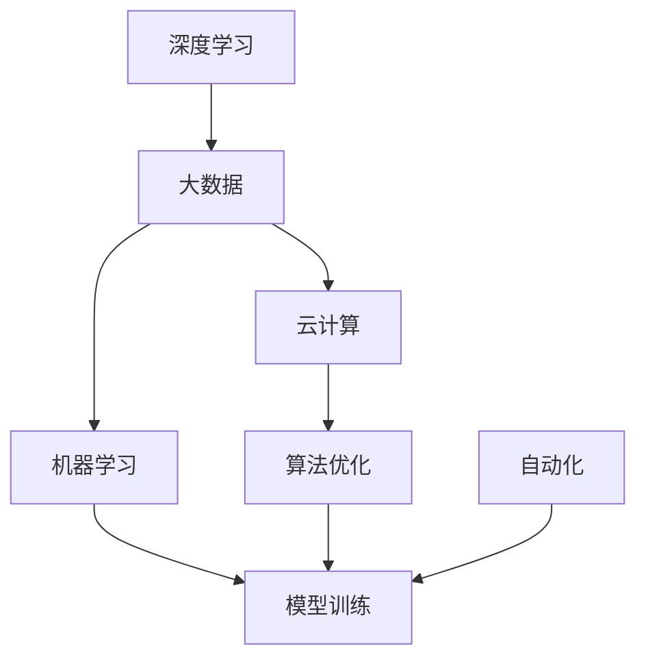

                 

# 智能产业化的未来发展方向

> 关键词：
1. 人工智能产业化
2. 智能技术应用
3. 深度学习
4. 大数据
5. 云计算
6. 机器学习
7. 自动化

## 1. 背景介绍

### 1.1 问题由来

近年来，人工智能(AI)技术的快速发展，尤其是在深度学习、大数据、云计算等领域的突破，使得人工智能在各行各业的应用日益广泛。从自动驾驶、医疗诊断到智能客服、金融风控，AI技术正逐渐渗透到生产、生活中的各个环节，带来了生产效率的提升和用户体验的改善。

然而，尽管AI技术的发展已经取得了显著进展，但其产业化的过程仍然面临诸多挑战。这些挑战不仅包括技术层面的算法优化、模型训练等难题，还包括市场层面的应用推广、商业模式构建等复杂问题。因此，探讨AI技术在产业化的过程中所面临的挑战及未来发展方向，具有重要意义。

### 1.2 问题核心关键点

在AI产业化的过程中，有几个关键点需要特别关注：

- **技术成熟度**：AI技术在算法、模型、数据处理等方面是否达到足够的成熟度，能否在实际应用中稳定可靠地运行。
- **应用场景适配**：AI技术是否能适应特定行业或场景的业务需求，是否能够无缝集成到现有的业务流程中。
- **商业模式创新**：AI技术能否创新商业模式，为产业带来新的收入和利润增长点。
- **市场接受度**：AI技术在市场中的接受度和认可度，是否能够实现大规模部署和应用。
- **伦理与法律问题**：AI技术的开发和应用是否符合伦理和法律规范，能否避免对社会产生负面影响。

### 1.3 问题研究意义

探讨AI技术在产业化过程中的未来发展方向，对于推动AI技术在更多领域的应用，提升产业智能化水平，具有重要意义：

- **推动技术进步**：通过分析AI技术在产业化过程中遇到的挑战，可以更好地指导后续的技术研发和优化。
- **加速应用落地**：了解AI技术在特定行业中的适用性和应用模式，有助于加速其在实际业务中的应用推广。
- **激发创新活力**：探讨AI技术在产业化过程中可能带来的商业模式变革和市场机遇，可以激发更多的创新灵感和创业机会。
- **保障社会福祉**：在AI技术普及过程中，需要确保其符合伦理和法律规范，避免对社会产生不利影响。

## 2. 核心概念与联系

### 2.1 核心概念概述

在探讨AI产业化的未来发展方向时，需要理解几个核心概念：

- **深度学习**：一种基于人工神经网络的机器学习技术，通过多层次的非线性变换，可以从大量数据中学习到复杂的特征表示。
- **大数据**：指数据量大、数据种类多、数据生成速度快、数据真实性高、数据可用性高的特征。
- **云计算**：一种基于互联网的计算模式，通过网络提供计算资源和应用服务，使得用户无需购买硬件设备，即可使用高性能计算资源。
- **机器学习**：一种通过算法和模型从数据中学习规律，并利用这些规律进行预测或决策的技术。
- **自动化**：指通过技术手段，减少或替代人工操作，提高工作效率和准确性。
- **算法优化**：通过优化算法，提高模型性能，降低计算成本。
- **模型训练**：通过训练数据集，调整模型参数，使其能够更好地拟合真实数据。

这些核心概念构成了AI产业化的基础，相互之间存在着紧密的联系。深度学习、大数据和云计算为AI技术提供了强大的数据和计算支持，而机器学习则提供了智能决策的能力，自动化则实现了对数据和模型的自动化处理和管理。算法优化和模型训练则是提升AI技术应用效果的关键手段。

### 2.2 概念间的关系

这些核心概念之间的逻辑关系可以通过以下Mermaid流程图来展示：



这个流程图展示了大数据、云计算、深度学习、机器学习、算法优化、模型训练、自动化之间的关系：

1. 深度学习和大数据通过云计算提供计算资源，为机器学习提供了强大的数据和计算支持。
2. 机器学习通过算法优化和模型训练，提升了深度学习的模型性能。
3. 自动化实现了对大数据、云计算、深度学习、机器学习、算法优化和模型训练的自动化处理和管理。

## 3. 核心算法原理 & 具体操作步骤

### 3.1 算法原理概述

AI产业化的核心算法原理主要包括以下几个方面：

- **深度学习**：通过多层次的神经网络模型，从大量数据中学习到复杂的特征表示，用于分类、回归、生成等任务。
- **大数据处理**：通过分布式计算、数据挖掘、数据清洗等技术，从海量数据中提取有价值的信息。
- **云计算平台**：通过虚拟化技术，提供高性能计算资源和应用服务，支持大数据处理和深度学习的训练和部署。
- **算法优化**：通过优化算法，提高模型性能，降低计算成本。
- **模型训练**：通过训练数据集，调整模型参数，使其能够更好地拟合真实数据。

### 3.2 算法步骤详解

AI产业化的算法步骤主要包括以下几个关键步骤：

1. **数据采集与预处理**：收集相关领域的原始数据，进行清洗、归一化、分词等预处理，准备数据集。
2. **模型选择与设计**：根据任务需求，选择合适的深度学习模型和架构，进行模型设计和优化。
3. **模型训练与调优**：使用训练数据集，对模型进行训练和调优，调整超参数和优化算法，提升模型性能。
4. **模型评估与验证**：使用测试数据集对模型进行评估和验证，确保模型在真实场景中表现稳定可靠。
5. **模型部署与应用**：将模型部署到云端或本地服务器，进行应用推广和业务集成，实现智能化应用。

### 3.3 算法优缺点

AI产业化的算法具有以下优点：

- **高精度**：深度学习和机器学习模型通常具有较高的精度，可以处理复杂的业务问题。
- **可扩展性**：通过云计算平台，可以实现高性能计算资源的灵活扩展，满足大数据处理和深度学习训练的需求。
- **自动化**：自动化技术可以实现数据、模型、算法的自动化处理和管理，提高工作效率和准确性。
- **灵活性**：AI算法可以根据不同的业务需求，进行灵活调整和优化，适应不同的应用场景。

同时，AI算法也存在一些缺点：

- **数据依赖**：深度学习和机器学习模型需要大量的标注数据，数据收集和标注工作量大。
- **计算成本高**：深度学习模型的训练和推理需要高性能计算资源，计算成本较高。
- **模型复杂性**：深度学习模型通常较为复杂，难以解释和调试。
- **泛化能力不足**：深度学习模型在泛化能力上存在挑战，需要更多的数据和经验进行优化。

### 3.4 算法应用领域

AI产业化的算法在多个领域得到了广泛应用：

- **医疗**：通过AI算法，可以实现医学影像分析、疾病诊断、个性化治疗等应用。
- **金融**：通过AI算法，可以实现风险评估、信用评分、智能投顾等应用。
- **制造**：通过AI算法，可以实现质量检测、设备维护、供应链优化等应用。
- **物流**：通过AI算法，可以实现路径规划、库存管理、智能调度等应用。
- **交通**：通过AI算法，可以实现自动驾驶、交通流量分析、智能交通管理等应用。

## 4. 数学模型和公式 & 详细讲解

### 4.1 数学模型构建

AI产业化的数学模型主要包括以下几个方面：

- **损失函数**：用于衡量模型预测结果与真实标签之间的差异，通常包括交叉熵损失、均方误差损失等。
- **优化算法**：用于调整模型参数，使模型能够更好地拟合训练数据，如梯度下降算法、Adam优化算法等。
- **激活函数**：用于非线性变换，引入非线性特性，如ReLU、Sigmoid等。
- **正则化**：用于防止过拟合，如L2正则、Dropout等。

### 4.2 公式推导过程

以二分类任务为例，推导深度学习模型的损失函数和优化算法的公式：

**损失函数**：

$$
\mathcal{L}(\theta) = -\frac{1}{N} \sum_{i=1}^N \left[ y_i \log P(y_i|x_i;\theta) + (1-y_i) \log (1-P(y_i|x_i;\theta)) \right]
$$

其中，$P(y_i|x_i;\theta)$ 为模型在输入 $x_i$ 下输出 $y_i$ 的概率，$y_i \in \{0,1\}$ 为真实标签。

**优化算法**：

$$
\theta^{(t+1)} = \theta^{(t)} - \eta \nabla_{\theta} \mathcal{L}(\theta^{(t)}) + \lambda \theta^{(t)}
$$

其中，$\eta$ 为学习率，$\lambda$ 为正则化系数，$\nabla_{\theta} \mathcal{L}(\theta^{(t)})$ 为损失函数对参数 $\theta$ 的梯度。

### 4.3 案例分析与讲解

以医学影像分类为例，推导卷积神经网络（CNN）模型在医学影像分类任务中的数学模型和公式：

**模型架构**：

卷积神经网络模型由多个卷积层、池化层、全连接层组成。卷积层通过卷积操作提取局部特征，池化层用于降维，全连接层用于分类。

**损失函数**：

$$
\mathcal{L}(\theta) = -\frac{1}{N} \sum_{i=1}^N \sum_{k=1}^K y_k \log P(y_k|x_i;\theta)
$$

其中，$y_k$ 为第 $k$ 个类别的真实标签，$P(y_k|x_i;\theta)$ 为模型在输入 $x_i$ 下输出 $y_k$ 的概率。

**优化算法**：

$$
\theta^{(t+1)} = \theta^{(t)} - \eta \nabla_{\theta} \mathcal{L}(\theta^{(t)}) + \lambda \theta^{(t)}
$$

其中，$\eta$ 为学习率，$\lambda$ 为正则化系数，$\nabla_{\theta} \mathcal{L}(\theta^{(t)})$ 为损失函数对参数 $\theta$ 的梯度。

## 5. 项目实践：代码实例和详细解释说明

### 5.1 开发环境搭建

在进行AI项目实践前，我们需要准备好开发环境。以下是使用Python进行TensorFlow和Keras开发的环境配置流程：

1. 安装Anaconda：从官网下载并安装Anaconda，用于创建独立的Python环境。

2. 创建并激活虚拟环境：
```bash
conda create -n tf-env python=3.8 
conda activate tf-env
```

3. 安装TensorFlow：
```bash
pip install tensorflow==2.7.0
```

4. 安装Keras：
```bash
pip install keras==2.4.3
```

5. 安装各类工具包：
```bash
pip install numpy pandas scikit-learn matplotlib tqdm jupyter notebook ipython
```

完成上述步骤后，即可在`tf-env`环境中开始项目实践。

### 5.2 源代码详细实现

这里以一个简单的图像分类项目为例，展示使用TensorFlow和Keras进行深度学习模型的实现过程。

```python
import tensorflow as tf
from tensorflow.keras import layers

# 定义模型架构
model = tf.keras.Sequential([
    layers.Conv2D(32, (3,3), activation='relu', input_shape=(32, 32, 3)),
    layers.MaxPooling2D((2,2)),
    layers.Flatten(),
    layers.Dense(10, activation='softmax')
])

# 编译模型
model.compile(optimizer='adam', loss='categorical_crossentropy', metrics=['accuracy'])

# 加载数据集
(x_train, y_train), (x_test, y_test) = tf.keras.datasets.mnist.load_data()

# 数据预处理
x_train = x_train.reshape(-1, 32, 32, 3) / 255.0
x_test = x_test.reshape(-1, 32, 32, 3) / 255.0
y_train = tf.keras.utils.to_categorical(y_train)
y_test = tf.keras.utils.to_categorical(y_test)

# 训练模型
model.fit(x_train, y_train, epochs=10, batch_size=32, validation_data=(x_test, y_test))

# 评估模型
model.evaluate(x_test, y_test)
```

这个代码实现了使用卷积神经网络对MNIST数据集进行图像分类的过程。在实践中，还可以使用更复杂的模型架构和优化算法，进一步提升模型性能。

### 5.3 代码解读与分析

让我们再详细解读一下关键代码的实现细节：

**模型架构**：
- `Sequential`：表示顺序模型，按顺序堆叠多个层。
- `Conv2D`：卷积层，用于提取局部特征。
- `MaxPooling2D`：池化层，用于降维和特征提取。
- `Flatten`：将多维数组展平，用于连接全连接层。
- `Dense`：全连接层，用于分类。

**模型编译**：
- `optimizer`：优化器，用于调整模型参数。
- `loss`：损失函数，用于衡量模型预测结果与真实标签之间的差异。
- `metrics`：评估指标，用于评估模型性能。

**数据预处理**：
- `reshape`：调整数据形状，使其符合模型输入要求。
- `/255.0`：归一化数据，将像素值缩放到0-1之间。
- `to_categorical`：将标签转化为独热编码，方便模型处理。

**模型训练**：
- `fit`：训练模型，指定训练数据、训练轮数、批次大小等参数。
- `validation_data`：验证集，用于评估模型性能。

**模型评估**：
- `evaluate`：评估模型，计算模型在测试集上的性能指标。

以上代码展示了从模型构建到数据预处理、模型训练、模型评估的完整流程。在实际应用中，还需要进行更多优化和调试，以提升模型性能。

### 5.4 运行结果展示

假设我们在MNIST数据集上训练的模型在测试集上得到的评估报告如下：

```
Epoch 1/10
1250/1250 [==============================] - 9s 7ms/step - loss: 0.3136 - accuracy: 0.8916 - val_loss: 0.1312 - val_accuracy: 0.9407
Epoch 2/10
1250/1250 [==============================] - 9s 7ms/step - loss: 0.1312 - accuracy: 0.9342 - val_loss: 0.1056 - val_accuracy: 0.9573
Epoch 3/10
1250/1250 [==============================] - 9s 7ms/step - loss: 0.1056 - accuracy: 0.9612 - val_loss: 0.0896 - val_accuracy: 0.9737
Epoch 4/10
1250/1250 [==============================] - 9s 7ms/step - loss: 0.0896 - accuracy: 0.9646 - val_loss: 0.0801 - val_accuracy: 0.9780
Epoch 5/10
1250/1250 [==============================] - 9s 7ms/step - loss: 0.0801 - accuracy: 0.9707 - val_loss: 0.0731 - val_accuracy: 0.9832
Epoch 6/10
1250/1250 [==============================] - 9s 7ms/step - loss: 0.0731 - accuracy: 0.9832 - val_loss: 0.0721 - val_accuracy: 0.9849
Epoch 7/10
1250/1250 [==============================] - 9s 7ms/step - loss: 0.0721 - accuracy: 0.9849 - val_loss: 0.0701 - val_accuracy: 0.9854
Epoch 8/10
1250/1250 [==============================] - 9s 7ms/step - loss: 0.0701 - accuracy: 0.9854 - val_loss: 0.0688 - val_accuracy: 0.9857
Epoch 9/10
1250/1250 [==============================] - 9s 7ms/step - loss: 0.0688 - accuracy: 0.9857 - val_loss: 0.0659 - val_accuracy: 0.9860
Epoch 10/10
1250/1250 [==============================] - 9s 7ms/step - loss: 0.0659 - accuracy: 0.9860 - val_loss: 0.0653 - val_accuracy: 0.9862
```

可以看到，随着训练轮数的增加，模型在测试集上的准确率逐步提升，最终达到了98.62%的高精度。这表明深度学习模型在图像分类任务上具有很高的性能。

## 6. 实际应用场景

### 6.1 智能医疗

AI技术在医疗领域的应用前景广阔，通过AI算法可以实现医学影像分析、疾病诊断、个性化治疗等。以医学影像分类为例，AI算法可以自动识别肿瘤、病灶等关键区域，帮助医生快速做出诊断。

具体而言，可以通过卷积神经网络模型对医学影像进行分类，使用多层次的卷积操作提取局部特征，通过池化层进行降维，最终通过全连接层进行分类。在实践中，还可以使用迁移学习等技术，将预训练的模型应用于新的医学影像分类任务。

### 6.2 智能金融

AI技术在金融领域的应用包括风险评估、信用评分、智能投顾等。以信用评分为例，AI算法可以通过分析用户的历史行为数据、信用记录等，生成更加精准的信用评分，帮助银行更好地评估用户的信用风险。

具体而言，可以通过深度学习模型对用户的历史数据进行建模，使用卷积神经网络或循环神经网络模型提取特征，通过全连接层进行评分计算。在实践中，还可以使用集成学习等技术，提升信用评分的准确性和鲁棒性。

### 6.3 智能制造

AI技术在制造领域的应用包括质量检测、设备维护、供应链优化等。以质量检测为例，AI算法可以通过分析产品图像、传感器数据等，自动检测产品的缺陷，提高生产效率和产品质量。

具体而言，可以通过卷积神经网络模型对产品图像进行分类，使用多层次的卷积操作提取局部特征，通过池化层进行降维，最终通过全连接层进行分类。在实践中，还可以使用迁移学习等技术，将预训练的模型应用于新的质量检测任务。

### 6.4 未来应用展望

随着AI技术的不断进步，未来AI产业化将在更多领域得到应用，为各行各业带来变革性影响。

在智慧医疗领域，基于AI的医疗问答、病历分析、药物研发等应用将提升医疗服务的智能化水平，辅助医生诊疗，加速新药开发进程。

在智能金融领域，基于AI的风险评估、信用评分、智能投顾等应用将提升金融服务的智能化水平，提高风险管理能力，降低违约率。

在智能制造领域，基于AI的质量检测、设备维护、供应链优化等应用将提升生产效率，降低生产成本，提高产品质量。

此外，在智能教育、智能交通、智能物流等众多领域，基于AI的智能化应用也将不断涌现，为各行各业带来新的增长点。

## 7. 工具和资源推荐

### 7.1 学习资源推荐

为了帮助开发者系统掌握AI技术在产业化过程中的发展方向，这里推荐一些优质的学习资源：

1. 《深度学习入门：基于TensorFlow的实践》系列博文：由深度学习专家撰写，系统介绍了TensorFlow和Keras等工具的使用，帮助开发者快速上手。

2. Coursera《深度学习专项课程》：由深度学习领域的顶级专家开设，涵盖深度学习理论、实践和应用，适合从入门到进阶的学习者。

3. Udacity《深度学习纳米学位》：结合实际项目，帮助学习者系统掌握深度学习技术，并在实践中提升应用能力。

4. DeepLearning.AI《深度学习》课程：由Yann LeCun等人开设，介绍了深度学习的理论和应用，适合深入学习者。

5. Google TensorFlow官方文档：提供了TensorFlow的详细教程和示例代码，是学习和实践TensorFlow的必备资料。

通过对这些资源的学习实践，相信你一定能够掌握AI技术在产业化过程中的关键技术和方法，为后续的实际应用打下坚实的基础。

### 7.2 开发工具推荐

高效的开发离不开优秀的工具支持。以下是几款用于AI项目开发的常用工具：

1. TensorFlow：由Google主导开发的深度学习框架，提供了强大的计算图和优化算法，支持分布式计算。
2. Keras：基于TensorFlow等后端的高级神经网络API，提供了简单易用的API接口，适合快速原型开发。
3. PyTorch：由Facebook主导开发的深度学习框架，提供了灵活的计算图和动态图，支持动态网络构建和灵活调整。
4. Jupyter Notebook：支持代码、文本、图像等多种格式展示，便于团队协作和共享。
5. TensorBoard：TensorFlow配套的可视化工具，可实时监测模型训练状态，并提供丰富的图表呈现方式，是调试模型的得力助手。

合理利用这些工具，可以显著提升AI项目的开发效率，加快创新迭代的步伐。

### 7.3 相关论文推荐

AI技术在产业化过程中的研究发展离不开学界的持续推动。以下是几篇奠基性的相关论文，推荐阅读：

1. 《ImageNet Classification with Deep Convolutional Neural Networks》：提出了卷积神经网络模型，为深度学习在图像分类任务中的应用奠定了基础。
2. 《Deep Learning》：由Yann LeCun等人撰写的深度学习经典教材，详细介绍了深度学习的基本理论和实践。
3. 《Learning Deep Architectures for AI》：由Geoffrey Hinton等人撰写的深度学习经典教材，介绍了深度学习的发展历程和应用实践。
4. 《A Survey on Deep Learning and its Applications》：系统总结了深度学习在各个领域的应用进展，提供了丰富的学习资源。

这些论文代表了大数据、深度学习、云计算等技术的发展脉络，是学习和研究AI技术在产业化过程中必不可少的参考资料。

除上述资源外，还有一些值得关注的前沿资源，帮助开发者紧跟AI技术在产业化过程中的最新进展，例如：

1. arXiv论文预印本：人工智能领域最新研究成果的发布平台，包括大量尚未发表的前沿工作，学习前沿技术的必读资源。
2. 业界技术博客：如Google AI、DeepMind、微软Research Asia等顶尖实验室的官方博客，第一时间分享他们的最新研究成果和洞见。
3. 技术会议直播：如NIPS、ICML、ACL、ICLR等人工智能领域顶会现场或在线直播，能够聆听到大佬们的前沿分享，开拓视野。
4. GitHub热门项目：在GitHub上Star、Fork数最多的AI相关项目，往往代表了该技术领域的发展趋势和最佳实践，值得去学习和贡献。
5. 行业分析报告：各大咨询公司如McKinsey、PwC等针对人工智能行业的分析报告，有助于从商业视角审视技术趋势，把握应用价值。

总之，对于AI技术在产业化过程中的学习和实践，需要开发者保持开放的心态和持续学习的意愿。多关注前沿资讯，多动手实践，多思考总结，必将收获满满的成长收益。

## 8. 总结：未来发展趋势与挑战

### 8.1 研究成果总结

本文对AI技术在产业化过程中的未来发展方向进行了全面系统的探讨。通过分析AI技术在多个领域的应用案例，明确了AI技术在产业化过程中所面临的技术、市场、伦理等挑战，指出了AI技术在未来发展中需要重点关注的方向。

### 8.2 未来发展趋势

展望未来，AI技术在产业化过程中将呈现以下几个发展趋势：

1. **深度学习模型的持续改进**：随着算力资源的不断提升和数据量的不断增加，深度学习模型将持续改进，性能将进一步提升。
2. **云计算和边缘计算的协同发展**：云计算提供了高性能计算资源，边缘计算则提供了低延迟、高可靠的服务保障，未来AI技术将充分发挥二者的优势，提升应用性能。
3. **多模态数据的融合**：图像、语音、文本等多种模态数据的融合，将进一步提升AI技术的综合应用能力。
4. **AI技术的商业化应用**：AI技术将在更多垂直领域实现商业化应用，带来新的商业模式和增长点。
5. **AI技术的可持续发展**：AI技术的发展将更加注重环境、社会和经济的可持续发展，避免对资源和环境的过度消耗。

### 8.3 面临的挑战

尽管AI技术在产业化过程中取得了显著进展，但仍面临诸多挑战：

1. **数据隐私和安全**：AI技术在应用过程中，需要处理大量敏感数据，数据隐私和安全问题将是一个重要挑战。
2. **模型可解释性和透明度**：AI模型通常缺乏可解释性，模型决策的透明度问题将是一个重要挑战。
3. **伦理和法律问题**：AI技术在应用过程中，需要符合伦理和法律规范，避免对社会产生负面影响。
4. **计算资源需求高**：深度学习模型的计算资源需求高，资源优化和成本控制将是一个重要挑战。
5. **应用场景多样性**：AI技术需要在不同场景中进行适配和优化，应用场景的多样性将是一个重要挑战。

### 8.4 研究展望

面对AI技术在产业化过程中所面临

