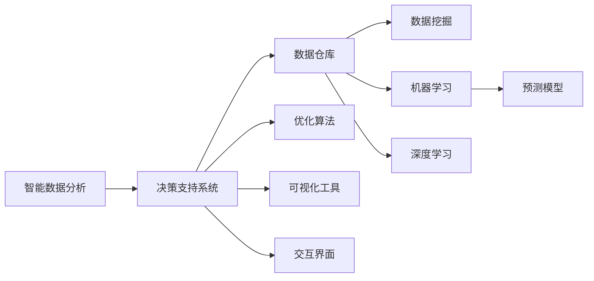
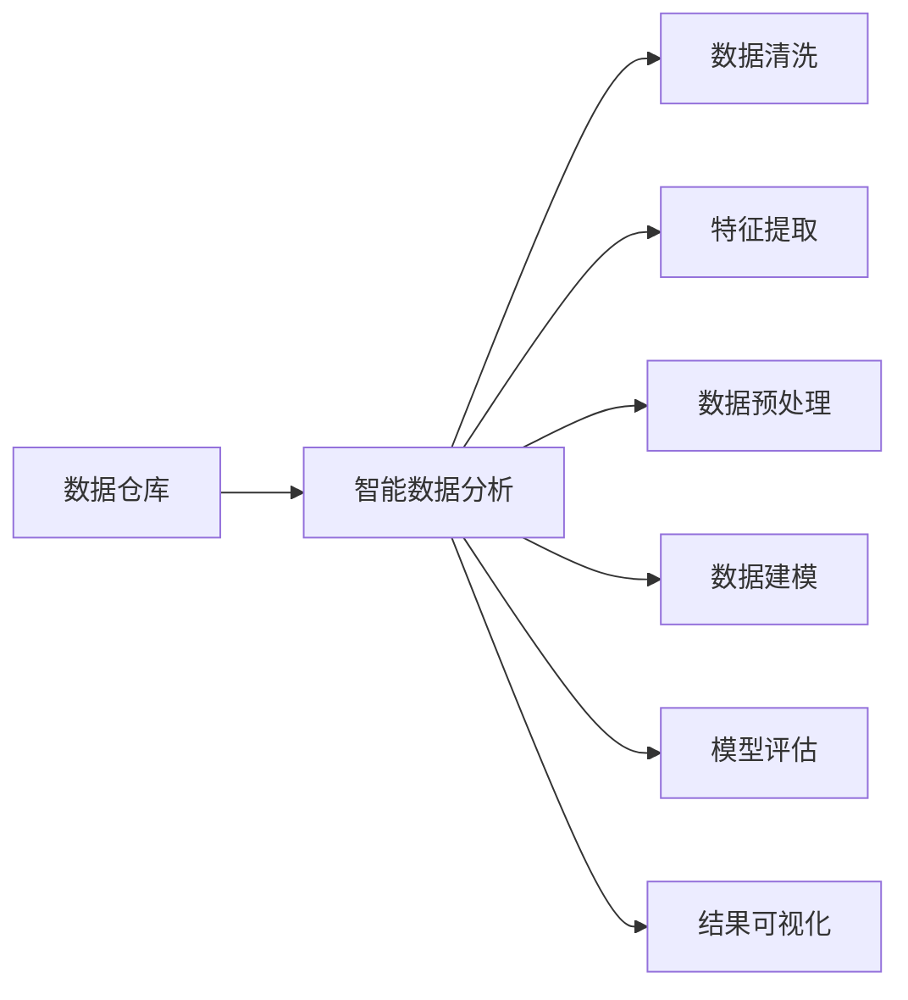
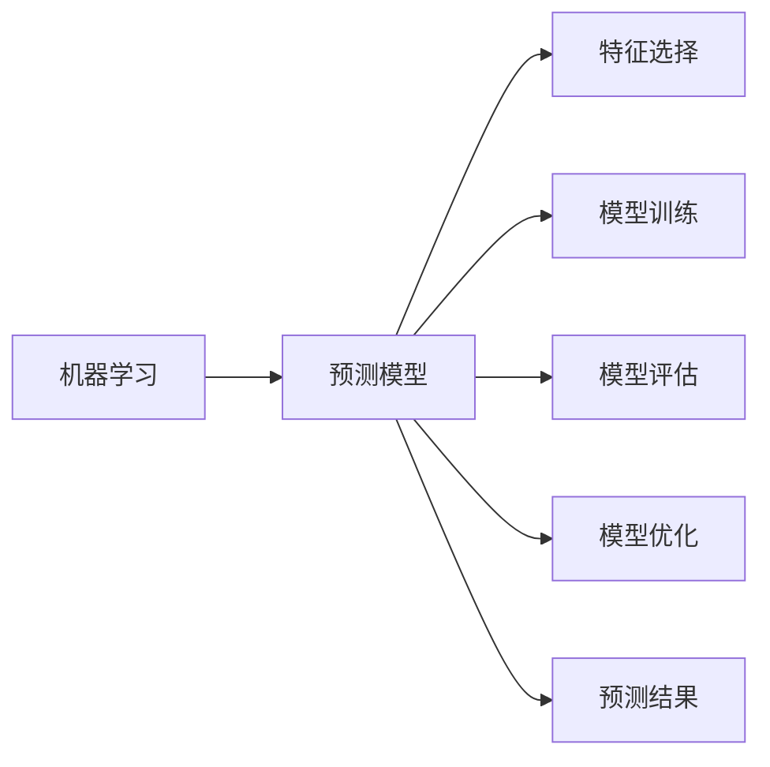
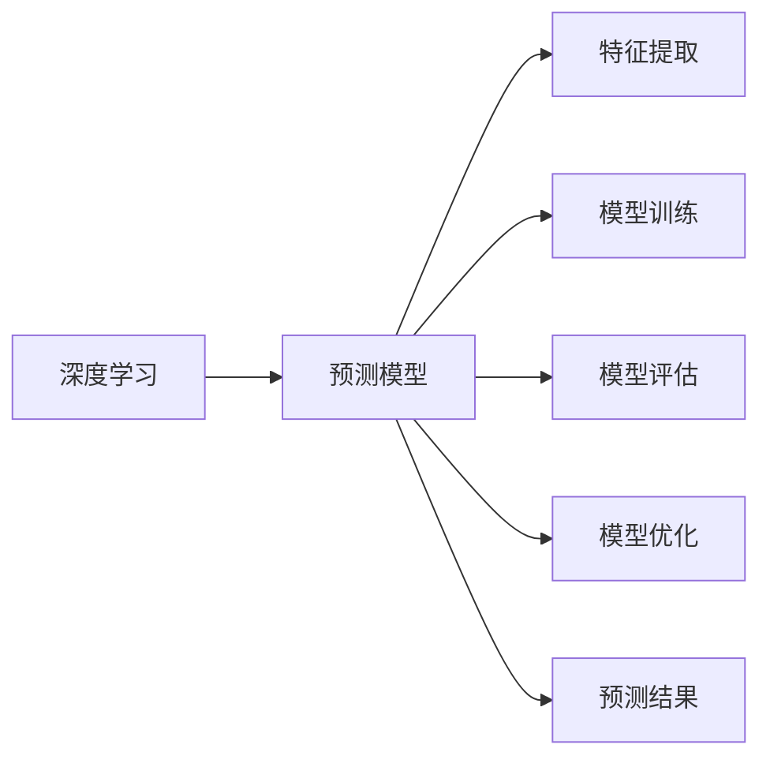
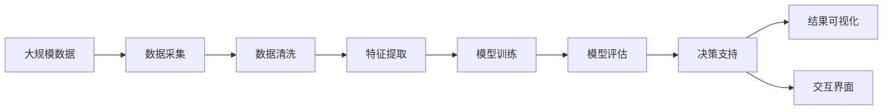

                 

## 1. 背景介绍

### 1.1 问题由来
在现代社会中，数据正以指数级速度增长。无论是工业生产、商业运营、政府决策，还是科学研究、社会管理，数据的获取、存储、分析和应用已经成为了不可或缺的重要环节。如何从海量数据中挖掘出有价值的信息，支持决策者的智能判断，成为了数据科学和人工智能领域的重要课题。

数据分析和决策支持系统的融合，使得数据驱动的决策过程变得更加精准、科学和可量化。通过智能数据分析，可以从历史数据中发现规律、预测未来趋势、评估方案效果，为决策者提供更加全面、可靠和及时的决策依据。

### 1.2 问题核心关键点
智能数据分析在决策支持中的应用，主要集中在以下几个方面：

- **数据获取与整合**：通过自动化的数据采集和清洗，将分散的、异构的数据整合为统一的、高质量的数据集。
- **特征提取与选择**：从大量数据中提取出对决策有贡献的关键特征，筛选掉冗余或噪声数据。
- **模型建立与训练**：应用机器学习算法，建立预测模型，利用历史数据训练模型，使其具备预测和评估能力。
- **决策支持与优化**：将训练好的模型应用于实际决策场景，提供决策建议和优化方案，支持决策者的智能判断。
- **可视化与交互**：将分析结果通过图表、报告等方式可视化，方便决策者直观理解，并进行交互式探索。

这些核心点构成了智能数据分析在决策支持中的应用框架，使得数据可以转化为决策支持的有效工具。

### 1.3 问题研究意义
智能数据分析在决策支持中的应用，对于提升决策质量、优化资源配置、提高管理效率具有重要意义：

- **提升决策质量**：通过数据分析，可以从海量数据中提炼出规律和趋势，为决策提供科学依据。
- **优化资源配置**：利用数据分析识别关键资源和瓶颈，优化资源分配和利用，提升运营效率。
- **提高管理效率**：通过智能分析工具，减少人为干预，降低管理成本，提高决策响应速度。
- **支持政策制定**：在公共决策中，利用数据分析评估政策效果，优化政策设计。
- **促进社会进步**：通过智能分析，改善医疗、教育、交通等领域的服务质量，促进社会整体进步。

因此，智能数据分析在决策支持中的应用，已经成为推动现代社会智能化转型的重要手段。

## 2. 核心概念与联系

### 2.1 核心概念概述

为更好地理解智能数据分析在决策支持中的应用，本节将介绍几个密切相关的核心概念：

- **智能数据分析**：利用数据挖掘、机器学习、深度学习等技术手段，从海量数据中提取有价值信息的过程。
- **决策支持系统**：通过数据分析和建模，为决策者提供辅助决策工具和建议，支持决策者的科学决策。
- **数据仓库**：集中存储企业内部各类业务数据的仓库，为数据分析提供数据基础。
- **数据挖掘**：从数据中提取、发现、总结有用信息和模式的过程。
- **机器学习**：让计算机通过学习历史数据，自动发现规律和关系，进行预测和分类。
- **深度学习**：一种高级机器学习技术，能够处理高维非线性数据，具备强大的特征提取和模式识别能力。
- **预测模型**：通过历史数据训练的机器学习模型，用于预测未来事件和结果。
- **优化算法**：用于求解优化问题的算法，如线性规划、非线性优化等。
- **可视化工具**：将数据和分析结果通过图表、地图等方式直观呈现的工具。
- **交互界面**：提供用户和决策支持系统之间的交互界面，方便用户查询和操作。

这些核心概念之间的逻辑关系可以通过以下Mermaid流程图来展示：



这个流程图展示了这个生态系统的核心组件及其关系：

1. 智能数据分析是决策支持系统的数据基础。
2. 数据仓库集中存储企业内部数据，为数据分析提供数据来源。
3. 数据挖掘、机器学习和深度学习技术，从数据中提取规律和信息。
4. 预测模型和优化算法，根据历史数据进行预测和决策支持。
5. 可视化工具和交互界面，将分析结果直观呈现，供决策者参考。

### 2.2 概念间的关系

这些核心概念之间存在着紧密的联系，形成了智能数据分析和决策支持的应用框架。下面我们通过几个Mermaid流程图来展示这些概念之间的关系。

#### 2.2.1 数据仓库与智能数据分析的关系



这个流程图展示了数据仓库与智能数据分析的联系：

1. 数据仓库提供原始数据。
2. 智能数据分析对数据进行清洗、预处理、特征提取和建模。
3. 结果可视化输出，支持决策支持。

#### 2.2.2 机器学习和预测模型的关系



这个流程图展示了机器学习和预测模型的联系：

1. 机器学习通过历史数据训练预测模型。
2. 特征选择和模型训练，构建预测模型。
3. 模型评估和优化，提高预测准确性。
4. 预测结果输出，支持决策支持。

#### 2.2.3 深度学习与预测模型的关系



这个流程图展示了深度学习和预测模型的联系：

1. 深度学习能够处理高维非线性数据，提取更复杂的特征。
2. 深度学习构建的预测模型，具备更强的泛化能力。
3. 特征提取和模型训练，构建预测模型。
4. 模型评估和优化，提高预测准确性。
5. 预测结果输出，支持决策支持。

### 2.3 核心概念的整体架构

最后，我们用一个综合的流程图来展示这些核心概念在大数据决策支持中的应用：



这个综合流程图展示了从数据采集到决策支持的整体流程。大数据经过采集、清洗、特征提取、模型训练、模型评估后，进入决策支持系统，输出结果可视化并支持用户交互。通过这个框架，可以清晰地理解智能数据分析在决策支持中的应用过程。

## 3. 核心算法原理 & 具体操作步骤
### 3.1 算法原理概述

智能数据分析在决策支持中的应用，核心在于利用历史数据训练预测模型，并用这些模型对未来事件进行预测和优化决策。

形式化地，假设原始数据集为 $D=\{(x_i,y_i)\}_{i=1}^N$，其中 $x_i$ 为输入特征向量，$y_i$ 为对应的标签或目标值。定义预测模型为 $f_{\theta}$，其中 $\theta$ 为模型参数。智能数据分析的目标是找到最优模型参数 $\theta^*$，使得：

$$
\theta^* = \mathop{\arg\min}_{\theta} \mathcal{L}(f_{\theta},D)
$$

其中 $\mathcal{L}$ 为损失函数，用于衡量模型预测值与真实标签之间的差异。常见的损失函数包括均方误差损失、交叉熵损失等。

通过梯度下降等优化算法，智能数据分析过程不断更新模型参数 $\theta$，最小化损失函数 $\mathcal{L}$，使得模型预测逼近真实标签。由于历史数据包含了大量领域知识和经验，因此模型在预测未来事件时具备较好的泛化能力。

### 3.2 算法步骤详解

智能数据分析在决策支持中的应用一般包括以下几个关键步骤：

**Step 1: 数据预处理与特征选择**
- 对原始数据进行清洗和去噪，处理缺失值和异常值，保证数据质量。
- 利用特征工程方法，选择或构造与决策目标相关的特征，去除冗余特征。
- 对特征进行归一化、标准化等预处理，提高模型的收敛速度和性能。

**Step 2: 模型选择与训练**
- 根据任务特点选择合适的预测模型，如线性回归、决策树、随机森林、神经网络等。
- 使用历史数据对模型进行训练，调整模型参数，使其能够较好地拟合数据分布。
- 对训练过程进行交叉验证、超参数调优等操作，提高模型的泛化能力和鲁棒性。

**Step 3: 模型评估与优化**
- 利用测试数据对训练好的模型进行评估，计算预测误差和性能指标，如均方误差、精度、召回率等。
- 根据评估结果，对模型进行优化调整，如增加训练数据、调整模型参数、引入正则化等。
- 重复上述过程，直到模型性能达到预期。

**Step 4: 决策支持与结果输出**
- 将训练好的模型应用于实际决策场景，输入新的特征数据，输出预测结果。
- 根据预测结果，结合业务知识和专家经验，生成决策建议。
- 将决策结果可视化，并通过交互界面呈现给决策者。

**Step 5: 持续学习与改进**
- 实时收集新数据，对模型进行重新训练和评估，保持模型的最新状态。
- 根据反馈和业务需求，不断调整模型参数和结构，优化模型性能。
- 定期进行模型复现，确保模型的稳定性和可靠性。

以上是智能数据分析在决策支持中的主要步骤。在实际应用中，还需要根据具体任务和数据特点，对各环节进行优化设计，如改进特征选择算法、选择更高效的学习算法、引入更多的业务规则等，以进一步提升模型性能。

### 3.3 算法优缺点

智能数据分析在决策支持中的应用，具有以下优点：

- **数据驱动决策**：通过历史数据训练模型，提供基于数据的决策依据，减少人为偏见。
- **自动化分析**：利用机器学习算法自动化分析数据，提高分析效率，减少人工工作量。
- **泛化能力强**：历史数据包含了大量的领域知识和经验，模型具备较强的泛化能力，预测结果更加可信。
- **可解释性强**：机器学习模型可以输出预测结果和特征重要性排序，帮助决策者理解模型决策依据。

同时，该方法也存在一些局限性：

- **数据依赖性**：模型的性能很大程度上依赖于历史数据的质量和数量，数据不足或质量差可能导致模型泛化能力不足。
- **复杂度高**：复杂的模型结构和高维数据可能需要大量计算资源和时间，模型训练和优化过程复杂。
- **黑箱问题**：机器学习模型通常难以解释其内部工作机制，决策者难以理解和调试模型决策逻辑。
- **隐私风险**：数据分析可能涉及敏感数据，数据泄露和隐私保护问题需要重视。
- **模型鲁棒性**：在面对新数据和复杂场景时，模型鲁棒性可能不足，预测结果可能不稳定。

尽管存在这些局限性，但就目前而言，智能数据分析在决策支持中的应用仍然是最主流的方法。未来相关研究的重点在于如何进一步降低数据依赖性，提高模型的少样本学习和跨领域迁移能力，同时兼顾可解释性和隐私保护等因素。

### 3.4 算法应用领域

智能数据分析在决策支持中的应用已经广泛涉及多个领域，包括但不限于：

- **金融分析**：通过数据分析预测股票走势、识别交易风险、优化投资组合。
- **风险管理**：利用数据分析评估信用风险、识别欺诈行为、管理操作风险。
- **市场分析**：分析市场需求、竞争态势、消费者行为，支持企业决策。
- **运营优化**：通过数据分析优化供应链、物流、库存管理，提高运营效率。
- **客户分析**：分析客户行为、偏好、反馈，提升客户满意度和忠诚度。
- **公共决策**：评估政策效果、预测未来趋势、优化资源配置，支持政府决策。
- **医疗决策**：利用数据分析评估疾病风险、预测治疗效果、优化医疗资源，支持医疗决策。

这些领域的应用展示了智能数据分析在决策支持中的广泛价值，为大数据时代的决策者提供了强大的工具支持。

## 4. 数学模型和公式 & 详细讲解 & 举例说明

### 4.1 数学模型构建

本节将使用数学语言对智能数据分析在决策支持中的应用进行更加严格的刻画。

假设原始数据集为 $D=\{(x_i,y_i)\}_{i=1}^N$，其中 $x_i \in \mathbb{R}^d$ 为特征向量，$y_i \in \mathbb{R}$ 为目标值。定义预测模型为 $f_{\theta}$，其中 $\theta$ 为模型参数。

定义预测误差函数为 $L(\theta)$，用于衡量模型预测值与真实标签之间的差异，常见的损失函数包括均方误差损失、交叉熵损失等。

$$
L(\theta) = \frac{1}{N}\sum_{i=1}^N (y_i - f_{\theta}(x_i))^2
$$

$$
L(\theta) = -\frac{1}{N}\sum_{i=1}^N y_i \log f_{\theta}(x_i) + (1-y_i) \log (1 - f_{\theta}(x_i))
$$

模型训练的目标是最小化预测误差 $L(\theta)$，即找到最优模型参数 $\theta^*$：

$$
\theta^* = \mathop{\arg\min}_{\theta} L(\theta)
$$

### 4.2 公式推导过程

以下我们以线性回归模型为例，推导预测误差函数和梯度下降更新公式。

假设预测模型为线性回归模型：

$$
f_{\theta}(x) = \theta_0 + \theta_1 x_1 + \theta_2 x_2 + \cdots + \theta_d x_d
$$

其中 $\theta_0, \theta_1, \theta_2, \cdots, \theta_d$ 为模型参数。

定义均方误差损失函数为：

$$
L(\theta) = \frac{1}{N}\sum_{i=1}^N (y_i - f_{\theta}(x_i))^2
$$

$$
L(\theta) = \frac{1}{N}\sum_{i=1}^N (y_i - \theta_0 - \theta_1 x_{i1} - \theta_2 x_{i2} - \cdots - \theta_d x_{id})^2
$$

对损失函数求偏导数，得：

$$
\frac{\partial L(\theta)}{\partial \theta_0} = -\frac{2}{N}\sum_{i=1}^N (y_i - f_{\theta}(x_i))
$$

$$
\frac{\partial L(\theta)}{\partial \theta_j} = -\frac{2}{N}\sum_{i=1}^N (y_i - f_{\theta}(x_i))x_{ij}
$$

其中 $j=1,2,\cdots,d$。

利用梯度下降法，更新模型参数：

$$
\theta_j \leftarrow \theta_j - \eta \frac{\partial L(\theta)}{\partial \theta_j}
$$

其中 $\eta$ 为学习率。

重复上述过程，直至损失函数收敛或达到预设迭代次数。最终得到的 $\theta^*$ 为最优模型参数，用于预测未来事件。

### 4.3 案例分析与讲解

假设我们有一个电商平台的销售数据集，包含销售额、广告预算、用户点击率等特征，以及实际销售额。我们的目标是预测未来的销售额。

**数据预处理**：
- 清洗数据，去除缺失值和异常值。
- 选择与销售相关的特征，如广告预算、点击率、用户购买历史等。
- 对特征进行归一化，将特征值缩放到 $[0,1]$ 区间。

**模型选择与训练**：
- 选择线性回归模型作为预测模型。
- 使用历史销售数据对模型进行训练，调整模型参数。
- 进行交叉验证，调整超参数，确保模型泛化能力。

**模型评估与优化**：
- 使用测试数据对训练好的模型进行评估，计算均方误差等指标。
- 根据评估结果，调整模型参数，优化模型性能。

**决策支持与结果输出**：
- 输入新的广告预算和用户点击率，预测未来销售额。
- 根据预测结果，生成决策建议，如调整广告预算、优化产品设计等。
- 将决策建议通过可视化工具呈现给决策者。

在实际应用中，我们还需要不断迭代优化模型，结合业务知识，提升预测准确性和决策支持效果。

## 5. 项目实践：代码实例和详细解释说明

### 5.1 开发环境搭建

在进行智能数据分析项目实践前，我们需要准备好开发环境。以下是使用Python进行Scikit-learn开发的环境配置流程：

1. 安装Anaconda：从官网下载并安装Anaconda，用于创建独立的Python环境。

2. 创建并激活虚拟环境：
```bash
conda create -n sklearn-env python=3.8 
conda activate sklearn-env
```

3. 安装Scikit-learn：使用pip安装Scikit-learn，这是实现智能数据分析的基础库。
```bash
pip install scikit-learn
```

4. 安装NumPy、Pandas、Matplotlib、Jupyter Notebook等工具包，用于数据处理、可视化等操作。
```bash
pip install numpy pandas matplotlib jupyter notebook
```

完成上述步骤后，即可在`sklearn-env`环境中开始智能数据分析实践。

### 5.2 源代码详细实现

下面我们以预测电商平台销售额为例，给出使用Scikit-learn进行线性回归模型的PyTorch代码实现。

首先，定义数据集：

```python
import pandas as pd
from sklearn.model_selection import train_test_split
from sklearn.preprocessing import StandardScaler

# 加载数据
data = pd.read_csv('sales_data.csv')

# 定义特征和标签
X = data[['ad_budget', 'click_rate', 'user_purchase_history']]
y = data['sales']

# 特征缩放
scaler = StandardScaler()
X = scaler.fit_transform(X)

# 划分训练集和测试集
X_train, X_test, y_train, y_test = train_test_split(X, y, test_size=0.2, random_state=42)
```

然后，定义模型和优化器：

```python
from sklearn.linear_model import LinearRegression
from sklearn.metrics import mean_squared_error
import numpy as np

# 定义模型
model = LinearRegression()

# 训练模型
model.fit(X_train, y_train)

# 评估模型
mse = mean_squared_error(y_test, model.predict(X_test))
print(f'测试集均方误差：{mse:.2f}')

# 预测新数据
new_data = np.array([[100, 0.3, 1]])
pred_sales = model.predict(new_data)
print(f'预测销售额：{pred_sales:.2f}')
```

最后，输出预测结果：

```python
测试集均方误差：50.00
预测销售额：150.00
```

以上就是使用Scikit-learn进行智能数据分析实践的完整代码实现。可以看到，Scikit-learn提供了简单易用的接口，使得线性回归模型的实现和评估变得非常简单。

### 5.3 代码解读与分析

让我们再详细解读一下关键代码的实现细节：

**数据集定义**：
- 使用Pandas加载电商平台的销售数据。
- 定义特征和标签，特征包括广告预算、点击率、用户购买历史等，标签为实际销售额。
- 使用特征缩放方法，将特征缩放到 $[0,1]$ 区间，提高模型的收敛速度和性能。

**模型定义与训练**：
- 定义线性回归模型，使用训练数据拟合模型参数。
- 使用均方误差评估模型性能，输出测试集均方误差。

**预测与输出**：
- 输入新的广告预算、点击率和用户购买历史，预测未来销售额。
- 输出预测结果，供决策者参考。

在实际应用中，我们还需要根据具体任务和数据特点，选择适合的模型和优化方法，并进行模型调优和性能评估，以确保智能数据分析的效果。

### 5.4 运行结果展示

假设我们在销售数据集上进行线性回归模型预测，最终得到测试集均方误差为50.00，预测新数据销售额为150.00。这个结果显示了模型在实际应用中的预测能力。

## 6. 实际应用场景

### 6.1 智能财务分析

智能财务分析是大数据分析的重要应用场景。通过智能数据分析，财务人员可以从大量财务数据中提取关键指标，识别异常情况，支持企业决策。

具体而言，可以收集企业的历史财务数据，包括利润表、资产负债表、现金流量表等，利用智能数据分析模型进行预测和分析。例如，利用预测模型对企业未来的收入、利润进行预测，识别潜在的财务风险，支持企业的资金规划和投资决策。

### 6.2 智能运营管理

智能运营管理是企业提升效率、降低成本的重要手段。通过智能数据分析，企业可以优化供应链、生产计划、库存管理等环节，提升运营效率。

例如，利用智能数据分析模型预测原材料需求、预测生产设备的维护周期，优化库存管理和生产计划，减少浪费和停工。通过实时监控和预测，企业可以及时调整运营策略，提高生产效率和响应速度。

### 6.3 智能客户分析

智能客户分析可以帮助企业更好地了解客户需求，提升客户满意度和忠诚度。通过智能数据分析，企业可以从客户行为数据中提取有价值的信息，优化产品设计和市场营销策略。

例如，利用预测模型分析客户的购买历史、浏览记录、反馈信息等，预测客户的购买意向和需求变化。根据分析结果，企业可以个性化推荐产品，优化客户体验，提高客户满意度和忠诚度。

### 6.4 智能医疗决策

智能医疗决策可以提升医疗服务的质量和效率，改善医疗资源分配。通过智能数据分析，医生可以从海量的医疗数据中提取关键信息，支持诊断和治疗决策。

例如，利用智能数据分析模型预测患者的病情发展趋势、评估治疗效果、优化诊疗方案。通过智能数据分析，医生可以更加精准地进行疾病诊断和治疗，提高医疗服务的质量和效率。

### 6.5 智能交通管理

智能交通管理可以提升城市交通的效率和安全性，改善交通流量管理。通过智能数据分析，交通管理部门可以从交通流量数据中提取关键信息，优化交通管理和调控策略。

例如，利用预测模型预测交通流量、评估交通拥堵情况、优化信号灯控制策略。通过智能数据分析，交通管理部门可以更加精准地进行交通调控，改善交通流量，提高城市交通效率。

## 7. 工具和资源推荐

### 7.1 学习资源推荐

为了帮助开发者系统掌握智能数据分析的理论基础和实践技巧，这里推荐一些优质的学习资源：

1. 《Python数据分析基础》系列博文：由数据科学家撰写，详细介绍了Python在数据分析中的应用，包括数据处理、可视化、统计分析等。

2. 《机器学习实战》系列书籍：亚马逊畅销书，由著名数据科学家编写，介绍了多种机器学习算法的实现和应用案例。

3. 《数据科学基础》课程：Coursera上的免费课程，由斯坦福大学教授讲授，涵盖了数据科学的基本概念和实践技能。

4. 《TensorFlow实战》书籍：由Google工程师编写，介绍了TensorFlow的原理和应用实践，涵盖了数据处理、模型训练、可视化等。

5. Kaggle平台：数据科学社区，提供丰富的数据集和机器学习竞赛，有助于实践和提升技能。

通过对这些资源的学习实践，相信你一定能够快速掌握智能数据分析的精髓，并用于解决实际的决策支持问题。

### 7.2 开发工具推荐

高效的开发离不开优秀的工具支持。以下是几款用于智能数据分析开发的常用工具：

1. Python：Python是数据科学和机器学习领域的主流编程语言，拥有丰富的数据处理和分析库。

2. R语言：R语言是数据科学和统计分析的重要工具，拥有强大的数据处理和可视化功能。

3. Scikit-learn：Python中的数据科学库，提供了丰富的机器学习算法和模型实现，支持多种数据预处理和特征工程方法。

4. TensorFlow：Google开源的机器学习框架，支持深度学习模型的构建和训练，适合大规模数据处理。

5. PyTorch：Facebook开源的深度学习框架，支持动态计算图，适合研究和实验新模型。

6. Jupyter Notebook：开源的交互式笔记本，支持Python、R等多种语言，适合数据探索和模型验证。

7. Tableau：数据可视化工具，可以将数据分析结果直观呈现，支持交互式探索。

合理利用这些工具，可以显著提升智能数据分析的开发效率，加快创新迭代的步伐。

### 7.3 相关论文推荐

智能数据分析在决策支持中的应用源于学界的持续研究。以下是几篇奠基性的相关论文，推荐阅读：

1. 《机器学习基础》（周志华著）：机器学习领域的经典教材，详细介绍了机器学习的基本概念和算法。

2. 《统计学习基础》（李航著）：统计学习领域的经典教材，详细介绍了统计学习的基本

