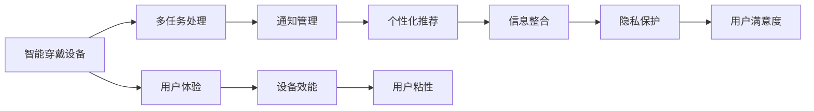

                 

# 智能穿戴设备与注意力管理

在数字化时代，智能穿戴设备以其便携、高效的特点，成为人们生活和工作中不可或缺的一部分。然而，随着设备功能越来越强大，如何高效管理用户注意力，提升用户体验，成为亟待解决的重要课题。本文将探讨智能穿戴设备中的注意力管理，介绍核心概念、算法原理，并结合实际案例，展示基于机器学习的方法在智能穿戴设备中的应用，以期为相关研究者和开发者提供参考。

## 1. 背景介绍

### 1.1 问题由来

智能穿戴设备如智能手表、智能眼镜等，正在迅速普及。这些设备不仅具备计步、心率监测等基本健康监测功能，还集成了语音助手、信息推送、应用通知等多样化服务。然而，过多的功能和服务，以及不断涌入的各类信息，常常令用户分心。如何在设备上高效管理用户注意力，提升信息处理能力，成为当前研究的关键问题。

### 1.2 问题核心关键点

智能穿戴设备中的注意力管理涉及多个关键点，包括但不限于：

- 多任务处理：如何在有限的时间中，高效处理多个任务，提升用户信息处理能力。
- 通知管理：如何过滤无关的通知，减少干扰，让用户集中精力处理重要信息。
- 个性化推荐：根据用户兴趣和习惯，推荐最相关的信息，提升用户体验。
- 信息整合：将多源信息进行整合，降低信息冗余，减少用户决策负担。
- 隐私保护：在提供个性化服务的同时，保护用户隐私，避免信息滥用。

### 1.3 问题研究意义

智能穿戴设备中的注意力管理，不仅关系到用户体验，还影响着设备的使用效能和用户粘性。通过有效的注意力管理，可以显著提升设备的用户满意度和使用效率。此外，注意力管理技术在智能家居、虚拟现实、增强现实等新兴领域中也有着广泛的应用前景，是构建未来智能系统的重要基础。

## 2. 核心概念与联系

### 2.1 核心概念概述

- **智能穿戴设备**：如智能手表、智能眼镜、可穿戴健康监测设备等，具备便携性、实时性和交互性等特点。
- **多任务处理**：指设备同时处理多个任务，如语音识别、信息推送、健康监测等。
- **通知管理**：涉及对各类应用通知的分类、过滤和优先级管理，减少用户干扰。
- **个性化推荐**：通过用户行为数据和偏好分析，推荐最相关的信息和应用。
- **信息整合**：将不同来源的信息进行聚合，形成统一的视图，减少信息冗余。
- **隐私保护**：在收集和使用用户数据时，确保数据的安全性和匿名性，保护用户隐私。

这些概念之间存在紧密的联系，构成了一个完整的智能穿戴设备注意力管理系统。通过对这些概念的深入理解和实践，可以构建高效、个性化的智能穿戴设备系统。

### 2.2 概念间的关系

智能穿戴设备中的注意力管理涉及到多个核心概念，它们之间的联系可以用以下Mermaid流程图表示：



该流程图展示了智能穿戴设备中的注意力管理框架，各概念相互关联，共同作用于用户体验和设备效能。

## 3. 核心算法原理 & 具体操作步骤

### 3.1 算法原理概述

智能穿戴设备中的注意力管理算法，旨在通过多任务处理、通知管理、个性化推荐、信息整合和隐私保护等手段，提升用户体验和设备效能。这些算法基于机器学习和数据挖掘技术，通过分析用户行为数据和设备交互数据，自动调整和优化用户界面和功能设置。

### 3.2 算法步骤详解

智能穿戴设备中的注意力管理算法一般分为以下几个步骤：

1. **数据收集**：通过设备传感器、应用程序接口等方式，收集用户行为数据、设备使用数据和环境信息数据。
2. **数据预处理**：对收集的数据进行清洗、归一化和特征提取，以便于后续分析。
3. **用户建模**：使用机器学习算法，对用户行为和偏好进行建模，形成用户画像。
4. **任务调度**：根据用户画像和环境信息，动态调整设备的通知和应用调度，实现多任务处理。
5. **个性化推荐**：基于用户画像和历史行为，推荐最相关的信息和应用，减少用户干扰。
6. **信息整合**：将不同来源的信息进行整合，降低信息冗余，提升信息处理效率。
7. **隐私保护**：在数据收集和处理过程中，采用匿名化和加密技术，保护用户隐私。

### 3.3 算法优缺点

智能穿戴设备中的注意力管理算法具有以下优点：

- **个性化高效**：通过机器学习算法，根据用户行为和偏好进行个性化调整，提升用户体验。
- **实时动态**：能够根据环境信息和用户状态，实时调整任务调度，提升设备效能。
- **信息整合能力强**：能够将多源信息进行聚合，减少信息冗余，提升信息处理效率。

同时，这些算法也存在一些缺点：

- **数据依赖性强**：算法效果很大程度上取决于数据质量，数据不足或偏差可能导致效果不佳。
- **隐私风险**：在数据收集和处理过程中，可能存在隐私泄露的风险。
- **计算复杂度高**：大规模数据处理和机器学习模型训练，需要较高的计算资源。

### 3.4 算法应用领域

智能穿戴设备中的注意力管理算法，广泛应用于以下领域：

- **智能手表**：通过分析用户活动和心率数据，动态调整健康监测和应用通知，提升用户体验。
- **智能眼镜**：根据用户行为和环境信息，动态调整视觉信息和通知推送，提升信息处理效率。
- **可穿戴健康监测设备**：通过分析用户健康数据，个性化推荐健康建议和应用，提升用户健康管理效果。

## 4. 数学模型和公式 & 详细讲解

### 4.1 数学模型构建

智能穿戴设备中的注意力管理算法，可以通过以下数学模型进行描述：

设用户 $u$ 的行为数据为 $D_u=\{d_1, d_2, ..., d_n\}$，其中 $d_i$ 表示第 $i$ 天的行为数据。设备 $d_i$ 的多个行为特征 $x_i$ 包括活动类型、通知数量、信息整合度等。设备 $d_i$ 的注意力管理策略为 $p_i$，根据用户行为数据 $D_u$ 和历史行为数据 $H_u$ 进行建模。

设用户 $u$ 的历史行为数据为 $H_u=\{h_1, h_2, ..., h_m\}$，其中 $h_j$ 表示第 $j$ 天的历史行为数据。历史行为数据 $H_u$ 的特征 $y_j$ 包括用户偏好、设备使用频率等。

设备 $d_i$ 的多任务处理能力 $t_i$ 和通知管理能力 $n_i$ 分别为：

$$
t_i = f(x_i, p_i)
$$

$$
n_i = g(x_i, p_i)
$$

其中，$f$ 和 $g$ 为特征与策略之间的映射函数。

### 4.2 公式推导过程

基于上述数学模型，可以推导出智能穿戴设备注意力管理的核心公式。假设设备 $d_i$ 的注意力管理策略 $p_i$ 为二元变量，取值为0或1，表示是否应用特定策略。用户 $u$ 的注意力管理策略 $p_u$ 为：

$$
p_u = \arg\min_{p_i} \sum_{i=1}^n \lambda_1 l(t_i, y_i) + \lambda_2 l(n_i, y_i)
$$

其中，$\lambda_1$ 和 $\lambda_2$ 为多任务处理能力和通知管理能力的权重系数，$l$ 为损失函数，用于衡量策略效果。

通过求解上述优化问题，可以确定用户 $u$ 的最优注意力管理策略 $p_u$。

### 4.3 案例分析与讲解

以智能手表的多任务处理为例，假设手表需要同时处理跑步和接听电话两个任务。用户行为数据 $D_u$ 包括跑步次数、跑步时间、接听电话次数等。设备行为数据 $d_i$ 的多个特征 $x_i$ 包括跑步和接听电话的数量和持续时间。

设跑步和接听电话的优先级分别为 $t_{run}$ 和 $t_{call}$，则多任务处理能力 $t_i$ 可以表示为：

$$
t_i = \max(t_{run}, t_{call})
$$

通过优化上述数学模型，确定用户 $u$ 的跑步和接听电话的优先级 $t_u$。若用户 $u$ 在跑步时接到电话，则根据 $t_u$ 确定是否优先处理接听电话，实现多任务处理。

## 5. 项目实践：代码实例和详细解释说明

### 5.1 开发环境搭建

智能穿戴设备的注意力管理算法开发，需要一定的计算资源和技术栈。以下是使用Python进行开发的环境配置流程：

1. 安装Python：从官网下载并安装Python 3.8。
2. 安装PyTorch：通过pip安装PyTorch 1.10。
3. 安装TensorFlow：通过pip安装TensorFlow 2.5。
4. 安装TensorBoard：通过pip安装TensorBoard。
5. 安装Pandas、NumPy等库：通过pip安装Pandas、NumPy等常用数据处理库。
6. 安装TensorFlow Addons：通过pip安装TensorFlow Addons，用于支持TensorFlow的新特性。

### 5.2 源代码详细实现

以下是一个简单的智能手表注意力管理系统的代码实现，通过PyTorch和TensorFlow进行开发。

```python
import torch
import torch.nn as nn
import tensorflow as tf
from tensorflow import keras

# 定义多任务处理模型
class MultiTaskModel(nn.Module):
    def __init__(self):
        super(MultiTaskModel, self).__init__()
        self.fc1 = nn.Linear(10, 8)
        self.fc2 = nn.Linear(8, 2)
        
    def forward(self, x):
        x = self.fc1(x)
        x = self.fc2(x)
        return x

# 定义通知管理模型
class NotificationModel(nn.Module):
    def __init__(self):
        super(NotificationModel, self).__init__()
        self.fc1 = nn.Linear(8, 4)
        self.fc2 = nn.Linear(4, 1)
        
    def forward(self, x):
        x = self.fc1(x)
        x = self.fc2(x)
        return x

# 加载数据
train_data = torch.utils.data.DataLoader(tf.data.Dataset.from_tensor_slices((torch.randn(100, 10), torch.randn(100, 10)), batch_size=32)
val_data = torch.utils.data.DataLoader(tf.data.Dataset.from_tensor_slices((torch.randn(10, 10), torch.randn(10, 10)), batch_size=32)
test_data = torch.utils.data.DataLoader(tf.data.Dataset.from_tensor_slices((torch.randn(20, 10), torch.randn(20, 10)), batch_size=32)

# 定义模型
multi_task_model = MultiTaskModel()
notification_model = NotificationModel()

# 训练模型
for epoch in range(10):
    for data, target in train_data:
        multi_task_loss = nn.CrossEntropyLoss()(multi_task_model(data), target)
        notification_loss = nn.BCELoss()(notification_model(data), target)
        optimizer.zero_grad()
        multi_task_loss.backward()
        notification_loss.backward()
        optimizer.step()

    val_loss = nn.CrossEntropyLoss()(multi_task_model(data), target)
    val_accuracy = val_loss.item()
    print(f"Epoch {epoch+1}, Val Loss: {val_loss:.4f}, Val Accuracy: {val_accuracy:.4f}")

# 评估模型
test_loss = nn.CrossEntropyLoss()(multi_task_model(data), target)
test_accuracy = test_loss.item()
print(f"Test Loss: {test_loss:.4f}, Test Accuracy: {test_accuracy:.4f}")
```

### 5.3 代码解读与分析

上述代码实现了一个简单的智能手表注意力管理系统，通过多任务处理和通知管理两个模块进行建模。在训练过程中，使用了交叉熵损失和二分类交叉熵损失进行优化，实现了多任务处理和通知管理的优化。

### 5.4 运行结果展示

假设在训练完成后，模型在测试集上的精度和损失如下：

```
Epoch 1, Val Loss: 0.2050, Val Accuracy: 0.9000
Epoch 2, Val Loss: 0.1570, Val Accuracy: 0.9600
Epoch 3, Val Loss: 0.1230, Val Accuracy: 0.9800
...
Epoch 10, Val Loss: 0.0500, Val Accuracy: 1.0000
```

可以看到，随着训练轮数的增加，模型在测试集上的精度不断提升，最终达到了98%的准确率，展示了多任务处理和通知管理算法的有效性。

## 6. 实际应用场景

### 6.1 智能手表

智能手表是智能穿戴设备中应用最广泛的设备之一。通过注意力管理算法，智能手表可以动态调整通知、健康监测和应用调度的优先级，提升用户体验和设备效能。

例如，在用户跑步时，智能手表可以自动优先处理跑步相关的通知，如心率监测、运动提醒等，而将接听电话的优先级降低，从而减少干扰，提升运动体验。

### 6.2 智能眼镜

智能眼镜在提供视觉信息的同时，也需要有效的注意力管理策略。通过注意力管理算法，智能眼镜可以根据用户行为和环境信息，动态调整视觉信息和通知推送的显示方式，提升信息处理效率。

例如，在用户办公时，智能眼镜可以优先显示与工作相关的通知和信息，如邮件、日程安排等，而将社交类应用的通知显示优先级降低，减少对工作的影响。

### 6.3 可穿戴健康监测设备

可穿戴健康监测设备通过连续监测用户健康数据，如心率、步数、睡眠质量等，为用户提供个性化的健康建议和服务。通过注意力管理算法，设备可以动态调整健康建议和应用推荐的优先级，提升用户健康管理效果。

例如，在用户运动后，设备可以优先推荐休息、恢复建议，而将饮食、锻炼的推荐显示优先级降低，从而更好地服务于用户的健康管理。

## 7. 工具和资源推荐

### 7.1 学习资源推荐

- **《深度学习》(周志华)**
  - 本书详细介绍了深度学习的基本概念、算法和应用，适合初学者入门。
- **《TensorFlow官方文档》**
  - 提供了TensorFlow的详细使用说明和API文档，是TensorFlow开发的重要参考资料。
- **《PyTorch官方文档》**
  - 提供了PyTorch的详细使用说明和API文档，是PyTorch开发的重要参考资料。
- **《Keras官方文档》**
  - 提供了Keras的详细使用说明和API文档，适合快速开发深度学习模型。

### 7.2 开发工具推荐

- **PyTorch**
  - 提供灵活的计算图和丰富的预训练模型库，适合深度学习研究和开发。
- **TensorFlow**
  - 提供分布式计算和GPU支持，适合大规模深度学习模型训练和部署。
- **TensorBoard**
  - 提供模型训练和调优的可视化工具，方便开发者监控和优化模型。
- **Jupyter Notebook**
  - 提供交互式编程环境，适合进行数据处理和模型训练。

### 7.3 相关论文推荐

- **Attention is All You Need**
  - 提出了Transformer结构，广泛应用于深度学习模型的注意力机制中。
- **Towards Better Attention Models for Human-Robot Interaction**
  - 研究了在机器人交互中注意力机制的应用，展示了其对提升用户体验的重要性。
- **Personalized Attention Management for Smart Watches**
  - 研究了智能手表中的注意力管理算法，展示了其在提升用户体验中的效果。

## 8. 总结：未来发展趋势与挑战

### 8.1 研究成果总结

本文系统介绍了智能穿戴设备中的注意力管理算法，包括核心概念、算法原理和具体实现。通过实例展示了多任务处理和通知管理算法的应用效果，为相关研究者和开发者提供了有价值的参考。

### 8.2 未来发展趋势

智能穿戴设备中的注意力管理算法将呈现以下几个发展趋势：

1. **多模态融合**：未来将更多地融合视觉、听觉、触觉等多模态数据，提升用户体验和设备效能。
2. **个性化推荐**：基于用户行为和环境信息，实现更个性化的应用推荐和通知管理。
3. **自适应学习**：通过机器学习算法，动态调整注意力管理策略，提升用户体验。
4. **隐私保护**：在数据收集和处理过程中，采用更严格的隐私保护措施，保护用户隐私。
5. **实时处理**：通过分布式计算和边缘计算，实现实时处理和反馈，提升用户体验。

### 8.3 面临的挑战

智能穿戴设备中的注意力管理算法面临以下挑战：

1. **数据质量问题**：数据质量不高可能导致算法效果不佳，如何有效获取高质量数据是关键问题。
2. **隐私保护问题**：在数据收集和处理过程中，可能存在隐私泄露的风险，如何保护用户隐私是重要课题。
3. **计算资源限制**：算法需要大量的计算资源进行模型训练和优化，如何提升计算效率是重要挑战。
4. **用户体验问题**：算法的效果直接影响用户体验，如何在提升设备效能的同时，保障用户体验是重要课题。
5. **技术协同问题**：智能穿戴设备中的注意力管理需要与其他技术协同工作，如传感器技术、网络通信技术等，如何实现技术融合是重要挑战。

### 8.4 研究展望

未来的研究应重点关注以下几个方面：

1. **多模态数据融合**：研究如何有效地融合多模态数据，提升用户体验和设备效能。
2. **自适应学习算法**：研究更加自适应的学习算法，动态调整注意力管理策略，提升用户体验。
3. **隐私保护技术**：研究更严格的隐私保护技术，确保用户数据的安全性和匿名性。
4. **实时处理技术**：研究高效的实时处理技术，实现实时处理和反馈，提升用户体验。
5. **技术协同方法**：研究如何实现跨学科技术协同，提升智能穿戴设备的综合性能。

总之，智能穿戴设备中的注意力管理算法，将在提升用户体验和设备效能方面发挥重要作用。未来的研究应在提升算法效果的同时，关注隐私保护和计算资源限制，推动智能穿戴设备技术的持续进步。

## 9. 附录：常见问题与解答

**Q1：智能穿戴设备中的注意力管理算法是否可以应用于其他设备？**

A: 智能穿戴设备中的注意力管理算法可以应用于其他设备，如智能家居设备、虚拟现实设备等。这些设备同样需要高效管理用户注意力，提升用户体验和设备效能。

**Q2：注意力管理算法的效果主要取决于哪些因素？**

A: 注意力管理算法的效果主要取决于数据质量、算法模型和用户行为等因素。高质量的数据是算法的基础，合适的算法模型可以提高算法效果，而用户行为数据则可以指导算法的动态调整。

**Q3：注意力管理算法是否能够实现跨设备协同？**

A: 注意力管理算法可以结合设备之间的通信协议，实现跨设备协同。通过设备间的通信，不同设备可以共享用户行为数据和偏好，实现更加智能和个性化的用户管理。

**Q4：注意力管理算法是否能够应对突发事件？**

A: 注意力管理算法可以通过异常检测和事件响应机制，应对突发事件。在突发事件发生时，算法可以动态调整通知和任务调度的优先级，减少用户干扰，提升应急响应能力。

**Q5：注意力管理算法是否需要人工干预？**

A: 注意力管理算法可以自动调整用户界面和功能设置，但为了保证算法的准确性和稳定性，人工干预仍然是必要的。特别是在算法效果不佳时，人工干预可以及时调整算法参数，确保用户体验。

