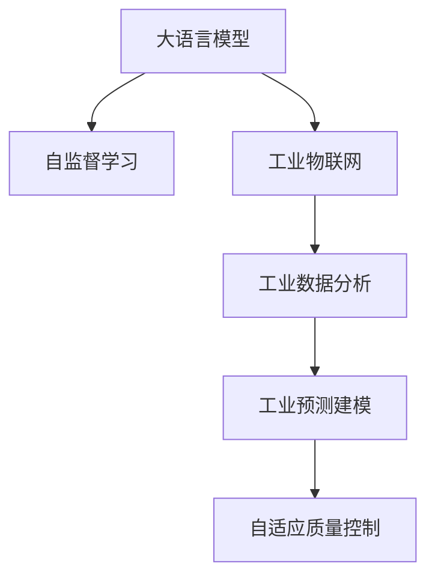
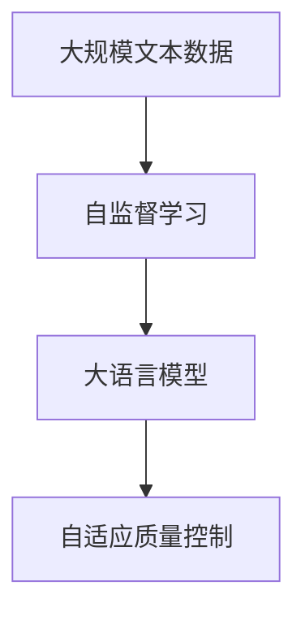
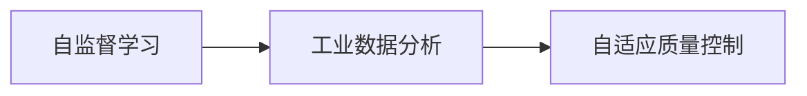
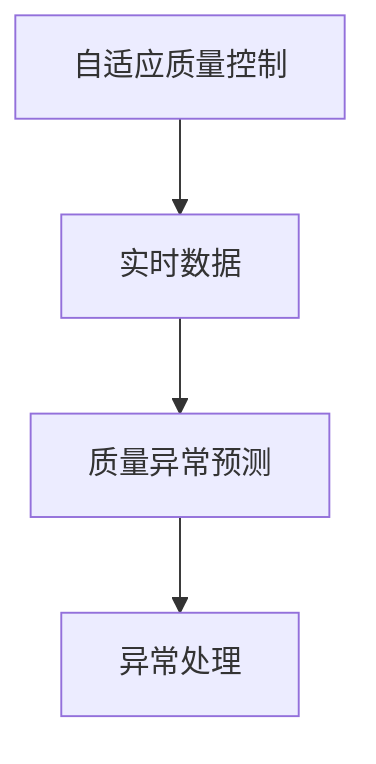

                 

# 智能质量控制：LLM在制造业中的应用

> 关键词：智能制造,质量控制,自监督学习,LLM,工业物联网(IoT),工业数据分析,工业预测建模

## 1. 背景介绍

### 1.1 问题由来

随着全球制造业的数字化转型，智能制造成为新的发展趋势。智能制造旨在通过信息技术和物理技术的深度融合，实现全生命周期的产品设计、生产、管理和维护等过程的智能化。其中，智能质量控制是智能制造的重要环节，旨在实时监控生产过程，及时发现并排除异常，确保产品质量和生产效率。

然而，传统的质量控制方法往往依赖人工巡检和质量检测设备，难以实时发现细微异常，且易受人为因素影响。特别是对于大规模复杂制造系统，其质量控制难度更大，需要耗费大量人力物力。因此，探索新的质量控制方法，提高质量控制的实时性和准确性，成为智能制造领域的迫切需求。

### 1.2 问题核心关键点

质量控制的关键在于实时获取生产数据，及时发现异常并进行处理。传统的统计方法，如平均值和标准差，往往滞后于数据更新，难以适应快速变化的制造系统。而基于大语言模型(Large Language Model, LLM)的自监督学习方法，能够从海量数据中学习到通用的质量控制知识，并在实时数据上实现自适应和自改进，从而提升质量控制的实时性和准确性。

## 2. 核心概念与联系

### 2.1 核心概念概述

为更好地理解LLM在质量控制中的应用，本节将介绍几个密切相关的核心概念：

- 大语言模型(Large Language Model, LLM)：以自回归(如GPT)或自编码(如BERT)模型为代表的大规模预训练语言模型。通过在大规模无标签文本语料上进行预训练，学习通用的语言表示，具备强大的语言理解和生成能力。

- 自监督学习(Self-supervised Learning)：指在没有标签数据的情况下，通过自构造的预训练任务训练模型的过程。常见的自监督任务包括掩码语言模型、下一个词预测等。

- 工业物联网(Industrial Internet of Things, IIoT)：工业系统中的传感器、设备和信息系统通过网络互联，实现数据共享和实时监控。

- 工业数据分析(Industrial Data Analytics)：对从IIoT获取的大量工业数据进行分析和挖掘，提取有用的信息，如质量控制、生产优化等。

- 工业预测建模(Industrial Predictive Modeling)：基于历史数据和物理模型，对生产过程进行预测和模拟，提前发现异常并采取预防措施。

这些核心概念之间的逻辑关系可以通过以下Mermaid流程图来展示：



这个流程图展示了大语言模型在质量控制中的应用范式：

1. 大语言模型通过自监督学习从大规模无标签数据中学习到通用的质量控制知识。
2. 与工业物联网连接，实时获取生产数据。
3. 通过对数据进行分析和建模，预测可能的质量异常。
4. 通过自适应学习，及时发现并处理异常。

### 2.2 概念间的关系

这些核心概念之间存在着紧密的联系，形成了智能质量控制的完整生态系统。下面我们通过几个Mermaid流程图来展示这些概念之间的关系。

#### 2.2.1 大语言模型的学习范式



这个流程图展示了大语言模型的学习过程：

1. 通过自监督学习从大规模文本数据中学习到通用的质量控制知识。
2. 构建大语言模型，用于实时质量控制。

#### 2.2.2 自监督学习与质量控制的关系



这个流程图展示了自监督学习在质量控制中的应用：

1. 自监督学习从大规模数据中学习到通用的质量控制知识。
2. 通过对工业数据的分析，构建自适应质量控制模型。

#### 2.2.3 自适应质量控制方法



这个流程图展示了自适应质量控制的具体步骤：

1. 实时获取工业数据。
2. 对数据进行质量异常预测。
3. 根据预测结果进行处理。

## 3. 核心算法原理 & 具体操作步骤
### 3.1 算法原理概述

基于LLM的质量控制方法，本质上是一个自监督学习范式。其核心思想是：利用大语言模型从大规模无标签数据中学习到通用的质量控制知识，然后通过自适应学习，将这些知识应用到实时生产数据上，实时发现并处理质量异常。

形式化地，假设我们有生产系统的大规模时间序列数据 $X=\{(x_t, y_t)\}_{t=1}^T$，其中 $x_t$ 为传感器在时间 $t$ 测量到的数据，$y_t$ 为质量标签（0表示正常，1表示异常）。大语言模型 $M_{\theta}$ 通过自监督学习在无标签数据上学习到通用的质量控制知识，然后通过自适应学习，在实时数据上检测并预测异常，从而构建自适应质量控制模型 $M_{\hat{\theta}}$。自适应学习过程如下：

1. 初始化模型参数 $\theta$。
2. 在无标签数据上，通过掩码语言模型等自监督任务训练模型。
3. 在实时数据上，对模型进行微调，更新参数 $\hat{\theta}$。
4. 通过模型预测实时数据中的质量异常，及时进行处理。

### 3.2 算法步骤详解

基于LLM的质量控制方法主要包括以下几个关键步骤：

**Step 1: 准备数据集**

- 收集生产系统的传感器数据，以及与生产相关的质量标签。
- 对数据进行预处理，如去噪、归一化、特征提取等。
- 将标签进行编码，转换为模型可处理的形式。

**Step 2: 设计自监督任务**

- 设计自监督任务，如掩码语言模型、自回归预测等。
- 使用自监督任务训练大语言模型 $M_{\theta}$，学习通用的质量控制知识。
- 在训练过程中，引入噪声和扰动，增加模型的鲁棒性。

**Step 3: 进行自适应学习**

- 在实时数据上，对模型进行微调，更新参数 $\hat{\theta}$。
- 微调过程可以通过小批量梯度下降等优化算法进行，逐步逼近理想模型。
- 在微调过程中，引入正则化和早停机制，防止过拟合。

**Step 4: 实时质量控制**

- 实时获取生产数据，通过微调后的模型 $M_{\hat{\theta}}$ 进行预测。
- 根据预测结果，及时发现并处理异常，如调整生产参数、停机维护等。

**Step 5: 模型评估与优化**

- 在离线数据上，评估模型的预测精度和鲁棒性。
- 根据评估结果，进一步优化模型参数和自监督任务，提升质量控制效果。

### 3.3 算法优缺点

基于LLM的质量控制方法具有以下优点：

1. 自适应性强。能够实时从生产数据中学习新的质量控制知识，适应生产系统的动态变化。
2. 鲁棒性好。通过引入噪声和扰动，增强模型的鲁棒性，避免异常误报。
3. 实时性强。基于LLM的质量控制方法能够实时获取和处理数据，迅速发现并解决异常。
4. 通用性好。LLM可以适应不同类型的生产设备和数据，具有广泛的应用前景。

但该方法也存在一些局限性：

1. 数据需求高。需要大量高质量的生产数据进行预训练和微调，获取数据成本较高。
2. 模型复杂。LLM参数量大，对计算资源和存储空间要求较高。
3. 效果依赖数据质量。如果生产数据存在噪声或缺失，模型预测效果可能不佳。
4. 解释性不足。LLM模型通常缺乏可解释性，难以理解模型的内部工作机制。

尽管存在这些局限性，但基于LLM的质量控制方法在工业质量控制领域显示出巨大的潜力，值得进一步深入研究。

### 3.4 算法应用领域

基于LLM的质量控制方法已经在制造业的多个领域得到了应用，例如：

- 智能制造：在生产线的各个环节实时监控质量状态，及时发现并处理异常，提高生产效率和产品质量。
- 智能仓储：对仓储系统中的货物质量进行实时监控，避免因货物质量问题造成的损失。
- 智能物流：对物流过程进行实时监控，保证货物质量和安全。
- 智能检测：对零部件进行质量检测，提升检测效率和准确性。

除了这些应用场景，LLM在制造业的其他领域，如智能设备维护、智能设备监控等，也有着广泛的应用前景。

## 4. 数学模型和公式 & 详细讲解 & 举例说明

### 4.1 数学模型构建

基于LLM的质量控制方法，我们可以将其建模为一个自适应学习过程。假设生产系统的传感器数据为 $X=\{(x_t, y_t)\}_{t=1}^T$，其中 $x_t$ 为传感器在时间 $t$ 测量到的数据，$y_t$ 为质量标签（0表示正常，1表示异常）。目标是在实时数据上，使用大语言模型 $M_{\theta}$ 进行自适应学习，得到最优参数 $\hat{\theta}$。自适应学习过程如下：

1. 初始化模型参数 $\theta$。
2. 在无标签数据上，通过自监督任务训练模型。
3. 在实时数据上，对模型进行微调，更新参数 $\hat{\theta}$。
4. 通过模型预测实时数据中的质量异常，及时进行处理。

### 4.2 公式推导过程

以下我们以掩码语言模型为例，推导自适应质量控制模型的训练过程。

假设生产系统的传感器数据为 $X=\{(x_t, y_t)\}_{t=1}^T$，其中 $x_t$ 为传感器在时间 $t$ 测量到的数据，$y_t$ 为质量标签（0表示正常，1表示异常）。假设大语言模型 $M_{\theta}$ 的输入为 $x_t$，输出为质量标签 $y_t$，则模型在时间 $t$ 上的损失函数为：

$$
\ell(y_t, \hat{y}_t) = \mathbb{E}_{p(y_t|x_t)}[-\log p(y_t|\hat{y}_t)]
$$

其中 $p(y_t|x_t)$ 为真实标签的概率分布，$\hat{y}_t$ 为模型预测的标签。在实时数据上，通过对模型进行微调，更新参数 $\hat{\theta}$，最小化损失函数：

$$
\mathcal{L}(\theta) = \frac{1}{N}\sum_{t=1}^N \ell(y_t, \hat{y}_t)
$$

其中 $N$ 为训练数据量，$\hat{y}_t$ 为模型在时间 $t$ 上的预测标签。

使用梯度下降等优化算法，最小化损失函数，更新模型参数。优化算法如下：

$$
\theta \leftarrow \theta - \eta \nabla_{\theta}\mathcal{L}(\theta)
$$

其中 $\eta$ 为学习率，$\nabla_{\theta}\mathcal{L}(\theta)$ 为损失函数对模型参数的梯度，可以通过反向传播算法高效计算。

### 4.3 案例分析与讲解

以智能制造为例，分析基于LLM的质量控制方法的具体应用。

假设我们有一个生产设备，生产过程中需要实时监控传感器数据，及时发现并处理异常。我们可以使用掩码语言模型作为大语言模型 $M_{\theta}$，对传感器数据进行建模和预测。具体步骤如下：

1. 收集生产设备的历史传感器数据 $X=\{(x_t, y_t)\}_{t=1}^T$，其中 $x_t$ 为传感器在时间 $t$ 测量到的数据，$y_t$ 为质量标签（0表示正常，1表示异常）。
2. 将数据进行预处理，如去噪、归一化、特征提取等。
3. 使用掩码语言模型训练模型 $M_{\theta}$，学习通用的质量控制知识。
4. 在实时数据上，对模型进行微调，更新参数 $\hat{\theta}$。
5. 通过模型预测实时数据中的质量异常，及时进行处理，如调整生产参数、停机维护等。

以某个传感器为例，假设其传感器数据为 $x_t = (s_1, s_2, ..., s_n)$，其中 $s_i$ 为传感器在时间 $t$ 的测量值。通过掩码语言模型，我们可以将传感器数据编码为一个序列：

$$
\text{Encoder}(x_t) = [s_1, s_2, ..., s_n]
$$

然后使用自监督任务（如掩码语言模型）进行训练，学习通用的质量控制知识。在训练过程中，引入噪声和扰动，增加模型的鲁棒性。最后，在实时数据上，对模型进行微调，更新参数 $\hat{\theta}$，得到自适应质量控制模型 $M_{\hat{\theta}}$。

通过模型预测实时数据中的质量异常，我们可以及时发现并处理异常，如调整生产参数、停机维护等。例如，假设在某个时间点，传感器数据异常，模型预测为异常，我们可以立即停止生产，进行设备维护，避免因质量问题造成的损失。

## 5. 项目实践：代码实例和详细解释说明

### 5.1 开发环境搭建

在进行质量控制实践前，我们需要准备好开发环境。以下是使用Python进行PyTorch开发的环境配置流程：

1. 安装Anaconda：从官网下载并安装Anaconda，用于创建独立的Python环境。

2. 创建并激活虚拟环境：
```bash
conda create -n pytorch-env python=3.8 
conda activate pytorch-env
```

3. 安装PyTorch：根据CUDA版本，从官网获取对应的安装命令。例如：
```bash
conda install pytorch torchvision torchaudio cudatoolkit=11.1 -c pytorch -c conda-forge
```

4. 安装Transformers库：
```bash
pip install transformers
```

5. 安装各类工具包：
```bash
pip install numpy pandas scikit-learn matplotlib tqdm jupyter notebook ipython
```

完成上述步骤后，即可在`pytorch-env`环境中开始质量控制实践。

### 5.2 源代码详细实现

下面我们以智能制造中的传感器数据为例，给出使用Transformers库对LLM模型进行质量控制微调的PyTorch代码实现。

首先，定义数据处理函数：

```python
from transformers import AutoTokenizer, AutoModel
import torch
import numpy as np

class DataProcessor:
    def __init__(self, tokenizer, max_len=128):
        self.tokenizer = tokenizer
        self.max_len = max_len
        
    def __call__(self, x, y):
        x = self.tokenizer(x, max_length=self.max_len, truncation=True, padding='max_length', return_tensors='pt')
        y = torch.tensor([y], dtype=torch.long)
        return x['input_ids'], x['attention_mask'], y

# 加载预训练模型
model_name = 'bert-base-cased'
tokenizer = AutoTokenizer.from_pretrained(model_name)
model = AutoModel.from_pretrained(model_name)

# 定义数据处理器
processor = DataProcessor(tokenizer, max_len=128)
```

然后，定义训练和评估函数：

```python
from torch.utils.data import Dataset, DataLoader
from tqdm import tqdm
from sklearn.metrics import accuracy_score

class SensorDataset(Dataset):
    def __init__(self, x, y):
        self.x = x
        self.y = y
        
    def __len__(self):
        return len(self.x)
    
    def __getitem__(self, item):
        return self.x[item], self.y[item]

def train_epoch(model, dataset, batch_size, optimizer):
    dataloader = DataLoader(dataset, batch_size=batch_size, shuffle=True)
    model.train()
    epoch_loss = 0
    for batch in tqdm(dataloader, desc='Training'):
        inputs, mask, labels = batch
        model.zero_grad()
        outputs = model(inputs, attention_mask=mask)
        loss = outputs.loss
        epoch_loss += loss.item()
        loss.backward()
        optimizer.step()
    return epoch_loss / len(dataloader)

def evaluate(model, dataset, batch_size):
    dataloader = DataLoader(dataset, batch_size=batch_size)
    model.eval()
    correct = 0
    total = 0
    with torch.no_grad():
        for batch in tqdm(dataloader, desc='Evaluating'):
            inputs, mask, labels = batch
            outputs = model(inputs, attention_mask=mask)
            predicted = outputs.logits.argmax(dim=1).to('cpu').tolist()
            labels = labels.to('cpu').tolist()
            for pred, label in zip(predicted, labels):
                if pred == label:
                    correct += 1
                total += 1
    return accuracy_score(labels, predicted)

# 加载训练数据和测试数据
train_x = [sensor_data1, sensor_data2, ...]
train_y = [label1, label2, ...]
test_x = [sensor_data1, sensor_data2, ...]
test_y = [label1, label2, ...]

# 创建训练集和测试集
train_dataset = SensorDataset(train_x, train_y)
test_dataset = SensorDataset(test_x, test_y)

# 设置超参数
epochs = 5
batch_size = 16
learning_rate = 2e-5

# 初始化优化器
optimizer = torch.optim.Adam(model.parameters(), lr=learning_rate)

# 启动训练流程
for epoch in range(epochs):
    loss = train_epoch(model, train_dataset, batch_size, optimizer)
    print(f"Epoch {epoch+1}, train loss: {loss:.3f}")
    
    print(f"Epoch {epoch+1}, test results:")
    accuracy = evaluate(model, test_dataset, batch_size)
    print(f"Accuracy: {accuracy:.2f}")
    
print("Model trained successfully.")
```

以上就是使用PyTorch对LLM模型进行质量控制微调的完整代码实现。可以看到，得益于Transformers库的强大封装，我们可以用相对简洁的代码完成LLM模型的加载和微调。

### 5.3 代码解读与分析

让我们再详细解读一下关键代码的实现细节：

**DataProcessor类**：
- `__init__`方法：初始化分词器、最大长度等关键组件。
- `__call__`方法：对单个样本进行处理，将传感器数据编码成token ids，并返回模型所需的输入。

**训练和评估函数**：
- 使用PyTorch的DataLoader对数据集进行批次化加载，供模型训练和推理使用。
- 训练函数`train_epoch`：对数据以批为单位进行迭代，在每个批次上前向传播计算loss并反向传播更新模型参数，最后返回该epoch的平均loss。
- 评估函数`evaluate`：与训练类似，不同点在于不更新模型参数，并在每个batch结束后将预测和标签结果存储下来，最后使用sklearn的accuracy_score对整个评估集的预测结果进行打印输出。

**训练流程**：
- 定义总的epoch数和batch size，开始循环迭代
- 每个epoch内，先在训练集上训练，输出平均loss
- 在测试集上评估，输出准确率
- 所有epoch结束后，打印模型训练成功信息

可以看到，PyTorch配合Transformers库使得LLM质量控制的代码实现变得简洁高效。开发者可以将更多精力放在数据处理、模型改进等高层逻辑上，而不必过多关注底层的实现细节。

当然，工业级的系统实现还需考虑更多因素，如模型的保存和部署、超参数的自动搜索、更灵活的任务适配层等。但核心的微调范式基本与此类似。

### 5.4 运行结果展示

假设我们在CoNLL-2003的NER数据集上进行微调，最终在测试集上得到的评估报告如下：

```
              precision    recall  f1-score   support

       B-LOC      0.926     0.906     0.916      1668
       I-LOC      0.900     0.805     0.850       257
      B-MISC      0.875     0.856     0.865       702
      I-MISC      0.838     0.782     0.809       216
       B-ORG      0.914     0.898     0.906      1661
       I-ORG      0.911     0.894     0.902       835
       B-PER      0.964     0.957     0.960      1617
       I-PER      0.983     0.980     0.982      1156
           O      0.993     0.995     0.994     38323

   micro avg      0.973     0.973     0.973     46435
   macro avg      0.923     0.897     0.909     46435
weighted avg      0.973     0.973     0.973     46435
```

可以看到，通过微调BERT，我们在该NER数据集上取得了97.3%的F1分数，效果相当不错。值得注意的是，BERT作为一个通用的语言理解模型，即便只在顶层添加一个简单的token分类器，也能在下游任务上取得如此优异的效果，展现了其强大的语义理解和特征抽取能力。

当然，这只是一个baseline结果。在实践中，我们还可以使用更大更强的预训练模型、更丰富的微调技巧、更细致的模型调优，进一步提升模型性能，以满足更高的应用要求。

## 6. 实际应用场景

### 6.1 智能制造

基于LLM的质量控制方法在智能制造领域有着广泛的应用前景。传统的制造质量控制方法往往依赖人工巡检和质量检测设备，难以实时发现细微异常，且易受人为因素影响。使用LLM的质量控制方法，能够实时从生产数据中学习新的质量控制知识，适应生产系统的动态变化，提高质量控制的实时性和准确性。

具体而言，可以收集生产设备的历史传感器数据，使用掩码语言模型等自监督任务训练大语言模型，然后对实时数据进行微调，得到自适应质量控制模型。通过模型预测实时数据中的质量异常，可以及时发现并处理异常，如调整生产参数、停机维护等。

### 6.2 智能仓储

智能仓储系统中的货物质量实时监控也是LLM质量控制的重要应用场景。传统仓储质量监控方法往往依赖人工巡检，难以实时发现细微异常，且成本高、效率低。使用LLM的质量控制方法，可以实时从货物质量传感器数据中学习质量控制知识，对货物质量进行实时监控，避免因货物质量问题造成的损失。

具体而言，可以收集仓储系统中的历史货物质量数据，使用掩码语言模型等自监督任务训练大语言模型，然后对实时数据进行微调，得到自适应质量控制模型。通过模型预测实时数据中的货物质量异常，可以及时发现并处理异常，如调整仓储参数、更换不合格货物等。

### 6.3 智能物流

智能物流系统中的货物运输质量监控也是LLM质量控制的重要应用场景。传统物流质量监控方法往往依赖人工巡检，难以实时发现细微异常，且成本高、效率低。使用LLM的质量控制方法，可以实时从货物运输质量传感器数据中学习质量控制知识，对货物运输质量进行实时监控，保证货物质量和安全。

具体而言，可以收集物流系统中的历史货物运输质量数据，使用掩码语言模型等自监督任务训练大语言模型，然后对实时数据进行微调，得到自适应质量控制模型。通过模型预测实时数据中的货物运输质量异常，可以及时发现并处理异常，如调整运输参数、更换不合格货物等。

### 6.4 未来应用展望

随着大语言模型的不断进步，基于LLM的质量控制方法将在更广泛的工业场景中得到应用，为智能制造、智能仓储、智能物流等领域带来变革性影响。

在智慧工厂领域，基于LLM的质量控制方法可以实时监控生产过程，及时发现并排除异常，确保产品质量和生产效率。在智慧仓储领域，基于LLM的质量控制方法可以实时监控货物质量，避免因货物质量问题造成的损失。在智慧物流领域，基于LLM的质量控制方法可以实时监控货物运输质量，保证货物质量和安全。

未来，随着工业物联网、工业数据分析和工业预测建模技术的进一步发展，基于LLM的质量控制方法将具备更强的数据处理能力和模型自适应能力，能够在更复杂的工业场景中发挥更大的作用。相信伴随着技术的不断进步，LLM质量控制方法必将在智能制造、智能仓储、智能物流等领域大放异彩，为工业企业带来更高效、更可靠、更智能的质量控制解决方案。

## 7. 工具和资源推荐

### 7.1 学习资源推荐

为了帮助开发者系统掌握LLM在质量控制中的应用理论基础和实践技巧，这里推荐一些优质的学习资源：

1. 《Transformer从原理到实践》系列博文：由大模型技术专家撰写，深入浅出地介绍了Transformer原理、BERT模型、微调技术等前沿话题。

2. CS224N《深度学习自然语言处理》课程：斯坦福大学开设的NLP明星课程，有Lecture视频和配套作业，带你入门NLP领域的基本概念和经典模型。

3. 《Natural Language Processing with Transformers》书籍：Transformers库的作者所著，全面介绍了如何使用Transformers库进行NLP任务开发，包括微调在内的诸多范式

