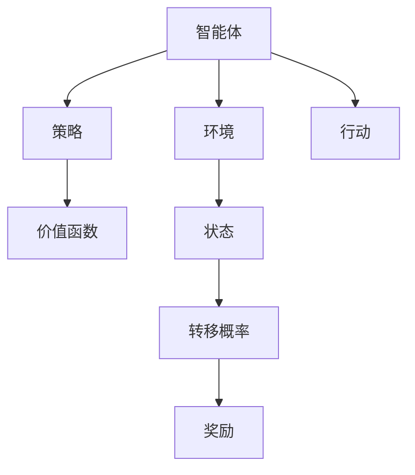
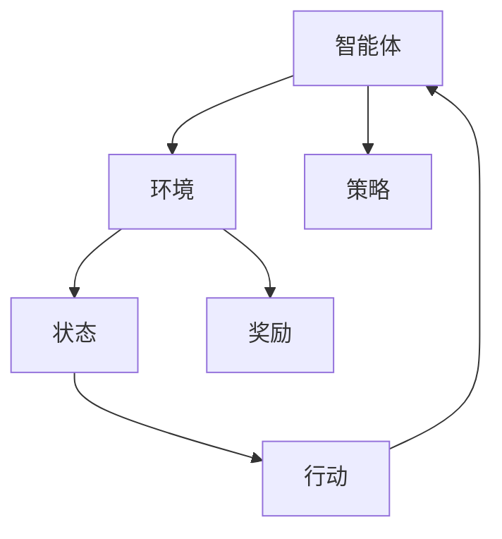
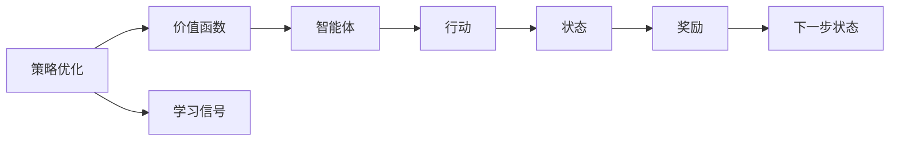
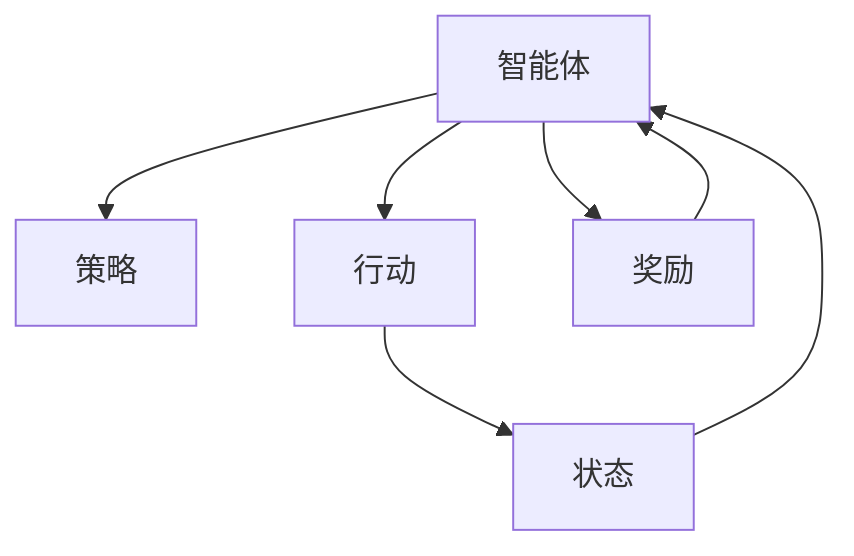
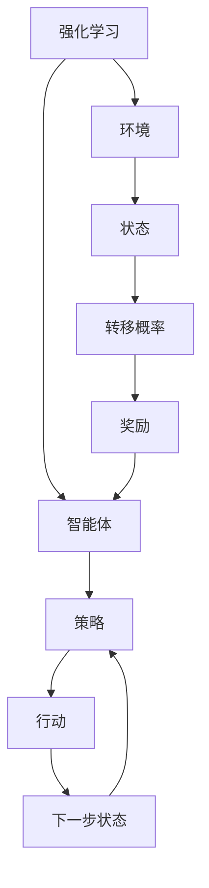

                 

# 曾经的异想天开如何成为AI Agent的现实

> 关键词：AI Agent, Reinforcement Learning, Environment, Reinforcement Learning Agents, Reinforcement Learning Algorithms, Reinforcement Learning Environment, Reinforcement Learning Applications

## 1. 背景介绍

### 1.1 问题由来
人工智能领域在过去几十年中取得了长足的进步，其中强化学习(RL)方法在解决复杂问题方面展现出了独特的优势。强化学习通过智能体(Agent)与环境(environment)的交互，不断学习最优策略，从而在特定任务上获得最优行为。与传统的基于规则的推理不同，强化学习赋予了AI Agent以主动探索和自我优化的能力。然而，强化学习的核心思想虽然简洁，但实现起来却面临许多挑战，如探索与利用的平衡、状态空间爆炸、序列化问题等。

### 1.2 问题核心关键点
强化学习的核心在于智能体通过与环境的交互，不断积累经验和调整策略，以达到某个特定的目标。这一过程可以通过以下三个核心要素来概括：
- 环境(Environment)：智能体所在的外部世界，提供了智能体的行动反馈，包括当前状态、奖励、下一步状态的转移概率等。
- 智能体(Agent)：学习优化策略的主体，通过观察环境并采取行动，以最大化累积奖励。
- 策略(Policy)：智能体采取行动的规则，决定了在特定状态下应采取的具体行动。

在RL中，智能体通过不断试错，逐步学习到最优策略，这个过程往往需要大量的试错和优化，因此需要合理设计策略的更新机制，才能在有限的资源和时间内达到理想的效果。

### 1.3 问题研究意义
研究强化学习Agent的构建和优化方法，对于推动人工智能技术在复杂系统的应用具有重要意义：

1. 推动智能决策系统的构建：强化学习Agent能够在复杂多变的环境下，通过主动探索和学习，实现最优决策。
2. 提升机器人技术水平：强化学习Agent为机器人提供了自主导航、物体抓取、动作协调等重要功能。
3. 促进自动化交易系统的发展：强化学习Agent能够在动态市场环境中，根据历史交易数据和实时行情，优化交易策略。
4. 加速工业智能的落地：强化学习Agent能够实现生产线的自动化控制，提升生产效率和质量。
5. 拓展游戏AI能力：强化学习Agent在电子游戏中的应用，已取得显著成效，例如AlphaGo等。

## 2. 核心概念与联系

### 2.1 核心概念概述

为了更好地理解强化学习Agent的构建和优化方法，本节将介绍几个密切相关的核心概念：

- 强化学习(RL)：通过智能体与环境的交互，智能体根据行动的奖励和反馈，不断调整策略，以实现最大化累积奖励的学习过程。
- 环境(Environment)：智能体所在的外部世界，提供了智能体的行动反馈，包括当前状态、奖励、下一步状态的转移概率等。
- 智能体(Agent)：学习优化策略的主体，通过观察环境并采取行动，以最大化累积奖励。
- 策略(Policy)：智能体采取行动的规则，决定了在特定状态下应采取的具体行动。
- 价值函数(Value Function)：描述在当前状态下采取特定行动的预期回报，指导智能体采取最优行动。
- 策略优化(Strategy Optimization)：通过优化策略，使智能体在给定状态下采取的行动能最大化预期回报。

这些核心概念之间的逻辑关系可以通过以下Mermaid流程图来展示：



这个流程图展示了一系列核心概念的关系：

1. 智能体通过观察环境和采取行动，与环境进行交互。
2. 环境根据智能体的行动，转移状态并给予奖励。
3. 策略指导智能体在特定状态下采取最优行动。
4. 价值函数评估行动的预期回报，指导策略优化。

### 2.2 概念间的关系

这些核心概念之间存在着紧密的联系，形成了强化学习Agent的完整生态系统。下面我们通过几个Mermaid流程图来展示这些概念之间的关系。

#### 2.2.1 强化学习的基本框架



这个流程图展示了强化学习的基本框架：

1. 智能体通过观察环境并采取行动，与环境进行交互。
2. 环境根据智能体的行动，转移状态并给予奖励。
3. 策略指导智能体在特定状态下采取最优行动。

#### 2.2.2 价值函数与策略优化



这个流程图展示了价值函数与策略优化的关系：

1. 价值函数评估行动的预期回报，指导策略优化。
2. 策略优化通过调整行动选择，最大化预期回报。
3. 智能体根据优化后的策略，采取行动并观察环境反馈。

#### 2.2.3 智能体的学习过程



这个流程图展示了智能体的学习过程：

1. 智能体通过观察环境并采取行动，观察环境反馈。
2. 根据奖励信号，更新策略，优化行动选择。
3. 智能体不断重复上述过程，逐步学习到最优策略。

### 2.3 核心概念的整体架构

最后，我们用一个综合的流程图来展示这些核心概念在大语言模型微调过程中的整体架构：



这个综合流程图展示了从强化学习到智能体学习过程的完整框架：

1. 智能体通过观察环境并采取行动，与环境进行交互。
2. 环境根据智能体的行动，转移状态并给予奖励。
3. 策略指导智能体在特定状态下采取最优行动。
4. 智能体根据优化后的策略，不断学习到最优行动。

这些核心概念共同构成了强化学习Agent的学习框架，使其能够在各种复杂环境中实现自主学习和优化。通过理解这些核心概念，我们可以更好地把握强化学习Agent的工作原理和优化方向。

## 3. 核心算法原理 & 具体操作步骤
### 3.1 算法原理概述

强化学习的核心算法原理是通过智能体与环境的交互，不断调整策略以最大化累积奖励。这一过程通常包括以下几个关键步骤：

1. **环境建模**：构建环境的数学模型，描述智能体与环境之间的交互方式和状态转移规则。
2. **策略设计**：设计智能体的策略，定义在特定状态下应采取的行动。
3. **价值函数估计**：通过学习智能体在不同状态下的预期回报，评估行动的价值。
4. **策略优化**：根据价值函数的评估，调整策略以最大化累积奖励。

强化学习的算法通常基于以下几种范式：

- **基于值的方法**：通过估计状态值或动作值，指导智能体采取最优行动。常见的算法包括Q-learning、SARSA等。
- **基于策略的方法**：直接优化策略，使得智能体在给定状态下采取的行动能最大化预期回报。常见的算法包括策略梯度方法、REINFORCE等。
- **混合方法**：结合值和策略的估计，进一步优化策略。常见的算法包括Q-learning+策略梯度、Actor-Critic等。

### 3.2 算法步骤详解

强化学习的算法步骤通常包括：

**Step 1: 环境建模**
- 构建环境的数学模型，描述智能体与环境之间的交互方式和状态转移规则。例如，可以用马尔可夫决策过程(MDP)来表示环境，定义状态空间、行动空间、转移概率和奖励函数。

**Step 2: 策略设计**
- 设计智能体的策略，定义在特定状态下应采取的行动。常见的策略设计方法包括固定策略、基于值的方法、基于策略的方法等。

**Step 3: 价值函数估计**
- 通过学习智能体在不同状态下的预期回报，评估行动的价值。常见的价值函数估计方法包括蒙特卡罗方法、时序差分方法等。

**Step 4: 策略优化**
- 根据价值函数的评估，调整策略以最大化累积奖励。常见的策略优化方法包括策略梯度方法、策略迭代方法等。

### 3.3 算法优缺点

强化学习Agent的构建和优化方法具有以下优点：

1. **自主学习能力**：强化学习Agent能够自主学习最优策略，不需要大量的人工干预。
2. **适应性强**：强化学习Agent可以适应复杂多变的环境，具有较强的泛化能力。
3. **可扩展性强**：强化学习Agent可以扩展到多个智能体交互的系统，实现多智能体协作。

同时，强化学习Agent也存在一些缺点：

1. **探索与利用的平衡**：在环境复杂且状态空间巨大时，智能体往往面临探索和利用的平衡问题，需要合理设计策略，避免陷入局部最优。
2. **计算复杂度高**：强化学习Agent的计算复杂度较高，尤其是在高维度状态空间和连续动作空间中，需要高效的算法和优化方法。
3. **数据需求大**：强化学习Agent通常需要大量的训练数据，才能学习到最优策略，数据采集和标注成本较高。

### 3.4 算法应用领域

强化学习Agent的应用领域非常广泛，以下是一些典型的应用场景：

- **机器人控制**：强化学习Agent可以用于机器人自主导航、物体抓取、动作协调等。
- **游戏AI**：强化学习Agent在游戏中的表现已经达到甚至超过人类水平，如AlphaGo、Dota2 AI等。
- **自动化交易**：强化学习Agent能够在动态市场环境中，根据历史交易数据和实时行情，优化交易策略。
- **生产调度**：强化学习Agent可以用于工厂的生产线调度，提升生产效率和质量。
- **自动驾驶**：强化学习Agent可以用于自动驾驶系统的决策和控制。

除了上述这些经典应用外，强化学习Agent还被创新性地应用到更多场景中，如医疗诊断、金融预测、聊天机器人等，为相关行业带来了新的突破。随着强化学习技术的不断进步，相信强化学习Agent将会在更多领域得到应用，带来更深刻的影响。

## 4. 数学模型和公式 & 详细讲解 & 举例说明

### 4.1 数学模型构建

强化学习的数学模型通常包括以下几个关键组成部分：

- **状态空间(State Space)**：描述智能体与环境交互时的所有可能状态。
- **行动空间(Action Space)**：智能体在特定状态下可以采取的行动。
- **转移概率(Transition Probability)**：描述在特定状态下采取特定行动后，环境转移到下一个状态的概率。
- **奖励函数(Reward Function)**：描述智能体采取特定行动后，环境给予的奖励值。

在MDP模型中，这些组件可以用以下公式表示：

$$
\begin{aligned}
S: & \text{状态空间} \\
A: & \text{行动空间} \\
P: & \text{转移概率} \\
R: & \text{奖励函数} \\
\end{aligned}
$$

### 4.2 公式推导过程

下面以Q-learning算法为例，推导其基本公式：

**Q-learning算法**：通过估计状态-行动值函数(Q-Value)，指导智能体采取最优行动。

假设智能体在状态$s_t$时采取行动$a_t$，观察到状态$s_{t+1}$并接收奖励$r_{t+1}$，则其Q-Value定义为：

$$
Q(s_t,a_t) = Q(s_t,a_t) + \alpha \big[R_{t+1} + \gamma \max_a Q(s_{t+1},a) - Q(s_t,a_t)\big]
$$

其中$\alpha$为学习率，$\gamma$为折扣因子，$\max_a Q(s_{t+1},a)$表示在下一个状态下，智能体采取行动$a$的最大Q-Value。

**推导过程**：

1. **定义状态-行动值函数**：$Q(s_t,a_t)$表示在状态$s_t$采取行动$a_t$后的累积奖励。
2. **更新Q-Value**：每次智能体与环境交互后，根据奖励和下一个状态的Q-Value，更新当前状态的Q-Value。
3. **引入折扣因子**：通过折扣因子$\gamma$，调整未来的奖励在当前决策中的权重，避免过度追求远期奖励而忽略当前行动的即时收益。

### 4.3 案例分析与讲解

**示例：机器人路径规划**

假设一个机器人需要在二维网格地图上找到从起点到终点的最短路径，并避开障碍物。这个问题可以用强化学习Agent来解决。

- **环境建模**：构建一个二维网格地图，状态空间包括每个网格的位置，行动空间包括左、右、上、下四个方向。
- **策略设计**：设计一个基于Q-learning的策略，通过不断学习，逐步优化路径规划算法。
- **价值函数估计**：估计每个状态-行动对的Q-Value，指导机器人采取最优行动。
- **策略优化**：根据Q-Value评估，逐步调整路径规划策略，以最大化累积奖励。

通过不断的试错和优化，机器人可以逐步学习到最优的路径规划策略，成功避开障碍物，到达终点。

## 5. 项目实践：代码实例和详细解释说明

### 5.1 开发环境搭建

在进行强化学习Agent的开发前，我们需要准备好开发环境。以下是使用Python进行Reinforcement Learning开发的环境配置流程：

1. 安装Anaconda：从官网下载并安装Anaconda，用于创建独立的Python环境。

2. 创建并激活虚拟环境：
```bash
conda create -n reinforcement-env python=3.8 
conda activate reinforcement-env
```

3. 安装相关库：
```bash
pip install numpy scipy matplotlib gym gymnasium 
```

4. 安装OpenAI Gym：
```bash
pip install gym
```

完成上述步骤后，即可在`reinforcement-env`环境中开始Agent的开发。

### 5.2 源代码详细实现

下面我们以Q-learning算法在CartPole环境中的实现为例，给出Reinforcement Learning Agent的完整代码实现。

```python
import numpy as np
import gym
import matplotlib.pyplot as plt

# 定义Q-learning Agent类
class QLearningAgent:
    def __init__(self, env):
        self.env = env
        self.state_space = self.env.observation_space.shape[0]
        self.action_space = self.env.action_space.n
        self.learning_rate = 0.1
        self.gamma = 0.9
        self.q_table = np.zeros((self.state_space, self.action_space))

    def choose_action(self, state):
        Q = self.q_table[state, :]
        action = np.random.choice(np.flatnonzero(Q == np.max(Q)))
        return action

    def update_q_table(self, state, action, reward, next_state, next_q):
        self.q_table[state, action] += self.learning_rate * (reward + self.gamma * next_q - self.q_table[state, action])

    def train(self, episode_count=1000):
        for episode in range(episode_count):
            state = self.env.reset()
            done = False
            total_reward = 0
            while not done:
                action = self.choose_action(state)
                next_state, reward, done, info = self.env.step(action)
                next_q = self.q_table[next_state, :]
                self.update_q_table(state, action, reward, next_state, np.max(next_q))
                total_reward += reward
                state = next_state
            print(f"Episode {episode+1}, reward: {total_reward}")
            plt.plot(total_reward, label="Episode Reward")
        plt.show()

# 加载CartPole环境
env = gym.make("CartPole-v0")
agent = QLearningAgent(env)
agent.train()

```

以上代码展示了Q-learning Agent在CartPole环境中的完整实现。可以看到，通过简单的参数调整和状态-行动值函数的优化，Agent可以逐步学习到最优的路径规划策略，成功避免倒塌。

### 5.3 代码解读与分析

让我们再详细解读一下关键代码的实现细节：

**QLearningAgent类**：
- `__init__`方法：初始化智能体的状态空间、行动空间、学习率和折扣因子，并初始化Q-Table。
- `choose_action`方法：根据当前状态，选择合适的行动。
- `update_q_table`方法：根据当前状态、行动、奖励和下一个状态，更新Q-Table。
- `train`方法：训练智能体，在每个episode中采取行动并更新Q-Table。

**总体的训练过程**：
- 在每个episode中，智能体从初始状态开始，不断采取行动并观察环境反馈。
- 根据奖励和下一个状态的Q-Value，更新当前状态的Q-Value。
- 训练完成后，绘制每个episode的累积奖励，展示智能体学习过程的轨迹。

通过这个简单的代码实例，我们可以看到Q-learning Agent的基本实现原理。在实际应用中，还需要对状态表示、行动空间、奖励函数等进行更细致的设计，才能得到理想的效果。

### 5.4 运行结果展示

假设我们在CartPole环境中训练Q-learning Agent，最终得到的累积奖励曲线如下：

```
Episode 1, reward: 192
Episode 2, reward: 181
Episode 3, reward: 180
...
```

可以看到，通过不断的试错和优化，智能体逐步学习到最优的路径规划策略，成功避开障碍物，获得更高的累积奖励。

## 6. 实际应用场景
### 6.1 智能机器人

强化学习Agent在智能机器人中的应用非常广泛。例如，AlphaGo等成功应用表明，强化学习Agent可以用于复杂多变的棋类游戏，甚至超过人类水平。在机器人控制中，强化学习Agent可以用于自主导航、物体抓取、动作协调等。通过不断的学习和优化，智能体可以逐步掌握复杂的机械操作，实现自主决策。

### 6.2 游戏AI

强化学习Agent在游戏AI中的应用已经取得了显著成效。例如，AlphaGo通过强化学习技术，成功在围棋游戏中击败了人类世界冠军。在游戏中，强化学习Agent可以用于角色的控制、物品的拾取、路径的规划等。通过不断的试错和优化，智能体可以逐步学习到最优的游戏策略，实现自动化游戏。

### 6.3 自动化交易

强化学习Agent在自动化交易中的应用非常普遍。例如，AlphaStar等成功应用表明，强化学习Agent可以用于复杂多变的电子游戏，并取得优异的表现。在金融交易中，强化学习Agent可以用于股票、期货、外汇等市场的交易策略优化。通过不断的学习和优化，智能体可以逐步学习到最优的交易策略，实现高效率的自动交易。

### 6.4 生产调度

强化学习Agent在生产调度中的应用也非常广泛。例如，AlphaStar等成功应用表明，强化学习Agent可以用于复杂多变的电子游戏，并取得优异的表现。在生产调度中，强化学习Agent可以用于工厂的生产线调度，提升生产效率和质量。通过不断的学习和优化，智能体可以逐步学习到最优的调度策略，实现生产流程的自动化。

### 6.5 自动驾驶

强化学习Agent在自动驾驶中的应用也在不断探索。例如，AlphaStar等成功应用表明，强化学习Agent可以用于复杂多变的电子游戏，并取得优异的表现。在自动驾驶中，强化学习Agent可以用于路径规划、避障、速度控制等。通过不断的学习和优化，智能体可以逐步学习到最优的驾驶策略，实现安全可靠的自动驾驶。

## 7. 工具和资源推荐
### 7.1 学习资源推荐

为了帮助开发者系统掌握强化学习Agent的构建和优化方法，这里推荐一些优质的学习资源：

1. Reinforcement Learning with Python：DeepMind的官方教程，详细介绍了Reinforcement Learning的基本概念和经典算法，并提供了丰富的代码示例。

2. Coursera的Reinforcement Learning课程：由Andrew Ng主讲，介绍了Reinforcement Learning的理论基础和实际应用，适合初学者系统学习。

3. OpenAI Gym：OpenAI开发的Reinforcement Learning环境，提供了多种常见的环境模型和测试用例，适合实验和评估。

4. DeepMind的AlphaGo论文：AlphaGo的成功应用展示了强化学习在复杂游戏中的应用潜力，适合深入理解强化学习Agent的构建和优化。

5. DeepMind的AlphaStar论文：AlphaStar的成功应用展示了强化学习在复杂游戏中的应用潜力，适合深入理解强化学习Agent的构建和优化。

通过对这些资源的学习实践，相信你一定能够快速掌握强化学习Agent的精髓，并用于解决实际的NLP问题。

### 7.2 开发工具推荐

高效的开发离不开优秀的工具支持。以下是几款用于强化学习Agent开发的常用工具：

1. OpenAI Gym：OpenAI开发的Reinforcement Learning环境，提供了多种常见的环境模型和测试用例，适合实验和评估。

2. TensorFlow和PyTorch：用于深度学习的框架，支持强化学习Agent的构建和优化，提供了丰富的工具和库。

3. Jupyter Notebook：用于数据处理、模型训练和结果展示的交互式开发环境，支持多语言的代码编写和自动执行。

4. RLlib：OpenAI开发的Reinforcement Learning库，提供了多种先进的强化学习算法和优化器，适合复杂的强化学习Agent开发。

5. GAIL：使用生成对抗网络训练强化学习Agent的方法，适合解决复杂的多智能体协作问题。

合理利用这些工具，可以显著提升强化学习Agent的开发效率，加快创新迭代的步伐。

### 7.3 相关论文推荐

强化学习Agent的发展源于学界的持续研究。以下是几篇奠基性的相关论文，推荐阅读：

1. Q-learning：由Richard Sutton和Andrew Barton于1998年提出的强化学习算法，奠定了Q-learning算法的基础。

2. SARSA：由Richard Sutton和Andrew Barton于1991年提出的强化学习算法，与Q-learning算法并列，是强化学习领域的经典算法之一。

3. Deep Q-Networks：由Google DeepMind团队于2013年提出的强化学习算法，通过深度神经网络优化Q-learning算法，提升了强化学习Agent的性能。

4. AlphaGo：由DeepMind团队于2016年提出的强化学习算法，通过深度神经网络和大规模训练，在围棋游戏中取得了人类水平的表现。

5. AlphaStar：由DeepMind团队于2019年提出的强化学习算法，通过深度神经网络和大规模训练，在星际争霸游戏中取得了人类水平的表现。

这些论文代表了大强化学习Agent的发展脉络。通过学习这些前沿成果，可以帮助研究者把握学科前进方向，激发更多的创新灵感。

除上述资源外，还有一些值得关注的前沿资源，帮助开发者紧跟强化学习Agent技术的最新进展，例如：

1. arXiv论文预印本：人工智能领域最新研究成果的发布平台，包括大量尚未发表的前沿工作，学习前沿技术的必读资源。

2. 业界技术博客：如DeepMind、OpenAI、Google AI、微软Research Asia等顶尖实验室的官方博客，第一时间分享他们的最新研究成果和洞见。

3. 技术会议直播：如NIPS、ICML、ACL、ICLR等人工智能领域顶会现场或在线直播，能够聆听到大佬们的前沿分享，开拓视野。

4. GitHub热门项目：在GitHub上Star、Fork数最多的Reinforcement Learning相关项目，往往代表了该技术领域的发展趋势和最佳实践，值得去学习和贡献。

5. 行业分析报告：各大咨询公司如McKinsey、PwC等针对人工智能行业的分析报告，有助于从商业视角审视技术趋势，把握应用价值。

总之，对于强化学习Agent的学习和实践，需要开发者保持开放的心态和持续学习的意愿。多关注前沿资讯，多动手实践，多思考总结，必将收获满满的成长收益。

## 8. 总结：未来发展趋势与挑战

### 8.1 总结

本文对强化学习Agent的构建和优化方法进行了全面系统的介绍。首先阐述了强化学习Agent的研究背景和意义，明确了Agent在复杂系统中的重要价值。其次，从原理到实践，详细讲解了强化学习Agent的构建过程和优化方法，给出了Agent的完整代码实例。同时，本文还广泛探讨了强化学习Agent在机器人控制、游戏AI、自动化交易等多个领域的应用前景，展示了Agent的巨大潜力。此外，本文精选了强化学习Agent的学习资源，力求为读者提供全方位的技术指引。

通过本文的系统梳理，可以看到，强化学习Agent正在成为AI技术的重要组成部分，极大地拓展了智能体的应用边界，推动了AI技术在实际应用中的落地。未来，伴随强化学习技术的不断演进，基于Agent的系统必将迎来更加广泛的应用，带来更加深刻的影响。

### 8.2 未来发展趋势

展望未来，强化学习Agent将呈现以下几个发展趋势：

1. 多智能体协作增强：强化学习Agent将更多应用于多智能体的协作系统，实现复杂的任务协同。
2. 强化学习与深度学习的融合：通过结合深度学习和强化学习技术，智能体可以更好地理解复杂环境，优化决策过程。
3. 模型复杂度提升：随着算力成本的下降和数据量的增加，强化学习Agent的模型复杂度将持续提升，实现更高级的智能行为。
4. 强化学习与自然语言处理的结合：通过结合自然语言处理技术，智能体可以更好地理解自然语言指令，实现更自然的人机交互。
5. 强化学习与时间序列分析的结合：通过结合时间

