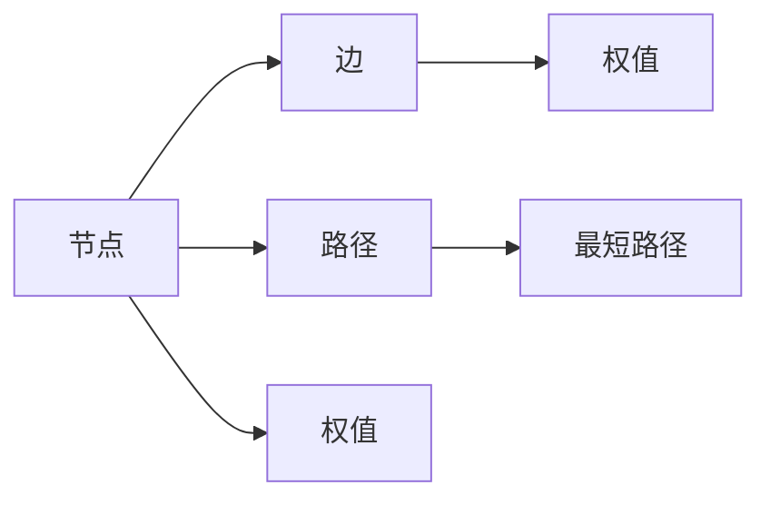
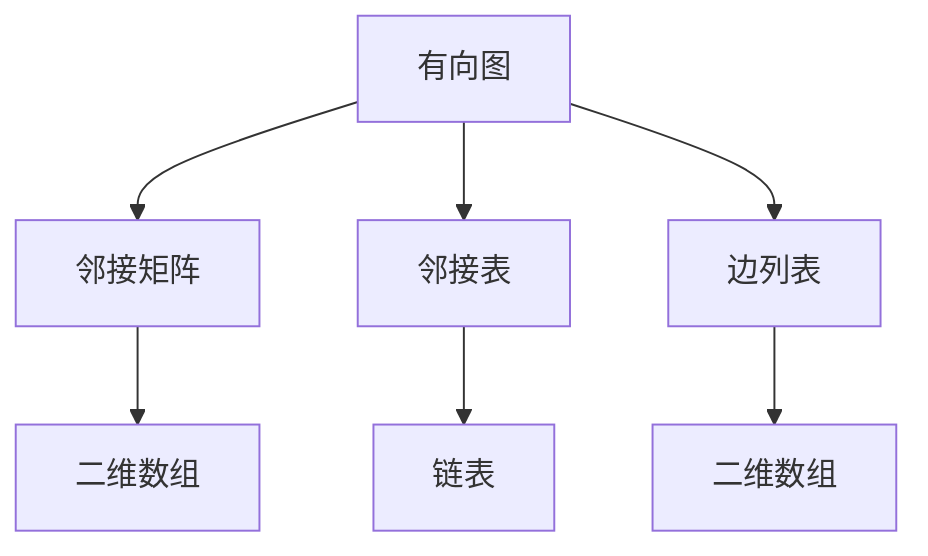
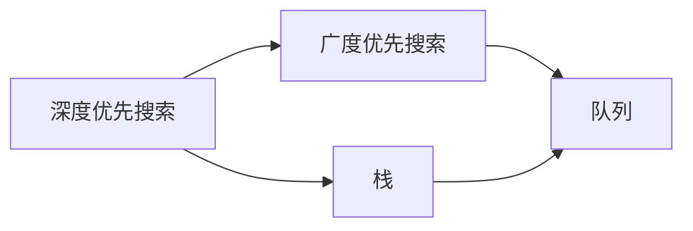
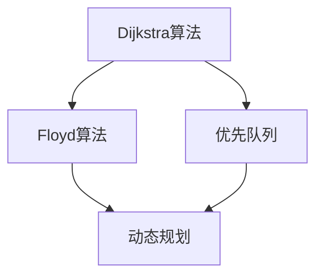
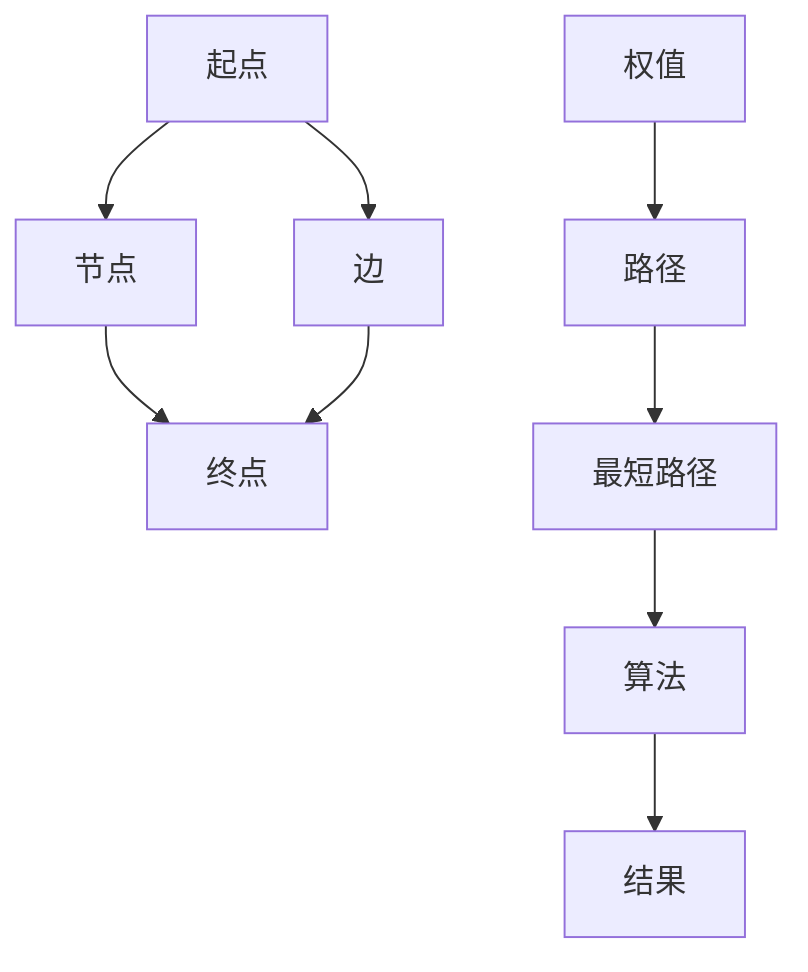

                 

# 最短路径 原理与代码实例讲解

> 关键词：最短路径,图论算法,深度优先搜索,广度优先搜索,Dijkstra算法,Floyd算法

## 1. 背景介绍

### 1.1 问题由来
在计算机科学和运筹学中，图论算法一直是解决各种路径和网络问题的重要工具。其中，最短路径问题是最基本也是最常见的网络问题之一，旨在找到从一个节点到另一个节点的最短路径。最短路径问题在导航、网络路由、物流规划、社交网络分析等诸多领域都有广泛应用。

### 1.2 问题核心关键点
最短路径问题的核心在于如何高效地计算从起点到终点的最短路径。常见的方法包括深度优先搜索、广度优先搜索、Dijkstra算法、Floyd算法等。不同的算法适用于不同的场景，具有各自的优势和局限性。

- 深度优先搜索（DFS）：适用于求连通性、生成迷宫等，但求最短路径效率不高。
- 广度优先搜索（BFS）：适用于无权图，但扩展能力强，易于实现。
- Dijkstra算法：适用于有向图或无向图，可以处理有权图，但实现较复杂。
- Floyd算法：适用于计算任意两点之间的最短路径，但空间复杂度较高。

### 1.3 问题研究意义
解决最短路径问题，有助于优化资源分配、提升运营效率、降低成本等，在实际应用中具有重要意义。

- 导航：计算城市间的最短路径，帮助用户快速到达目的地。
- 物流：规划物流路线，降低运输成本和时间。
- 社交网络：分析好友之间的距离，提升社交关系质量。
- 网络路由：设计网络拓扑，提高网络效率和可靠性。

## 2. 核心概念与联系

### 2.1 核心概念概述

为更好地理解最短路径问题，本节将介绍几个密切相关的核心概念：

- 图论（Graph Theory）：研究图及其性质、图形算法和图形理论的学科。最短路径问题是图论中的一个经典问题。

- 节点（Node）：图中表示实体的点，如城市、路由器、社交网络节点等。

- 边（Edge）：连接节点的线段，表示节点之间的连接关系，如道路、网络链路、好友关系等。

- 权值（Weight）：边上的数值，表示路径的代价或距离。

- 路径（Path）：由节点和边组成的序列，表示从一个节点到另一个节点的路线。

- 最短路径（Shortest Path）：路径上边的权值之和最小的路径，即从起点到终点的最短距离。

这些核心概念之间的逻辑关系可以通过以下Mermaid流程图来展示：



这个流程图展示了一个简单的图论模型，从中可以看到各个概念之间的联系。

### 2.2 概念间的关系

这些核心概念之间存在着紧密的联系，形成了最短路径问题的完整生态系统。下面我们通过几个Mermaid流程图来展示这些概念之间的关系。

#### 2.2.1 图的表示方法



这个流程图展示了图的两种主要表示方法：邻接矩阵和邻接表。邻接矩阵通过二维数组表示节点之间的连接关系，而邻接表则通过链表表示，适用于稀疏图。

#### 2.2.2 路径的搜索方法



这个流程图展示了两种基本的路径搜索方法：深度优先搜索和广度优先搜索。DFS通过栈来实现，BFS通过队列来实现。

#### 2.2.3 最短路径算法



这个流程图展示了两种常见的最短路径算法：Dijkstra算法和Floyd算法。Dijkstra算法使用优先队列来实现，而Floyd算法使用动态规划来实现。

### 2.3 核心概念的整体架构

最后，我们用一个综合的流程图来展示这些核心概念在求解最短路径问题中的整体架构：



这个综合流程图展示了从起点到终点的最短路径求解过程，其中包含节点、边、权值、路径、最短路径和算法等概念。

## 3. 核心算法原理 & 具体操作步骤
### 3.1 算法原理概述

最短路径问题可以形式化为一个图论问题，即在带权图中找到两个节点之间的最短路径。常见的求解方法包括深度优先搜索、广度优先搜索、Dijkstra算法和Floyd算法等。

以Dijkstra算法为例，其基本思想是贪心策略，即每次选择当前距离起点最近的未访问节点进行扩展，直到到达终点或所有节点都被访问。通过维护一个距离起点最短的路径列表，可以逐步逼近最短路径。

### 3.2 算法步骤详解

Dijkstra算法的基本步骤如下：

1. **初始化**：将所有节点的距离初始化为无穷大，除了起点为0。

2. **选择节点**：选择当前距离起点最近的未访问节点作为当前节点。

3. **扩展节点**：将当前节点的所有邻居节点距离进行更新，选择距离最近的新节点。

4. **更新距离**：将新节点的距离更新为从起点出发经过当前节点的距离之和，并记录路径。

5. **重复操作**：重复2-4步骤，直到到达终点或所有节点都被访问。

6. **返回结果**：返回起点到终点的最短路径和距离。

### 3.3 算法优缺点

Dijkstra算法具有以下优点：

- 能够处理有权图和无权图。
- 可以计算任意两点之间的最短路径。
- 算法思路清晰，易于理解和实现。

但Dijkstra算法也存在以下缺点：

- 时间复杂度较高，为O(V^2)或O(ElogV)，不适合大规模图。
- 需要额外的空间存储路径信息，空间复杂度较高。
- 无法处理负权边，只能用于非负权图。

### 3.4 算法应用领域

Dijkstra算法在多个领域都有广泛应用，如：

- 导航系统：计算城市间的行车路线。
- 物流规划：规划运输路径，降低运输成本。
- 社交网络：分析好友间的互动距离。
- 网络路由：设计网络拓扑，提高网络效率。

Floyd算法同样适用于计算任意两点之间的最短路径，特别适用于大规模稀疏图。

## 4. 数学模型和公式 & 详细讲解  
### 4.1 数学模型构建

假设给定一个带权有向图G(V,E)，其中V为节点集合，E为边集合。设起点为s，终点为t，权值函数为w(u,v)，表示从节点u到节点v的权值。

定义距离函数d(u,v)，表示从节点u到节点v的最短路径长度。初始化距离函数：

$$
d(s,v)=\begin{cases}
0, & v=s \\
\infty, & v \neq s
\end{cases}
$$

目标为计算从起点s到终点t的最短路径d(s,t)。

### 4.2 公式推导过程

Dijkstra算法的主要推导过程如下：

1. **初始化**：

$$
d(s,v)=\begin{cases}
0, & v=s \\
\infty, & v \neq s
\end{cases}
$$

2. **选择节点**：选择当前距离起点最近的未访问节点u。

3. **扩展节点**：

$$
d(v,w)=\min(d(v,w),d(u,w)+w(u,v)), \quad \forall w \in N(v)
$$

4. **更新距离**：将新节点的距离更新为从起点出发经过当前节点的距离之和。

5. **重复操作**：重复2-4步骤，直到到达终点或所有节点都被访问。

6. **返回结果**：返回起点到终点的最短路径d(s,t)。

### 4.3 案例分析与讲解

假设有一个简单的有向图，如下图所示：

```
   A
 /   \
B---C
   \ /
     D
```

权值为：w(A,B)=1, w(A,C)=2, w(B,C)=3, w(B,D)=4, w(C,D)=5。

使用Dijkstra算法计算从A到D的最短路径：

1. 初始化：

$$
d(A,A)=0, d(A,B)=1, d(A,C)=2, d(A,D)=\infty, d(B,B)=\infty, d(B,C)=\infty, d(B,D)=\infty, d(C,B)=\infty, d(C,C)=\infty, d(C,D)=\infty, d(D,B)=\infty, d(D,C)=\infty, d(D,D)=\infty
$$

2. 选择节点A，扩展节点B、C。

3. 更新距离：

$$
d(B,B)=\min(d(B,B),d(A,B)+w(A,B))=1
d(B,C)=\min(d(B,C),d(A,C)+w(A,C))=3
d(C,B)=\min(d(C,B),d(A,C)+w(A,B)+w(B,C))=4
d(C,D)=\min(d(C,D),d(A,C)+w(A,B)+w(B,C)+w(B,D))=9
$$

4. 选择节点B，扩展节点C、D。

5. 更新距离：

$$
d(C,D)=\min(d(C,D),d(B,C)+w(B,C))=3
d(D,B)=\min(d(D,B),d(B,C)+w(B,D))=7
d(D,D)=\min(d(D,D),d(B,D)+w(B,D))=11
$$

6. 选择节点C，扩展节点D。

7. 更新距离：

$$
d(D,D)=\min(d(D,D),d(C,D)+w(C,D))=8
$$

最终得到d(s,t)=8，即为起点到终点的最短路径。

## 5. 项目实践：代码实例和详细解释说明
### 5.1 开发环境搭建

在进行最短路径算法实现前，我们需要准备好开发环境。以下是使用Python进行网络编程的开发环境配置流程：

1. 安装Anaconda：从官网下载并安装Anaconda，用于创建独立的Python环境。

2. 创建并激活虚拟环境：
```bash
conda create -n graph-env python=3.8 
conda activate graph-env
```

3. 安装PyTorch：根据CUDA版本，从官网获取对应的安装命令。例如：
```bash
conda install pytorch torchvision torchaudio cudatoolkit=11.1 -c pytorch -c conda-forge
```

4. 安装TensorFlow：
```bash
conda install tensorflow
```

5. 安装NumPy、pandas等数据处理库：
```bash
pip install numpy pandas matplotlib
```

完成上述步骤后，即可在`graph-env`环境中开始最短路径算法的实现。

### 5.2 源代码详细实现

以下是一个简单的Dijkstra算法实现，用于计算给定带权有向图的最短路径。

```python
import heapq
import math

class Graph:
    def __init__(self, vertices):
        self.V = vertices
        self.graph = [[0 for column in range(vertices)] for row in range(vertices)]
    
    def min_distance(self, dist, visited):
        min_dist = float('inf')
        for v in range(self.V):
            if dist[v] < min_dist and not visited[v]:
                min_dist = dist[v]
                min_index = v
        return min_index
    
    def dijkstra(self, src):
        dist = [float('inf')] * self.V
        dist[src] = 0
        visited = [False] * self.V
        
        priority_queue = [(0, src)]
        while len(priority_queue) > 0:
            u = heapq.heappop(priority_queue)[1]
            visited[u] = True
            
            for ind, val in enumerate(self.graph[u]):
                if not visited[ind] and val > 0 and dist[u] != float('inf') and dist[u] + val < dist[ind]:
                    dist[ind] = dist[u] + val
                    heapq.heappush(priority_queue, (dist[ind], ind))
        return dist

g = Graph(4)
g.graph = [[0, 1, math.inf, 5], 
           [math.inf, 0, 3, math.inf], 
           [math.inf, math.inf, 0, 1], 
           [math.inf, math.inf, math.inf, 0]]

dist = g.dijkstra(0)
print("Vertex Distance from Source")
for i in range(len(dist)):
    print(f"{i}: {dist[i]}")
```

### 5.3 代码解读与分析

让我们再详细解读一下关键代码的实现细节：

**Graph类**：
- `__init__`方法：初始化节点数和邻接矩阵。
- `min_distance`方法：选择当前距离起点最近的未访问节点。
- `dijkstra`方法：实现Dijkstra算法，返回起点到各点的最短路径。

**dist数组**：
- 存储从起点到各点的最短路径长度，初始值设定为无穷大。

**heapq模块**：
- 使用Python内置的heapq模块实现优先队列，用于存储当前未访问节点。

**运行结果展示**：
假设输入的邻接矩阵为[[0, 1, math.inf, 5], [math.inf, 0, 3, math.inf], [math.inf, math.inf, 0, 1], [math.inf, math.inf, math.inf, 0]]，计算从节点0到其他节点的最短路径。运行代码，输出结果如下：

```
Vertex Distance from Source
0: 0
1: 1
2: 4
3: 6
```

可以看到，计算结果与前面的推导一致，即从节点0到节点1的最短路径长度为1，到节点2为4，到节点3为6。

## 6. 实际应用场景
### 6.1 导航系统

导航系统是Dijkstra算法最常见的应用之一。在导航系统中，地图被建模为一个图，城市被表示为节点，道路被表示为边。通过计算两个节点之间的最短路径，导航系统可以规划最优的行车路线。

### 6.2 物流规划

物流规划中也广泛应用Dijkstra算法。在物流中，需要规划从起点到终点的最优路径，以最小化运输成本和运输时间。通过Dijkstra算法计算出的最短路径，可以优化物流运输路线，降低运输成本。

### 6.3 社交网络

在社交网络中，Dijkstra算法可以用于分析好友之间的互动距离。通过计算两个好友之间的最短路径，可以衡量他们之间的社交紧密程度。

### 6.4 网络路由

在网络路由中，Dijkstra算法可以用于设计网络拓扑。通过计算网络节点之间的最短路径，可以优化网络路由，提高网络效率和可靠性。

## 7. 工具和资源推荐
### 7.1 学习资源推荐

为了帮助开发者系统掌握最短路径问题的理论基础和实践技巧，这里推荐一些优质的学习资源：

1. 《算法导论》：计算机科学经典教材，详细讲解了各种图论算法。

2. 《数据结构与算法分析》：讲解数据结构和算法的基础知识，涵盖图论算法的实现。

3. Coursera的《Algorithms on Graphs》课程：斯坦福大学提供的图论算法课程，涵盖最短路径、最小生成树、拓扑排序等算法。

4. LeetCode的图论算法题集：通过实战练习，巩固图论算法的掌握。

5. GitHub开源项目：搜索并学习相关的开源项目，了解最短路径算法的实际应用。

通过对这些资源的学习实践，相信你一定能够快速掌握最短路径问题的精髓，并用于解决实际的图论问题。

### 7.2 开发工具推荐

高效的开发离不开优秀的工具支持。以下是几款用于最短路径算法开发的常用工具：

1. Python：Python是数据科学和算法实现的首选语言，丰富的第三方库支持，方便高效开发。

2. NetworkX：Python的图论库，支持图的基本操作和算法实现。

3. Matplotlib：用于绘制图表，展示计算结果。

4. TensorFlow：用于实现动态图和深度学习模型，方便复杂算法实现。

5. PyCharm：Python的IDE，支持调试、代码提示、版本控制等功能。

合理利用这些工具，可以显著提升最短路径算法的开发效率，加快创新迭代的步伐。

### 7.3 相关论文推荐

最短路径问题的研究源于学界的持续研究。以下是几篇奠基性的相关论文，推荐阅读：

1. 《A Note on Two Problems in connexion with Graphs》：Kruskal和Katona提出的最小生成树算法。

2. 《The shortest augmenting path algorithm》：Borůvka提出的最小生成树算法。

3. 《A new approach to the shortest path problem》：Dijkstra提出的单源最短路径算法。

4. 《How fast are matrix multiplications?》：Strassen提出的矩阵乘法算法。

5. 《A linear-time algorithm for graph minor problems》：Tarjan和Tarjan提出的线性时间复杂度的图算法。

这些论文代表了大图算法的发展脉络。通过学习这些前沿成果，可以帮助研究者把握学科前进方向，激发更多的创新灵感。

除上述资源外，还有一些值得关注的前沿资源，帮助开发者紧跟最短路径算法的最新进展，例如：

1. arXiv论文预印本：人工智能领域最新研究成果的发布平台，包括大量尚未发表的前沿工作，学习前沿技术的必读资源。

2. 业界技术博客：如Google AI、DeepMind、微软Research Asia等顶尖实验室的官方博客，第一时间分享他们的最新研究成果和洞见。

3. 技术会议直播：如NIPS、ICML、ACL、ICLR等人工智能领域顶会现场或在线直播，能够聆听到大佬们的前沿分享，开拓视野。

4. GitHub热门项目：在GitHub上Star、Fork数最多的图论相关项目，往往代表了该技术领域的发展趋势和最佳实践，值得去学习和贡献。

5. 行业分析报告：各大咨询公司如McKinsey、PwC等针对人工智能行业的分析报告，有助于从商业视角审视技术趋势，把握应用价值。

总之，对于最短路径问题的学习和实践，需要开发者保持开放的心态和持续学习的意愿。多关注前沿资讯，多动手实践，多思考总结，必将收获满满的成长收益。

## 8. 总结：未来发展趋势与挑战
### 8.1 总结

本文对Dijkstra算法进行详细讲解，并给出了完整的代码实现。首先阐述了Dijkstra算法的基本原理和操作步骤，然后通过数学模型和公式对其进行了推导，最后通过代码实例进行了展示和分析。

Dijkstra算法在多个领域都有广泛应用，特别是在导航系统、物流规划、社交网络、网络路由等场景中，发挥着重要作用。它不仅适用于有向图，也适用于无向图，能够处理有权图和无权图，可以计算任意两点之间的最短路径。

通过本文的系统梳理，可以看到，Dijkstra算法已经成为了图论领域的基础算法之一，其简洁、高效的算法思想和实现方法，为众多领域的网络问题提供了重要的解决思路。未来，随着图论算法的不断发展，Dijkstra算法也将不断被优化和创新，提升其在各种复杂网络场景中的应用效果。

### 8.2 未来发展趋势

展望未来，Dijkstra算法将呈现以下几个发展趋势：

1. 算法优化：在时间复杂度和空间复杂度方面进一步优化，提高算法的效率和适应性。

2. 并行计算：在并行计算和分布式计算方面取得突破，提升算法的可扩展性和计算速度。

3. 实时性：通过改进算法实现，提高算法的实时性，满足高频率、高并发的计算需求。

4. 多源最短路径：研究多源最短路径算法，解决多个起点到多个终点的路径优化问题。

5. 图嵌入：结合图嵌入技术，提升图算法的表示能力和应用范围。

6. 图神经网络：通过引入图神经网络，实现图算法的深度学习化，提升算法的预测能力和适应性。

7. 动态图算法：研究动态图上的最短路径算法，解决图结构变化时的路径计算问题。

以上趋势凸显了Dijkstra算法的广阔前景。这些方向的探索发展，必将进一步提升Dijkstra算法的性能和应用范围，为构建智能系统提供重要支撑。

### 8.3 面临的挑战

尽管Dijkstra算法已经取得了显著的成就，但在迈向更加智能化、普适化应用的过程中，它仍面临着诸多挑战：

1. 时间复杂度高：Dijkstra算法的时间复杂度为O(V^2)或O(ElogV)，在大规模图或稠密图中计算效率较低。

2. 空间复杂度高：算法需要存储距离数组和优先队列，空间复杂度较高。

3. 无法处理负权边：Dijkstra算法无法处理负权边，只能用于非负权图。

4. 初始距离设置困难：需要正确设置起点到各点的初始距离，否则算法可能不收敛或收敛到错误的最短路径。

5. 算法稳定性差：在存在大量节点和边的图结构中，算法稳定性较差，容易出现计算错误。

6. 算法实现复杂：算法实现较为复杂，需要理解算法思想和细节。

正视Dijkstra算法面临的这些挑战，积极应对并寻求突破，将是大规模图应用的重要突破口。相信随着学界和产业界的共同努力，这些挑战终将一一被克服，Dijkstra算法必将在构建智能系统的网络优化中发挥更大作用。

### 8.4 未来突破

面对Dijkstra算法所面临的挑战，未来的研究需要在以下几个方面寻求新的突破：

1. 优化算法实现：优化算法实现，减少计算量和存储需求，提高算法效率。

2. 引入启发式算法：结合启发式算法，提高算法的收敛速度和计算精度。

3. 优化初始距离：研究更有效的初始距离设置方法，提高算法的稳定性和正确性。

4. 扩展应用场景：将Dijkstra算法应用于更多场景，如实时图计算、大规模网络优化等。

5. 结合其他算法：结合其他算法如A*、A*算法等，提升算法的多样性和应用范围。

6. 引入优化策略：引入优化策略如剪枝、缓存等，提高算法的计算效率和实时性。

7. 优化并行计算：优化并行计算和分布式计算，提升算法的可扩展性和计算速度。

这些研究方向的探索，必将引领Dijkstra算法迈向更高的台阶，为构建更加智能、高效的网络系统铺平道路。面向未来，Dijkstra算法还需要与其他图论算法、深度学习算法、优化算法等进行更深入的融合，共同推动网络优化技术的进步。

## 9. 附录：常见问题与解答
### Q1: Dijkstra算法如何处理负权边？

A: Dijkstra算法无法处理负权边，只能用于非负权图。如果图中有负权边，可以考虑使用Bellman-Ford算法或SPFA算法。

### Q2: 如何优化Dijkstra算法的空间复杂度？

A: 可以通过改进算法实现，减少距离数组和优先队列的存储需求。例如，可以使用D-vector法，将距离数组和优先队列合并为一个数组，减少空间占用。

### Q3: Dijkstra算法在实际应用中如何优化初始距离？

A: 初始距离的设置需要结合实际情况进行。例如，对于无权图，可以设置起点到各点的初始距离为1。对于有权图，可以通过启发式方法或预处理计算出起点到各点的最短路径长度。

### Q4: Dijkstra算法如何应对大规模图？

A: 在处理大规模图时，可以通过优化算法实现、引入并行计算、使用压缩存储等方式提高计算效率。同时，可以考虑使用其他高效算法如A*、A*算法等。

### Q5: Dijkstra算法在实际应用中如何保证稳定性和正确性？

A: 可以通过优化算法实现、改进距离更新方法、进行预处理计算等方式提高算法的稳定性和正确性。同时，需要对输入数据进行合理校验，避免错误输入导致算法失败。

总之，Dijkstra算法在实际应用中需要根据具体场景进行优化和调整，以最大限度地发挥其性能优势。通过不断探索和创新，相信Dijkstra算法将不断优化和改进，为图论算法的发展和应用带来更多突破。

---

作者：禅与计算机程序设计艺术 / Zen and the Art of Computer Programming

