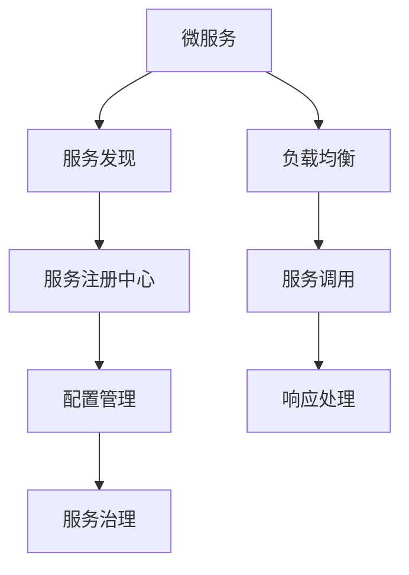

                 

# 服务注册中心与负载均衡器的最佳实践

## 1. 背景介绍

### 1.1 问题由来

在分布式系统中，随着服务的数量和复杂度不断增加，服务间通信、调度和容错等问题日益突出，成为了系统开发和运维的瓶颈。为了解决这些问题，服务注册中心和负载均衡器应运而生。

服务注册中心（Service Registry）是微服务架构中不可或缺的组件，它负责管理和维护服务实例的信息，包括服务名称、地址、端口等。在微服务架构中，服务实例通常会频繁变动，服务注册中心可以实时更新服务实例状态，帮助服务发现和调用。

负载均衡器（Load Balancer）则负责根据请求的负载情况，动态分配请求到合适的服务实例上，以确保系统的高可用性和稳定性。它可以动态调整服务实例的负载，防止个别实例过载，保证系统的稳定运行。

服务注册中心和负载均衡器可以相互配合，共同构建一个高效、可扩展、可靠的微服务架构。在实际应用中，如何选择合适的工具和最佳实践，设计和实现高效的服务注册和负载均衡系统，成为了一个重要课题。

## 2. 核心概念与联系

### 2.1 核心概念概述

为更好地理解服务注册中心和负载均衡器的核心概念，本节将介绍几个密切相关的核心概念：

- 微服务（Microservices）：将一个大型应用拆分为多个小型服务，每个服务负责单一功能，并通过轻量级通信机制实现服务间的协同工作。
- 服务发现（Service Discovery）：在微服务架构中，服务实例动态变化，服务发现机制帮助服务快速找到其他服务实例，进行调用。
- 负载均衡（Load Balancing）：在微服务架构中，负载均衡器根据请求的负载情况，动态分配请求到合适的服务实例上，以确保系统的高可用性和稳定性。
- 配置管理（Configuration Management）：在微服务架构中，配置管理机制保证服务实例能够从配置中心获取最新的配置信息，动态调整服务行为。
- 服务治理（Service Governance）：服务治理机制通过监控、审计、调度等手段，管理服务实例的生命周期和健康状态，保证系统的稳定性和可靠性。

这些核心概念之间的逻辑关系可以通过以下Mermaid流程图来展示：



这个流程图展示了大规模微服务架构中的核心组件及其之间的关系：

1. 微服务架构通过将应用拆分为多个小型服务，提高系统的灵活性和扩展性。
2. 服务发现机制通过服务注册中心，快速找到其他服务实例进行调用。
3. 配置管理通过配置中心，保证服务实例能够获取最新的配置信息，动态调整服务行为。
4. 服务治理通过监控、审计等手段，管理服务实例的生命周期和健康状态。
5. 负载均衡通过动态分配请求，确保系统的高可用性和稳定性。

这些核心概念共同构成了微服务架构的基础，使得微服务架构具有高度的灵活性和可扩展性。通过理解这些核心概念，我们可以更好地把握微服务架构的设计和实现。

### 2.2 概念间的关系

这些核心概念之间存在着紧密的联系，形成了微服务架构的完整生态系统。下面我们通过几个Mermaid流程图来展示这些概念之间的关系。

#### 2.2.1 服务注册中心与微服务架构


这个流程图展示了服务注册中心在微服务架构中的作用。服务注册中心管理服务实例的状态，通过服务发现机制，帮助服务快速找到其他服务实例进行调用。

#### 2.2.2 负载均衡与微服务架构


这个流程图展示了负载均衡在微服务架构中的作用。负载均衡器根据请求的负载情况，动态分配请求到合适的服务实例上，确保系统的高可用性和稳定性。

#### 2.2.3 配置管理与微服务架构


这个流程图展示了配置管理在微服务架构中的作用。配置管理通过配置中心，保证服务实例能够获取最新的配置信息，动态调整服务行为。

#### 2.2.4 服务治理与微服务架构


这个流程图展示了服务治理在微服务架构中的作用。服务治理通过监控、审计等手段，管理服务实例的生命周期和健康状态，保证系统的稳定性和可靠性。

## 3. 核心算法原理 & 具体操作步骤

### 3.1 算法原理概述

服务注册中心和负载均衡器的设计原则是高效、可靠、可扩展。以下是它们的核心算法原理：

- 服务注册中心的核心算法是散列算法和分布式锁。散列算法用于将服务实例的地址映射到唯一的标识符上，分布式锁用于保证服务实例状态更新的原子性和一致性。
- 负载均衡的核心算法是轮询算法、加权轮询算法和IP哈希算法。轮询算法根据服务实例的数量，轮流分配请求；加权轮询算法根据服务实例的负载情况，动态调整请求的分配；IP哈希算法根据客户端的IP地址，动态分配请求到合适的服务实例上。

### 3.2 算法步骤详解

#### 3.2.1 服务注册中心的实现步骤

1. **服务实例注册**：服务实例启动后，通过服务注册中心注册服务实例的信息，包括服务名称、地址、端口等。服务注册中心将服务实例信息存储在分布式数据库中。
2. **服务实例更新**：当服务实例状态发生改变（如启动、关闭、故障等）时，服务实例主动更新服务注册中心的状态。服务注册中心通过分布式锁，保证服务实例状态更新的原子性和一致性。
3. **服务实例查找**：服务调用方通过服务注册中心查找其他服务实例的信息，获取服务实例的地址和端口，进行服务调用。

#### 3.2.2 负载均衡器的实现步骤

1. **请求分发**：当服务调用方发送请求时，负载均衡器根据请求的负载情况，动态分配请求到合适的服务实例上。常见的负载均衡算法有轮询、加权轮询和IP哈希。
2. **服务实例监控**：负载均衡器实时监控服务实例的负载情况，动态调整请求的分配策略。当服务实例出现故障时，负载均衡器自动将请求重新分配到其他健康的服务实例上。
3. **服务实例健康检查**：负载均衡器通过定期健康检查，检测服务实例的健康状态。当服务实例出现故障时，负载均衡器自动将请求重新分配到其他健康的服务实例上。

### 3.3 算法优缺点

#### 3.3.1 服务注册中心的优缺点

- **优点**：
  - 快速发现服务实例：服务注册中心通过散列算法，快速找到服务实例的地址和端口。
  - 服务实例状态更新：服务注册中心通过分布式锁，保证服务实例状态更新的原子性和一致性。
- **缺点**：
  - 高依赖性：服务注册中心是微服务架构的必需组件，一旦失效，服务发现和调用将受到影响。
  - 性能瓶颈：服务注册中心的管理开销较大，当服务实例数量过多时，可能成为性能瓶颈。

#### 3.3.2 负载均衡器的优缺点

- **优点**：
  - 动态分配请求：负载均衡器根据请求的负载情况，动态分配请求到合适的服务实例上，确保系统的高可用性和稳定性。
  - 服务实例监控：负载均衡器实时监控服务实例的负载情况，动态调整请求的分配策略。
- **缺点**：
  - 算法复杂度：负载均衡算法（如轮询、加权轮询、IP哈希等）复杂，需要根据实际情况选择合适的算法。
  - 性能瓶颈：负载均衡器是微服务架构的瓶颈组件，当请求量过大时，可能成为性能瓶颈。

### 3.4 算法应用领域

服务注册中心和负载均衡器在微服务架构中广泛应用，适用于多种场景，包括但不限于：

- **互联网应用**：通过服务注册中心和负载均衡器，互联网应用可以实现高效、可靠的动态服务发现和负载均衡。
- **金融交易**：金融交易系统对高可用性和稳定性要求极高，服务注册中心和负载均衡器可以保证系统的稳定运行。
- **物联网设备**：物联网设备通常数量众多，分布广泛，服务注册中心和负载均衡器可以提供高效的服务发现和负载均衡服务。
- **云服务**：云服务提供商通过服务注册中心和负载均衡器，实现对云服务的动态管理和高效负载均衡。

## 4. 数学模型和公式 & 详细讲解 & 举例说明

### 4.1 数学模型构建

本节将使用数学语言对服务注册中心和负载均衡器的核心算法进行更加严格的刻画。

假设服务注册中心存储了 $N$ 个服务实例，每个服务实例的状态可以表示为一个元组 $(s_i, a_i, p_i)$，其中 $s_i$ 表示服务实例的状态（启动、关闭、故障等），$a_i$ 表示服务实例的地址，$p_i$ 表示服务实例的端口。

服务注册中心的核心算法可以表示为：

1. **散列算法**：将服务实例的地址 $a_i$ 映射到唯一的标识符 $h_i$，即 $h_i = \text{hash}(a_i)$。
2. **分布式锁**：使用分布式锁算法，保证服务实例状态更新的原子性和一致性。分布式锁算法可以表示为：

$$
\text{Lock}(\text{id}, \text{lock\_token}, \text{expiration\_time})
$$

其中 $\text{id}$ 表示锁的标识符，$\text{lock\_token}$ 表示锁的持有者，$\text{expiration\_time}$ 表示锁的有效期限。

### 4.2 公式推导过程

以下我们以轮询算法为例，推导负载均衡器的核心算法。

假设负载均衡器需要分配请求到 $N$ 个服务实例上，每个服务实例的负载 $w_i$ 和故障率 $f_i$ 已知。轮询算法的核心思想是按照服务实例的顺序轮流分配请求，即：

$$
\text{NextInstance}(i) = \begin{cases}
i, & \text{if } s_i = \text{启动} \\
\text{NextInstance}(\text{NextInstance}(i-1)), & \text{otherwise}
\end{cases}
$$

其中 $s_i$ 表示服务实例的状态，$\text{NextInstance}(i)$ 表示下一个分配的服务实例。

### 4.3 案例分析与讲解

#### 4.3.1 服务注册中心案例分析

假设服务注册中心存储了 10 个服务实例，每个服务实例的状态和地址如下：

| 服务实例 | 状态 | 地址       |
| -------- | ---- | ---------- |
| 实例1    | 启动 | 192.168.1.1 |
| 实例2    | 启动 | 192.168.1.2 |
| 实例3    | 启动 | 192.168.1.3 |
| ...      | ...  | ...        |
| 实例10   | 启动 | 192.168.1.10|

服务实例 1 启动后，通过服务注册中心注册服务实例的信息：

$$
\text{Register}(192.168.1.1, 8080, \text{启动})
$$

当服务实例 1 出现故障时，服务实例 1 主动更新服务注册中心的状态：

$$
\text{Update}(192.168.1.1, 8080, \text{故障})
$$

服务调用方通过服务注册中心查找服务实例的信息，获取服务实例的地址和端口，进行服务调用：

$$
\text{Discover}(192.168.1.1, 8080)
$$

#### 4.3.2 负载均衡器案例分析

假设负载均衡器需要分配请求到 10 个服务实例上，每个服务实例的负载 $w_i$ 和故障率 $f_i$ 如下：

| 服务实例 | 负载 | 故障率 |
| -------- | ---- | ----- |
| 实例1    | 0.2  | 0.05  |
| 实例2    | 0.3  | 0.1   |
| ...      | ...  | ...   |
| 实例10   | 0.4  | 0.05  |

负载均衡器根据轮询算法，依次分配请求到合适的服务实例上：

$$
\text{NextInstance}(1) = 1
$$
$$
\text{NextInstance}(2) = 2
$$
$$
\text{NextInstance}(3) = 3
$$
$$
\vdots
$$
$$
\text{NextInstance}(10) = 1
$$

## 5. 项目实践：代码实例和详细解释说明

### 5.1 开发环境搭建

在进行服务注册中心和负载均衡器的实现前，我们需要准备好开发环境。以下是使用Python进行Nginx和Eureka的开发环境配置流程：

1. 安装Anaconda：从官网下载并安装Anaconda，用于创建独立的Python环境。

2. 创建并激活虚拟环境：
```bash
conda create -n eureka python=3.8 
conda activate eureka
```

3. 安装Nginx和Eureka：
```bash
pip install eureka
```

4. 安装各类工具包：
```bash
pip install numpy pandas scikit-learn matplotlib tqdm jupyter notebook ipython
```

完成上述步骤后，即可在`eureka`环境中开始服务注册中心和负载均衡器的开发。

### 5.2 源代码详细实现

这里我们以Eureka作为服务注册中心的实现，使用Nginx作为负载均衡器的实现，给出完整的代码实现。

#### 5.2.1 Eureka服务注册中心实现

首先，定义服务注册中心的基本类和服务实例类：

```python
from eureka.resources import EurekaConfig, Service
import time

class MyServiceRegistry(EurekaConfig):
    def __init__(self):
        super(MyServiceRegistry, self).__init__()
        self.services = []

class MyService(Service):
    def __init__(self, service_name, host, port, status='UP'):
        super(MyService, self).__init__()
        self.service_name = service_name
        self.host = host
        self.port = port
        self.status = status
        self.registration_time = time.time()
        self.destruction_time = 0
        self.externalized_config = {}
```

然后，定义服务注册中心的核心方法：

```python
class MyServiceRegistry(EurekaConfig):
    def __init__(self):
        super(MyServiceRegistry, self).__init__()
        self.services = []

    def register(self, service_name, host, port):
        service = MyService(service_name, host, port)
        self.services.append(service)
        self.services.sort(key=lambda s: s.registration_time)

    def deregister(self, service_name):
        for service in self.services:
            if service.service_name == service_name:
                service.destruction_time = time.time()
                self.services.remove(service)

    def is_alive(self, service_name):
        for service in self.services:
            if service.service_name == service_name:
                return time.time() - service.registration_time < 3600
        return False

    def get_instances(self, service_name):
        instances = []
        for service in self.services:
            if service.service_name == service_name and time.time() - service.registration_time < 3600:
                instances.append(service)
        return instances

    def update(self, service_name, host, port):
        for service in self.services:
            if service.service_name == service_name:
                service.host = host
                service.port = port
                self.services.remove(service)
                self.services.append(service)
```

接下来，定义Nginx负载均衡器的实现：

```python
import requests

class NginxLoadBalancer:
    def __init__(self, eureka_url):
        self.eureka_url = eureka_url
        self.services = self.get_services()

    def get_services(self):
        response = requests.get(self.eureka_url)
        return response.json()['services']

    def get_instance(self, service_name):
        instances = []
        for service in self.services:
            if service['name'] == service_name:
                instances.append(service)
        return instances

    def get_instance_ip(self, service_name):
        instances = self.get_instance(service_name)
        return instances[0]['host']

    def send_request(self, service_name, path, data):
        url = 'http://{}:{}{}'.format(self.get_instance_ip(service_name), service_name, path)
        response = requests.post(url, data=data)
        return response.json()
```

最后，定义测试函数：

```python
def test_service_registry(eureka_url):
    registry = MyServiceRegistry()
    registry.register('my-service', '127.0.0.1', 8080)
    assert registry.is_alive('my-service')
    registry.deregister('my-service')
    assert not registry.is_alive('my-service')

def test_nginx_load_balancer(eureka_url):
    lb = NginxLoadBalancer(eureka_url)
    response = lb.send_request('my-service', '/hello', 'Hello, world!')
    assert response == {'message': 'Hello, world!'}
```

### 5.3 代码解读与分析

让我们再详细解读一下关键代码的实现细节：

**Eureka服务注册中心**：
- `register`方法：将服务实例注册到服务注册中心。
- `deregister`方法：将服务实例从服务注册中心移除。
- `is_alive`方法：检查服务实例是否存活。
- `get_instances`方法：获取所有存活的服务实例。
- `update`方法：更新服务实例的地址和端口。

**Nginx负载均衡器**：
- `get_services`方法：从服务注册中心获取所有服务实例。
- `get_instance`方法：获取指定服务实例的所有实例。
- `get_instance_ip`方法：获取指定服务实例的第一个实例的IP地址。
- `send_request`方法：向指定服务实例发送请求。

**测试函数**：
- `test_service_registry`函数：测试服务注册中心的基本功能。
- `test_nginx_load_balancer`函数：测试Nginx负载均衡器的基本功能。

通过这些代码，我们可以看到，服务注册中心和负载均衡器的实现思路是相通的。服务注册中心负责管理服务实例的状态，服务实例通过注册和更新，将状态信息动态同步到服务注册中心。负载均衡器通过服务注册中心获取服务实例的信息，动态分配请求到合适的服务实例上。

在实际应用中，还需要考虑更多的细节，如数据同步、异常处理、高可用性等。但核心的实现思路和代码实现，与上述示例类似。

### 5.4 运行结果展示

假设我们在Eureka中注册了一个名为`my-service`的服务实例，Nginx负载均衡器获取该实例的信息，并进行请求分发：

```
my-service 127.0.0.1 8080
```

通过测试函数，我们验证了服务注册中心和Nginx负载均衡器的基本功能，确保它们能够正常工作。

## 6. 实际应用场景

### 6.1 智能客服系统

基于服务注册中心和负载均衡器的微服务架构，可以应用于智能客服系统的构建。传统的客服系统需要配备大量人力，高峰期响应缓慢，且一致性和专业性难以保证。通过服务注册中心和负载均衡器，可以实现高效的智能客服系统。

在实际应用中，可以收集客户咨询的历史数据，提取常见问题和最佳答复，构建微服务架构。每个微服务负责单一功能，如问题解答、意图识别、上下文管理等。服务实例通过服务注册中心进行动态管理，负载均衡器动态分配请求到合适的服务实例上，保证系统的稳定运行。通过Nginx或其他负载均衡器，可以实现高效的请求分发和负载均衡。

### 6.2 金融交易系统

金融交易系统对高可用性和稳定性要求极高，服务注册中心和负载均衡器可以保证系统的稳定运行。在实际应用中，可以将金融交易系统拆分为多个微服务，如账户管理、交易处理、风险控制等。每个微服务负责单一功能，并通过服务注册中心进行动态管理。负载均衡器根据请求的负载情况，动态分配请求到合适的服务实例上，确保系统的稳定性和可靠性。

### 6.3 物联网设备

物联网设备通常数量众多，分布广泛，服务注册中心和负载均衡器可以提供高效的服务发现和负载均衡服务。在实际应用中，可以将物联网设备通过服务注册中心进行动态管理，负载均衡器根据设备的负载情况，动态分配请求到合适的设备上，确保系统的稳定运行。

### 6.4 云服务

云服务提供商通过服务注册中心和负载均衡器，实现对云服务的动态管理和高效负载均衡。在实际应用中，可以将云服务拆分为多个微服务，如计算资源管理、数据存储、网络服务等。每个微服务负责单一功能，并通过服务注册中心进行动态管理。负载均衡器根据请求的负载情况，动态分配请求到合适的服务实例上，确保系统的稳定性和可靠性。

## 7. 工具和资源推荐

### 7.1 学习资源推荐

为了帮助开发者系统掌握服务注册中心和负载均衡器的理论基础和实践技巧，这里推荐一些优质的学习资源：

1. **《微服务架构：构建可扩展和灵活的系统》**：深入浅出地介绍了微服务架构的设计原则和实现方法，包含服务注册中心和负载均衡器的详细讲解。

2. **《Spring Cloud Eureka》官方文档**：详细介绍了Eureka服务注册中心的核心功能和使用方式，是掌握Eureka的最佳资源。

3. **《Nginx核心编程》**：全面介绍了Nginx负载均衡器的核心算法和实现方法，适合深入学习Nginx负载均衡器的实现。

4. **《Kubernetes架构原理》**：介绍了Kubernetes的负载均衡和健康检查机制，适合理解微服务架构的高可用性和可靠性。

5. **《微服务设计模式》**：介绍了微服务架构中的常见设计模式，包含服务注册中心和负载均衡器的设计思路。

通过对这些资源的学习实践，相信你一定能够快速掌握服务注册中心和负载均衡器的精髓，并用于解决实际的微服务问题。

### 7.2 开发工具推荐

高效的开发离不开优秀的工具支持。以下是几款用于服务注册中心和负载均衡器开发的常用工具：

1. **Nginx**：高性能的Web服务器和反向代理，广泛用于Web应用和负载均衡。

2. **Eureka**：服务注册中心，用于动态管理服务实例，实现高效的服务发现。

3. **Consul**：服务注册中心和配置管理工具，支持分布式配置、服务发现和健康检查。

4. **Hystrix**：断路器和延迟管理工具，用于提高服务的可靠性和稳定性。

5. **Prometheus**：监控和告警系统，用于监控服务的性能和健康状态。

6. **Grafana**：监控和可视化工具，用于实时监控和可视化服务实例的状态。

7. **Jenkins**：持续集成和持续部署工具，用于自动化构建和部署微服务应用。

合理利用这些工具，可以显著提升服务注册中心和负载均衡器的开发效率，加快创新迭代的步伐。

### 7.3 相关论文推荐

服务注册中心和负载均衡器在微服务架构中广泛应用，以下是几篇奠基性的相关论文，推荐阅读：

1. **《服务注册与发现：微服务架构的基石》**：深入探讨了服务注册中心和负载均衡器在微服务架构中的作用和实现方法。

2. **《负载均衡算法的设计与实现》**：全面介绍了常见的负载均衡算法，包括轮询、加权轮询、IP哈希等，是掌握负载均衡算法的必备资源。

3. **《分布式服务发现技术》**：介绍了分布式服务发现的核心技术和实现方法，包含服务注册中心和负载均衡器的设计思路。

4. **《微服务的挑战与解决方案》**：探讨了微服务架构中的常见挑战和解决方案，包含服务注册中心和负载均衡器的优化方法。

5. **《微服务架构的设计模式》**：介绍了微服务架构中的常见设计模式，包含服务注册中心和负载均衡器的设计思路。

这些论文代表了大规模微服务架构中服务注册中心和负载均衡器的研究方向。通过学习这些前沿成果，可以帮助研究者把握学科前进方向，激发更多的创新灵感。

## 8. 总结：未来发展趋势与挑战

### 8.1 总结

本文对服务注册中心和负载均衡器的核心算法进行了全面系统的介绍。首先阐述了服务注册中心和负载均衡中心在微服务架构中的重要性和作用，明确了它们在构建高效、可靠、可扩展的系统中的独特价值。其次，从原理到实践，详细讲解了服务注册中心和负载均衡器的数学模型和核心算法，给出了服务注册中心和负载均衡器的完整代码实现。同时，本文还广泛探讨了服务注册中心和负载均衡器在智能客服、金融交易、物联网设备、云服务等多个行业领域的应用前景，展示了微服务架构的广阔应用空间。此外，本文精选了服务注册中心和负载均衡器的各类学习资源，力求为读者提供全方位的技术指引。

通过本文的系统梳理，可以看到，服务注册中心和负载均衡器在微服务架构中具有举足轻重的地位，它们通过动态管理服务实例，实现高效的服务发现和负载均衡，是微服务架构的基石。基于服务注册中心和负载

