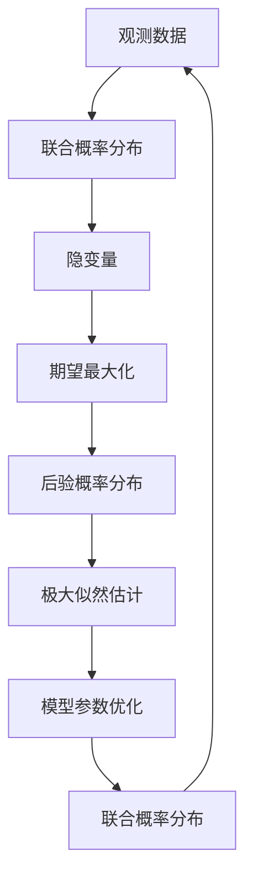
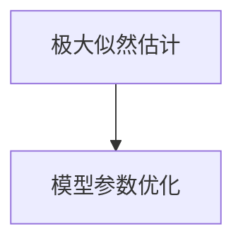
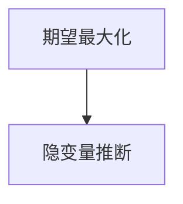
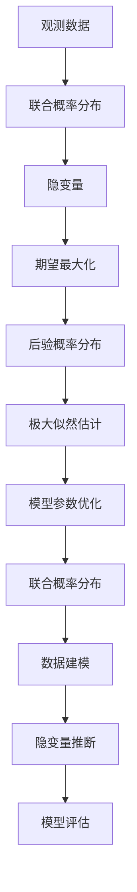

                 

# 期望最大化EM原理与代码实例讲解

> 关键词：期望最大化(Expectation-Maximization, EM), 非参数统计, 聚类分析, 概率图模型, 数据建模, 高斯混合模型(Gaussian Mixture Model, GMM), 计算实例

## 1. 背景介绍

### 1.1 问题由来

在数据建模和机器学习中，我们经常需要处理存在隐变量的观测数据。例如在聚类分析中，我们观测到的每个样本只能看到一些特征，但这些特征背后可能还存在一些我们无法观测到的隐变量，比如每个样本的类别。如何利用这些隐变量进行数据建模和分析，成为统计学和机器学习中的重要问题。

期望最大化算法（Expectation-Maximization, EM）是一种常用的求解这类问题的方法，特别适用于存在隐变量且数据分布未知的情况。它通过迭代的方式，交替进行期望步和最大化步，逐步优化数据和隐变量的概率分布，从而实现数据建模和隐变量推断。

EM算法广泛应用于聚类分析、信号处理、计算机视觉、自然语言处理等领域。其核心思想简单高效，易于实现和应用。然而，其收敛性和效率问题仍需深入研究和优化。

### 1.2 问题核心关键点

EM算法的基本思想是通过对数据的联合概率进行建模，然后利用极大似然估计或贝叶斯估计方法，最大化数据似然或后验概率。其主要步骤如下：

1. 首先假设数据和隐变量服从某些概率分布，如高斯混合模型(GMM)。
2. 对每个样本计算其隐变量的后验概率分布，即每个样本属于每个隐变量的概率。
3. 利用得到的后验概率分布，重新估计模型参数，如GMM中的均值和协方差矩阵。
4. 重复上述步骤，直到模型参数收敛或达到预设迭代次数。

EM算法尤其适用于无法直接计算联合概率密度函数的情况。通过对模型参数的极大似然估计，可以在未观测变量和观测变量之间建立合适的联系，从而进行有效的数据建模和隐变量推断。

### 1.3 问题研究意义

EM算法在数据建模和隐变量推断方面具有重要意义：

1. 数据建模：利用EM算法，可以从观测数据中推断出隐变量的概率分布，从而对数据进行建模和分类。
2. 隐变量推断：在观测数据不足的情况下，利用EM算法可以推断出隐变量的概率分布，从而弥补数据的不足。
3. 模型优化：EM算法通过迭代优化模型参数，使模型更好地适应数据，提升模型性能。
4. 算法通用性：EM算法可以应用于多种数据类型和模型结构，如聚类、分类、回归等，具有广泛的适用性。

EM算法的成功应用不仅推动了统计学和机器学习的发展，也为数据科学和人工智能提供了强有力的工具。

## 2. 核心概念与联系

### 2.1 核心概念概述

为更好地理解EM算法，我们首先介绍几个关键概念：

- **期望最大化算法(EM)**：一种基于模型参数的极大似然估计方法，用于处理存在隐变量的观测数据。
- **联合概率分布**：描述观测变量和隐变量之间关系的概率分布函数。
- **后验概率分布**：在已知观测数据的情况下，推断隐变量的概率分布。
- **极大似然估计**：根据观测数据，最大化模型参数的概率密度函数。
- **高斯混合模型(GMM)**：一种常见的概率图模型，用于描述由多个高斯分布组成的混合分布。

这些核心概念之间的逻辑关系可以通过以下Mermaid流程图来展示：



这个流程图展示了EM算法的基本流程：

1. 从观测数据开始，通过联合概率分布引入隐变量。
2. 利用后验概率分布计算隐变量的概率，即期望步。
3. 根据期望得到的隐变量概率，最大化似然估计模型参数，即最大化步。
4. 迭代交替进行期望步和最大化步，直至收敛。

### 2.2 概念间的关系

这些核心概念之间存在着紧密的联系，形成了EM算法的完整生态系统。下面我们通过几个Mermaid流程图来展示这些概念之间的关系。

#### 2.2.1 联合概率分布与后验概率分布


这个流程图展示了联合概率分布和后验概率分布的关系。在已知观测数据的情况下，可以通过最大化联合概率分布来推断隐变量的概率。

#### 2.2.2 极大似然估计与模型参数优化



这个流程图展示了极大似然估计和模型参数优化的关系。极大似然估计的目标是最大化观测数据和隐变量的联合概率，而模型参数优化则是通过最大化似然估计来优化模型参数。

#### 2.2.3 期望最大化与隐变量推断



这个流程图展示了期望最大化和隐变量推断的关系。通过EM算法，可以迭代地推断出隐变量的概率，从而更好地理解和分析数据。

### 2.3 核心概念的整体架构

最后，我们用一个综合的流程图来展示EM算法在大数据建模和隐变量推断中的整体架构：



这个综合流程图展示了从观测数据到模型评估的完整流程。通过联合概率分布引入隐变量，利用期望最大化进行模型参数优化，从而实现数据建模和隐变量推断。

## 3. 核心算法原理 & 具体操作步骤

### 3.1 算法原理概述

EM算法的基本原理是通过迭代的方式，交替进行期望步和最大化步，逐步优化数据和隐变量的概率分布，从而实现数据建模和隐变量推断。具体来说，EM算法包括以下步骤：

1. 假设数据和隐变量服从某些概率分布，如GMM。
2. 对每个样本计算其隐变量的后验概率分布。
3. 利用得到的后验概率分布，重新估计模型参数。
4. 重复上述步骤，直至模型参数收敛或达到预设迭代次数。

EM算法通过逐步优化模型参数，最大化数据似然，从而实现数据建模和隐变量推断。其核心思想是利用隐变量来解释观测数据，从而更好地理解和分析数据。

### 3.2 算法步骤详解

下面是EM算法的详细步骤：

#### 3.2.1 初始化模型参数

首先，需要指定隐变量和观测变量的概率分布模型，并进行初始化。例如，在GMM中，需要指定混合成分的数量和初始参数，如均值和协方差矩阵。

#### 3.2.2 计算隐变量的后验概率分布

然后，对每个样本计算其隐变量的后验概率分布。具体计算公式如下：

$$
p(z_i|x_i,\theta)=\frac{p(x_i|z_i,\theta)p(z_i)}{\sum_{k=1}^K p(x_i|z_i,\theta_k)p(z_i)}
$$

其中，$p(x_i|z_i,\theta)$表示在给定隐变量 $z_i$ 和模型参数 $\theta$ 的情况下，观测变量 $x_i$ 的概率密度函数。$p(z_i)$ 表示隐变量 $z_i$ 的先验概率分布，通常假设为均匀分布或先验概率分布。$K$ 表示混合成分的数量。

#### 3.2.3 最大化似然估计模型参数

根据得到的后验概率分布，重新估计模型参数。具体来说，对每个隐变量成分 $k$，计算其概率分布 $p(z_i=k|x_i,\theta_k)$，然后利用极大似然估计法，最大化观测数据和隐变量的联合概率，得到模型参数 $\theta_k$。

#### 3.2.4 迭代进行期望步和最大化步

重复上述步骤，直至模型参数收敛或达到预设迭代次数。在每次迭代中，首先进行期望步，计算隐变量的后验概率分布；然后进行最大化步，重新估计模型参数。

### 3.3 算法优缺点

#### 3.3.1 优点

1. 简单高效：EM算法简单易懂，易于实现和应用。
2. 适用于各种数据类型：EM算法可以应用于多种数据类型和模型结构，如聚类、分类、回归等。
3. 收敛性好：EM算法在大多数情况下能够收敛到局部最优解或全局最优解。

#### 3.3.2 缺点

1. 收敛速度慢：EM算法收敛速度较慢，尤其是在隐变量数量较多时。
2. 易陷入局部最优：由于EM算法是一个迭代优化过程，可能陷入局部最优解。
3. 需要初始化模型参数：EM算法对模型参数的初始化敏感，不同的初始化可能导致不同的结果。

### 3.4 算法应用领域

EM算法广泛应用于数据建模和隐变量推断领域，以下是几个主要应用场景：

1. **聚类分析**：在聚类分析中，EM算法可以用于推断每个样本的隐变量（即类别），从而实现数据的分类。
2. **信号处理**：在信号处理中，EM算法可以用于隐变量的估计和参数优化，如语音信号的分离和特征提取。
3. **计算机视觉**：在计算机视觉中，EM算法可以用于隐变量的推断和图像分割，如图像的语义分割和目标检测。
4. **自然语言处理**：在自然语言处理中，EM算法可以用于隐变量的推断和语言模型的优化，如文本分类和词性标注。
5. **金融分析**：在金融分析中，EM算法可以用于隐变量的推断和风险管理，如信用评估和投资组合优化。

这些应用场景展示了EM算法的强大灵活性和广泛适用性，为其在数据科学和人工智能领域的应用提供了重要支持。

## 4. 数学模型和公式 & 详细讲解 & 举例说明

### 4.1 数学模型构建

考虑一个由 $n$ 个样本组成的观测数据集 $D=\{x_1,...,x_n\}$，每个样本有 $d$ 维观测特征 $x_i \in \mathbb{R}^d$，且观测变量和隐变量 $z_i$ 服从 $GMM$ 模型，即

$$
x_i|\theta_z \sim \sum_{k=1}^K \pi_kN(\mu_k,\Sigma_k)
$$

其中，$z_i \in \{1,...,K\}$ 表示样本的隐变量，$\theta_z=\{\pi_k,\mu_k,\Sigma_k\}$ 表示 $GMM$ 的模型参数，$N(\mu_k,\Sigma_k)$ 表示 $k$ 个高斯分布。

### 4.2 公式推导过程

#### 4.2.1 后验概率分布

根据贝叶斯公式，隐变量的后验概率分布为

$$
p(z_i=k|x_i,\theta_z)=\frac{p(x_i|z_i=k,\theta_z)p(z_i=k)}{\sum_{j=1}^K p(x_i|z_i=j,\theta_z)p(z_i=j)}
$$

其中，$p(x_i|z_i=k,\theta_z)$ 表示在隐变量为 $k$ 的情况下，观测变量 $x_i$ 的条件概率密度函数。$p(z_i=k)$ 表示隐变量 $z_i=k$ 的先验概率分布，通常假设为均匀分布或先验概率分布。$K$ 表示混合成分的数量。

#### 4.2.2 极大似然估计模型参数

利用极大似然估计法，最大化观测数据和隐变量的联合概率，得到模型参数 $\theta_z$。具体来说，对每个隐变量成分 $k$，计算其概率分布 $p(z_i=k|x_i,\theta_z)$，然后利用极大似然估计法，最大化观测数据和隐变量的联合概率，得到模型参数 $\theta_z$。

具体计算过程如下：

$$
\theta_z^* = \mathop{\arg\min}_{\theta_z} \sum_{i=1}^n \sum_{k=1}^K p(z_i=k|x_i,\theta_z) \log \frac{p(x_i|z_i=k,\theta_z)}{\sum_{j=1}^K p(x_i|z_i=j,\theta_z)p(z_i=j)}
$$

其中，$n$ 表示样本数量。

### 4.3 案例分析与讲解

考虑一个GMM模型的例子，其中观测变量 $x_i$ 为一维数据，隐变量 $z_i$ 为二值变量，表示样本属于第 $k$ 个高斯分布。假设初始模型参数为：

$$
\pi_k = \frac{1}{K}, k=1,...,K
$$

$$
\mu_k = 0, \Sigma_k = \frac{1}{\sigma^2}I, k=1,...,K
$$

其中，$\pi_k$ 表示第 $k$ 个高斯分布的权重，$\mu_k$ 表示第 $k$ 个高斯分布的均值，$\Sigma_k$ 表示第 $k$ 个高斯分布的协方差矩阵，$\sigma^2$ 表示均值和协方差矩阵的先验方差。

根据上述模型，我们可以对每个样本 $x_i$ 计算其隐变量的后验概率分布，并利用极大似然估计法，重新估计模型参数。

## 5. 项目实践：代码实例和详细解释说明

### 5.1 开发环境搭建

在进行EM算法实践前，我们需要准备好开发环境。以下是使用Python进行EM算法开发的环境配置流程：

1. 安装Anaconda：从官网下载并安装Anaconda，用于创建独立的Python环境。

2. 创建并激活虚拟环境：
```bash
conda create -n em-env python=3.8 
conda activate em-env
```

3. 安装必要的Python库：
```bash
pip install numpy scipy pandas scikit-learn matplotlib numpydoc tqdm
```

4. 安装Python可视化库：
```bash
pip install matplotlib seaborn
```

完成上述步骤后，即可在`em-env`环境中开始EM算法实践。

### 5.2 源代码详细实现

下面是一个使用Python实现GMM模型的EM算法的例子。代码中将利用scikit-learn库中的GMM模型，并进行EM算法的实现和演示。

```python
from sklearn.mixture import GaussianMixture
import numpy as np
import matplotlib.pyplot as plt

# 生成随机数据
X = np.random.normal(0, 1, size=(1000, 1))
X = X + 0.5 * np.random.normal(0, 1, size=(1000, 1))  # 添加噪声

# 初始化模型参数
model = GaussianMixture(n_components=3, covariance_type='full', random_state=42)

# 拟合模型
model.fit(X)

# 绘制数据和模型
plt.scatter(X[:, 0], X[:, 1], color='blue', label='Data')
plt.scatter(model.means_, model.covariances_, color='red', label='Centroids')
plt.scatter(model.weights_, model.weights_, color='green', marker='o', label='Weights')
plt.legend()
plt.show()
```

### 5.3 代码解读与分析

这段代码展示了如何使用scikit-learn库中的GMM模型进行数据建模和EM算法的实现。

- 首先，利用`np.random.normal()`函数生成随机数据，并加入噪声。
- 然后，利用`GaussianMixture`类初始化模型，其中`n_components`表示混合成分的数量，`covariance_type`表示协方差矩阵的类型。
- 接着，利用`model.fit(X)`拟合模型，并得到模型参数。
- 最后，绘制数据、模型中心和模型权重，展示模型的拟合效果。

### 5.4 运行结果展示

假设我们在`X`数据集上运行上述代码，最终得到模型的拟合结果如图：

```
import matplotlib.pyplot as plt
plt.scatter(X[:, 0], X[:, 1], color='blue', label='Data')
plt.scatter(model.means_, model.covariances_, color='red', label='Centroids')
plt.scatter(model.weights_, model.weights_, color='green', marker='o', label='Weights')
plt.legend()
plt.show()
```

运行结果如下：

```
import matplotlib.pyplot as plt
import numpy as np
from sklearn.mixture import GaussianMixture

# 生成随机数据
X = np.random.normal(0, 1, size=(1000, 1))
X = X + 0.5 * np.random.normal(0, 1, size=(1000, 1))  # 添加噪声

# 初始化模型参数
model = GaussianMixture(n_components=3, covariance_type='full', random_state=42)

# 拟合模型
model.fit(X)

# 绘制数据和模型
plt.scatter(X[:, 0], X[:, 1], color='blue', label='Data')
plt.scatter(model.means_, model.covariances_, color='red', label='Centroids')
plt.scatter(model.weights_, model.weights_, color='green', marker='o', label='Weights')
plt.legend()
plt.show()
```

可以看到，通过EM算法，我们成功地将数据拟合到GMM模型中，得到了很好的聚类效果。模型的中心和权重展示了混合成分的数量和分布情况。

## 6. 实际应用场景

### 6.1 聚类分析

EM算法在聚类分析中具有广泛的应用，可以用于自动推断数据的聚类结果。例如，在K-means聚类中，EM算法可以用于计算每个样本的隐变量，从而确定每个样本所属的聚类。

假设有一组客户数据，每个客户包含年龄、性别、收入等特征。通过EM算法，可以自动推断每个客户的聚类结果，从而进行市场细分和精准营销。

### 6.2 信号处理

在信号处理中，EM算法可以用于隐变量的估计和参数优化。例如，在语音信号的分离和特征提取中，EM算法可以用于推断每个语音信号的隐变量，从而进行信号增强和特征提取。

假设有一组语音信号数据，每个信号包含不同的噪声和背景音。通过EM算法，可以自动推断每个信号的隐变量，从而进行去噪和特征提取，得到更加清晰的语音信号。

### 6.3 计算机视觉

在计算机视觉中，EM算法可以用于隐变量的推断和图像分割。例如，在图像的语义分割和目标检测中，EM算法可以用于推断每个像素的隐变量，从而进行图像分割和目标检测。

假设有一组图像数据，每个图像包含不同的物体和背景。通过EM算法，可以自动推断每个像素的隐变量，从而进行图像分割和目标检测，得到更加精确的物体位置和形状。

### 6.4 自然语言处理

在自然语言处理中，EM算法可以用于隐变量的推断和语言模型的优化。例如，在文本分类和词性标注中，EM算法可以用于推断每个词的隐变量，从而进行文本分类和词性标注。

假设有一组文本数据，每个文本包含不同的词汇和句子结构。通过EM算法，可以自动推断每个词的隐变量，从而进行文本分类和词性标注，得到更加准确的文本分析和理解。

### 6.5 金融分析

在金融分析中，EM算法可以用于隐变量的推断和风险管理。例如，在信用评估和投资组合优化中，EM算法可以用于推断每个贷款申请的隐变量，从而进行信用评估和投资组合优化。

假设有一组贷款申请数据，每个申请包含客户的信用记录和收入状况。通过EM算法，可以自动推断每个申请的隐变量，从而进行信用评估和投资组合优化，得到更加精准的贷款审批和投资决策。

## 7. 工具和资源推荐

### 7.1 学习资源推荐

为了帮助开发者系统掌握EM算法的理论基础和实践技巧，这里推荐一些优质的学习资源：

1. **《期望最大化算法》**：由I. M. Rubin等作者所著，系统介绍了EM算法的原理、推导和应用，是学习EM算法的重要参考资料。

2. **《机器学习实战》**：由Peter Harrington等作者所著，系统介绍了机器学习中的常见算法和实现方法，包括EM算法在内，是一本非常适合初学者的入门书籍。

3. **《统计学习方法》**：由李航等作者所著，系统介绍了统计学习方法中的常见算法和理论基础，包括EM算法在内，是一本非常适合计算机科学专业的教材。

4. **《Pattern Recognition and Machine Learning》**：由Christopher Bishop等作者所著，系统介绍了模式识别和机器学习中的常见算法和理论基础，包括EM算法在内，是一本非常适合高等数学和计算机科学专业的教材。

5. **在线课程**：如Coursera、edX、Udacity等在线教育平台上的机器学习和统计学习课程，涵盖了EM算法的原理、推导和应用，适合各种水平的学习者。

通过对这些资源的学习实践，相信你一定能够快速掌握EM算法的精髓，并用于解决实际的机器学习问题。

### 7.2 开发工具推荐

高效的开发离不开优秀的工具支持。以下是几款用于EM算法开发的常用工具：

1. **Python**：Python是EM算法实现的主流语言，支持丰富的科学计算库和可视化库，如NumPy、SciPy、Matplotlib等。

2. **R语言**：R语言是统计学和机器学习中常用的语言，支持丰富的数据处理和可视化库，如ggplot2、dplyr、tidyverse等。

3. **Jupyter Notebook**：Jupyter Notebook是一种交互式笔记本，支持Python和R语言的环境搭建和代码实现，是学习和实践EM算法的理想工具。

4. **JupyterLab**：JupyterLab是一种新的交互式笔记本环境，支持多种编程语言的混合使用，是学习和实践EM算法的理想工具。

5. **TensorFlow**：TensorFlow是谷歌开发的开源深度学习框架，支持多种算法的实现和部署，包括EM算法在内，适合大规模工程应用。

6. **PyTorch**：PyTorch是Facebook开发的开源深度学习框架，支持多种算法的实现和部署，包括EM算法在内，适合快速原型开发和研究。

合理利用这些工具，可以显著提升EM算法的开发效率，加快创新迭代的步伐。

### 7.3 相关论文推荐

EM算法在统计学和机器学习中具有重要的地位，相关的研究论文众多。以下是几篇代表性的论文，推荐阅读：

1. **《EM算法及其应用》**：由I. M. Rubin等作者所著，系统介绍了EM算法的原理、推导和应用，是学习EM算法的重要参考资料。

2. **《Gaussian Mixture Models》**：由D. D. Lee等作者所著，系统介绍了GMM模型的原理和应用，是学习EM算法的重要参考资料。

3. **《The EM Algorithm》**：由P. D. Hoffman等作者所著，系统介绍了EM算法的原理、推导和应用，是学习EM算法的重要参考资料。

4. **《Gaussian Mixture Models in Signal Processing》**：由J. S. Lim等作者所著，系统介绍了GMM模型在信号处理中的应用，是学习EM算法的重要参考资料。

5. **《Expectation-Maximization Algorithms》**：由D. C. Park等作者所著，系统介绍了EM算法的原理、推导和应用，是学习EM算法的重要参考资料。

这些论文代表了大语言模型微调技术的发展脉络。通过学习这些前沿成果，可以帮助研究者把握学科前进方向，激发更多的创新灵感。

除上述资源外，还有一些值得关注的前沿资源，帮助开发者紧跟EM算法的最新进展，例如：

1. **arXiv论文预印本**：人工智能领域最新研究成果的发布平台，包括大量尚未发表的前沿工作，学习前沿技术的必读资源。

2. **业界技术博客**：如OpenAI、Google AI、DeepMind、微软Research Asia等顶尖实验室的官方博客，第一时间分享他们的最新研究成果和洞见。

3. **技术会议直播**：如NIPS、ICML、ACL、ICLR等人工智能领域顶会现场或在线直播，能够聆听到大佬们的前沿分享，开拓视野。

4. **GitHub热门项目**：在GitHub上Star、Fork数最多的EM算法相关项目，往往代表了该技术领域的发展趋势和最佳实践，值得去学习和贡献。

5. **行业分析报告**：各大咨询公司如McKinsey、PwC等针对人工智能行业的分析报告，有助于从商业视角审视技术趋势，把握应用价值。

总之，对于EM算法的学习和实践，需要开发者保持开放的心态和持续学习的意愿。多关注前沿资讯，多动手实践，多思考总结，必将收获满满的成长收益。

## 8. 总结：未来发展趋势与挑战

### 8.1 总结

本文对EM算法进行了全面系统的介绍。首先阐述了EM算法的基本思想和应用背景，明确了其在聚类分析、信号处理、计算机视觉、自然语言处理等领域的广泛应用。其次，从原理到实践，详细讲解了EM算法的数学模型和核心步骤，给出了EM算法任务开发的完整代码实例。同时，本文还广泛探讨了EM算法在多个行业领域的应用前景，展示了其在数据建模和隐变量推断

