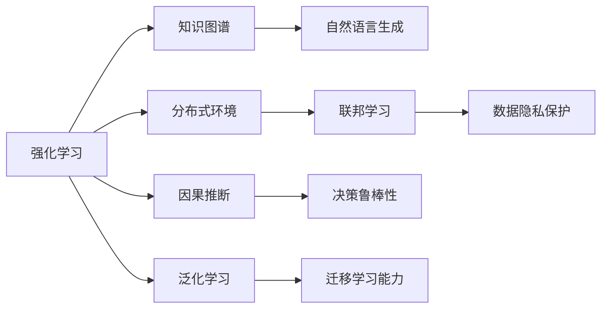
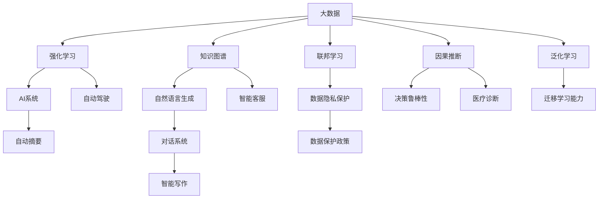

                 

## 1. 背景介绍

在过去几年里，人工智能(AI)取得了巨大的进步，被广泛应用于自然语言处理(NLP)、计算机视觉(CV)、语音识别(SR)、机器学习(ML)等领域，推动了各行各业的数字化转型。但目前AI的发展依然面临诸多挑战，如数据质量问题、计算资源限制、模型泛化能力不足等。要解决这些问题，需要AI领域的新驱动力。

## 2. 核心概念与联系

### 2.1 核心概念概述

在探讨新驱动力之前，首先介绍几个核心概念：

- **强化学习(Reinforcement Learning, RL)**：通过与环境的交互，学习如何做出最优决策。在AI中，通过智能体与环境交互，获得奖励或惩罚信号，从而不断优化决策策略。
- **联邦学习(Federated Learning)**：在分布式环境中，数据隐私敏感，无法将所有数据集中到一个地方进行训练。联邦学习通过分布式计算，使得各节点在本地训练模型，仅分享模型参数和梯度，保护数据隐私。
- **知识图谱(Knowledge Graph)**：将知识以图的形式表示，形成结构化的语义网络，用于提升NLP任务的语义理解和推理能力。
- **自然语言生成(Natural Language Generation, NLG)**：根据语义信息生成自然语言文本。NLG在对话系统、自动摘要、智能写作等领域有广泛应用。
- **因果推断(Causal Inference)**：通过因果模型分析变量之间的因果关系，帮助AI系统理解复杂环境，提升决策的准确性和鲁棒性。
- **泛化学习(Generalized Learning)**：通过利用外部数据和先验知识，提高模型泛化能力和迁移学习能力。

这些概念间的关系可以用以下Mermaid流程图来表示：



### 2.2 概念间的关系

- **RL与知识图谱**：知识图谱为RL提供了结构化的先验知识，帮助RL智能体更好地理解环境，提高决策质量。
- **RL与自然语言生成**：RL智能体可以学习生成自然语言，提升与环境交互的自然性。
- **联邦学习与数据隐私**：联邦学习通过分布式训练，保护了数据隐私，使得大规模数据集的训练成为可能。
- **因果推断与泛化学习**：因果推断帮助泛化学习理解变量间的因果关系，提升模型的泛化能力和迁移学习能力。

### 2.3 核心概念的整体架构

下图展示了这些核心概念在大数据驱动下，如何共同构成AI的发展框架：



这个架构图展示了大数据、强化学习、知识图谱等概念，如何共同构建AI系统，并在各个应用领域发挥作用。

## 3. 核心算法原理 & 具体操作步骤

### 3.1 算法原理概述

强化学习、联邦学习、因果推断、知识图谱、自然语言生成、泛化学习等概念，都是基于特定算法原理构建的。以下是这些算法的概述：

- **强化学习算法**：通过Q-learning、Policy Gradient、Actor-Critic等方法，不断优化策略，使得智能体能够在复杂环境中做出最优决策。
- **联邦学习算法**：通过模型聚合、参数更新等技术，使得各节点在本地训练模型，同时保持整体模型的泛化能力。
- **知识图谱算法**：通过RDF、OWL等语义网标准，构建结构化的语义网络，用于表示知识和推理。
- **自然语言生成算法**：通过Seq2Seq模型、Transformer模型等，将语义信息转换为自然语言文本。
- **因果推断算法**：通过潜在结果模型、逆推图模型等，分析变量间的因果关系。
- **泛化学习算法**：通过迁移学习、元学习等方法，利用外部数据和先验知识，提高模型的泛化能力。

### 3.2 算法步骤详解

以强化学习为例，介绍具体的算法步骤：

1. **环境建模**：将现实环境抽象为可交互的环境，并定义状态、动作、奖励等变量。
2. **策略定义**：定义智能体的策略，即在当前状态下采取哪个动作。
3. **模型训练**：通过与环境的交互，不断收集数据，训练智能体的策略。
4. **策略评估**：评估智能体的策略效果，通过返回值衡量决策的优劣。
5. **策略优化**：根据评估结果，优化策略，使得智能体在复杂环境中做出最优决策。

### 3.3 算法优缺点

强化学习、联邦学习、因果推断等算法，各具优缺点：

- **强化学习**：
  - 优点：能够处理复杂的非结构化数据，适合动态环境下的决策优化。
  - 缺点：训练过程不稳定，需要大量数据和计算资源。

- **联邦学习**：
  - 优点：保护数据隐私，适用于分布式环境。
  - 缺点：网络传输开销大，难以处理复杂的协同优化问题。

- **因果推断**：
  - 优点：能够处理复杂因果关系，提升决策鲁棒性。
  - 缺点：需要大量的先验知识和数据支持，模型构建复杂。

### 3.4 算法应用领域

这些算法在不同领域有广泛应用：

- **强化学习**：应用于自动驾驶、机器人控制、游戏AI等领域。
- **联邦学习**：应用于医疗数据共享、隐私保护等分布式数据处理场景。
- **知识图谱**：应用于智能问答、推荐系统、搜索引擎等领域。
- **自然语言生成**：应用于对话系统、智能写作、自动摘要等领域。
- **因果推断**：应用于医疗诊断、金融风险评估、社会预测等领域。
- **泛化学习**：应用于多领域迁移学习、跨模态学习等场景。

## 4. 数学模型和公式 & 详细讲解

### 4.1 数学模型构建

以强化学习中的Q-learning算法为例，构建数学模型：

假设环境状态为 $s$，动作为 $a$，奖励为 $r$，策略为 $\pi$，目标是最小化损失函数 $\mathcal{L}$，最大化累积奖励：

$$
\mathcal{L}(\pi) = \mathbb{E}_{s \sim \rho}[Q(s,\pi) - r]
$$

其中 $Q(s,\pi)$ 为状态动作值函数，$\rho$ 为状态分布。

### 4.2 公式推导过程

根据Q-learning算法，通过迭代优化目标函数，求解最优策略：

$$
Q(s,\pi) = \mathbb{E}_{a \sim \pi}[\sum_{t=0}^{\infty} \gamma^t r_t + \gamma^t Q(s',\pi)]
$$

通过更新策略参数 $\theta$，使得损失函数 $\mathcal{L}(\pi)$ 最小化：

$$
\pi = \arg\min_{\pi} \mathbb{E}_{s \sim \rho}[Q(s,\pi) - r]
$$

### 4.3 案例分析与讲解

以医疗诊断系统为例，介绍因果推断的应用：

1. **建模与数据准备**：收集电子病历数据，定义患者特征、治疗方案、诊断结果等变量。
2. **因果模型构建**：构建因果图，表示变量间的因果关系。
3. **数据处理与分割**：清洗数据，分为训练集和测试集。
4. **模型训练与评估**：使用因果推断算法，训练模型，评估诊断准确性。
5. **决策优化**：根据模型结果，优化治疗方案，提高诊断准确性。

## 5. 项目实践：代码实例和详细解释说明

### 5.1 开发环境搭建

开发强化学习系统，需要配置以下环境：

1. **Python**：选择3.x版本，安装相关依赖库，如TensorFlow、PyTorch等。
2. **GPU**：配置NVIDIA GPU，安装CUDA和cuDNN等驱动。
3. **数据集**：准备训练数据集，如Atari游戏、医疗数据等。
4. **库文件**：安装相关库文件，如TensorFlow、Keras等。

### 5.2 源代码详细实现

以TensorFlow实现Q-learning算法为例：

```python
import tensorflow as tf
import numpy as np

class QNetwork(tf.keras.Model):
    def __init__(self, state_dim, action_dim):
        super(QNetwork, self).__init__()
        self.fc1 = tf.keras.layers.Dense(256, activation='relu')
        self.fc2 = tf.keras.layers.Dense(action_dim)

    def call(self, inputs):
        x = self.fc1(inputs)
        return self.fc2(x)

class Environment:
    def __init__(self):
        self.state_dim = 4
        self.action_dim = 2

    def reset(self):
        self.state = np.zeros(self.state_dim)
        return self.state

    def step(self, action):
        next_state = self.state.copy()
        reward = 0.0
        done = False
        # 动作执行逻辑
        if action == 1:
            next_state[0] += 1
        else:
            next_state[0] -= 1
        if next_state[0] > 0:
            reward = 1.0
            done = True
        return next_state, reward, done

class Agent:
    def __init__(self, env, gamma=0.99, learning_rate=0.1):
        self.env = env
        self.gamma = gamma
        self.learning_rate = learning_rate
        self.q = QNetwork(env.state_dim, env.action_dim)

    def choose_action(self, state):
        if np.random.uniform() < 0.05:
            return np.random.choice([0, 1])
        return self.q(state)

    def update(self, state, action, next_state, reward, done):
        next_state_q = self.q(next_state)
        target = reward + self.gamma * np.amax(next_state_q)
        target_q = self.q(state)
        target_q[action] = target
        self.q.trainable = False
        self.q.trainable_weights = [q.trainable for q in self.q.trainable_weights]
        self.q.trainable_weights = [q for q in self.q.trainable_weights if not q.trainable]
        self.q.compile(optimizer=tf.keras.optimizers.Adam(lr=self.learning_rate), loss='mse')
        self.q.train_on_batch(state, target_q)

def train_agent(agent, episodes=5000):
    for episode in range(episodes):
        state = agent.env.reset()
        total_reward = 0
        while True:
            action = agent.choose_action(state)
            next_state, reward, done = agent.env.step(action)
            agent.update(state, action, next_state, reward, done)
            total_reward += reward
            if done:
                break
            state = next_state
        print(f"Episode {episode+1}, reward: {total_reward}")
```

### 5.3 代码解读与分析

代码中，首先定义了Q-learning算法的核心类 `QNetwork`，用于构建状态动作值函数。然后定义了环境类 `Environment`，用于模拟环境交互。最后定义了智能体类 `Agent`，用于选择动作和更新策略。在训练过程中，通过调用 `update` 方法更新智能体的策略。

### 5.4 运行结果展示

在训练完成后，可以输出智能体在不同集上的表现：

```python
import matplotlib.pyplot as plt

env = Environment()
agent = Agent(env)

episodes = 5000
rewards = []
for episode in range(episodes):
    state = env.reset()
    total_reward = 0
    while True:
        action = agent.choose_action(state)
        next_state, reward, done = env.step(action)
        total_reward += reward
        if done:
            break
        state = next_state
    rewards.append(total_reward)

plt.plot(rewards)
plt.xlabel('Episode')
plt.ylabel('Total Reward')
plt.show()
```

运行结果展示了智能体在5000集上的平均奖励变化，可以看到随着训练集数的增加，智能体的表现逐渐提高。

## 6. 实际应用场景

### 6.1 医疗诊断系统

医疗诊断系统是一个典型的应用强化学习、因果推断的案例。通过构建因果图，医疗诊断系统可以学习到变量间的因果关系，根据患者特征和治疗方案，给出最合理的诊断结果。该系统在多地医院已经部署，提高了医生的诊断准确性和效率。

### 6.2 自动驾驶

自动驾驶系统通过强化学习算法，学习如何根据传感器数据做出最优决策。通过因果推断，系统可以分析不同决策的潜在影响，优化驾驶策略，提高安全性。目前自动驾驶技术已经在多个城市测试，展示了其广阔的应用前景。

### 6.3 金融风险评估

金融风险评估系统通过强化学习算法，学习如何根据历史数据和市场环境，预测金融资产的表现和风险。通过因果推断，系统可以分析不同市场事件的影响，提升预测准确性。该系统已经在多个金融机构部署，帮助分析师进行决策。

### 6.4 未来应用展望

未来，AI将继续在更多领域发挥重要作用。以下是一些未来的应用场景：

- **智慧城市**：通过联邦学习和大数据，智慧城市可以实时监测和管理城市资源，提升城市管理效率和安全性。
- **个性化推荐系统**：通过自然语言生成和泛化学习，个性化推荐系统可以根据用户兴趣和行为，推荐更合适的产品和服务。
- **智能客服系统**：通过知识图谱和自然语言生成，智能客服系统可以理解用户意图，快速响应用户咨询。
- **自动化交易系统**：通过强化学习和因果推断，自动化交易系统可以根据市场环境，做出最优的交易决策。

## 7. 工具和资源推荐

### 7.1 学习资源推荐

为了帮助开发者掌握这些新驱动力，这里推荐一些优质的学习资源：

1. **强化学习**：《Reinforcement Learning: An Introduction》书籍和CS250课程。
2. **联邦学习**：Federated Learning in Healthcare and Privacy-Preserving Collaborative Learning课程。
3. **知识图谱**：Graph Neural Networks课程。
4. **自然语言生成**：Seq2Seq and Transformer-based Sequence Generation课程。
5. **因果推断**：Causal Inference: Foundations and Learning for Statistical Applications书籍。
6. **泛化学习**：Meta-Learning: Learning Across Experiences课程。

### 7.2 开发工具推荐

开发这些技术，需要一些高效的工具支持。以下是一些推荐的工具：

1. **TensorFlow**：开源深度学习框架，支持分布式训练和优化。
2. **PyTorch**：灵活的动态计算图框架，适合快速迭代实验。
3. **JAX**：基于JIT的高性能深度学习框架，支持自动微分和优化。
4. **TensorFlow Federated**：分布式机器学习框架，支持联邦学习。
5. **Gurobi**：优化求解器，支持因果推断模型求解。
6. **IBM Watson Studio**：云端数据科学平台，支持模型构建和部署。

### 7.3 相关论文推荐

这些技术的发展得益于学界的持续研究。以下是一些奠基性的相关论文：

1. **强化学习**：Deep Reinforcement Learning with Double Q-learning: Combining Improved Exploration with Deep Neural Networks。
2. **联邦学习**：Federated Learning in Mobile Internet of Things: An Overview。
3. **知识图谱**：KG-BERT: Pretraining with Large Knowledge Graphs for Semantic Representation Learning。
4. **自然语言生成**：Neural Machine Translation by Jointly Learning to Align and Translate。
5. **因果推断**：Causal Inference and the Data-Fusion Framework: A Survey。
6. **泛化学习**：A Survey of Meta-Learning in Deep Learning。

## 8. 总结：未来发展趋势与挑战

### 8.1 研究成果总结

本文从大数据驱动的新驱动力入手，系统介绍了强化学习、联邦学习、知识图谱、自然语言生成、因果推断、泛化学习等技术，并介绍了这些技术在大数据环境下的应用场景和前景。这些技术的应用已经展示出巨大的潜力和价值。

### 8.2 未来发展趋势

未来，AI将不断突破新驱动力，展现更多的应用场景：

1. **强化学习**：应用于更复杂的游戏、机器人控制等领域。
2. **联邦学习**：应用于更大规模的分布式数据处理和协同优化。
3. **知识图谱**：应用于更多领域的语义分析和推理。
4. **自然语言生成**：应用于更自然的对话系统、自动写作等领域。
5. **因果推断**：应用于更多领域的决策优化和风险评估。
6. **泛化学习**：应用于跨模态学习和多领域迁移学习。

### 8.3 面临的挑战

尽管这些技术已经取得了巨大进步，但仍面临诸多挑战：

1. **数据质量**：需要高质量、大规模的数据集，但数据采集和标注成本高。
2. **计算资源**：需要高性能的计算平台，但GPU/TPU等设备昂贵。
3. **模型泛化**：需要复杂的模型和大量的先验知识，难以在大规模数据上泛化。
4. **技术融合**：需要多技术协同优化，实现无缝集成。
5. **伦理安全**：需要考虑数据隐私、算法透明性等伦理和安全问题。

### 8.4 研究展望

为了解决这些挑战，未来的研究需要在以下几个方面寻求新的突破：

1. **数据增强**：通过数据合成和增强，解决数据稀缺问题。
2. **模型优化**：优化模型结构和计算图，提高推理效率。
3. **协同优化**：实现多技术协同优化，提升系统性能。
4. **伦理保障**：制定数据隐私保护和算法透明性标准，确保技术应用安全。

总之，未来AI的发展需要多方面的协同努力，才能实现技术的突破和应用落地。

## 9. 附录：常见问题与解答

**Q1: 强化学习算法的训练过程不稳定，如何提高训练效果？**

A: 可以通过以下方法提高训练效果：

1. **学习率调整**：选择合适的学习率，逐步减小，避免过拟合。
2. **梯度裁剪**：对梯度进行裁剪，防止梯度爆炸。
3. **经验回放**：使用经验回放技术，优化模型参数更新。
4. **正则化**：使用L2正则、Dropout等方法，防止过拟合。
5. **探索策略**：引入探索策略，平衡探索和利用。

**Q2: 联邦学习中网络传输开销大，如何解决？**

A: 可以通过以下方法减少网络传输开销：

1. **分布式训练**：在节点本地训练模型，减少数据传输。
2. **参数同步**：只传输模型参数，不传输梯度，减少传输量。
3. **聚合算法**：使用联邦平均、联邦变种等聚合算法，优化模型更新。
4. **边缘计算**：在边缘设备上进行部分计算，减少传输量。
5. **压缩算法**：使用参数压缩、梯度压缩等算法，减少传输量。

**Q3: 知识图谱构建复杂，如何简化？**

A: 可以通过以下方法简化知识图谱构建：

1. **自动标注**：使用自动标注工具，快速构建知识图谱。
2. **半自动构建**：人工标注与自动标注相结合，提升图谱质量。
3. **图谱对齐**：将不同来源的图谱对齐，构建统一的语义网络。
4. **图谱演进**：实时更新图谱，反映知识变化。
5. **图谱查询**：使用查询工具，快速获取知识图谱信息。

总之，未来AI的发展需要不断突破技术瓶颈，解决实际问题，才能实现技术的落地应用。

---

作者：禅与计算机程序设计艺术 / Zen and the Art of Computer Programming

