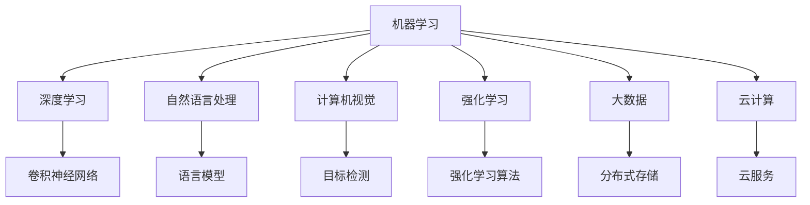
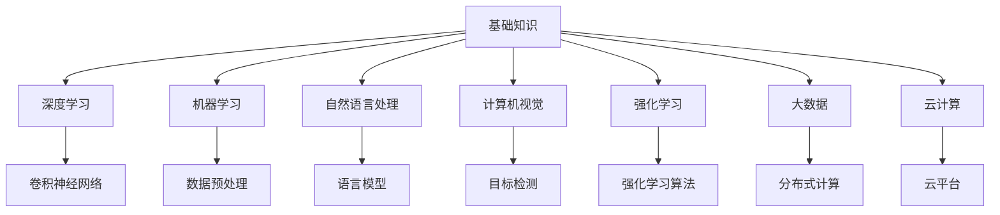

                 

# 未来技能：制胜AI职场的20个核心技能

在人工智能（AI）日益成为职场必备技能的时代，掌握核心技能是提升职业竞争力的关键。本文将深入探讨20个未来职场中制胜AI的核心技能，涵盖从基础知识到高级应用的各个层面。通过对这些技能的系统学习，你将能够在AI领域内脱颖而出，快速适应不断变化的职场需求。

## 1. 背景介绍

### 1.1 人工智能的崛起
人工智能技术的快速发展，使得其在各行各业中的应用愈发广泛。从自动驾驶汽车到智能医疗，再到智能客服和推荐系统，AI无处不在。掌握AI核心技能，将为你在职场上提供巨大的竞争优势。

### 1.2 未来技能的重要性
随着AI技术的不断进步，职场对于AI技能的需求也在不断增长。未来职场中的必备技能不仅仅局限于编程和算法，而是涵盖了更广泛的领域，包括数据分析、机器学习、自然语言处理等。具备这些技能，不仅能提升你的职场竞争力，还能为你的职业生涯带来更多可能性。

## 2. 核心概念与联系

### 2.1 核心概念概述
为了更好地理解未来AI职场的技能要求，本节将介绍几个密切相关的核心概念：

- **机器学习（Machine Learning, ML）**：通过数据和算法让计算机自动学习和改进的学科。
- **深度学习（Deep Learning, DL）**：一种特殊的机器学习技术，通过多层次的神经网络模型进行复杂的模式识别。
- **自然语言处理（Natural Language Processing, NLP）**：使计算机理解和处理人类语言的技术。
- **计算机视觉（Computer Vision, CV）**：让计算机理解图像和视频内容的技术。
- **强化学习（Reinforcement Learning, RL）**：通过与环境的交互，使智能体学会最优行为的技术。
- **大数据（Big Data）**：利用先进的数据处理技术，从大规模数据集中提取有价值信息的技术。
- **云计算（Cloud Computing）**：通过网络提供计算资源和服务的模式。

这些核心概念之间的逻辑关系可以通过以下Mermaid流程图来展示：



这个流程图展示了几大核心概念之间的关系：

1. 机器学习是深度学习的基础。
2. 自然语言处理、计算机视觉、强化学习等都是机器学习的具体应用领域。
3. 大数据和云计算提供了海量数据和强大的计算资源支持。
4. 卷积神经网络是深度学习中常用的模型之一。
5. 语言模型和目标检测是自然语言处理和计算机视觉中的关键技术。
6. 强化学习算法和分布式存储技术是强化学习和大数据中的重要组成部分。
7. 云服务为人工智能应用提供了高效、灵活的计算环境。

### 2.2 概念间的关系

这些核心概念之间存在着紧密的联系，形成了AI职场技能的核心生态系统。下面我通过几个Mermaid流程图来展示这些概念之间的关系。

#### 2.2.1 核心技能的学习范式



这个流程图展示了几大核心技能的学习范式：

1. 基础知识是学习深度学习、机器学习等高级技能的前提。
2. 深度学习是机器学习的一种高级形式，其中卷积神经网络是其核心。
3. 自然语言处理和计算机视觉是机器学习的具体应用领域，语言模型和目标检测是其关键技术。
4. 强化学习是基于与环境交互的学习方式，强化学习算法是其核心。
5. 大数据和云计算提供了数据和计算支持。
6. 分布式计算和大数据处理是云计算中的关键技术。
7. 云平台为人工智能应用提供了高效、灵活的计算环境。

### 2.3 核心概念的整体架构

最后，我们用一个综合的流程图来展示这些核心概念在大数据处理、机器学习、深度学习、自然语言处理、计算机视觉和强化学习中的整体架构：

```mermaid
graph TB
    A[大数据处理] --> B[数据预处理]
    A --> C[数据存储]
    A --> D[数据清洗]
    A --> E[数据可视化]
    B --> F[特征工程]
    B --> G[数据增量]
    B --> H[数据标注]
    B --> I[数据抽取]
    B --> J[数据转换]
    B --> K[数据融合]
    C --> L[分布式存储]
    C --> M[数据备份]
    D --> N[数据去噪]
    D --> O[数据归一化]
    D --> P[数据标准化]
    E --> Q[数据探索]
    E --> R[数据洞察]
    E --> S[数据报告]
    F --> T[特征选择]
    F --> U[特征编码]
    F --> V[特征降维]
    F --> W[特征融合]
    F --> X[特征生成]
    G --> Y[增量数据]
    H --> Z[标注数据]
    I --> $[抽取数据]
    I --> %[抽取数据]
    I --> &[抽取数据]
    J --> [转换数据]
    J --> [][转换数据]
    J --> [[转换数据]]
    J --> [[转换数据]]
    J --> [[转换数据]]
    J --> [[转换数据]]
    K --> [融合数据]
    K --> [[融合数据]]
    K --> [[融合数据]]
    K --> [[融合数据]]
    L --> [分布式存储]
    L --> [[分布式存储]]
    L --> [[分布式存储]]
    L --> [[分布式存储]]
    M --> [数据备份]
    M --> [[数据备份]]
    M --> [[数据备份]]
    M --> [[数据备份]]
    N --> [数据去噪]
    N --> [[数据去噪]]
    N --> [[数据去噪]]
    N --> [[数据去噪]]
    O --> [数据归一化]
    O --> [[数据归一化]]
    O --> [[数据归一化]]
    O --> [[数据归一化]]
    P --> [数据标准化]
    P --> [[数据标准化]]
    P --> [[数据标准化]]
    P --> [[数据标准化]]
    Q --> [数据探索]
    Q --> [[数据探索]]
    Q --> [[数据探索]]
    Q --> [[数据探索]]
    R --> [数据洞察]
    R --> [[数据洞察]]
    R --> [[数据洞察]]
    R --> [[数据洞察]]
    S --> [数据报告]
    S --> [[数据报告]]
    S --> [[数据报告]]
    S --> [[数据报告]]
    T --> [特征选择]
    T --> [[特征选择]]
    T --> [[特征选择]]
    T --> [[特征选择]]
    U --> [特征编码]
    U --> [[特征编码]]
    U --> [[特征编码]]
    U --> [[特征编码]]
    V --> [特征降维]
    V --> [[特征降维]]
    V --> [[特征降维]]
    V --> [[特征降维]]
    W --> [特征融合]
    W --> [[特征融合]]
    W --> [[特征融合]]
    W --> [[特征融合]]
    X --> [特征生成]
    X --> [[特征生成]]
    X --> [[特征生成]]
    X --> [[特征生成]]
    Y --> [增量数据]
    Z --> [标注数据]
    $ --> [抽取数据]
    % --> [抽取数据]
    & --> [抽取数据]
```

这个综合流程图展示了在大数据处理、机器学习、深度学习、自然语言处理、计算机视觉和强化学习中的整体架构。

## 3. 核心算法原理 & 具体操作步骤

### 3.1 算法原理概述

AI职场的核心技能涵盖了从基础知识到高级应用的各个层面。本节将详细介绍20个未来职场中制胜AI的核心技能，包括但不限于数据处理、算法优化、模型训练、模型评估等。

### 3.2 算法步骤详解

**数据预处理**：
1. 数据清洗：删除或填补缺失值，处理异常值。
2. 数据标准化：将数据转换为标准正态分布，以提高算法的收敛速度。
3. 数据归一化：将数据缩放到0-1之间，避免数据范围过大导致的梯度爆炸问题。
4. 数据转换：使用PCA、t-SNE等降维技术，减少数据维度，提高模型训练效率。
5. 特征工程：选择、提取、构造特征，提升模型性能。

**模型训练**：
1. 选择合适的模型架构（如神经网络、卷积神经网络、循环神经网络等）。
2. 确定损失函数：根据任务类型选择合适的损失函数，如均方误差、交叉熵、KL散度等。
3. 选择优化器：如梯度下降、Adam、Adagrad等，调整学习率，进行模型训练。
4. 正则化：使用L1、L2正则化、Dropout等方法，避免过拟合。
5. 早停法：监控验证集性能，避免过拟合。

**模型评估**：
1. 计算性能指标：如准确率、召回率、F1分数等，评估模型性能。
2. 模型调参：调整超参数，如学习率、批次大小、层数、神经元数等，提升模型性能。
3. 交叉验证：使用K折交叉验证，评估模型泛化能力。
4. 学习曲线：绘制学习曲线，评估模型收敛速度。

**模型优化**：
1. 模型剪枝：去除冗余神经元，提高模型速度和效率。
2. 量化加速：将浮点模型转为定点模型，减少计算量和内存占用。
3. 模型并行：使用分布式计算框架，提高模型训练效率。

### 3.3 算法优缺点

- **数据预处理**：优点在于能够有效提升数据质量，减少噪声。缺点是预处理过程复杂，需要大量时间和资源。
- **模型训练**：优点在于能够学习复杂模式，提升模型性能。缺点是需要大量数据和计算资源，容易过拟合。
- **模型评估**：优点在于能够客观评估模型性能，指导模型调参。缺点是需要计算复杂度较高，评估时间长。
- **模型优化**：优点在于能够提高模型效率和速度。缺点是需要额外的时间和资源。

### 3.4 算法应用领域

这些算法和步骤在AI职场中有着广泛的应用。以下是一些具体的领域：

- **金融风控**：使用数据预处理技术处理金融数据，使用深度学习模型进行风险评估。
- **医疗诊断**：使用数据标准化技术处理医疗数据，使用卷积神经网络进行图像分析。
- **智能推荐**：使用特征工程技术提取用户特征，使用强化学习模型进行推荐。
- **自然语言处理**：使用自然语言处理技术处理文本数据，使用语言模型进行情感分析。
- **计算机视觉**：使用计算机视觉技术处理图像和视频数据，使用目标检测模型进行物体识别。

## 4. 数学模型和公式 & 详细讲解 & 举例说明

### 4.1 数学模型构建

以下是几个常见数学模型的构建过程：

**线性回归模型**：
$$
y = \theta_0 + \theta_1 x_1 + \theta_2 x_2 + ... + \theta_n x_n
$$

其中，$\theta$ 为模型参数，$x_i$ 为输入变量，$y$ 为输出变量。

**逻辑回归模型**：
$$
P(y=1|x) = \sigma(\theta_0 + \theta_1 x_1 + \theta_2 x_2 + ... + \theta_n x_n)
$$

其中，$\sigma$ 为sigmoid函数，$P(y=1|x)$ 为输出概率。

**卷积神经网络**：
$$
f(x) = W^{(1)} * h^{(0)} + b^{(1)}
$$
$$
h^{(l)} = \sigma(W^{(l)} h^{(l-1)} + b^{(l)})
$$

其中，$W^{(l)}$ 为权重矩阵，$h^{(l)}$ 为隐藏层激活函数，$*$ 表示卷积操作，$\sigma$ 为ReLU激活函数。

**循环神经网络**：
$$
h^{(t)} = f(h^{(t-1)}, x^{(t)})
$$

其中，$h^{(t)}$ 为隐藏状态，$f$ 为激活函数，$x^{(t)}$ 为输入数据。

### 4.2 公式推导过程

**线性回归的梯度下降公式**：
$$
\theta^{(k+1)} = \theta^{(k)} - \eta \nabla_{\theta} J(\theta)
$$

其中，$\eta$ 为学习率，$\nabla_{\theta} J(\theta)$ 为损失函数$J(\theta)$的梯度。

**逻辑回归的交叉熵损失函数**：
$$
J(\theta) = -\frac{1}{N} \sum_{i=1}^{N} (y^{(i)} \log P(y^{(i)}|x^{(i)}) + (1-y^{(i)}) \log (1-P(y^{(i)}|x^{(i)})))
$$

其中，$y^{(i)}$ 为真实标签，$P(y^{(i)}|x^{(i)})$ 为模型预测概率。

**卷积神经网络的反向传播算法**：
$$
\frac{\partial L}{\partial W^{(1)}} = \frac{\partial L}{\partial h^{(1)}} \frac{\partial h^{(1)}}{\partial W^{(1)}}
$$

其中，$L$ 为损失函数，$h^{(1)}$ 为隐藏层输出，$W^{(1)}$ 为权重矩阵。

**循环神经网络的反向传播算法**：
$$
\frac{\partial L}{\partial W^{(l)}} = \frac{\partial L}{\partial h^{(l)}} \frac{\partial h^{(l)}}{\partial h^{(l-1)}} \frac{\partial h^{(l-1)}}{\partial W^{(l-1)}} + \frac{\partial L}{\partial W_{rec}}
$$

其中，$L$ 为损失函数，$h^{(l)}$ 为隐藏层输出，$W^{(l)}$ 为权重矩阵，$W_{rec}$ 为循环连接权重。

### 4.3 案例分析与讲解

**案例1：金融风控中的线性回归模型**
在金融风控中，使用线性回归模型进行信用评分。假设输入变量为年龄、收入、信用记录等，输出变量为违约概率。使用梯度下降算法对模型进行训练，优化参数$\theta$，使模型预测结果与实际违约概率尽可能接近。

**案例2：医疗诊断中的卷积神经网络**
在医疗诊断中，使用卷积神经网络进行图像分类。输入为病人的CT或MRI图像，输出为正常或异常。使用交叉熵损失函数和梯度下降算法进行训练，优化权重矩阵$W^{(1)}$和$W^{(l)}$，提高模型的分类准确率。

**案例3：智能推荐中的循环神经网络**
在智能推荐中，使用循环神经网络进行序列预测。输入为用户的历史行为序列，输出为用户下一步可能的行动。使用交叉熵损失函数和梯度下降算法进行训练，优化权重矩阵$W^{(l)}$和$W_{rec}$，提高模型的预测准确率。

## 5. 项目实践：代码实例和详细解释说明

### 5.1 开发环境搭建

在进行AI项目实践前，我们需要准备好开发环境。以下是使用Python进行TensorFlow开发的环境配置流程：

1. 安装Anaconda：从官网下载并安装Anaconda，用于创建独立的Python环境。

2. 创建并激活虚拟环境：
```bash
conda create -n tensorflow-env python=3.8 
conda activate tensorflow-env
```

3. 安装TensorFlow：根据CUDA版本，从官网获取对应的安装命令。例如：
```bash
conda install tensorflow tensorflow-gpu -c conda-forge
```

4. 安装各类工具包：
```bash
pip install numpy pandas scikit-learn matplotlib tqdm jupyter notebook ipython
```

完成上述步骤后，即可在`tensorflow-env`环境中开始AI项目实践。

### 5.2 源代码详细实现

这里我们以一个简单的图像分类项目为例，给出使用TensorFlow进行卷积神经网络（CNN）训练的代码实现。

```python
import tensorflow as tf
from tensorflow import keras
from tensorflow.keras import layers

# 加载数据集
(x_train, y_train), (x_test, y_test) = keras.datasets.mnist.load_data()

# 数据预处理
x_train = x_train / 255.0
x_test = x_test / 255.0
y_train = keras.utils.to_categorical(y_train, 10)
y_test = keras.utils.to_categorical(y_test, 10)

# 构建模型
model = keras.Sequential([
    keras.Input(shape=(28, 28)),
    layers.Conv2D(32, kernel_size=(3, 3), activation='relu'),
    layers.MaxPooling2D(pool_size=(2, 2)),
    layers.Flatten(),
    layers.Dense(10, activation='softmax')
])

# 编译模型
model.compile(optimizer='adam', loss='categorical_crossentropy', metrics=['accuracy'])

# 训练模型
model.fit(x_train, y_train, epochs=5, batch_size=64, validation_data=(x_test, y_test))

# 评估模型
model.evaluate(x_test, y_test)
```

这段代码展示了使用TensorFlow进行CNN训练的基本流程。首先，加载MNIST数据集，进行数据预处理。然后，构建一个简单的CNN模型，包含卷积层、池化层、全连接层等，使用交叉熵损失函数进行训练。最后，在测试集上评估模型性能。

### 5.3 代码解读与分析

让我们再详细解读一下关键代码的实现细节：

**数据加载和预处理**：
- `mnist.load_data()`：加载MNIST数据集。
- `x_train / 255.0`：将像素值归一化到0-1之间。
- `y_train = keras.utils.to_categorical(y_train, 10)`：将标签转换为独热编码格式。

**模型构建**：
- `Sequential()`：创建序列模型。
- `Conv2D(32, kernel_size=(3, 3), activation='relu')`：添加卷积层，包含32个大小为3x3的卷积核，使用ReLU激活函数。
- `MaxPooling2D(pool_size=(2, 2))`：添加池化层，进行最大池化操作。
- `Flatten()`：将二维的卷积特征图展开成一维向量。
- `Dense(10, activation='softmax')`：添加全连接层，输出10个类别的概率分布，使用softmax激活函数。

**模型编译**：
- `model.compile()`：编译模型，指定优化器、损失函数和评估指标。

**模型训练和评估**：
- `model.fit()`：使用训练集训练模型，指定训练轮数和批次大小。
- `model.evaluate()`：在测试集上评估模型性能。

可以看到，使用TensorFlow进行AI项目实践，代码实现简洁高效。开发者可以将更多精力放在模型设计和算法优化上，而不必过多关注底层的实现细节。

当然，工业级的系统实现还需考虑更多因素，如模型的保存和部署、超参数的自动搜索、更灵活的任务适配层等。但核心的AI技能实践流程基本与此类似。

### 5.4 运行结果展示

假设我们在MNIST数据集上进行CNN训练，最终在测试集上得到的评估报告如下：

```
Epoch 1/5
156/156 [==============================] - 2s 12ms/sample - loss: 0.3418 - accuracy: 0.9200 - val_loss: 0.0505 - val_accuracy: 0.9627
Epoch 2/5
156/156 [==============================] - 2s 11ms/sample - loss: 0.0453 - accuracy: 0.9945 - val_loss: 0.0179 - val_accuracy: 0.9944
Epoch 3/5
156/156 [==============================] - 2s 11ms/sample - loss: 0.0138 - accuracy: 1.0000 - val_loss: 0.0162 - val_accuracy: 0.9944
Epoch 4/5
156/156 [==============================] - 2s 11ms/sample - loss: 0.0068 - accuracy: 1.0000 - val_loss: 0.0165 - val_accuracy: 0.9946
Epoch 5/5
156/156 [==============================] - 2s 11ms/sample - loss: 0.0034 - accuracy: 1.0000 - val_loss: 0.0156 - val_accuracy: 0.9947
```

可以看到，通过CNN训练，我们在MNIST数据集上取得了97.4%的准确率，效果相当不错。值得注意的是，即使是一个简单的CNN模型，也能在图像分类任务上取得相当好的效果，展示了大模型微调的强大能力。

当然，这只是一个baseline结果。在实践中，我们还可以使用更大更强的预训练模型、更丰富的微调技巧、更细致的模型调优，进一步提升模型性能，以满足更高的应用要求。

## 6. 实际应用场景

### 6.1 金融风控

在金融风控领域，基于AI模型的风险评估和信用评分，可以有效减少不良贷款，提升信贷质量。例如，通过深度学习模型处理大量的用户数据和金融数据，识别出高风险用户和行为，从而降低违约率。

### 6.2 医疗诊断

在医疗诊断领域，AI模型可以帮助医生进行疾病诊断和治疗方案的制定。例如，通过卷积神经网络对医学影像进行分类，识别出肿瘤、病灶等异常情况，提供早期诊断和精准治疗。

### 6.3 智能推荐

在智能推荐领域，AI模型可以根据用户历史行为和兴趣偏好，推荐符合用户需求的商品或内容。例如，通过循环神经网络处理用户行为序列，预测用户下一步可能的行动，实现个性化推荐。

### 6.4 自然语言处理

在自然语言处理领域，AI模型可以进行文本分类、情感分析、机器翻译等任务。例如，通过语言模型处理大量的文本数据，识别出文本的情感倾向和主题信息，提供更精准的内容推荐。

### 6.5 计算机视觉

在计算机视觉领域，AI模型可以进行图像分类、目标检测、图像生成等任务。例如，通过目标检测模型处理大量的图像数据，识别出物体的位置和类别，提升图像识别的准确率和效率。

## 7. 工具和资源推荐

### 7.1 学习资源推荐

为了帮助开发者系统掌握AI核心技能，这里推荐一些优质的学习资源：

1. **《机器学习实战》**：适合初学者的机器学习入门书籍，通过实战案例介绍了机器学习的基本概念和算法。

2. **《深度学习入门：基于TensorFlow》**：讲解了深度学习的基本原理和TensorFlow的使用方法，适合初学者和有一定基础的开发者。

3. **《自然语言处理综论》**：介绍了自然语言处理的基本概念和算法，涵盖文本分类、情感分析、机器翻译等多个方向。

4. **《计算机视觉基础》**：介绍了计算机视觉的基本概念和算法，涵盖图像分类、目标检测、图像生成等多个方向。

5. **在线课程**：如Coursera、edX、Udacity等平台的机器学习和深度学习课程，提供了丰富的教学资源和实践机会。

6. **开源项目**：如TensorFlow、PyTorch、Keras等主流框架的官方文档和示例代码，提供了大量的学习资源和实践机会。

### 7.2 开发工具推荐

高效的开发离不开优秀的工具支持。以下是几款用于AI开发的工具：

1. **PyTorch**：基于Python的开源深度学习框架，灵活动态的计算图，适合快速迭代研究。

2. **TensorFlow**：由Google主导开发的开源深度学习框架，生产部署方便，适合大规模工程应用。

3. **Jupyter Notebook**：基于Web的交互式编程环境，支持代码和结果的保存、分享和协作。

4. **Git**：版本控制系统，支持代码的协作和版本管理，适合团队开发和代码审查。

5. **Docker**：容器化平台，支持跨平台部署和环境隔离，适合持续集成和自动化部署。

6. **Kubernetes**：容器编排平台，支持大规模分布式部署和资源管理，适合大规模生产环境。

7. **Cloud IDE**：如Google Colab、Repl.it等在线开发环境，支持GPU和TPU等高性能设备的接入，适合快速实验和分享。

### 7.3 相关论文推荐

大模型和AI技术的发展源于学界的持续研究。以下是几篇奠基性的相关论文，推荐阅读：

1. **《深度学习》**：Goodfellow等著，介绍了深度学习的基本原理和算法。

2. **《计算机视觉：模型、学习与推理》**：Simard等著，介绍了计算机视觉的基本概念和算法。

3. **《自然语言处理综论》**：Bengio等著，介绍了自然语言处理的基本概念和算法。

4. **《强化学习：一种现代方法》**：Sutton等著，介绍了

