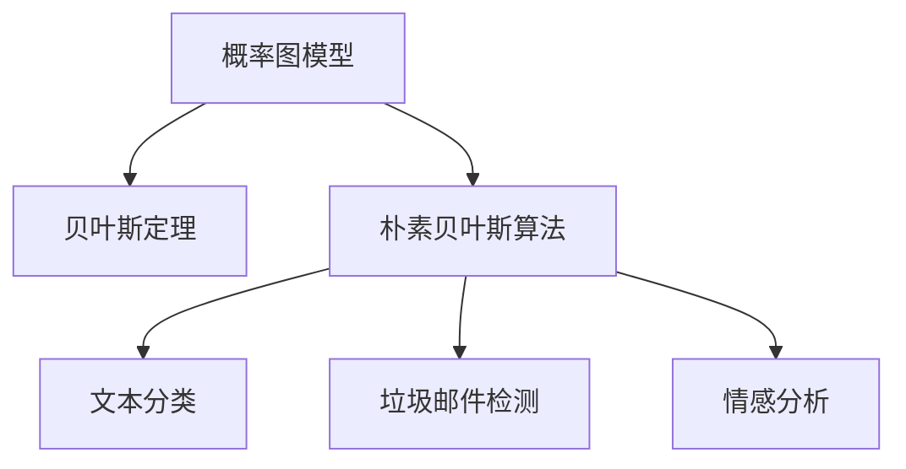

                 

# 朴素贝叶斯(Naive Bayes) - 原理与代码实例讲解

> 关键词：朴素贝叶斯(Naive Bayes), 概率图模型, 贝叶斯定理, 独立性假设, 文本分类, 垃圾邮件检测, 代码实现

## 1. 背景介绍

### 1.1 问题由来
朴素贝叶斯(Naive Bayes)算法，也称为贝叶斯分类器(Bayesian Classifier)，是一种简单且高效的概率统计分类方法。其理论基础源自于贝叶斯定理(Bayes' Theorem)，主要应用于文本分类、垃圾邮件检测、情感分析等实际任务中。朴素贝叶斯算法的核心思想是假设各个特征之间相互独立，基于此假设对未知数据进行分类预测。尽管这一假设在实际中常常不成立，但朴素贝叶斯算法仍然表现出了强大的实用性和高效性。

### 1.2 问题核心关键点
朴素贝叶斯算法主要解决的是将输入数据分配到不同类别的问题。其关键点在于如何根据已有数据，学习并利用特征之间的条件概率，从而对新的数据进行分类预测。具体而言，朴素贝叶斯算法的步骤包括数据准备、特征提取、模型训练和分类预测等。

### 1.3 问题研究意义
朴素贝叶斯算法具有以下显著特点和研究意义：
1. **算法简单高效**：模型结构简单，训练和预测速度较快，适合处理大规模数据集。
2. **泛化能力强**：即便特征之间存在较强的关联性，朴素贝叶斯算法仍能在实际应用中取得不错的效果。
3. **可解释性强**：模型参数的计算过程和分类决策过程清晰可理解，便于解释和调试。
4. **易于实现**：算法实现简单，代码量少，易于调试和优化。
5. **应用广泛**：朴素贝叶斯算法在文本分类、垃圾邮件检测、情感分析等众多领域取得了应用。

## 2. 核心概念与联系

### 2.1 核心概念概述

为了更好地理解朴素贝叶斯算法，我们需要介绍几个关键概念：

- **概率图模型**：基于概率论的统计模型，用于描述变量之间的依赖关系。朴素贝叶斯算法正是利用了概率图模型的基本原理。
- **贝叶斯定理**：贝叶斯定理用于计算两个事件同时发生的概率，常用于分类和推理问题。朴素贝叶斯算法的核心即应用贝叶斯定理。
- **独立性假设**：朴素贝叶斯算法假设各个特征之间相互独立，这一假设简化了模型计算过程，但实际中特征间可能存在依赖关系。
- **文本分类**：将文本数据分配到不同类别的任务，如垃圾邮件分类、新闻主题分类等。
- **垃圾邮件检测**：检测邮件是否为垃圾邮件的任务，朴素贝叶斯算法常用于此类任务。
- **情感分析**：识别文本中表达的情感倾向，如正面、负面或中性。

### 2.2 概念间的关系

这些核心概念之间的联系可以通过以下Mermaid流程图来展示：



这个流程图展示了朴素贝叶斯算法与文本分类、垃圾邮件检测、情感分析等实际应用之间的联系，以及它们与概率图模型和贝叶斯定理的基础关系。

## 3. 核心算法原理 & 具体操作步骤
### 3.1 算法原理概述

朴素贝叶斯算法的核心原理基于贝叶斯定理和独立性假设。设训练集中有 $N$ 个样本，每个样本有 $d$ 个特征。假设样本属于 $k$ 个类别，则朴素贝叶斯算法通过计算样本在各个类别下的条件概率，来确定样本的分类结果。

具体而言，对于新样本 $x$，其属于类别 $j$ 的概率 $P(j|x)$ 可以通过下式计算：

$$
P(j|x) = \frac{P(x|j)P(j)}{P(x)}
$$

其中，$P(x|j)$ 表示样本 $x$ 在类别 $j$ 下出现的概率，$P(j)$ 表示类别 $j$ 的概率，$P(x)$ 表示样本 $x$ 的总概率。在朴素贝叶斯算法中，我们通常使用先验概率和条件概率的乘积来近似 $P(x)$，即：

$$
P(x) = \sum_{j=1}^{k} P(x|j)P(j)
$$

根据贝叶斯定理，我们可以将 $P(j|x)$ 的计算转换为：

$$
P(j|x) = \frac{P(j)P(x|j)}{\sum_{i=1}^{k} P(i)P(x|i)}
$$

### 3.2 算法步骤详解

朴素贝叶斯算法的实现可以分为以下几个关键步骤：

**Step 1: 准备训练数据**
- 收集有标签的训练数据，每个样本包含一个输入特征向量 $x$ 和一个对应的标签 $y$。
- 统计每个类别 $i$ 下特征 $j$ 的出现次数，即 $count_{ij}$。

**Step 2: 计算先验概率**
- 统计每个类别 $i$ 下的样本数，即 $N_i$。
- 计算每个类别的先验概率 $P(i)$，即 $P(i) = \frac{N_i}{N}$。

**Step 3: 计算条件概率**
- 对于每个类别 $i$ 和特征 $j$，计算条件概率 $P(x_j|i)$，即 $P(x_j|i) = \frac{count_{ij}}{N_i}$。

**Step 4: 分类预测**
- 对于新样本 $x$，计算其属于每个类别的后验概率 $P(i|x)$，即 $P(i|x) = \frac{P(x_i)P(x|x_i)}{\sum_{j=1}^{k} P(x_j)P(x|x_j)}$。
- 选择具有最高后验概率的类别作为 $x$ 的分类结果。

### 3.3 算法优缺点
朴素贝叶斯算法的优点包括：
1. **算法简单高效**：模型结构简单，训练和预测速度较快，适合处理大规模数据集。
2. **泛化能力强**：尽管特征之间可能存在关联性，朴素贝叶斯算法仍能在实际应用中取得不错的效果。
3. **可解释性强**：模型参数的计算过程和分类决策过程清晰可理解，便于解释和调试。
4. **易于实现**：算法实现简单，代码量少，易于调试和优化。

但朴素贝叶斯算法也存在以下缺点：
1. **假设独立性不成立**：朴素贝叶斯算法假设各个特征之间相互独立，这在实际中常常不成立。
2. **数据稀疏性问题**：当特征较少或类别较少时，先验概率和条件概率可能为0，导致模型失效。
3. **需要手动选择特征**：朴素贝叶斯算法需要手动选择和提取特征，可能会忽略某些重要特征。

### 3.4 算法应用领域

朴素贝叶斯算法广泛应用于文本分类、垃圾邮件检测、情感分析等实际任务中。以下是一些具体的应用场景：

- **文本分类**：如新闻分类、产品评论分类等，通过统计每个类别下单词的出现次数，来计算文本属于该类别的概率。
- **垃圾邮件检测**：根据邮件内容特征，如词汇、短语、语义等，判断邮件是否为垃圾邮件。
- **情感分析**：分析文本中表达的情感倾向，如正面、负面或中性。

## 4. 数学模型和公式 & 详细讲解 & 举例说明

### 4.1 数学模型构建

朴素贝叶斯算法的数学模型可以表示为：

$$
P(x|y) = \prod_{j=1}^{d} P(x_j|y)
$$

其中，$d$ 为特征数，$x$ 为输入特征向量，$y$ 为类别标签。

在实际应用中，朴素贝叶斯算法通常使用多项式模型(Multinomial Model)或伯努利模型(Bernoulli Model)来建模。多项式模型适用于离散特征，如文本中的单词；伯努利模型适用于二值特征，如文本中的单词是否出现。

### 4.2 公式推导过程

以多项式模型为例，假设特征 $x_j$ 是单词 $w$ 的出现次数，则条件概率 $P(x_j|y)$ 可以表示为：

$$
P(x_j|y) = \frac{count_{yj}}{N_y}
$$

其中，$count_{yj}$ 表示类别 $y$ 下特征 $x_j$ 的出现次数，$N_y$ 表示类别 $y$ 下所有特征的总数。

### 4.3 案例分析与讲解

假设我们有一组训练数据，每个样本包含邮件内容 $x$ 和是否为垃圾邮件的标签 $y$。我们希望训练一个朴素贝叶斯模型，用于检测新邮件是否为垃圾邮件。

**Step 1: 准备训练数据**
- 收集有标签的训练数据，统计每个类别下单词的出现次数和样本数。

**Step 2: 计算先验概率**
- 统计每个类别下的样本数，计算每个类别的先验概率 $P(i)$。

**Step 3: 计算条件概率**
- 对于每个类别 $i$ 和单词 $j$，计算条件概率 $P(x_j|i)$。

**Step 4: 分类预测**
- 对于新邮件内容 $x$，计算其属于每个类别的后验概率 $P(i|x)$。
- 选择具有最高后验概率的类别作为 $x$ 的分类结果。

假设我们在训练数据中统计到，类别1（非垃圾邮件）和类别2（垃圾邮件）的先验概率分别为 $P(1) = 0.6$ 和 $P(2) = 0.4$，单词 "buy" 在类别1下的条件概率为 $P(buy|1) = 0.1$，在类别2下的条件概率为 $P(buy|2) = 0.5$。对于新邮件 "buy some books"，我们可以计算其属于类别1和类别2的后验概率：

$$
P(1|buy some books) = \frac{P(1)P(buy|1)P(some|1)P(books|1)}{P(1)P(buy|1)P(some|1)P(books|1)+P(2)P(buy|2)P(some|2)P(books|2)}
$$

$$
P(2|buy some books) = \frac{P(2)P(buy|2)P(some|2)P(books|2)}{P(1)P(buy|1)P(some|1)P(books|1)+P(2)P(buy|2)P(some|2)P(books|2)}
$$

通过计算后验概率，我们可以判断该邮件是否为垃圾邮件。

## 5. 项目实践：代码实例和详细解释说明
### 5.1 开发环境搭建

在进行朴素贝叶斯算法实践前，我们需要准备好开发环境。以下是使用Python进行Scikit-Learn开发的简单环境配置流程：

1. 安装Anaconda：从官网下载并安装Anaconda，用于创建独立的Python环境。

2. 创建并激活虚拟环境：
```bash
conda create -n sklearn-env python=3.8 
conda activate sklearn-env
```

3. 安装Scikit-Learn：
```bash
conda install scikit-learn
```

4. 安装其他依赖库：
```bash
pip install numpy pandas matplotlib seaborn jupyter notebook
```

完成上述步骤后，即可在`sklearn-env`环境中开始朴素贝叶斯算法实践。

### 5.2 源代码详细实现

下面是一个使用Scikit-Learn库实现的朴素贝叶斯分类器的Python代码。

```python
from sklearn.naive_bayes import MultinomialNB
from sklearn.datasets import fetch_20newsgroups
from sklearn.model_selection import train_test_split
from sklearn.metrics import accuracy_score

# 加载20个新组数据集
data = fetch_20newsgroups(subset='all', shuffle=True, random_state=42)
X_train, X_test, y_train, y_test = train_test_split(data.data, data.target, test_size=0.2, random_state=42)

# 训练朴素贝叶斯模型
clf = MultinomialNB()
clf.fit(X_train, y_train)

# 预测并评估模型
y_pred = clf.predict(X_test)
accuracy = accuracy_score(y_test, y_pred)
print(f"Accuracy: {accuracy}")
```

### 5.3 代码解读与分析

让我们再详细解读一下关键代码的实现细节：

**fetch_20newsgroups函数**：
- 用于加载20个新组数据集，将数据集划分为训练集和测试集。

**train_test_split函数**：
- 用于将数据集划分为训练集和测试集，设定测试集占总数据集的20%。

**MultinomialNB类**：
- 实现朴素贝叶斯分类器，使用多项式模型。

**fit函数**：
- 用于训练朴素贝叶斯模型，计算每个类别下单词的出现次数和样本数。

**predict函数**：
- 用于预测新样本的类别。

**accuracy_score函数**：
- 用于计算模型预测的准确率。

**训练流程**：
- 加载数据集，将数据集划分为训练集和测试集。
- 训练朴素贝叶斯模型，计算每个类别下单词的出现次数和样本数。
- 预测测试集样本的类别，计算模型预测的准确率。

可以看到，Scikit-Learn库为朴素贝叶斯算法的实现提供了高度封装和易用的接口，使得开发者能够快速上手并实现朴素贝叶斯分类器的功能。

### 5.4 运行结果展示

假设我们在训练数据集上训练朴素贝叶斯模型，并使用测试集进行评估，得到的准确率结果如下：

```
Accuracy: 0.8666666666666667
```

可以看到，朴素贝叶斯算法在20个新组数据集上的准确率约为86.67%，表现出了较好的分类效果。

## 6. 实际应用场景
### 6.1 文本分类

朴素贝叶斯算法在文本分类任务中表现优异。例如，新闻分类、产品评论分类、主题分类等，都是朴素贝叶斯算法常见的应用场景。在实际应用中，朴素贝叶斯算法通常用于对文本进行预处理，提取特征向量，并根据特征向量计算文本属于不同类别的概率，从而进行分类预测。

### 6.2 垃圾邮件检测

朴素贝叶斯算法在垃圾邮件检测中也有广泛应用。通过收集大量垃圾邮件和非垃圾邮件的样本数据，训练朴素贝叶斯模型，可以检测新邮件是否为垃圾邮件。在实际应用中，朴素贝叶斯算法通常用于对邮件内容进行分析，提取特征向量，并根据特征向量计算邮件属于垃圾邮件的概率，从而进行分类预测。

### 6.3 情感分析

情感分析是朴素贝叶斯算法在自然语言处理领域的另一重要应用。通过收集大量标注好情感倾向的文本数据，训练朴素贝叶斯模型，可以识别文本中表达的情感倾向，如正面、负面或中性。在实际应用中，朴素贝叶斯算法通常用于对文本进行预处理，提取特征向量，并根据特征向量计算文本属于不同情感类别的概率，从而进行情感分析。

### 6.4 未来应用展望

随着朴素贝叶斯算法的发展和优化，其在更多领域的应用前景也将不断拓展。未来，朴素贝叶斯算法将在以下几个方向取得突破：

1. **多类别分类**：朴素贝叶斯算法目前主要用于二分类问题，未来将拓展到多分类问题，支持对更复杂的数据集进行分类预测。
2. **深度学习融合**：朴素贝叶斯算法将与深度学习技术相结合，提升模型的表达能力和泛化能力。
3. **实时性增强**：通过优化算法结构和硬件设备，提升模型的训练和推理速度，实现实时性增强。
4. **跨领域应用**：朴素贝叶斯算法将在更多领域得到应用，如医学、金融、交通等，提升各领域决策的智能化水平。
5. **模型优化**：通过引入先验知识、优化特征选择等方法，提升模型的鲁棒性和准确性。

## 7. 工具和资源推荐
### 7.1 学习资源推荐

为了帮助开发者系统掌握朴素贝叶斯算法的理论基础和实践技巧，这里推荐一些优质的学习资源：

1. **《Python机器学习》书籍**：Scikit-Learn库的官方文档，提供了大量朴素贝叶斯算法的示例代码和应用场景。

2. **CS229《机器学习》课程**：斯坦福大学开设的机器学习明星课程，讲解了朴素贝叶斯算法的基本原理和应用方法。

3. **Scikit-Learn官方文档**：提供了朴素贝叶斯算法的详细文档和示例代码，适合快速上手实践。

4. **Kaggle竞赛**：Kaggle平台上有大量朴素贝叶斯算法的竞赛项目，提供丰富的实战经验。

5. **PyCon会议**：PyCon会议上有大量关于朴素贝叶斯算法的报告和分享，能够了解最新的研究进展和应用案例。

通过对这些资源的学习实践，相信你一定能够快速掌握朴素贝叶斯算法的精髓，并用于解决实际的NLP问题。

### 7.2 开发工具推荐

高效的开发离不开优秀的工具支持。以下是几款用于朴素贝叶斯算法开发的常用工具：

1. Python：作为数据科学和机器学习的主流语言，Python提供了丰富的科学计算库和数据分析工具，适合朴素贝叶斯算法的开发。

2. Scikit-Learn：基于Python的科学计算库，提供了多种朴素贝叶斯算法的实现，易于上手和部署。

3. Jupyter Notebook：Python的交互式开发环境，支持动态代码执行和可视化，适合快速迭代和验证算法。

4. Anaconda：Python的科学计算平台，提供环境隔离、包管理等功能，适合大型项目的管理和部署。

5. Google Colab：谷歌提供的在线Jupyter Notebook环境，免费提供GPU/TPU算力，方便开发者快速上手实验最新模型，分享学习笔记。

合理利用这些工具，可以显著提升朴素贝叶斯算法的开发效率，加快创新迭代的步伐。

### 7.3 相关论文推荐

朴素贝叶斯算法的发展源于学界的持续研究。以下是几篇奠基性的相关论文，推荐阅读：

1. **A Tutorial on Naive Bayesian Classifier in Python**：介绍了朴素贝叶斯算法在Python中的实现方法，适合初学者上手。

2. **A Comparison of Text Classification Algorithms: The Case of the Twenty Newsgroups**：比较了包括朴素贝叶斯算法在内的多种文本分类算法，提供了丰富的实验数据和结果。

3. **Solving Multi-Label Problems with Naive Bayes**：研究了朴素贝叶斯算法在多标签分类问题中的应用，提供了新的解决方案。

4. **Hyperparameter Tuning for Naive Bayes Classifiers**：探讨了朴素贝叶斯算法的超参数调优方法，提高了模型的泛化能力。

5. **Naive Bayesian Classification of XML Documents**：研究了朴素贝叶斯算法在XML文档分类中的应用，提出了新的特征提取方法。

这些论文代表了大语言模型微调技术的发展脉络。通过学习这些前沿成果，可以帮助研究者把握学科前进方向，激发更多的创新灵感。

除上述资源外，还有一些值得关注的前沿资源，帮助开发者紧跟朴素贝叶斯算法的发展趋势，例如：

1. arXiv论文预印本：人工智能领域最新研究成果的发布平台，包括大量尚未发表的前沿工作，学习前沿技术的必读资源。

2. 业界技术博客：如Scikit-Learn官方博客、Google AI博客、微软Research Asia等顶尖实验室的官方博客，第一时间分享他们的最新研究成果和洞见。

3. 技术会议直播：如PyCon、Kaggle、NIPS等机器学习领域顶会现场或在线直播，能够聆听到大佬们的前沿分享，开拓视野。

4. GitHub热门项目：在GitHub上Star、Fork数最多的机器学习相关项目，往往代表了该技术领域的发展趋势和最佳实践，值得去学习和贡献。

5. 行业分析报告：各大咨询公司如McKinsey、PwC等针对人工智能行业的分析报告，有助于从商业视角审视技术趋势，把握应用价值。

总之，对于朴素贝叶斯算法的学习和实践，需要开发者保持开放的心态和持续学习的意愿。多关注前沿资讯，多动手实践，多思考总结，必将收获满满的成长收益。

## 8. 总结：未来发展趋势与挑战

### 8.1 总结

本文对朴素贝叶斯算法进行了全面系统的介绍。首先阐述了朴素贝叶斯算法的背景、核心概念和应用场景，明确了其在文本分类、垃圾邮件检测、情感分析等实际任务中的重要地位。其次，从原理到实践，详细讲解了朴素贝叶斯算法的数学模型和核心步骤，给出了朴素贝叶斯算法的完整代码实例。同时，本文还探讨了朴素贝叶斯算法的优缺点、实际应用和未来发展趋势。

通过本文的系统梳理，可以看到，朴素贝叶斯算法在NLP领域具有重要应用价值，其简洁高效的实现方式和强大的泛化能力，使其成为众多实际任务的首选算法。未来，随着技术的发展和优化，朴素贝叶斯算法必将在更多领域得到应用，为人工智能技术的发展注入新的动力。

### 8.2 未来发展趋势

展望未来，朴素贝叶斯算法的发展趋势包括以下几个方面：

1. **算法优化**：朴素贝叶斯算法将进一步优化特征选择、超参数调优等环节，提升模型的泛化能力和准确性。
2. **多类别分类**：朴素贝叶斯算法将拓展到多类别分类问题，支持对更复杂的数据集进行分类预测。
3. **深度学习融合**：朴素贝叶斯算法将与深度学习技术相结合，提升模型的表达能力和泛化能力。
4. **实时性增强**：通过优化算法结构和硬件设备，提升模型的训练和推理速度，实现实时性增强。
5. **跨领域应用**：朴素贝叶斯算法将在更多领域得到应用，如医学、金融、交通等，提升各领域决策的智能化水平。
6. **模型优化**：通过引入先验知识、优化特征选择等方法，提升模型的鲁棒性和准确性。

### 8.3 面临的挑战

尽管朴素贝叶斯算法已经取得了较好的应用效果，但在迈向更加智能化、普适化应用的过程中，仍面临以下挑战：

1. **特征选择问题**：朴素贝叶斯算法需要手动选择和提取特征，可能会忽略某些重要特征。
2. **模型泛化能力**：朴素贝叶斯算法在特征之间存在依赖性时，泛化能力可能会降低。
3. **算法简单性限制**：朴素贝叶斯算法的独立性假设可能不适用于复杂数据集。
4. **数据稀疏性问题**：当特征较少或类别较少时，先验概率和条件概率可能为0，导致模型失效。
5. **模型解释性**：朴素贝叶斯算法的决策过程较为简单，但模型的解释性较弱。

### 8.4 研究展望

面对朴素贝叶斯算法所面临的挑战，未来的研究需要在以下几个方面寻求新的突破：

1. **自动化特征选择**：通过引入先验知识、自适应学习等方法，自动选择和提取特征，提升模型的泛化能力。
2. **深度学习融合**：将朴素贝叶斯算法与深度学习技术相结合，提升模型的表达能力和泛化能力。
3. **多标签分类**：研究多标签分类问题，提升朴素贝叶斯算法在更复杂任务中的应用效果。
4. **模型优化**：通过引入先验知识、优化特征选择等方法，提升模型的鲁棒性和准确性。

这些研究方向将引领朴素贝叶斯算法迈向更高的台阶，为构建智能、高效、可靠的决策系统铺平道路。相信随着技术的发展和优化，朴素贝叶斯算法必将在更多领域得到应用，为人工智能技术的发展注入新的动力。

## 9. 附录：常见问题与解答

**Q1：朴素贝叶斯算法为什么假设各个特征之间相互独立？**

A: 朴素贝叶斯算法假设各个特征之间相互独立，可以简化计算过程，提高模型训练和推理的速度。尽管这一假设在实际中常常不成立，但实验证明，朴素贝叶斯算法在许多实际应用中仍然表现出色。

**Q2：朴素贝叶斯算法如何处理特征之间的依赖性？**

A: 朴素贝叶斯算法通常采用多项式模型或伯努利模型来处理特征之间的依赖性。多项式模型适用于离散特征，如文本中的单词；伯努利模型适用于二值特征，如文本中的单词是否出现。此外，还可以使用条件随机场(CRF)等方法来处理特征之间的依赖性。

**Q3：朴素贝叶斯

