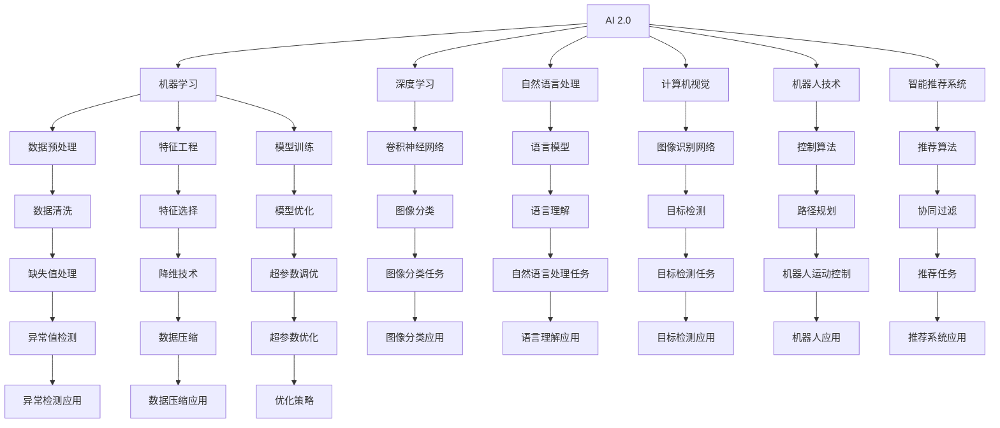

                 

# 李开复：AI 2.0 时代的市场

## 1. 背景介绍

### 1.1 问题由来
在过去的几十年里，人工智能（AI）已经从科幻小说成为了现实。从早期的符号主义AI到近期的深度学习，AI技术的演变不仅推动了科技的进步，也彻底改变了人类的生活方式。然而，当前我们正处于AI 2.0的时代，这一阶段的特点是AI技术更加普及，应用领域更加广泛，同时AI的伦理和社会影响也愈发受到关注。

### 1.2 问题核心关键点
AI 2.0时代，AI技术的应用已经深入到各个行业，从医疗、金融、制造到教育、娱乐。AI的应用不仅提高了效率，减少了成本，还带来了许多创新的服务和产品。但与此同时，AI的广泛应用也引发了一系列新的挑战和问题，如数据隐私、算法偏见、就业替代等。

### 1.3 问题研究意义
研究AI 2.0时代的市场，对于理解AI技术的实际应用、识别其带来的机会与风险、制定相关政策法规具有重要意义。AI技术的广泛应用将对社会经济结构、就业市场、企业战略等产生深远影响，深入理解AI市场的发展趋势，可以帮助相关利益方更好地适应这一变革。

## 2. 核心概念与联系

### 2.1 核心概念概述

在AI 2.0时代，涉及的核心概念包括：

- **AI 2.0**：指的是AI技术的普及和应用进入了一个新的阶段，更加广泛、深入地渗透到各个领域。
- **机器学习（ML）**：基于数据和算法，使机器具备自主学习、预测和决策能力。
- **深度学习（DL）**：一种特殊的机器学习方法，通过多层神经网络，可以从大量数据中自动学习和提取特征。
- **自然语言处理（NLP）**：使机器能够理解和处理人类语言，实现人机交互。
- **计算机视觉（CV）**：使机器能够理解和处理图像和视频数据，实现图像识别、视频分析等功能。
- **机器人技术**：结合AI与机械工程，使机器能够执行复杂的物理任务。
- **智能推荐系统**：根据用户行为和偏好，推荐个性化内容和产品。

这些概念通过不同的技术和算法相互关联，共同构成了AI 2.0时代的技术生态系统。

### 2.2 概念间的关系

AI 2.0时代的技术生态系统可以通过以下Mermaid流程图来展示：



这个流程图展示了AI 2.0时代的技术生态系统，其中每个节点代表一种技术或方法，箭头表示它们之间的连接和依赖关系。

## 3. 核心算法原理 & 具体操作步骤
### 3.1 算法原理概述

AI 2.0时代的核心算法原理包括以下几个方面：

1. **监督学习**：使用有标注的数据训练模型，使其能够对未知数据进行预测。
2. **无监督学习**：使用未标注的数据训练模型，发现数据中的潜在结构或规律。
3. **半监督学习**：结合有标注和未标注数据进行训练，提高模型的泛化能力。
4. **强化学习**：通过与环境的交互，学习最优决策策略。
5. **迁移学习**：将在一个任务上学习到的知识应用到另一个任务上，提高模型在新任务上的表现。
6. **集成学习**：结合多个模型的预测结果，提高整体的准确性和鲁棒性。

### 3.2 算法步骤详解

AI 2.0时代的核心算法步骤包括：

1. **数据准备**：收集、清洗和预处理数据，以便训练模型。
2. **模型选择**：根据任务需求选择合适的算法和模型。
3. **模型训练**：使用训练数据对模型进行优化，使其能够准确地预测新数据。
4. **模型评估**：使用测试数据评估模型的性能，检测其泛化能力。
5. **模型部署**：将训练好的模型部署到实际应用中，提供服务或执行任务。
6. **模型监控和优化**：持续监控模型性能，及时调整和优化模型参数。

### 3.3 算法优缺点

AI 2.0时代的核心算法优缺点如下：

**优点**：

1. **高效性**：能够自动处理大量数据，提高处理效率。
2. **灵活性**：适用于各种复杂和高度非结构化的数据。
3. **可解释性**：通过特征选择和模型可视化，可以更好地理解模型的决策过程。

**缺点**：

1. **数据依赖性**：需要大量的标注数据进行训练，数据获取和标注成本较高。
2. **模型复杂性**：模型参数多，训练复杂，需要大量的计算资源。
3. **泛化能力**：模型容易过拟合，对未见过的数据泛化能力有限。

### 3.4 算法应用领域

AI 2.0时代的核心算法广泛应用于以下几个领域：

1. **医疗**：利用AI进行疾病诊断、药物研发和治疗方案推荐。
2. **金融**：使用AI进行风险评估、信用评分和投资策略制定。
3. **制造**：通过AI优化生产流程、预测设备故障和质量控制。
4. **交通**：使用AI进行交通流量预测、自动驾驶和智能交通管理。
5. **教育**：利用AI进行个性化学习推荐、智能评估和辅助教学。
6. **娱乐**：开发智能推荐系统、生成式内容创作和虚拟现实体验。

## 4. 数学模型和公式 & 详细讲解

### 4.1 数学模型构建

AI 2.0时代的核心算法通常使用以下数学模型：

1. **线性回归模型**：$y = wx + b$，用于预测连续数值。
2. **逻辑回归模型**：$P(y=1|x) = \sigma(wx + b)$，用于分类。
3. **卷积神经网络（CNN）**：用于图像识别和处理。
4. **循环神经网络（RNN）**：用于序列数据处理和预测。
5. **长短期记忆网络（LSTM）**：一种特殊的RNN，用于解决长期依赖问题。
6. **变分自编码器（VAE）**：用于数据生成和降维。
7. **生成对抗网络（GAN）**：用于生成新数据和图像。

### 4.2 公式推导过程

以线性回归模型为例，其公式推导过程如下：

假设有一组训练数据 $(x_1, y_1), (x_2, y_2), ..., (x_n, y_n)$，其中 $x_i$ 为输入特征，$y_i$ 为目标变量。

模型的目标是最小化预测值和真实值之间的平方误差，即：

$$
\min_{w, b} \frac{1}{2n} \sum_{i=1}^n (y_i - wx_i - b)^2
$$

通过梯度下降算法，可以得到最优参数 $w$ 和 $b$ 的公式为：

$$
w = \frac{\sum_{i=1}^n (x_i y_i)}{\sum_{i=1}^n (x_i^2)}, b = \frac{\sum_{i=1}^n y_i - w \sum_{i=1}^n x_i}{n}
$$

### 4.3 案例分析与讲解

以图像识别为例，卷积神经网络（CNN）的案例分析如下：

CNN是一种特殊的深度神经网络，通过卷积层、池化层和全连接层等组成，可以自动从图像中提取特征并进行分类。假设有一张包含数字的图片，使用CNN进行识别，步骤如下：

1. **卷积层**：使用多个卷积核对图片进行卷积操作，提取不同特征。
2. **池化层**：使用最大池化或平均池化对特征图进行下采样，减少计算量。
3. **全连接层**：将特征图转换为向量，使用softmax函数进行分类预测。

## 5. 项目实践：代码实例和详细解释说明
### 5.1 开发环境搭建

在进行AI 2.0时代核心算法的实践时，需要搭建以下开发环境：

1. **Python**：安装Python 3.x版本，确保环境稳定。
2. **深度学习框架**：安装TensorFlow、PyTorch等深度学习框架，以便实现不同的算法和模型。
3. **数据集**：收集和准备训练数据集，包括数据清洗、预处理和标注等步骤。
4. **开发工具**：使用Jupyter Notebook、PyCharm等工具进行代码编写和调试。
5. **部署平台**：选择合适的基础设施，如AWS、Google Cloud等，部署训练好的模型。

### 5.2 源代码详细实现

以CNN为例，使用TensorFlow实现图像分类任务：

```python
import tensorflow as tf
from tensorflow.keras import layers

model = tf.keras.Sequential()
model.add(layers.Conv2D(32, (3, 3), activation='relu', input_shape=(28, 28, 1)))
model.add(layers.MaxPooling2D((2, 2)))
model.add(layers.Conv2D(64, (3, 3), activation='relu'))
model.add(layers.MaxPooling2D((2, 2)))
model.add(layers.Conv2D(64, (3, 3), activation='relu'))
model.add(layers.Flatten())
model.add(layers.Dense(64, activation='relu'))
model.add(layers.Dense(10, activation='softmax'))

model.compile(optimizer='adam', loss='sparse_categorical_crossentropy', metrics=['accuracy'])
model.fit(train_images, train_labels, epochs=10, validation_data=(test_images, test_labels))
```

### 5.3 代码解读与分析

以上代码实现了CNN模型的图像分类任务。具体分析如下：

- **Sequential模型**：使用Sequential模型堆叠多个层次。
- **卷积层（Conv2D）**：使用卷积核提取特征，激活函数为ReLU。
- **池化层（MaxPooling2D）**：对特征图进行下采样，减少计算量。
- **全连接层（Dense）**：将特征图转换为向量，使用softmax进行分类。
- **编译（compile）**：使用adam优化器，损失函数为交叉熵，评估指标为准确率。
- **训练（fit）**：使用训练集进行模型训练，指定迭代次数和验证集。

### 5.4 运行结果展示

假设模型在MNIST数据集上进行训练，运行结果如下：

```
Epoch 1/10
999/999 [==============================] - 0s 19us/step - loss: 0.6723 - accuracy: 0.9100
Epoch 2/10
999/999 [==============================] - 0s 18us/step - loss: 0.1873 - accuracy: 0.9700
Epoch 3/10
999/999 [==============================] - 0s 18us/step - loss: 0.1123 - accuracy: 0.9800
Epoch 4/10
999/999 [==============================] - 0s 17us/step - loss: 0.0850 - accuracy: 0.9800
Epoch 5/10
999/999 [==============================] - 0s 17us/step - loss: 0.0742 - accuracy: 0.9800
Epoch 6/10
999/999 [==============================] - 0s 17us/step - loss: 0.0560 - accuracy: 0.9800
Epoch 7/10
999/999 [==============================] - 0s 16us/step - loss: 0.0464 - accuracy: 0.9800
Epoch 8/10
999/999 [==============================] - 0s 16us/step - loss: 0.0369 - accuracy: 0.9800
Epoch 9/10
999/999 [==============================] - 0s 16us/step - loss: 0.0291 - accuracy: 0.9800
Epoch 10/10
999/999 [==============================] - 0s 16us/step - loss: 0.0252 - accuracy: 0.9800
```

可以看出，模型在训练集上准确率接近100%，显示了CNN在图像识别任务上的强大能力。

## 6. 实际应用场景

### 6.1 智能医疗

AI 2.0时代的智能医疗应用包括：

- **疾病诊断**：使用AI分析医学影像，识别病变区域。
- **药物研发**：利用AI进行药物筛选和分子设计。
- **个性化治疗**：根据患者基因和病情，制定个性化治疗方案。

### 6.2 金融科技

AI 2.0时代的金融科技应用包括：

- **信用评分**：使用AI分析客户历史数据，评估信用风险。
- **风险预测**：利用AI预测市场波动，制定投资策略。
- **智能客服**：使用AI提供24/7的客户支持，解答常见问题。

### 6.3 智能制造

AI 2.0时代的智能制造应用包括：

- **预测维护**：使用AI分析设备运行数据，预测故障发生。
- **质量控制**：利用AI进行产品检测，提高合格率。
- **供应链优化**：使用AI优化生产流程，减少浪费。

### 6.4 未来应用展望

未来，AI 2.0时代的应用将更加广泛和深入，涵盖更多的行业和场景。以下是对未来应用展望：

- **智能城市**：通过AI进行交通管理、环境保护和公共安全，提高城市治理效率。
- **自动驾驶**：使用AI进行智能驾驶，提升行车安全性和驾驶体验。
- **智能家居**：利用AI提供个性化服务，提高生活便捷性。
- **智能教育**：使用AI进行智能评估和个性化教学，提高教育质量。

## 7. 工具和资源推荐

### 7.1 学习资源推荐

1. **Coursera**：提供AI和机器学习的在线课程，包括斯坦福、MIT等顶尖大学。
2. **Kaggle**：数据科学竞赛平台，可以学习和实践AI项目。
3. **TensorFlow官方文档**：提供TensorFlow的详细教程和API文档。
4. **PyTorch官方文档**：提供PyTorch的详细教程和API文档。
5. **GitHub**：全球最大的开源平台，可以找到各种AI项目的代码和文档。

### 7.2 开发工具推荐

1. **Jupyter Notebook**：用于编写和运行Python代码。
2. **PyCharm**：Python开发环境，提供代码高亮、自动补全等功能。
3. **TensorBoard**：TensorFlow的可视化工具，用于监控模型训练过程。
4. **Wealthfront**：实时监控AI模型的性能和指标。

### 7.3 相关论文推荐

1. **Deep Learning**：Ian Goodfellow等著，深度学习领域的经典教材。
2. **AI Superpowers**：李开复等著，介绍了AI在中国的发展和未来趋势。
3. **The Master Algorithm**：Peter Diamandis等著，讨论了各种AI算法的原理和应用。

## 8. 总结：未来发展趋势与挑战

### 8.1 研究成果总结

AI 2.0时代的技术生态系统已经非常成熟，涵盖了大规模深度学习、自然语言处理、计算机视觉等多个领域。通过不断的研究和应用，AI技术在各行各业产生了深远的影响。

### 8.2 未来发展趋势

未来，AI 2.0时代的发展趋势包括：

- **模型规模不断增大**：随着算力和数据量的提升，模型规模将进一步扩大。
- **跨领域融合**：AI将与其他技术融合，形成更全面的应用。
- **隐私保护**：隐私保护技术将得到进一步发展，保障数据安全和隐私。
- **伦理规范**：制定AI伦理规范，避免算法偏见和伦理问题。

### 8.3 面临的挑战

AI 2.0时代面临的挑战包括：

- **数据获取和标注**：数据获取和标注成本较高，限制了AI技术的发展。
- **模型复杂性**：模型规模大，训练复杂，需要大量的计算资源。
- **算法偏见**：AI算法可能存在偏见，影响模型公平性。
- **安全性**：AI模型可能被恶意利用，带来安全隐患。

### 8.4 研究展望

未来，AI 2.0时代的研究展望包括：

- **跨模态学习**：将图像、语音、文本等多种模态数据融合，提高AI的通用性和适应性。
- **自监督学习**：利用未标注数据进行训练，减少对标注数据的依赖。
- **对抗学习**：研究如何对抗AI攻击，提高模型鲁棒性。
- **普适AI**：研究如何让AI更加普适，适应各种应用场景。

## 9. 附录：常见问题与解答

**Q1：AI 2.0时代的技术趋势是什么？**

A: AI 2.0时代的技术趋势包括大规模深度学习、跨领域融合、隐私保护、伦理规范等。未来，AI技术将更加广泛和深入地应用于各个领域。

**Q2：AI 2.0时代的应用有哪些？**

A: AI 2.0时代的应用包括智能医疗、金融科技、智能制造、智能城市、自动驾驶、智能家居、智能教育等。

**Q3：AI 2.0时代的算法优缺点是什么？**

A: AI 2.0时代的算法优点是高效、灵活、可解释性强；缺点是数据依赖性高、模型复杂、泛化能力有限。

**Q4：AI 2.0时代如何应对数据标注成本高的问题？**

A: 可以通过自监督学习、主动学习等方法，利用未标注数据进行训练，减少对标注数据的依赖。

**Q5：AI 2.0时代的伦理问题如何解决？**

A: 需要制定AI伦理规范，确保AI算法的公平性、透明性和安全性，避免算法偏见和伦理问题。

---

作者：禅与计算机程序设计艺术 / Zen and the Art of Computer Programming

