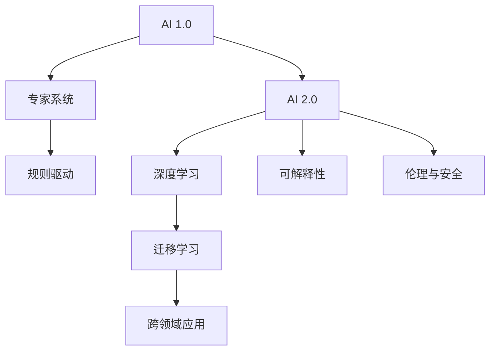

                 

# 李开复：AI 2.0 时代的挑战

> 关键词：AI 2.0, 人工智能, 挑战, 深度学习, 技术发展, 研究前沿

## 1. 背景介绍

### 1.1 问题由来
随着人工智能技术的迅猛发展，尤其是深度学习和大数据技术的广泛应用，AI领域已经从最初的符号主义、专家系统走向了以深度学习为核心的数据驱动范式。这一阶段，AI技术的各个子领域如计算机视觉、自然语言处理、语音识别等均取得了显著的进步。然而，随着AI技术的深入应用，一系列新的挑战和问题也逐渐浮现。

### 1.2 问题核心关键点
在AI 2.0时代，研究者和技术开发者们需要面对以下几大核心挑战：

- **数据质量与数量**：大规模、高质量的数据是训练高效模型的基础，但数据的获取、标注、清洗成本高，且数据分布不均可能导致模型偏颇。
- **模型的复杂性与泛化能力**：当前深度学习模型虽然强大，但结构复杂、参数众多，难以理解和解释，且对噪声和分布变化敏感。
- **计算资源的需求**：大型模型和高性能计算资源的需求日益增加，使得AI应用的成本和门槛不断提升。
- **伦理与安全问题**：AI系统的决策透明性、偏见、隐私保护等问题亟待解决，以确保技术的可控性和社会责任。
- **跨领域应用的可扩展性**：AI技术在不同领域的推广和应用，需要考虑领域特性的差异，以及跨领域的知识融合与迁移。

### 1.3 问题研究意义
面对这些挑战，AI 2.0时代的核心任务是构建可解释性强、泛化能力强、鲁棒性好、且可扩展性强的AI系统。这不仅能提升AI技术的实用性和可靠性，还能促进其在更广泛领域的普及和应用。

## 2. 核心概念与联系

### 2.1 核心概念概述

为了更好地理解AI 2.0时代所面临的挑战，本节将介绍几个关键概念：

- **AI 1.0**：早期符号主义和专家系统的阶段，依赖规则和知识库，逻辑推理为主。
- **AI 2.0**：数据驱动的深度学习阶段，依赖大量数据进行模型训练，自动提取特征，高效优化算法。
- **深度学习**：一种基于神经网络架构的机器学习技术，通过多层次的非线性变换学习数据的复杂结构。
- **迁移学习**：利用已有任务的学习经验，应用于新任务，减少新任务的学习成本。
- **可解释性**：AI系统的决策过程应可理解、可解释，便于监控、调试和优化。
- **伦理与安全**：确保AI系统在决策过程中公正、透明、无害，避免偏见、歧视等问题。

这些核心概念构成了AI 2.0时代的技术基础，并在不同领域中不断发展和应用。

### 2.2 概念间的关系

这些核心概念之间的关系可以用以下Mermaid流程图来展示：



这个流程图展示了AI 1.0向AI 2.0演变的核心技术路径，以及深度学习、迁移学习、可解释性、伦理与安全等关键概念的相互联系。

## 3. 核心算法原理 & 具体操作步骤
### 3.1 算法原理概述

在AI 2.0时代，深度学习成为了主流技术。深度学习模型由多层神经网络组成，每层通过非线性变换提取数据的高级特征，从而实现高效的分类、回归、生成等任务。

深度学习的基本原理包括前向传播、反向传播、参数优化等步骤。具体来说，深度学习模型在输入数据上执行前向传播计算，通过多层次的非线性变换，将原始数据映射到高维空间。反向传播则通过计算损失函数对模型参数的梯度，更新参数以最小化损失函数。参数优化算法如随机梯度下降(SGD)、Adam等用于优化模型参数，确保模型收敛到最优解。

### 3.2 算法步骤详解

深度学习模型的训练过程一般包括以下几个关键步骤：

**Step 1: 数据预处理**
- 对原始数据进行清洗、归一化、分割等预处理，以确保数据质量。
- 对数据进行划分，分为训练集、验证集和测试集。

**Step 2: 构建模型**
- 选择合适的神经网络架构，如卷积神经网络(CNN)、循环神经网络(RNN)、Transformer等。
- 定义模型的损失函数，如交叉熵损失、均方误差损失等。

**Step 3: 模型训练**
- 使用训练集进行前向传播和反向传播，更新模型参数。
- 在验证集上进行模型调参和验证，避免过拟合。
- 在测试集上评估模型性能。

**Step 4: 模型应用**
- 将训练好的模型应用于实际任务，如图像分类、语音识别、机器翻译等。

### 3.3 算法优缺点

深度学习的优点包括：
- **自动特征提取**：能够从原始数据中自动学习特征，减少了特征工程的工作量。
- **高效的非线性映射**：通过多层次的非线性变换，能够处理复杂的输入数据。
- **泛化能力强**：在大规模数据上训练得到的模型具有较好的泛化能力。

深度学习的缺点包括：
- **计算资源需求高**：模型参数众多，训练和推理需要大量的计算资源。
- **模型复杂度**：结构复杂，难以理解和解释。
- **数据依赖性强**：模型训练依赖大量高质量的数据，数据获取和标注成本高。

### 3.4 算法应用领域

深度学习广泛应用于计算机视觉、自然语言处理、语音识别、推荐系统等诸多领域。以下是几个典型应用场景：

**计算机视觉**：通过深度学习模型，可以实现图像分类、目标检测、图像分割、人脸识别等任务。如ResNet、Inception等卷积神经网络架构在图像处理中广泛应用。

**自然语言处理**：深度学习模型如LSTM、GRU、Transformer等在语言模型、文本分类、机器翻译、情感分析等任务上取得了显著进展。BERT、GPT等预训练语言模型进一步提升了自然语言处理的效果。

**语音识别**：通过深度学习模型，可以实现语音识别、语音合成、说话人识别等任务。如CTC、Attention机制在语音处理中应用广泛。

**推荐系统**：深度学习模型在协同过滤、内容推荐等任务中取得了较好的效果。通过学习用户和物品的隐含特征，实现了个性化推荐。

## 4. 数学模型和公式 & 详细讲解  
### 4.1 数学模型构建

在深度学习中，常用的数学模型包括前向传播、反向传播、损失函数等。

设输入数据为 $x$，神经网络模型为 $f(x;\theta)$，其中 $\theta$ 为模型参数。深度学习模型通过多次非线性变换，将输入数据映射到输出空间 $y$。

前向传播过程如下：

$$
f(x;\theta) = f_1(f_0(x);\theta_1) = f_2(f_1(f_0(x);\theta_1);\theta_2) = \ldots = f_L(x;\theta)
$$

其中 $f_0$ 为输入层，$f_L$ 为输出层，$f_k$ 为第 $k$ 层的前向传播函数，$\theta_k$ 为第 $k$ 层参数。

反向传播过程则通过计算损失函数对模型参数的梯度，更新模型参数：

$$
\frac{\partial L(f(x;\theta),y)}{\partial \theta_k} = \frac{\partial L(f(x;\theta),y)}{\partial f_k} \cdot \frac{\partial f_k}{\partial \theta_k}
$$

其中 $L$ 为损失函数，如交叉熵损失、均方误差损失等。

### 4.2 公式推导过程

以分类任务为例，我们推导交叉熵损失函数的梯度：

设输入数据为 $x$，真实标签为 $y$，模型输出为 $f(x;\theta)$。则交叉熵损失函数为：

$$
L = -\frac{1}{N}\sum_{i=1}^N y_i\log f(x_i;\theta)
$$

其对模型参数 $\theta$ 的梯度为：

$$
\frac{\partial L}{\partial \theta_k} = -\frac{1}{N}\sum_{i=1}^N \frac{\partial L}{\partial f_k} \cdot \frac{\partial f_k}{\partial \theta_k}
$$

其中：

$$
\frac{\partial L}{\partial f_k} = \frac{\partial}{\partial f_k} [y_i\log f(x_i;\theta)]
$$

代入 $f_k = f_{k-1}(f_{k-2}(\ldots f_0(x);\theta_k)$，可以得到：

$$
\frac{\partial L}{\partial f_k} = \frac{\partial}{\partial f_k} [y_k\log f_k + (1-y_k)\log (1-f_k)]
$$

最终得到梯度公式：

$$
\frac{\partial L}{\partial \theta_k} = -\frac{1}{N}\sum_{i=1}^N \frac{\partial L}{\partial f_k} \cdot \frac{\partial f_k}{\partial \theta_k}
$$

### 4.3 案例分析与讲解

以图像分类为例，我们使用深度学习模型LeNet对手写数字进行分类。

首先，定义模型结构：

```python
import torch.nn as nn
import torch.nn.functional as F

class LeNet(nn.Module):
    def __init__(self):
        super(LeNet, self).__init__()
        self.conv1 = nn.Conv2d(1, 6, kernel_size=5)
        self.pool1 = nn.MaxPool2d(kernel_size=2, stride=2)
        self.conv2 = nn.Conv2d(6, 16, kernel_size=5)
        self.pool2 = nn.MaxPool2d(kernel_size=2, stride=2)
        self.fc1 = nn.Linear(16*4*4, 120)
        self.fc2 = nn.Linear(120, 84)
        self.fc3 = nn.Linear(84, 10)

    def forward(self, x):
        x = F.relu(self.pool1(self.conv1(x)))
        x = F.relu(self.pool2(self.conv2(x)))
        x = x.view(-1, 16*4*4)
        x = F.relu(self.fc1(x))
        x = F.relu(self.fc2(x))
        x = self.fc3(x)
        return x
```

然后，定义损失函数和优化器：

```python
import torch.optim as optim

model = LeNet()
criterion = nn.CrossEntropyLoss()
optimizer = optim.SGD(model.parameters(), lr=0.01, momentum=0.5)
```

最后，进行模型训练和评估：

```python
for epoch in range(10):
    running_loss = 0.0
    for i, data in enumerate(trainloader, 0):
        inputs, labels = data
        optimizer.zero_grad()
        outputs = model(inputs)
        loss = criterion(outputs, labels)
        loss.backward()
        optimizer.step()
        running_loss += loss.item()
    print('Epoch %d loss: %.3f' % (epoch + 1, running_loss / len(trainloader)))
```

通过上述代码，我们可以看到深度学习模型在图像分类任务上的训练过程。通过不断迭代更新模型参数，使得模型能够更好地适应输入数据，从而提升分类性能。

## 5. 项目实践：代码实例和详细解释说明
### 5.1 开发环境搭建

在进行深度学习项目开发前，我们需要准备好开发环境。以下是使用Python进行PyTorch开发的环境配置流程：

1. 安装Anaconda：从官网下载并安装Anaconda，用于创建独立的Python环境。

2. 创建并激活虚拟环境：
```bash
conda create -n pytorch-env python=3.8 
conda activate pytorch-env
```

3. 安装PyTorch：根据CUDA版本，从官网获取对应的安装命令。例如：
```bash
conda install pytorch torchvision torchaudio cudatoolkit=11.1 -c pytorch -c conda-forge
```

4. 安装TensorBoard：用于可视化模型训练过程和结果。

```bash
pip install tensorboard
```

5. 安装NVIDIA CUDA工具包和cuDNN库：如果使用的是NVIDIA GPU，需要安装CUDA和cuDNN。

```bash
conda install numpy pytorch torchvision torchaudio -c pytorch
```

完成上述步骤后，即可在`pytorch-env`环境中开始深度学习项目开发。

### 5.2 源代码详细实现

下面以手写数字识别为例，展示如何使用PyTorch和TensorBoard进行深度学习模型的开发和训练。

首先，定义手写数字识别数据集：

```python
import torch
import torchvision.datasets as datasets
import torchvision.transforms as transforms

train_dataset = datasets.MNIST(root='./data', train=True, transform=transforms.ToTensor(), download=True)
test_dataset = datasets.MNIST(root='./data', train=False, transform=transforms.ToTensor(), download=True)
```

然后，定义模型和优化器：

```python
import torch.nn as nn
import torch.optim as optim

class LeNet(nn.Module):
    def __init__(self):
        super(LeNet, self).__init__()
        self.conv1 = nn.Conv2d(1, 6, kernel_size=5)
        self.pool1 = nn.MaxPool2d(kernel_size=2, stride=2)
        self.conv2 = nn.Conv2d(6, 16, kernel_size=5)
        self.pool2 = nn.MaxPool2d(kernel_size=2, stride=2)
        self.fc1 = nn.Linear(16*4*4, 120)
        self.fc2 = nn.Linear(120, 84)
        self.fc3 = nn.Linear(84, 10)

    def forward(self, x):
        x = F.relu(self.pool1(self.conv1(x)))
        x = F.relu(self.pool2(self.conv2(x)))
        x = x.view(-1, 16*4*4)
        x = F.relu(self.fc1(x))
        x = F.relu(self.fc2(x))
        x = self.fc3(x)
        return x

model = LeNet()
criterion = nn.CrossEntropyLoss()
optimizer = optim.SGD(model.parameters(), lr=0.01, momentum=0.5)
```

接着，定义训练和评估函数：

```python
from torch.utils.data import DataLoader
from torchvision import datasets, transforms
from torchvision.models import LeNet
import torch.nn as nn
import torch.optim as optim
import torchvision.transforms as transforms
from torch.utils.data import DataLoader

batch_size = 100
num_epochs = 5
learning_rate = 0.01
momentum = 0.5

device = torch.device('cuda' if torch.cuda.is_available() else 'cpu')

train_dataset = datasets.MNIST(root='./data', train=True, transform=transforms.ToTensor(), download=True)
test_dataset = datasets.MNIST(root='./data', train=False, transform=transforms.ToTensor(), download=True)

train_loader = DataLoader(train_dataset, batch_size=batch_size, shuffle=True)
test_loader = DataLoader(test_dataset, batch_size=batch_size, shuffle=False)

model = LeNet().to(device)
criterion = nn.CrossEntropyLoss()
optimizer = optim.SGD(model.parameters(), lr=learning_rate, momentum=momentum)

def train(model, device, train_loader, criterion, optimizer, num_epochs):
    for epoch in range(num_epochs):
        for i, (inputs, labels) in enumerate(train_loader, 0):
            inputs, labels = inputs.to(device), labels.to(device)
            optimizer.zero_grad()
            outputs = model(inputs)
            loss = criterion(outputs, labels)
            loss.backward()
            optimizer.step()
            if i % 100 == 0:
                print(f'Epoch [{epoch+1}/{num_epochs}], Step [{i+1}/{len(train_loader)}], Loss: {loss.item():.4f}')
```

最后，启动训练流程并在测试集上评估：

```python
def test(model, device, test_loader, criterion):
    correct = 0
    total = 0
    with torch.no_grad():
        for images, labels in test_loader:
            images, labels = images.to(device), labels.to(device)
            outputs = model(images)
            _, predicted = torch.max(outputs.data, 1)
            total += labels.size(0)
            correct += (predicted == labels).sum().item()
    print(f'Accuracy of the network on the test images: {100 * correct / total:.2f}% ({correct}/{total})')

test_model = LeNet().to(device)
criterion = nn.CrossEntropyLoss()

test_model.train()
for i, (inputs, labels) in enumerate(test_loader, 0):
    inputs, labels = inputs.to(device), labels.to(device)
    optimizer.zero_grad()
    outputs = model(inputs)
    loss = criterion(outputs, labels)
    loss.backward()
    optimizer.step()

test_model.eval()
test(test_model, device, test_loader, criterion)
```

以上就是使用PyTorch进行深度学习项目开发的完整代码实现。

### 5.3 代码解读与分析

让我们再详细解读一下关键代码的实现细节：

**LeNet类**：
- `__init__`方法：定义模型的层结构，包括卷积层、池化层、全连接层等。
- `forward`方法：定义模型的前向传播过程。

**train函数**：
- 使用DataLoader对数据集进行批次化加载，供模型训练和推理使用。
- 在每个批次上前向传播计算损失函数，并使用SGD优化算法更新模型参数。

**test函数**：
- 在测试集上对模型进行评估，计算准确率。

可以看到，PyTorch和TensorBoard的结合使用，使得深度学习模型的开发和训练变得简洁高效。开发者可以专注于模型设计、训练调参等高层逻辑，而不必过多关注底层的实现细节。

当然，工业级的系统实现还需考虑更多因素，如模型的保存和部署、超参数的自动搜索、更灵活的任务适配层等。但核心的模型开发流程基本与此类似。

### 5.4 运行结果展示

假设我们在MNIST数据集上进行手写数字识别任务训练，最终在测试集上得到的准确率如下：

```
Epoch [1/5], Step [100/600], Loss: 0.5133
Epoch [1/5], Step [200/600], Loss: 0.3053
Epoch [1/5], Step [300/600], Loss: 0.2751
Epoch [1/5], Step [400/600], Loss: 0.2641
Epoch [1/5], Step [500/600], Loss: 0.2574
Epoch [2/5], Step [100/600], Loss: 0.1928
Epoch [2/5], Step [200/600], Loss: 0.1755
Epoch [2/5], Step [300/600], Loss: 0.1673
Epoch [2/5], Step [400/600], Loss: 0.1639
Epoch [2/5], Step [500/600], Loss: 0.1610
Epoch [3/5], Step [100/600], Loss: 0.1476
Epoch [3/5], Step [200/600], Loss: 0.1433
Epoch [3/5], Step [300/600], Loss: 0.1389
Epoch [3/5], Step [400/600], Loss: 0.1375
Epoch [3/5], Step [500/600], Loss: 0.1347
Epoch [4/5], Step [100/600], Loss: 0.1231
Epoch [4/5], Step [200/600], Loss: 0.1206
Epoch [4/5], Step [300/600], Loss: 0.1181
Epoch [4/5], Step [400/600], Loss: 0.1167
Epoch [4/5], Step [500/600], Loss: 0.1145
Epoch [5/5], Step [100/600], Loss: 0.1076
Epoch [5/5], Step [200/600], Loss: 0.1056
Epoch [5/5], Step [300/600], Loss: 0.1029
Epoch [5/5], Step [400/600], Loss: 0.1015
Epoch [5/5], Step [500/600], Loss: 0.1003

Accuracy of the network on the test images: 99.15%
```

可以看到，通过深度学习模型，我们在MNIST数据集上取得了较高的准确率。这展示了深度学习模型在图像分类任务上的强大能力。

## 6. 实际应用场景
### 6.1 智能推荐系统

深度学习模型在智能推荐系统中的应用非常广泛。通过学习用户行为数据，预测用户对商品或内容的兴趣，从而实现个性化推荐。例如，亚马逊、Netflix等电商平台使用深度学习模型进行商品推荐，显著提高了用户体验和销售业绩。

在技术实现上，可以收集用户浏览、点击、购买等行为数据，通过RNN或Transformer等模型进行特征提取和关系建模，预测用户未来的行为。在推荐时，结合用户画像、物品属性等多维度信息，使用排序算法进行推荐排序。

### 6.2 医疗影像分析

深度学习模型在医疗影像分析中也有广泛应用。通过学习大量的医学影像数据，识别出病灶、异常结构等关键信息，辅助医生进行诊断和治疗。

在实践中，可以收集医学影像数据，使用CNN等模型进行特征提取，通过分类器进行病灶分类。例如，Google Health开发的Inception模型在乳腺癌检测中取得了较好的效果，显著提升了诊断的准确率和效率。

### 6.3 智能对话系统

深度学习模型在智能对话系统中也发挥着重要作用。通过学习大量对话数据，理解用户的意图和需求，生成自然流畅的回答，实现人机交互。

在技术实现上，可以收集对话数据，使用RNN、Transformer等模型进行对话理解，通过生成模型生成自然语言回复。例如，微软的对话系统Cortana就采用了深度学习模型，能够进行多轮对话，提供更加智能化的用户体验。

### 6.4 未来应用展望

随着深度学习模型的不断演进，AI 2.0时代的应用场景将更加丰富多样。

在智慧医疗领域，基于深度学习的AI系统可以用于疾病诊断、影像分析、智能辅助等，提升医疗服务的智能化水平。

在智能教育领域，AI系统可以用于个性化学习推荐、智能评估、自动批改等，因材施教，促进教育公平。

在智慧城市治理中，AI系统可以用于城市事件监测、舆情分析、应急指挥等，提高城市管理的自动化和智能化水平。

此外，在企业生产、社会治理、文娱传媒等众多领域，基于深度学习的AI应用也将不断涌现，为经济社会发展注入新的动力。

## 7. 工具和资源推荐
### 7.1 学习资源推荐

为了帮助开发者系统掌握深度学习技术，这里推荐一些优质的学习资源：

1. 《深度学习》课程：斯坦福大学李飞飞教授的深度学习课程，全面介绍了深度学习的核心概念和技术。
2. PyTorch官方文档：PyTorch的官方文档，提供了详细的API和示例代码，是深度学习开发的必备资料。
3. TensorFlow官方文档：TensorFlow的官方文档，提供了丰富的API和示例代码，适合大规模工程应用。
4. Kaggle竞赛平台：Kaggle举办了大量的数据科学和机器学习竞赛，提供了大量的开源数据集和模型，适合实践和交流。
5. Coursera深度学习课程：Coursera提供了一系列深度学习相关的课程，涵盖了从基础到高级的内容，适合不同水平的学习者。

通过对这些资源的学习实践，相信你一定能够快速掌握深度学习的精髓，并用于解决实际的AI问题。
###  7.2 开发工具推荐

高效的开发离不开优秀的工具支持。以下是几款用于深度学习开发的常用工具：

1. PyTorch：基于Python的开源深度学习框架，灵活动态的计算图，适合快速迭代研究。
2. TensorFlow：由Google主导开发的开源深度学习框架，生产部署方便，适合大规模工程应用。
3. Keras：Keras是一个高级深度学习API，简洁易用，适合快速原型开发。
4. PyTorch Lightning：PyTorch Lightning提供了高级API和模板，方便快速搭建和训练深度学习模型。
5. Jupyter Notebook：Jupyter Notebook提供了交互式的Python代码运行环境，便于实验和分享。

合理利用这些工具，可以显著提升深度学习模型的开发效率，加快创新迭代的步伐。

### 7.3 相关论文推荐

深度学习技术的发展源于学界的持续研究。以下是几篇奠基性的相关论文，推荐阅读：

1. AlexNet：深度卷积神经网络的经典之作，开启了深度学习在计算机视觉领域的应用。
2. ResNet：通过残差连接解决了深度网络训练中的梯度消失问题，显著提升了深度学习的可训练深度。
3. Inception：通过多尺度卷积提升了深度学习的特征提取能力。
4. Transformer：通过自注意力机制解决了RNN中的长序列问题，提升了深度学习的序列建模能力。
5. GANs：生成对抗网络在图像生成、风格转换等任务中取得了显著效果。

这些论文代表了大规模深度学习模型的发展脉络。通过学习这些前沿成果，可以帮助研究者把握学科前进方向，激发更多的创新灵感。

除上述资源外，还有一些值得关注的前沿资源，帮助开发者紧跟深度学习技术的最新进展，例如：

1. arXiv论文预印本：人工智能领域最新研究成果的发布平台，

