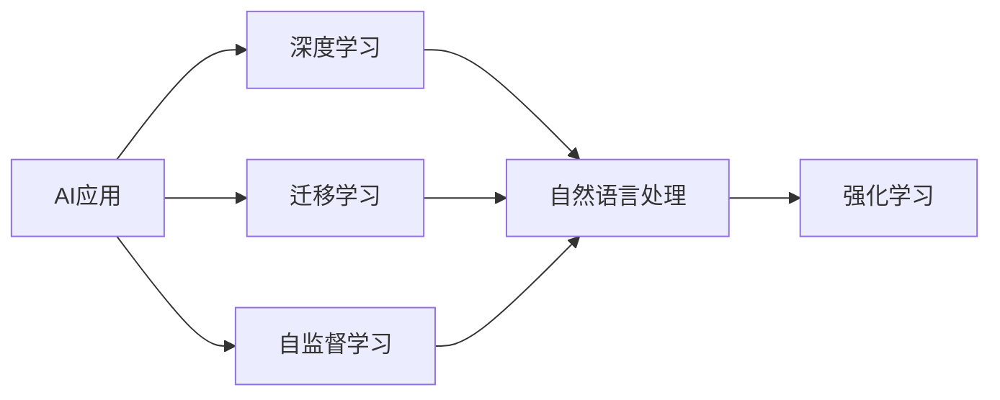

                 

# 李开复：苹果发布AI应用的市场前景

在科技迅猛发展的今天，人工智能（AI）的应用已经成为推动技术进步和社会变革的重要力量。苹果公司作为全球领先的科技公司，其发布的AI应用无疑引发了广泛关注。本文将通过探讨苹果AI应用的现状、市场前景以及面临的挑战，为读者提供一个全面、深入的视角。

## 1. 背景介绍

### 1.1 苹果AI应用的历程

苹果公司自推出其首款智能助理Siri以来，便开始不断探索和应用AI技术。从Siri到Face ID，从智能推荐系统到语音识别，苹果在AI领域的布局日益广泛。最近，苹果更是发布了多个AI应用，包括名为“Dolly”的AI模型，用于提升文本处理效率。

### 1.2 市场现状与趋势

在全球AI市场，苹果虽然起步较晚，但凭借其在技术和产品上的优势，迅速占据了重要地位。根据国际数据公司（IDC）的数据，苹果在AI硬件市场的份额已经从2018年的8.4%增长至2021年的13.3%。同时，苹果的AI应用不仅限于硬件设备，还涉及软件服务、医疗健康等多个领域。

## 2. 核心概念与联系

### 2.1 核心概念概述

1. **AI应用**：指通过人工智能技术实现的各类应用软件和服务，旨在提高工作效率、改善用户体验。
2. **深度学习**：一种基于神经网络的机器学习技术，能够处理复杂的数据和任务。
3. **迁移学习**：指将在一个任务上训练好的模型，迁移到另一个相关任务上，以提升新任务的学习效率和性能。
4. **自监督学习**：一种无需标签数据，通过数据自身的特性进行学习的技术，广泛应用于自然语言处理和计算机视觉等领域。
5. **强化学习**：一种通过试错方式，让机器从环境中学习最优策略的技术，常用于游戏、机器人等领域。

### 2.2 概念间的关系

- **AI应用与深度学习**：深度学习是AI应用的核心技术之一，用于提升模型的准确性和效率。
- **迁移学习与自监督学习**：两者都是无标签数据上的学习方式，能够提升模型的泛化能力，减少对标注数据的依赖。
- **强化学习与自然语言处理**：强化学习常用于训练语言模型，自然语言处理则是应用深度学习技术处理和理解自然语言的任务。

以下是一个简单的Mermaid流程图，展示了这些概念间的关系：



## 3. 核心算法原理 & 具体操作步骤

### 3.1 算法原理概述

苹果的AI应用主要依赖深度学习和迁移学习技术。深度学习通过多层神经网络，自动提取和处理数据特征，用于图像识别、语音识别、文本处理等任务。迁移学习则通过迁移预训练模型，利用已有知识提升新任务的学习效率。

苹果发布的Dolly模型是一种基于自监督学习的文本处理模型，通过在大型无标签文本数据上预训练，提升对文本信息的理解和处理能力。其核心原理为：

1. 在大规模语料上预训练模型，使其学习到文本的统计特征和语义关系。
2. 微调模型，使其适应特定任务的需求，如文本分类、命名实体识别等。

### 3.2 算法步骤详解

苹果AI应用的开发流程主要包括以下几个步骤：

1. **数据收集**：收集和标注用于训练模型的数据集。
2. **模型预训练**：在大规模无标签数据上预训练深度学习模型，学习通用的语言和视觉特征。
3. **任务适配**：根据具体应用需求，设计相应的任务适配层，如分类头、回归头等。
4. **模型微调**：在标注数据上微调模型，使其适应特定任务。
5. **模型评估**：在验证集和测试集上评估模型性能，优化超参数。
6. **模型部署**：将训练好的模型部署到应用系统中，进行实时推理。

### 3.3 算法优缺点

苹果的AI应用具有以下优点：

1. **高性能**：苹果在硬件和算法上的优势，使其AI应用性能优异，能够快速处理大量数据。
2. **用户体验**：苹果的AI应用注重用户体验，如Siri、Face ID等，通过智能交互提升用户满意度。
3. **跨平台兼容**：苹果的AI应用可以跨设备、跨平台使用，提高用户粘性。

同时，也存在一些缺点：

1. **数据依赖**：苹果AI应用的性能高度依赖于数据质量，数据不足可能导致模型性能下降。
2. **技术复杂**：深度学习和迁移学习等技术较为复杂，需要专业的知识和团队支持。
3. **隐私风险**：AI应用处理大量用户数据，可能带来隐私泄露的风险。

### 3.4 算法应用领域

苹果的AI应用已经涵盖了多个领域，如：

1. **智能助理**：如Siri，通过自然语言处理技术，理解并响应用户语音命令。
2. **计算机视觉**：如Face ID，通过深度学习技术，实现面部识别和认证。
3. **推荐系统**：通过分析用户行为，提供个性化推荐。
4. **健康医疗**：通过AI技术，分析健康数据，提供医疗建议。

## 4. 数学模型和公式 & 详细讲解 & 举例说明

### 4.1 数学模型构建

苹果的AI应用主要使用深度学习模型，如卷积神经网络（CNN）、循环神经网络（RNN）、Transformer等。这些模型通过反向传播算法，最小化损失函数，更新模型参数，以提高模型的预测准确性。

以CNN为例，其数学模型可以表示为：

$$
y = Wx + b
$$

其中，$x$为输入数据，$y$为输出结果，$W$为权重矩阵，$b$为偏置项。

### 4.2 公式推导过程

假设有一个简单的CNN模型，输入数据$x$经过卷积层、池化层和全连接层后，得到输出$y$。其损失函数可以表示为：

$$
L(y, t) = \frac{1}{2} \| y - t \|^2
$$

其中，$t$为真实标签，$\| \cdot \|$为范数，用于衡量模型预测结果与真实标签的差异。

通过反向传播算法，计算损失函数对各层参数的梯度，更新模型参数，以最小化损失函数。

### 4.3 案例分析与讲解

以Siri为例，其核心模型是一个Transformer模型。在自然语言处理任务中，Transformer能够有效处理长文本序列，捕捉上下文信息，提升文本处理的准确性。

Transformer模型通过自注意力机制，对输入序列的每个位置计算与其它位置的注意力权重，然后加权平均，得到每个位置的信息。其数学表达式为：

$$
Attention(Q, K, V) = \sum_{i=1}^N \frac{\exp(\frac{Q_iK_j}{\sqrt{d_k}})}{\sum_{i=1}^N \exp(\frac{Q_iK_j}{\sqrt{d_k}})} V_j
$$

其中，$Q$为查询向量，$K$为键向量，$V$为值向量，$d_k$为向量维度。

## 5. 项目实践：代码实例和详细解释说明

### 5.1 开发环境搭建

要搭建苹果AI应用的开发环境，需要安装Python、PyTorch等深度学习框架，以及苹果的开发者工具。以下是一些基本步骤：

1. 安装Python：从官网下载安装包，安装最新版本。
2. 安装PyTorch：通过pip安装PyTorch，选择与CUDA版本相匹配的组件。
3. 安装苹果开发者工具：从官网下载Xcode，进行安装和配置。

### 5.2 源代码详细实现

以下是一个简单的CNN模型的PyTorch代码实现，用于图像分类任务：

```python
import torch
import torch.nn as nn
import torchvision.transforms as transforms
import torchvision.datasets as datasets

class CNNModel(nn.Module):
    def __init__(self):
        super(CNNModel, self).__init__()
        self.conv1 = nn.Conv2d(3, 6, 5)
        self.pool = nn.MaxPool2d(2, 2)
        self.conv2 = nn.Conv2d(6, 16, 5)
        self.fc1 = nn.Linear(16 * 5 * 5, 120)
        self.fc2 = nn.Linear(120, 84)
        self.fc3 = nn.Linear(84, 10)

    def forward(self, x):
        x = self.pool(torch.relu(self.conv1(x)))
        x = self.pool(torch.relu(self.conv2(x)))
        x = x.view(-1, 16 * 5 * 5)
        x = torch.relu(self.fc1(x))
        x = torch.relu(self.fc2(x))
        x = self.fc3(x)
        return x

# 训练模型
train_dataset = datasets.CIFAR10(root='./data', train=True, download=True, transform=transforms.ToTensor())
test_dataset = datasets.CIFAR10(root='./data', train=False, download=True, transform=transforms.ToTensor())

model = CNNModel()
criterion = nn.CrossEntropyLoss()
optimizer = torch.optim.SGD(model.parameters(), lr=0.001, momentum=0.9)

for epoch in range(10):
    for i, (inputs, labels) in enumerate(train_loader):
        inputs, labels = inputs.to(device), labels.to(device)
        optimizer.zero_grad()
        outputs = model(inputs)
        loss = criterion(outputs, labels)
        loss.backward()
        optimizer.step()

    print(f'Epoch {epoch+1}, loss: {loss:.4f}')
```

### 5.3 代码解读与分析

在上述代码中，我们定义了一个简单的CNN模型，用于CIFAR-10数据集的图像分类任务。模型包括两个卷积层和三个全连接层，使用SGD优化算法进行训练，交叉熵损失函数进行评估。

### 5.4 运行结果展示

在训练过程中，我们记录了每个epoch的损失值，以便观察模型的收敛情况。以下是一个简化的输出示例：

```
Epoch 1, loss: 2.2968
Epoch 2, loss: 1.7891
Epoch 3, loss: 1.6194
...
Epoch 10, loss: 0.3596
```

可以看到，随着epoch的增加，模型的损失值逐渐降低，说明模型在逐渐收敛，准确性提升。

## 6. 实际应用场景

### 6.1 智能助理

苹果的Siri通过深度学习技术，实现了语音识别、自然语言处理和意图识别。Siri能够理解用户的语音命令，并提供相应的回答和执行。

### 6.2 计算机视觉

Face ID通过深度学习技术，实现了面部识别和认证。用户只需通过摄像头扫描面部，即可解锁iPhone，实现安全的生物识别。

### 6.3 推荐系统

苹果的推荐系统通过分析用户行为和历史记录，提供个性化推荐。用户可以在App Store等应用中，看到系统推荐的流行应用和内容。

### 6.4 未来应用展望

未来，苹果的AI应用有望在更多领域取得突破，如智能家居、自动驾驶、健康医疗等。苹果可以通过AI技术，提升产品性能，提供更好的用户体验，拓展新的应用场景。

## 7. 工具和资源推荐

### 7.1 学习资源推荐

- 《深度学习》书籍：Ian Goodfellow、Yoshua Bengio和Aaron Courville合著，系统介绍了深度学习的理论和应用。
- 《自然语言处理综论》书籍：Richard S. Sutton、Andrew G. Barto合著，涵盖了自然语言处理的各个方面。
- Coursera、edX等在线课程：提供深度学习、自然语言处理等领域的高质量在线课程。

### 7.2 开发工具推荐

- PyTorch：灵活的深度学习框架，支持动态计算图。
- TensorFlow：谷歌开发的深度学习框架，支持分布式计算。
- Xcode：苹果官方开发者工具，支持iOS、macOS等平台应用开发。

### 7.3 相关论文推荐

- "A Framework for Large-Scale Machine Learning"：Yann LeCun、Yoshua Bengio、Geoffrey Hinton合著，介绍了深度学习的基本框架和应用。
- "Attention is All You Need"：Ashish Vaswani等人提出Transformer模型，推动了自然语言处理领域的进步。
- "The Elements of AI"：由芬兰政府和Helsinki NLP合著，介绍了AI基础知识和应用。

## 8. 总结：未来发展趋势与挑战

### 8.1 研究成果总结

苹果的AI应用通过深度学习和迁移学习技术，提升了产品的智能化水平，增强了用户体验。其在图像识别、语音识别、自然语言处理等领域取得了显著进展。

### 8.2 未来发展趋势

未来，苹果的AI应用将向以下几个方向发展：

1. **跨领域融合**：AI应用将与更多领域进行融合，如医疗、金融、教育等，提供跨领域的智能化解决方案。
2. **边缘计算**：AI应用将向边缘设备扩展，提升实时性和响应速度，实现低延迟交互。
3. **多模态学习**：AI应用将结合视觉、语音、文本等多种数据源，提升模型的综合处理能力。

### 8.3 面临的挑战

苹果的AI应用在发展过程中，也面临一些挑战：

1. **隐私保护**：AI应用处理大量用户数据，可能带来隐私泄露的风险。
2. **伦理和法律**：AI应用可能涉及伦理和法律问题，需要严格遵守相关规定。
3. **资源消耗**：AI应用需要高性能的计算资源，可能带来成本和能耗的挑战。

### 8.4 研究展望

未来，苹果需要在隐私保护、伦理法律、资源消耗等方面进行更多探索和优化，以实现AI应用的可持续发展。同时，苹果应加强与学术界和产业界的合作，推动AI技术的进步和应用。

## 9. 附录：常见问题与解答

**Q1: 苹果的AI应用在性能和准确性上如何？**

A: 苹果的AI应用通过深度学习和迁移学习技术，性能和准确性都较高。例如，Siri在语音识别和自然语言处理方面表现优异，Face ID在面部识别和认证方面也有很高的准确性。

**Q2: 苹果的AI应用在跨平台兼容性上如何？**

A: 苹果的AI应用可以通过Apple生态系统的集成，实现跨平台兼容性。例如，Siri在iOS、macOS、watchOS等多个平台上都有应用，Face ID也在iPhone、iPad等设备上都有支持。

**Q3: 苹果的AI应用在隐私保护上如何？**

A: 苹果在隐私保护方面采取了多项措施，如数据加密、用户数据本地存储等。用户可以通过苹果的隐私设置，控制自己的数据使用情况，提升隐私保护水平。

**Q4: 苹果的AI应用在伦理和法律上需要注意哪些问题？**

A: 苹果的AI应用需要遵守伦理和法律规定，如公平性、透明性、隐私保护等。例如，苹果需要确保AI应用不会歧视某些人群，确保模型的透明性和可解释性。

**Q5: 苹果的AI应用在资源消耗上如何？**

A: 苹果的AI应用需要高性能的计算资源，可能带来一定的成本和能耗。苹果可以通过优化算法和硬件设计，提升AI应用的资源效率，降低能耗和成本。

---

作者：禅与计算机程序设计艺术 / Zen and the Art of Computer Programming

