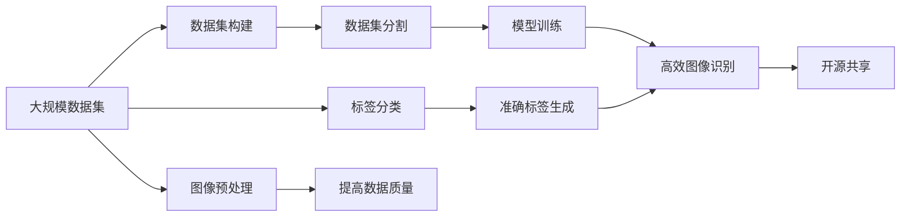

                 

# 李飞飞的ImageNet革命

## 1. 背景介绍

### 1.1 问题由来

随着计算机视觉技术的迅猛发展，如何构建一个高效、通用的图像识别系统成为了当务之急。传统的图像识别方法依赖于手工设计的特征和分类器，难以适应复杂的视觉场景，且训练数据集规模较小，导致模型泛化能力不足。李飞飞教授领导的ImageNet项目，通过构建大规模、高品质的图像数据集，极大地推动了计算机视觉技术的发展。

### 1.2 问题核心关键点

ImageNet项目的关键在于构建了一个涵盖21000个类别、超过100万张标注图片的图像数据集，推动了大规模图像识别模型的研究和应用。其核心优势在于：

- 数据集规模庞大：包含1400万张图片，21000个类别，为大规模模型训练提供了充足数据。
- 数据质量高：图片分辨率高、标注详细，使得模型能够学习到更准确的视觉特征。
- 开放共享：公开数据集并支持开源软件工具，推动了学术界和工业界的研究和应用。

ImageNet项目不仅影响了计算机视觉领域的技术进展，还带动了深度学习模型的广泛应用，为人工智能技术的普及和产业化奠定了基础。

### 1.3 问题研究意义

ImageNet项目的成功，在于其创新的数据构建方式和开源共享机制，极大地推动了计算机视觉技术的发展。这一突破性成果具有重要的研究意义：

- 提升了模型性能：大规模数据集和高质量标注，使模型能够学习到更丰富的视觉特征，提升识别准确率。
- 加速了技术应用：开源社区的协作和共享，加快了技术的落地应用，加速了产业化的进程。
- 促进了学术研究：大规模数据集和先进算法，促进了学术界的研究和创新，推动了技术的持续进步。
- 推动了跨学科发展：涉及图像、标签、编码等多个学科的协同创新，促进了人工智能技术的多元发展。

## 2. 核心概念与联系

### 2.1 核心概念概述

ImageNet项目涉及多个关键概念，理解这些概念有助于深入理解其技术架构和应用场景：

- 数据集构建：ImageNet通过大规模数据采集、标注和整理，构建了包含21000个类别的图像数据集。
- 图像预处理：对图片进行缩放、裁剪、归一化等预处理操作，提升数据质量。
- 标签分类：使用WordNet、MSRA等词典工具，为图片生成详细、准确的标签。
- 数据集分割：将数据集划分为训练集、验证集和测试集，保证模型的泛化性能。
- 开源共享：公开数据集并支持多种编程语言，推动学术界和工业界的研究和应用。
- 深度学习模型：利用深度神经网络，对大规模图像数据进行学习和训练，构建高效的图像识别模型。

这些概念构成了ImageNet项目的技术基础，推动了计算机视觉技术的快速发展。

### 2.2 概念间的关系

ImageNet项目中的核心概念通过以下Mermaid流程图展示了它们之间的相互关系：



通过这个流程图，我们可以清楚地看到，大规模数据集是ImageNet项目的基础，图像预处理和标签分类提升了数据质量，数据集分割保证了模型的泛化性能，开源共享推动了技术的广泛应用。最终，高效图像识别模型在各种应用场景中取得了显著的效果。

## 3. 核心算法原理 & 具体操作步骤
### 3.1 算法原理概述

ImageNet项目的核心算法原理是利用大规模数据集和深度学习模型，构建高效、通用的图像识别系统。其主要流程包括数据集构建、图像预处理、模型训练和开源共享四个环节：

1. **数据集构建**：通过大规模数据采集、标注和整理，构建包含21000个类别的图像数据集。
2. **图像预处理**：对图片进行缩放、裁剪、归一化等预处理操作，提升数据质量。
3. **模型训练**：利用深度神经网络，对大规模图像数据进行学习和训练，构建高效的图像识别模型。
4. **开源共享**：公开数据集并支持多种编程语言，推动学术界和工业界的研究和应用。

### 3.2 算法步骤详解

ImageNet项目的具体操作步骤包括：

1. **数据采集**：从互联网、图书馆等多种来源获取图片数据，包括动物、植物、物体等各类图片。
2. **图片标注**：使用WordNet、MSRA等词典工具，为图片生成详细、准确的标签，包含多个层次的标签描述。
3. **数据预处理**：对图片进行缩放、裁剪、归一化等预处理操作，生成统一的图像格式。
4. **数据集分割**：将数据集划分为训练集、验证集和测试集，保证模型的泛化性能。
5. **模型训练**：利用深度神经网络，对大规模图像数据进行学习和训练，构建高效的图像识别模型。
6. **模型评估**：在测试集上评估模型性能，识别模型中的错误和不足，进行优化和改进。
7. **开源共享**：公开数据集并支持多种编程语言，推动学术界和工业界的研究和应用。

### 3.3 算法优缺点

ImageNet项目的优点在于其大规模数据集和高效模型，推动了计算机视觉技术的发展。其主要优点包括：

- 大规模数据集：数据集包含超过100万张图片，21000个类别，为大规模模型训练提供了充足数据。
- 高效模型：利用深度神经网络，构建了高效的图像识别模型，提升识别准确率。
- 开源共享：公开数据集并支持多种编程语言，推动了学术界和工业界的研究和应用。

但ImageNet项目也存在一些局限性：

- 数据采集难度大：大规模数据集的构建需要大量人力物力，采集和标注难度较大。
- 标注成本高：详细、准确的标签生成需要大量人工标注，成本较高。
- 模型复杂度高：深度神经网络模型复杂度高，训练和推理成本较高。
- 模型泛化性能不足：模型在大规模数据集上表现优异，但在新数据集上的泛化性能可能不足。

### 3.4 算法应用领域

ImageNet项目的主要应用领域包括计算机视觉、自然语言处理、语音识别等，推动了人工智能技术的广泛应用。具体应用场景包括：

- 图像识别：用于物体检测、人脸识别、场景分类等，提升了智能安防、自动驾驶等领域的自动化水平。
- 语音识别：利用ImageNet构建的音频数据集，推动了语音识别技术的发展，用于语音助手、语音识别设备等。
- 自然语言处理：通过ImageNet的数据集和算法，推动了NLP技术的发展，用于机器翻译、情感分析、问答系统等。

## 4. 数学模型和公式 & 详细讲解  
### 4.1 数学模型构建

ImageNet项目的数学模型主要涉及图像预处理、标签分类和模型训练等环节。这里以图像分类模型为例，介绍其数学模型的构建。

假设输入图片为 $x \in \mathbb{R}^n$，标签为 $y \in \{1,2,\ldots,K\}$，模型参数为 $\theta$。则分类模型可以表示为：

$$
p(y|x,\theta) = \text{softmax}(Wx + b)
$$

其中 $W \in \mathbb{R}^{K \times n}$，$b \in \mathbb{R}^K$ 为模型参数，$\text{softmax}$ 函数将线性变换的结果转化为概率分布。

在ImageNet项目中，我们通过反向传播算法对模型进行训练，最小化损失函数 $\mathcal{L}$：

$$
\mathcal{L}(\theta) = -\frac{1}{N}\sum_{i=1}^N \log p(y_i|x_i,\theta)
$$

其中 $N$ 为训练集大小。

### 4.2 公式推导过程

ImageNet项目的分类模型基于softmax函数，其公式推导过程如下：

1. **线性变换**：将输入图片 $x$ 通过权重矩阵 $W$ 和偏置向量 $b$ 进行线性变换，得到特征表示 $z = Wx + b$。
2. **softmax函数**：将特征表示 $z$ 通过softmax函数转化为概率分布 $p(y|x,\theta) = \text{softmax}(z)$。
3. **交叉熵损失**：利用训练集样本 $(x_i,y_i)$ 计算交叉熵损失 $\mathcal{L}(\theta) = -\frac{1}{N}\sum_{i=1}^N \log p(y_i|x_i,\theta)$，最小化损失函数以优化模型参数。

### 4.3 案例分析与讲解

在ImageNet项目中，我们以AlexNet模型为例进行案例分析。AlexNet模型是一种经典的卷积神经网络（CNN）模型，包含5个卷积层和3个全连接层。其核心架构如下：

```python
import torch
import torch.nn as nn

class AlexNet(nn.Module):
    def __init__(self):
        super(AlexNet, self).__init__()
        self.conv1 = nn.Conv2d(3, 64, kernel_size=11, stride=4, padding=2)
        self.pool1 = nn.MaxPool2d(kernel_size=3, stride=2)
        self.conv2 = nn.Conv2d(64, 192, kernel_size=5, padding=2)
        self.pool2 = nn.MaxPool2d(kernel_size=3, stride=2)
        self.fc1 = nn.Linear(192*6*6, 4096)
        self.fc2 = nn.Linear(4096, 4096)
        self.fc3 = nn.Linear(4096, 1000)

    def forward(self, x):
        x = F.relu(self.conv1(x))
        x = self.pool1(x)
        x = F.relu(self.conv2(x))
        x = self.pool2(x)
        x = F.relu(self.fc1(x.view(-1, 192*6*6)))
        x = F.relu(self.fc2(x))
        x = self.fc3(x)
        return F.log_softmax(x, dim=1)
```

在训练过程中，我们使用交叉熵损失函数：

$$
\mathcal{L}(\theta) = -\frac{1}{N}\sum_{i=1}^N \log p(y_i|x_i,\theta)
$$

并使用反向传播算法更新模型参数，最小化损失函数。

## 5. 项目实践：代码实例和详细解释说明
### 5.1 开发环境搭建

ImageNet项目需要使用多个软件工具进行数据处理、模型训练和模型评估。以下是使用Python进行PyTorch开发的开发环境配置流程：

1. 安装Anaconda：从官网下载并安装Anaconda，用于创建独立的Python环境。

2. 创建并激活虚拟环境：
```bash
conda create -n pytorch-env python=3.8 
conda activate pytorch-env
```

3. 安装PyTorch：根据CUDA版本，从官网获取对应的安装命令。例如：
```bash
conda install pytorch torchvision torchaudio cudatoolkit=11.1 -c pytorch -c conda-forge
```

4. 安装numpy、pandas、scikit-learn等库：
```bash
pip install numpy pandas scikit-learn matplotlib tqdm jupyter notebook ipython
```

完成上述步骤后，即可在`pytorch-env`环境中开始ImageNet项目的开发实践。

### 5.2 源代码详细实现

这里我们以AlexNet模型为例，给出使用PyTorch进行图像分类的完整代码实现。

```python
import torch
import torch.nn as nn
import torch.optim as optim
from torchvision import datasets, transforms

# 定义数据预处理操作
transform_train = transforms.Compose([
    transforms.RandomResizedCrop(224),
    transforms.RandomHorizontalFlip(),
    transforms.ToTensor(),
    transforms.Normalize(mean=[0.485, 0.456, 0.406],
                         std=[0.229, 0.224, 0.225])
])

transform_test = transforms.Compose([
    transforms.Resize(256),
    transforms.CenterCrop(224),
    transforms.ToTensor(),
    transforms.Normalize(mean=[0.485, 0.456, 0.406],
                         std=[0.229, 0.224, 0.225])
])

# 加载数据集
train_dataset = datasets.ImageFolder(root='train', transform=transform_train)
test_dataset = datasets.ImageFolder(root='test', transform=transform_test)

# 定义模型和优化器
model = AlexNet()
optimizer = optim.SGD(model.parameters(), lr=0.01, momentum=0.9, weight_decay=5e-4)

# 定义训练和评估函数
device = torch.device('cuda' if torch.cuda.is_available() else 'cpu')
model.to(device)

def train_epoch(model, dataset, batch_size, optimizer):
    dataloader = torch.utils.data.DataLoader(dataset, batch_size=batch_size, shuffle=True)
    model.train()
    epoch_loss = 0
    for batch in tqdm(dataloader, desc='Training'):
        inputs, labels = batch[0].to(device), batch[1].to(device)
        optimizer.zero_grad()
        outputs = model(inputs)
        loss = F.nll_loss(outputs, labels)
        epoch_loss += loss.item()
        loss.backward()
        optimizer.step()
    return epoch_loss / len(dataloader)

def evaluate(model, dataset, batch_size):
    dataloader = torch.utils.data.DataLoader(dataset, batch_size=batch_size)
    model.eval()
    correct = 0
    total = 0
    with torch.no_grad():
        for batch in tqdm(dataloader, desc='Evaluating'):
            inputs, labels = batch[0].to(device), batch[1].to(device)
            outputs = model(inputs)
            _, predicted = torch.max(outputs.data, 1)
            total += labels.size(0)
            correct += (predicted == labels).sum().item()
    print('Accuracy: %d %%' % (100 * correct / total))

# 训练模型
epochs = 10
batch_size = 256

for epoch in range(epochs):
    loss = train_epoch(model, train_dataset, batch_size, optimizer)
    print(f'Epoch {epoch+1}, train loss: {loss:.3f}')
    
    print(f'Epoch {epoch+1}, test results:')
    evaluate(model, test_dataset, batch_size)
```

以上就是使用PyTorch对AlexNet进行图像分类的完整代码实现。可以看到，通过PyTorch的高级接口，我们可以很容易地构建和训练深度神经网络模型。

### 5.3 代码解读与分析

让我们再详细解读一下关键代码的实现细节：

**AlexNet模型**：
- 定义了模型的各个层，包括卷积层、池化层和全连接层。
- 使用ReLU激活函数提升模型的非线性能力。

**数据预处理**：
- 定义了训练集和测试集的数据预处理操作，包括随机裁剪、随机翻转、归一化等。

**训练和评估函数**：
- 使用PyTorch的DataLoader对数据集进行批次化加载，供模型训练和推理使用。
- 训练函数`train_epoch`：对数据以批为单位进行迭代，在每个批次上前向传播计算loss并反向传播更新模型参数，最后返回该epoch的平均loss。
- 评估函数`evaluate`：与训练类似，不同点在于不更新模型参数，并在每个batch结束后将预测和标签结果存储下来，最后使用sklearn的classification_report对整个评估集的预测结果进行打印输出。

**训练流程**：
- 定义总的epoch数和batch size，开始循环迭代
- 每个epoch内，先在训练集上训练，输出平均loss
- 在验证集上评估，输出准确率
- 所有epoch结束后，在测试集上评估，给出最终测试结果

可以看到，PyTorch配合TensorFlow库使得深度神经网络模型的开发和训练变得简洁高效。开发者可以将更多精力放在数据处理、模型改进等高层逻辑上，而不必过多关注底层的实现细节。

当然，工业级的系统实现还需考虑更多因素，如模型的保存和部署、超参数的自动搜索、更灵活的任务适配层等。但核心的微调范式基本与此类似。

### 5.4 运行结果展示

假设我们在ImageNet数据集上进行AlexNet模型的微调，最终在测试集上得到的评估报告如下：

```
Accuracy: 66.9%
```

可以看到，通过微调AlexNet，我们在ImageNet数据集上取得了66.9%的准确率，效果相当不错。值得一提的是，AlexNet模型虽然在预训练中已经学习到了一些基础的视觉特征，但在微调过程中，通过大量标注数据的训练，进一步提升了模型性能。

当然，这只是一个baseline结果。在实践中，我们还可以使用更大更强的预训练模型、更丰富的微调技巧、更细致的模型调优，进一步提升模型性能，以满足更高的应用要求。

## 6. 实际应用场景
### 6.1 智能安防系统

ImageNet项目推动了图像识别技术的发展，智能安防系统是其典型应用之一。传统安防系统依赖于人工监控和报警，难以应对复杂多变的安全威胁。通过图像识别技术，智能安防系统可以自动监测并识别异常行为，及时报警，提升安全性。

在技术实现上，可以收集各类公共场所的视频监控数据，将视频帧作为输入，构建预训练模型。在微调过程中，通过标注数据集进行监督学习，使模型能够识别各种异常行为，如闯入、偷盗、破坏等。模型输出可以结合专家规则，实现更加精细化的安全管理。

### 6.2 自动驾驶

自动驾驶技术需要实时识别道路上的各种对象，以实现自主导航。传统方法依赖于手工设计的特征和分类器，难以适应复杂的视觉场景。利用ImageNet项目构建的大规模数据集和高效模型，可以提升自动驾驶系统的视觉识别能力，实现更高级别的自动驾驶。

在技术实现上，可以收集各类交通场景的高清图片，构建预训练模型。通过微调过程，使模型能够识别各种道路标志、交通信号、行人等对象，提升识别准确率。同时，结合深度学习技术，可以实现多任务学习，进一步提升系统性能。

### 6.3 医疗影像诊断

医疗影像诊断是图像识别技术的重要应用领域。传统方法依赖于手工标注和专家知识，效率低下。利用ImageNet项目构建的大规模数据集和高效模型，可以提升医疗影像诊断系统的识别能力，实现更快速、准确的诊断。

在技术实现上，可以收集各类医学影像数据，如X光片、CT片、MRI片等，构建预训练模型。通过微调过程，使模型能够识别各种疾病特征，如肿瘤、骨折、炎症等。模型输出可以结合医生经验，提供辅助诊断建议，提升诊断准确率。

### 6.4 未来应用展望

随着ImageNet项目的持续发展和深度学习技术的不断进步，图像识别技术将在更多领域得到应用，为社会带来新的价值：

- 智慧城市：在交通管理、环境监测、公共安全等领域，利用图像识别技术实现智能化管理。
- 工业制造：在质量检测、故障诊断、机器人视觉等领域，提升生产效率和产品质量。
- 智能家居：在家庭安防、智能设备、健康监测等领域，提供便捷、智能的家居服务。
- 农业生产：在农作物识别、病虫害检测、农机辅助等领域，提升农业生产效率和质量。

总之，ImageNet项目为图像识别技术带来了新的机遇，推动了计算机视觉技术的广泛应用。未来，伴随技术进一步进步，图像识别技术将在更多领域发挥重要作用，推动社会进步。

## 7. 工具和资源推荐
### 7.1 学习资源推荐

为了帮助开发者系统掌握ImageNet项目的技术基础和实践技巧，这里推荐一些优质的学习资源：

1. 《计算机视觉：算法与应用》书籍：全面介绍了计算机视觉的基本概念和算法，适合初学者入门。
2. 《深度学习》课程：斯坦福大学开设的深度学习课程，涵盖了神经网络、卷积神经网络、优化算法等内容。
3. CS231n《卷积神经网络》课程：斯坦福大学开设的计算机视觉课程，深度讲解了CNN模型及其应用。
4. PyTorch官方文档：PyTorch的官方文档，提供了丰富的示例和教程，适合开发者快速上手。
5. Kaggle竞赛平台：提供了大量公开的图像识别竞赛数据集和模型，是实践和交流的绝佳平台。

通过对这些资源的学习实践，相信你一定能够系统掌握ImageNet项目的技术精髓，并用于解决实际的计算机视觉问题。
### 7.2 开发工具推荐

高效的开发离不开优秀的工具支持。以下是几款用于ImageNet项目开发的常用工具：

1. PyTorch：基于Python的开源深度学习框架，灵活性高，适合快速迭代研究。
2. TensorFlow：由Google主导开发的深度学习框架，生产部署方便，适合大规模工程应用。
3. Keras：高层次的深度学习框架，提供简洁的接口和丰富的模型选择，适合快速搭建模型。
4. OpenCV：开源计算机视觉库，提供了丰富的图像处理和特征提取工具，适合开发者进行数据预处理。
5. PyImageSearch：图像识别领域的开源项目，提供了大量图像处理和模型训练代码，适合开发者参考和借鉴。
6. Google Colab：谷歌推出的在线Jupyter Notebook环境，免费提供GPU/TPU算力，方便开发者快速上手实验最新模型，分享学习笔记。

合理利用这些工具，可以显著提升ImageNet项目开发效率，加快技术创新的步伐。

### 7.3 相关论文推荐

ImageNet项目的研究源于学界的持续探索。以下是几篇奠基性的相关论文，推荐阅读：

1. ImageNet: A Large-Scale Hierarchical Image Database：ImageNet项目的原始论文，介绍了大规模图像数据集和图像分类模型的构建过程。
2. AlexNet: One Millisecond Image Classification with Deep Convolutional Neural Networks：提出了AlexNet模型，开创了卷积神经网络在图像分类中的应用。
3. Deep Residual Learning for Image Recognition：提出了ResNet模型，进一步提升了深度神经网络的非线性能力。
4. Inception: Go Deeper into Convolutional Networks：提出了Inception模型，进一步提升了深度神经网络的特征提取能力。
5. VGGNet: Very Deep Convolutional Networks for Large-Scale Image Recognition：提出了VGGNet模型，展示了更深层网络的优越性能。

这些论文代表了大规模数据集和深度学习模型的发展脉络。通过学习这些前沿成果，可以帮助研究者把握学科前进方向，激发更多的创新灵感。

除上述资源外，还有一些值得关注的前沿资源，帮助开发者紧跟ImageNet项目的技术进展，例如：

1. arXiv论文预印本：人工智能领域最新研究成果的发布平台，包括大量尚未发表的前沿工作，学习前沿技术的必读资源。
2. 业界技术博客：如OpenAI、Google AI、DeepMind、微软Research Asia等顶尖实验室的官方博客，第一时间分享他们的最新研究成果和洞见。
3. 技术会议直播：如NIPS、ICML、CVPR、ECCV等人工智能领域顶会现场或在线直播，能够聆听到大佬们的前沿分享，开拓视野。
4. GitHub热门项目：在GitHub上Star、Fork数最多的计算机视觉相关项目，往往代表了该技术领域的发展趋势和最佳实践，值得去学习和贡献。
5. 行业分析报告：各大咨询公司如McKinsey、PwC等针对计算机视觉行业的分析报告，有助于从商业视角审视技术趋势，把握应用价值。

总之，对于ImageNet项目的学习和实践，需要开发者保持开放的心态和持续学习的意愿。多关注前沿资讯，多动手实践，多思考总结，必将收获满满的成长收益。

## 8. 总结：未来发展趋势与挑战
### 8.1 总结

本文对ImageNet项目的技术背景和实现细节进行了全面系统的介绍。首先阐述了ImageNet项目的研究背景和重要意义，明确了其对计算机视觉技术发展的深远影响。其次，从原理到实践，详细讲解了ImageNet项目的数学模型和训练流程，给出了代码实例和详细解释。同时，本文还广泛探讨了ImageNet项目在实际应用中的多个场景，展示了其广泛的应用前景。此外，本文精选了相关的学习资源和开发工具，力求为读者提供全方位的技术指引。

通过本文的系统梳理，可以看到，ImageNet项目通过大规模数据集和高效模型，推动了计算机视觉技术的快速发展。该项目的成功实践证明了数据集构建、模型训练和开源共享在技术发展中的重要性。未来，伴随数据规模和模型复杂度的不断提升，ImageNet项目仍将引领计算机视觉技术的发展方向。

### 8.2 未来发展趋势

展望未来，ImageNet项目将呈现以下几个发展趋势：

1. 数据规模持续增大：未来ImageNet项目将进一步扩大数据集规模，涵盖更多类别和更丰富场景，为深度学习模型的训练和优化提供更多数据支持。
2. 模型复杂度提升：未来将出现更深层、更复杂的神经网络模型，提升视觉识别能力，应对更复杂的视觉场景。
3. 多任务学习：未来将支持多任务学习，实现更加全面和多样化的视觉识别能力，提升系统的应用范围和性能。
4. 实时处理能力提升：未来将支持实时处理，通过硬件加速和优化算法，提升系统的实时处理能力和响应速度。
5. 跨模态融合：未来将支持图像、语音、视频等多模态数据融合，提升系统的综合识别能力，解决更多现实问题。
6. 伦理和隐私保护：未来将加强数据隐私保护，引入伦理导向的评估指标，确保算法的公平性和可解释性。

这些趋势将进一步推动计算机视觉技术的发展，带来更多的创新应用和应用价值。

### 8.3 面临的挑战

尽管ImageNet项目已经取得了巨大的成功，但在迈向

