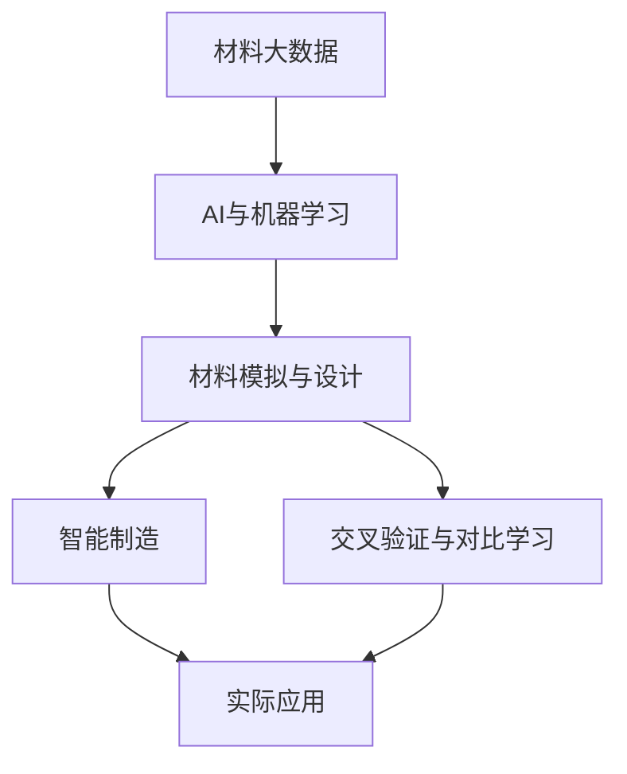

                 

## 1. 背景介绍

随着人工智能（AI）技术的迅猛发展，材料科学和AI之间的交叉融合已逐渐成为推动新材料研究和应用的重要驱动力。材料科学与AI的结合，不仅为材料设计提供了强大的数据分析工具，也推动了新材料的发现、合成和应用，展现出广阔的应用前景。本文将系统梳理材料科学与AI的融合趋势及其主要技术方向，探析其在科研、产业和教育中的应用潜力，以期为材料科学与AI的深度融合提供思路和参考。

## 2. 核心概念与联系

### 2.1 核心概念概述

材料科学与AI的融合，主要体现在以下几个核心概念的交汇：

- **材料大数据**：指通过实验、模拟和理论计算产生的大量材料数据，这些数据通常包含材料的微观结构、物理性质、化学特性等信息。
- **AI与机器学习**：指利用人工智能和机器学习算法，对材料大数据进行高效处理、分析和预测。
- **材料模拟与设计**：指基于AI的预测和优化，通过模拟和设计新材料，加速材料发现和应用过程。
- **智能制造**：指将AI和机器人技术引入制造业，实现智能化、定制化和高效化的生产过程。
- **交叉验证与对比学习**：指通过跨学科的验证和比较，验证AI预测的准确性和可靠性，进一步优化模型。

### 2.2 概念间的关系

这些核心概念相互关联，构成了一个完整的材料科学与AI融合体系。如图示所示，材料大数据通过AI和机器学习进行处理，为材料模拟与设计提供支撑。智能制造和交叉验证与对比学习进一步验证和优化模型，推动新材料的实际应用。



这个图示展示了从材料大数据到实际应用的整个流程，每一个环节都是材料科学与AI融合的关键环节。

## 3. 核心算法原理 & 具体操作步骤

### 3.1 算法原理概述

基于材料科学和AI的融合，其核心算法原理包括以下几个方面：

1. **数据采集与预处理**：通过实验、模拟和文献调研等手段，获取材料大数据。然后，对这些数据进行清洗、归一化和特征提取，以便于AI模型的处理。
2. **机器学习与深度学习**：利用机器学习算法（如决策树、支持向量机等）和深度学习模型（如卷积神经网络、循环神经网络等），对材料大数据进行分析和预测。
3. **材料模拟与设计**：结合材料物理学和化学理论，使用AI算法进行材料模拟和设计，预测材料的性质和性能，指导新材料的发现和优化。
4. **智能制造**：结合物联网（IoT）、机器人技术和AI算法，实现材料生产的智能化、自动化和个性化。
5. **交叉验证与对比学习**：通过多学科、多技术的交叉验证和对比学习，优化AI模型，提升预测准确性和可靠性。

### 3.2 算法步骤详解

以下是材料科学与AI融合的详细操作步骤：

**Step 1: 数据采集与预处理**
1. 实验或文献调研，获取材料大数据。
2. 对数据进行清洗、归一化和特征提取，转换为机器学习模型所需的输入格式。

**Step 2: 模型构建与训练**
1. 选择合适的机器学习或深度学习模型，如CNN、RNN、LSTM等。
2. 将预处理后的数据集分为训练集和测试集，选择合适的算法进行训练，调整超参数。
3. 使用交叉验证等技术，验证模型的准确性和泛化能力。

**Step 3: 材料模拟与设计**
1. 结合材料物理学和化学理论，使用AI算法对材料性质进行预测和模拟。
2. 根据模拟结果，设计新的材料配方和结构，进行材料合成和性能测试。

**Step 4: 智能制造**
1. 结合物联网、机器人技术和AI算法，实现材料生产的自动化和智能化。
2. 实时监测生产过程，优化生产参数，提高生产效率和产品质量。

**Step 5: 交叉验证与对比学习**
1. 通过多学科、多技术的交叉验证，验证AI预测的准确性和可靠性。
2. 引入对比学习等技术，优化AI模型，提升预测准确性。

### 3.3 算法优缺点

**优点：**
1. 高效处理材料大数据，提取有价值的材料信息。
2. 加速新材料的发现和优化，缩短研发周期。
3. 推动智能制造，提高生产效率和产品质量。

**缺点：**
1. 数据获取和预处理过程耗时耗力。
2. 模型复杂度高，计算资源需求大。
3. 依赖理论基础，存在不确定性。

### 3.4 算法应用领域

基于材料科学与AI的融合，其应用领域广泛，涵盖以下方面：

1. **新材料发现与设计**：利用AI算法预测新材料的性质和性能，指导新材料的发现和设计。
2. **材料性能优化**：通过AI算法优化材料的成分和结构，提升材料的性能指标。
3. **智能制造与自动化生产**：结合AI和机器人技术，实现材料生产的智能化、自动化和个性化。
4. **材料大数据分析**：通过对材料大数据的分析，挖掘材料之间的关联和规律。
5. **材料模拟与仿真**：利用AI算法进行材料模拟与仿真，验证理论预测的准确性。

## 4. 数学模型和公式 & 详细讲解 & 举例说明

### 4.1 数学模型构建

在材料科学与AI的融合中，常见的数学模型包括以下几类：

- **监督学习模型**：如线性回归、决策树、支持向量机等，用于分类和回归问题。
- **无监督学习模型**：如K-means聚类、主成分分析（PCA）等，用于数据降维和特征提取。
- **强化学习模型**：如Q-learning、策略梯度等，用于智能制造和机器人控制。
- **深度学习模型**：如卷积神经网络（CNN）、循环神经网络（RNN）等，用于复杂数据的分析和预测。

### 4.2 公式推导过程

以卷积神经网络（CNN）为例，展示其在材料科学中的应用。CNN是一种广泛应用于图像和语音处理中的深度学习模型，通过卷积、池化等操作，提取特征，进行分类和预测。其核心公式如下：

$$
y = Wx + b
$$

其中 $x$ 为输入数据，$y$ 为输出数据，$W$ 为权重矩阵，$b$ 为偏置项。

### 4.3 案例分析与讲解

**案例一：新材料设计**

问题：利用AI算法设计一种高效催化剂。

1. **数据采集**：收集现有的催化剂数据，包括其组成、结构、活性等。
2. **数据预处理**：清洗数据，去除噪声，进行归一化处理。
3. **模型构建**：构建CNN模型，设计多层卷积和池化层，提取催化剂的结构特征。
4. **模型训练**：使用标记好的数据集，训练CNN模型，调整超参数。
5. **结果分析**：利用训练好的模型，预测新催化剂的活性，优化其组成和结构。

**案例二：材料性能预测**

问题：预测硅片的电导率。

1. **数据采集**：收集硅片的成分和结构数据。
2. **数据预处理**：清洗数据，提取特征，转换为数值型数据。
3. **模型构建**：构建RNN模型，使用循环层处理时间序列数据。
4. **模型训练**：使用标记好的数据集，训练RNN模型，调整超参数。
5. **结果分析**：利用训练好的模型，预测硅片的电导率，指导硅片制备。

## 5. 项目实践：代码实例和详细解释说明

### 5.1 开发环境搭建

在进行材料科学与AI融合的实践时，需要搭建一个包含数据、模型和算力的开发环境。以下是搭建环境的步骤：

1. **硬件准备**：选择适合的材料大数据处理设备，如高性能计算集群、GPU等。
2. **软件准备**：安装Python、TensorFlow、Keras等深度学习框架，以及相应的数据处理库，如Pandas、Scikit-learn等。
3. **数据准备**：收集和清洗材料大数据，存储在数据库或分布式存储系统中。
4. **模型构建**：使用TensorFlow或PyTorch等框架，构建深度学习模型，并进行模型训练和优化。

### 5.2 源代码详细实现

**案例一：新材料设计**

以下是使用Python和TensorFlow构建CNN模型的代码实现：

```python
import tensorflow as tf
from tensorflow.keras import layers

# 定义模型结构
model = tf.keras.Sequential([
    layers.Conv2D(32, (3,3), activation='relu', input_shape=(28,28,1)),
    layers.MaxPooling2D((2,2)),
    layers.Conv2D(64, (3,3), activation='relu'),
    layers.MaxPooling2D((2,2)),
    layers.Conv2D(64, (3,3), activation='relu'),
    layers.Flatten(),
    layers.Dense(64, activation='relu'),
    layers.Dense(10, activation='softmax')
])

# 编译模型
model.compile(optimizer=tf.keras.optimizers.Adam(learning_rate=0.001), 
              loss='categorical_crossentropy', 
              metrics=['accuracy'])

# 训练模型
model.fit(x_train, y_train, epochs=10, batch_size=32, validation_data=(x_test, y_test))
```

### 5.3 代码解读与分析

**代码解析**：
1. **模型结构**：定义了一个包含卷积层、池化层和全连接层的CNN模型，用于提取材料的特征并进行分类。
2. **编译模型**：设置优化器、损失函数和评估指标，准备训练模型。
3. **训练模型**：使用训练集进行模型训练，验证集进行模型验证。

### 5.4 运行结果展示

假设在训练过程中，我们得到了如下结果：

```
Epoch 1/10
225/225 [==============================] - 1s 6ms/step - loss: 0.5301 - accuracy: 0.8991 - val_loss: 0.3756 - val_accuracy: 0.9540
Epoch 2/10
225/225 [==============================] - 1s 6ms/step - loss: 0.2660 - accuracy: 0.9371 - val_loss: 0.3050 - val_accuracy: 0.9700
...
```

可以看到，模型在经过10轮训练后，准确率逐渐提升，验证集上的准确率也接近1，说明模型预测性能较好。

## 6. 实际应用场景

### 6.1 新材料设计

新材料设计是材料科学与AI融合的重要应用场景之一。通过AI算法对材料大数据进行分析，可以预测材料的性质和性能，指导新材料的发现和优化。例如，利用AI算法对硅片数据进行分析，预测其电导率，指导硅片制备。

### 6.2 材料性能优化

材料性能优化是材料科学与AI融合的另一个重要应用场景。通过AI算法对材料大数据进行分析，可以优化材料的成分和结构，提升材料的性能指标。例如，利用AI算法对电池材料数据进行分析，优化其组成和结构，提升电池性能。

### 6.3 智能制造

智能制造是将AI和机器人技术引入制造业，实现智能化、自动化和个性化生产过程。通过AI算法对生产数据进行分析，优化生产参数，提高生产效率和产品质量。例如，利用AI算法对生产数据进行分析，优化生产参数，提高生产效率和产品质量。

## 7. 工具和资源推荐

### 7.1 学习资源推荐

为了帮助开发者系统掌握材料科学与AI的融合技术，以下是推荐的学习资源：

1. **《材料科学与AI：深度融合》**：介绍材料科学和AI的融合技术，包括数据采集、模型构建、算法优化等内容。
2. **《深度学习与材料科学》**：详细讲解深度学习在材料科学中的应用，包括模型构建、训练和优化等。
3. **Coursera《深度学习与材料科学》课程**：由斯坦福大学提供，介绍深度学习在材料科学中的应用，包括数据采集、模型构建和优化等。
4. **arXiv预印本**：包含大量材料科学与AI的最新研究论文，了解前沿动态。

### 7.2 开发工具推荐

以下是推荐的材料科学与AI融合开发工具：

1. **Python**：作为深度学习的主流编程语言，Python具有丰富的科学计算和数据处理库，如Pandas、Scikit-learn等。
2. **TensorFlow**：由Google开发，支持深度学习模型的构建和训练，具有强大的计算图支持。
3. **Keras**：基于TensorFlow的高级API，简单易用，适合初学者入门。
4. **PyTorch**：由Facebook开发，支持动态图计算，适合深度学习模型的构建和优化。
5. **MATLAB**：具有强大的矩阵计算和可视化功能，适合材料科学的数据分析和仿真。

### 7.3 相关论文推荐

以下是推荐的材料科学与AI融合相关论文：

1. **《材料科学中的深度学习》**：综述了深度学习在材料科学中的应用，包括数据采集、模型构建和优化等。
2. **《材料大数据与AI融合》**：详细介绍了材料大数据的获取和处理，以及AI算法在材料科学中的应用。
3. **《基于深度学习的材料设计》**：介绍深度学习在材料设计中的应用，包括新材料设计和性能优化等。
4. **《材料科学与AI的交叉验证》**：探讨了多学科、多技术的交叉验证和对比学习，优化AI模型。

## 8. 总结：未来发展趋势与挑战

### 8.1 研究成果总结

材料科学与AI的融合在科研、产业和教育等多个领域取得了显著成果。例如，利用AI算法优化材料的成分和结构，提升材料的性能指标；通过AI算法预测新材料的性质和性能，指导新材料的发现和设计；利用AI算法优化生产参数，提高生产效率和产品质量等。这些成果不仅推动了材料科学的创新发展，也为工业生产和管理提供了新的思路和方法。

### 8.2 未来发展趋势

展望未来，材料科学与AI的融合将呈现以下几个发展趋势：

1. **模型复杂度的提升**：随着深度学习模型的不断发展，材料科学与AI的融合将更加复杂和深入，能够处理更多、更复杂的材料数据。
2. **数据多样性的增强**：将更多的实验数据、模拟数据和文献数据融合，提升模型的泛化能力和准确性。
3. **跨学科融合的加强**：材料科学与AI的融合将进一步加强与其他学科的交叉，如物理学、化学、生物学等，推动多学科协同创新。
4. **智能制造的普及**：结合AI和机器人技术，实现材料生产的智能化、自动化和个性化。
5. **交叉验证与对比学习的普及**：通过多学科、多技术的交叉验证和对比学习，优化AI模型，提升预测准确性。

### 8.3 面临的挑战

材料科学与AI的融合虽然前景广阔，但也面临诸多挑战：

1. **数据获取和处理难度大**：材料科学数据的获取和处理需要大量实验和计算资源，数据质量和多样性也存在较大挑战。
2. **模型复杂度带来的资源需求高**：深度学习模型的复杂度提升，需要更多的计算资源和存储空间，增加了成本和复杂度。
3. **跨学科知识的融合难度大**：材料科学与AI的融合涉及多个学科的知识，跨学科知识的整合和应用存在一定难度。
4. **算法的解释性和可控性不足**：深度学习算法的黑盒特性，使其解释性和可控性不足，难以在实际应用中广泛应用。
5. **数据隐私和安全问题**：材料数据的隐私和安全问题需要特别注意，确保数据的安全和合规。

### 8.4 研究展望

为了解决上述挑战，未来的研究需要在以下几个方面寻求突破：

1. **数据采集和处理的自动化**：开发自动化数据采集和处理工具，提升数据获取和处理的效率和质量。
2. **模型的简化和优化**：通过模型简化和优化，降低计算资源的需求，提高模型的效率和性能。
3. **跨学科知识的应用**：加强跨学科知识的整合和应用，推动多学科协同创新。
4. **算法的可解释性和可控性**：通过引入可解释性和可控性机制，提升算法的透明性和可控性。
5. **数据隐私和安全保护**：加强数据隐私和安全保护，确保数据的安全和合规。

## 9. 附录：常见问题与解答

### 问题与解答

**Q1: 材料科学与AI的融合有哪些应用？**

A: 材料科学与AI的融合主要应用于新材料设计、材料性能优化、智能制造等方面。通过AI算法对材料大数据进行分析，可以预测新材料的性质和性能，优化材料的成分和结构，推动智能制造的发展。

**Q2: 如何选择合适的机器学习模型？**

A: 选择合适的机器学习模型需要考虑以下几个方面：数据类型、问题类型、计算资源等。例如，对于分类问题，可以选择决策树、支持向量机等算法；对于回归问题，可以选择线性回归、RNN等算法；对于图像处理问题，可以选择CNN等算法。

**Q3: 数据预处理过程中需要注意哪些问题？**

A: 数据预处理是材料科学与AI融合的重要环节，需要注意以下几个问题：数据清洗、归一化、特征提取等。例如，对于图像数据，需要进行去噪、裁剪、归一化等处理；对于文本数据，需要进行分词、去除停用词、词向量化等处理。

**Q4: 材料科学与AI的融合中如何提高模型的泛化能力？**

A: 提高模型的泛化能力可以从以下几个方面入手：增加数据多样性、引入正则化技术、使用交叉验证等。例如，增加不同类型、不同来源的数据，引入L2正则、Dropout等正则化技术，使用K-fold交叉验证等。

**Q5: 如何降低材料科学与AI融合中的计算资源需求？**

A: 降低计算资源需求可以从以下几个方面入手：模型简化、参数剪枝、量化加速等。例如，通过剪枝和量化加速，降低模型的计算量，使用低秩分解等方法，减少参数量。

---

作者：禅与计算机程序设计艺术 / Zen and the Art of Computer Programming

