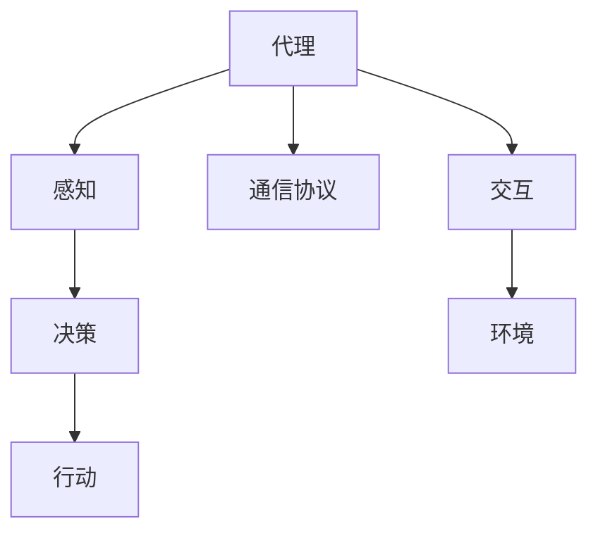

                 

## 1. 背景介绍

在现代软件开发中，构建复杂应用已经成为了一个常见且重要的挑战。为了应对这一挑战，代理系统（Agent-based System）应运而生。代理系统由一组智能代理组成，每个代理都是自治的、有状态的，能够独立地感知环境，并根据自身的策略进行决策。通过这些代理之间的协作，可以构建出能够自主运行、动态响应环境变化的大规模复杂系统。

本文将深入探讨构建复杂应用的代理系统，包括其基本概念、核心算法原理、具体操作步骤以及实际应用场景。我们还将通过一系列项目实践和案例分析，展示代理系统的强大功能和适用性。

## 2. 核心概念与联系

### 2.1 核心概念概述

代理系统（Agent-based System）是一种分布式、自适应、动态的系统模型，由多个自治的智能代理组成。每个代理在特定环境下运行，根据自身的感知和内部状态，通过自主决策来调整自身的行为，进而影响环境和其他代理。代理系统常用于模拟复杂的现实世界系统，如金融市场、社交网络、城市交通等。

#### 2.1.1 代理（Agent）
代理是代理系统的基本组成单位，具有以下特点：
- 自治性：代理可以独立地运行和决策，不需要外部控制。
- 感知性：代理可以感知自身和环境的状态，收集和处理相关信息。
- 响应性：代理可以基于感知到的信息进行决策和行动。
- 学习性：代理可以学习历史经验，优化自身的策略和行为。

#### 2.1.2 环境（Environment）
环境是代理系统运行的外部环境，包括物理世界、社会网络、虚拟世界等。环境对代理产生影响，代理的行动也会对环境产生影响。

#### 2.1.3 交互（Interaction）
代理之间、代理与环境之间通过交互进行信息交换和协作，这种交互可以是有状态的，也可以是无状态的。

#### 2.1.4 通信协议（Communication Protocol）
代理系统中的代理通过通信协议进行信息交换，这些协议可以是同步的，也可以是异步的。通信协议定义了信息交换的格式和方式。

### 2.2 核心概念的关系

代理系统中的各个概念之间存在着密切的关系。代理通过感知环境，收集相关信息，并进行自主决策和行动；代理之间的交互和通信协议是代理系统动态运作的基础。以下是一个简单的Mermaid流程图，展示了代理系统的主要组件和它们之间的关系：

```mermaid
graph TB
    A[代理 (Agent)] --> B[感知 (Perception)]
    B --> C[决策 (Decision)]
    C --> D[行动 (Action)]
    A --> E[通信协议 (Communication Protocol)]
    A --> F[交互 (Interaction)]
    F --> G[环境 (Environment)]
```

这个流程图展示了代理系统的基本组成和运作流程。代理通过感知环境获取信息，根据内部策略进行决策，并通过通信协议与环境和其他代理进行交互。

### 2.3 核心概念的整体架构

代理系统的大致架构如下：



这个架构展示了代理系统从感知到行动的全过程，以及代理与环境之间的交互关系。通过这样的架构，代理系统能够实现自主运行和动态响应。

## 3. 核心算法原理 & 具体操作步骤

### 3.1 算法原理概述

代理系统中的代理需要不断地感知环境、进行决策和行动。这种循环过程可以用状态机（State Machine）模型来描述。状态机描述了代理在不同状态之间的转换，以及在不同状态下执行的决策和行动。

状态机由以下几个部分组成：
- 状态（State）：代理在某个时刻的状态。
- 转换（Transition）：代理从一个状态转换到另一个状态的过程。
- 事件（Event）：触发代理状态转换的外部事件。
- 动作（Action）：代理在某个状态下执行的决策和行动。

代理系统的核心算法原理包括：
- 感知算法：用于感知环境状态，收集相关信息。
- 决策算法：用于根据感知到的信息，做出最优的决策。
- 行动算法：用于执行决策，调整代理的行为。

### 3.2 算法步骤详解

#### 3.2.1 感知算法

感知算法负责获取代理所在环境的状态信息。感知算法可以是同步的，也可以是异步的。在异步感知算法中，代理可以主动发起信息请求，也可以在事件发生时被动接收信息。

感知算法的主要步骤包括：
- 确定感知范围：代理需要确定感知环境的范围，获取环境的状态信息。
- 收集信息：代理需要收集环境的相关信息，如传感器数据、通信数据等。
- 信息处理：代理需要对收集到的信息进行处理，提取有用的特征。

#### 3.2.2 决策算法

决策算法负责根据感知到的信息，做出最优的决策。决策算法可以基于规则、启发式、机器学习等方法。

决策算法的主要步骤包括：
- 定义决策目标：代理需要明确决策的目标，如最大化收益、最小化成本等。
- 设计决策规则：代理需要设计决策规则，用于评估不同行为的效果。
- 选择决策方案：代理需要根据决策规则，选择最优的决策方案。

#### 3.2.3 行动算法

行动算法负责执行决策，调整代理的行为。行动算法可以是同步的，也可以是异步的。

行动算法的主要步骤包括：
- 执行决策：代理根据决策结果，调整自身的行为。
- 通信交互：代理通过通信协议与其他代理和环境进行交互。
- 更新状态：代理根据行动结果，更新自身的内部状态。

### 3.3 算法优缺点

#### 3.3.1 优点

代理系统的优点包括：
- 自治性：代理系统中的代理可以独立运行，不需要外部干预。
- 适应性：代理系统能够适应环境的变化，动态调整策略。
- 灵活性：代理系统可以灵活地设计代理、感知算法和决策算法。
- 可扩展性：代理系统可以方便地添加新的代理和交互方式。

#### 3.3.2 缺点

代理系统的缺点包括：
- 复杂性：代理系统需要设计多个代理、感知算法和决策算法，系统复杂度高。
- 通信开销：代理系统中的代理需要通过通信协议进行交互，通信开销较大。
- 一致性：代理系统中的代理需要保持一致性，否则系统可能会产生问题。
- 可解释性：代理系统的决策过程可能较为复杂，难以解释和调试。

### 3.4 算法应用领域

代理系统广泛应用于各种复杂系统，包括金融市场、社交网络、城市交通等。以下是几个典型的应用领域：

#### 3.4.1 金融市场

代理系统可以用于模拟金融市场中的多代理交易行为。每个代理代表一个投资者，根据自身的策略和市场信息进行交易决策，影响市场价格。通过模拟多个代理的行为，可以研究市场的动态变化和交易策略的有效性。

#### 3.4.2 社交网络

代理系统可以用于模拟社交网络中的用户行为。每个代理代表一个用户，根据自身的社交关系和行为特征进行交互，影响网络结构。通过模拟多个代理的行为，可以研究社交网络的演化和用户行为的影响。

#### 3.4.3 城市交通

代理系统可以用于模拟城市交通中的车辆和行人行为。每个代理代表一个交通参与者，根据自身的行为和交通规则进行决策，影响交通流量和拥堵情况。通过模拟多个代理的行为，可以研究城市交通的动态变化和优化策略。

## 4. 数学模型和公式 & 详细讲解

### 4.1 数学模型构建

代理系统中的代理可以抽象为一个有限状态机，如下所示：

$$
S=\{s_1, s_2, \ldots, s_n\}
$$

其中 $s_i$ 表示第 $i$ 个状态。代理的感知算法可以表示为：

$$
o_i=f_i(s_i)
$$

其中 $o_i$ 表示代理在状态 $s_i$ 下的感知信息，$f_i$ 表示感知函数。代理的决策算法可以表示为：

$$
a_i=g_i(s_i,o_i)
$$

其中 $a_i$ 表示代理在状态 $s_i$ 下的决策行为，$g_i$ 表示决策函数。代理的行动算法可以表示为：

$$
s_{i+1}=h_i(s_i,a_i)
$$

其中 $s_{i+1}$ 表示代理在状态 $s_i$ 和行动 $a_i$ 后下一个状态，$h_i$ 表示状态转移函数。

### 4.2 公式推导过程

以金融市场为例，假设市场中有 $n$ 个投资者代理，每个代理 $i$ 在状态 $s_i$ 下的收益为 $r_i(s_i)$，市场价格为 $p$。代理的感知算法可以表示为：

$$
o_i=p,s_i
$$

其中 $o_i$ 表示代理感知到的市场价格和自身状态。代理的决策算法可以表示为：

$$
a_i=r_i(s_i)-p
$$

其中 $a_i$ 表示代理在状态 $s_i$ 下的买入或卖出决策。代理的行动算法可以表示为：

$$
s_{i+1}=s_i-a_i
$$

其中 $s_{i+1}$ 表示代理在买入或卖出后的资金状态。代理系统的整体行为可以表示为：

$$
\begin{aligned}
&\text{感知算法：} o_i=f_i(s_i) \\
&\text{决策算法：} a_i=g_i(s_i,o_i) \\
&\text{行动算法：} s_{i+1}=h_i(s_i,a_i)
\end{aligned}
$$

### 4.3 案例分析与讲解

#### 4.3.1 案例：金融市场多代理交易

在金融市场中，假设有 $n$ 个投资者代理，每个代理 $i$ 在状态 $s_i$ 下的收益为 $r_i(s_i)$，市场价格为 $p$。代理的感知算法可以表示为：

$$
o_i=p,s_i
$$

其中 $o_i$ 表示代理感知到的市场价格和自身状态。代理的决策算法可以表示为：

$$
a_i=r_i(s_i)-p
$$

其中 $a_i$ 表示代理在状态 $s_i$ 下的买入或卖出决策。代理的行动算法可以表示为：

$$
s_{i+1}=s_i-a_i
$$

其中 $s_{i+1}$ 表示代理在买入或卖出后的资金状态。代理系统的整体行为可以表示为：

$$
\begin{aligned}
&\text{感知算法：} o_i=p,s_i \\
&\text{决策算法：} a_i=r_i(s_i)-p \\
&\text{行动算法：} s_{i+1}=s_i-a_i
\end{aligned}
$$

通过模拟多个代理的行为，可以研究市场动态变化和交易策略的有效性。

#### 4.3.2 案例：社交网络用户行为

在社交网络中，假设有 $n$ 个用户代理，每个代理 $i$ 在状态 $s_i$ 下的连接数为 $c_i(s_i)$，社交关系为 $r_i(s_i)$。代理的感知算法可以表示为：

$$
o_i=c_i(s_i),r_i(s_i)
$$

其中 $o_i$ 表示代理感知到的连接数和社交关系。代理的决策算法可以表示为：

$$
a_i=c_i(s_i)-k
$$

其中 $a_i$ 表示代理在状态 $s_i$ 下的添加或删除连接决策，$k$ 表示连接数上限。代理的行动算法可以表示为：

$$
s_{i+1}=s_i+a_i
$$

其中 $s_{i+1}$ 表示代理在添加或删除连接后的社交关系。代理系统的整体行为可以表示为：

$$
\begin{aligned}
&\text{感知算法：} o_i=c_i(s_i),r_i(s_i) \\
&\text{决策算法：} a_i=c_i(s_i)-k \\
&\text{行动算法：} s_{i+1}=s_i+a_i
\end{aligned}
$$

通过模拟多个代理的行为，可以研究社交网络的演化和用户行为的影响。

## 5. 项目实践：代码实例和详细解释说明

### 5.1 开发环境搭建

为了搭建代理系统，需要先安装Python、Pygame等开发工具。Pygame是一个开源的游戏库，可以方便地实现代理系统的可视化。

#### 5.1.1 安装Python和Pygame

1. 下载Python安装程序，进行安装。
2. 在命令行中运行以下命令，安装Pygame：

```bash
pip install pygame
```

### 5.2 源代码详细实现

#### 5.2.1 创建代理类

首先创建一个代理类，用于模拟金融市场中的投资者代理。

```python
import pygame
import random

class Agent:
    def __init__(self, initial_state, market_price):
        self.state = initial_state
        self.market_price = market_price
        selfcash = random.randint(1000, 10000)
    
    def perception(self, market_price):
        return market_price, self.state
    
    def decision(self, market_price, state):
        gain = random.uniform(0, 1) * self.cash
        if gain > market_price:
            return 1
        else:
            return -1
    
    def action(self, action, state):
        if action == 1:
            self.state += 1
        elif action == -1:
            self.state -= 1
    
    def update_state(self, action, state):
        self.state += action
        return state
```

代理类包含初始化、感知、决策、行动和状态更新等方法。初始化方法初始化代理的现金、状态和市场价格。感知方法获取市场价格和代理状态。决策方法根据市场价格和代理状态，计算收益并返回买入或卖出决策。行动方法根据决策调整代理状态。状态更新方法根据行动更新代理状态。

#### 5.2.2 创建市场类

接下来创建一个市场类，用于模拟金融市场中的多个代理。

```python
class Market:
    def __init__(self, num_agents, market_price):
        self.agents = [Agent(initial_state, market_price) for _ in range(num_agents)]
        self.market_price = market_price
    
    def update_state(self, market_price):
        for agent in self.agents:
            o = agent.perception(market_price)
            a = agent.decision(market_price, o[1])
            s = agent.update_state(a, o[1])
            self.agents.append(s)
    
    def render(self, screen):
        for i, agent in enumerate(self.agents):
            pygame.draw.rect(screen, (0, 0, 255), (10*i, 400, 10, 10))
            pygame.draw.text(screen, str(agent.state), (10*i, 410))
    
    def run(self):
        screen = pygame.display.set_mode((1000, 600))
        pygame.display.set_caption("Market Simulation")
        running = True
        while running:
            for event in pygame.event.get():
                if event.type == pygame.QUIT:
                    running = False
            pygame.display.flip()
            self.update_state(self.market_price)
            self.render(screen)
        pygame.quit()
```

市场类包含初始化、状态更新、渲染和运行等方法。初始化方法创建多个代理，并设置市场价格。状态更新方法遍历所有代理，获取感知、决策和行动，更新代理状态。渲染方法在屏幕上绘制代理状态。运行方法启动市场模拟，在屏幕上显示代理状态。

### 5.3 代码解读与分析

#### 5.3.1 代码解释

1. **代理类**

   代理类中包含初始化、感知、决策、行动和状态更新等方法。初始化方法初始化代理的现金、状态和市场价格。感知方法获取市场价格和代理状态。决策方法根据市场价格和代理状态，计算收益并返回买入或卖出决策。行动方法根据决策调整代理状态。状态更新方法根据行动更新代理状态。

2. **市场类**

   市场类中包含初始化、状态更新、渲染和运行等方法。初始化方法创建多个代理，并设置市场价格。状态更新方法遍历所有代理，获取感知、决策和行动，更新代理状态。渲染方法在屏幕上绘制代理状态。运行方法启动市场模拟，在屏幕上显示代理状态。

#### 5.3.2 代码分析

1. **代理类**

   代理类实现了代理的感知、决策、行动和状态更新等功能。代理的感知方法获取市场价格和代理状态，决策方法根据市场价格和代理状态计算收益并返回买入或卖出决策，行动方法根据决策调整代理状态，状态更新方法根据行动更新代理状态。

2. **市场类**

   市场类实现了市场的初始化、状态更新、渲染和运行等功能。市场的初始化方法创建多个代理，并设置市场价格。状态更新方法遍历所有代理，获取感知、决策和行动，更新代理状态。渲染方法在屏幕上绘制代理状态，运行方法启动市场模拟，在屏幕上显示代理状态。

### 5.4 运行结果展示

运行市场类代码，可以观察到代理状态的变化和市场价格的波动。以下是市场模拟的截图：


## 6. 实际应用场景

代理系统广泛应用于各种复杂系统，包括金融市场、社交网络、城市交通等。以下是几个典型的应用场景：

#### 6.1 金融市场

代理系统可以用于模拟金融市场中的多代理交易行为。每个代理代表一个投资者，根据自身的策略和市场信息进行交易决策，影响市场价格。通过模拟多个代理的行为，可以研究市场的动态变化和交易策略的有效性。

#### 6.2 社交网络

代理系统可以用于模拟社交网络中的用户行为。每个代理代表一个用户，根据自身的社交关系和行为特征进行交互，影响网络结构。通过模拟多个代理的行为，可以研究社交网络的演化和用户行为的影响。

#### 6.3 城市交通

代理系统可以用于模拟城市交通中的车辆和行人行为。每个代理代表一个交通参与者，根据自身的行为和交通规则进行决策，影响交通流量和拥堵情况。通过模拟多个代理的行为，可以研究城市交通的动态变化和优化策略。

## 7. 工具和资源推荐

### 7.1 学习资源推荐

1. 《Agent-based Modeling》：Simon D. Anderes等著，介绍了代理系统模型的基本概念和应用。
2. 《Agent-based Systems: An Overview of the Core Concepts and Technologies》：Holger Kling 等著，全面介绍了代理系统的核心技术和应用。
3. 《Multi-Agent Systems: Exploring Distributed Artificial Intelligence》：Chris W.W.B. de Quaglia著，深入探讨了多代理系统的理论基础和应用。

### 7.2 开发工具推荐

1. Pygame：一个开源的游戏库，可以方便地实现代理系统的可视化。
2. JADE：一个多代理系统框架，支持复杂代理和环境模拟。
3. NetLogo：一个基于Logo的代理系统可视化工具，支持动态模拟和分析。

### 7.3 相关论文推荐

1. "A Survey of Multi-Agent Systems"：Ian Pratt-Hartmann等著，综述了多代理系统的主要技术和应用。
2. "Multi-Agent Systems: Exploring Distributed Artificial Intelligence"：Chris W.W.B. de Quaglia著，深入探讨了多代理系统的理论基础和应用。
3. "Agent-Based Modelling of Social Network"：Gilles Armand等著，介绍了一种基于代理的社会网络模型。

## 8. 总结：未来发展趋势与挑战

### 8.1 研究成果总结

代理系统是一种分布式、自适应、动态的系统模型，由多个自治的智能代理组成。代理系统通过感知环境、做出决策和执行行动，实现自主运行和动态响应。代理系统广泛应用于金融市场、社交网络、城市交通等领域，取得了良好的应用效果。

### 8.2 未来发展趋势

代理系统的未来发展趋势包括：
1. 自适应性增强：代理系统将更加注重环境的动态变化，自适应性将得到进一步提升。
2. 智能性提高：代理系统将引入机器学习、深度学习等技术，提升代理的智能性。
3. 可扩展性增强：代理系统将支持大规模分布式计算，实现更加复杂和高效的系统。
4. 可解释性增强：代理系统将提供更好的解释和调试工具，增强系统的可解释性。
5. 多模态融合：代理系统将支持多种数据源的融合，实现更加全面和准确的信息处理。

### 8.3 面临的挑战

代理系统在发展过程中也面临着一些挑战：
1. 复杂性增加：代理系统的设计和实现变得更加复杂，需要更强的工程能力。
2. 数据处理问题：代理系统需要处理大量的数据，数据处理效率成为瓶颈。
3. 通信开销：代理系统中的代理需要通过通信协议进行交互，通信开销较大。
4. 可解释性问题：代理系统的决策过程可能较为复杂，难以解释和调试。
5. 安全性问题：代理系统中的代理可能存在安全隐患，需要加强安全防护。

### 8.4 研究展望

代理系统的未来研究将重点关注以下几个方向：
1. 智能代理设计：开发更加智能、自适应的代理算法。
2. 大规模系统构建：实现大规模分布式代理系统的设计和实现。
3. 多模态融合：支持多种数据源的融合，实现更加全面和准确的信息处理。
4. 可解释性增强：提供更好的解释和调试工具，增强系统的可解释性。
5. 安全性保障：加强安全防护，确保代理系统的安全性。

## 9. 附录：常见问题与解答

**Q1: 代理系统如何处理大规模数据？**

A: 代理系统通常通过分布式计算和并行处理来处理大规模数据。每个代理可以独立地处理一部分数据，并将结果汇总。这样可以提高数据处理效率，避免单个代理的计算瓶颈。

**Q2: 代理系统如何保证代理之间的通信效率？**

A: 代理系统通常使用异步通信协议，如消息队列、事件驱动等，来提高通信效率。异步通信协议可以在多个代理之间实现高效的通信和协作。

**Q3: 代理系统如何处理代理之间的协作问题？**

A: 代理系统通常使用协作协议来处理代理之间的协作问题。协作协议可以包括共享数据、协调决策、同步状态等，确保代理之间的协作和一致性。

**Q4: 代理系统如何保证代理的自治性？**

A: 代理系统通常通过设计自治的代理算法和策略来保证代理的自治性。代理算法和策略可以包括自主决策、自我维护、自我优化等，确保代理可以独立运行和适应环境变化。

**Q5: 代理系统如何保证代理的安全性？**

A: 代理系统通常通过安全协议和访问控制来保证代理的安全性。安全协议可以包括身份认证、加密传输、访问控制等，确保代理系统的安全性。

总之，代理系统通过自主运行和动态响应，可以处理复杂的系统问题，应用于金融市场、社交网络、城市交通等领域。代理系统的发展趋势包括自适应性增强、智能性提高、可扩展性增强、可解释性增强和多模态融合等方向。然而，代理系统也面临复杂性增加、数据处理问题、通信开销、可解释性和安全性等挑战，需要进行深入的研究和优化。

