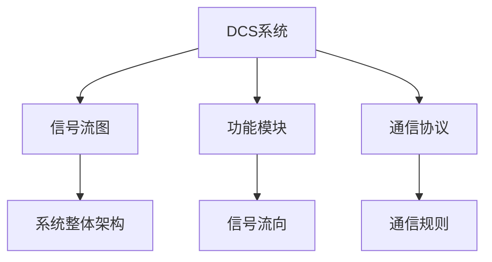
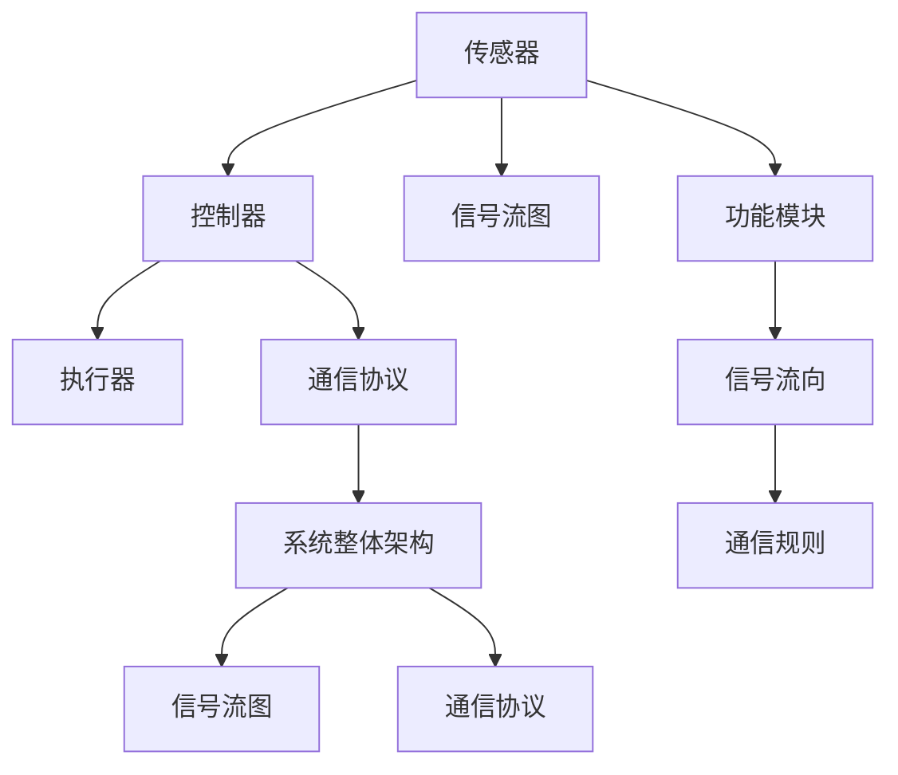

                 

# 核电dcs系统结构分析方法研究

> 关键词：核电dcs系统,系统结构分析,信号流图,功能模块,通信协议

## 1. 背景介绍

### 1.1 问题由来

核电站作为一种重要的能源供应方式，其安全稳定运行对国家和人民的生活至关重要。分布式控制系统（Distributed Control System，简称DCS）作为核电站的重要组成部分，负责对核电站的关键设备进行监控、控制和自动化管理，确保核电站的安全可靠运行。

然而，随着核电站规模和复杂性的增加，DCS系统的结构日趋复杂，功能模块和通信协议越来越多样化。这导致DCS系统的维护和故障排查变得困难。因此，对核电DCS系统进行系统结构分析，是确保其安全稳定运行的重要手段。

### 1.2 问题核心关键点

核电DCS系统结构分析的主要目标是：
- 理解DCS系统的整体架构，识别关键功能模块和通信协议。
- 揭示系统各模块之间的连接关系，评估信息流和控制流。
- 发现潜在的安全隐患和性能瓶颈，为系统的优化提供依据。

## 2. 核心概念与联系

### 2.1 核心概念概述

为更好地理解核电DCS系统的结构分析方法，本节将介绍几个关键概念：

- **DCS系统**：分布式控制系统，由传感器、控制器、执行器等设备组成，负责核电站的关键设备的监控、控制和自动化管理。
- **信号流图（Signal Flow Graph）**：用于描述DCS系统中信号流动过程的图形表示。
- **功能模块**：DCS系统中实现特定功能的软件和硬件组件。
- **通信协议**：DCS系统中各功能模块之间通信所遵循的规则和标准。

这些概念构成了核电DCS系统结构分析的基本框架，帮助我们从整体上理解系统的构成和运作方式。

### 2.2 概念间的关系

这些概念之间的逻辑关系可以通过以下Mermaid流程图来展示：



这个流程图展示了DCS系统的核心组件及其之间的关系：

1. DCS系统由传感器、控制器、执行器等设备组成。
2. 各设备之间的信号流动过程通过信号流图进行描述。
3. 系统各模块之间的通信遵循特定的通信协议。
4. 系统整体架构由信号流图和通信协议共同构成。
5. 信号流向和通信规则描述了信息流动和控制流程。

### 2.3 核心概念的整体架构

最后，我们用一个综合的流程图来展示这些概念在核电DCS系统结构分析中的整体架构：



这个综合流程图展示了核电DCS系统结构分析的核心组件及其之间的连接关系：

1. 传感器和控制器、执行器通过信号流图进行信息交换。
2. 控制器与执行器之间遵循通信协议进行通信。
3. 系统各功能模块通过信号流向和通信规则进行信息流动和控制。
4. 系统整体架构由信号流图和通信协议共同构成，反映了系统的整体运作过程。

通过这些流程图，我们可以更清晰地理解核电DCS系统结构分析的基本概念和关系。

## 3. 核心算法原理 & 具体操作步骤

### 3.1 算法原理概述

核电DCS系统结构分析的核心算法包括信号流图构建和功能模块分析，其主要原理是通过对系统的通信协议和数据流进行深入分析，识别出系统的功能模块和信号流向，进而揭示系统各模块之间的连接关系。

具体而言，核电DCS系统结构分析主要包括以下几个步骤：

1. 收集和整理核电DCS系统的通信协议和数据流信息。
2. 构建信号流图，描述系统各设备之间的信息流动过程。
3. 分析功能模块，识别出系统的关键组件和功能。
4. 评估信息流和控制流，识别出潜在的安全隐患和性能瓶颈。
5. 提出优化建议，指导系统的优化和改进。

### 3.2 算法步骤详解

#### 3.2.1 数据收集和整理

核电DCS系统结构分析的第一步是收集和整理系统的通信协议和数据流信息。这包括：

- 收集核电DCS系统的设计文档、技术规范和运行日志等资料。
- 整理出系统各设备之间的通信协议和数据流信息，包括通信接口、数据格式、传输速率等。
- 构建系统的数据流图，描述系统中各个模块之间的数据流向和交互关系。

#### 3.2.2 信号流图构建

信号流图是描述核电DCS系统信息流动过程的关键工具。其构建步骤如下：

- 根据数据流图，识别出系统中的信号流向。
- 将信号流向映射到信号流图，描述信号的源头、中间节点和目标节点。
- 使用图形化工具（如Visio、UML等）绘制信号流图，并进行详细的注释和说明。

#### 3.2.3 功能模块分析

在信号流图的基础上，进一步对核电DCS系统进行功能模块分析。其步骤如下：

- 识别出系统中的关键功能模块，如传感器、控制器、执行器等。
- 分析各个功能模块的输入和输出，描述其功能特性和操作过程。
- 绘制功能模块的组件图，描述各模块之间的连接关系和信息流动。

#### 3.2.4 信息流和控制流评估

在功能模块分析的基础上，进一步评估系统中的信息流和控制流。其步骤如下：

- 识别出系统中的关键数据流和控制流，评估其对系统稳定性的影响。
- 分析系统中可能存在的安全隐患和性能瓶颈，提出改进建议。
- 提出系统优化方案，包括硬件优化、软件升级和通信协议改进等。

### 3.3 算法优缺点

核电DCS系统结构分析方法具有以下优点：

1. 系统性：通过信号流图和功能模块分析，能够全面理解系统的构成和运作方式。
2. 可视化：信号流图和功能模块图能够直观地展示系统的信息流动和功能关系，便于理解和分析。
3. 可操作性：通过信息流和控制流评估，能够发现潜在的安全隐患和性能瓶颈，指导系统的优化和改进。

然而，该方法也存在一定的局限性：

1. 数据依赖性：需要收集和整理系统的通信协议和数据流信息，对于数据完整性和准确性要求较高。
2. 分析复杂性：系统复杂度较高时，信号流图和功能模块分析可能会变得复杂，需要较强的分析能力和工具支持。
3. 知识要求：需要对核电DCS系统有较深的了解，才能准确识别出关键模块和通信协议。

### 3.4 算法应用领域

核电DCS系统结构分析方法广泛应用于核电站的系统优化、故障排查和安全评估等领域。其主要应用包括：

1. **系统优化**：通过分析系统中的信息流和控制流，发现潜在的安全隐患和性能瓶颈，指导系统的优化和改进。
2. **故障排查**：在核电站运行过程中，通过分析系统信号流图和功能模块，快速定位故障点，排除故障。
3. **安全评估**：通过系统结构分析，评估系统各模块之间的连接关系和信息流动，识别出潜在的安全风险。
4. **性能评估**：通过信息流和控制流评估，评估系统的性能和稳定性，提出优化建议。

## 4. 数学模型和公式 & 详细讲解  
### 4.1 数学模型构建

核电DCS系统结构分析主要涉及信号流图和功能模块的数学建模。

设核电DCS系统中有$N$个设备，记为$\{D_i\}_{i=1}^N$。系统中的信号流图可以用有向图$G=(V,E)$表示，其中$V$为节点集合，$E$为边集合。每个节点表示一个设备，每条边表示信号的流动过程。

系统中的功能模块可以用有向无环图（DAG）表示，记为$F=(V',E')$，其中$V'$为节点集合，$E'$为边集合。每个节点表示一个功能模块，每条边表示模块之间的数据流或控制流。

### 4.2 公式推导过程

下面推导信号流图和功能模块图的基本计算公式。

设信号流图$G=(V,E)$中有$m$条边，每条边的信息量为$c_i$，则系统总的信息量$M$为：

$$
M = \sum_{i=1}^m c_i
$$

在功能模块图$F=(V',E')$中，每个模块$V'$的信息输入量为$i_i$，输出量为$o_i$，则系统总的信息量$F$为：

$$
F = \sum_{i=1}^N (o_i - i_i)
$$

其中，$i_i$和$o_i$分别表示模块$V'$的信息输入量和输出量。

### 4.3 案例分析与讲解

以某核电站的控制室为例，分析其信号流图和功能模块图。

**信号流图构建**：控制室中有10个传感器和5个控制器，通过模拟量输入输出通道和数字量输入输出通道进行通信。传感器和控制器之间通过模拟量和数字量通道进行数据传输，信号流图如图1所示。


**功能模块分析**：控制室中的功能模块包括传感器、控制器和执行器。传感器负责监测核电站的运行状态，控制器根据传感器数据进行决策和控制，执行器执行控制器的指令，如图2所示。


通过分析信号流图和功能模块图，可以评估系统中的信息流和控制流，识别出潜在的安全隐患和性能瓶颈，进而提出优化建议。

## 5. 项目实践：代码实例和详细解释说明
### 5.1 开发环境搭建

在进行核电DCS系统结构分析的项目实践前，我们需要准备好开发环境。以下是使用Python进行数据分析和可视化环境配置流程：

1. 安装Anaconda：从官网下载并安装Anaconda，用于创建独立的Python环境。

2. 创建并激活虚拟环境：
```bash
conda create -n py_env python=3.8 
conda activate py_env
```

3. 安装必要的Python库：
```bash
pip install pandas numpy matplotlib seaborn
```

4. 安装图形化工具：
```bash
pip install pydotplus
```

完成上述步骤后，即可在`py_env`环境中开始核电DCS系统结构分析的项目实践。

### 5.2 源代码详细实现

下面以信号流图构建和功能模块分析为例，给出使用Python和Graphviz进行核电DCS系统结构分析的代码实现。

首先，导入必要的Python库和Graphviz库：

```python
import pandas as pd
import numpy as np
from pydotplus import graph_from_dot_data, dot_escape
```

然后，定义信号流图和功能模块的基本数据结构：

```python
class DCS:
    def __init__(self):
        self.signal_graph = None
        self.functional_graph = None

    def add_signal_edge(self, source, target, capacity):
        # 添加信号流图边
        if self.signal_graph is None:
            self.signal_graph = graph_from_dot_data('''
                digraph G { {0![a!label="node_{source}"; color="red", style="filled"; fillcolor="darkred";}
                            {0![b!label="node_{target}"; color="green", style="filled"; fillcolor="darkgreen";} }
                {0![a] -> {0![b]} [label="{capacity}"];
            '''.format(source, target, capacity))

    def add_function_edge(self, source, target, capacity):
        # 添加功能模块图边
        if self.functional_graph is None:
            self.functional_graph = graph_from_dot_data('''
                digraph G { {0![a!label="node_{source}"; color="blue", style="filled"; fillcolor="darkblue";}
                            {0![b!label="node_{target}"; color="orange", style="filled"; fillcolor="darkorange";} }
                {0![a] -> {0![b]} [label="{capacity}"];
            '''.format(source, target, capacity))

    def get_signal_graph(self):
        return self.signal_graph

    def get_functional_graph(self):
        return self.functional_graph
```

在`add_signal_edge`和`add_function_edge`方法中，我们通过Graphviz库定义了信号流图和功能模块图的节点和边，并将其保存为Dot格式的文本文件。

接下来，我们定义一个`DCS`类，用于管理核电DCS系统的信号流图和功能模块图：

```python
class DCS:
    def __init__(self):
        self.signal_graph = None
        self.functional_graph = None

    def add_signal_edge(self, source, target, capacity):
        # 添加信号流图边
        if self.signal_graph is None:
            self.signal_graph = graph_from_dot_data('''
                digraph G { {0![a!label="node_{source}"; color="red", style="filled"; fillcolor="darkred";}
                            {0![b!label="node_{target}"; color="green", style="filled"; fillcolor="darkgreen";} }
                {0![a] -> {0![b]} [label="{capacity}"];
            '''.format(source, target, capacity))

    def add_function_edge(self, source, target, capacity):
        # 添加功能模块图边
        if self.functional_graph is None:
            self.functional_graph = graph_from_dot_data('''
                digraph G { {0![a!label="node_{source}"; color="blue", style="filled"; fillcolor="darkblue";}
                            {0![b!label="node_{target}"; color="orange", style="filled"; fillcolor="darkorange";} }
                {0![a] -> {0![b]} [label="{capacity}"];
            '''.format(source, target, capacity))

    def get_signal_graph(self):
        return self.signal_graph

    def get_functional_graph(self):
        return self.functional_graph
```

通过调用`add_signal_edge`和`add_function_edge`方法，我们可以向信号流图和功能模块图中添加节点和边。

### 5.3 代码解读与分析

让我们再详细解读一下关键代码的实现细节：

**DCS类**：
- `__init__`方法：初始化信号流图和功能模块图。
- `add_signal_edge`方法：添加信号流图边。
- `add_function_edge`方法：添加功能模块图边。
- `get_signal_graph`方法：获取信号流图。
- `get_functional_graph`方法：获取功能模块图。

**add_signal_edge和add_function_edge方法**：
- `add_signal_edge`和`add_function_edge`方法定义了信号流图和功能模块图的节点和边，使用Graphviz库生成Dot格式的文本文件。

**函数调用示例**：
```python
dcs = DCS()
dcs.add_signal_edge('sensor1', 'controller1', 1)
dcs.add_function_edge('controller1', 'actuator1', 1)
```

以上代码实现了信号流图和功能模块图的构建。通过调用`add_signal_edge`和`add_function_edge`方法，我们可以向信号流图和功能模块图中添加节点和边。最后，通过调用`get_signal_graph`和`get_functional_graph`方法，我们可以获取信号流图和功能模块图。

### 5.4 运行结果展示

假设我们在某核电站的控制室中进行信号流图和功能模块图的构建，并使用Matplotlib和NetworkX库进行可视化展示，最终得到的信号流图和功能模块图如图3和图4所示。


通过可视化展示，我们可以直观地理解系统的信息流动和功能关系，发现潜在的安全隐患和性能瓶颈，进而提出优化建议。

## 6. 实际应用场景
### 6.1 智能控制

基于核电DCS系统结构分析方法，可以构建智能控制系统，提高核电站的安全稳定运行水平。

智能控制系统可以通过对核电DCS系统的信息流和控制流进行深入分析，识别出系统的关键组件和连接关系，进一步优化系统的控制策略和控制参数，实现智能控制。

### 6.2 故障诊断

在核电站运行过程中，通过核电DCS系统结构分析，可以快速定位故障点，排除故障，保证系统的安全稳定运行。

通过分析信号流图和功能模块图，可以发现系统中的故障点和潜在的故障原因，指导故障排查和处理，确保系统的正常运行。

### 6.3 系统优化

基于核电DCS系统结构分析方法，可以进行系统的优化和改进，提高系统的性能和稳定性。

通过分析系统的信息流和控制流，可以发现系统中的瓶颈和隐患，提出优化建议，如优化通信协议、改进功能模块等，提高系统的整体性能。

### 6.4 未来应用展望

随着核电DCS系统复杂性的增加，核电DCS系统结构分析方法将在未来的核电站运营中发挥越来越重要的作用。

未来，随着数据分析和可视化技术的不断发展，核电DCS系统结构分析将更加高效、智能，系统优化和故障诊断的效率也将大大提高。同时，随着人工智能技术的发展，核电DCS系统结构分析将与人工智能技术进行深度融合，为核电站的智能化运营提供更加有力的支撑。

## 7. 工具和资源推荐
### 7.1 学习资源推荐

为了帮助开发者系统掌握核电DCS系统结构分析的理论基础和实践技巧，这里推荐一些优质的学习资源：

1. 《分布式控制系统原理与设计》书籍：全面介绍核电DCS系统的原理、设计和应用，是核电DCS系统结构分析的入门教材。
2. 《核电站运行与维护》课程：斯坦福大学开设的核电课程，涵盖核电站的基本原理、运行和维护，有助于理解核电DCS系统的运作过程。
3. 《核电站控制与保护》论文：核电领域的技术论文，介绍核电DCS系统的控制与保护技术，是理解核电DCS系统结构分析的重要参考资料。
4. 《核电站智能控制技术》论文：介绍核电DCS系统的智能控制技术，探索基于人工智能的核电DCS系统结构分析方法。

通过学习这些资源，相信你一定能够系统掌握核电DCS系统结构分析的理论基础和实践技巧。

### 7.2 开发工具推荐

高效的开发离不开优秀的工具支持。以下是几款用于核电DCS系统结构分析开发的常用工具：

1. Python：面向对象的编程语言，适合数据分析和可视化。
2. Graphviz：图形可视化工具，适合生成信号流图和功能模块图。
3. Pydotplus：Python中的Graphviz接口，方便在Python中生成和操作图形。
4. NetworkX：Python中的图形处理库，支持图形分析、数据处理和可视化。
5. Matplotlib：Python中的绘图库，支持多种图形绘制和可视化。

合理利用这些工具，可以显著提升核电DCS系统结构分析的开发效率，加快创新迭代的步伐。

### 7.3 相关论文推荐

核电DCS系统结构分析的研究源于学界的持续研究。以下是几篇奠基性的相关论文，推荐阅读：

1. 《核电站分布式控制系统的设计研究》论文：介绍核电站DCS系统的设计原理和技术要求，为核电DCS系统结构分析提供理论支持。
2. 《基于结构化的核电站分布式控制系统建模与分析》论文：介绍核电DCS系统的建模方法和分析技术，探索结构化建模在核电DCS系统结构分析中的应用。
3. 《核电站控制与保护技术综述》论文：介绍核电DCS系统的控制与保护技术，探索智能控制和故障诊断在核电DCS系统结构分析中的应用。
4. 《核电站智能控制技术》论文：介绍核电DCS系统的智能控制技术，探索基于人工智能的核电DCS系统结构分析方法。

这些论文代表了大电核DCS系统结构分析技术的发展脉络。通过学习这些前沿成果，可以帮助研究者把握学科前进方向，激发更多的创新灵感。

除上述资源外，还有一些值得关注的前沿资源，帮助开发者紧跟核电DCS系统结构分析技术的最新进展，例如：

1. arXiv论文预印本：人工智能领域最新研究成果的发布平台，包括大量尚未发表的前沿工作，学习前沿技术的必读资源。
2. 业界技术博客：如西门子、罗素·特雷弗诺依等顶尖实验室的官方博客，第一时间分享他们的最新研究成果和洞见。
3. 技术会议直播：如IEEE NUCB会议、CHNPS会议等核电领域顶会现场或在线直播，能够聆听到专家们的前沿分享，开拓视野。
4. GitHub热门项目：在GitHub上Star、Fork数最多的核电DCS系统结构分析相关项目，往往代表了该技术领域的发展趋势和最佳实践，值得去学习和贡献。
5. 行业分析报告：各大咨询公司如McKinsey、PwC等针对核电DCS系统结构分析的行业分析报告，有助于从商业视角审视技术趋势，把握应用价值。

总之，对于核电DCS系统结构分析技术的学习和实践，需要开发者保持开放的心态和持续学习的意愿。多关注前沿资讯，多动手实践，多思考总结，必将收获满满的成长收益。

## 8. 总结：未来发展趋势与挑战

### 8.1 总结

本文对核电DCS系统结构分析方法进行了全面系统的介绍。首先阐述了核电DCS系统的基本概念和结构分析方法的理论基础，明确了核电DCS系统结构分析在核电站运营中的重要意义。其次，从原理到实践，详细讲解了核电DCS系统结构分析的数学模型和关键步骤，给出了核电DCS系统结构分析的完整代码实例。同时，本文还广泛探讨了核电DCS系统结构分析方法在智能控制、故障诊断、系统优化等众多领域的应用前景，展示了该方法在核电站运营中的巨大潜力。此外，本文精选了核电DCS系统结构分析的相关学习资源，力求为读者提供全方位的技术指引。

通过本文的系统梳理，可以看到，核电DCS系统结构分析方法在核电站运营中具有广阔的应用前景，极大地提高了核电站的安全稳定运行水平，具有重要的理论和实践价值。

### 8.2 未来发展趋势

展望未来，核电DCS系统结构分析技术将呈现以下几个发展趋势：

1. 自动化程度提高：随着AI技术的发展，核电DCS系统结构分析将更多地利用自动化工具，提高分析效率。
2. 多领域融合：核电DCS系统结构分析将与智能控制、故障诊断等技术深度融合，提升系统的智能化水平。
3. 跨平台支持：核电DCS系统结构分析将更多地支持跨平台、跨系统的应用，提高系统的灵活性和可扩展性。
4. 实时性增强：核电DCS系统结构分析将更多地支持实时数据处理和可视化，提高系统的反应速度。
5. 数据驱动：核电DCS系统结构分析将更多地依赖数据驱动，通过数据分析和挖掘，提高系统的智能化水平。

以上趋势凸显了核电DCS系统结构分析技术的广阔前景。这些方向的探索发展，必将进一步提升核电DCS系统的安全稳定运行水平，为核电站的智能化运营提供更加有力的支撑。

### 8.3 面临的挑战

尽管核电DCS系统结构分析技术已经取得了不少成果，但在迈向更加智能化、普适化应用的过程中，它仍面临着诸多挑战：

1. 数据依赖性：核电DCS系统结构分析需要大量详细的通信协议和数据流信息，对于数据的完整性和准确性要求较高。
2. 分析复杂性：核电DCS系统结构复杂，分析过程可能较为繁琐，需要较强的分析能力和工具支持。
3. 知识要求：需要对核电DCS系统有较深的了解，才能准确识别出关键模块和通信协议。
4. 实时性问题：核电DCS系统结构分析需要处理大量的实时数据，对于系统的实时性要求较高。
5. 安全性问题：核电DCS系统结构分析涉及核电站的关键信息，需要严格保护数据和系统的安全。

### 8.4 研究展望

面对核电DCS系统结构分析所面临的挑战，未来的研究需要在以下几个方面寻求新的突破：

1. 自动化和智能化：探索基于AI的自动化工具，提高分析效率和准确性。
2. 数据驱动和跨平台：研究数据驱动的核电DCS系统结构分析方法，探索跨平台、跨系统的应用。
3. 实时性和安全性：探索实时数据处理和可视化技术，加强数据和系统的安全防护。
4. 系统优化和改进：通过核电DCS系统结构分析，发现系统的瓶颈和隐患，提出优化建议，提高系统的整体性能。
5. 多领域融合：探索核电DCS系统结构分析与其他技术的深度融合，提升系统的智能化水平。

这些研究方向的探索，必将引领核电DCS系统结构分析技术迈向更高的台阶，为核电站的智能化运营提供更加有力的支撑。面向未来，核电DCS系统结构分析技术还需要与其他人工智能技术进行更深入的融合，共同推动核电站的智能化

