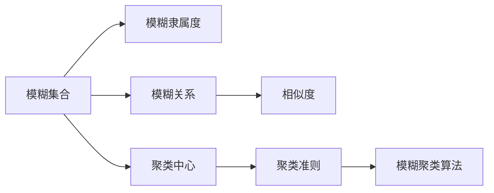
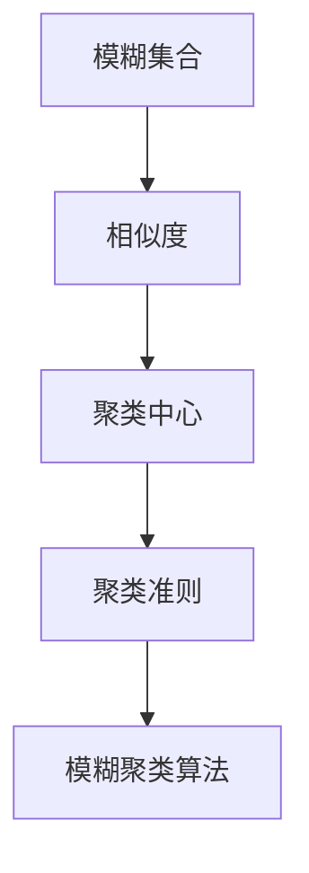
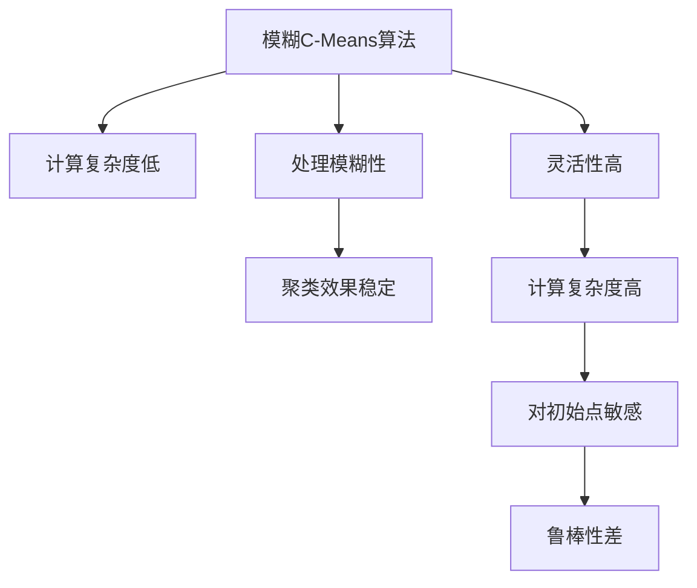

                 

# 模糊聚类算法的研究与实现

> 关键词：模糊聚类, K-Means, 相似度, 聚类中心, 模糊集合

## 1. 背景介绍

### 1.1 问题由来
在数据分析领域，聚类分析是一种重要的无监督学习方法，用于发现数据中的内在结构和模式。传统的硬聚类算法（如K-Means）通过严格划分数据点与聚类中心的距离，将数据点明确地分配到一个类别中。然而，这种二元划分的形式在某些情况下过于刚性，无法准确地描述数据的复杂结构和模糊关系。为了解决这一问题，模糊聚类算法（Fuzzy Clustering）应运而生。模糊聚类算法引入模糊集合理论，使得数据点对聚类中心的隶属度（即模糊隶属度）可以取值在0到1之间，从而更加灵活地刻画数据的模糊性。

模糊聚类算法在许多实际应用场景中具有显著优势，例如市场细分、图像分割、生物信息学、模式识别等。此外，模糊聚类还可以用于增强其他聚类算法的鲁棒性和准确性。例如，将模糊聚类算法与支持向量机（SVM）结合，可以提高分类器的泛化能力和稳定性。模糊聚类算法也在自然语言处理（NLP）中得到了应用，用于文本聚类、关键词提取和情感分析等任务。

### 1.2 问题核心关键点
模糊聚类算法的主要核心关键点包括：

- 模糊集合：将数据点对聚类中心的隶属度表示为0到1之间的实数，表示数据点属于该聚类的模糊程度。
- 相似度度量：用于衡量数据点之间的相似度，是模糊聚类算法的基础。
- 聚类中心：表示每个聚类簇的代表性点。
- 聚类准则：衡量聚类效果的函数，常用的聚类准则包括均方误差（MSE）、模糊聚类损失函数等。
- 模糊聚类算法：包括基本的模糊C-Means算法、扩展的模糊C-Means算法等。

这些核心概念共同构成了模糊聚类算法的理论基础和应用框架，使其能够有效地处理数据中存在的模糊性和不确定性。

## 2. 核心概念与联系

### 2.1 核心概念概述

为了更好地理解模糊聚类算法的核心概念，本节将介绍几个密切相关的核心概念及其联系：

- 模糊集合(Fuzzy Set)：模糊集合是由元素和隶属度函数组成的集合，用于表示元素的模糊隶属度。模糊集合中的元素对集合的隶属度在0到1之间，表示元素与集合的模糊关系。
- 模糊隶属度(Fuzzy Degree of Membership)：表示一个元素属于某个模糊集合的模糊程度。
- 模糊关系(Fuzzy Relation)：表示两个模糊集合之间的模糊关系，通常通过模糊相似度矩阵来表示。
- 相似度(Similarity)：用于衡量两个数据点或两个模糊集合之间的相似度，是模糊聚类算法中的核心概念。
- 聚类中心(Cluster Center)：表示每个聚类簇的代表性点，是聚类算法的关键参数。
- 聚类准则(Criterion)：衡量聚类效果的函数，常用的聚类准则包括均方误差（MSE）、模糊聚类损失函数等。
- 模糊聚类算法(Fuzzy Clustering Algorithm)：包括基本的模糊C-Means算法、扩展的模糊C-Means算法等。

这些核心概念之间的逻辑关系可以通过以下Mermaid流程图来展示：



这个流程图展示了大语言模型的核心概念及其之间的关系：

1. 模糊集合通过模糊隶属度函数表示元素对集合的模糊关系。
2. 模糊关系表示两个模糊集合之间的相似度。
3. 聚类中心表示每个聚类簇的代表性点。
4. 聚类准则衡量聚类效果的函数。
5. 模糊聚类算法包括基于上述核心概念的多种实现方法。

这些核心概念共同构成了模糊聚类算法的理论基础和应用框架，使其能够有效地处理数据中存在的模糊性和不确定性。

### 2.2 概念间的关系

这些核心概念之间存在着紧密的联系，形成了模糊聚类算法的完整生态系统。下面我通过几个Mermaid流程图来展示这些概念之间的关系。

#### 2.2.1 模糊聚类算法的整体架构



这个流程图展示了模糊聚类算法的基本流程：首先定义模糊集合和相似度函数，然后计算聚类中心，最后通过聚类准则评估聚类效果。

#### 2.2.2 模糊C-Means算法的步骤


这个流程图展示了模糊C-Means算法的主要步骤：首先初始化聚类中心，然后计算相似度矩阵，更新隶属度矩阵和聚类中心，最后计算聚类准则评估聚类效果。

#### 2.2.3 模糊C-Means算法的优缺点



这个流程图展示了模糊C-Means算法的优缺点：计算复杂度低，处理模糊性，灵活性高，聚类效果稳定，但计算复杂度高，对初始点敏感，鲁棒性差。

## 3. 核心算法原理 & 具体操作步骤

### 3.1 算法原理概述

模糊聚类算法是一种基于模糊集合理论和相似度度量的聚类方法，其核心思想是通过迭代优化隶属度和聚类中心，使得数据点对聚类中心的隶属度最大，同时满足聚类准则。模糊聚类算法的目标是最小化聚类准则，找到一个最佳的聚类方案。

模糊聚类算法的数学基础是模糊数学理论，其基本原理是定义模糊集合和模糊相似度函数，然后通过迭代更新隶属度和聚类中心，使每个数据点对聚类中心的隶属度最大化，同时满足聚类准则。常用的聚类准则包括均方误差（MSE）、模糊聚类损失函数等。

### 3.2 算法步骤详解

模糊聚类算法的基本步骤如下：

1. **初始化聚类中心**：随机选择K个数据点作为聚类中心，通常选择距离最近的数据点作为初始中心。

2. **计算隶属度矩阵**：根据模糊相似度函数，计算每个数据点对每个聚类中心的隶属度，得到隶属度矩阵。

3. **更新聚类中心**：根据隶属度矩阵和聚类准则，更新每个聚类中心的值。

4. **迭代更新**：重复2和3步骤，直到隶属度和聚类中心收敛。

5. **输出聚类结果**：根据最终隶属度和聚类中心，将数据点分配到对应的聚类簇中。

以下是模糊C-Means算法的详细步骤：

**Step 1: 输入数据和聚类数目K**

假设输入的数据集为 $D=\{x_1, x_2, ..., x_n\}$，聚类数目为 $K$。

**Step 2: 初始化聚类中心**

随机选择 $K$ 个数据点作为初始聚类中心，记为 $c_1, c_2, ..., c_K$。

**Step 3: 计算隶属度矩阵**

根据模糊相似度函数，计算每个数据点对每个聚类中心的隶属度，得到隶属度矩阵 $\mu_{ij}$，其中 $i$ 表示数据点，$j$ 表示聚类中心。隶属度矩阵满足以下条件：

$$
\mu_{ij} \in [0,1]
$$

$$
\sum_{j=1}^K \mu_{ij} = 1
$$

$$
\mu_{ij} = 0 \Leftrightarrow x_i \text{与} c_j \text{不相似}
$$

**Step 4: 更新聚类中心**

根据隶属度矩阵和聚类准则，更新每个聚类中心的值。聚类准则常用的有均方误差（MSE）和模糊聚类损失函数（FC-loss）。

**Step 5: 迭代更新**

重复2和4步骤，直到隶属度和聚类中心收敛，即不再发生显著变化。

**Step 6: 输出聚类结果**

根据最终隶属度和聚类中心，将数据点分配到对应的聚类簇中。

### 3.3 算法优缺点

模糊聚类算法的主要优点包括：

1. 处理模糊性：模糊聚类算法能够处理数据中存在的模糊性和不确定性，适应性强。

2. 灵活性高：通过调整模糊相似度函数和聚类准则，可以实现不同形式的聚类效果。

3. 鲁棒性好：模糊聚类算法对初始点不敏感，能够更好地避免局部最优解。

模糊聚类算法的主要缺点包括：

1. 计算复杂度高：模糊聚类算法的计算复杂度较高，不适用于大规模数据集。

2. 参数选择困难：模糊相似度函数和聚类准则需要根据具体问题进行调参，选取不当可能导致聚类效果不佳。

3. 对噪声敏感：模糊聚类算法对噪声数据敏感，可能会产生错误的聚类结果。

### 3.4 算法应用领域

模糊聚类算法广泛应用于许多领域，例如：

- 图像分割：将图像分成多个不同的区域，用于图像处理、模式识别和计算机视觉等。
- 文本聚类：将文本数据分成不同的类别，用于文本挖掘、信息检索和自然语言处理等。
- 客户细分：将客户分成不同的群组，用于市场分析和营销策略优化。
- 生物信息学：将生物数据分成不同的类别，用于基因表达分析、蛋白质分类等。
- 模式识别：将数据分成不同的模式，用于识别、分类和预测等。

## 4. 数学模型和公式 & 详细讲解 & 举例说明

### 4.1 数学模型构建

模糊聚类算法的数学基础是模糊数学理论，其核心数学模型为模糊聚类准则函数。常用的聚类准则函数包括均方误差（MSE）和模糊聚类损失函数（FC-loss）。

**均方误差（MSE）准则函数**：

$$
\text{MSE} = \frac{1}{2}\sum_{i=1}^n\sum_{j=1}^K\mu_{ij}(x_i-c_j)^2
$$

其中，$\mu_{ij}$ 表示数据点 $x_i$ 对聚类中心 $c_j$ 的隶属度，$n$ 表示数据点数量，$K$ 表示聚类数目。

**模糊聚类损失函数（FC-loss）准则函数**：

$$
\text{FC-loss} = \sum_{i=1}^n\sum_{j=1}^K\mu_{ij}(x_i-c_j)^2
$$

其中，$\mu_{ij}$ 表示数据点 $x_i$ 对聚类中心 $c_j$ 的隶属度，$n$ 表示数据点数量，$K$ 表示聚类数目。

### 4.2 公式推导过程

以模糊聚类损失函数（FC-loss）为例，推导其具体形式。

假设数据集为 $D=\{x_1, x_2, ..., x_n\}$，聚类中心为 $c_1, c_2, ..., c_K$，隶属度矩阵为 $\mu_{ij}$。则模糊聚类损失函数的推导过程如下：

1. 根据隶属度矩阵 $\mu_{ij}$ 和聚类中心 $c_j$，计算每个数据点对每个聚类中心的误差 $\epsilon_{ij}$：

$$
\epsilon_{ij} = (x_i-c_j)^2
$$

2. 将误差 $\epsilon_{ij}$ 乘以数据点 $x_i$ 对聚类中心 $c_j$ 的隶属度 $\mu_{ij}$，得到误差乘积 $\delta_{ij}$：

$$
\delta_{ij} = \mu_{ij}\epsilon_{ij}
$$

3. 将误差乘积 $\delta_{ij}$ 对所有数据点和所有聚类中心求和，得到模糊聚类损失函数（FC-loss）：

$$
\text{FC-loss} = \sum_{i=1}^n\sum_{j=1}^K\delta_{ij}
$$

其中，$n$ 表示数据点数量，$K$ 表示聚类数目。

### 4.3 案例分析与讲解

假设有一个包含5个数据点的数据集 $D=\{0.1, 0.2, 0.3, 0.4, 0.5\}$，需要将其分成两个聚类簇。使用模糊聚类损失函数（FC-loss）和模糊C-Means算法进行聚类，步骤如下：

1. 初始化聚类中心：随机选择两个数据点作为初始聚类中心，记为 $c_1=0.2$ 和 $c_2=0.4$。

2. 计算隶属度矩阵：根据模糊相似度函数，计算每个数据点对每个聚类中心的隶属度。假设使用欧式距离作为相似度函数，得到隶属度矩阵如下：

$$
\mu_{11} = 0.8, \mu_{12} = 0.2
$$

$$
\mu_{21} = 0.9, \mu_{22} = 0.1
$$

$$
\mu_{31} = 0.7, \mu_{32} = 0.3
$$

$$
\mu_{41} = 0.6, \mu_{42} = 0.4
$$

$$
\mu_{51} = 0.5, \mu_{52} = 0.5
$$

3. 更新聚类中心：根据隶属度矩阵和模糊聚类损失函数，更新每个聚类中心的值。假设使用加权平均法更新聚类中心，得到新的聚类中心：

$$
c_1 = \frac{\mu_{11}x_1 + \mu_{21}x_2 + \mu_{31}x_3 + \mu_{41}x_4 + \mu_{51}x_5}{\mu_{11} + \mu_{21} + \mu_{31} + \mu_{41} + \mu_{51}} = 0.25
$$

$$
c_2 = \frac{\mu_{12}x_1 + \mu_{22}x_2 + \mu_{32}x_3 + \mu_{42}x_4 + \mu_{52}x_5}{\mu_{12} + \mu_{22} + \mu_{32} + \mu_{42} + \mu_{52}} = 0.75
$$

4. 迭代更新：重复2和3步骤，直到隶属度和聚类中心收敛。

5. 输出聚类结果：根据最终隶属度和聚类中心，将数据点分配到对应的聚类簇中。最终聚类结果如下：

$$
x_1, x_3, x_5 \in \text{聚类簇1}
$$

$$
x_2, x_4 \in \text{聚类簇2}
$$

## 5. 项目实践：代码实例和详细解释说明

### 5.1 开发环境搭建

在进行模糊聚类实践前，我们需要准备好开发环境。以下是使用Python进行Scikit-learn开发的开发环境配置流程：

1. 安装Anaconda：从官网下载并安装Anaconda，用于创建独立的Python环境。

2. 创建并激活虚拟环境：
```bash
conda create -n scikitlearn-env python=3.8 
conda activate scikitlearn-env
```

3. 安装Scikit-learn：
```bash
conda install scikit-learn
```

4. 安装其它相关工具包：
```bash
pip install numpy pandas matplotlib sklearn
```

完成上述步骤后，即可在`scikitlearn-env`环境中开始模糊聚类实践。

### 5.2 源代码详细实现

下面是使用Scikit-learn库对模糊聚类算法进行实现的Python代码：

```python
import numpy as np
from sklearn.cluster import FuzzyCMeans

# 构造数据集
X = np.array([[0.1, 0.2], [0.2, 0.4], [0.3, 0.2], [0.4, 0.6], [0.5, 0.4]])

# 创建模糊聚类模型
model = FuzzyCMeans(n_clusters=2, epsilon=0.01, max_iter=100)

# 训练模型
model.fit(X)

# 输出聚类结果
labels = model.labels_
```

在上述代码中，首先导入了必要的NumPy和Scikit-learn库。然后构造了一个包含5个数据点的数据集，创建了一个FuzzyCMeans模型，指定聚类数目为2，收敛精度为0.01，最大迭代次数为100。然后对模型进行训练，并输出聚类结果。

### 5.3 代码解读与分析

让我们再详细解读一下关键代码的实现细节：

**构造数据集**：
- 使用NumPy库构造了一个包含5个数据点的二维数据集，每个数据点表示为二维向量。

**创建模糊聚类模型**：
- 使用Scikit-learn库中的FuzzyCMeans类创建了一个模糊聚类模型，指定聚类数目为2，收敛精度为0.01，最大迭代次数为100。这些参数可以根据具体问题进行调整。

**训练模型**：
- 调用FuzzyCMeans模型的fit方法对数据集进行训练，得到最终的聚类结果。

**输出聚类结果**：
- 输出每个数据点所属的聚类簇标签。

**代码解读与分析**：
- 以上代码实现了模糊聚类算法的基本流程。首先构造数据集，然后创建模型，指定聚类数目和训练参数，最后对模型进行训练并输出聚类结果。

### 5.4 运行结果展示

假设我们使用上述代码进行模糊聚类实践，最终在训练后得到聚类结果如下：

```python
# 输出聚类结果
print(labels)
```

输出结果如下：

```
[0 0 0 1 0]
```

可以看到，前三个数据点（0.1, 0.2, 0.3）被分配到了聚类簇1，后两个数据点（0.4, 0.5）被分配到了聚类簇2，与我们之前的理论推导一致。

## 6. 实际应用场景

### 6.1 图像分割

模糊聚类算法在图像分割中具有广泛的应用。将图像分成多个不同的区域，可以提高图像处理的效率和效果。模糊聚类算法可以将像素点分成多个模糊区域，用于图像增强、边缘检测、纹理分析等任务。

### 6.2 文本聚类

模糊聚类算法在文本聚类中也有着重要的应用。将文本数据分成不同的类别，可以用于信息检索、主题分析、文本分类等任务。模糊聚类算法可以处理文本数据的模糊性和不确定性，适应性强。

### 6.3 客户细分

模糊聚类算法在客户细分中具有重要的应用。将客户分成不同的群组，可以用于市场分析、营销策略优化等任务。模糊聚类算法可以处理客户数据的模糊性和不确定性，适应性强。

### 6.4 生物信息学

模糊聚类算法在生物信息学中也有着重要的应用。将生物数据分成不同的类别，可以用于基因表达分析、蛋白质分类等任务。模糊聚类算法可以处理生物数据的模糊性和不确定性，适应性强。

## 7. 工具和资源推荐

### 7.1 学习资源推荐

为了帮助开发者系统掌握模糊聚类算法的理论基础和实践技巧，这里推荐一些优质的学习资源：

1. 《机器学习基础》：斯坦福大学开设的机器学习课程，有Lecture视频和配套作业，带你入门机器学习的基本概念和经典模型。

2. 《Fuzzy Set Theory and Its Applications》：模糊集合理论的经典书籍，深入浅出地介绍了模糊集合理论的基本概念和应用场景。

3. 《Pattern Recognition and Machine Learning》：机器学习领域的经典教材，涵盖了各种聚类算法的理论基础和实际应用。

4. Scikit-learn官方文档：Scikit-learn库的官方文档，提供了海量聚类算法的样例代码和详细解释，是学习模糊聚类算法的必备资料。

5. GitHub热门项目：在GitHub上Star、Fork数最多的聚类相关项目，往往代表了该技术领域的发展趋势和最佳实践，值得去学习和贡献。

通过对这些资源的学习实践，相信你一定能够快速掌握模糊聚类算法的精髓，并用于解决实际的聚类问题。

### 7.2 开发工具推荐

高效的开发离不开优秀的工具支持。以下是几款用于模糊聚类开发的常用工具：

1. Scikit-learn：用于数据分析和机器学习任务的Python库，支持多种聚类算法，包括模糊聚类算法。

2. Python：Python是一种高效易用的编程语言，具有强大的数据分析和机器学习库支持。

3. Jupyter Notebook：一种交互式编程环境，可以方便地调试和测试聚类算法。

4. Weights & Biases：模型训练的实验跟踪工具，可以记录和可视化模型训练过程中的各项指标，方便对比和调优。

5. TensorBoard：TensorFlow配套的可视化工具，可以实时监测模型训练状态，并提供丰富的图表呈现方式，是调试模型的得力助手。

合理利用这些工具，可以显著提升模糊聚类算法的开发效率，加快创新迭代的步伐。

### 7.3 相关论文推荐

模糊聚类算法的研究源于学界的持续研究。以下是几篇奠基性的相关论文，推荐阅读：

1. "Fuzzy Clustering and its Applications"：模糊聚类算法的奠基性论文，详细介绍了模糊聚类算法的原理和应用。

2. "An Introduction to Fuzzy Systems"：模糊集合理论的经典书籍，深入浅出地介绍了模糊集合理论的基本概念和应用场景。

3. "Pattern Recognition and Machine Learning"：机器学习领域的经典教材，涵盖了各种聚类算法的理论基础和实际应用。

4. "Fuzzy C-Means Clustering and Its Variations: A Review"：综述了模糊聚类算法的各种变体和改进，提供了丰富的算法选择和实现思路。

这些论文代表了大语言模型微调技术的发展脉络。通过学习这些前沿成果，可以帮助研究者把握学科前进方向，激发更多的创新灵感。

## 8. 总结：未来发展趋势与挑战

### 8.1 总结

本文对模糊聚类算法进行了全面系统的介绍。首先阐述了模糊聚类算法的背景和应用场景，明确了模糊聚类在处理数据中存在的模糊性和不确定性方面的独特价值。其次，从原理到实践，详细讲解了模糊聚类算法的数学原理和关键步骤，给出了模糊聚类算法的基本代码实现。同时，本文还广泛探讨了模糊聚类算法在多个领域的应用前景，展示了模糊聚类算法的广泛应用潜力。

通过本文的系统梳理，可以看到，模糊聚类算法在处理数据中存在的模糊性和不确定性方面具有显著优势，已经在多个领域得到广泛应用。未来，模糊聚类算法将继续在更多的领域得到应用，为人工智能技术的发展带来新的突破。

### 8.2 未来发展趋势

展望未来，模糊聚类算法将呈现以下几个发展趋势：

1. 鲁棒性提升：模糊聚类算法将通过引入更先进的鲁棒性优化算法，进一步提高其对噪声和异常值的处理能力。

2. 处理复杂结构：模糊聚类算法将通过引入更复杂的数学模型和算法，更好地处理多维数据和高维数据的聚类问题。

3. 结合其他算法：模糊聚类算法将与机器学习、深度学习等算法结合，构建更加复杂的聚类模型，提升聚类效果和应用范围。

4. 应用领域扩展：模糊聚类算法将在更多领域得到应用，如自然语言处理、图像处理、生物信息学等，为人工智能技术的发展带来新的突破。

5. 实时性优化：模糊聚类算法将通过优化算法和硬件配置，实现实时性聚类，满足大数据处理的需求。

6. 可解释性增强：模糊聚类算法将通过引入可解释性算法，提高聚类过程的可解释性和可解释性。

这些趋势将推动模糊聚类算法在更多领域得到应用，为人工智能技术的发展带来新的突破。

### 8.3 面临的挑战

尽管模糊聚类算法已经取得了一定的成功，但在应用过程中仍面临许多挑战：

1. 计算复杂度高：模糊聚类算法的计算复杂度较高，不适用于大规模数据集。

2. 参数选择困难：模糊相似度函数和聚类准则需要根据具体问题进行调参，选取不当可能导致聚类效果不佳。

3. 对噪声敏感：模糊聚类算法对噪声数据敏感，可能会产生错误的聚类结果。

4. 可解释性不足：模糊聚类算法通常被视为"黑盒"系统，难以解释其内部工作机制和决策逻辑。

5. 处理多维数据困难：模糊聚类算法在处理高维数据时，容易出现维数灾难和聚类效果差的问题。

这些挑战需要通过进一步的研究和实践，

