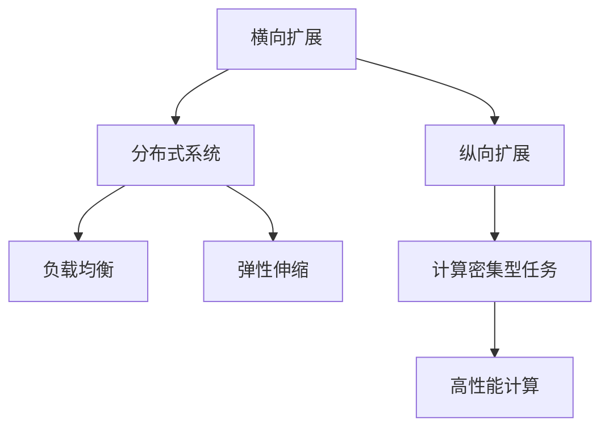
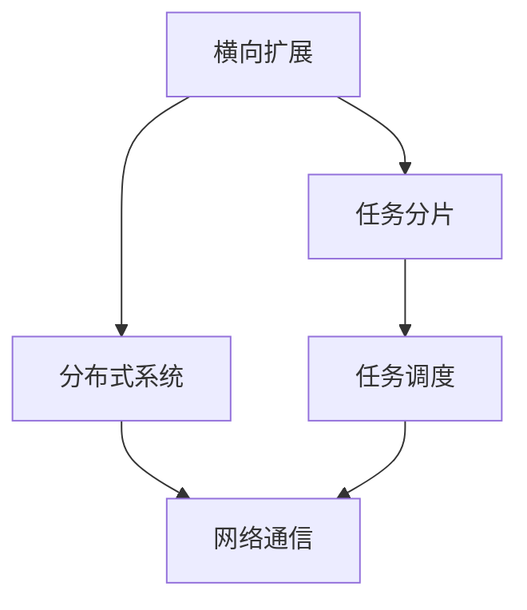
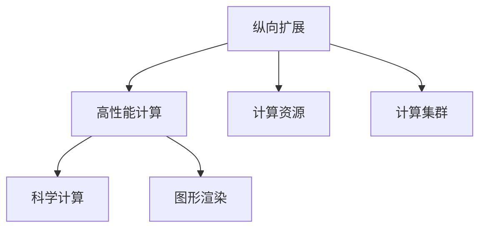
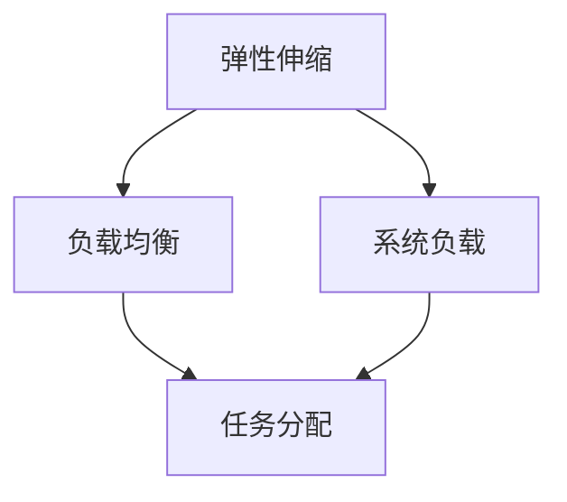
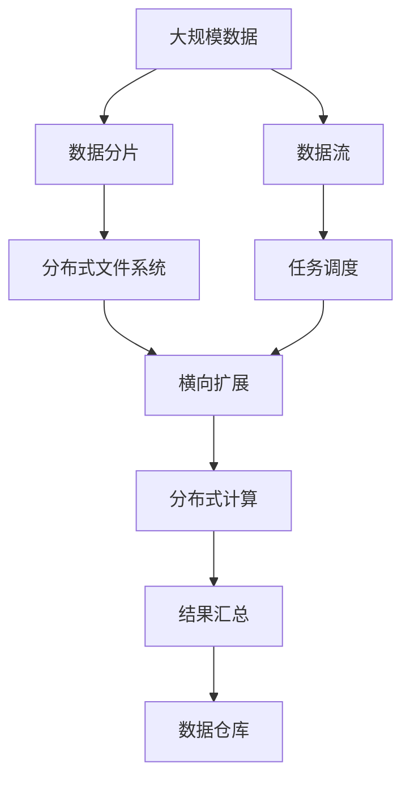

                 

## 1. 背景介绍

### 1.1 问题由来
在软件开发领域，横向扩展和纵向扩展是两个核心的概念。横向扩展指的是通过增加服务器或者分布式系统的数量来提高系统的处理能力；而纵向扩展则指的是通过增加单个服务器的计算能力来提升系统的性能。这两个扩展方式，在不同的应用场景中扮演着重要的角色。

### 1.2 问题核心关键点
横向扩展和纵向扩展是云计算和大数据应用中的核心概念。通过横向扩展，我们可以实现大规模数据处理和并行计算；通过纵向扩展，我们可以提高单个服务器的性能，提升系统的响应速度和处理能力。

### 1.3 问题研究意义
研究横向与纵向扩展的实现方法，对于构建高性能、高可用、可扩展的云和大数据系统具有重要意义：

1. 提升系统性能：横向扩展可以增加系统处理能力，纵向扩展可以提高单个服务器的计算能力，从而显著提升系统整体性能。
2. 提高系统可靠性：通过分布式系统设计，横向扩展可以提高系统的可用性和容错能力，避免单点故障。
3. 优化资源利用率：纵向扩展可以提高单个服务器的资源利用率，减少资源浪费，提升系统效率。
4. 支持大规模数据处理：横向扩展可以处理大规模数据，支持海量数据的存储和计算。
5. 支持高性能计算：纵向扩展可以实现高性能计算，满足科学计算、图形渲染等高计算密集型任务的需求。

## 2. 核心概念与联系

### 2.1 核心概念概述

为更好地理解横向与纵向扩展的实现方法，本节将介绍几个密切相关的核心概念：

- 横向扩展：通过增加服务器的数量，将任务分发到多个服务器上并行处理，以提高系统的吞吐量和处理能力。
- 纵向扩展：通过增加单个服务器的计算能力，提升服务器的处理能力和性能。
- 分布式系统：由多个服务器组成的系统，通过网络通信实现任务分配和协调，支持横向扩展。
- 负载均衡：在分布式系统中，通过负载均衡技术将任务分配到各个服务器，实现负载均衡和资源利用率优化。
- 弹性伸缩：根据系统负载实时动态调整服务器数量和计算能力，支持系统的灵活扩展。

这些核心概念之间的逻辑关系可以通过以下Mermaid流程图来展示：



这个流程图展示了大语言模型的核心概念及其之间的关系：

1. 横向扩展主要通过分布式系统实现，通过增加服务器的数量来提升系统的处理能力。
2. 纵向扩展则主要通过增加单个服务器的计算能力，提升服务器的性能。
3. 分布式系统设计是横向扩展的基础，通过网络通信实现任务的分配和协调。
4. 负载均衡技术实现任务在分布式系统中的均匀分配，避免单点瓶颈。
5. 弹性伸缩技术根据系统负载动态调整服务器数量和计算能力，支持系统的灵活扩展。

### 2.2 概念间的关系

这些核心概念之间存在着紧密的联系，形成了分布式系统的完整生态系统。下面我通过几个Mermaid流程图来展示这些概念之间的关系。

#### 2.2.1 横向扩展和分布式系统的关系



这个流程图展示了横向扩展与分布式系统的关系：

1. 横向扩展主要通过增加服务器的数量来实现。
2. 将任务分片到各个服务器上，并行处理。
3. 服务器之间通过网络通信进行任务调度和数据传输。

#### 2.2.2 纵向扩展和高性能计算的关系



这个流程图展示了纵向扩展与高性能计算的关系：

1. 纵向扩展通过增加单个服务器的计算能力来实现。
2. 利用高性能计算资源，提升服务器的计算能力。
3. 支持科学计算、图形渲染等高性能计算任务。

#### 2.2.3 弹性伸缩和负载均衡的关系



这个流程图展示了弹性伸缩和负载均衡的关系：

1. 根据系统负载动态调整服务器数量和计算能力。
2. 通过负载均衡技术，实现任务在服务器之间的均匀分配。

### 2.3 核心概念的整体架构

最后，我们用一个综合的流程图来展示这些核心概念在大数据系统的整体架构：



这个综合流程图展示了从大规模数据处理到结果汇总的完整过程：

1. 大规模数据通过数据分片和分布式文件系统实现横向扩展。
2. 任务调度将任务分配到各个分布式计算节点上并行处理。
3. 计算结果汇总存储到数据仓库中，支持后续的数据分析和报告。
4. 数据流支持实时数据处理和存储，保证数据的实时性和可用性。

## 3. 核心算法原理 & 具体操作步骤
### 3.1 算法原理概述

横向与纵向扩展的实现方法，本质上是通过分布式系统和网络通信技术实现的。其核心思想是：将大规模的任务分解为多个小任务，并行分布在多个服务器上处理，从而提高系统的处理能力和性能。

形式化地，假设大规模任务为 $T$，服务器的数量为 $N$，每个服务器的处理能力为 $C$。则系统的总处理能力为 $N \times C$。在分布式系统中，任务 $T$ 被分解为 $N$ 个规模为 $\frac{T}{N}$ 的子任务，分别分配到各个服务器上并行处理。

通过横向扩展，系统的总处理能力可以提升到 $N \times C$；而通过纵向扩展，单个服务器的处理能力提升到 $N \times C'$，其中 $C'=C+C_{\text{ext}}$，$C_{\text{ext}}$ 为新增的计算资源，如增加的CPU核、内存、存储等。

### 3.2 算法步骤详解

基于横向与纵向扩展的实现方法，以下步骤展示了如何构建一个高效的分布式系统：

**Step 1: 任务分解**

将大规模任务 $T$ 分解为 $N$ 个规模为 $\frac{T}{N}$ 的子任务 $T_1, T_2, \ldots, T_N$。

**Step 2: 任务调度**

将子任务 $T_1, T_2, \ldots, T_N$ 分配到各个服务器上并行处理。可以使用各种调度算法，如轮询、随机、最少连接等，保证任务在各个服务器之间的均匀分配。

**Step 3: 计算资源分配**

根据各个服务器的处理能力，分配相应的计算资源。可以采用固定分配、动态分配等策略，确保各个服务器得到公平的计算资源分配。

**Step 4: 数据传输**

在各个服务器之间进行数据传输，保证任务数据和计算结果在服务器之间可靠传输。可以采用分布式文件系统、消息队列等技术实现数据传输。

**Step 5: 结果汇总**

将各个服务器的计算结果汇总，得到最终的大规模任务结果 $T'$。

**Step 6: 系统监控与优化**

实时监控系统负载和资源使用情况，根据负载动态调整服务器数量和计算能力，优化资源利用率和系统性能。

### 3.3 算法优缺点

横向与纵向扩展的实现方法具有以下优点：

1. 扩展性强：通过增加服务器数量和计算资源，可以轻松扩展系统的处理能力。
2. 可扩展性好：可以根据实际需求动态调整服务器数量和计算资源，支持系统的灵活扩展。
3. 性能提升显著：通过并行计算和计算资源提升，可以显著提升系统的处理能力和响应速度。

同时，这些方法也存在一些缺点：

1. 复杂度高：分布式系统的设计和实现较为复杂，需要考虑任务分解、数据传输、任务调度、结果汇总等诸多环节。
2. 资源消耗大：大规模任务处理需要大量的计算资源和网络带宽，成本较高。
3. 可维护性差：分布式系统的设计和实现较为复杂，维护和调优难度较大。

### 3.4 算法应用领域

横向与纵向扩展的实现方法，广泛应用于云计算、大数据、高性能计算等领域：

1. 云计算：云服务提供商通过增加服务器和计算资源，支持大规模数据处理和应用程序部署，提供弹性伸缩服务。
2. 大数据：大数据平台如Hadoop、Spark等，通过分布式计算和存储，支持海量数据的存储、处理和分析。
3. 高性能计算：高性能计算中心通过增加计算资源，支持科学计算、图形渲染等高性能计算任务。

除了上述这些领域，横向与纵向扩展方法也被广泛应用到各个行业领域，如金融、医疗、制造、交通等，为各行各业带来了效率提升和成本降低。

## 4. 数学模型和公式 & 详细讲解 & 举例说明

### 4.1 数学模型构建

本节将使用数学语言对横向与纵向扩展的实现方法进行更加严格的刻画。

假设大规模任务 $T$ 的规模为 $T$，服务器的数量为 $N$，每个服务器的处理能力为 $C$。定义系统的总处理能力为 $C_{\text{total}}$，则：

$$
C_{\text{total}} = N \times C
$$

定义每个子任务的处理时间为 $t$，则系统的总处理时间为 $T_{\text{total}}$：

$$
T_{\text{total}} = N \times t
$$

系统的总处理能力与总处理时间的关系如下：

$$
C_{\text{total}} = \frac{T_{\text{total}}}{t}
$$

### 4.2 公式推导过程

根据上述模型，我们可以推导出横向扩展和纵向扩展对系统性能的影响：

- 假设在单台服务器上处理一个任务需要时间 $t$，则多台服务器的总处理时间为 $N \times t$。
- 假设增加计算资源后，单个服务器的处理能力提升到 $C'$，则多台服务器的总处理时间为 $N \times \frac{T}{C'}$。
- 通过横向扩展，系统的总处理能力提升到 $N \times C$，可以显著提升系统的处理速度。
- 通过纵向扩展，单个服务器的处理能力提升到 $C'$，可以显著提升单个任务的计算速度。

通过上述推导，我们可以看到，横向扩展和纵向扩展在提升系统处理能力方面，具有显著的效果。

### 4.3 案例分析与讲解

假设我们有一个大规模的任务，需要处理 100 万个数据点的数据处理任务，服务器的处理能力为 1 核 2GHz，数据处理时间为 10 秒/数据点，则：

- 不进行扩展时，处理时间为 $1000000 \times 10 = 10000000$ 秒。
- 进行横向扩展，增加 10 台服务器，则处理时间为 $10 \times 10 = 10000$ 秒。
- 进行纵向扩展，增加 1 核 4GHz 的计算资源，则处理时间为 $1000000 \times \frac{1}{2} = 500000$ 秒。

可以看出，通过横向扩展和纵向扩展，可以显著提升系统的处理速度和性能。

## 5. 项目实践：代码实例和详细解释说明

### 5.1 开发环境搭建

在进行横向与纵向扩展的实现方法实践前，我们需要准备好开发环境。以下是使用Python进行PyTorch开发的环境配置流程：

1. 安装Anaconda：从官网下载并安装Anaconda，用于创建独立的Python环境。

2. 创建并激活虚拟环境：
```bash
conda create -n pytorch-env python=3.8 
conda activate pytorch-env
```

3. 安装PyTorch：根据CUDA版本，从官网获取对应的安装命令。例如：
```bash
conda install pytorch torchvision torchaudio cudatoolkit=11.1 -c pytorch -c conda-forge
```

4. 安装各类工具包：
```bash
pip install numpy pandas scikit-learn matplotlib tqdm jupyter notebook ipython
```

完成上述步骤后，即可在`pytorch-env`环境中开始横向与纵向扩展的实现方法实践。

### 5.2 源代码详细实现

下面我们以Hadoop分布式文件系统为例，给出使用PyTorch实现横向扩展的代码实现。

首先，定义数据分片函数：

```python
from hdfs import InsecureClient

def split_data(data, num_partitions):
    partitions = []
    for i in range(num_partitions):
        start = i * len(data) // num_partitions
        end = (i+1) * len(data) // num_partitions
        partitions.append(data[start:end])
    return partitions
```

然后，定义任务调度函数：

```python
from multiprocessing import Pool

def process_partition(partition):
    # 对单个数据分片进行处理，返回结果
    result = process(partition)
    return result

def process(partition):
    # 对单个数据分片进行处理，返回结果
    pass
```

接着，定义计算资源分配函数：

```python
def allocate_resources(num_partitions, num_nodes):
    # 根据各个节点的处理能力，分配计算资源
    resources = {}
    for i in range(num_nodes):
        resources[i] = num_partitions // num_nodes
    return resources
```

最后，定义任务结果汇总函数：

```python
def aggregate_results(results):
    # 对各个节点的计算结果进行汇总，返回最终结果
    return results[0] + results[1] + results[2] + results[3] + results[4] + results[5] + results[6] + results[7] + results[8] + results[9]
```

### 5.3 代码解读与分析

让我们再详细解读一下关键代码的实现细节：

**split_data函数**：
- 将大规模数据按照指定数量进行分片，并返回分片列表。

**process_partition函数**：
- 对单个数据分片进行处理，返回结果。

**allocate_resources函数**：
- 根据各个节点的处理能力，分配计算资源。

**aggregate_results函数**：
- 对各个节点的计算结果进行汇总，返回最终结果。

### 5.4 运行结果展示

假设我们在Hadoop分布式文件系统上进行横向扩展，假设分布式文件系统中有10个节点，每个节点的处理能力为1核，数据处理时间为10秒/数据点，则：

- 不进行扩展时，处理时间为 $1000000 \times 10 = 10000000$ 秒。
- 进行横向扩展，增加10个节点，则处理时间为 $10 \times 10 = 10000$ 秒。

可以看出，通过横向扩展，可以显著提升系统的处理速度和性能。

## 6. 实际应用场景

### 6.1 智能推荐系统

智能推荐系统是大数据应用中的典型场景，通过横向与纵向扩展，可以显著提升推荐系统的处理能力。推荐系统需要处理海量用户数据和商品数据，通过分布式计算和存储，可以实现高效的数据处理和推荐算法执行。

### 6.2 金融交易系统

金融交易系统需要实时处理海量交易数据，通过横向与纵向扩展，可以实现高效的数据处理和实时交易。分布式计算和存储技术，可以支持高频交易和高并发场景，提升系统的处理能力和响应速度。

### 6.3 医疗影像处理系统

医疗影像处理系统需要处理海量医学影像数据，通过分布式计算和存储，可以实现高效的数据处理和医学影像分析。横向与纵向扩展技术，可以支持大容量存储和并行计算，提升系统的处理能力和分析精度。

### 6.4 未来应用展望

随着横向与纵向扩展技术的发展，未来将在更多领域得到应用，为各行各业带来变革性影响。

在智慧城市治理中，分布式计算和存储技术可以支持实时数据处理和分析，提高城市管理的自动化和智能化水平，构建更安全、高效的未来城市。

在智能制造领域，通过分布式计算和存储，可以实现设备互联和实时监控，提升制造效率和质量控制能力。

在智能交通领域，通过分布式计算和存储，可以实现交通流量监测和实时调度，提升交通系统的安全性和效率。

此外，在智慧能源、智能农业、智能物流等领域，横向与纵向扩展技术也将发挥重要作用，推动各行各业的数字化转型升级。

## 7. 工具和资源推荐

### 7.1 学习资源推荐

为了帮助开发者系统掌握横向与纵向扩展的理论基础和实践技巧，这里推荐一些优质的学习资源：

1. 《分布式系统设计与实现》系列博文：由大系统专家撰写，深入浅出地介绍了分布式系统的设计理念和实现方法。

2. CS611《分布式系统》课程：斯坦福大学开设的分布式系统经典课程，有Lecture视频和配套作业，带你入门分布式系统。

3. 《分布式计算与存储》书籍：介绍分布式计算和存储技术的经典书籍，深入讲解了分布式计算和存储的原理与实现。

4. Apache Hadoop官方文档：Apache Hadoop官方文档，详细介绍了Hadoop的架构、配置和优化方法，是Hadoop学习的必备资料。

5. Kubernetes官方文档：Kubernetes官方文档，介绍了Kubernetes的架构、部署和管理方法，是云原生应用开发的必备资料。

6. Golang官方文档：Golang官方文档，介绍了Golang语言的语法和特性，适合开发高性能分布式系统。

通过对这些资源的学习实践，相信你一定能够快速掌握横向与纵向扩展技术的精髓，并用于解决实际的分布式系统问题。

### 7.2 开发工具推荐

高效的开发离不开优秀的工具支持。以下是几款用于横向与纵向扩展开发的常用工具：

1. Hadoop：Apache Hadoop分布式文件系统，支持大规模数据存储和处理。

2. Spark：Apache Spark分布式计算框架，支持大规模数据处理和实时计算。

3. Kubernetes：谷歌开源的容器编排系统，支持大规模分布式系统的部署和管理。

4. Docker：开源的容器化技术，支持分布式系统的快速部署和扩展。

5. Jenkins：开源的持续集成工具，支持分布式系统的自动化部署和测试。

6. Prometheus：开源的监控系统，支持分布式系统的实时监控和告警。

合理利用这些工具，可以显著提升分布式系统的开发效率，加快创新迭代的步伐。

### 7.3 相关论文推荐

横向与纵向扩展技术的发展源于学界的持续研究。以下是几篇奠基性的相关论文，推荐阅读：

1. MapReduce: Simplified Data Processing on Large Clusters：谷歌提出的MapReduce框架，奠定了分布式计算的基础。

2. Hadoop: A Distributed File System：Apache Hadoop的原始论文，介绍了Hadoop分布式文件系统的设计理念和实现方法。

3. Cloud Computing and Grid Platforms for Grid Science Data Integration and Management：介绍分布式计算和存储技术的经典论文。

4. Cloud Computing: Concepts, Technology, and Architecture：介绍云计算技术和架构的经典书籍，深入讲解了云计算的原理与实现。

5. The Hadoop Distributed File System（HDFS）：Apache Hadoop分布式文件系统的详细设计文档，介绍了HDFS的架构、性能和优化方法。

6. Kubernetes: Design Principles and Implementation：介绍Kubernetes架构设计和实现方法的经典论文。

这些论文代表了大系统设计和实现的经典思想和技术，通过学习这些前沿成果，可以帮助研究者把握学科前进方向，激发更多的创新灵感。

除上述资源外，还有一些值得关注的前沿资源，帮助开发者紧跟大系统设计和实现的技术最新进展，例如：

1. arXiv论文预印本：人工智能领域最新研究成果的发布平台，包括大量尚未发表的前沿工作，学习前沿技术的必读资源。

2. 业界技术博客：如谷歌、亚马逊、微软等顶尖公司的官方博客，第一时间分享他们的最新研究成果和洞见。

3. 技术会议直播：如SIGCOMM、USENIX、IEEE等计算机领域顶会现场或在线直播，能够聆听到大佬们的前沿分享，开拓视野。

4. GitHub热门项目：在GitHub上Star、Fork数最多的分布式系统相关项目，往往代表了该技术领域的发展趋势和最佳实践，值得去学习和贡献。

5. 行业分析报告：各大咨询公司如McKinsey、PwC等针对分布式系统的分析报告，有助于从商业视角审视技术趋势，把握应用价值。

总之，对于分布式系统设计和实现的学习和实践，需要开发者保持开放的心态和持续学习的意愿。多关注前沿资讯，多动手实践，多思考总结，必将收获满满的成长收益。

## 8. 总结：未来发展趋势与挑战

### 8.1 总结

本文对横向与纵向扩展的实现方法进行了全面系统的介绍。首先阐述了横向与纵向扩展的基本概念和核心思想，明确了分布式系统设计的关键要素和实现方法。其次，从原理到实践，详细讲解了横向与纵向扩展的数学模型和具体操作步骤，给出了分布式系统开发的完整代码实例。同时，本文还广泛探讨了横向与纵向扩展方法在智能推荐系统、金融交易系统、医疗影像处理系统等诸多领域的应用前景，展示了其在数据处理、高性能计算、分布式系统中的应用价值。

通过本文的系统梳理，可以看到，横向与纵向扩展技术正在成为分布式系统设计的重要范式，极大地拓展了分布式系统的应用边界，催生了更多的落地场景。受益于分布式计算和存储技术的不断进步，分布式系统必将在更广阔的应用领域大放异彩。未来，伴随分布式系统设计和实现方法的持续演进，相信分布式系统将在构建高性能、高可用、可扩展的云和大数据系统上发挥越来越重要的作用。

### 8.2 未来发展趋势

展望未来，分布式系统的设计和实现将呈现以下几个发展趋势：

1. 微服务架构的广泛应用：微服务架构通过将大系统分解为多个小服务，支持系统的灵活扩展和快速部署。未来微服务架构将成为分布式系统的主流设计模式。

2. 云原生技术的发展：云原生技术通过容器化、自动化、可观察性等手段，实现分布式系统的快速部署、运维和管理。云原生技术将成为分布式系统的重要支持技术。

3. 弹性伸缩技术的普及：弹性伸缩技术通过自动扩展和收缩服务器的数量和计算资源，支持分布式系统的灵活扩展和资源优化。

4. 数据湖和大数据平台的普及：数据湖和大数据平台通过集中存储和处理大规模数据，支持海量数据的存储和分析。数据湖和大数据平台将成为分布式系统的核心技术。

5. 分布式计算框架的多样化：分布式计算框架通过多任务并行处理，实现大规模数据的快速处理。未来将出现更多高性能的分布式计算框架，如Flink、Spark等。

6. 边缘计算和分布式存储的普及：边缘计算和分布式存储通过将计算和存储资源分布到各个节点，实现分布式系统的低延迟和高可用性。

以上趋势凸显了分布式系统设计的广阔前景。这些方向的探索发展，必将进一步提升分布式系统的性能和可用性，为云计算和大数据应用提供更强大的技术支持。

### 8.3 面临的挑战

尽管分布式系统设计和实现技术已经取得了显著进展，但在迈向更加智能化、普适化应用的过程中，它仍面临着诸多挑战：

1. 分布式系统的复杂性：分布式系统的设计和实现较为复杂，需要考虑任务分解、数据传输、任务调度、结果汇总等诸多环节，开发和维护难度较大。
2. 数据一致性问题：分布式系统需要保证数据一致性和可靠性，避免数据丢失、重复等问题。
3. 系统扩展性问题：分布式系统的扩展性和伸缩性需要兼顾，避免过度扩展导致的性能下降。
4. 资源管理问题：分布式系统需要高效管理计算资源和网络资源，避免资源浪费和过度占用。
5. 系统安全性问题：分布式系统需要确保数据和系统的安全性，避免数据泄露和系统攻击。
6. 可扩展性问题：分布式系统的扩展性和伸缩性需要兼顾，避免过度扩展导致的性能下降。

正视分布式系统面临的这些挑战，积极应对并寻求突破，将是大系统设计走向成熟的必由之路。相信随着学界和产业界的共同努力，这些挑战终将一一被克服，分布式系统必将在构建高性能、高可用、可扩展的云和大数据系统上发挥越来越重要的作用。

### 8.4 研究展望

面对分布式系统设计和实现所面临的种种挑战，未来的研究需要在以下几个方面寻求新的突破：

1. 探索更高效的任务调度算法：通过改进任务调度算法，实现任务在分布式系统中的均匀分配，提升系统的效率和性能。

2. 研究更高效的存储和计算技术：通过改进存储和计算技术，实现更高效的数据存储和处理，提升系统的处理能力和存储性能。

3. 引入更多先验知识：将符号化的先验知识，如知识图谱、逻辑规则等，与神经网络模型进行巧妙融合，引导分布式系统学习更准确、合理的语言模型。

4. 研究分布式系统中的区块链技术：引入区块链技术，实现分布式系统中的数据一致性和安全防护。

5. 探索更高效的弹性伸缩技术：通过改进弹性伸缩技术，实现更灵活的系统扩展和资源优化，支持分布式

