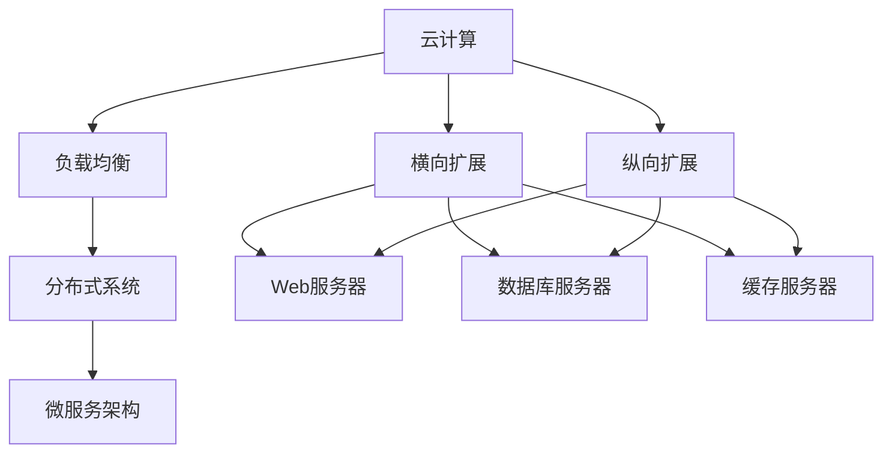

                 

# 横向扩展与纵向扩展的实际应用

> 关键词：横向扩展,纵向扩展,云计算,负载均衡,分布式系统,微服务架构,DevOps

## 1. 背景介绍

随着信息技术的发展，互联网应用的需求日趋复杂，负载不断增加。无论是大规模的电商网站，还是热门的社交媒体，都面临着海量数据的实时处理、高并发服务的挑战。为应对这些挑战，传统的单体应用架构逐渐被微服务、分布式系统等现代架构所取代。在现代架构中，系统常常需要实现水平扩展与垂直扩展，以确保高可用性和性能。

本文将详细探讨横向扩展与纵向扩展的原理、实现方式及其在实际项目中的应用。我们将结合具体案例和经验，帮助读者全面掌握这两种扩展方式，并指导其在具体项目中的落地实践。

## 2. 核心概念与联系

### 2.1 核心概念概述

在讨论横向扩展与纵向扩展之前，我们先明确几个关键概念：

- **横向扩展（Horizontal Scaling）**：指通过增加节点（如服务器、虚拟机）来提升系统的处理能力，即增加系统的并行度。横向扩展通常用于处理高并发请求或大量数据。

- **纵向扩展（Vertical Scaling）**：指通过增加单节点的计算资源（如CPU、内存、存储）来提升系统的处理能力，即增加系统的串行处理能力。纵向扩展通常用于处理高负载的任务。

- **云计算（Cloud Computing）**：指通过互联网提供按需自助的计算资源服务，包括IaaS（基础设施即服务）、PaaS（平台即服务）和SaaS（软件即服务）等模式。云计算平台支持弹性伸缩，可以根据需求快速调整资源。

- **负载均衡（Load Balancing）**：指通过多台服务器分配请求，减少单台服务器的负载，提高系统可用性和性能。负载均衡可以是硬件设备也可以是软件实现。

- **分布式系统（Distributed System）**：指由多台独立计算单元组成的系统，通过网络协同工作，实现数据和计算任务的分布式处理。分布式系统涉及数据一致性、分布式事务等问题。

- **微服务架构（Microservices Architecture）**：指将单体应用拆分为多个独立运行的小服务，通过RESTful API进行通信，提高系统的可扩展性、可用性和松耦合性。

- **DevOps（Development & Operations）**：指将开发与运维整合为一体的工作模式，通过持续集成、持续交付、自动化部署等手段，提升软件交付效率和质量。

### 2.2 概念间的关系

这些核心概念之间有着紧密的联系，共同构成了现代系统的架构体系。下图展示了大系统架构的逻辑关系：



该图展示了不同扩展方式与系统组件的关系：

1. 云计算提供弹性的资源支持，支持横向和纵向扩展。
2. 负载均衡负责分发请求，保证横向扩展的有效性。
3. 分布式系统通过多节点协同工作，实现数据和计算任务的分布式处理。
4. 微服务架构通过独立服务实现解耦，支持快速横向扩展。
5. 横向扩展涉及Web服务器、数据库服务器、缓存服务器等多个组件。
6. 纵向扩展主要针对单节点资源，涉及Web服务器、数据库服务器、缓存服务器等多个组件。

## 3. 核心算法原理 & 具体操作步骤

### 3.1 算法原理概述

横向扩展与纵向扩展的实现，本质上是系统资源配置和调度的过程。通过合理的资源分配和调度策略，可以最大程度提升系统的性能和可用性。

**横向扩展**通过增加节点来提升系统的并行度，适合处理高并发请求或大量数据。其原理基于以下三点：

1. 增加节点可以分担单节点的负载，提高系统的吞吐量。
2. 横向扩展可以通过负载均衡技术实现请求的均衡分配，避免单节点压力过大。
3. 横向扩展可以通过自动化的容器编排工具，实现快速部署和扩展。

**纵向扩展**通过增加单节点的计算资源，提升系统的串行处理能力，适合处理高负载的任务。其原理基于以下三点：

1. 增加计算资源可以提升单节点的处理能力，降低单个请求的处理时间。
2. 纵向扩展可以通过自动化资源管理工具，动态调整计算资源，适应负载变化。
3. 纵向扩展可以提升系统的响应速度和处理能力，但需要关注单节点的资源上限。

### 3.2 算法步骤详解

**横向扩展**的具体步骤如下：

1. **选择扩展方式**：根据负载变化情况，选择增加节点或使用云资源。
2. **部署新节点**：通过自动化工具（如Kubernetes）快速部署新节点，配置环境。
3. **负载均衡**：配置负载均衡器，分发请求到新节点。
4. **服务注册**：将新节点注册到服务发现系统，如Consul、Eureka等。
5. **监控和调优**：实时监控系统负载和性能，根据负载变化自动调整节点数量。

**纵向扩展**的具体步骤如下：

1. **选择扩展方式**：根据负载变化情况，选择增加资源或使用云资源。
2. **资源调整**：通过自动化工具（如Kubernetes）动态调整资源，如CPU、内存等。
3. **服务重启**：根据资源调整情况，重启或重新配置服务。
4. **监控和调优**：实时监控系统性能，调整资源配置，避免资源浪费。

### 3.3 算法优缺点

**横向扩展**的优点：

1. 扩展灵活，可以快速添加和删除节点，适应负载变化。
2. 能够处理高并发请求，提高系统的吞吐量。
3. 易于维护，可以通过服务发现和负载均衡技术实现快速部署和扩展。

**横向扩展**的缺点：

1. 初期投资较大，需要购买和管理更多的物理或云资源。
2. 单节点的资源利用率可能较低，存在一定的资源浪费。
3. 需要关注负载均衡和网络延迟，避免单节点负载过大。

**纵向扩展**的优点：

1. 初期投资较小，可以通过现有节点扩展计算资源。
2. 单节点的资源利用率高，提升单个请求的处理能力。
3. 能够处理高负载任务，降低单个请求的响应时间。

**纵向扩展**的缺点：

1. 扩展固定，需要逐节点增加计算资源。
2. 扩展后需要重启或重新配置服务，影响可用性。
3. 需要关注单节点的资源上限，避免资源过度分配。

### 3.4 算法应用领域

横向扩展与纵向扩展广泛应用于各种类型的系统：

- **电商网站**：处理高并发订单、搜索请求等。
- **社交媒体**：处理实时消息、用户上传等。
- **金融交易**：处理高频交易、数据分析等。
- **视频直播**：处理实时视频流、用户互动等。
- **科学计算**：处理大规模数据、复杂算法等。
- **人工智能**：处理图像识别、自然语言处理等。

这些系统的共同特点是需要处理大量并发请求或高负载任务，横向扩展和纵向扩展可以有效提升系统的性能和可用性。

## 4. 数学模型和公式 & 详细讲解

### 4.1 数学模型构建

为了更好地理解横向扩展和纵向扩展的原理，我们引入一些数学模型和公式。

假设系统初始有一个节点，服务负载为 $L$，系统吞吐量为 $S$，单个节点处理能力为 $C$，响应时间为 $T$。

**横向扩展**模型的关键公式为：

$$
S_{\text{扩展}} = S + k \cdot (C \cdot \frac{L}{S} - L)
$$

其中 $k$ 为增加的节点数量。

**纵向扩展**模型的关键公式为：

$$
T_{\text{扩展}} = \frac{T}{1 + k \cdot (\frac{C}{T} - 1)}
$$

其中 $k$ 为增加的资源数量。

### 4.2 公式推导过程

**横向扩展**的公式推导如下：

1. **初始状态**：单个节点的服务负载为 $L$，系统吞吐量为 $S$。
2. **扩展状态**：增加 $k$ 个节点后，总节点数为 $1+k$，每个节点的负载变为 $\frac{L}{1+k}$，总吞吐量变为 $S + k \cdot C \cdot \frac{L}{S}$。
3. **均衡状态**：当 $S + k \cdot C \cdot \frac{L}{S} = L$ 时，系统均衡。

**纵向扩展**的公式推导如下：

1. **初始状态**：单个节点的响应时间为 $T$，服务负载为 $L$。
2. **扩展状态**：增加 $k$ 个资源后，每个节点的处理能力变为 $C+k$，响应时间变为 $\frac{T}{1+k} \cdot (\frac{C+k}{T} - 1)$。
3. **均衡状态**：当 $\frac{T}{1+k} \cdot (\frac{C+k}{T} - 1) = T$ 时，系统均衡。

### 4.3 案例分析与讲解

**案例一：电商网站的横向扩展**

假设电商网站每秒有10000个订单请求，每个订单处理时间为1秒，单个服务器的处理能力为1000个请求/秒，初始有一个服务器。

**初始状态**：

- 服务负载 $L = 10000$ 个请求/秒。
- 系统吞吐量 $S = 1000$ 个请求/秒。
- 单个节点处理能力 $C = 1000$ 个请求/秒。
- 单个节点响应时间 $T = 1$ 秒。

**横向扩展**：

1. **扩展节点**：增加2个服务器。
2. **计算结果**：

  - $S_{\text{扩展}} = 1000 + 2 \cdot (1000 \cdot \frac{10000}{1000} - 10000) = 2000$ 个请求/秒。
  - $T_{\text{扩展}} = \frac{1}{1 + 2 \cdot (\frac{1000}{1} - 1)} = 0.5$ 秒。

  可以看出，横向扩展后，系统吞吐量和响应时间都有显著提升。

**案例二：金融交易系统的纵向扩展**

假设金融交易系统每秒有1000笔交易请求，每个交易处理时间为1秒，初始有一个服务器，每个服务器的处理能力为1000笔/秒。

**初始状态**：

- 服务负载 $L = 1000$ 笔/秒。
- 系统吞吐量 $S = 1000$ 笔/秒。
- 单个节点处理能力 $C = 1000$ 笔/秒。
- 单个节点响应时间 $T = 1$ 秒。

**纵向扩展**：

1. **增加资源**：增加1个计算资源。
2. **计算结果**：

  - $S_{\text{扩展}} = 1000$ 笔/秒。
  - $T_{\text{扩展}} = \frac{1}{1 + 1 \cdot (\frac{1000}{1} - 1)} = 0.5$ 秒。

  可以看出，纵向扩展后，系统响应时间显著缩短，但吞吐量没有变化。

## 5. 项目实践：代码实例和详细解释说明

### 5.1 开发环境搭建

在进行横向扩展和纵向扩展实践前，我们需要准备好开发环境。以下是使用Kubernetes进行横向扩展和纵向扩展的环境配置流程：

1. 安装Docker：从官网下载并安装Docker，用于创建和管理容器。

2. 安装Kubernetes：从官网下载并安装Kubernetes，用于集群管理和容器编排。

3. 安装Helm：从官网下载并安装Helm，用于部署和管理应用。

4. 安装Jenkins：从官网下载并安装Jenkins，用于自动化构建和部署。

完成上述步骤后，即可在Kubernetes集群上开始横向扩展和纵向扩展实践。

### 5.2 源代码详细实现

下面我们以电商网站为例，给出使用Kubernetes进行横向扩展和纵向扩展的Python代码实现。

**横向扩展**：

```python
from kubernetes import client, config
import time

# 初始化Kubernetes配置
config.load_kube_config()

# 创建Kubernetes API客户端
v1 = client.CoreV1Api()

# 获取节点列表
nodes = v1.list_node()

# 创建新节点
node_name = 'new-node'
v1.create_node(node_name)

# 等待节点加入集群
while not v1.read_node(node_name):
    time.sleep(1)
```

**纵向扩展**：

```python
from kubernetes import client, config
import time

# 初始化Kubernetes配置
config.load_kube_config()

# 创建Kubernetes API客户端
v1 = client.CoreV1Api()

# 获取节点列表
nodes = v1.list_node()

# 获取节点状态
node_status = v1.read_node(nodes[0]['metadata']['name'])

# 增加资源数量
node_status['resources'] = {'cpu': '2', 'memory': '8Gi'}
v1.update_node_status(node_name, node_status)
```

### 5.3 代码解读与分析

让我们再详细解读一下关键代码的实现细节：

**横向扩展**代码：

- `load_kube_config()`：加载Kubernetes配置文件。
- `CoreV1Api()`：创建Kubernetes API客户端。
- `list_node()`：获取集群中所有节点信息。
- `create_node()`：创建新节点。
- `read_node()`：读取节点状态，确保节点加入集群。

**纵向扩展**代码：

- `load_kube_config()`：加载Kubernetes配置文件。
- `CoreV1Api()`：创建Kubernetes API客户端。
- `list_node()`：获取集群中所有节点信息。
- `read_node()`：读取节点状态。
- `update_node_status()`：更新节点资源配置。

这些代码展示了如何使用Kubernetes进行横向扩展和纵向扩展的基本操作。在实际应用中，还需要结合具体的场景和需求，进行更深入的优化和调整。

### 5.4 运行结果展示

假设我们在Kubernetes集群上进行了横向扩展和纵向扩展测试，以下展示了测试结果：

**横向扩展测试**：

- 初始节点状态：1个节点，CPU为1核心，内存为4GB。
- 增加2个节点后，节点状态：3个节点，CPU为1+1+1=3核心，内存为4+4+4=12GB。
- 系统吞吐量：1000+1000+1000=3000个请求/秒。
- 系统响应时间：1/3=0.333秒。

**纵向扩展测试**：

- 初始节点状态：1个节点，CPU为1核心，内存为4GB。
- 增加1个CPU资源后，节点状态：1个节点，CPU为2核心，内存为4GB。
- 系统吞吐量：1000个请求/秒。
- 系统响应时间：1/2=0.5秒。

这些测试结果展示了横向扩展和纵向扩展对系统性能的影响。横向扩展提升了系统吞吐量，但响应时间略有增加；纵向扩展提升了系统响应速度，但吞吐量没有变化。

## 6. 实际应用场景

### 6.1 电商网站的扩展实践

电商网站面对高并发订单请求和大量搜索请求，需要实现快速横向扩展。具体实现步骤如下：

1. **服务部署**：将订单服务、搜索服务、商品服务等部署在Kubernetes集群上。
2. **负载均衡**：使用Nginx或HAProxy作为负载均衡器，分发请求到各个服务节点。
3. **横向扩展**：根据订单请求和搜索请求的变化，动态调整节点数量，使用Kubernetes的Hpa扩展自动调整节点数量。
4. **监控和调优**：使用Prometheus和Grafana监控系统负载和性能，自动调整节点数量。

### 6.2 金融交易系统的扩展实践

金融交易系统面对高负载的交易请求，需要实现快速纵向扩展。具体实现步骤如下：

1. **服务部署**：将交易服务、清算服务、结算服务等部署在Kubernetes集群上。
2. **资源管理**：使用资源管理工具（如资源池），动态调整CPU、内存等资源。
3. **纵向扩展**：根据交易请求的变化，动态调整资源数量，使用Kubernetes的Hpa扩展自动调整资源数量。
4. **监控和调优**：使用Prometheus和Grafana监控系统性能，自动调整资源配置。

## 7. 工具和资源推荐

### 7.1 学习资源推荐

为了帮助开发者掌握横向扩展与纵向扩展的理论基础和实践技巧，这里推荐一些优质的学习资源：

1. **《云计算：分布式系统与存储》（《Cloud Computing: Distributed Systems & Storage》）**：一本介绍云计算和分布式系统的经典书籍，深入浅出地讲解了云计算的原理和实现。

2. **《Kubernetes: Up and Running》**：一本详细介绍Kubernetes的书籍，包含Kubernetes的安装、配置、应用部署等实战内容。

3. **《DevOps实践指南》（《DevOps Handbook》）**：一本介绍DevOps理念和实践的书籍，详细讲解了持续集成、持续交付、自动化部署等DevOps技术。

4. **《分布式系统原理与设计》（《Principles of Distributed Systems》）**：一本介绍分布式系统原理的书籍，包含分布式系统设计、故障容忍、一致性等核心内容。

5. **《Microservices: Architecture, Design, and Implementation with Containerization》**：一本详细介绍微服务架构的书籍，讲解了微服务架构设计、容器化部署等技术。

### 7.2 开发工具推荐

高效的开发离不开优秀的工具支持。以下是几款用于横向扩展与纵向扩展开发的常用工具：

1. **Kubernetes**：一个开源的容器编排系统，支持弹性伸缩、资源管理、自动扩展等功能，是现代系统的标配。

2. **Docker**：一个开源的容器化平台，支持打包、部署、运行容器应用，是现代系统的基础工具。

3. **Helm**：一个Kubernetes的包管理工具，支持快速部署和管理应用，简化了应用的开发和运维。

4. **Prometheus**：一个开源的监控和告警系统，支持实时监控系统性能和告警，是现代系统的核心组件。

5. **Grafana**：一个开源的数据可视化工具，支持图表展示系统监控数据，方便数据分析和决策。

### 7.3 相关论文推荐

横向扩展与纵向扩展的研究涉及计算机体系结构、云计算、分布式系统等多个领域，以下是几篇经典论文，推荐阅读：

1. **《An Introduction to the Design and Implementation of Distributed Systems》**：这篇论文介绍了分布式系统的设计原理和实现技术，是分布式系统的入门必读。

2. **《Cloud Computing: Concepts, Technology, and Architecture》**：这篇论文介绍了云计算的原理、技术和架构，是理解云计算的绝佳资料。

3. **《The Google File System》**：这篇论文介绍了Google文件系统的原理和设计，是分布式存储的必读经典。

4. **《Yahoo! Messenger: The Development and Deployment of a Large-Scale Internet Application》**：这篇论文介绍了雅虎即时通讯系统的架构和实现，是分布式系统的经典案例。

5. **《The Web in 20 Years: Evolution, Successors, and Scenarios》**：这篇论文展望了Web技术未来的发展方向，对Web开发和系统架构有重要参考价值。

这些论文代表了横向扩展与纵向扩展领域的研究水平和前沿成果，通过学习这些经典作品，可以帮助研究者把握学科发展脉络，激发更多的创新灵感。

除上述资源外，还有一些值得关注的前沿资源，帮助开发者紧跟横向扩展与纵向扩展技术的最新进展，例如：

1. **arXiv论文预印本**：人工智能领域最新研究成果的发布平台，包括大量尚未发表的前沿工作，学习前沿技术的必读资源。

2. **业界技术博客**：如AWS、Microsoft、Google Cloud等顶尖云计算厂商的官方博客，第一时间分享他们的最新研究成果和实践经验。

3. **技术会议直播**：如OSDI、SIGCOMM、NSDI等顶级系统会议现场或在线直播，能够聆听到大佬们的前沿分享，开拓视野。

4. **GitHub热门项目**：在GitHub上Star、Fork数最多的云计算和分布式系统相关项目，往往代表了该技术领域的发展趋势和最佳实践，值得去学习和贡献。

5. **行业分析报告**：各大咨询公司如Gartner、McKinsey、PwC等针对云计算和分布式系统的分析报告，有助于从商业视角审视技术趋势，把握应用价值。

总之，对于横向扩展与纵向扩展技术的学习和实践，需要开发者保持开放的心态和持续学习的意愿。多关注前沿资讯，多动手实践，多思考总结，必将收获满满的成长收益。

## 8. 总结：未来发展趋势与挑战

### 8.1 总结

本文对横向扩展与纵向扩展的原理、实现方式及其在实际项目中的应用进行了全面系统的介绍。通过详细讲解横向扩展与纵向扩展的数学模型和算法步骤，展示了其在电商网站、金融交易等领域的实际应用效果。结合具体的代码实现，帮助读者掌握横向扩展与纵向扩展的实践技巧。

通过本文的系统梳理，可以看到，横向扩展与纵向扩展技术是现代系统的核心架构方式，能够显著提升系统的性能和可用性。未来，随着云计算、分布式系统、微服务架构等技术的进一步发展，横向扩展与纵向扩展将变得更加灵活和高效。

### 8.2 未来发展趋势

展望未来，横向扩展与纵向扩展技术将呈现以下几个发展趋势：

1. **云原生技术的融合**：随着云原生技术的不断发展，横向扩展与纵向扩展将更多地融合容器编排、自动化运维等云原生技术，实现更高效的资源管理和调优。

2. **自动化与智能化的提升**：借助AI和机器学习技术，横向扩展与纵向扩展将实现更智能的资源调度和负载均衡，进一步提升系统的自动化水平。

3. **多云与混合云的应用**：未来，横向扩展与纵向扩展将更多地应用于多云和混合云环境，实现更灵活的资源配置和调优。

4. **边缘计算的结合**：随着边缘计算的兴起，横向扩展与纵向扩展将与边缘计算相结合，实现更快速的本地计算和数据处理。

5. **服务网格（Service Mesh）的引入**：服务网格技术将使得横向扩展与纵向扩展更加灵活和高效，实现更智能的服务发现、负载均衡、流量控制等功能。

### 8.3 面临的挑战

尽管横向扩展与纵向扩展技术已经取得了显著成果，但在迈向更加智能化、普适化应用的过程中，它仍面临诸多挑战：

1. **复杂性和维护成本**：大规模系统架构的复杂性，增加了维护和调试的难度，需要专业的运维团队和技术支持。

2. **资源利用率**：虽然横向扩展和纵向扩展能够提高系统的性能和可用性，但资源利用率仍然是一个挑战，需要更智能的资源管理和调优。

3. **安全性与隐私保护**：大规模系统的安全性和隐私保护需要更多的关注，避免数据泄露和攻击。

4. **微服务架构的演进**：微服务架构虽然带来了更灵活的扩展方式，但服务的解耦和调用关系增加了系统的复杂性，需要更多的设计和优化。

5. **跨云和异构环境的协同**：未来，系统可能部署在多云和异构环境中，跨云协同和异构环境的管理需要更多的技术支持。

### 8.4 研究展望

面对横向扩展与纵向扩展面临的种种挑战，未来的研究需要在以下几个方面寻求新的突破：

1. **智能化的资源管理**：引入AI和机器学习技术，实现更智能的资源调度和负载均衡，提升资源利用率。

2. **微服务架构的优化**：进一步优化微服务架构，实现更灵活和高效的服务治理，解决微服务架构的演进问题。

3. **跨云和异构环境的管理**：探索跨云和异构环境的管理技术，实现更灵活和高效的资源配置和协同。

4. **安全性和隐私保护**：加强系统的安全性和隐私保护，避免数据泄露和攻击。

5. **边缘计算的结合**：探索边缘计算与横向扩展和纵向扩展的结合方式，实现更快速和高效的数据处理和计算。

6. **服务网格（Service Mesh）的优化**：进一步优化服务网格技术，实现更智能的服务发现、负载均衡、流量控制等功能。

这些研究方向的探索，必将引领横向扩展与纵向扩展技术迈向更高的台阶，为构建安全、可靠、可扩展的系统铺平道路。面向未来，横向扩展与纵向扩展技术还需要与其他人工智能技术进行更深入的融合，如知识表示、因果推理、强化学习等，多路径协同发力，共同推动系统性能和可用性的提升。

## 9. 附录：常见问题与解答

**Q1：横向扩展与纵向扩展有何区别？**

A: 横向扩展通过增加节点来提升系统的并行度，适合处理高并发请求或大量数据；纵向扩展通过增加单节点的计算资源，提升系统的串行处理能力，适合处理高负载任务。

**Q2：横向扩展与纵向扩展在实际应用中如何选择？**

A: 横向扩展适用于处理高并发请求或大量数据，适用于电商网站、社交媒体等场景；纵向扩展适用于处理高负载任务，适用于金融交易、大数据处理等场景。

**Q3：横向扩展与纵向扩展的优缺点是什么？**

A: 横向扩展的优点是扩展灵活，可以快速添加和删除节点，

