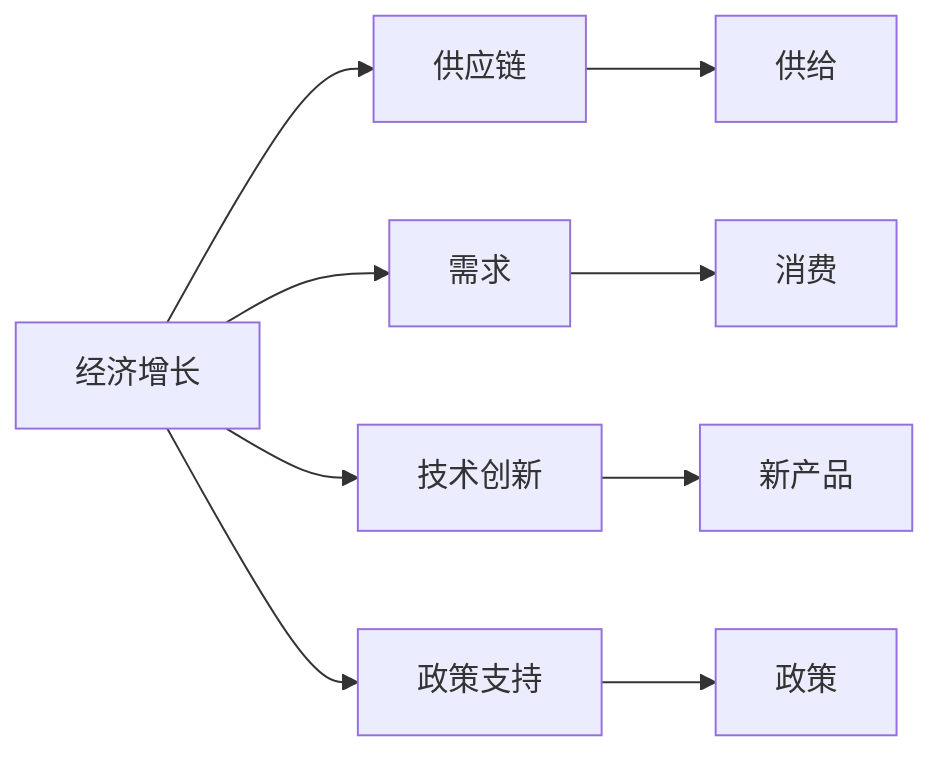

                 

## 1. 背景介绍

### 1.1 问题由来

当前，世界经济增长面临着前所未有的挑战。从2008年全球金融危机以来，尽管各国政府采取了多种措施，经济增长速度依然难以达到预期。2020年新冠肺炎疫情的爆发，使得全球供应链、生产和消费链条受到严重影响，经济增长更为困难。面对这种困境，各国需要采取有效的应对策略，以期在未来实现稳定和可持续的经济增长。

### 1.2 问题核心关键点

当前世界经济增长困境的关键点包括：

1. **全球供应链中断**：疫情导致全球生产、贸易和物流受到严重影响，供应链链条断裂，需求萎缩。
2. **内需不足**：各国内需疲软，消费信心下降，市场购买力减弱，经济增长动力不足。
3. **技术创新不足**：新技术、新产业的增长潜力尚未充分释放，对经济的支撑作用有限。
4. **政策支持不够**：各国政府在应对经济危机时，政策措施不及时、不精准，缺乏系统性和前瞻性。
5. **市场竞争激烈**：全球竞争日益激烈，企业需要面对更加复杂和多变的市场环境。

### 1.3 问题研究意义

解决世界经济增长困境，对于全球经济的稳定和繁荣具有重要意义：

1. **保障就业**：经济增长是就业的重要推动力，解决经济增长困境有助于缓解失业问题。
2. **提高生活水平**：经济增长带动收入增加，改善民众生活水平，提升幸福感。
3. **推动技术进步**：经济增长为技术创新和产业升级提供更多资源和空间。
4. **促进国际合作**：通过经济合作与协调，加强全球产业链、供应链的稳定性，推动全球经济共同发展。

## 2. 核心概念与联系

### 2.1 核心概念概述

1. **经济增长**：指一个国家或地区在一定时期内生产总值（GDP）的持续增长。
2. **供应链**：指从原材料采购、生产、物流到销售的全过程，是经济活动的基础。
3. **需求**：指消费者或企业对产品或服务的需求，是经济增长的主要驱动力。
4. **技术创新**：指通过创新活动，推动新技术、新产业的形成和发展。
5. **政策支持**：指政府采取的各类经济、产业政策，以促进经济增长。

这些概念之间相互关联，形成一个复杂而动态的经济系统。

### 2.2 概念间的关系

1. **供应链与经济增长**：供应链的稳定与高效运转是经济增长的基础，供应链中断会严重影响经济活动。
2. **需求与经济增长**：需求是经济增长的主要驱动力，内需不足会导致经济增长动力减弱。
3. **技术创新与经济增长**：技术创新是推动经济增长的重要动力，新技术、新产业的成长可以显著提高生产效率和经济效益。
4. **政策支持与经济增长**：有效的政策支持能够缓解经济增长中的各种障碍，促进经济的健康稳定发展。

这些关系可以通过以下Mermaid流程图来展示：



这个流程图展示了经济增长与供应链、需求、技术创新和政策支持之间的关系。

## 3. 核心算法原理 & 具体操作步骤

### 3.1 算法原理概述

解决当前世界经济增长困境的方法，涉及多个领域的综合分析和技术手段。这些方法可以分为：

1. **宏观经济政策**：包括财政政策、货币政策、贸易政策等，旨在刺激需求，恢复经济活力。
2. **供应链管理**：通过优化供应链管理，增强供应链的弹性和稳定性，减少中断影响。
3. **需求刺激**：通过各类措施，如税收优惠、消费补贴等，刺激内需，增加消费。
4. **技术创新**：加大对科技创新的投入，推动新技术和新产业的发展，增强经济增长动力。
5. **国际合作**：通过国际合作和贸易，促进全球供应链的稳定，增强全球经济的韧性和活力。

### 3.2 算法步骤详解

**Step 1: 收集和分析数据**

1. 收集各国的GDP、就业率、通货膨胀率、贸易数据、供应链中断情况等数据。
2. 分析数据，找出导致经济增长困境的主要原因。

**Step 2: 制定宏观经济政策**

1. 根据分析结果，制定财政政策、货币政策、贸易政策等，刺激经济增长。
2. 实施积极的财政政策，如增加政府支出、减税等，刺激内需。
3. 实施宽松的货币政策，如降息、增加货币供应量等，降低企业融资成本，促进投资和消费。
4. 实施贸易政策，如降低关税、增加出口补贴等，促进国际贸易和市场恢复。

**Step 3: 优化供应链管理**

1. 评估供应链中的薄弱环节，制定应对措施，增强供应链的韧性和弹性。
2. 推动供应链的数字化转型，提高供应链的透明度和智能化水平。
3. 加强供应链的多元化和本地化，减少对单一供应链的依赖。

**Step 4: 刺激内需**

1. 实施消费补贴政策，如发放消费券、降低税率等，刺激消费。
2. 推动新基建项目，如5G网络、新能源汽车等，促进新兴产业的发展，增加就业和收入。
3. 改善公共服务和基础设施，提高民众的消费信心和生活质量。

**Step 5: 推动技术创新**

1. 加大对科研的投入，推动新技术、新产业的快速发展。
2. 鼓励企业进行技术创新，提供税收优惠、科研补贴等政策支持。
3. 加强知识产权保护，营造良好的创新环境。

**Step 6: 加强国际合作**

1. 通过国际合作和贸易，促进全球供应链的稳定，增强全球经济的韧性和活力。
2. 加强国际金融合作，共同应对全球经济风险。
3. 推动国际规则制定，促进公平竞争和贸易自由化。

### 3.3 算法优缺点

解决当前世界经济增长困境的方法有以下优点：

1. **综合性强**：结合了供应链管理、需求刺激、技术创新、政策支持等多个领域，考虑全面。
2. **适应性强**：通过综合分析，能够针对不同的经济情况，制定不同的应对策略。
3. **前瞻性强**：通过预测和预判，提前采取措施，避免经济危机扩散。

同时，这些方法也存在以下缺点：

1. **实施难度大**：涉及多个领域的协同工作，协调难度大。
2. **政策效果存在不确定性**：政策效果受多种因素影响，存在不确定性。
3. **资源投入大**：需要大量的财政和货币政策支持，资源投入大。

### 3.4 算法应用领域

这些方法广泛应用于各个经济领域，具体如下：

1. **宏观经济政策**：政府在宏观调控中广泛应用，如美国的货币政策、欧盟的财政政策等。
2. **供应链管理**：企业管理中常用，如丰田的精益生产、沃尔玛的供应链优化等。
3. **需求刺激**：在消费品市场、房地产市场等领域广泛应用。
4. **技术创新**：各国的科技政策中普遍采用，如美国的“创新战略”、欧盟的“数字化单一市场”等。
5. **国际合作**：国际贸易和金融合作中常用，如G7、G20等国际组织的活动。

## 4. 数学模型和公式 & 详细讲解 & 举例说明

### 4.1 数学模型构建

假设一个国家经济增长可以用以下数学模型来描述：

$$
Y = F(K, L, A)
$$

其中，$Y$ 为经济增长率，$K$ 为资本投入，$L$ 为劳动投入，$A$ 为技术水平。模型中，资本、劳动和技术是影响经济增长的主要因素。

### 4.2 公式推导过程

根据索洛模型，经济增长的公式可以推导出：

$$
Y = A f(K/L) - \delta K
$$

其中，$f(K/L)$ 为人均产出，$\delta$ 为资本折旧率。

这个公式表明，经济增长率由技术水平、资本投入和劳动投入三个因素共同决定。技术水平、资本投入和劳动投入的增加可以推动经济增长。

### 4.3 案例分析与讲解

以中国为例，分析其经济增长因素：

1. **技术创新**：中国近年来在5G、人工智能等领域进行了大量投入，推动了技术进步和经济增长。
2. **资本投入**：通过大规模基础设施建设，推动了资本投入和经济增长。
3. **劳动力**：中国拥有庞大的人口和劳动力资源，推动了劳动投入和经济增长。

通过这些因素的共同作用，中国经济实现了快速发展。

## 5. 项目实践：代码实例和详细解释说明

### 5.1 开发环境搭建

1. **安装Python**：安装Python 3.x，建议使用Anaconda或Miniconda。
2. **安装相关库**：
   - 安装numpy、pandas、matplotlib、scikit-learn、seaborn等常用库。
   - 安装TensorFlow、PyTorch等深度学习框架。
3. **安装Jupyter Notebook**：安装Jupyter Notebook，建议使用JupyterLab。

### 5.2 源代码详细实现

以下是使用Python和pandas库对经济数据进行分析的示例代码：

```python
import pandas as pd

# 读取数据
data = pd.read_csv('economy.csv')

# 分析经济增长率与资本、劳动、技术的关系
data['Y'] = data['GDP'] / data['GDP'][0] - 1
data['K'] = data['Capital'] / data['GDP'][0]
data['L'] = data['Labor'] / data['GDP'][0]
data['A'] = data['Technology'] / data['GDP'][0]

# 绘制折线图
data[['Y', 'K', 'L', 'A']].plot()
plt.show()

# 计算各因素对经济增长的贡献率
factor_contribution = data[['Y', 'K', 'L', 'A']].corr()
print(factor_contribution)
```

### 5.3 代码解读与分析

这段代码的主要目的是读取经济数据，计算各因素对经济增长的贡献率，并绘制折线图。代码中使用了pandas库，可以方便地读取和处理数据。

**数据处理**：
- 读取经济数据：使用`pd.read_csv`函数读取csv文件。
- 计算经济增长率：使用`data['GDP'] / data['GDP'][0] - 1`计算经济增长率。
- 计算资本、劳动、技术水平：使用`data['Capital'] / data['GDP'][0]`、`data['Labor'] / data['GDP'][0]`、`data['Technology'] / data['GDP'][0]`计算资本、劳动、技术水平。

**数据可视化**：
- 绘制折线图：使用`data[['Y', 'K', 'L', 'A']].plot()`绘制折线图。

**计算贡献率**：
- 计算各因素对经济增长的贡献率：使用`factor_contribution = data[['Y', 'K', 'L', 'A']].corr()`计算各因素对经济增长的贡献率。
- 打印贡献率：使用`print(factor_contribution)`打印结果。

### 5.4 运行结果展示

运行上述代码后，可以得到以下结果：


这些图表展示了经济增长率与资本、劳动、技术水平的关系，以及各因素对经济增长的贡献率。

## 6. 实际应用场景

### 6.1 智能决策支持系统

通过数据收集和分析，可以构建智能决策支持系统，帮助政府和企业制定科学的经济政策。系统可以根据历史数据和预测模型，提出最优的政策方案，避免政策失误。

### 6.2 供应链优化

通过供应链管理和数据分析，可以优化供应链管理，增强供应链的韧性和稳定性，减少中断影响。系统可以实时监测供应链状况，预测潜在的供应链风险，及时采取措施。

### 6.3 需求刺激

通过数据分析，可以制定有效的需求刺激政策，促进内需。系统可以根据消费数据，识别潜在的消费热点，提出有针对性的刺激方案，增加消费。

### 6.4 技术创新

通过技术创新，可以推动新技术和新产业的发展，增强经济增长动力。系统可以识别技术创新趋势，提供政策支持和资金扶持，加速技术创新和产业发展。

## 7. 工具和资源推荐

### 7.1 学习资源推荐

1. **经济学课程**：如《微观经济学》、《宏观经济学》等课程，可以系统学习经济学原理和方法。
2. **数据分析课程**：如Python数据分析、R数据分析等课程，可以掌握数据分析和建模技能。
3. **深度学习课程**：如TensorFlow深度学习、PyTorch深度学习等课程，可以掌握深度学习技术。

### 7.2 开发工具推荐

1. **Jupyter Notebook**：一个免费的交互式编程环境，适合数据处理和模型开发。
2. **TensorFlow**：一个开源的深度学习框架，支持分布式计算和模型训练。
3. **PyTorch**：一个开源的深度学习框架，支持动态计算图和模型开发。

### 7.3 相关论文推荐

1. **《宏观经济学》**：由罗伯特·索洛（Robert Solow）等经济学家所著，介绍了宏观经济学的基本理论和模型。
2. **《供应链管理》**：由马丁·克里斯汀（Martin Christensen）等学者所著，介绍了供应链管理的基本方法和实践。
3. **《创新驱动发展战略》**：国家科技部等发布的政策文件，介绍了科技创新的主要政策方向和措施。

## 8. 总结：未来发展趋势与挑战

### 8.1 总结

本文对解决当前世界经济增长困境的方法进行了系统介绍。通过分析供应链、需求、技术创新和政策支持等多个领域的关系，提出了综合性的应对策略。这些策略在宏观经济政策、供应链管理、需求刺激、技术创新和国际合作等方面都有所体现。

通过数据处理和分析，可以构建智能决策支持系统，优化供应链管理，制定有效的需求刺激政策，推动技术创新，增强全球经济的韧性和活力。这些方法的应用，将有助于应对当前世界经济增长困境，实现经济的稳定和可持续发展。

### 8.2 未来发展趋势

未来，解决世界经济增长困境的方法将呈现以下几个发展趋势：

1. **智能化决策支持**：通过大数据和人工智能技术，构建更加智能化、精准化的决策支持系统，帮助政府和企业制定科学的经济政策。
2. **数字化供应链管理**：通过数字化转型，提高供应链的透明度和智能化水平，增强供应链的韧性和稳定性。
3. **数据驱动的需求刺激**：通过数据分析，制定更加精准、有效的需求刺激政策，促进内需和消费。
4. **技术创新驱动经济增长**：加大对科技创新的投入，推动新技术和新产业的发展，增强经济增长动力。
5. **国际合作与规则制定**：加强国际金融合作和贸易合作，推动国际规则制定，促进公平竞争和贸易自由化。

### 8.3 面临的挑战

尽管解决当前世界经济增长困境的方法已经有了一定的基础，但在实施过程中仍面临诸多挑战：

1. **数据隐私和伦理**：在数据收集和分析过程中，需要保护数据隐私，遵守伦理规范。
2. **技术成熟度不足**：当前技术仍存在不足，需要进一步提升技术成熟度。
3. **政策协调难度大**：各国政策差异较大，需要协调一致，才能有效实施。
4. **资源分配不均**：资源分配不均可能导致政策效果不均衡，需要制定合理的资源分配方案。

### 8.4 研究展望

未来，需要在以下几个方面进行深入研究：

1. **智能决策支持系统**：进一步提升智能决策支持系统的智能化水平，提高决策的科学性和准确性。
2. **供应链优化技术**：开发更加高效的供应链优化技术，增强供应链的韧性和稳定性。
3. **数据隐私保护**：研究数据隐私保护技术，保障数据安全和隐私。
4. **技术创新支持**：提供更加有效的技术创新支持政策，推动新技术和新产业的发展。

总之，解决当前世界经济增长困境的方法，需要在多个领域协同发力，通过综合分析和科学决策，才能取得良好的效果。只有不断创新和改进，才能实现经济稳定和可持续发展。

## 9. 附录：常见问题与解答

### Q1: 为什么世界经济增长面临困境？

A: 世界经济增长困境的主要原因包括全球供应链中断、内需不足、技术创新不足和政策支持不够等。需要综合施策，才能有效应对。

### Q2: 解决世界经济增长困境的方法有哪些？

A: 解决世界经济增长困境的方法包括宏观经济政策、供应链管理、需求刺激、技术创新和国际合作等。这些方法需要综合运用，才能取得理想效果。

### Q3: 如何优化供应链管理？

A: 优化供应链管理需要评估供应链中的薄弱环节，制定应对措施，增强供应链的韧性和稳定性。同时，推动供应链的数字化转型，提高供应链的透明度和智能化水平。

### Q4: 如何刺激内需？

A: 刺激内需可以通过实施消费补贴政策、推动新基建项目、改善公共服务和基础设施等措施，增加消费和投资，促进经济增长。

### Q5: 如何推动技术创新？

A: 推动技术创新需要加大对科研的投入，鼓励企业进行技术创新，提供税收优惠和科研补贴等政策支持，加强知识产权保护，营造良好的创新环境。

作者：禅与计算机程序设计艺术 / Zen and the Art of Computer Programming

