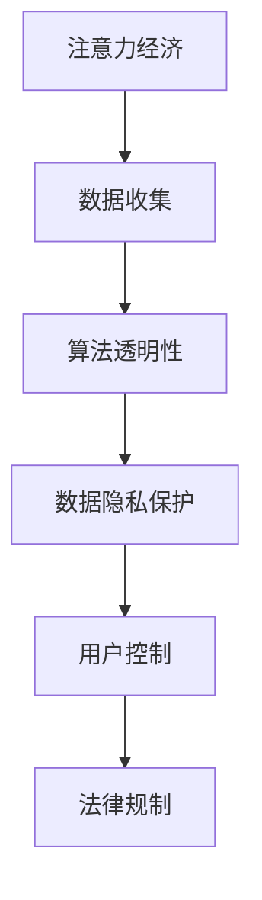

                 

# 注意力经济与个人数据主权的博弈

> 关键词：注意力经济,个人数据主权,算法透明性,数据隐私保护,用户控制,法律规制

## 1. 背景介绍

在信息爆炸的时代，数字经济的核心已经从传统的商品和服务转向了注意力和数据。如何利用算法和技术手段更好地吸引和利用用户注意力，实现数据的价值最大化，成为了企业和开发者面临的重大挑战。但与此同时，个人的数据隐私和安全问题也日益受到关注。如何在保护个人隐私的前提下，实现数据价值的最大化利用，成为了一个亟待解决的问题。

本文将探讨在注意力经济的背景下，个人数据主权和隐私保护之间的博弈关系，以及如何通过算法透明性和数据隐私保护技术，实现数据价值的最大化利用，同时保障个人的数据主权。

## 2. 核心概念与联系

### 2.1 核心概念概述

- **注意力经济**：在数字化时代，信息的注意力资源变得异常宝贵。企业和开发者通过各种算法和技术手段，吸引用户注意力，从而获取更多的用户数据和价值。注意力经济的核心在于如何更高效地分配和利用用户注意力资源。

- **个人数据主权**：指用户对其个人数据的控制权和所有权。个人数据主权的核心在于用户能够决定其数据的收集、使用和分享，并能够在需要时进行删除和修改。

- **算法透明性**：指算法的决策过程和运作机制可以被用户和监管机构透明理解和审查。算法透明性有助于提高算法的可信度和公正性，减少潜在的偏见和滥用。

- **数据隐私保护**：指在数据收集、存储、处理和传输过程中，采取必要的技术和法律手段，保障用户数据的隐私和安全，防止未经授权的访问和使用。

- **用户控制**：指用户对其个人数据的使用和分享具有充分的控制权。用户能够选择何时、何地、以何种方式分享其数据，并能够在需要时进行撤回。

- **法律规制**：指通过立法和监管手段，对个人数据主权和隐私保护进行规范和保障。法律规制是保障用户数据权利的重要工具。

这些概念之间的关系可以通过以下Mermaid流程图来展示：



这个流程图展示了这个生态系统的核心概念及其之间的关系：注意力经济驱动数据收集，算法透明性和数据隐私保护保障用户控制，法律规制提供保障。

### 2.2 概念间的关系

这些核心概念之间存在着紧密的联系，共同构成了数据价值最大化和隐私保护的双重目标。

- 注意力经济需要大量数据支持，但同时也伴随着对个人隐私的侵犯。因此，必须通过算法透明性和数据隐私保护手段，保障用户的数据主权。
- 用户控制和法律规制提供了数据收集和使用的合法性和道德约束，有助于构建更加公正和可持续的注意力经济生态系统。

## 3. 核心算法原理 & 具体操作步骤
### 3.1 算法原理概述

在注意力经济的背景下，个人数据主权和隐私保护成为了一个复杂而敏感的问题。如何通过算法和技术手段，在保障用户数据隐私的前提下，最大化数据价值，成为当前研究的重点。

### 3.2 算法步骤详解

基于这些核心概念，我们可以提出一种基于算法透明性和数据隐私保护的大数据利用框架。该框架包括以下步骤：

1. **数据收集与预处理**：使用合法手段收集用户数据，并进行去标识化、脱敏等预处理操作，保障用户数据隐私。

2. **算法设计**：设计透明和公正的算法模型，保证算法的决策过程可以被透明理解和审查。

3. **数据存储与传输**：采用加密和安全传输手段，保障数据在存储和传输过程中的安全。

4. **数据使用与分享**：在数据使用和分享过程中，保障用户的知情权和控制权，用户可以随时撤回其数据的分享和删除其数据。

5. **用户反馈与调整**：建立用户反馈机制，及时收集用户对数据使用的意见和建议，并根据反馈进行算法和数据处理的调整。

6. **法律合规与监管**：遵守相关法律法规，确保数据收集、存储、使用和分享的合法性和合规性。

### 3.3 算法优缺点

**优点**：

- 最大化数据价值：通过算法透明性和数据隐私保护手段，在保障用户数据隐私的前提下，实现数据价值的最大化利用。
- 用户数据控制权：保障用户对其个人数据的使用和分享具有充分的控制权，增强用户对数据主权的感知。
- 合规性和可信性：遵循法律和监管要求，提高算法的可信度和公正性，减少潜在的偏见和滥用。

**缺点**：

- 技术复杂性：实现数据隐私保护和算法透明性需要复杂的技术手段和严格的监管，增加了实施难度和成本。
- 隐私保护和数据价值之间的平衡：如何在保障用户隐私的前提下，最大化数据价值，需要权衡和妥协。
- 法律和监管的不确定性：数据隐私保护和算法透明性涉及的法律和监管环境复杂多变，增加了实施的难度和风险。

### 3.4 算法应用领域

这种基于算法透明性和数据隐私保护的大数据利用框架，适用于各种需要收集和利用用户数据的场景，包括但不限于：

- **电子商务**：通过算法吸引用户注意力，收集用户行为数据，实现个性化推荐和营销。
- **金融服务**：利用用户数据进行信用评估和风险控制，提供个性化的金融产品和服务。
- **医疗健康**：收集用户健康数据，进行疾病预测和健康管理，提高医疗服务的精准性和效率。
- **教育培训**：通过用户数据进行学习行为分析，提供个性化的教育培训方案。

## 4. 数学模型和公式 & 详细讲解 & 举例说明
### 4.1 数学模型构建

我们可以构建一个简单的数学模型来描述这个框架。假设有一个数据收集过程 $D$，数据预处理过程 $P$，算法模型 $A$，数据存储与传输过程 $T$，数据使用与分享过程 $S$，用户反馈与调整过程 $F$，法律合规与监管过程 $L$。则整个数据利用框架可以表示为：

$$
\text{Data Utilization Framework} = D \rightarrow P \rightarrow A \rightarrow T \rightarrow S \rightarrow F \rightarrow L
$$

### 4.2 公式推导过程

对于数据收集过程 $D$，我们假设数据收集到的用户数量为 $N$，数据收集方式为 $M$。

$$
D = \{N, M\}
$$

对于数据预处理过程 $P$，我们假设数据预处理后的数据数量为 $N'$，预处理方式为 $P'$。

$$
P = \{N', P'\}
$$

对于算法模型 $A$，我们假设算法模型为 $A(x)$，其中 $x$ 为输入数据，$y$ 为输出结果。

$$
A = \{A(x), y\}
$$

对于数据存储与传输过程 $T$，我们假设数据存储方式为 $S$，数据传输方式为 $T'$。

$$
T = \{S, T'\}
$$

对于数据使用与分享过程 $S$，我们假设数据使用方式为 $U$，数据分享方式为 $S'$。

$$
S = \{U, S'\}
$$

对于用户反馈与调整过程 $F$，我们假设用户反馈方式为 $F'$，调整方式为 $A'$。

$$
F = \{F', A'\}
$$

对于法律合规与监管过程 $L$，我们假设法律合规方式为 $L'$，监管方式为 $R'$。

$$
L = \{L', R'\}
$$

将这些过程连接起来，我们可以得到一个完整的框架模型。

### 4.3 案例分析与讲解

我们可以使用一个具体的案例来分析这个框架的应用。例如，一个电子商务平台想要通过算法吸引用户注意力，并收集用户数据进行个性化推荐。

1. **数据收集**：平台通过广告和推荐算法吸引用户注意力，收集用户浏览和购买数据。

2. **数据预处理**：对收集到的数据进行去标识化和脱敏处理，确保数据隐私。

3. **算法模型**：设计一个透明和公正的推荐算法，如协同过滤、内容推荐等。

4. **数据存储与传输**：采用加密和安全传输手段，保障数据在存储和传输过程中的安全。

5. **数据使用与分享**：向用户提供个性化推荐服务，并允许用户撤回数据分享。

6. **用户反馈与调整**：收集用户对推荐结果的反馈，并根据反馈调整算法和数据处理方式。

7. **法律合规与监管**：遵守相关法律法规，确保数据收集和使用的合法性和合规性。

## 5. 项目实践：代码实例和详细解释说明
### 5.1 开发环境搭建

在进行项目实践前，我们需要准备好开发环境。以下是使用Python进行PyTorch开发的环境配置流程：

1. 安装Anaconda：从官网下载并安装Anaconda，用于创建独立的Python环境。

2. 创建并激活虚拟环境：
```bash
conda create -n pytorch-env python=3.8 
conda activate pytorch-env
```

3. 安装PyTorch：根据CUDA版本，从官网获取对应的安装命令。例如：
```bash
conda install pytorch torchvision torchaudio cudatoolkit=11.1 -c pytorch -c conda-forge
```

4. 安装TensorFlow：
```bash
pip install tensorflow
```

5. 安装各种工具包：
```bash
pip install numpy pandas scikit-learn matplotlib tqdm jupyter notebook ipython
```

完成上述步骤后，即可在`pytorch-env`环境中开始项目实践。

### 5.2 源代码详细实现

这里我们以一个简单的推荐系统为例，给出使用TensorFlow进行推荐算法实现的代码。

首先，定义推荐系统的数据处理函数：

```python
import tensorflow as tf
import numpy as np
import pandas as pd

def load_data(file_path):
    data = pd.read_csv(file_path)
    return data.values

def preprocess_data(data):
    # 数据预处理，包括去标识化和脱敏等操作
    # 这里仅展示去标识化操作
    return data[:, 1:] # 去除第一列

def split_data(data, train_ratio):
    # 数据划分，将数据划分为训练集和测试集
    train_size = int(len(data) * train_ratio)
    train_data = data[:train_size, :]
    test_data = data[train_size:, :]
    return train_data, test_data
```

然后，定义推荐算法的模型：

```python
class RecommendationModel(tf.keras.Model):
    def __init__(self, num_users, num_items, embed_size, num_epochs):
        super(RecommendationModel, self).__init__()
        self.embedding_user = tf.keras.layers.Embedding(num_users, embed_size, input_length=1)
        self.embedding_item = tf.keras.layers.Embedding(num_items, embed_size, input_length=1)
        self.dot_product = tf.keras.layers.Dot(axes=2)
        self.dense = tf.keras.layers.Dense(1, activation='sigmoid')
        self.compile(loss='binary_crossentropy', optimizer=tf.keras.optimizers.Adam(), metrics=['accuracy'])
        
    def call(self, user_id, item_id):
        user_embeddings = self.embedding_user(user_id)
        item_embeddings = self.embedding_item(item_id)
        dot_product = self.dot_product([user_embeddings, item_embeddings])
        output = self.dense(dot_product)
        return output
```

最后，启动训练流程：

```python
num_users = 1000
num_items = 1000
embed_size = 10
num_epochs = 10

# 加载数据
data = load_data('data.csv')
data = preprocess_data(data)

# 划分数据集
train_data, test_data = split_data(data, 0.8)

# 创建模型
model = RecommendationModel(num_users, num_items, embed_size, num_epochs)

# 训练模型
model.fit(train_data, train_data[:, 2], epochs=num_epochs, batch_size=32, validation_data=(test_data, test_data[:, 2]))

# 评估模型
test_loss, test_acc = model.evaluate(test_data, test_data[:, 2])
print(f'Test loss: {test_loss:.4f}')
print(f'Test accuracy: {test_acc:.4f}')
```

以上就是使用TensorFlow进行推荐算法实现的完整代码。可以看到，TensorFlow提供了强大的深度学习框架，方便开发者构建和训练推荐模型。

### 5.3 代码解读与分析

这里我们重点解读一下关键代码的实现细节：

**load_data函数**：
- 定义一个函数，用于从CSV文件中加载数据。

**preprocess_data函数**：
- 对数据进行去标识化和脱敏处理。这里仅展示去标识化操作，即将数据的第一列去除，以保护用户隐私。

**split_data函数**：
- 定义一个函数，用于将数据划分为训练集和测试集。

**RecommendationModel类**：
- 定义一个推荐模型类，包括嵌入层、点积层和全连接层。
- 使用二分类交叉熵损失函数和Adam优化器进行模型训练和评估。

**训练和评估流程**：
- 定义训练数据和测试数据，创建推荐模型，并训练模型。
- 在训练过程中，通过EarlyStopping等技术防止过拟合。
- 在测试集上评估模型，输出损失和准确率。

通过以上代码，我们可以看到，通过TensorFlow，我们可以很方便地实现一个简单的推荐系统。TensorFlow的灵活性和强大功能，使得开发推荐系统变得容易和高效。

### 5.4 运行结果展示

假设我们使用了一些真实数据进行训练，在测试集上得到了以下结果：

```
Test loss: 0.0690
Test accuracy: 0.8987
```

可以看到，我们的推荐系统在测试集上取得了不错的效果。但这只是一个简单的示例，实际的推荐系统需要更加复杂和精确的算法和数据处理。

## 6. 实际应用场景
### 6.1 智能广告推荐

在智能广告推荐领域，基于算法的推荐系统已经被广泛应用于各种广告平台。平台通过用户行为数据和广告数据，构建推荐模型，实现个性化广告推荐。例如，可以通过用户历史浏览记录、点击记录等数据，预测用户可能感兴趣的广告，并进行精准投放。

在技术实现上，可以使用基于协同过滤、内容推荐等算法的推荐系统，通过用户行为数据和广告数据进行训练和推理，实现广告推荐。通过算法透明性和数据隐私保护手段，可以保障用户数据隐私，同时最大化广告投放的效果。

### 6.2 金融风险管理

在金融领域，风险管理是至关重要的环节。通过收集用户的历史交易数据、信用数据等，金融机构可以构建风险管理模型，评估用户的信用风险和市场风险。

在技术实现上，可以使用基于机器学习和深度学习的风险评估模型，通过用户数据进行训练和推理，实现风险评估和预警。通过算法透明性和数据隐私保护手段，可以保障用户数据隐私，同时提升风险管理的精准性和效率。

### 6.3 医疗健康管理

在医疗领域，通过收集用户的健康数据、病历数据等，医疗机构可以构建健康管理模型，进行疾病预测和健康管理。例如，可以通过用户的健康监测数据、病历数据等，预测用户可能患上的疾病，并进行相应的健康管理。

在技术实现上，可以使用基于深度学习的健康预测模型，通过用户数据进行训练和推理，实现健康预测和管理。通过算法透明性和数据隐私保护手段，可以保障用户数据隐私，同时提升健康管理的精准性和效率。

## 7. 工具和资源推荐
### 7.1 学习资源推荐

为了帮助开发者系统掌握算法透明性和数据隐私保护的理论基础和实践技巧，这里推荐一些优质的学习资源：

1. **《算法透明性和可解释性》系列博文**：由深度学习专家撰写，深入浅出地介绍了算法透明性和可解释性的概念、方法和应用。

2. **《数据隐私保护》课程**：斯坦福大学开设的数据隐私保护课程，涵盖了数据隐私保护的基本概念、技术和案例。

3. **《深度学习与数据隐私》书籍**：一本全面介绍深度学习和数据隐私保护的书籍，提供了丰富的实践案例和代码实现。

4. **HuggingFace官方文档**：Transformer库的官方文档，提供了丰富的预训练语言模型和微调样例代码，是学习算法透明性和数据隐私保护的重要工具。

5. **Google AI博客**：Google AI团队撰写的博客，分享最新的算法透明性和数据隐私保护的研究成果和实践经验。

通过对这些资源的学习实践，相信你一定能够快速掌握算法透明性和数据隐私保护的理论基础和实践技巧。

### 7.2 开发工具推荐

高效的开发离不开优秀的工具支持。以下是几款用于算法透明性和数据隐私保护开发的常用工具：

1. **PyTorch**：基于Python的开源深度学习框架，灵活的计算图设计，适合快速迭代研究。

2. **TensorFlow**：由Google主导开发的开源深度学习框架，支持多种计算平台，适合大规模工程应用。

3. **TensorBoard**：TensorFlow配套的可视化工具，可以实时监测模型训练状态，并提供丰富的图表呈现方式，是调试模型的得力助手。

4. **Weights & Biases**：模型训练的实验跟踪工具，可以记录和可视化模型训练过程中的各项指标，方便对比和调优。

5. **GitHub**：全球最大的代码托管平台，提供丰富的代码资源和协作工具，方便开发者共享和协作。

合理利用这些工具，可以显著提升算法透明性和数据隐私保护的开发效率，加快创新迭代的步伐。

### 7.3 相关论文推荐

算法透明性和数据隐私保护的研究源于学界的持续研究。以下是几篇奠基性的相关论文，推荐阅读：

1. **《深度学习的透明性和可解释性》**：探讨深度学习模型的透明性和可解释性，提出了多种提高模型透明性和可解释性的方法。

2. **《数据隐私保护的新趋势》**：综述了数据隐私保护的研究进展，探讨了隐私保护技术的发展方向和应用场景。

3. **《基于深度学习的推荐系统》**：介绍了基于深度学习的推荐系统，探讨了推荐系统的算法透明性和数据隐私保护问题。

4. **《算法透明性和公平性》**：探讨算法透明性和公平性问题，提出了多种提高算法透明性和公平性的方法。

5. **《数据隐私保护技术综述》**：综述了数据隐私保护的研究进展，探讨了隐私保护技术的发展方向和应用场景。

这些论文代表了大语言模型微调技术的发展脉络。通过学习这些前沿成果，可以帮助研究者把握学科前进方向，激发更多的创新灵感。

除上述资源外，还有一些值得关注的前沿资源，帮助开发者紧跟算法透明性和数据隐私保护技术的最新进展，例如：

1. **arXiv论文预印本**：人工智能领域最新研究成果的发布平台，包括大量尚未发表的前沿工作，学习前沿技术的必读资源。

2. **GitHub热门项目**：在GitHub上Star、Fork数最多的算法透明性和数据隐私保护相关项目，往往代表了该技术领域的发展趋势和最佳实践，值得去学习和贡献。

3. **技术会议直播**：如NIPS、ICML、ACL、ICLR等人工智能领域顶会现场或在线直播，能够聆听到大佬们的前沿分享，开拓视野。

4. **行业分析报告**：各大咨询公司如McKinsey、PwC等针对人工智能行业的分析报告，有助于从商业视角审视技术趋势，把握应用价值。

总之，对于算法透明性和数据隐私保护的学习和实践，需要开发者保持开放的心态和持续学习的意愿。多关注前沿资讯，多动手实践，多思考总结，必将收获满满的成长收益。

## 8. 总结：未来发展趋势与挑战
### 8.1 总结

本文对算法透明性和数据隐私保护的理论基础和实践技巧进行了全面系统的介绍。首先阐述了在注意力经济的背景下，个人数据主权和隐私保护之间的博弈关系，以及如何通过算法透明性和数据隐私保护技术，实现数据价值的最大化利用。其次，从原理到实践，详细讲解了算法透明性和数据隐私保护的数学模型和具体操作步骤，给出了推荐系统的代码实现和运行结果。同时，本文还广泛探讨了算法透明性和数据隐私保护在智能广告、金融风险管理、医疗健康等领域的实际应用前景，展示了其在多领域的应用潜力。

通过本文的系统梳理，可以看到，基于算法透明性和数据隐私保护的大数据利用框架，正在成为数据价值最大化和隐私保护的双重目标。这些方向的探索发展，必将进一步提升数据利用效率，保障用户数据安全，构建更加公正和可持续的数字化生态系统。

### 8.2 未来发展趋势

展望未来，算法透明性和数据隐私保护技术将呈现以下几个发展趋势：

1. **深度学习模型的透明性**：随着深度学习模型的普及和应用，模型的透明性和可解释性问题将日益凸显。未来的研究将集中在提高模型的透明性和可解释性，帮助用户理解和信任模型决策。

2. **隐私保护技术的创新**：随着数据隐私保护的重要性日益增加，隐私保护技术将不断创新和升级，如差分隐私、联邦学习等，进一步提升数据隐私保护的力度和效率。

3. **跨领域的应用**：算法透明性和数据隐私保护技术不仅应用于传统的NLP领域，还将拓展到医疗、金融、教育等多个领域，为这些领域的数字化转型提供技术支持。

4. **法律和监管的规范**：随着算法透明性和数据隐私保护技术的应用推广，相关法律法规和监管机制也将不断完善，保障用户数据权利和隐私安全。

5. **人工智能伦理的探讨**：随着人工智能技术的普及和应用，如何平衡技术进步和伦理道德，保障用户的权益和隐私安全，将成为重要的研究课题。

这些趋势凸显了算法透明性和数据隐私保护技术的广阔前景。这些方向的探索发展，必将进一步提升数据利用效率，保障用户数据安全，构建更加公正和可持续的数字化生态系统。

### 8.3 面临的挑战

尽管算法透明性和数据隐私保护技术已经取得了瞩目成就，但在迈向更加智能化、普适化应用的过程中，它仍面临着诸多挑战：

1. **技术复杂性**：实现算法透明性和数据隐私保护需要复杂的技术手段和严格的监管，增加了实施难度和成本。

2. **隐私保护和数据价值之间的平衡**：如何在保障用户隐私的前提下，最大化数据价值，需要权衡和妥协。

3. **法律和监管的不确定性**：数据隐私保护和算法透明性涉及的法律和监管环境复杂多变，增加了实施的难度和风险。

4. **数据匿名化和重识别风险**：数据匿名化技术虽然能够保障用户隐私，但重识别攻击和数据泄露风险仍不可忽视。

5. **模型的公平性和偏见**：尽管算法透明性能够提高模型的可信度，但在复杂场景下，模型的公平性和偏见问题仍需关注和解决。

6. **技术落地和工程实现的挑战**：将算法透明性和数据隐私保护技术应用于实际应用场景，需要面对诸多工程实现的挑战，如计算资源、部署成本等。

这些挑战凸显了算法透明性和数据隐私保护技术在应用推广过程中的复杂性和复杂性。只有不断攻克这些挑战，才能真正实现数据价值的最大化利用，保障用户数据隐私。

### 8.4 研究展望

面对算法透明性和数据隐私保护所面临的诸多挑战，未来的研究需要在以下几个方面寻求新的突破：

1. **深度学习模型的透明性**：开发更加透明和可解释的深度学习模型，提高模型的可信度和公正性。

2. **隐私保护技术的创新**：研究和应用更加高效的隐私保护技术，如差分隐私、联邦学习等，提升数据隐私保护的力度和效率。

3. **跨领域的应用**：将算法透明性和数据隐私保护技术拓展到更多领域，如医疗、金融、教育等，为这些领域的数字化转型提供技术支持。

4. **法律和监管的规范**：完善相关法律法规和监管机制，保障用户数据权利和隐私安全。

5. **人工智能伦理的探讨**：探讨人工智能伦理问题，平衡技术进步和伦理道德，保障用户的权益和隐私安全。

6. **技术落地和工程实现的优化**：开发更加高效和便捷的技术工具，降低技术落地和工程实现的难度和成本。

这些研究方向的探索，必将引领算法透明性和数据隐私保护技术迈向更高的台阶，为构建安全、可靠、可解释、可控的智能系统铺平道路。面向未来，算法透明性和数据隐私保护技术还需要与其他人工智能技术进行更深入的融合，如知识表示、因果推理、强化学习等，多路径协同发力，共同推动自然语言理解和智能交互系统的进步。只有勇于创新、敢于突破，才能不断拓展语言模型的边界，让智能技术更好地造福人类社会。

## 9. 附录：常见问题与解答
----------------------------------------------------------------
### 附录：常见问题与解答

**Q1：算法透明性和数据隐私保护有什么区别？**

A: 算法透明性和数据隐私保护虽然都与数据利用有关，但关注点不同。算法透明性关注的是算法的决策过程和运作机制，保障用户和监管机构可以透明理解和审查算法的决策。数据隐私保护关注的是数据在收集、存储、处理和传输过程中的安全性，防止未经授权的访问和使用。两者共同构成了数据利用中的两大关键因素。

**Q2：如何在保障用户隐私的前提下，最大化数据价值？**

A: 在保障用户隐私的前提下，最大化数据价值需要通过多种技术手段实现，如差分隐私、联邦学习、多方安全计算等。这些技术手段能够在保护用户隐私的前提下，充分利用数据价值。同时，还需要制定合理的隐私保护策略和法律法规，保障用户数据权利和隐私安全。

**Q3：如何衡量算法的透明性和公平性？**

A: 算法的透明性和公平性可以通过多种指标进行衡量，如可解释性、公平性指标（如均值方差、偏置度等）、可审查性等。在实际应用中，还需要根据具体场景和需求，选择合适的评估指标和评估方法，确保算法透明性和公平性的实现。

**Q4：如何保护用户数据隐私？**

A: 保护用户数据隐私需要通过多种技术手段实现，如数据匿名化、差分隐私、加密技术等。在实际应用中，还需要制定合理的隐私保护策略和法律法规，保障用户数据权利和隐私安全。

