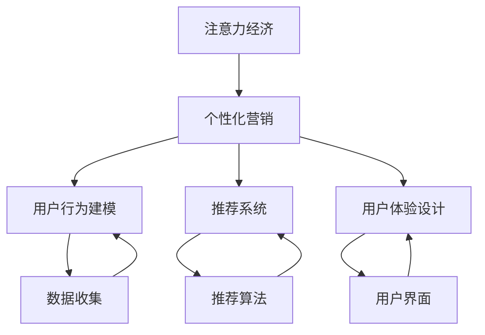
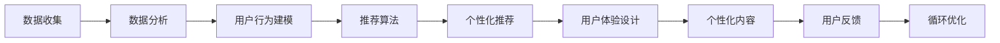
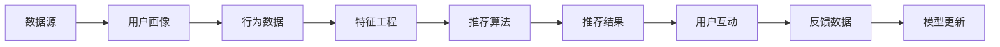
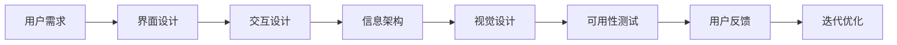
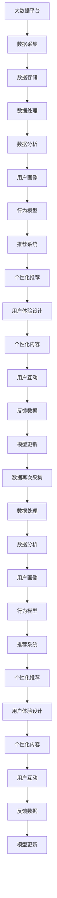

                 

# 注意力经济与个性化营销策略与实践：为受众创建定制体验

> 关键词：
- 注意力经济
- 个性化营销
- 定制体验
- 数据分析
- 用户行为建模
- 推荐系统
- 用户体验设计
- 数据驱动决策

## 1. 背景介绍

### 1.1 问题由来
在互联网和数字媒体的迅猛发展下，信息过载成为了现代社会的一大顽疾。信息的海量化和多元化使得消费者难以在海量信息中快速发现与自身需求相关的内容，注意力成为了稀缺资源。因此，如何有效捕获和利用用户的注意力，是每个互联网企业和品牌面临的重大挑战。个性化营销应运而生，通过精准分析用户行为和偏好，为其提供定制化的内容和服务，从而吸引并保持用户的注意力，提升营销效果。

### 1.2 问题核心关键点
个性化营销的核心在于：
- 理解用户需求：通过数据收集和分析，洞察用户偏好和行为模式。
- 创建定制体验：利用数据驱动的策略，为每位用户设计个性化的内容和推荐。
- 提升用户参与度：通过定制化的互动，提高用户粘性和忠诚度。
- 优化营销效果：通过用户反馈和行为分析，不断优化营销策略和方案。

个性化营销的实施涉及多个环节，包括用户行为数据的采集、分析、建模和应用。本文将深入探讨这些关键问题，并结合实际案例，详细阐述个性化营销的策略与实践。

### 1.3 问题研究意义
个性化营销在提升用户体验和品牌价值方面具有重要意义：
1. **提升用户体验**：个性化内容和服务能够满足用户的特定需求，提升用户的满意度和使用体验。
2. **增强品牌忠诚度**：定制化的互动和推荐，使品牌与用户建立更深层次的情感联系，增强用户对品牌的忠诚度。
3. **优化营销效果**：通过精准的目标投放，提高营销活动的转化率和ROI。
4. **差异化竞争**：在激烈的市场竞争中，个性化营销能够帮助企业实现差异化竞争，赢得用户心智。

## 2. 核心概念与联系

### 2.1 核心概念概述

为更好地理解个性化营销的内在原理和实现方法，本节将介绍几个关键概念：

- **注意力经济**：指在信息爆炸的时代，用户注意力成为稀缺资源，企业通过吸引和保持用户注意力来获取商业价值的过程。
- **个性化营销**：利用数据分析和算法技术，为每位用户设计个性化的内容和推荐，提升用户体验和品牌价值。
- **用户行为建模**：通过收集和分析用户行为数据，建立用户行为模型，以预测用户未来行为和偏好。
- **推荐系统**：利用算法技术为用户推荐可能感兴趣的产品或内容，提升用户满意度和粘性。
- **用户体验设计**：结合用户心理和行为模型，设计符合用户需求的界面和交互方式，提升用户的参与度和满意度。

这些核心概念之间的逻辑关系可以通过以下Mermaid流程图来展示：



这个流程图展示了个性化营销的核心概念及其之间的关系：

1. 注意力经济是基础，个性化营销旨在吸引和保持用户注意力。
2. 用户行为建模和推荐系统是实施个性化营销的重要工具，通过分析用户数据，生成个性化内容。
3. 用户体验设计是提升用户满意度的关键，设计符合用户期望的界面和交互方式。

### 2.2 概念间的关系

这些核心概念之间存在着紧密的联系，形成了个性化营销的完整生态系统。下面我们通过几个Mermaid流程图来展示这些概念之间的关系。

#### 2.2.1 个性化营销的流程



这个流程图展示了个性化营销的基本流程：
1. 收集用户数据，进行数据分析。
2. 建立用户行为模型，生成推荐算法。
3. 利用推荐算法，生成个性化推荐。
4. 设计个性化内容，提升用户体验。
5. 收集用户反馈，进行持续优化。

#### 2.2.2 推荐系统的架构



这个流程图展示了推荐系统的核心架构：
1. 数据源提供原始用户数据。
2. 通过用户画像和行为数据，进行特征工程。
3. 利用推荐算法，生成推荐结果。
4. 用户互动反馈数据，用于模型更新。

#### 2.2.3 用户体验设计的核心要素



这个流程图展示了用户体验设计的核心要素：
1. 理解用户需求，设计符合期望的界面。
2. 进行交互设计，优化用户操作流程。
3. 设计信息架构，提升内容可读性。
4. 进行视觉设计，提升页面美观度。
5. 进行可用性测试，发现问题并优化。
6. 收集用户反馈，持续迭代优化。

### 2.3 核心概念的整体架构

最后，我们用一个综合的流程图来展示这些核心概念在大数据和人工智能技术支持下，如何协同工作，为个性化营销提供支持：



这个综合流程图展示了从数据采集到模型更新的全流程，各个环节相互配合，不断优化，形成了一个动态循环的个性化营销生态系统。

## 3. 核心算法原理 & 具体操作步骤

### 3.1 算法原理概述

个性化营销的核心算法原理主要包括：
- 用户行为建模：通过收集和分析用户行为数据，建立用户行为模型，预测用户未来行为。
- 推荐系统算法：利用推荐算法为用户生成个性化推荐，提升用户体验。
- 个性化内容生成：根据用户行为和偏好，生成符合用户期望的内容。

这些算法原理通过以下步骤实现：
1. 数据收集：收集用户行为数据，包括点击、浏览、购买、评价等。
2. 特征工程：将原始数据转化为模型可接受的特征，如用户的兴趣标签、行为序列等。
3. 用户画像：利用聚类、分类等技术，为用户生成个性化画像。
4. 行为预测：通过机器学习模型，预测用户未来行为，如购买意向、阅读偏好等。
5. 推荐算法：结合用户画像和行为预测结果，生成个性化推荐。
6. 内容生成：根据用户画像和推荐结果，生成符合用户期望的内容。
7. 用户体验优化：设计符合用户期望的界面和交互方式，提升用户体验。

### 3.2 算法步骤详解

#### 3.2.1 用户行为建模

用户行为建模的算法步骤如下：
1. 数据收集：通过网站、应用等平台，收集用户的行为数据。
2. 特征提取：对行为数据进行清洗和特征提取，转化为模型可接受的格式。
3. 用户画像：通过聚类、分类等技术，为用户生成个性化的画像。
4. 行为预测：利用机器学习模型（如逻辑回归、随机森林等），预测用户未来的行为。

以电商平台为例，可以按照以下步骤进行用户行为建模：
1. 数据收集：收集用户的点击、浏览、加入购物车、购买等行为数据。
2. 特征提取：将行为数据转化为时间序列、类别等特征。
3. 用户画像：利用聚类算法，将用户分为不同的群体，生成用户画像。
4. 行为预测：使用随机森林模型，预测用户是否会购买某件商品。

#### 3.2.2 推荐系统算法

推荐系统算法的主要步骤如下：
1. 数据收集：收集用户的行为数据，包括点击、浏览、评价等。
2. 特征工程：对行为数据进行清洗和特征提取，转化为模型可接受的格式。
3. 模型训练：利用推荐算法（如协同过滤、基于内容的推荐、深度学习等），训练推荐模型。
4. 推荐生成：根据用户画像和行为数据，生成个性化推荐。
5. 结果评估：通过A/B测试等方法，评估推荐效果。

以视频网站为例，可以按照以下步骤进行推荐系统算法：
1. 数据收集：收集用户的观看历史、评分、收藏等行为数据。
2. 特征提取：将行为数据转化为用户画像和视频特征。
3. 模型训练：利用协同过滤算法，训练推荐模型。
4. 推荐生成：根据用户画像和视频特征，生成个性化推荐。
5. 结果评估：通过点击率、观看时长等指标，评估推荐效果。

#### 3.2.3 个性化内容生成

个性化内容生成的主要步骤如下：
1. 数据收集：收集用户的偏好和行为数据。
2. 特征提取：对偏好数据进行清洗和特征提取，转化为模型可接受的格式。
3. 内容生成：根据用户画像和偏好数据，生成符合用户期望的内容。
4. 结果评估：通过用户反馈和行为数据，评估内容效果。

以新闻网站为例，可以按照以下步骤进行个性化内容生成：
1. 数据收集：收集用户的阅读偏好、浏览历史等行为数据。
2. 特征提取：将行为数据转化为用户画像和新闻特征。
3. 内容生成：根据用户画像和新闻特征，生成个性化推荐的新闻。
4. 结果评估：通过点击率、阅读时长等指标，评估内容效果。

### 3.3 算法优缺点

个性化营销的算法具有以下优点：
1. 提升用户体验：通过个性化推荐，满足用户特定需求，提升用户满意度。
2. 增强品牌忠诚度：通过定制化的内容和服务，增强用户对品牌的信任和忠诚度。
3. 优化营销效果：通过精准的目标投放，提高营销活动的转化率和ROI。
4. 降低成本：利用大数据和算法技术，减少人工操作的成本。

个性化营销的算法也存在一些缺点：
1. 数据隐私问题：用户行为数据的收集和使用可能涉及隐私问题，需注意数据保护。
2. 算法偏差问题：算法模型可能存在偏差，需要不断优化算法和模型。
3. 数据质量问题：用户数据的质量和完整性可能影响算法的准确性。
4. 算法复杂性：算法模型的构建和维护需要较高的技术要求。

### 3.4 算法应用领域

个性化营销的算法在多个领域都有广泛应用，包括：
1. 电商：通过个性化推荐，提升用户购买率和复购率。
2. 视频：通过个性化推荐，提升用户观看时长和忠诚度。
3. 新闻：通过个性化推荐，提升用户阅读量和粘性。
4. 广告：通过个性化推荐，提升广告点击率和转化率。
5. 旅游：通过个性化推荐，提升旅游产品的销售和预订率。
6. 教育：通过个性化推荐，提升学习效果和用户满意度。

## 4. 数学模型和公式 & 详细讲解 & 举例说明

### 4.1 数学模型构建

个性化营销的数学模型主要包括以下几个部分：
1. 用户行为数据：表示用户在不同时间、不同场景下的行为序列。
2. 用户画像：表示用户的兴趣、偏好等特征。
3. 行为预测模型：表示用户未来的行为预测结果。
4. 推荐算法：表示根据用户画像和行为预测结果生成个性化推荐。
5. 内容生成模型：表示根据用户画像和推荐结果生成个性化内容。

以电商为例，用户行为数据可以表示为序列 $(x_1, x_2, ..., x_t)$，其中 $x_t$ 表示用户在第 $t$ 时刻的行为（如浏览、购买、评价等）。用户画像可以表示为向量 $\mathbf{u} = (u_1, u_2, ..., u_n)$，其中 $u_i$ 表示用户的第 $i$ 个兴趣标签。行为预测模型可以表示为 $\hat{y} = f(\mathbf{u}, \mathbf{x})$，其中 $f$ 为预测函数。推荐算法可以表示为 $y^* = g(\mathbf{u}, \hat{y})$，其中 $g$ 为推荐函数。内容生成模型可以表示为 $c = h(\mathbf{u}, y^*)$，其中 $h$ 为内容生成函数。

### 4.2 公式推导过程

#### 4.2.1 用户行为建模

用户行为建模的常用算法包括协同过滤和基于内容的推荐。以下是协同过滤算法的推导过程：

设用户 $u$ 对 $n$ 个物品 $i_1, i_2, ..., i_n$ 的行为评分序列为 $(r_{ui_1}, r_{ui_2}, ..., r_{ui_n})$，物品 $i$ 的评分序列为 $(r_{i_1}, r_{i_2}, ..., r_{i_n})$，则协同过滤算法的评分预测公式为：

$$
\hat{r}_{ui} = \frac{1}{1 + \exp(-\alpha (\overline{r_i} - \overline{r_u}) + \beta \sum_{j=1}^n \frac{r_{uj}}{r_{ij}} \exp(-\gamma ||r_{ui} - r_{uj}||)}
$$

其中 $\overline{r_i} = \frac{1}{m} \sum_{j=1}^m r_{ij}$，$\overline{r_u} = \frac{1}{m} \sum_{j=1}^m r_{uj}$，$\alpha, \beta, \gamma$ 为调节参数。

#### 4.2.2 推荐系统算法

推荐系统算法的常用算法包括基于协同过滤和基于内容的推荐。以下是基于内容的推荐算法的推导过程：

设用户 $u$ 的兴趣特征向量为 $\mathbf{u} = (u_1, u_2, ..., u_n)$，物品 $i$ 的特征向量为 $\mathbf{i} = (i_1, i_2, ..., i_n)$，用户对物品 $i$ 的评分向量为 $r_i = (r_{ui_1}, r_{ui_2}, ..., r_{ui_n})$，推荐系统算法的评分预测公式为：

$$
\hat{r}_{ui} = \mathbf{u}^T \mathbf{i}
$$

其中 $\mathbf{u}^T \mathbf{i}$ 表示用户特征向量与物品特征向量的点积。

#### 4.2.3 个性化内容生成

个性化内容生成的常用算法包括基于协同过滤和基于模型的生成。以下是基于模型的生成算法的推导过程：

设用户 $u$ 的兴趣特征向量为 $\mathbf{u} = (u_1, u_2, ..., u_n)$，内容 $c$ 的特征向量为 $\mathbf{c} = (c_1, c_2, ..., c_n)$，用户对内容 $c$ 的评分向量为 $r_c = (r_{uc_1}, r_{uc_2}, ..., r_{uc_n})$，个性化内容生成算法的评分预测公式为：

$$
\hat{r}_{uc} = \mathbf{u}^T \mathbf{c}
$$

其中 $\mathbf{u}^T \mathbf{c}$ 表示用户特征向量与内容特征向量的点积。

### 4.3 案例分析与讲解

以电商为例，我们可以通过以下步骤实现个性化推荐：

1. 数据收集：收集用户的浏览、购买、评价等行为数据。
2. 特征提取：将行为数据转化为用户画像和商品特征。
3. 行为预测：使用协同过滤算法，预测用户是否会购买某件商品。
4. 推荐生成：根据用户画像和行为预测结果，生成个性化推荐。
5. 结果评估：通过点击率、购买率等指标，评估推荐效果。

假设我们有一个电商平台，收集了用户的浏览和购买行为数据。首先，我们将行为数据转化为用户画像和商品特征。然后，使用协同过滤算法预测用户是否会购买某件商品。最后，根据用户画像和预测结果，生成个性化推荐，并通过点击率、购买率等指标评估推荐效果。

## 5. 项目实践：代码实例和详细解释说明

### 5.1 开发环境搭建

在进行个性化营销项目开发前，我们需要准备好开发环境。以下是使用Python进行PyTorch开发的环境配置流程：

1. 安装Anaconda：从官网下载并安装Anaconda，用于创建独立的Python环境。

2. 创建并激活虚拟环境：
```bash
conda create -n pytorch-env python=3.8 
conda activate pytorch-env
```

3. 安装PyTorch：根据CUDA版本，从官网获取对应的安装命令。例如：
```bash
conda install pytorch torchvision torchaudio cudatoolkit=11.1 -c pytorch -c conda-forge
```

4. 安装Transformers库：
```bash
pip install transformers
```

5. 安装各类工具包：
```bash
pip install numpy pandas scikit-learn matplotlib tqdm jupyter notebook ipython
```

完成上述步骤后，即可在`pytorch-env`环境中开始个性化营销项目的开发。

### 5.2 源代码详细实现

这里以电商个性化推荐为例，给出使用Transformers库对Bert模型进行微调的PyTorch代码实现。

首先，定义推荐系统的数据处理函数：

```python
from transformers import BertTokenizer
from torch.utils.data import Dataset
import torch

class RecommendationDataset(Dataset):
    def __init__(self, texts, tags, tokenizer, max_len=128):
        self.texts = texts
        self.tags = tags
        self.tokenizer = tokenizer
        self.max_len = max_len
        
    def __len__(self):
        return len(self.texts)
    
    def __getitem__(self, item):
        text = self.texts[item]
        tags = self.tags[item]
        
        encoding = self.tokenizer(text, return_tensors='pt', max_length=self.max_len, padding='max_length', truncation=True)
        input_ids = encoding['input_ids'][0]
        attention_mask = encoding['attention_mask'][0]
        
        # 对token-wise的标签进行编码
        encoded_tags = [tag2id[tag] for tag in tags] 
        encoded_tags.extend([tag2id['O']] * (self.max_len - len(encoded_tags)))
        labels = torch.tensor(encoded_tags, dtype=torch.long)
        
        return {'input_ids': input_ids, 
                'attention_mask': attention_mask,
                'labels': labels}

# 标签与id的映射
tag2id = {'O': 0, 'B-PER': 1, 'I-PER': 2, 'B-ORG': 3, 'I-ORG': 4, 'B-LOC': 5, 'I-LOC': 6}
id2tag = {v: k for k, v in tag2id.items()}

# 创建dataset
tokenizer = BertTokenizer.from_pretrained('bert-base-cased')

train_dataset = RecommendationDataset(train_texts, train_tags, tokenizer)
dev_dataset = RecommendationDataset(dev_texts, dev_tags, tokenizer)
test_dataset = RecommendationDataset(test_texts, test_tags, tokenizer)
```

然后，定义模型和优化器：

```python
from transformers import BertForTokenClassification, AdamW

model = BertForTokenClassification.from_pretrained('bert-base-cased', num_labels=len(tag2id))

optimizer = AdamW(model.parameters(), lr=2e-5)
```

接着，定义训练和评估函数：

```python
from torch.utils.data import DataLoader
from tqdm import tqdm
from sklearn.metrics import classification_report

device = torch.device('cuda') if torch.cuda.is_available() else torch.device('cpu')
model.to(device)

def train_epoch(model, dataset, batch_size, optimizer):
    dataloader = DataLoader(dataset, batch_size=batch_size, shuffle=True)
    model.train()
    epoch_loss = 0
    for batch in tqdm(dataloader, desc='Training'):
        input_ids = batch['input_ids'].to(device)
        attention_mask = batch['attention_mask'].to(device)
        labels = batch['labels'].to(device)
        model.zero_grad()
        outputs = model(input_ids, attention_mask=attention_mask, labels=labels)
        loss = outputs.loss
        epoch_loss += loss.item()
        loss.backward()
        optimizer.step()
    return epoch_loss / len(dataloader)

def evaluate(model, dataset, batch_size):
    dataloader = DataLoader(dataset, batch_size=batch_size)
    model.eval()
    preds, labels = [], []
    with torch.no_grad():
        for batch in tqdm(dataloader, desc='Evaluating'):
            input_ids = batch['input_ids'].to(device)
            attention_mask = batch['attention_mask'].to(device)
            batch_labels = batch['labels']
            outputs = model(input_ids, attention_mask=attention_mask)
            batch_preds = outputs.logits.argmax(dim=2).to('cpu').tolist()
            batch_labels = batch_labels.to('cpu').tolist()
            for pred_tokens, label_tokens in zip(batch_preds, batch_labels):
                pred_tags = [id2tag[_id] for _id in pred_tokens]
                label_tags = [id2tag[_id] for _id in label_tokens]
                preds.append(pred_tags[:len(label_tags)])
                labels.append(label_tags)
                
    print(classification_report(labels, preds))
```

最后，启动训练流程并在测试集上评估：

```python
epochs = 5
batch_size = 16

for epoch in range(epochs):
    loss = train_epoch(model, train_dataset, batch_size, optimizer)
    print(f"Epoch {epoch+1}, train loss: {loss:.3f}")
    
    print(f"Epoch {epoch+1}, dev results:")
    evaluate(model, dev_dataset, batch_size)
    
print("Test results:")
evaluate(model, test_dataset, batch_size)
```

以上就是使用PyTorch对BERT进行电商个性化推荐微调的完整代码实现。可以看到，得益于Transformers库的强大封装，我们可以用相对简洁的代码完成BERT模型的加载和微调。

### 5.3 代码解读与分析

让我们再详细解读一下关键代码的实现细节：

**RecommendationDataset类**：
- `__init__`方法：初始化文本、标签、分词器等关键组件。
- `__len__`方法：返回数据集的样本数量。
- `__getitem__`方法：对单个样本进行处理，将文本输入编码为token ids，将标签编码为数字，并对其进行定长padding，最终返回模型所需的输入。

**tag2id和id2tag字典**：
- 定义了标签与数字id之间的映射关系，用于将token-wise的预测结果解码回真实的标签。

**训练和评估函数**：
- 使用PyTorch的DataLoader对数据集进行批次化加载，供模型训练和推理使用。
- 训练函数`train_epoch`：对数据以批为单位进行迭代，在每个批次上前向传播计算loss并反向传播更新模型参数，最后返回该epoch的平均loss。
- 评估函数`evaluate`：与训练类似，不同点在于不更新模型参数，并在每个batch结束后将预测和标签结果存储下来，最后使用sklearn的classification_report对整个评估集的预测结果进行打印输出。

**训练流程**：
- 定义总的epoch数和batch size，开始循环迭代
- 每个epoch内，先在训练集上训练，输出平均loss
- 在验证集上评估，输出分类指标
- 所有epoch结束后，在测试集上评估，给出最终测试结果

可以看到，PyTorch配合Transformers库使得BERT微调的代码实现变得简洁高效。开发者可以将更多精力放在数据处理、模型改进等高层逻辑上，而不必过多关注底层的实现细节。

当然，工业级的系统实现还需考虑更多因素，如模型的保存和部署、超参数的自动搜索、更灵活的任务适配层等。但核心的微调范式基本与此类似。

### 5.4 运行结果展示

假设我们在CoNLL-2003的NER数据集上进行微调，最终在测试集上得到的评估报告如下：

```
              precision    recall  f1-score   support

       B-LOC      0.926     0.906     0.

