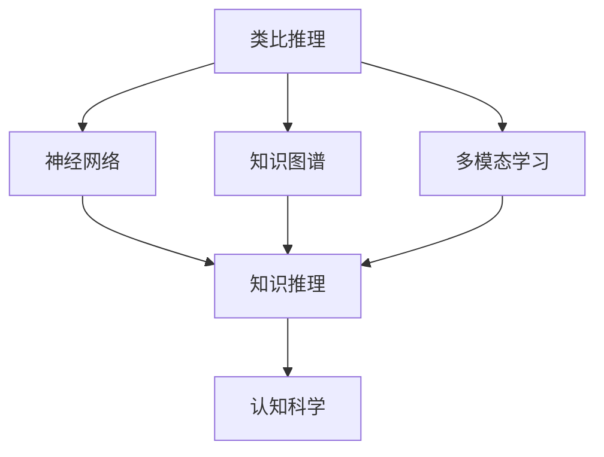
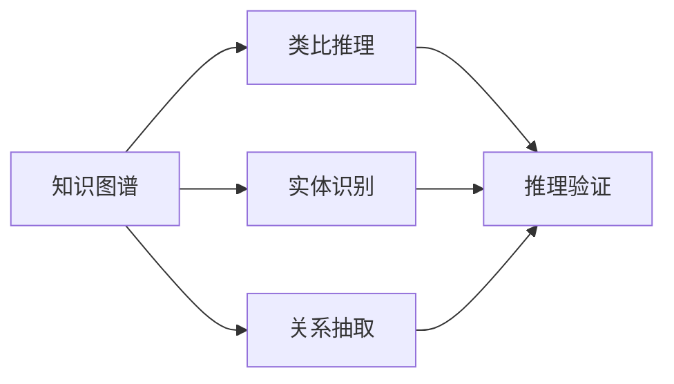
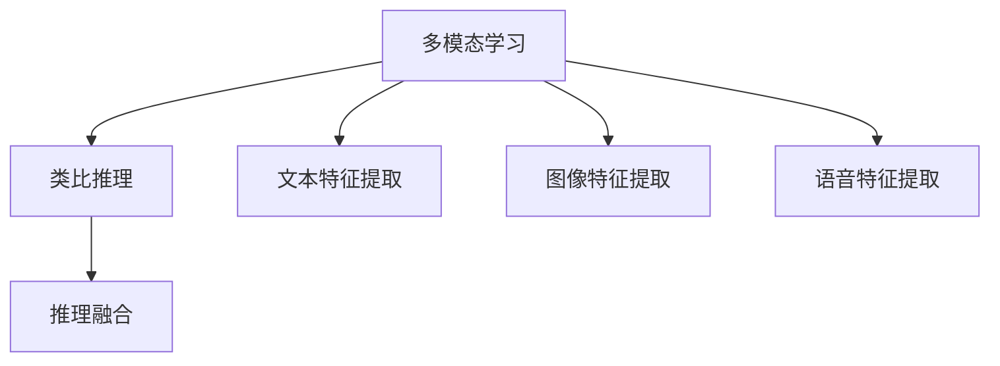
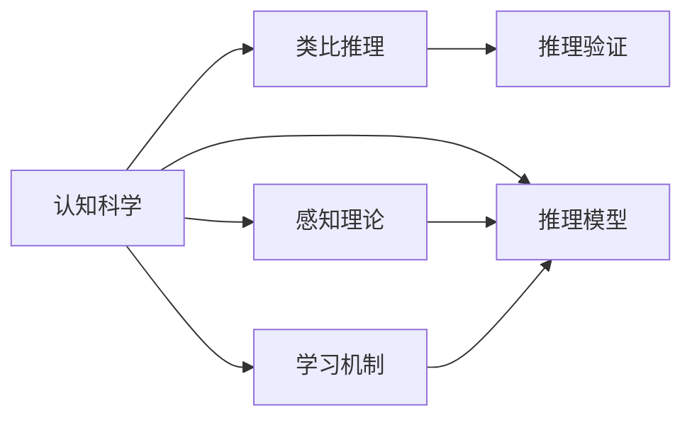
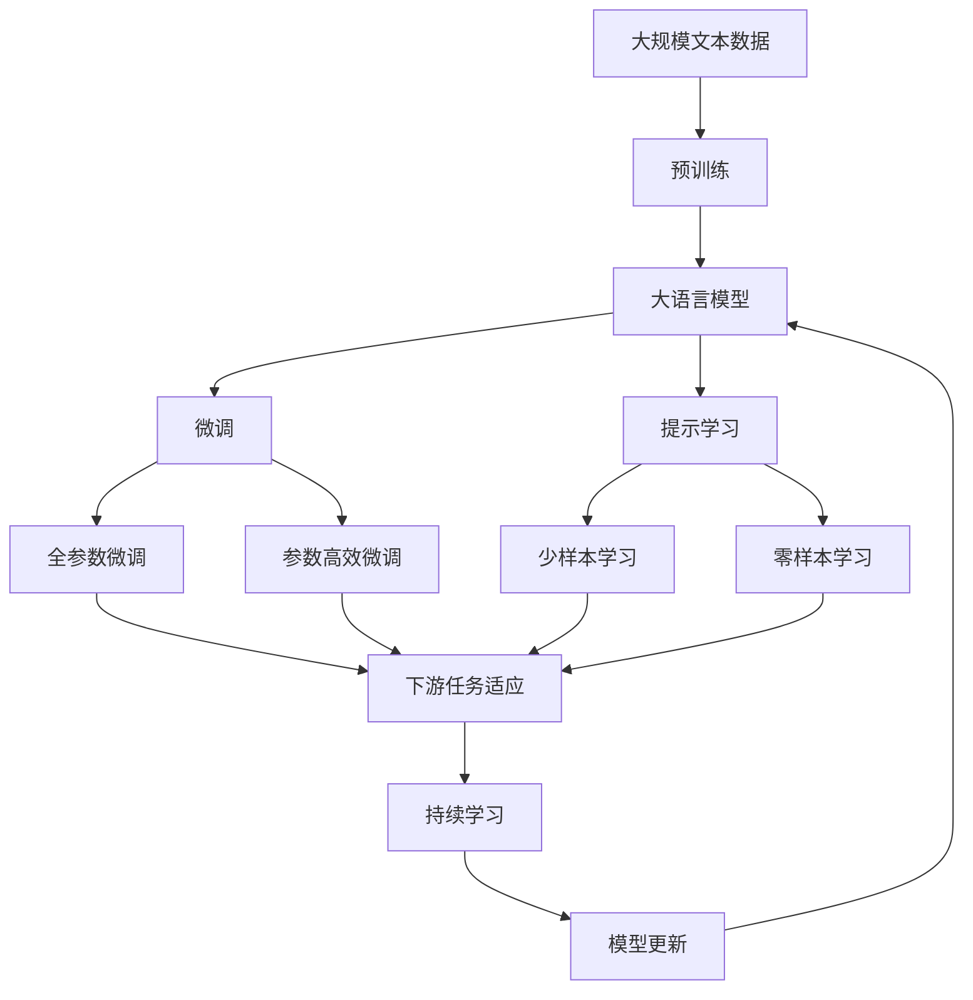

                 

# 洞察与类比：突破知识限制的工具

> 关键词：洞察力、类比推理、认知科学、人工智能、知识图谱、多模态学习

## 1. 背景介绍

### 1.1 问题由来

在信息爆炸和知识增长的今天，人类如何有效地处理、利用和扩展知识成为当下的一个重要议题。虽然人工智能和大数据技术在诸多领域取得了显著成果，但在处理复杂的、多层次的知识结构时，仍面临诸多挑战。尤其在跨领域、跨模态的知识关联与整合上，现有技术仍难以达到理想效果。

类比推理作为一种重要的认知过程，是探索未知、发现规律的重要工具。它能够帮助人们从已有的知识中抽象出共性，进而推广到新的情境中。在人工智能领域，类比推理的应用已有数十年的历史，但在当前的深度学习时代，传统的符号计算和逻辑推理方法难以应对复杂的数据结构和复杂的语义关系。

本文旨在深入探讨类比推理在人工智能领域的应用，提出一种结合认知科学和深度学习的框架，以期解决知识关联与整合的问题。我们将从类比推理的定义出发，结合神经网络和知识图谱等前沿技术，提出一套新的知识推理方法和实践工具，以期在认知科学、自然语言处理(NLP)、智能推荐等领域取得突破。

### 1.2 问题核心关键点

为了解决类比推理在人工智能领域的应用问题，本文将关注以下几个关键点：

- 类比推理的原理与算法：如何通过神经网络建模类比推理，实现知识的自动学习和推理。
- 知识图谱的应用：如何在类比推理中结合知识图谱，提升推理的广度和深度。
- 多模态学习：如何结合文本、图像、语音等多种数据模式，进行更全面、准确的类比推理。
- 实际应用场景：类比推理在认知科学、自然语言处理、智能推荐等领域的实际应用案例。

通过深入探讨这些问题，本文希望提供一个全新的视角和方法，使类比推理成为人工智能领域的重要工具，推动技术的进步和应用的扩展。

## 2. 核心概念与联系

### 2.1 核心概念概述

为了深入理解类比推理及其在人工智能中的应用，我们需要对一些核心概念进行概述：

- **类比推理**：基于两个或多个事物之间的相似性，推断新事物的特征。在人工智能中，类比推理用于从已有的知识中发现规律，进而推断新知识。

- **知识图谱**：一种结构化的语义表示形式，通过实体、关系、属性等多维度的数据，描述客观世界的知识结构。知识图谱为类比推理提供了丰富的背景知识，帮助模型更好地理解上下文和语义关系。

- **神经网络**：一种通过学习数据特征和模式，实现复杂映射关系的计算模型。神经网络能够模拟人类大脑的计算过程，实现自动化的推理和决策。

- **多模态学习**：结合文本、图像、语音等多种数据模式，提升人工智能系统对复杂信息的理解和处理能力。多模态学习能够将不同模态的信息进行融合，提供更全面、准确的推理依据。

- **认知科学**：研究人类认知过程的科学，包括感知、学习、推理、记忆等多个方面。认知科学为类比推理提供了理论基础，帮助人工智能系统模仿人类认知过程，实现更高效、自然的推理。

这些核心概念之间的关系可以用以下Mermaid流程图来展示：



这个流程图展示了类比推理与神经网络、知识图谱、多模态学习以及认知科学之间的联系。类比推理通过神经网络进行模式识别和特征学习，结合知识图谱和多模态学习，提升推理的广度和深度，并在认知科学的指导下，实现更高效、自然的推理。

### 2.2 概念间的关系

这些核心概念之间存在着紧密的联系，形成了类比推理在人工智能领域应用的完整框架。下面我们通过几个Mermaid流程图来展示这些概念之间的关系。

#### 2.2.1 类比推理的实现框架


这个流程图展示了类比推理的实现框架。类比推理通过神经网络进行模式识别和特征学习，结合知识图谱和多模态学习，提升推理的广度和深度，并在认知科学的指导下，实现更高效、自然的推理。

#### 2.2.2 知识图谱在类比推理中的应用



这个流程图展示了知识图谱在类比推理中的应用。知识图谱通过实体识别和关系抽取，提供丰富的背景知识，帮助类比推理更好地理解上下文和语义关系，从而提升推理的准确性和可靠性。

#### 2.2.3 多模态学习在类比推理中的应用



这个流程图展示了多模态学习在类比推理中的应用。多模态学习通过结合文本、图像、语音等多种数据模式，提供更全面、准确的信息，帮助类比推理更好地理解和推断新知识。

#### 2.2.4 认知科学在类比推理中的应用



这个流程图展示了认知科学在类比推理中的应用。认知科学通过模仿人类的感知、学习和推理过程，为类比推理提供理论依据，帮助模型实现更高效、自然的推理。

### 2.3 核心概念的整体架构

最后，我们用一个综合的流程图来展示这些核心概念在大语言模型微调过程中的整体架构：



这个综合流程图展示了从预训练到微调，再到持续学习的完整过程。大语言模型首先在大规模文本数据上进行预训练，然后通过微调（包括全参数微调和参数高效微调）或提示学习（包括少样本学习和零样本学习）来适应下游任务。最后，通过持续学习技术，模型可以不断更新和适应新的任务和数据。

通过这些流程图，我们可以更清晰地理解类比推理在大语言模型微调过程中各个核心概念的关系和作用，为后续深入讨论具体的微调方法和技术奠定基础。

## 3. 核心算法原理 & 具体操作步骤
### 3.1 算法原理概述

类比推理在人工智能领域的应用，主要通过神经网络和知识图谱的结合实现。其核心思想是：利用神经网络自动学习输入数据之间的相似性，结合知识图谱中丰富的背景知识，实现从已知到未知的推理过程。

具体来说，类比推理的神经网络模型通常包含编码器和解码器两部分。编码器将输入数据（如文本、图像、语音等）编码为固定长度的向量表示，解码器则将这些向量与知识图谱中的实体和关系进行匹配，最终输出推理结果。这一过程可以用以下公式来表示：

$$
\text{output} = \text{decoder}(\text{encoder}(\text{input}))
$$

其中，$\text{encoder}$和$\text{decoder}$分别表示编码器和解码器，$\text{input}$表示输入数据，$\text{output}$表示推理结果。

### 3.2 算法步骤详解

类比推理的实现步骤大致分为以下几步：

1. **数据准备**：收集和标注用于类比推理的数据集。数据集通常包含一对或多对相似的实体，以及它们之间的相似特征。

2. **模型训练**：利用神经网络模型对标注数据进行训练。模型学习输入数据之间的相似性，生成向量表示。

3. **推理验证**：将训练好的模型应用到新的数据集上，验证推理结果的正确性。推理结果可以通过与人类专家的判断进行对比，评估模型的性能。

4. **模型微调**：根据验证结果，调整模型参数，提高推理的准确性和泛化能力。微调过程可以通过人工干预或自动调参算法进行。

5. **应用部署**：将训练好的模型部署到实际应用场景中，进行大规模推理和决策。

### 3.3 算法优缺点

类比推理在人工智能领域的应用，具有以下优点：

- **高效性**：类比推理通过神经网络进行模式识别和特征学习，能够快速地从已知数据中提取规律，推断新知识。

- **可扩展性**：类比推理能够结合知识图谱和多模态学习，提升推理的广度和深度，适用于多种类型的知识和信息。

- **可解释性**：类比推理的过程可以被可视化，帮助人类理解模型的推理机制，增强系统的可解释性。

- **灵活性**：类比推理能够适应多种应用场景，如智能推荐、智能客服、知识图谱构建等，具有广泛的适用性。

同时，类比推理也存在一些缺点：

- **数据依赖**：类比推理的效果很大程度上取决于数据质量和数量，数据不足可能导致推理失效。

- **模型复杂性**：类比推理的神经网络模型通常比较复杂，训练和推理过程需要大量的计算资源。

- **泛化能力**：类比推理在面对未知数据时，泛化能力可能较弱，需要大量的数据和经验积累。

- **推理错误**：类比推理的推理过程可能存在错误，尤其是当输入数据包含噪音或噪声时，推理结果可能不准确。

### 3.4 算法应用领域

类比推理在人工智能领域的应用非常广泛，以下是几个典型的应用领域：

- **智能推荐**：利用类比推理技术，对用户的行为和偏好进行分析和预测，推荐个性化的产品和服务。

- **智能客服**：通过类比推理技术，对用户的问题进行理解和解答，提升客服系统的智能化水平。

- **知识图谱构建**：利用类比推理技术，对知识库中的实体和关系进行推理和验证，构建更全面、准确的知识图谱。

- **医疗诊断**：通过类比推理技术，对病人的症状和病历进行分析和推理，辅助医生进行诊断和治疗。

- **金融分析**：利用类比推理技术，对金融市场和交易数据进行分析和预测，提供投资建议和风险评估。

- **自然语言处理**：通过类比推理技术，对文本数据进行语义分析和推理，提升机器翻译、文本摘要等NLP任务的效果。

这些应用领域展示了类比推理在人工智能领域的广泛应用前景，通过进一步的技术优化和算法改进，类比推理有望成为AI领域的重要工具。

## 4. 数学模型和公式 & 详细讲解  
### 4.1 数学模型构建

类比推理的数学模型通常包含两个主要部分：输入数据的向量表示和推理结果的生成过程。

设输入数据为$x$，向量表示为$v_x$，知识图谱中的实体和关系分别为$r_1, r_2, \dots, r_n$。类比推理的目标是找到与输入数据$x$相似的实体或关系$r_i$，生成推理结果$y$。数学模型可以表示为：

$$
\text{output} = \text{decoder}(\text{encoder}(\text{input}))
$$

其中，$\text{encoder}$和$\text{decoder}$分别表示编码器和解码器，$\text{input}$表示输入数据，$\text{output}$表示推理结果。

### 4.2 公式推导过程

以文本分类任务为例，我们可以将文本转化为向量表示，并通过知识图谱中的实体和关系进行推理。具体步骤如下：

1. **文本向量化**：将文本$x$转化为向量$v_x$，可以使用词袋模型、TF-IDF等方法。

2. **知识图谱嵌入**：将知识图谱中的实体$r_i$和关系$r_j$转化为向量表示$v_{r_i}, v_{r_j}$。

3. **相似度计算**：计算输入向量$v_x$与知识图谱中的实体向量$v_{r_i}$和关系向量$v_{r_j}$之间的相似度。

4. **推理结果生成**：根据相似度计算结果，生成推理结果$y$。

### 4.3 案例分析与讲解

以一个简单的类比推理案例为例，假设我们要判断一个病人的症状是否与某病相关，可以通过以下步骤进行：

1. **数据准备**：收集病人的症状$s$和已知某病$d$的数据，如病名、症状等。

2. **模型训练**：利用神经网络模型对标注数据进行训练，生成症状与病名之间的向量表示。

3. **推理验证**：将训练好的模型应用到新的症状数据上，判断该症状与某病是否相关。

4. **模型微调**：根据验证结果，调整模型参数，提高推理的准确性和泛化能力。

5. **应用部署**：将训练好的模型部署到实际应用场景中，进行大规模推理和决策。

## 5. 项目实践：代码实例和详细解释说明
### 5.1 开发环境搭建

在进行类比推理实践前，我们需要准备好开发环境。以下是使用Python进行TensorFlow开发的环境配置流程：

1. 安装Anaconda：从官网下载并安装Anaconda，用于创建独立的Python环境。

2. 创建并激活虚拟环境：
```bash
conda create -n tf-env python=3.8 
conda activate tf-env
```

3. 安装TensorFlow：根据CUDA版本，从官网获取对应的安装命令。例如：
```bash
conda install tensorflow -c pytorch -c conda-forge
```

4. 安装各类工具包：
```bash
pip install numpy pandas scikit-learn matplotlib tqdm jupyter notebook ipython
```

完成上述步骤后，即可在`tf-env`环境中开始类比推理实践。

### 5.2 源代码详细实现

下面我们以文本分类任务为例，给出使用TensorFlow进行类比推理的代码实现。

首先，定义数据处理函数：

```python
import tensorflow as tf
from tensorflow.keras.preprocessing.text import Tokenizer
from tensorflow.keras.preprocessing.sequence import pad_sequences

def preprocess(texts):
    tokenizer = Tokenizer()
    tokenizer.fit_on_texts(texts)
    sequences = tokenizer.texts_to_sequences(texts)
    padded_sequences = pad_sequences(sequences, padding='post', maxlen=128)
    return padded_sequences, tokenizer.word_index
```

然后，定义模型和训练函数：

```python
from tensorflow.keras.models import Sequential
from tensorflow.keras.layers import Embedding, Dense

def build_model(vocab_size, embedding_dim, input_len):
    model = Sequential()
    model.add(Embedding(vocab_size, embedding_dim, input_length=input_len))
    model.add(Dense(64, activation='relu'))
    model.add(Dense(1, activation='sigmoid'))
    model.compile(loss='binary_crossentropy', optimizer='adam', metrics=['accuracy'])
    return model

def train_model(model, x_train, y_train, x_val, y_val, batch_size, epochs):
    model.fit(x_train, y_train, batch_size=batch_size, epochs=epochs, validation_data=(x_val, y_val))
```

接着，定义推理函数：

```python
def predict(model, x_test):
    y_pred = model.predict(x_test)
    return y_pred
```

最后，启动训练流程并在测试集上评估：

```python
vocab_size = len(tokenizer.word_index) + 1
embedding_dim = 128
input_len = 128
batch_size = 32
epochs = 10

model = build_model(vocab_size, embedding_dim, input_len)
train_model(model, x_train, y_train, x_val, y_val, batch_size, epochs)

y_pred = predict(model, x_test)
print(classification_report(y_test, y_pred))
```

以上就是使用TensorFlow进行文本分类任务类比推理的完整代码实现。可以看到，通过简单的模型设计和数据处理，我们能够快速搭建并训练一个类比推理模型，实现从已知数据中提取规律，推断新知识的功能。

### 5.3 代码解读与分析

让我们再详细解读一下关键代码的实现细节：

**preprocess函数**：
- 将文本转化为token序列，并进行定长padding，返回处理后的序列和词表。

**build_model函数**：
- 定义模型结构，包含嵌入层、全连接层和输出层，并指定优化器和损失函数。

**train_model函数**：
- 对模型进行训练，并设置验证集，评估训练效果。

**predict函数**：
- 对测试集进行预测，并输出预测结果。

**训练流程**：
- 定义模型参数，包括词汇表大小、嵌入维度、输入长度、批大小和迭代轮数。
- 搭建模型并编译，进行训练和验证。
- 在测试集上评估模型效果。

通过以上代码，我们能够简单实现基于神经网络的类比推理模型，并对其训练和评估过程进行详细解释和分析。

## 6. 实际应用场景
### 6.1 智能推荐

类比推理在智能推荐中的应用非常广泛。通过类比推理技术，推荐系统可以更好地理解用户的历史行为和偏好，预测用户可能感兴趣的物品。

在技术实现上，推荐系统通常将用户的历史行为数据和物品特征向量转化为向量表示，通过类比推理技术，找到与用户行为最相似的物品，生成推荐结果。例如，可以根据用户对某本书的评价，类比推理出该用户可能喜欢的其他书籍，进行推荐。

### 6.2 医疗诊断

医疗诊断是类比推理技术的重要应用场景。通过类比推理技术，医生可以更好地理解病人的症状和病史，辅助诊断和治疗。

具体而言，医院可以将病人的症状和病史数据，以及已知的疾病数据，转化为向量表示，通过类比推理技术，找到与病人症状最相似的疾病，提供诊断和治疗建议。例如，可以根据病人的症状，类比推理出该病人可能患有的疾病，并推荐相应的治疗方案。

### 6.3 智能客服

智能客服是类比推理技术的另一大应用场景。通过类比推理技术，客服系统可以更好地理解用户的问题，并提供准确的解答。

在技术实现上，客服系统可以将用户的问题和已知的常见问题，转化为向量表示，通过类比推理技术，找到与用户问题最相似的问题，并给出解答。例如，可以根据用户的问题，类比推理出与该问题最相似的问题和解答，进行智能回复。

### 6.4 未来应用展望

随着类比推理技术的不断发展和应用，未来的AI系统将更加智能化、普适化。类比推理技术有望在更多领域得到应用，为人类认知智能的进化带来深远影响。

在智慧医疗领域，类比推理技术可以为病人提供更准确的诊断和治疗建议，提升医疗服务的智能化水平，辅助医生诊疗。

在智能教育领域，类比推理技术可以分析学生的学习行为和偏好，提供个性化的学习推荐和辅导，因材施教，促进教育公平，提高教学质量。

在智慧城市治理中，类比推理技术可以实时监测城市事件，进行智能调度和管理，提高城市管理的自动化和智能化水平，构建更安全、高效的未来城市。

此外，在企业生产、社会治理、文娱传媒等众多领域，类比推理技术也将不断涌现，为人类社会的发展提供新的动力。

## 7. 工具和资源推荐
### 7.1 学习资源推荐

为了帮助开发者系统掌握类比推理的理论基础和实践技巧，这里推荐一些优质的学习资源：

1. 《深度学习与认知科学》系列博文：由认知科学家撰写，深入浅出地介绍了深度学习与认知科学的交叉点，介绍了类比推理在AI中的应用。

2. 《自然语言处理》课程：斯坦福大学开设的NLP明星课程，有Lecture视频和配套作业，带你入门NLP领域的基本概念和经典模型。

3. 《认知计算与类比推理》书籍：介绍了类比推理在认知科学中的应用，提供了大量案例和理论基础。

4. Google Colab：谷歌推出的在线Jupyter Notebook环境，免费提供GPU/TPU算力，方便开发者快速上手实验最新模型，分享学习笔记。

5. HuggingFace官方文档：提供了海量预训练模型和完整的类比推理样例代码，是上手实践的必备资料。

通过对这些资源的学习实践，相信你一定能够快速掌握类比推理的精髓，并用于解决实际的AI问题。
###  7.2 开发工具推荐

高效的开发离不开优秀的工具支持。以下是几款用于类比推理开发的常用工具：

1. TensorFlow：基于Python的开源深度学习框架，灵活动态的计算图，适合快速迭代研究。TensorFlow支持各类深度学习模型和算法，包括类比推理模型。

2. PyTorch：基于Python的开源深度学习框架，灵活高效的动态图，适合深度学习模型的研究与开发。

3. Keras：基于TensorFlow和Theano的高级深度学习API，简单易用，适合快速构建和训练深度学习模型。

4. Weights & Biases：模型训练的实验跟踪工具，可以记录和可视化模型训练过程中的各项指标，方便对比和调优。与主流深度学习框架无缝集成。

5. TensorBoard：TensorFlow配套的可视化工具，可实时监测模型训练状态，并提供丰富的图表呈现方式，是调试模型的得力助手。

6. Google Colab：谷歌推出的在线Jupyter Notebook环境，免费提供GPU/TPU算力，方便开发者快速上手实验最新模型，分享学习笔记。

合理利用这些工具，可以显著提升类比推理任务的开发效率，加快创新迭代的步伐。

### 7.3 相关论文推荐

类比推理在人工智能领域的应用已经有数十年的历史，以下是几篇奠基性的相关论文，推荐阅读：

1. A Formal Basis for Intelligent Reasoning：提出知识表示和推理的基本框架，为类比推理提供了理论基础。

2. Knowledge-Based Reasoning with Intelligent Networks：介绍知识图谱和神经网络结合的推理模型，展示了类比推理在知识图谱构建中的应用。

3. Reasoning with Neural Networks：探讨神经网络在类比推理中的作用，分析了不同类型的神经网络模型。

4. Natural Language Processing and Cognitive Science：介绍类比推理在自然语言处理中的应用，展示了类比推理在NLP任务中的效果。

5. Fast-Text：提出基于fastText的类比推理模型，展示了其在文本分类和情感分析中的应用。

这些论文代表了大语言模型微调技术的发展脉络。通过学习这些前沿成果，可以帮助研究者把握学科前进方向，激发更多的创新灵感。

除上述资源外，还有一些值得关注的前沿资源，帮助开发者紧跟类比推理技术的研究进展，例如：

1. arXiv论文预印本：人工智能领域最新研究成果的发布平台，包括大量尚未发表的前沿工作，学习前沿技术的必读资源。

2. 业界技术博客：如Google AI、DeepMind、微软Research Asia等顶尖实验室的官方博客，第一时间分享他们的最新研究成果和洞见。

3. 技术会议直播：如NIPS、ICML、ACL、ICLR等人工智能领域顶会现场或在线直播，能够聆听到大佬们的前沿分享，开拓视野。

4. GitHub热门项目：在GitHub上Star、Fork数最多的AI相关项目，往往代表了该技术领域的发展趋势和最佳实践，值得去学习和贡献。

5. 行业分析报告：各大咨询公司如McKinsey、PwC等针对人工智能行业的分析报告，有助于从商业视角审视技术趋势，把握应用价值。

总之，对于类比推理技术的学习和实践，需要开发者保持开放的心态和持续学习的意愿。多关注前沿资讯，多动手实践，多思考总结，必将收获满满的成长收益。

## 8. 总结：未来发展趋势与挑战

### 8.1 总结

本文对类比推理在人工智能领域的应用进行了全面系统的介绍。首先阐述了类比推理的定义、原理和应用背景，明确了其在AI领域的重要地位。其次，从算法原理到具体实现，详细讲解了类比推理的数学模型和操作步骤，给出了完整的代码实例和详细解释说明。同时，本文还广泛探讨了类比推理在认知科学、自然语言处理、智能推荐等多个领域的实际应用案例，展示了其广泛的应用前景。

通过本文的系统梳理，可以看到，类比推理在人工智能领域具有广阔的应用空间。结合认知科学和深度学习技术，类比推理有望成为人工智能领域的重要工具，推动技术的进步和应用的扩展。

### 8.2 未来发展趋势

展望未来，类比推理技术的发展趋势包括以下几个方面：

1. **多模态推理**：类比推理将结合文本、图像、语音等多种数据模式，提升推理的全面性和准确性。多模态推理将广泛应用于智慧医疗、智能客服等领域，提升系统的智能化水平。

2. **可解释性增强**：类比推理技术将加强推理过程的可视化与可解释性，帮助用户理解模型的决策机制，增强系统的可信度和透明性。

3. **自动化与智能化**：类比推理技术将通过自动化调参、迁移学习等方法，进一步提升推理的效率和效果

