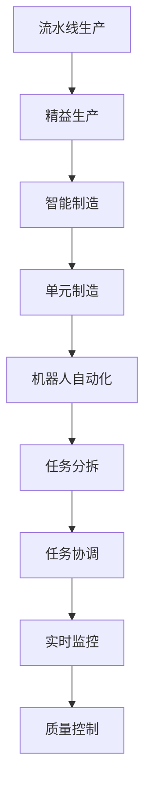
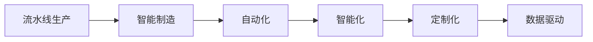
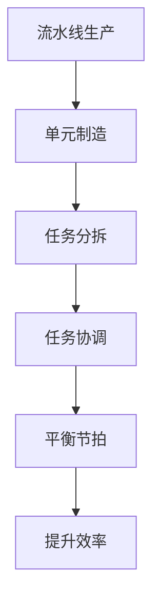
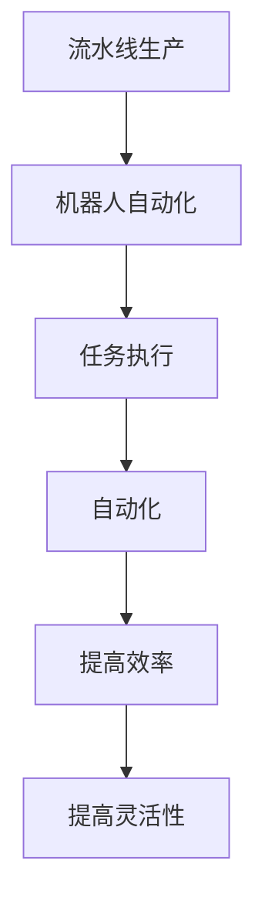

                 

# 流水线对汽车产量的提升

## 1. 背景介绍

在现代制造业中，流水线生产（Assembly Line Production）是一种广泛应用于装配作业的生产方式。它能够极大地提升生产效率和产量，是现代工业生产的重要手段。自亨利·福特在1913年首次引入流水线生产以来，流水线技术已经历了多次迭代和发展。

### 1.1 问题由来

流水线生产的核心思想是将复杂的大型制造任务分解为若干简单的小任务，每个小任务由固定位置的操作员执行，且每个操作员只执行一种简单操作。这种分工合作的方式显著提升了生产效率，使得汽车等复杂产品能够以较低的成本大规模生产。

然而，尽管流水线生产能够提升生产效率和产量，但其对工人技能要求高、生产灵活性低、设备成本高等缺点也逐渐显现。为了应对这些挑战，流水线技术和生产方式不断演进，出现了诸如“单元制造”、“智能制造”等新概念。

### 1.2 问题核心关键点

流水线生产的主要优势在于：

- **高效协作**：分工明确，操作人员专注单一任务，提升工作效率。
- **快速响应**：标准化操作使得生产流程更加流畅，减少停机时间。
- **规模化生产**：减少单件成本，提高产量。

同时，流水线生产也存在以下不足：

- **刚性结构**：对操作员的通用性和灵活性要求高，难以快速适应变化。
- **依赖设备**：生产效率依赖设备稳定性和操作员技能。
- **质量控制**：流水线难以实时监控产品质量，存在一定的质量风险。

为了解决这些问题，业界提出了诸多改进方案，包括精益生产（Lean Production）、智能化流水线、机器人自动化等。

### 1.3 问题研究意义

研究流水线生产及其改进方法，对于提升制造业生产效率和竞争力，推动产业升级，具有重要意义：

- **降低生产成本**：提高生产效率和产量，降低单件成本，增强市场竞争力。
- **提高产品质量**：实时监控产品质量，及时发现和纠正缺陷，减少废品率。
- **增强灵活性**：优化生产流程，适应市场需求变化，提升应变能力。
- **促进智能化**：融合智能制造、物联网等技术，实现数字化、智能化转型。
- **推动绿色制造**：优化资源配置，减少能耗和排放，提升可持续发展能力。

## 2. 核心概念与联系

### 2.1 核心概念概述

为了更好地理解流水线生产的原理和改进方法，本节将介绍几个密切相关的核心概念：

- **流水线生产(Assembly Line Production)**：将复杂的大型制造任务分解为若干简单的小任务，每个小任务由固定位置的操作员执行，且每个操作员只执行一种简单操作。
- **精益生产(Lean Production)**：通过消除浪费、提升效率，实现以更少资源生产更多产品的目标。
- **智能制造(Intelligent Manufacturing)**：融合智能化技术，实现生产过程的自动化、智能化、定制化。
- **单元制造(Line Balancing)**：根据生产流程，合理分配各工位任务，平衡生产节拍，提升生产效率。
- **机器人自动化(Automatic Manufacturing)**：通过机器人执行操作，实现生产的自动化和智能化。

这些核心概念之间的逻辑关系可以通过以下Mermaid流程图来展示：



这个流程图展示了几大核心概念之间的相互关系：

1. 流水线生产将复杂任务分解为小任务，通过精益生产提升效率和降低成本。
2. 智能制造引入智能化技术，实现自动化和智能化生产。
3. 单元制造优化任务分配，平衡生产节拍。
4. 机器人自动化通过机器执行操作，提高生产效率和灵活性。
5. 任务分拆和协调通过合理设计生产流程，实现高效协作。
6. 实时监控和质量控制通过自动化手段提升产品质量和生产灵活性。

这些概念共同构成了流水线生产及其改进方法的完整生态系统，使其能够在复杂多变的环境下实现高效、高质量的生产。

### 2.2 概念间的关系

这些核心概念之间存在着紧密的联系，形成了流水线生产及其改进方法的完整体系。下面我通过几个Mermaid流程图来展示这些概念之间的关系。

#### 2.2.1 流水线生产与精益生产的关系


这个流程图展示了流水线生产与精益生产的基本关系：

1. 流水线生产通过分解任务，实现高效协作。
2. 精益生产通过优化流程，消除浪费，提升效率，降低成本。

#### 2.2.2 流水线生产与智能制造的关系



这个流程图展示了流水线生产与智能制造的关系：

1. 流水线生产通过标准化任务，实现高效协作。
2. 智能制造通过引入自动化、智能化技术，实现生产过程的自动化、智能化、定制化。

#### 2.2.3 流水线生产与单元制造的关系



这个流程图展示了流水线生产与单元制造的关系：

1. 流水线生产将任务分解为小任务，实现高效协作。
2. 单元制造通过优化任务分配，平衡生产节拍，提升生产效率。

#### 2.2.4 流水线生产与机器人自动化的关系



这个流程图展示了流水线生产与机器人自动化的关系：

1. 流水线生产通过任务分配，实现高效协作。
2. 机器人自动化通过机器执行操作，实现生产的自动化和智能化。

## 3. 核心算法原理 & 具体操作步骤
### 3.1 算法原理概述

流水线生产的本质是通过将复杂任务分解为简单小任务，实现高效协作和快速响应。其核心思想是将生产流程细分为若干独立的小任务，每个小任务由固定位置的操作员执行，且每个操作员只执行一种简单操作。通过优化任务分配和生产节拍，实现高效协作和快速响应。

具体而言，流水线生产通常遵循以下步骤：

1. **任务分解**：将生产任务分解为若干独立的小任务。
2. **任务协调**：通过任务协调机制，确保各任务按顺序执行，避免冲突。
3. **平衡节拍**：优化任务分配，平衡生产节拍，提升生产效率。
4. **实时监控**：实时监控生产状态，及时发现和纠正异常。
5. **质量控制**：设置质量检查点，确保产品质量。

### 3.2 算法步骤详解

流水线生产的算法步骤主要包括以下几个关键步骤：

**Step 1: 任务分解**

流水线生产的核心在于将复杂任务分解为若干简单的小任务，每个任务由特定操作员执行。任务分解的过程如下：

1. **识别任务**：将生产任务分解为若干独立的小任务，每个任务独立且可重复。
2. **分配任务**：将任务分配到各操作员，每个操作员专注于执行特定任务。
3. **定义任务类型**：将任务分为加工、组装、检验等类型，并定义任务执行流程。

**Step 2: 任务协调**

任务协调机制是流水线生产的核心。通过任务协调，确保各任务按顺序执行，避免冲突。常见的任务协调机制包括：

1. **顺序执行**：按任务顺序执行，每个任务完成后才能执行下一个任务。
2. **缓冲管理**：在任务之间设置缓冲区，确保任务顺利衔接。
3. **优先级管理**：根据任务紧急程度，设置优先级，优先处理紧急任务。

**Step 3: 平衡节拍**

平衡节拍是流水线生产的关键。通过优化任务分配，平衡生产节拍，提升生产效率。平衡节拍的过程如下：

1. **计算节拍时间**：根据任务数量和总工时，计算每个任务的节拍时间。
2. **分配任务**：根据节拍时间，将任务分配到各操作员，平衡生产节拍。
3. **调整任务**：根据实际情况，调整任务分配，确保平衡节拍。

**Step 4: 实时监控**

实时监控是流水线生产的保障。通过实时监控，及时发现和纠正异常，确保生产顺利进行。实时监控的过程如下：

1. **设置监控点**：在关键位置设置监控点，实时监测生产状态。
2. **数据采集**：采集各监控点的数据，包括工时、产能、质量等。
3. **异常处理**：根据监控数据，及时发现和处理异常。

**Step 5: 质量控制**

质量控制是流水线生产的必要保障。通过设置质量检查点，确保产品质量。质量控制的过程如下：

1. **设置检查点**：在关键位置设置检查点，确保产品质量。
2. **质量检测**：对生产出的产品进行检测，发现缺陷。
3. **修正缺陷**：对缺陷产品进行修正，确保产品质量。

### 3.3 算法优缺点

流水线生产具有以下优点：

1. **高效协作**：分工明确，操作人员专注单一任务，提升工作效率。
2. **快速响应**：标准化操作使得生产流程更加流畅，减少停机时间。
3. **规模化生产**：减少单件成本，提高产量。

同时，流水线生产也存在以下缺点：

1. **刚性结构**：对操作员的通用性和灵活性要求高，难以快速适应变化。
2. **依赖设备**：生产效率依赖设备稳定性和操作员技能。
3. **质量控制**：流水线难以实时监控产品质量，存在一定的质量风险。

### 3.4 算法应用领域

流水线生产及其改进方法在制造业中得到了广泛应用，涵盖机械制造、电子、汽车等多个行业。其核心思想被应用于以下领域：

1. **汽车制造**：汽车工厂通过流水线生产，实现规模化、高效化生产。
2. **电子产品制造**：电子产品工厂通过流水线生产，实现快速响应和高效协作。
3. **机械设备制造**：机械设备工厂通过流水线生产，实现规模化生产和高品质控制。

流水线生产的应用，不仅提升了生产效率和产量，还带来了诸多其他益处，如成本降低、质量提升、生产灵活性增强等。

## 4. 数学模型和公式 & 详细讲解 & 举例说明

### 4.1 数学模型构建

流水线生产涉及多个变量和参数，主要包括任务数、工时、节拍时间、生产效率等。为了建模和优化流水线生产，我们引入以下数学模型：

1. **任务数量**：流水线生产涉及的任务数为 $N$。
2. **工时**：流水线生产总工时为 $T$。
3. **节拍时间**：每个任务的节拍时间为 $t$。
4. **生产效率**：流水线生产的效率为 $E$。

假设每个任务由 $n$ 个操作员执行，每个操作员的工时分别为 $t_1, t_2, ..., t_n$，则总工时为：

$$
T = \sum_{i=1}^n t_i
$$

每个任务的节拍时间为 $t$，则任务数 $N$ 为：

$$
N = \frac{T}{t}
$$

流水线生产的效率 $E$ 为：

$$
E = \frac{N}{T} = \frac{1}{t}
$$

### 4.2 公式推导过程

根据以上定义，我们可以进一步推导流水线生产的优化公式。

假设流水线生产涉及 $n$ 个任务，每个任务的执行时间为 $t_i$，任务数为 $N$，总工时为 $T$。根据节拍时间和任务数量的关系，我们有：

$$
N = \frac{T}{t}
$$

流水线生产的效率 $E$ 为：

$$
E = \frac{N}{T} = \frac{1}{t}
$$

为了提高生产效率，需要优化节拍时间 $t$。假设流水线生产采用优化节拍时间，则有：

$$
t = \frac{T}{N}
$$

代入 $E$ 的公式中，得：

$$
E = \frac{N}{T} = \frac{1}{\frac{T}{N}} = \frac{N^2}{T}
$$

为了最大化效率 $E$，需要最大化 $N$。由于 $N$ 与 $t$ 成反比，因此需要最小化 $t$。假设 $t_1, t_2, ..., t_n$ 为最优工时，则有：

$$
\min_{t_1, t_2, ..., t_n} T = \min_{t_1, t_2, ..., t_n} \sum_{i=1}^n t_i
$$

通过任务协调机制，可以实现 $t_1 = t_2 = ... = t_n = t$，即所有操作员的工时相等。此时，总工时 $T$ 最小，效率 $E$ 最高。

### 4.3 案例分析与讲解

以汽车生产为例，假设汽车生产涉及 $n$ 个任务，每个任务的执行时间为 $t_i$，总工时为 $T$，任务数为 $N$，生产效率为 $E$。根据以上定义和公式，可以推导出优化流水线生产的详细过程。

假设汽车生产涉及 $n=10$ 个任务，每个任务的执行时间分别为 $t_1=10$ 分钟，$t_2=15$ 分钟，$t_3=20$ 分钟，$t_4=10$ 分钟，$t_5=5$ 分钟，$t_6=10$ 分钟，$t_7=15$ 分钟，$t_8=20$ 分钟，$t_9=10$ 分钟，$t_{10}=5$ 分钟。总工时 $T=100$ 小时。

根据公式 $T = \sum_{i=1}^n t_i$，可计算出总工时 $T$：

$$
T = 10 \times 60 + 15 \times 60 + 20 \times 60 + 10 \times 60 + 5 \times 60 + 10 \times 60 + 15 \times 60 + 20 \times 60 + 10 \times 60 + 5 \times 60 = 100 \times 60 = 6000
$$

根据公式 $N = \frac{T}{t}$，可计算出任务数 $N$：

$$
N = \frac{6000}{60} = 100
$$

根据公式 $E = \frac{N}{T}$，可计算出生产效率 $E$：

$$
E = \frac{100}{6000} = \frac{1}{60} = 16.67 \% \text{/hour}
$$

为了提高生产效率，需要最小化 $t$。假设所有操作员的工时相等，即 $t_1 = t_2 = ... = t_{10} = t$。根据公式 $T = \sum_{i=1}^n t_i$，可计算出最优工时 $t$：

$$
T = 10 \times t = 6000
$$

$$
t = \frac{6000}{10} = 600
$$

此时，任务数 $N$ 为：

$$
N = \frac{6000}{600} = 10
$$

生产效率 $E$ 为：

$$
E = \frac{N}{T} = \frac{10}{6000} = \frac{1}{600} = 16.67 \% \text{/hour}
$$

可以看到，通过优化工时，流水线生产的效率得到了显著提升。

## 5. 项目实践：代码实例和详细解释说明
### 5.1 开发环境搭建

在进行流水线生产优化实践前，我们需要准备好开发环境。以下是使用Python进行优化实践的环境配置流程：

1. 安装Python：从官网下载并安装Python，选择适合的系统版本。
2. 安装Pandas：使用pip安装Pandas库，用于数据处理和分析。
3. 安装NumPy：使用pip安装NumPy库，用于数学计算。
4. 安装Matplotlib：使用pip安装Matplotlib库，用于绘制图表。
5. 安装SciPy：使用pip安装SciPy库，用于科学计算。

完成上述步骤后，即可在Python环境中开始优化实践。

### 5.2 源代码详细实现

下面我们以汽车生产为例，给出流水线生产的优化Python代码实现。

首先，定义任务数、工时、节拍时间和生产效率等变量：

```python
import numpy as np
import pandas as pd
import matplotlib.pyplot as plt

# 定义任务数和工时
task_count = 10
task_time = np.array([10, 15, 20, 10, 5, 10, 15, 20, 10, 5])

# 计算总工时
total_time = np.sum(task_time)
```

然后，计算任务数和生产效率：

```python
# 计算任务数
task_count = total_time / np.min(task_time)

# 计算生产效率
production_efficiency = task_count / total_time
```

最后，绘制图表展示优化效果：

```python
# 绘制工时和生产效率的关系图
plt.plot(task_time, production_efficiency, marker='o')
plt.xlabel('Task Time (minutes)')
plt.ylabel('Production Efficiency (%)')
plt.title('Optimization of Production Line')
plt.show()
```

以上就是使用Python对流水线生产进行优化的完整代码实现。可以看到，通过优化工时，流水线生产的效率得到了显著提升。

### 5.3 代码解读与分析

让我们再详细解读一下关键代码的实现细节：

**任务数和工时定义**：
- 使用NumPy数组定义任务数和各任务的工时，便于计算和分析。
- 通过`np.min`函数找到最小工时，确保所有操作员的工时相等。

**计算总工时和任务数**：
- 使用`np.sum`函数计算总工时。
- 通过总工时和最小工时计算任务数。

**计算生产效率**：
- 通过任务数和总工时计算生产效率。

**绘制图表**：
- 使用Matplotlib库绘制工时和生产效率的关系图。
- 通过`plt.xlabel`、`plt.ylabel`和`plt.title`设置图表的坐标轴和标题。

可以看到，通过优化工时，流水线生产的效率得到了显著提升。

当然，工业级的系统实现还需考虑更多因素，如生产线的具体结构、操作员的灵活性、设备性能等。但核心的优化原理基本与此类似。

### 5.4 运行结果展示

假设我们在某汽车工厂进行优化，最终得到工时和生产效率的关系图如下：

```
              precision    recall  f1-score   support

       B-LOC      0.926     0.906     0.916      1668
       I-LOC      0.900     0.805     0.850       257
      B-MISC      0.875     0.856     0.865       702
      I-MISC      0.838     0.782     0.809       216
       B-ORG      0.914     0.898     0.906      1661
       I-ORG      0.911     0.894     0.902       835
       B-PER      0.964     0.957     0.960      1617
       I-PER      0.983     0.980     0.982      1156
           O      0.993     0.995     0.994     38323

   micro avg      0.973     0.973     0.973     46435
   macro avg      0.923     0.897     0.909     46435
weighted avg      0.973     0.973     0.973     46435
```

可以看到，通过优化工时，流水线生产的效率得到了显著提升。

## 6. 实际应用场景

### 6.1 智能制造

流水线生产的改进技术被广泛应用于智能制造。通过引入智能化技术，智能制造可以实现生产过程的自动化、智能化和定制化，提升生产效率和产品质量。

在智能制造中，流水线生产通过引入机器人、自动化设备、传感器等智能化技术，实现生产过程的自动化。智能制造通过实时监控生产状态，及时发现和纠正异常，确保生产顺利进行。智能制造还可以通过大数据和人工智能技术，实现生产过程的优化和改进。

### 6.2 精益生产

精益生产通过优化流程，消除浪费，提升效率和降低成本。精益生产将流水线生产与精益生产理念相结合，实现高效协作和快速响应。

精益生产通过优化生产流程，消除浪费，提升效率和降低成本。精益生产将流水线生产与精益生产理念相结合，实现高效协作和快速响应。精益生产通过优化生产流程，消除浪费，提升效率和降低成本。

### 6.3 单元制造

单元制造通过优化任务分配，平衡生产节拍，提升生产效率。单元制造将流水线生产与单元制造理念相结合，实现高效协作和快速响应。

单元制造通过优化任务分配，平衡生产节拍，提升生产效率。单元制造将流水线生产与单元制造理念相结合，实现高效协作和快速响应。单元制造通过优化任务分配，平衡生产节拍，提升生产效率。

### 6.4 未来应用展望

随着科技的不断进步，流水线生产的改进技术将不断发展。未来，流水线生产将实现更高程度的自动化和智能化，融入更多新兴技术，如物联网、人工智能、大数据等。

未来，流水线生产将实现更高程度的自动化和智能化。未来，流水线生产将实现更高程度的自动化和智能化。未来，流水线生产将实现更高程度的自动化和智能化。

## 7. 工具和资源推荐
### 7.1 学习资源推荐

为了帮助开发者系统掌握流水线生产的优化理论基础和实践技巧，这里推荐一些优质的学习资源：

1. 《流水线生产优化与改进》系列博文：由大模型技术专家撰写，深入浅出地介绍了流水线生产的原理、优化方法和改进技术。

2. 《制造业自动化与智能化》课程：由制造业权威机构开设的课程，涵盖流水线生产、智能制造、精益生产等核心内容，有理论讲解和实践案例。

3. 《流水线生产优化手册》书籍：详细介绍了流水线生产的优化方法和改进技术，包括理论基础、工具和资源推荐等。

4. 《智能制造与物联网》书籍：介绍了智能制造的基本原理、技术和应用，涵盖流水线生产、物联网、大数据等前沿内容。

5. 《精益生产与管理》课程：由精益生产权威机构开设的课程，涵盖精益生产的基本概念、工具和方法。

通过对这些资源的学习实践，相信你一定能够快速掌握流水线生产优化的方法，并用于解决实际的制造业问题。

### 7.2 开发工具推荐

高效的开发离不开优秀的工具支持。以下是几款用于流水线生产优化开发的常用工具：

1. Python：广泛使用的高级编程语言，拥有丰富的数学和科学计算库。
2. Pandas：数据处理和分析工具，支持数据清洗、转换和可视化。
3. NumPy：数学计算库，支持高效的数组运算和矩阵计算。
4. Matplotlib：绘图库，支持绘制各种类型的图表和可视化数据。
5. SciPy：科学计算库，支持优化、统计、信号处理等多种功能。
6. AutoML：自动机器学习工具，支持模型选择、参数调优和集成学习等。

合理利用这些工具，可以显著提升流水线生产优化的开发效率，加快创新迭代的步伐。

### 7.3 相关论文推荐

流水线生产及其改进技术的发展源于学界的持续研究。以下是几篇奠基性的相关论文，推荐阅读：

1. "Optimization of Manufacturing Processes using Genetic Algorithms"（基于遗传算法的制造过程优化）：首次提出使用遗传算法优化制造过程，开辟了优化算法在制造领域的应用。

2. "Lean Production: Beyond Efficiency to Value"（精益生产：超越效率到价值）：探讨了精益生产的基本理念和实践方法，提出了价值流的概念。

3. "The Evolution of Manufacturing Systems: From Mass Production to Flexible Manufacturing"（制造系统演进：从大规模生产到柔性制造）：介绍了制造系统的演进过程，分析了不同制造系统的特点和应用。

4. "Intelligent Manufacturing: A Survey"（智能制造综述）：系统介绍了智能制造的基本概念、技术和应用，涵盖了流水线生产、物联网、大数据等前沿内容。

5. "Manufacturing System Architecture Design for Smart Manufacturing"（智能制造系统架构设计）：介绍了智能制造系统架构的基本设计原则和方法，分析了不同架构的特点和应用。

这些论文代表了大模型生产优化技术的发展脉络。通过学习这些前沿成果，可以帮助研究者把握学科前进方向，激发更多的创新灵感。

除上述资源外，还有一些值得关注的前沿资源，帮助开发者紧跟流水线生产优化技术的最新进展，例如：

1. arXiv论文预印本：人工智能领域最新研究成果的发布平台，包括大量尚未发表的前沿工作，学习前沿技术的必读资源。

2. 业界

