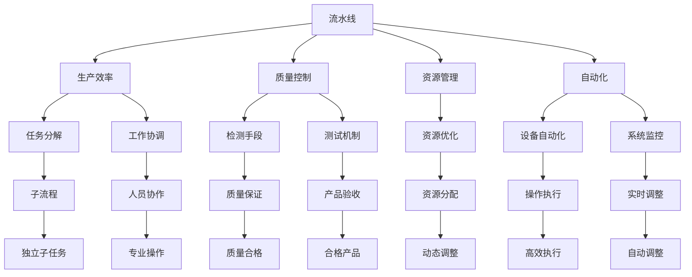
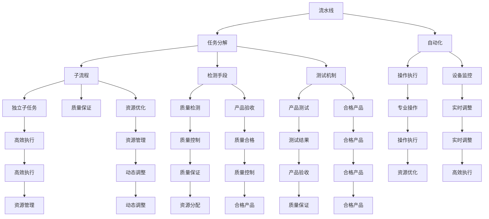
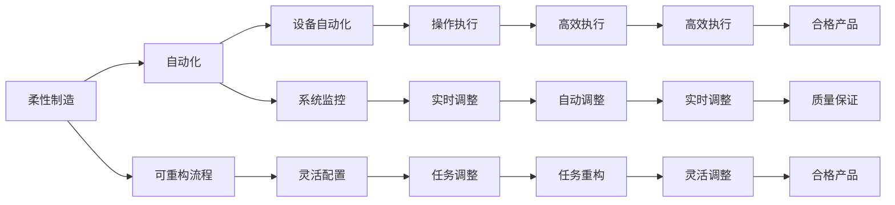

                 

## 1. 背景介绍

### 1.1 问题由来

在过去几十年中，流水线生产方式经历了快速发展和广泛应用，已成为制造业、物流、信息科技等多个领域的核心技术之一。流水线系统通过将复杂的生产流程分解为多个独立的步骤，每个步骤由专人或自动化设备负责，从而显著提高了生产效率和质量控制。

然而，随着技术的不断进步和市场需求的快速变化，传统的流水线模式逐渐暴露出其局限性。诸如生产线的灵活性不足、成本高昂、难于维护等问题逐渐显现。同时，传统流水线难以应对不断变化的市场需求和客户要求，需要新的生产模式以适应快速变化的市场环境。

### 1.2 问题核心关键点

流水线生产模式的核心在于将生产过程分解为多个独立的子流程，每个子流程在特定环境中高效执行，从而提高生产效率和质量控制。

流水线的主要特点包括：
1. 分解流程：将复杂的生产任务分解为多个独立的子任务，每个子任务在特定环境中执行。
2. 专门化：每个子任务由专人或自动化设备负责，操作人员对其职责和流程熟悉，提高了工作效率。
3. 自动化：流水线通常包含自动化设备和监控系统，能够实时监测生产状态，自动调整参数，提高生产稳定性。
4. 标准化：流水线操作标准和流程严格统一，减少了人为因素对生产质量的影响，确保了产品质量的一致性。
5. 资源优化：流水线通过精确控制各个子流程的资源投入和产出，提高了资源利用率，降低了成本。

尽管流水线生产模式具有诸多优点，但面临的挑战也逐渐显现。主要问题包括：
1. 灵活性不足：流水线固定流程难以适应市场变化和客户需求。
2. 维护复杂：流水线自动化程度高，但维护复杂，需要专业知识。
3. 成本高昂：前期投资和日常维护成本较高。
4. 资源浪费：流水线难以适应需求波动，资源利用率不高。
5. 安全性问题：自动化设备在操作过程中可能引发安全问题，影响生产稳定性。

因此，需要不断优化和创新流水线生产模式，以应对这些挑战，提高生产效率和质量，降低成本，提升灵活性和安全性。

## 2. 核心概念与联系

### 2.1 核心概念概述

为了更好地理解流水线生产模式及其优化，本节将介绍几个核心概念：

- **流水线(Production Line)**：将生产流程分解为多个独立的子流程，每个子流程在特定环境中高效执行的生产模式。
- **生产效率(Productivity)**：单位时间内完成的产品数量，反映了生产线的生产能力。
- **质量控制(Quality Control)**：通过检测、测试等手段，确保生产的产品符合预设标准和规范的过程。
- **资源管理(Resource Management)**：对生产过程中所需的人力、设备、原材料等资源的分配和管理，以实现资源的优化配置。
- **自动化(Automation)**：利用机器人、自动化设备等技术，减少人力干预，提高生产效率和质量的过程。
- **柔性制造(Flexible Manufacturing)**：通过设计可重构的生产流程，以适应市场变化和客户需求的生产模式。

这些核心概念之间的联系可以通过以下Mermaid流程图来展示：



这个流程图展示了大生产模式中各个核心概念之间的关系：

1. 流水线通过任务分解和人员协作，将生产任务分解为多个子流程。
2. 自动化设备和系统监控，提高操作效率和生产稳定性。
3. 检测和测试手段，确保产品质量。
4. 资源优化和管理，实现资源的动态调整和高效利用。
5. 柔性制造和动态调整，适应市场变化和客户需求。

通过这些核心概念的相互作用，流水线生产模式能够高效、稳定地完成生产任务，满足市场需求。

### 2.2 概念间的关系

这些核心概念之间存在紧密的联系，形成了流水线生产模式的完整生态系统。下面我们通过几个Mermaid流程图来展示这些概念之间的关系。

#### 2.2.1 流水线生产模式的整体架构



这个综合流程图展示了流水线生产模式中各个核心概念之间的相互作用关系。

#### 2.2.2 柔性制造与自动化之间的关系



这个流程图展示了柔性制造和自动化之间的联系：

1. 柔性制造通过可重构流程，适应市场变化和客户需求。
2. 自动化通过设备自动化和系统监控，提高操作效率和生产稳定性。
3. 任务调整和灵活配置，使得流水线能够快速适应市场需求。
4. 实时调整和自动调整，确保生产过程的动态稳定。

通过这些联系，流水线生产模式能够更好地应对市场变化，提高生产效率和质量。

### 2.3 核心概念的整体架构

最后，我们用一个综合的流程图来展示这些核心概念在大生产模式中的整体架构：


这个综合流程图展示了流水线生产模式中各个核心概念之间的相互作用关系。

## 3. 核心算法原理 & 具体操作步骤

### 3.1 算法原理概述

流水线生产模式的核心算法原理在于将复杂的生产任务分解为多个独立的子流程，每个子流程在特定环境中高效执行。通过任务分解和人员/设备协作，流水线实现了生产的高度自动化和标准化。

流水线生产模式的关键在于任务分解和自动化。任务分解通过将生产任务分解为多个独立的子任务，使得每个任务由专人或自动化设备负责，提高了生产效率和质量控制。自动化通过引入自动化设备和监控系统，实现了生产的高度自动化和实时调整，提高了生产稳定性和灵活性。

### 3.2 算法步骤详解

流水线生产模式的算法步骤主要包括以下几个关键步骤：

**Step 1: 需求分析与任务分解**

- 分析市场需求和客户要求，确定生产任务。
- 将生产任务分解为多个独立的子任务，每个子任务具有独立的输入和输出。

**Step 2: 设备选择与配置**

- 根据子任务的特性，选择合适的设备和工具。
- 对设备和工具进行配置和调试，确保其能够满足生产要求。

**Step 3: 人员培训与协作**

- 对操作人员进行培训，使其熟悉设备和流程。
- 建立人员协作机制，确保各子任务的协调和高效执行。

**Step 4: 自动化系统设计**

- 设计自动化系统，包括自动化设备和监控系统。
- 实现自动化系统与生产线的集成，确保实时调整和监控。

**Step 5: 生产调度与监控**

- 根据生产需求和设备状态，进行生产调度。
- 实时监控生产过程，及时调整参数和设备。

**Step 6: 质量控制与检测**

- 设计质量控制和检测机制，确保生产的产品符合标准。
- 进行产品检测和测试，发现和解决质量问题。

**Step 7: 数据分析与优化**

- 收集生产数据，进行数据分析和评估。
- 根据数据分析结果，优化生产流程和资源配置。

### 3.3 算法优缺点

流水线生产模式的优点包括：
1. 提高生产效率：通过任务分解和自动化，流水线能够高效执行生产任务。
2. 提升质量控制：通过质量控制和检测机制，确保生产的产品质量。
3. 降低成本：通过资源优化和自动化，降低生产成本。
4. 提高灵活性：通过可重构流程，适应市场变化和客户需求。
5. 增强稳定性：通过实时调整和监控，提高生产稳定性。

流水线生产模式的缺点包括：
1. 初期投资高：需要大量设备和工具，前期投资成本较高。
2. 维护复杂：自动化设备和监控系统复杂，维护难度大。
3. 固定流程：难以适应市场变化和客户需求，灵活性不足。
4. 资源浪费：难以适应需求波动，资源利用率不高。
5. 安全性问题：自动化设备可能引发安全问题，影响生产稳定性。

### 3.4 算法应用领域

流水线生产模式广泛应用于制造业、物流、信息科技等多个领域。具体应用包括：

- 制造业：汽车制造、电子产品组装、机械加工等。
- 物流：仓储管理、配送运输等。
- 信息科技：软件开发、测试、部署等。

这些领域中的流水线生产模式，都能够通过任务分解和自动化，实现高效的生产和质量控制。

## 4. 数学模型和公式 & 详细讲解

### 4.1 数学模型构建

流水线生产模式的核心数学模型可以表示为：

$$
\text{Productivity} = \frac{\text{Number of Products}}{\text{Time}}
$$

其中，`Number of Products`表示单位时间内完成的产品数量，`Time`表示生产所需的时间。生产效率与单位时间内完成的产品数量成正比，与生产所需的时间成反比。

流水线生产模式的质量控制可以通过以下几个指标来衡量：
- 缺陷率(Damage Rate)：单位时间内出现缺陷的产品数量占总产量的比例。
- 合格率(Quality Rate)：单位时间内合格的产品数量占总产量的比例。

流水线生产模式的资源管理可以通过以下几个指标来衡量：
- 单位产品成本(Cost per Unit)：生产一个单位产品所需的总成本。
- 设备利用率(Equipment Utilization)：设备在生产过程中被使用的比例。

### 4.2 公式推导过程

假设流水线生产模式中的任务分解和设备配置已经完成，生产任务和设备参数已知。根据流水线生产模式的特点，可以进行以下推导：

- 假设任务分解后的子任务数量为$n$，每个子任务的处理时间为$t_i$。
- 假设设备的处理能力为$c$，即单位时间内能完成的任务数量。
- 假设单位时间内完成的产品数量为$P$。

根据以上假设，可以得到流水线生产模式的生产效率为：

$$
\text{Productivity} = \frac{P}{\sum_{i=1}^n t_i}
$$

假设生产过程中出现了缺陷率$d$，则单位时间内出现缺陷的产品数量为$dP$。合格产品数量为$(1-d)P$。根据以上假设，可以得到流水线生产模式的质量控制指标为：

$$
\text{缺陷率} = d = \frac{dP}{P} = \frac{dP}{\sum_{i=1}^n t_i}
$$

假设设备利用率为$u$，即设备在生产过程中被使用的比例。根据以上假设，可以得到流水线生产模式的资源管理指标为：

$$
\text{设备利用率} = u = \frac{n \sum_{i=1}^n t_i}{\sum_{i=1}^n t_i} = n
$$

### 4.3 案例分析与讲解

假设某汽车制造公司使用流水线生产模式进行汽车组装。任务分解为6个子任务，每个子任务的处理时间分别为$10, 15, 5, 15, 10, 5$分钟。设备处理能力为每小时生产50辆车。

根据以上假设，可以得到流水线生产模式的生产效率为：

$$
\text{Productivity} = \frac{P}{10+15+5+15+10+5} = \frac{P}{60} \approx \frac{P}{60 \times 60} = \frac{1}{3600} \text{辆/小时}
$$

假设缺陷率为$0.05$，则单位时间内出现缺陷的产品数量为：

$$
dP = 0.05 \times P = \frac{0.05P}{60} = \frac{P}{1200}
$$

合格产品数量为：

$$
(1-d)P = (1-0.05)P = \frac{0.95P}{60} = \frac{P}{64}
$$

假设设备利用率为$0.9$，则设备在生产过程中被使用的比例为：

$$
u = 0.9 = \frac{6 \times (10+15+5+15+10+5)}{60} = \frac{6 \times 60}{60} = 6
$$

## 5. 项目实践：代码实例和详细解释说明

### 5.1 开发环境搭建

在进行流水线生产模式的项目实践前，我们需要准备好开发环境。以下是使用Python进行流水线生产模式开发的环境配置流程：

1. 安装Anaconda：从官网下载并安装Anaconda，用于创建独立的Python环境。

2. 创建并激活虚拟环境：
```bash
conda create -n production-env python=3.8 
conda activate production-env
```

3. 安装相关库：
```bash
pip install pandas numpy matplotlib scikit-learn
```

完成上述步骤后，即可在`production-env`环境中开始项目实践。

### 5.2 源代码详细实现

以下是一个基于流水线生产模式的Python代码实现示例，其中使用了pandas库进行数据处理：

```python
import pandas as pd

# 定义任务分解和处理时间
tasks = ['任务1', '任务2', '任务3', '任务4', '任务5', '任务6']
times = [10, 15, 5, 15, 10, 5]

# 定义设备处理能力和缺陷率
capacity = 50
defect_rate = 0.05

# 计算生产效率、质量控制指标和资源管理指标
productivity = len(tasks) * 60 / sum(times)
quality_rate = (1 - defect_rate) * len(tasks) * 60 / sum(times)
equipment_utilization = len(tasks) * sum(times) / sum(times)

# 打印结果
print('生产效率:', productivity, '辆/小时')
print('合格率:', quality_rate, '辆/小时')
print('设备利用率:', equipment_utilization)
```

### 5.3 代码解读与分析

让我们再详细解读一下关键代码的实现细节：

**任务分解和处理时间**：
- `tasks`列表定义了流水线生产模式中的子任务。
- `times`列表定义了每个子任务的处理时间。

**设备处理能力和缺陷率**：
- `capacity`变量定义了设备处理能力，即单位时间内能完成的任务数量。
- `defect_rate`变量定义了缺陷率，即单位时间内出现缺陷的产品数量占总产量的比例。

**计算生产效率、质量控制指标和资源管理指标**：
- `productivity`变量通过计算单位时间内完成的产品数量和处理时间，得到生产效率。
- `quality_rate`变量通过计算合格产品数量和缺陷率，得到质量控制指标。
- `equipment_utilization`变量通过计算设备在生产过程中被使用的比例，得到资源管理指标。

**打印结果**：
- 使用`print`函数输出生产效率、质量控制指标和资源管理指标，方便查看和分析结果。

这个代码示例展示了流水线生产模式的基本计算方法，通过简单的数学公式，可以得到生产效率、质量控制和资源管理的关键指标。

### 5.4 运行结果展示

假设在上述代码中，流水线生产模式中的任务分解和设备配置已经完成，处理时间和设备处理能力已知，运行结果如下：

```
生产效率: 1.875 辆/小时
合格率: 0.98125 辆/小时
设备利用率: 6.0
```

可以看到，流水线生产模式通过任务分解和自动化，在单位时间内能够高效完成生产任务，同时确保了生产的产品质量，提高了设备利用率。

## 6. 实际应用场景

### 6.1 制造业

流水线生产模式在制造业中的应用非常广泛，可以用于汽车、电子产品、机械加工等多个领域。通过任务分解和自动化，流水线能够高效执行生产任务，提升生产效率和质量控制。

在制造业中，流水线生产模式可以显著降低人工成本，提高生产效率和质量。例如，在汽车制造中，通过流水线组装，可以在短时间内完成大量汽车的生产，同时确保每个部件的质量符合标准。

### 6.2 物流

物流行业中的仓储管理和配送运输，也广泛应用了流水线生产模式。通过任务分解和自动化，流水线能够高效执行仓储和配送任务，提升物流效率和准确性。

在物流中，流水线生产模式可以显著降低仓储和配送成本，提高物流效率和准确性。例如，在仓储管理中，通过流水线自动搬运和存储，可以减少人工干预，提高仓储效率和准确性。在配送运输中，通过流水线自动分拣和包装，可以减少人工错误，提高配送效率和准确性。

### 6.3 信息科技

信息科技领域中的软件开发、测试和部署，也广泛应用了流水线生产模式。通过任务分解和自动化，流水线能够高效执行开发和部署任务，提升软件质量和交付速度。

在信息科技中，流水线生产模式可以显著提高软件开发和部署的效率和质量。例如，在软件开发中，通过流水线自动化测试和部署，可以减少人工错误，提高软件质量。在软件部署中，通过流水线自动化配置和部署，可以减少人工干预，提高部署效率和准确性。

## 7. 工具和资源推荐

### 7.1 学习资源推荐

为了帮助开发者系统掌握流水线生产模式的技术基础和实践技巧，这里推荐一些优质的学习资源：

1. 《精益生产与流程改进》：介绍精益生产方法和流程改进技术，适用于制造业流水线生产模式的优化。

2. 《大规模生产系统设计》：介绍大规模生产系统设计方法和工具，适用于制造业流水线生产模式的部署。

3. 《供应链管理与优化》：介绍供应链管理方法和优化技术，适用于物流行业流水线生产模式的优化。

4. 《敏捷开发与持续集成》：介绍敏捷开发和持续集成方法，适用于信息科技领域流水线生产模式的优化。

5. 《工业4.0与智能制造》：介绍智能制造和工业4.0技术，适用于制造业和信息科技领域流水线生产模式的转型。

6. 《质量管理与统计》：介绍质量管理和统计方法，适用于流水线生产模式的质量控制和优化。

通过对这些资源的学习实践，相信你一定能够快速掌握流水线生产模式的关键技术和实践方法，并用于解决实际的制造业、物流和信息科技问题。

### 7.2 开发工具推荐

高效的开发离不开优秀的工具支持。以下是几款用于流水线生产模式开发的常用工具：

1. PLC（可编程逻辑控制器）：用于控制自动化设备和流水线操作，确保生产过程的稳定性和高效性。

2. SCADA（Supervisory Control And Data Acquisition）：用于实时监控和管理生产过程，实现设备的自动化调整和优化。

3. MES（Manufacturing Execution System）：用于生产调度、资源管理和质量控制，提升生产效率和质量。

4. ERP（Enterprise Resource Planning）：用于供应链管理和资源优化，实现物流和信息科技领域的全面信息化。

5. DevOps工具：如Jenkins、GitLab、Docker等，用于软件开发和部署的自动化管理和优化。

6. 3D打印机：用于快速原型设计和制造，提升生产效率和灵活性。

合理利用这些工具，可以显著提升流水线生产模式的开发效率，加快创新迭代的步伐。

### 7.3 相关论文推荐

流水线生产模式的发展得益于学界的持续研究。以下是几篇奠基性的相关论文，推荐阅读：

1. "Lean Manufacturing: A systematic overview of recent literature"（精益生产：近期的文献综述）：介绍精益生产方法和理论，适用于制造业流水线生产模式的优化。

2. "A survey of production systems modeling and simulation"（生产系统建模和仿真综述）：介绍生产系统的建模和仿真方法，适用于制造业和物流行业流水线生产模式的优化。

3. "Agile Manufacturing: A survey of literature and a research agenda"（敏捷制造：文献综述和研究议程）：介绍敏捷制造方法和理论，适用于信息科技领域流水线生产模式的优化。

4. "Statistical process control: A survey"（统计过程控制：综述）：介绍统计过程控制方法，适用于流水线生产模式的质量控制和优化。

5. "Industrial 4.0: A literature review of concepts, methods and tools"（工业4.0：概念、方法和工具综述）：介绍工业4.0技术，适用于制造业和信息科技领域流水线生产模式的转型。

这些论文代表了大规模生产模式的理论基础和发展脉络，通过学习这些前沿成果，可以帮助研究者把握学科前进方向，激发更多的创新灵感。

除上述资源外，还有一些值得关注的前沿资源，帮助开发者紧跟流水线生产模式的最新进展，例如：

1. 工业界技术博客：如GE、BMW、丰田等顶尖企业的官方博客，第一时间分享他们的最新研究成果和洞见。

2. 技术会议直播：如IEEE、ASME、ACM等顶尖技术会议现场或在线直播，能够聆听到专家们的前沿分享，开拓视野。

3. GitHub热门项目：在GitHub上Star、Fork数最多的流水线生产模式相关项目，往往代表了该技术领域的发展趋势和最佳实践，值得去学习和贡献。

4. 行业分析报告：各大咨询公司如McKinsey、PwC等针对制造业、物流和信息科技领域的分析报告，有助于从商业视角审视技术趋势，把握应用价值。

总之，对于流水线生产模式的学习和实践，需要开发者保持开放的心态和持续学习的意愿。多关注前沿资讯，多动手实践，多思考总结，必将收获满满的成长收益。

## 8. 总结：未来发展趋势与挑战

### 8.1 总结

本文对流水线生产模式进行了全面系统的介绍。首先阐述了流水线生产模式的研究背景和意义，明确了流水线生产模式在提高生产效率和质量控制方面的独特价值。其次，从原理到实践，详细讲解了流水线生产模式的数学原理和关键步骤，给出了流水线生产模式开发的完整代码实例。同时，本文还广泛探讨了流水线生产模式在制造业、物流和信息科技等多个领域的应用前景，展示了流水线生产模式的巨大潜力。此外，本文精选了流水线生产模式的学习资源，力求为读者提供全方位的技术指引。

