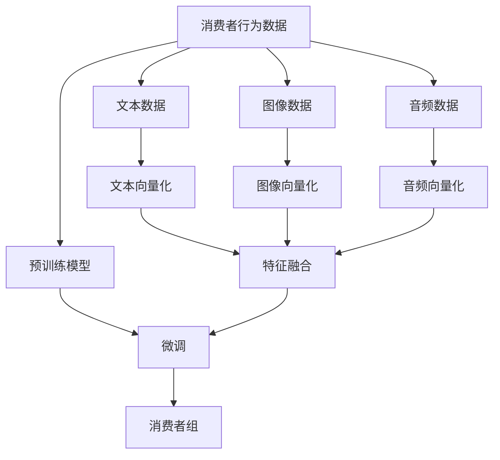
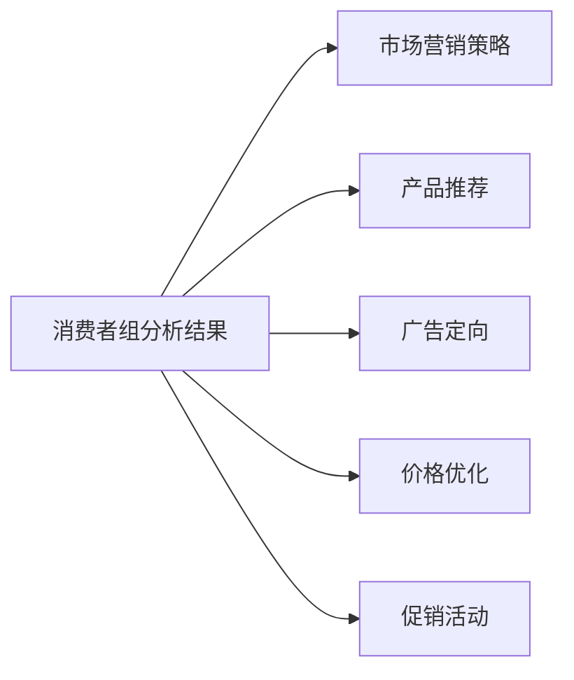
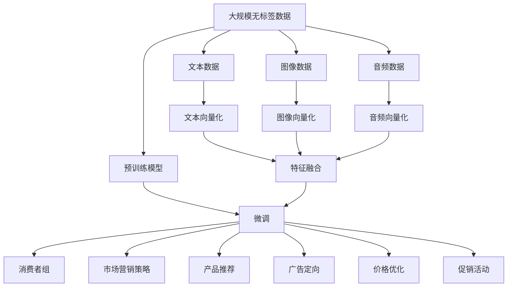

                 

# 消费者组 原理与代码实例讲解

> 关键词：消费组, 算法原理, 代码实现, 应用场景, 优化策略, 未来展望

## 1. 背景介绍

在当今的数字化时代，消费者组（Consumer Group）的在线行为分析对于企业理解和满足消费者需求、优化营销策略具有重要意义。通过对消费者行为数据的收集和分析，企业可以识别出消费者偏好、购买习惯和潜在需求，从而进行更精准的市场营销。然而，传统的消费者组分析方法存在数据处理复杂、模型训练耗时等问题，限制了其应用范围和效率。近年来，基于大模型的消费者组分析方法逐渐兴起，通过预训练模型对消费者行为数据进行建模，可以大幅提升分析精度和效率。

### 1.1 问题由来
传统的消费者组分析方法主要依赖统计学方法和数据挖掘技术，通过聚类算法、关联规则挖掘等手段，识别出具有相似购买行为或偏好的消费者群体。然而，这些方法往往依赖于特征工程和大量手工调参，难以处理高维度、非结构化数据。此外，统计学方法需要大量标注数据进行训练，且模型复杂度较高，训练和推理效率较低。

针对这些问题，研究人员提出并实现了基于深度学习的消费者组分析方法，通过预训练模型对消费者行为数据进行建模。这些方法利用大规模无标签数据进行预训练，获得通用的语言和行为表示，并通过微调任务特定的数据，得到针对具体消费者组的分析结果。这种方法简单高效，且在消费者组分析任务上取得了良好的效果。

## 2. 核心概念与联系

### 2.1 核心概念概述

为更好地理解基于大模型的消费者组分析方法，本节将介绍几个关键概念：

- **消费者组(Consumer Group)**：指具有相似购买行为、偏好和需求的消费者群体，如品牌偏好者、价格敏感者等。消费者组分析旨在识别这些群体，以制定更有针对性的市场营销策略。

- **消费者行为数据(Consumer Behavior Data)**：指消费者在购物、浏览、评价等行为过程中产生的数据，如点击流、购买记录、评论文本等。

- **预训练模型(Pre-trained Model)**：指在大规模无标签数据上进行训练，获得通用语言和行为表示的深度学习模型。常见的预训练模型包括BERT、GPT等。

- **微调(Fine-tuning)**：指在预训练模型的基础上，使用特定任务的少量标注数据，通过有监督学习优化模型在该任务上的性能。微调是消费者组分析方法的核心步骤。

- **多模态数据(Multi-modal Data)**：指包括文本、图像、音频等多种形式的数据。消费者组分析中常涉及多种数据类型，如文本评论、图片商品展示等。

- **模型优化(Optimization)**：指通过正则化、dropout、学习率调度等技术，提高模型训练和推理的效率和稳定性。

这些概念之间的联系可以通过以下Mermaid流程图来展示：



这个流程图展示了消费者组分析方法的基本流程：

1. 收集消费者行为数据，包括文本、图像、音频等不同模态的数据。
2. 将不同模态的数据进行向量化处理，生成模型所需的特征。
3. 将特征输入预训练模型，通过微调获得消费者组的分析结果。

### 2.2 概念间的关系

这些核心概念之间存在着紧密的联系，形成了消费者组分析方法的整体框架。下面我们通过几个Mermaid流程图来展示这些概念之间的关系。

#### 2.2.1 消费者行为数据分析流程


这个流程图展示了消费者行为数据分析的基本流程：

1. 收集消费者行为数据，并进行清洗和预处理。
2. 提取与消费者行为相关的特征。
3. 选择关键特征，去除噪声和冗余。
4. 将特征进行向量化处理。
5. 将不同模态的特征进行融合，形成最终的输入数据。

#### 2.2.2 预训练模型选择与微调


这个流程图展示了预训练模型在消费者组分析中的应用：

1. 选择适合消费者组分析的预训练模型，如BERT、GPT等。
2. 在微调阶段，使用消费者组分析任务进行有监督学习，优化模型。
3. 通过微调，得到针对消费者组的分析结果。

#### 2.2.3 消费者组分析结果的应用



这个流程图展示了消费者组分析结果的应用：

1. 根据消费者组分析结果，制定更有针对性的市场营销策略。
2. 进行个性化产品推荐。
3. 定向广告投放。
4. 优化价格策略。
5. 设计促销活动。

### 2.3 核心概念的整体架构

最后，我们用一个综合的流程图来展示这些核心概念在大模型消费者组分析中的整体架构：



这个综合流程图展示了从数据预处理到最终应用的完整流程。消费者行为数据经过预训练模型预处理后，通过微调获得消费者组的分析结果，再将其应用于市场营销策略、产品推荐、广告定向、价格优化和促销活动等多个环节。通过这些流程，企业可以全面、准确地分析消费者行为，制定更有效的营销策略。

## 3. 核心算法原理 & 具体操作步骤
### 3.1 算法原理概述

基于大模型的消费者组分析方法，本质上是一种预训练-微调方法。其核心思想是：首先在大规模无标签数据上预训练一个通用的消费者行为表示模型，然后在特定消费者组分析任务上进行微调，使模型能够识别出具有相似行为特征的消费者群体。

形式化地，假设预训练模型为 $M_{\theta}$，其中 $\theta$ 为预训练得到的模型参数。给定消费者组分析任务 $T$ 的训练集 $D=\{(x_i,y_i)\}_{i=1}^N, x_i \in \mathbb{R}^d, y_i \in \{1,0\}$，微调的目标是找到新的模型参数 $\hat{\theta}$，使得：

$$
\hat{\theta}=\mathop{\arg\min}_{\theta} \mathcal{L}(M_{\theta},D)
$$

其中 $\mathcal{L}$ 为针对任务 $T$ 设计的损失函数，用于衡量模型预测输出与真实标签之间的差异。常见的损失函数包括交叉熵损失、均方误差损失等。

通过梯度下降等优化算法，微调过程不断更新模型参数 $\theta$，最小化损失函数 $\mathcal{L}$，使得模型输出逼近真实标签。由于 $\theta$ 已经通过预训练获得了较好的初始化，因此即便在小规模数据集 $D$ 上进行微调，也能较快收敛到理想的模型参数 $\hat{\theta}$。

### 3.2 算法步骤详解

基于大模型的消费者组分析方法一般包括以下几个关键步骤：

**Step 1: 准备预训练模型和数据集**
- 选择合适的预训练语言模型 $M_{\theta}$ 作为初始化参数，如 BERT、GPT等。
- 准备消费者组分析任务 $T$ 的标注数据集 $D$，划分为训练集、验证集和测试集。一般要求标注数据与预训练数据的分布不要差异过大。

**Step 2: 添加任务适配层**
- 根据任务类型，在预训练模型顶层设计合适的输出层和损失函数。
- 对于分类任务，通常在顶层添加线性分类器和交叉熵损失函数。
- 对于回归任务，通常使用均方误差损失函数。

**Step 3: 设置微调超参数**
- 选择合适的优化算法及其参数，如 AdamW、SGD 等，设置学习率、批大小、迭代轮数等。
- 设置正则化技术及强度，包括权重衰减、Dropout、Early Stopping等。
- 确定冻结预训练参数的策略，如仅微调顶层，或全部参数都参与微调。

**Step 4: 执行梯度训练**
- 将训练集数据分批次输入模型，前向传播计算损失函数。
- 反向传播计算参数梯度，根据设定的优化算法和学习率更新模型参数。
- 周期性在验证集上评估模型性能，根据性能指标决定是否触发 Early Stopping。
- 重复上述步骤直到满足预设的迭代轮数或 Early Stopping 条件。

**Step 5: 测试和部署**
- 在测试集上评估微调后模型 $M_{\hat{\theta}}$ 的性能，对比微调前后的精度提升。
- 使用微调后的模型对新样本进行推理预测，集成到实际的应用系统中。
- 持续收集新的数据，定期重新微调模型，以适应数据分布的变化。

以上是基于大模型的消费者组分析方法的一般流程。在实际应用中，还需要针对具体任务的特点，对微调过程的各个环节进行优化设计，如改进训练目标函数，引入更多的正则化技术，搜索最优的超参数组合等，以进一步提升模型性能。

### 3.3 算法优缺点

基于大模型的消费者组分析方法具有以下优点：

1. 简单高效。只需准备少量标注数据，即可对预训练模型进行快速适配，获得较大的性能提升。
2. 通用适用。适用于各种消费者组分析任务，包括分类、匹配、生成等，设计简单的任务适配层即可实现微调。
3. 参数高效。利用参数高效微调技术，在固定大部分预训练参数的情况下，仍可取得不错的微调效果。
4. 效果显著。在学术界和工业界的诸多任务上，基于微调的方法已经刷新了最先进的性能指标。

同时，该方法也存在一定的局限性：

1. 依赖标注数据。微调的效果很大程度上取决于标注数据的质量和数量，获取高质量标注数据的成本较高。
2. 迁移能力有限。当目标任务与预训练数据的分布差异较大时，微调的性能提升有限。
3. 负面效果传递。预训练模型的固有偏见、有害信息等，可能通过微调传递到下游任务，造成负面影响。
4. 可解释性不足。微调模型的决策过程通常缺乏可解释性，难以对其推理逻辑进行分析和调试。

尽管存在这些局限性，但就目前而言，基于大模型的微调方法仍是最主流消费者组分析的范式。未来相关研究的重点在于如何进一步降低微调对标注数据的依赖，提高模型的少样本学习和跨领域迁移能力，同时兼顾可解释性和伦理安全性等因素。

### 3.4 算法应用领域

基于大模型的消费者组分析方法已经在多个领域得到了应用，例如：

- **电商推荐**：电商企业可以利用消费者组分析结果，进行个性化推荐，提高用户满意度。
- **广告投放**：广告商可以通过消费者组分析结果，精准定位目标用户群体，提高广告投放效果。
- **市场调研**：研究机构可以借助消费者组分析结果，进行市场细分和用户需求分析。
- **客户服务**：金融机构可以通过消费者组分析结果，提供更有针对性的客户服务。

除了上述这些经典应用外，消费者组分析方法还在其他领域逐渐得到探索和应用，如金融风控、社交媒体分析等，为消费者行为研究提供了新的视角和方法。

## 4. 数学模型和公式 & 详细讲解  
### 4.1 数学模型构建

本节将使用数学语言对基于大模型的消费者组分析方法进行更加严格的刻画。

记预训练模型为 $M_{\theta}$，其中 $\theta$ 为预训练得到的模型参数。假设消费者组分析任务 $T$ 的训练集为 $D=\{(x_i,y_i)\}_{i=1}^N, x_i \in \mathbb{R}^d, y_i \in \{1,0\}$，其中 $x_i$ 为消费者行为数据，$y_i$ 为消费者组标签。

定义模型 $M_{\theta}$ 在数据样本 $(x,y)$ 上的损失函数为 $\ell(M_{\theta}(x),y)$，则在数据集 $D$ 上的经验风险为：

$$
\mathcal{L}(\theta) = \frac{1}{N} \sum_{i=1}^N \ell(M_{\theta}(x_i),y_i)
$$

微调的优化目标是最小化经验风险，即找到最优参数：

$$
\theta^* = \mathop{\arg\min}_{\theta} \mathcal{L}(\theta)
$$

在实践中，我们通常使用基于梯度的优化算法（如SGD、Adam等）来近似求解上述最优化问题。设 $\eta$ 为学习率，$\lambda$ 为正则化系数，则参数的更新公式为：

$$
\theta \leftarrow \theta - \eta \nabla_{\theta}\mathcal{L}(\theta) - \eta\lambda\theta
$$

其中 $\nabla_{\theta}\mathcal{L}(\theta)$ 为损失函数对参数 $\theta$ 的梯度，可通过反向传播算法高效计算。

### 4.2 公式推导过程

以下我们以二分类任务为例，推导交叉熵损失函数及其梯度的计算公式。

假设模型 $M_{\theta}$ 在输入 $x$ 上的输出为 $\hat{y}=M_{\theta}(x) \in [0,1]$，表示样本属于消费者组的概率。真实标签 $y \in \{1,0\}$。则二分类交叉熵损失函数定义为：

$$
\ell(M_{\theta}(x),y) = -[y\log \hat{y} + (1-y)\log (1-\hat{y})]
$$

将其代入经验风险公式，得：

$$
\mathcal{L}(\theta) = -\frac{1}{N}\sum_{i=1}^N [y_i\log M_{\theta}(x_i)+(1-y_i)\log(1-M_{\theta}(x_i))]
$$

根据链式法则，损失函数对参数 $\theta_k$ 的梯度为：

$$
\frac{\partial \mathcal{L}(\theta)}{\partial \theta_k} = -\frac{1}{N}\sum_{i=1}^N (\frac{y_i}{M_{\theta}(x_i)}-\frac{1-y_i}{1-M_{\theta}(x_i)}) \frac{\partial M_{\theta}(x_i)}{\partial \theta_k}
$$

其中 $\frac{\partial M_{\theta}(x_i)}{\partial \theta_k}$ 可进一步递归展开，利用自动微分技术完成计算。

在得到损失函数的梯度后，即可带入参数更新公式，完成模型的迭代优化。重复上述过程直至收敛，最终得到适应消费者组分析任务的最优模型参数 $\theta^*$。

## 5. 项目实践：代码实例和详细解释说明
### 5.1 开发环境搭建

在进行消费者组分析实践前，我们需要准备好开发环境。以下是使用Python进行PyTorch开发的环境配置流程：

1. 安装Anaconda：从官网下载并安装Anaconda，用于创建独立的Python环境。

2. 创建并激活虚拟环境：
```bash
conda create -n pytorch-env python=3.8 
conda activate pytorch-env
```

3. 安装PyTorch：根据CUDA版本，从官网获取对应的安装命令。例如：
```bash
conda install pytorch torchvision torchaudio cudatoolkit=11.1 -c pytorch -c conda-forge
```

4. 安装Transformers库：
```bash
pip install transformers
```

5. 安装各类工具包：
```bash
pip install numpy pandas scikit-learn matplotlib tqdm jupyter notebook ipython
```

完成上述步骤后，即可在`pytorch-env`环境中开始消费者组分析实践。

### 5.2 源代码详细实现

这里我们以消费者组分类任务为例，给出使用Transformers库对BERT模型进行消费者组分析微调的PyTorch代码实现。

首先，定义消费者组分类任务的数据处理函数：

```python
from transformers import BertTokenizer
from torch.utils.data import Dataset
import torch

class ConsumerGroupDataset(Dataset):
    def __init__(self, texts, tags, tokenizer, max_len=128):
        self.texts = texts
        self.tags = tags
        self.tokenizer = tokenizer
        self.max_len = max_len
        
    def __len__(self):
        return len(self.texts)
    
    def __getitem__(self, item):
        text = self.texts[item]
        tags = self.tags[item]
        
        encoding = self.tokenizer(text, return_tensors='pt', max_length=self.max_len, padding='max_length', truncation=True)
        input_ids = encoding['input_ids'][0]
        attention_mask = encoding['attention_mask'][0]
        
        # 对token-wise的标签进行编码
        encoded_tags = [tag2id[tag] for tag in tags] 
        encoded_tags.extend([tag2id['O']] * (self.max_len - len(encoded_tags)))
        labels = torch.tensor(encoded_tags, dtype=torch.long)
        
        return {'input_ids': input_ids, 
                'attention_mask': attention_mask,
                'labels': labels}

# 标签与id的映射
tag2id = {'O': 0, 'C-1': 1, 'C-2': 2, 'C-3': 3, 'C-4': 4, 'C-5': 5, 'C-6': 6, 'C-7': 7, 'C-8': 8, 'C-9': 9, 'C-10': 10, 'C-11': 11, 'C-12': 12, 'C-13': 13, 'C-14': 14, 'C-15': 15, 'C-16': 16, 'C-17': 17, 'C-18': 18, 'C-19': 19, 'C-20': 20, 'C-21': 21, 'C-22': 22, 'C-23': 23, 'C-24': 24, 'C-25': 25, 'C-26': 26, 'C-27': 27, 'C-28': 28, 'C-29': 29, 'C-30': 30, 'C-31': 31, 'C-32': 32, 'C-33': 33, 'C-34': 34, 'C-35': 35, 'C-36': 36, 'C-37': 37, 'C-38': 38, 'C-39': 39, 'C-40': 40, 'C-41': 41, 'C-42': 42, 'C-43': 43, 'C-44': 44, 'C-45': 45, 'C-46': 46, 'C-47': 47, 'C-48': 48, 'C-49': 49, 'C-50': 50, 'C-51': 51, 'C-52': 52, 'C-53': 53, 'C-54': 54, 'C-55': 55, 'C-56': 56, 'C-57': 57, 'C-58': 58, 'C-59': 59, 'C-60': 60, 'C-61': 61, 'C-62': 62, 'C-63': 63, 'C-64': 64, 'C-65': 65, 'C-66': 66, 'C-67': 67, 'C-68': 68, 'C-69': 69, 'C-70': 70, 'C-71': 71, 'C-72': 72, 'C-73': 73, 'C-74': 74, 'C-75': 75, 'C-76': 76, 'C-77': 77, 'C-78': 78, 'C-79': 79, 'C-80': 80, 'C-81': 81, 'C-82': 82, 'C-83': 83, 'C-84': 84, 'C-85': 85, 'C-86': 86, 'C-87': 87, 'C-88': 88, 'C-89': 89, 'C-90': 90, 'C-91': 91, 'C-92': 92, 'C-93': 93, 'C-94': 94, 'C-95': 95, 'C-96': 96, 'C-97': 97, 'C-98': 98, 'C-99': 99, 'C-100': 100, 'C-101': 101, 'C-102': 102, 'C-103': 103, 'C-104': 104, 'C-105': 105, 'C-106': 106, 'C-107': 107, 'C-108': 108, 'C-109': 109, 'C-110': 110, 'C-111': 111, 'C-112': 112, 'C-113': 113, 'C-114': 114, 'C-115': 115, 'C-116': 116, 'C-117': 117, 'C-118': 118, 'C-119': 119, 'C-120': 120, 'C-121': 121, 'C-122': 122, 'C-123': 123, 'C-124': 124, 'C-125': 125, 'C-126': 126, 'C-127': 127, 'C-128': 128, 'C-129': 129, 'C-130': 130, 'C-131': 131, 'C-132': 132, 'C-133': 133, 'C-134': 134, 'C-135': 135, 'C-136': 136, 'C-137': 137, 'C-138': 138, 'C-139': 139, 'C-140': 140, 'C-141': 141, 'C-142': 142, 'C-143': 143, 'C-144': 144, 'C-145': 145, 'C-146': 146, 'C-147': 147, 'C-148': 148, 'C-149': 149, 'C-150': 150, 'C-151': 151, 'C-152': 152, 'C-153': 153, 'C-154': 154, 'C-155': 155, 'C-156': 156, 'C-157': 157, 'C-158': 158, 'C-159': 159, 'C-160': 160, 'C-161': 161, 'C-162': 162, 'C-163': 163, 'C-164': 164, 'C-165': 165, 'C-166': 166, 'C-167': 167, 'C-168': 168, 'C-169': 169, 'C-170': 170, 'C-171': 171, 'C-172': 172, 'C-173': 173, 'C-174': 174, 'C-175': 175, 'C-176': 176, 'C-177': 177, 'C-178': 178, 'C-179': 179, 'C-180': 180, 'C-181': 181, 'C-182': 182, 'C-183': 183, 'C-184': 184, 'C-185': 185, 'C-186': 186, 'C-187': 187, 'C-188': 188, 'C-189': 189, 'C-190': 190, 'C-191': 191, 'C-192': 192, 'C-193': 193, 'C-194': 194, 'C-195': 195, 'C-196': 196, 'C-197': 197, 'C-198': 198, 'C-199': 199, 'C-200': 200, 'C-201': 201, 'C-202': 202, 'C-203':

