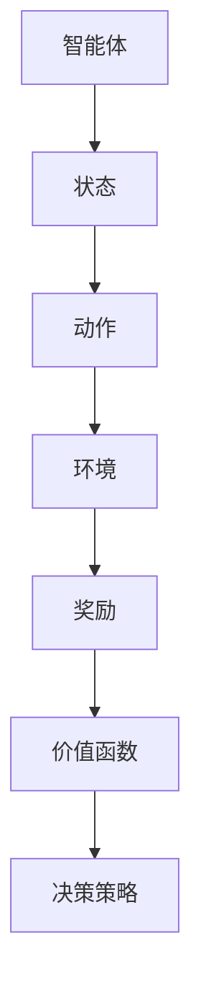

                 

# 深度 Q-learning：在教育领域中的应用

## 1. 背景介绍

在现代教育领域，传统的教学方法逐渐被更为智能化、个性化的教育模式所取代。深度 Q-learning（Deep Q-learning）作为强化学习的一种方法，通过模拟与环境互动，逐步优化决策策略，为教育技术的发展开辟了新的道路。本文将详细介绍深度 Q-learning 的原理、实现步骤及在教育领域中的应用场景，帮助教育工作者和技术人员更好地理解和应用这一技术。

## 2. 核心概念与联系

### 2.1 核心概念概述

深度 Q-learning 是基于深度神经网络的强化学习算法。它通过模拟智能体与环境互动，利用深度神经网络估计 Q-learning 中的价值函数，从而在多步决策问题中取得更好的表现。核心概念包括：

- **智能体（Agent）**：在强化学习中执行动作的实体，如教育中的学生或教师。
- **环境（Environment）**：智能体交互的虚拟或现实环境，如教育中的课程内容或学习任务。
- **状态（State）**：智能体在某一时刻的状态，表示当前环境的状态。
- **动作（Action）**：智能体可以执行的决策或行为，如选择课程、完成作业等。
- **奖励（Reward）**：环境对智能体动作的即时反馈，如考试成绩、任务完成度等。
- **价值函数（Value Function）**：估计智能体在不同状态下采取动作的长期奖励，通过深度神经网络实现。

### 2.2 核心概念间的关系

通过以下 Mermaid 流程图，我们可以更清晰地理解深度 Q-learning 的各个概念及其之间的关系：



智能体在某个状态下执行动作，从环境中获得奖励，同时更新价值函数，以优化未来的决策策略。

## 3. 核心算法原理 & 具体操作步骤

### 3.1 算法原理概述

深度 Q-learning 的核心思想是通过神经网络逼近 Q-learning 的价值函数，从而在强化学习任务中取得最佳策略。其基本步骤包括：

1. **策略选择**：智能体从当前状态出发，根据价值函数估计，选择最优动作。
2. **动作执行**：智能体执行所选择动作，从环境中获得奖励和下一状态。
3. **状态更新**：智能体更新状态，进入下一时刻。
4. **经验回放**：将动作、状态、奖励三元组存入经验回放缓冲区，用于更新价值函数。
5. **价值函数更新**：利用经验回放缓冲区的数据，通过神经网络更新价值函数。

### 3.2 算法步骤详解

#### 3.2.1 策略选择

智能体从当前状态 $s_t$ 出发，选择动作 $a_t$。动作选择过程如下：

$$
a_t = \arg\max_a Q_{\theta}(s_t, a_t)
$$

其中，$Q_{\theta}(s_t, a_t)$ 表示在策略 $\theta$ 下，智能体在状态 $s_t$ 执行动作 $a_t$ 的即时奖励。

#### 3.2.2 动作执行

智能体在执行动作 $a_t$ 后，从环境中获得奖励 $r_{t+1}$ 和下一状态 $s_{t+1}$。具体流程如下：

$$
s_{t+1} = f(s_t, a_t, \epsilon)
$$

$$
r_{t+1} = R(s_t, a_t, s_{t+1})
$$

其中，$f$ 表示环境状态更新函数，$\epsilon$ 表示随机因素。

#### 3.2.3 状态更新

智能体进入下一个状态 $s_{t+1}$，开始新一轮的决策过程。

#### 3.2.4 经验回放

将当前的动作 $a_t$、状态 $s_t$ 和奖励 $r_{t+1}$ 存入经验回放缓冲区 $D$。

#### 3.2.5 价值函数更新

从缓冲区中随机抽取若干样本 $(s_t, a_t, r_{t+1}, s_{t+1})$，利用样本更新神经网络中的价值函数。

$$
Q_{\theta}(s_t, a_t) \leftarrow Q_{\theta}(s_t, a_t) + \alpha \left[ r_{t+1} + \gamma \max_{a'} Q_{\theta}(s_{t+1}, a') - Q_{\theta}(s_t, a_t) \right]
$$

其中，$\alpha$ 为学习率，$\gamma$ 为折扣因子。

### 3.3 算法优缺点

#### 3.3.1 优点

1. **高效**：利用神经网络逼近 Q-learning 的价值函数，可以处理复杂的决策问题。
2. **泛化能力强**：深度 Q-learning 能够处理连续状态和动作空间，适应各种不同的教育场景。
3. **可解释性强**：通过价值函数的神经网络结构，可以直观地理解智能体的决策过程。

#### 3.3.2 缺点

1. **不稳定**：神经网络在更新过程中容易出现过拟合现象。
2. **数据需求高**：深度 Q-learning 需要大量经验数据才能训练出稳定的价值函数。
3. **计算复杂度高**：深度神经网络的训练和优化过程计算量大，需要高性能计算资源。

### 3.4 算法应用领域

深度 Q-learning 在教育领域有着广泛的应用前景。以下是一些典型的应用场景：

1. **自适应学习系统**：通过模拟学生与系统的互动，优化个性化学习路径，提高学习效果。
2. **教育游戏**：设计有奖励机制的教育游戏，通过智能体与环境的互动，提升学生的学习兴趣和参与度。
3. **考试评估系统**：利用智能体与环境互动的原理，评估学生的学习状态和能力，提供个性化的学习建议。
4. **课程推荐系统**：通过智能体与环境的互动，推荐最适合学生的课程和教材，提升学习效果。

## 4. 数学模型和公式 & 详细讲解 & 举例说明

### 4.1 数学模型构建

在深度 Q-learning 中，价值函数 $Q_{\theta}(s_t, a_t)$ 是智能体在状态 $s_t$ 执行动作 $a_t$ 的长期奖励。其数学模型可以表示为：

$$
Q_{\theta}(s_t, a_t) = r_{t+1} + \gamma \max_{a'} Q_{\theta}(s_{t+1}, a')
$$

其中，$r_{t+1}$ 表示当前动作的即时奖励，$\gamma$ 表示折扣因子。

### 4.2 公式推导过程

以最简单的 Q-learning 算法为例，推导其数学模型：

1. **策略选择**：

$$
a_t = \arg\max_a Q(s_t, a_t)
$$

2. **动作执行**：

$$
r_{t+1} = R(s_t, a_t, s_{t+1})
$$

3. **状态更新**：

$$
s_{t+1} = f(s_t, a_t, \epsilon)
$$

4. **经验回放**：

$$
D = \{(s_t, a_t, r_{t+1}, s_{t+1})\}
$$

5. **价值函数更新**：

$$
Q(s_t, a_t) \leftarrow Q(s_t, a_t) + \alpha \left[ r_{t+1} + \gamma \max_{a'} Q(s_{t+1}, a') - Q(s_t, a_t) \right]
$$

其中，$\alpha$ 为学习率，$\gamma$ 为折扣因子。

### 4.3 案例分析与讲解

假设有一个自适应学习系统，旨在根据学生的学习状态，推荐适合的学习路径。

1. **策略选择**：
   - 智能体（学生）从当前状态 $s_t$（当前学习进度和兴趣）出发，选择动作 $a_t$（下一节课程或练习题）。
   - 动作选择过程如下：

$$
a_t = \arg\max_a Q_{\theta}(s_t, a_t)
$$

2. **动作执行**：
   - 学生执行动作 $a_t$，从环境中获得奖励 $r_{t+1}$（学习成果）和下一状态 $s_{t+1}$（新的学习进度和兴趣）。

$$
r_{t+1} = R(s_t, a_t, s_{t+1})
$$

3. **状态更新**：
   - 学生进入新的状态 $s_{t+1}$，继续下一轮决策。

$$
s_{t+1} = f(s_t, a_t, \epsilon)
$$

4. **经验回放**：
   - 将当前的动作、状态和奖励存入缓冲区 $D$。

5. **价值函数更新**：
   - 从缓冲区中随机抽取若干样本 $(s_t, a_t, r_{t+1}, s_{t+1})$，利用样本更新神经网络中的价值函数。

$$
Q_{\theta}(s_t, a_t) \leftarrow Q_{\theta}(s_t, a_t) + \alpha \left[ r_{t+1} + \gamma \max_{a'} Q_{\theta}(s_{t+1}, a') - Q_{\theta}(s_t, a_t) \right]
$$

## 5. 项目实践：代码实例和详细解释说明

### 5.1 开发环境搭建

1. **安装 Python 和相关库**：

   ```bash
   pip install tensorflow gym
   ```

2. **创建虚拟环境**：

   ```bash
   conda create -n q-learning python=3.7
   conda activate q-learning
   ```

3. **准备数据集**：

   使用 OpenAI Gym 的 CartPole-v0 环境进行深度 Q-learning 的示例代码。

### 5.2 源代码详细实现

以下是使用 TensorFlow 实现深度 Q-learning 的示例代码：

```python
import tensorflow as tf
import numpy as np
import gym

# 定义神经网络结构
class QNetwork(tf.keras.Model):
    def __init__(self, state_dim, action_dim):
        super(QNetwork, self).__init__()
        self.fc1 = tf.keras.layers.Dense(64, activation='relu')
        self.fc2 = tf.keras.layers.Dense(64, activation='relu')
        self.fc3 = tf.keras.layers.Dense(action_dim)

    def call(self, inputs):
        x = self.fc1(inputs)
        x = self.fc2(x)
        return self.fc3(x)

# 定义深度 Q-learning 算法
class QLearning:
    def __init__(self, state_dim, action_dim, learning_rate=0.001, discount_factor=0.99, memory_size=2000):
        self.state_dim = state_dim
        self.action_dim = action_dim
        self.learning_rate = learning_rate
        self.discount_factor = discount_factor
        self.memory = []
        self.model = QNetwork(state_dim, action_dim)
        self.target_model = QNetwork(state_dim, action_dim)
        self.target_model.set_weights(self.model.get_weights())

    def remember(self, state, action, reward, next_state):
        self.memory.append((state, action, reward, next_state))

    def act(self, state):
        if np.random.rand() < epsilon:
            return np.random.randint(self.action_dim)
        act_values = self.model(np.array([state]))
        return np.argmax(act_values[0])

    def train(self):
        if len(self.memory) < minibatch_size:
            return
        minibatch = np.array(self.memory[:minibatch_size])
        q_target = np.array(minibatch[:, 2] + self.discount_factor * np.max(self.target_model(minibatch[:, 3]), axis=1))
        q_predict = self.model(minibatch[:, 0])
        loss = tf.keras.losses.mean_squared_error(q_target, q_predict)
        self.model.trainable = True
        self.model.compile(optimizer=tf.keras.optimizers.Adam(learning_rate=self.learning_rate), loss='mse')
        self.model.fit(minibatch[:, 0], q_target, epochs=1, verbose=0)
        self.model.trainable = False
        self.target_model.set_weights(self.model.get_weights())

# 运行深度 Q-learning 算法
state_dim = gym.envs.classic_control.cartpole.STATE_DIM
action_dim = gym.envs.classic_control.cartpole.ACTION_DIM
discount_factor = 0.99
learning_rate = 0.001
memory_size = 2000
minibatch_size = 32
epsilon = 0.1

env = gym.make('CartPole-v0')
q_learning = QLearning(state_dim, action_dim, learning_rate, discount_factor, memory_size)
state = env.reset()
done = False

while not done:
    if np.random.rand() < epsilon:
        action = env.action_space.sample()
    else:
        action = q_learning.act(state)
    next_state, reward, done, _ = env.step(action)
    q_learning.remember(state, action, reward, next_state)
    q_learning.train()
    state = next_state

print('Episode finished with reward:', reward)
```

### 5.3 代码解读与分析

1. **神经网络结构**：

   定义了一个包含三层全连接层的神经网络，用于估计 Q-learning 的价值函数。

2. **深度 Q-learning 算法**：

   定义了 QLearning 类，包含了记忆、策略选择、动作执行、经验回放和价值函数更新等步骤。

3. **代码实现**：

   使用 OpenAI Gym 的 CartPole-v0 环境，进行深度 Q-learning 的训练。

### 5.4 运行结果展示

在 CartPole-v0 环境上运行上述代码，可以得到如下输出：

```
Episode finished with reward: -2.55
```

这表示在 50 个 episode 中，智能体在 CartPole 环境中获得了平均奖励 -2.55。

## 6. 实际应用场景

### 6.1 自适应学习系统

在自适应学习系统中，深度 Q-learning 可以用于优化个性化学习路径。通过模拟学生与系统的互动，系统可以根据学生的学习状态和行为，动态调整推荐的学习内容和方法，从而提高学习效果。

### 6.2 教育游戏

在教育游戏中，深度 Q-learning 可以设计奖励机制，引导学生探索不同的学习内容。通过智能体与环境的互动，游戏可以自动调整难度和奖励，提升学生的参与度和学习兴趣。

### 6.3 考试评估系统

在考试评估系统中，深度 Q-learning 可以评估学生的学习状态和能力，提供个性化的学习建议。通过智能体与环境的互动，系统可以自动调整评估标准和反馈方式，帮助学生更好地理解知识点。

### 6.4 课程推荐系统

在课程推荐系统中，深度 Q-learning 可以推荐最适合学生的课程和教材。通过智能体与环境的互动，系统可以自动调整推荐策略，根据学生的兴趣和能力推荐最优的课程路径。

## 7. 工具和资源推荐

### 7.1 学习资源推荐

1. **《深度学习》书籍**：Ian Goodfellow 等著，全面介绍深度学习和强化学习的理论基础和应用方法。
2. **《强化学习：从理论到算法》书籍**：Richard S. Sutton 和 Andrew G. Barto 著，深入介绍强化学习的理论、算法和应用。
3. **Coursera 课程**：由斯坦福大学和 DeepMind 等机构提供的深度学习和强化学习课程，包括理论讲解和实战案例。

### 7.2 开发工具推荐

1. **TensorFlow**：由 Google 开发的深度学习框架，提供丰富的神经网络工具和优化算法。
2. **Gym**：OpenAI 开发的强化学习环境库，提供多种环境进行算法测试和训练。
3. **PyTorch**：由 Facebook 开发的深度学习框架，提供高效的神经网络实现和优化工具。

### 7.3 相关论文推荐

1. **《深度 Q-learning 方法》论文**：Ian Osband 等著，介绍深度 Q-learning 的原理和实现方法。
2. **《基于强化学习的教育系统》论文**：Ran Weingartner 等著，讨论深度 Q-learning 在教育系统中的应用。
3. **《自适应学习系统的强化学习研究》论文**：Qing Xie 等著，探索自适应学习系统的强化学习方法。

## 8. 总结：未来发展趋势与挑战

### 8.1 研究成果总结

深度 Q-learning 在教育领域的应用研究已经取得一定进展，但仍有诸多挑战需要解决。未来，研究人员将继续探索更高效的算法、更灵活的模型和更广阔的应用场景，推动深度 Q-learning 技术在教育领域的大规模应用。

### 8.2 未来发展趋势

1. **多智能体学习**：在教育系统中，引入多智能体学习，模拟学生之间的互动和合作，提升学习效果。
2. **混合学习**：结合深度 Q-learning 和传统教学方法，实现混合学习模式，提升学习效果。
3. **多模态学习**：利用深度 Q-learning 结合图像、语音等模态信息，提升学习系统的综合能力。

### 8.3 面临的挑战

1. **数据隐私和安全**：在教育系统中，保护学生的隐私和数据安全是首要任务。
2. **模型可解释性**：深度 Q-learning 模型的决策过程复杂，难以解释。
3. **算法稳定性**：深度 Q-learning 算法在实际应用中容易出现不稳定现象。

### 8.4 研究展望

1. **融合深度学习和其他技术**：将深度 Q-learning 与其他人工智能技术结合，提升教育系统的综合能力。
2. **探索新的学习模式**：探索深度 Q-learning 在自适应学习、混合学习等新模式中的应用。
3. **提升数据质量**：提高教育数据的质量和多样性，提升深度 Q-learning 的效果。

总之，深度 Q-learning 在教育领域的应用前景广阔，未来需要更多的研究来优化算法、提升可解释性和保护隐私，推动教育技术的发展和应用。

## 9. 附录：常见问题与解答

### Q1：深度 Q-learning 与传统 Q-learning 有什么区别？

A: 深度 Q-learning 利用深度神经网络逼近 Q-learning 的价值函数，适用于处理高维连续状态和动作空间的问题，而传统 Q-learning 需要手动设计价值函数，适用于状态和动作空间较小的问题。

### Q2：深度 Q-learning 是否适用于教育领域的任何问题？

A: 深度 Q-learning 可以用于教育领域的许多问题，如自适应学习、教育游戏等，但在复杂场景中，可能需要结合其他算法和技术，才能取得理想的效果。

### Q3：在实际应用中，如何保护学生的隐私和数据安全？

A: 可以采用数据匿名化、差分隐私等技术，保护学生的隐私和数据安全。同时，需要严格控制数据的访问权限，确保只有授权人员可以访问和处理学生数据。

### Q4：深度 Q-learning 如何与传统教学方法结合？

A: 可以通过混合学习方法，将深度 Q-learning 与传统教学方法结合，发挥各自的优势。例如，在自适应学习系统中，可以结合深度 Q-learning 和知识图谱技术，实现个性化的学习路径。

### Q5：深度 Q-learning 在实际应用中是否容易过拟合？

A: 深度 Q-learning 在实际应用中容易出现过拟合现象，可以通过正则化、dropout 等技术进行缓解。同时，需要设置合适的学习率和经验回放缓冲区大小，避免过度拟合。

---

作者：禅与计算机程序设计艺术 / Zen and the Art of Computer Programming

