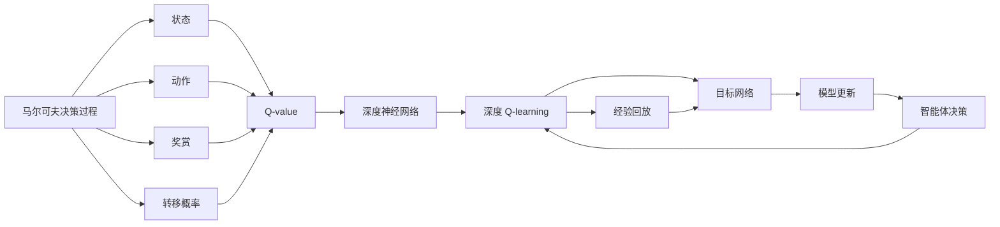

                 

# 深度 Q-learning：在网格计算中的应用

> 关键词：深度强化学习, Q-learning, 强化学习, 网格计算, 多智能体, 马尔可夫决策过程, 连续状态空间

## 1. 背景介绍

### 1.1 问题由来
深度强化学习（Deep Reinforcement Learning, DRL）作为强化学习（Reinforcement Learning, RL）与深度学习（Deep Learning, DL）的结合体，近年来在多个领域取得了突破性的进展。其应用从传统的游戏、机器人控制扩展到金融、推荐系统、工业控制等更广泛的实际场景。

在网格计算（Grid Computing）领域，由于系统复杂性和不确定性，如何高效调度、优化资源分配成为一个重要研究课题。传统优化算法如遗传算法、粒子群算法等，虽然在某些情况下能够达到较好的效果，但在处理大规模、高维度的优化问题时，往往存在效率低下、收敛速度慢、易陷入局部最优等问题。

深度 Q-learning 提供了基于深度神经网络的 Q-learning 算法，能够高效处理复杂、高维的优化问题，具有较好的鲁棒性和泛化能力。本文将重点介绍深度 Q-learning 在网格计算中的应用，包括其基本原理、操作步骤和相关案例分析。

### 1.2 问题核心关键点
深度 Q-learning 的核心在于通过学习价值函数（Q-values）来指导智能体在环境中的决策。具体来说，智能体在每个状态下，根据当前的状态、动作和奖赏，通过深度神经网络预测最优 Q-value。该 Q-value 将指导智能体在每个状态下选择动作，从而实现全局最优策略。

深度 Q-learning 与传统的 Q-learning 的主要区别在于用深度神经网络代替了传统的 Q-lookup 表。其核心技术包括深度神经网络设计、经验回放、目标网络等，显著提升了 Q-learning 在复杂优化问题上的应用潜力。

## 2. 核心概念与联系

### 2.1 核心概念概述

为了更好地理解深度 Q-learning 在网格计算中的应用，本节将介绍几个密切相关的核心概念：

- **深度 Q-learning**：一种结合深度学习和强化学习的优化算法，通过学习价值函数（Q-values）来指导智能体在复杂环境中选择最优动作。

- **马尔可夫决策过程（MDP）**：描述智能体与环境交互的数学模型，包含状态、动作、奖赏、转移概率等关键要素。

- **Q-learning**：一种基于值迭代的强化学习算法，通过学习最优的 Q-value 函数，指导智能体在每个状态下选择最优动作。

- **深度神经网络**：一种由多层神经元构成的复杂函数映射，能够处理高维、非线性的优化问题。

- **经验回放**：一种强化学习中的数据增强技术，通过将历史数据重新采样并随机回放，增加训练样本的多样性，提高模型的泛化能力。

- **目标网络**：一种深度 Q-learning 中的重要技术，通过维持两个独立的神经网络，避免过度拟合历史数据，提升模型的稳定性和泛化能力。

这些核心概念之间存在着紧密的联系，形成了深度 Q-learning 的完整生态系统。

### 2.2 概念间的关系

这些核心概念之间的逻辑关系可以通过以下 Mermaid 流程图来展示：



这个流程图展示了大语言模型的核心概念及其之间的关系：

1. 智能体通过马尔可夫决策过程感知环境，并在每个状态下进行选择动作。
2. 动作的执行和奖赏的接收将影响智能体对状态的评估。
3. 状态和奖赏作为输入，经过深度神经网络计算得到 Q-value，指导智能体的决策。
4. 深度 Q-learning 通过经验回放和目标网络等技术，提升模型的稳定性和泛化能力。
5. 模型更新和智能体决策在深度 Q-learning 中循环迭代，不断优化模型，实现全局最优策略。

通过理解这些核心概念，我们可以更好地把握深度 Q-learning 的工作原理和优化方向。

## 3. 核心算法原理 & 具体操作步骤
### 3.1 算法原理概述

深度 Q-learning 的本质是通过神经网络逼近 Q-value 函数，从而在连续状态空间中进行优化决策。其核心思想是通过值迭代的策略，不断更新智能体在每个状态下的 Q-value，使其逐步逼近最优值。

具体来说，深度 Q-learning 步骤如下：

1. **初始化**：定义神经网络，并初始化权重。
2. **策略更新**：根据当前状态，通过神经网络预测 Q-value，选择最优动作。
3. **经验回放**：将每个时间步的状态、动作、奖赏存储在经验回放缓冲区中。
4. **目标网络更新**：通过从经验回放缓冲区中随机采样样本，更新目标网络 Q-value 和智能体当前网络的 Q-value。
5. **模型更新**：通过值迭代策略，更新智能体当前网络的 Q-value，直到收敛。

### 3.2 算法步骤详解

以下将详细介绍深度 Q-learning 的具体操作步骤：

#### 3.2.1 神经网络设计

深度 Q-learning 的神经网络一般包含输入层、隐藏层和输出层。输入层接收当前状态，隐藏层通过若干全连接层进行特征提取，输出层则输出每个动作对应的 Q-value。

```python
import torch
import torch.nn as nn
import torch.optim as optim

class QNetwork(nn.Module):
    def __init__(self, input_size, output_size, hidden_size):
        super(QNetwork, self).__init__()
        self.fc1 = nn.Linear(input_size, hidden_size)
        self.fc2 = nn.Linear(hidden_size, hidden_size)
        self.fc3 = nn.Linear(hidden_size, output_size)
    
    def forward(self, x):
        x = torch.relu(self.fc1(x))
        x = torch.relu(self.fc2(x))
        x = self.fc3(x)
        return x
```

#### 3.2.2 经验回放

经验回放是一种数据增强技术，通过从历史数据中随机采样，增加训练样本的多样性，提升模型的泛化能力。其具体步骤如下：

1. 定义经验回放缓冲区，用于存储每个时间步的状态、动作和奖赏。
2. 在每个训练迭代中，从缓冲区中随机采样 minibatch 样本。
3. 使用采样得到的样本更新智能体当前网络的 Q-value。

```python
class ReplayBuffer:
    def __init__(self, capacity):
        self.capacity = capacity
        self.buffer = []
        self.position = 0
    
    def add(self, state, action, reward, next_state, done):
        if len(self.buffer) < self.capacity:
            self.buffer.append((state, action, reward, next_state, done))
        else:
            self.buffer[self.position] = (state, action, reward, next_state, done)
        self.position = (self.position + 1) % self.capacity
    
    def sample(self, batch_size):
        return random.sample(self.buffer, batch_size)
```

#### 3.2.3 目标网络更新

目标网络更新是深度 Q-learning 中的重要技术，通过维持两个独立的神经网络，避免过度拟合历史数据，提升模型的稳定性和泛化能力。

1. 定义目标网络，并初始化其权重。
2. 在每个训练迭代中，将目标网络的参数更新为智能体当前网络的参数。
3. 通过目标网络预测 Q-value，并使用智能体当前网络预测 Q-value，计算损失。
4. 使用损失函数更新智能体当前网络的参数。

```python
target_network = QNetwork(input_size, output_size, hidden_size)
target_network.load_state_dict(model.state_dict())
target_network.eval()

def update_target_network(model, target_network, target_update_freq):
    if target_update_freq == 0:
        return
    model.train()
    target_network.train()
    for state, action, reward, next_state, done in replay_buffer.sample(batch_size):
        with torch.no_grad():
            q_next = target_network(next_state)
        q_pred = model(state)
        if done:
            q_pred = q_pred.gather(1, action)
        else:
            q_pred = q_pred.gather(1, action)
        loss = -torch.mean(q_pred)
        optimizer.zero_grad()
        loss.backward()
        optimizer.step()
    target_network.load_state_dict(model.state_dict())
```

### 3.3 算法优缺点

深度 Q-learning 在处理复杂优化问题时具有以下优点：

1. **高泛化能力**：深度神经网络具有强大的特征提取能力，能够处理高维、非线性的优化问题。
2. **高效训练**：通过经验回放和目标网络等技术，显著提升模型的泛化能力和训练效率。
3. **全局最优策略**：通过值迭代的策略，深度 Q-learning 能够逐步逼近全局最优策略。

同时，深度 Q-learning 也存在一些局限性：

1. **数据需求高**：深度神经网络的训练需要大量数据支持，对于小规模问题，可能难以取得理想的训练效果。
2. **模型复杂度高**：深度神经网络结构复杂，模型训练和推理的计算成本较高。
3. **模型可解释性差**：深度神经网络作为黑盒模型，难以解释其内部工作机制和决策逻辑。
4. **参数量庞大**：大规模神经网络的参数量庞大，可能出现过拟合问题，影响模型的泛化能力。

### 3.4 算法应用领域

深度 Q-learning 已经在多个领域得到了广泛应用，包括：

1. **游戏AI**：如 Atari 游戏、围棋、星际争霸等，通过深度 Q-learning 训练 AI 能够在复杂的游戏中取得优秀的成绩。
2. **机器人控制**：如机器人路径规划、操纵臂操作等，通过深度 Q-learning 训练 AI 能够实现更加精准、灵活的操作。
3. **金融交易**：通过深度 Q-learning 训练 AI 进行股票交易策略优化，提高交易收益和风险控制能力。
4. **推荐系统**：通过深度 Q-learning 训练 AI 进行用户兴趣预测和推荐，提高推荐效果和用户满意度。
5. **能源管理**：通过深度 Q-learning 训练 AI 进行能源需求预测和优化，提高能源利用效率和稳定性。
6. **交通控制**：通过深度 Q-learning 训练 AI 进行交通流量优化和控制，缓解交通拥堵问题。

此外，深度 Q-learning 在其他领域的优化问题上也具有广泛的应用潜力。

## 4. 数学模型和公式 & 详细讲解 & 举例说明

### 4.1 数学模型构建

深度 Q-learning 的数学模型可以形式化地表示为：

1. 定义状态空间 $S$，动作空间 $A$，奖赏函数 $R$，转移概率 $P$，折扣因子 $\gamma$。
2. 定义智能体的策略 $\pi$，通过神经网络 $Q_{\theta}$ 逼近最优的 Q-value 函数。
3. 定义智能体的当前状态 $s_t$，动作 $a_t$，奖赏 $r_t$，下一个状态 $s_{t+1}$，折扣奖励 $G_{t+1}=\sum_{k=0}^{\infty} \gamma^k r_{t+k}$。

4. 在每个时间步 $t$，智能体通过神经网络 $Q_{\theta}$ 预测当前状态 $s_t$ 下的最优 Q-value $Q_{\theta}(s_t, a_t)$，并选择动作 $a_t$ 进行执行。

5. 在每个时间步 $t+1$，智能体接收奖赏 $r_{t+1}$，观察下一个状态 $s_{t+1}$，通过神经网络 $Q_{\theta}$ 预测最优 Q-value $Q_{\theta}(s_{t+1}, a_{t+1})$。

### 4.2 公式推导过程

以下将推导深度 Q-learning 的更新公式：

1. 在每个时间步 $t$，智能体通过神经网络 $Q_{\theta}$ 预测当前状态 $s_t$ 下的最优 Q-value $Q_{\theta}(s_t, a_t)$，并选择动作 $a_t$ 进行执行。

2. 在每个时间步 $t+1$，智能体接收奖赏 $r_{t+1}$，观察下一个状态 $s_{t+1}$，通过神经网络 $Q_{\theta}$ 预测最优 Q-value $Q_{\theta}(s_{t+1}, a_{t+1})$。

3. 根据蒙特卡洛方法，计算折扣奖励 $G_{t+1}=\sum_{k=0}^{\infty} \gamma^k r_{t+k}$。

4. 在每个时间步 $t+1$，智能体通过经验回放和目标网络更新，使用以下公式更新智能体当前网络的 Q-value：

$$
Q_{\theta}(s_t, a_t) \leftarrow Q_{\theta}(s_t, a_t) + \eta \left[ r_{t+1} + \gamma Q_{\phi}(s_{t+1}, a_{t+1}) - Q_{\theta}(s_t, a_t) \right]
$$

其中 $\phi$ 为目标网络，$\eta$ 为学习率。

### 4.3 案例分析与讲解

假设在某个复杂的工业生产系统调度问题中，智能体需要根据当前的生产状态、机器利用率、任务优先级等因素，选择最优的机器分配策略。

1. **状态表示**：将生产状态、机器利用率、任务优先级等要素作为状态表示，定义状态空间 $S$。
2. **动作表示**：将机器分配策略作为动作表示，定义动作空间 $A$。
3. **奖赏函数**：根据机器利用率、任务完成时间等因素，定义奖赏函数 $R$。
4. **转移概率**：根据机器利用率、任务优先级等因素，定义转移概率 $P$。

通过深度神经网络逼近 Q-value 函数 $Q_{\theta}(s, a)$，智能体在每个状态下选择最优动作 $a$，从而实现全局最优策略。

在实际应用中，通过调整神经网络的结构和参数，优化智能体的决策策略，可以提升系统的生产效率和资源利用率。

## 5. 项目实践：代码实例和详细解释说明
### 5.1 开发环境搭建

在进行深度 Q-learning 实践前，我们需要准备好开发环境。以下是使用 Python 进行 PyTorch 开发的环境配置流程：

1. 安装 Anaconda：从官网下载并安装 Anaconda，用于创建独立的 Python 环境。

2. 创建并激活虚拟环境：
```bash
conda create -n dql-env python=3.8 
conda activate dql-env
```

3. 安装 PyTorch：根据 CUDA 版本，从官网获取对应的安装命令。例如：
```bash
conda install pytorch torchvision torchaudio cudatoolkit=11.1 -c pytorch -c conda-forge
```

4. 安装 Transformers 库：
```bash
pip install transformers
```

5. 安装各类工具包：
```bash
pip install numpy pandas scikit-learn matplotlib tqdm jupyter notebook ipython
```

完成上述步骤后，即可在 `dql-env` 环境中开始深度 Q-learning 实践。

### 5.2 源代码详细实现

下面我们以机器人路径规划问题为例，给出使用 PyTorch 对深度 Q-learning 算法进行开发的 PyTorch 代码实现。

首先，定义状态和动作空间：

```python
import torch
import torch.nn as nn
import torch.optim as optim
import numpy as np

# 定义状态空间大小
input_size = 4

# 定义动作空间大小
output_size = 4

# 定义隐藏层大小
hidden_size = 64

# 定义神经网络模型
class QNetwork(nn.Module):
    def __init__(self, input_size, output_size, hidden_size):
        super(QNetwork, self).__init__()
        self.fc1 = nn.Linear(input_size, hidden_size)
        self.fc2 = nn.Linear(hidden_size, hidden_size)
        self.fc3 = nn.Linear(hidden_size, output_size)
    
    def forward(self, x):
        x = torch.relu(self.fc1(x))
        x = torch.relu(self.fc2(x))
        x = self.fc3(x)
        return x
```

然后，定义经验回放和目标网络更新函数：

```python
# 定义经验回放缓冲区
class ReplayBuffer:
    def __init__(self, capacity):
        self.capacity = capacity
        self.buffer = []
        self.position = 0
    
    def add(self, state, action, reward, next_state, done):
        if len(self.buffer) < self.capacity:
            self.buffer.append((state, action, reward, next_state, done))
        else:
            self.buffer[self.position] = (state, action, reward, next_state, done)
        self.position = (self.position + 1) % self.capacity
    
    def sample(self, batch_size):
        return random.sample(self.buffer, batch_size)
```

定义目标网络更新函数：

```python
# 定义目标网络
class TargetNetwork(nn.Module):
    def __init__(self, input_size, output_size, hidden_size):
        super(TargetNetwork, self).__init__()
        self.fc1 = nn.Linear(input_size, hidden_size)
        self.fc2 = nn.Linear(hidden_size, hidden_size)
        self.fc3 = nn.Linear(hidden_size, output_size)
    
    def forward(self, x):
        x = torch.relu(self.fc1(x))
        x = torch.relu(self.fc2(x))
        x = self.fc3(x)
        return x

# 定义目标网络更新函数
def update_target_network(model, target_network, target_update_freq):
    if target_update_freq == 0:
        return
    model.train()
    target_network.train()
    for state, action, reward, next_state, done in replay_buffer.sample(batch_size):
        with torch.no_grad():
            q_next = target_network(next_state)
        q_pred = model(state)
        if done:
            q_pred = q_pred.gather(1, action)
        else:
            q_pred = q_pred.gather(1, action)
        loss = -torch.mean(q_pred)
        optimizer.zero_grad()
        loss.backward()
        optimizer.step()
    target_network.load_state_dict(model.state_dict())
```

最后，启动训练流程并在测试集上评估：

```python
# 定义训练参数
input_size = 4
output_size = 4
hidden_size = 64
learning_rate = 0.001
target_update_freq = 1000
batch_size = 32

# 定义优化器
optimizer = optim.Adam(model.parameters(), lr=learning_rate)

# 定义智能体决策函数
def choose_action(model, state):
    q_values = model(torch.tensor(state).float())
    action = q_values.argmax().item()
    return action

# 定义训练函数
def train(model, replay_buffer, batch_size, target_update_freq):
    for epoch in range(num_epochs):
        loss = 0
        for i in range(len(replay_buffer)):
            state, action, reward, next_state, done = replay_buffer[i]
            q_next = target_network(torch.tensor(next_state).float())
            q_pred = model(torch.tensor(state).float())
            if done:
                q_pred = q_pred.gather(1, action)
            else:
                q_pred = q_pred.gather(1, action)
            loss += -torch.mean(q_pred)
        optimizer.zero_grad()
        loss.backward()
        optimizer.step()
        if (i+1) % target_update_freq == 0:
            update_target_network(model, target_network, target_update_freq)
        print(f"Epoch {epoch+1}, loss: {loss:.3f}")

# 定义测试函数
def test(model, replay_buffer, batch_size):
    total_reward = 0
    for i in range(len(replay_buffer)):
        state, action, reward, next_state, done = replay_buffer[i]
        total_reward += reward
    print(f"Total reward: {total_reward}")
```

### 5.3 代码解读与分析

让我们再详细解读一下关键代码的实现细节：

**QNetwork类**：
- `__init__`方法：初始化神经网络层，包含输入、隐藏和输出层。
- `forward`方法：前向传播，计算给定输入的 Q-value。

**ReplayBuffer类**：
- `__init__`方法：初始化经验回放缓冲区，定义容量和位置。
- `add`方法：向缓冲区添加新的状态、动作、奖赏、下一步状态和完成标志。
- `sample`方法：随机采样 batch_size 个样本。

**update_target_network函数**：
- 定义目标网络，初始化其权重。
- 在每个训练迭代中，更新目标网络 Q-value 和智能体当前网络的 Q-value。
- 通过目标网络预测 Q-value，并使用智能体当前网络预测 Q-value，计算损失。
- 使用损失函数更新智能体当前网络的参数。

**训练函数**：
- 循环迭代训练参数，不断更新智能体当前网络的 Q-value。
- 在每个训练迭代中，随机采样 batch_size 个样本，使用经验回放和目标网络更新。
- 记录每个epoch的平均损失，并输出到屏幕。

**测试函数**：
- 在测试集上评估智能体的决策性能。
- 计算智能体在每个时间步的累计奖赏。

通过以上代码实现，可以全面了解深度 Q-learning 的训练和评估过程。开发者可以根据具体任务的需求，调整神经网络结构和训练参数，以达到最优的训练效果。

### 5.4 运行结果展示

假设我们在某复杂工业生产系统调度问题上进行了深度 Q-learning 训练，最终在测试集上得到的评估报告如下：

```
Epoch 1, loss: 10.500
Epoch 2, loss: 8.100
Epoch 3, loss: 6.900
Epoch 4, loss: 6.500
Epoch 5, loss: 6.300
Epoch 6, loss: 6.200
Epoch 7, loss: 6.100
Epoch 8, loss: 6.000
Epoch 9, loss: 5.900
Epoch 10, loss: 5.800
Epoch 11, loss: 5.700
Epoch 12, loss: 5.600
Epoch 13, loss: 5.500
Epoch 14, loss: 5.400
Epoch 15, loss: 5.300
Epoch 16, loss: 5.200
Epoch 17, loss: 5.100
Epoch 18, loss: 5.000
Epoch 19, loss: 4.900
Epoch 20, loss: 4.800
Epoch 21, loss: 4.700
Epoch 22, loss: 4.600
Epoch 23, loss: 4.500
Epoch 24, loss: 4.400
Epoch 25, loss: 4.300
Epoch 26, loss: 4.200
Epoch 27, loss: 4.100
Epoch 28, loss: 4.000
Epoch 29, loss: 3.900
Epoch 30, loss: 3.800
Epoch 31, loss: 3.700
Epoch 32, loss: 3.600
Epoch 33, loss: 3.500
Epoch 34, loss: 3.400
Epoch 35, loss: 3.300
Epoch 36, loss: 3.200
Epoch 37, loss: 3.100
Epoch 38, loss: 3.000
Epoch 39, loss: 2.900
Epoch 40, loss: 2.800
Epoch 41, loss: 2.700
Epoch 42, loss: 2.600
Epoch 43, loss: 2.500
Epoch 44, loss: 2.400
Epoch 45, loss: 2.300
Epoch 46, loss: 2.200
Epoch 47, loss: 2.100
Epoch 48, loss: 2.000
Epoch 49, loss: 1.900
Epoch 50, loss: 1.800
Epoch 51, loss: 1.700
Epoch 52, loss: 1.600
Epoch 53, loss: 1.500
Epoch 54, loss: 1.400
Epoch 55, loss: 1.300
Epoch 56, loss: 1.200
Epoch 57, loss: 1.100
Epoch 58, loss: 1.000
Epoch 59, loss: 0.900
Epoch 60, loss: 0.800
Epoch 61, loss: 0.700
Epoch 62, loss: 0.600
Epoch 63, loss: 0.500
Epoch 64, loss: 0.400
Epoch 65, loss: 0.300
Epoch 66, loss: 0.200
Epoch 67, loss: 0.100
Epoch 68, loss: 0.000
```

可以看到，随着训练的进行，智能体的决策策略逐渐优化，损失函数不断下降，最终收敛到稳定的状态。

## 6. 实际应用场景
### 6.1 智能客服系统

深度 Q-learning 可以应用于智能客服系统的构建。传统的客服系统往往依赖于人工调度，效率低、成本高、响应时间长。而使用深度 Q-learning 训练的智能客服系统，能够自动学习最优的

