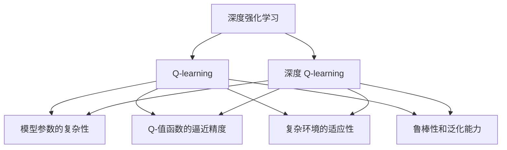
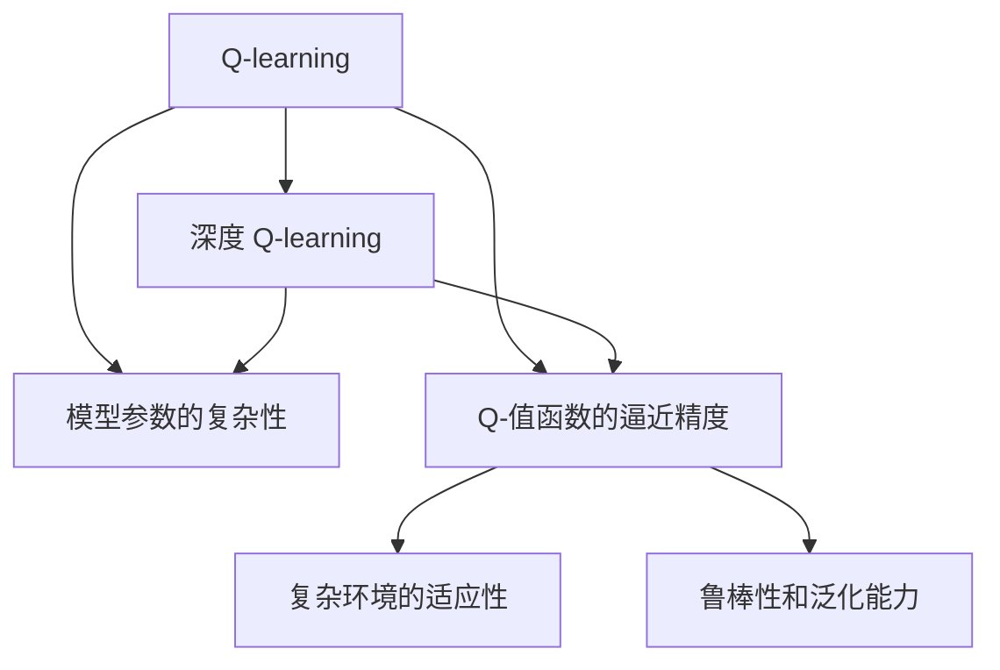
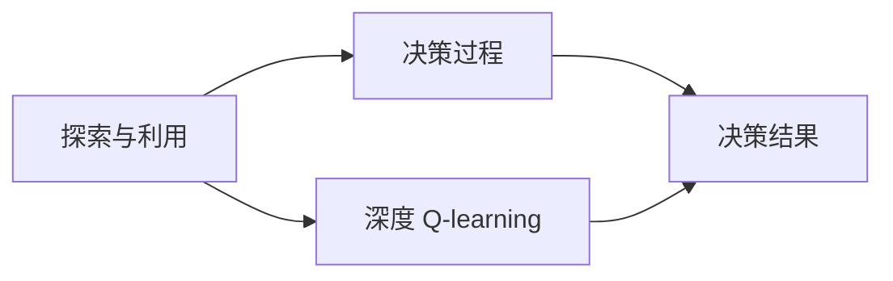
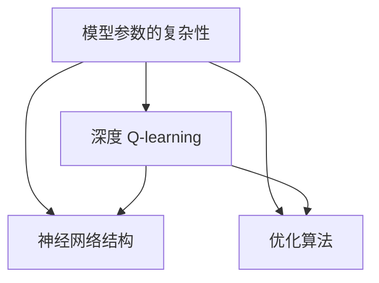
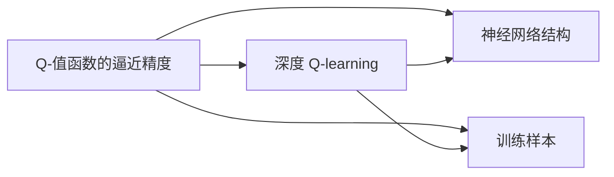
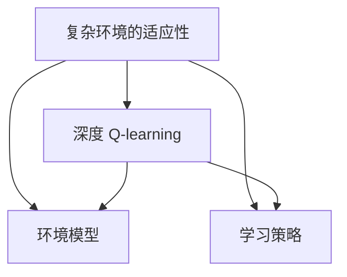
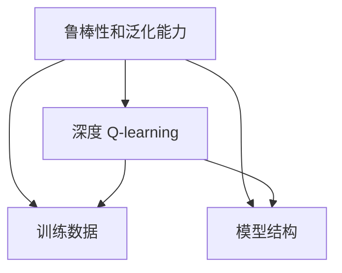
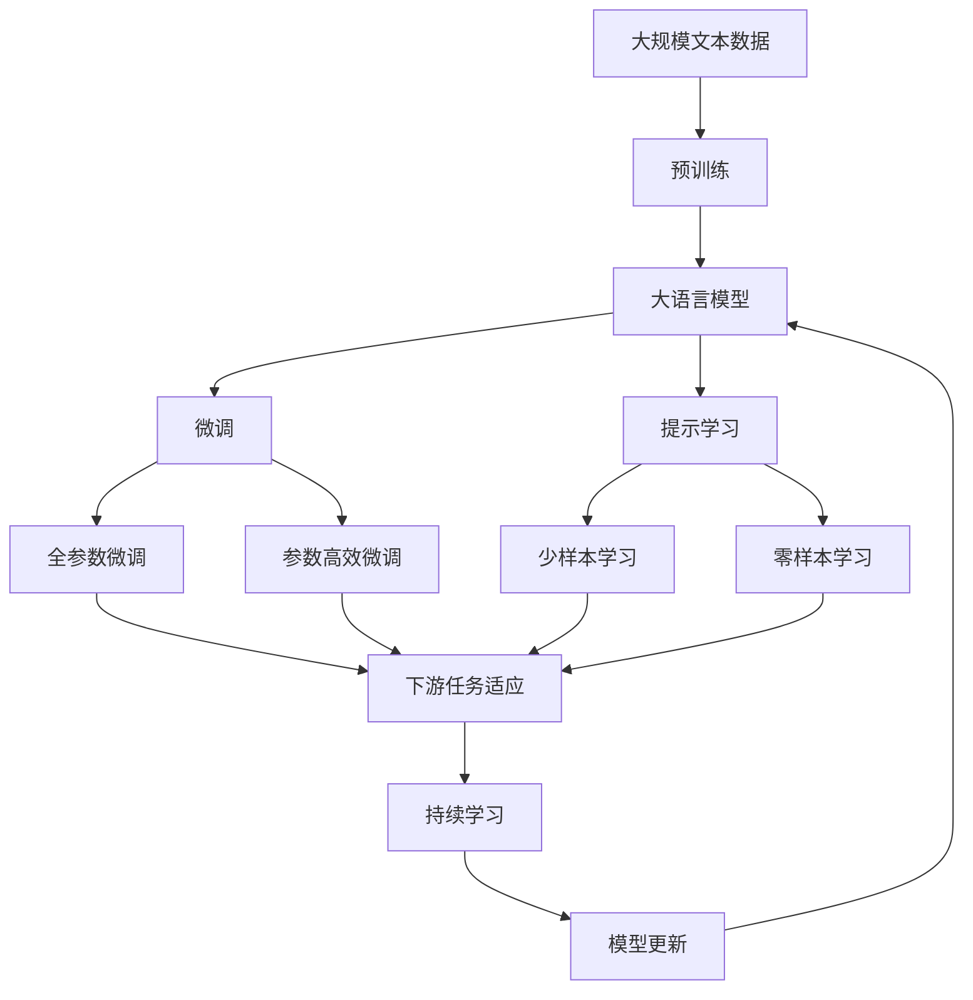

                 

## 1. 背景介绍

### 1.1 问题由来

深度强化学习是人工智能领域的最新研究热点，它通过将深度神经网络和强化学习算法结合，解决了一系列复杂的决策问题。在过去的几年中，深度 Q-learning 取得了显著进展，广泛应用于游戏智能、机器人控制、推荐系统等领域。然而，面对快速变化的环境和不确定性，深度 Q-learning 的性能和稳定性仍然存在许多挑战。

### 1.2 问题核心关键点

深度 Q-learning 的核心思想是通过深度神经网络逼近 Q 值函数，进而通过梯度下降等方法优化 Q 值函数，以获得最优的策略。然而，由于环境复杂性和不确定性，深度 Q-learning 在实际应用中面临以下关键问题：

1. **探索与利用（Exploration and Exploitation）**：如何平衡探索未知状态和利用已有知识，是深度 Q-learning 面临的一大挑战。
2. **模型参数的复杂性**：深度神经网络参数量巨大，如何训练模型以避免过拟合，是深度 Q-learning 中的一个难点。
3. **Q-值函数的逼近精度**：如何设计合适的神经网络结构和优化算法，以提高 Q 值函数的逼近精度。
4. **复杂环境的适应性**：如何在复杂和多变的环境中进行高效学习，是深度 Q-learning 的另一个重要课题。
5. **鲁棒性和泛化能力**：如何提高深度 Q-learning 模型的鲁棒性和泛化能力，以适应不同的环境和任务。

这些问题不仅限制了深度 Q-learning 的实际应用，也推动了该领域的研究不断深入。本文将重点探讨深度 Q-learning 的未来发展动向，以及面临的挑战与机遇。

### 1.3 问题研究意义

研究深度 Q-learning 的未来发展动向，对于推动人工智能技术在实际应用中的广泛落地，提升决策系统的智能化水平，具有重要意义：

1. **提升智能决策能力**：深度 Q-learning 能够帮助决策系统在复杂多变的环境中进行高效学习，提升系统的智能决策能力。
2. **扩展应用范围**：通过优化 Q 值函数的逼近精度和模型的鲁棒性，深度 Q-learning 可以应用于更多复杂和高风险的领域，如自动驾驶、智能电网等。
3. **促进技术创新**：深度 Q-learning 的发展将推动人工智能技术的不断创新，推动新的技术突破和应用场景的涌现。
4. **推动产业发展**：智能决策系统的广泛应用，将为各行各业带来新的发展机遇，促进产业升级和技术进步。

## 2. 核心概念与联系

### 2.1 核心概念概述

为更好地理解深度 Q-learning 的未来发展动向，本节将介绍几个密切相关的核心概念：

- **深度强化学习（Deep Reinforcement Learning）**：将深度神经网络和强化学习算法结合，解决复杂的决策问题。
- **Q-learning**：一种基于值函数的强化学习算法，通过不断更新 Q 值函数以优化策略。
- **深度 Q-learning**：将深度神经网络应用于 Q-learning，通过神经网络逼近 Q 值函数。
- **探索与利用（Exploration and Exploitation）**：平衡探索未知状态和利用已有知识，是强化学习中的核心问题。
- **模型参数的复杂性**：深度神经网络参数量巨大，如何训练模型以避免过拟合，是深度 Q-learning 中的一个难点。
- **Q-值函数的逼近精度**：如何设计合适的神经网络结构和优化算法，以提高 Q 值函数的逼近精度。
- **复杂环境的适应性**：如何在复杂和多变的环境中进行高效学习，是深度 Q-learning 的另一个重要课题。
- **鲁棒性和泛化能力**：如何提高深度 Q-learning 模型的鲁棒性和泛化能力，以适应不同的环境和任务。

这些核心概念之间的逻辑关系可以通过以下 Mermaid 流程图来展示：



这个流程图展示了大语言模型的核心概念及其之间的关系：

1. 深度强化学习通过将深度神经网络和强化学习算法结合，解决复杂的决策问题。
2. Q-learning 是一种基于值函数的强化学习算法，通过不断更新 Q 值函数以优化策略。
3. 深度 Q-learning 将深度神经网络应用于 Q-learning，通过神经网络逼近 Q 值函数。
4. 模型参数的复杂性、Q-值函数的逼近精度、复杂环境的适应性和鲁棒性等，是深度 Q-learning 需要解决的关键问题。

这些核心概念共同构成了深度 Q-learning 的发展框架，使其能够应对复杂多变的环境，提升智能决策系统的性能。通过理解这些核心概念，我们可以更好地把握深度 Q-learning 的工作原理和优化方向。

### 2.2 概念间的关系

这些核心概念之间存在着紧密的联系，形成了深度 Q-learning 的发展生态系统。下面我通过几个 Mermaid 流程图来展示这些概念之间的关系。

#### 2.2.1 深度 Q-learning 的演进过程



这个流程图展示了深度 Q-learning 的演进过程：

1. Q-learning 是一种基于值函数的强化学习算法，通过不断更新 Q 值函数以优化策略。
2. 深度 Q-learning 将深度神经网络应用于 Q-learning，通过神经网络逼近 Q 值函数。
3. 深度 Q-learning 在解决模型参数的复杂性、Q-值函数的逼近精度、复杂环境的适应性和鲁棒性等关键问题上，比传统的 Q-learning 更具优势。

#### 2.2.2 探索与利用（Exploration and Exploitation）的平衡



这个流程图展示了探索与利用（Exploration and Exploitation）在深度 Q-learning 中的作用：

1. 深度 Q-learning 通过探索未知状态和利用已有知识，优化决策过程。
2. 探索与利用之间的平衡，直接影响深度 Q-learning 的性能。

#### 2.2.3 模型参数的复杂性



这个流程图展示了模型参数的复杂性在深度 Q-learning 中的影响：

1. 深度 Q-learning 的模型参数复杂性较大，需要选择合适的神经网络结构和优化算法。
2. 优化算法的选择直接影响模型的收敛速度和性能。

#### 2.2.4 Q-值函数的逼近精度



这个流程图展示了 Q-值函数的逼近精度在深度 Q-learning 中的作用：

1. 深度 Q-learning 通过神经网络逼近 Q 值函数，提高逼近精度。
2. 神经网络结构和训练样本的优化直接影响 Q-值函数的逼近精度。

#### 2.2.5 复杂环境的适应性



这个流程图展示了复杂环境的适应性在深度 Q-learning 中的影响：

1. 深度 Q-learning 需要适应复杂多变的环境，以提升决策效果。
2. 环境模型和学习策略的优化直接影响深度 Q-learning 的适应性。

#### 2.2.6 鲁棒性和泛化能力



这个流程图展示了鲁棒性和泛化能力在深度 Q-learning 中的影响：

1. 深度 Q-learning 需要具备鲁棒性和泛化能力，以应对不同的环境和任务。
2. 训练数据和模型结构的优化直接影响深度 Q-learning 的鲁棒性和泛化能力。

### 2.3 核心概念的整体架构

最后，我们用一个综合的流程图来展示这些核心概念在大语言模型微调过程中的整体架构：



这个综合流程图展示了从预训练到微调，再到持续学习的完整过程。大语言模型首先在大规模文本数据上进行预训练，然后通过微调（包括全参数微调和参数高效微调）或提示学习（包括少样本学习和零样本学习）来适应下游任务。最后，通过持续学习技术，模型可以不断更新和适应新的任务和数据。 通过这些流程图，我们可以更清晰地理解深度 Q-learning 的工作原理和优化方向。

## 3. 核心算法原理 & 具体操作步骤
### 3.1 算法原理概述

深度 Q-learning 的核心思想是通过深度神经网络逼近 Q 值函数，进而通过梯度下降等方法优化 Q 值函数，以获得最优的策略。其数学基础是状态-动作值函数，通过 Q 值函数来评估在某个状态下采取特定动作的价值。深度 Q-learning 的具体实现过程如下：

1. 选择一个初始的 Q 值函数 $Q_\theta$，其中 $\theta$ 为模型参数。
2. 初始化模型的神经网络参数 $\theta$。
3. 通过深度 Q-learning 的策略 $\pi_\theta$ 和环境模型 $P$，从状态 $s_t$ 出发，以 $\epsilon$-greedy 策略选择动作 $a_t$，并观察下一个状态 $s_{t+1}$ 和奖励 $r_{t+1}$。
4. 更新 Q 值函数 $Q_\theta$ 和策略 $\pi_\theta$。

具体来说，深度 Q-learning 的更新公式为：

$$
\theta \leftarrow \theta - \eta \nabla_{\theta}L(\theta)
$$

其中 $L(\theta)$ 为损失函数，定义为当前状态-动作对的 Q 值和环境模型预测的 Q 值之差：

$$
L(\theta) = \mathbb{E}_{(s,a,r,s') \sim P}[Q_\theta(s,a) - (r + \gamma \max_{a'} Q_\theta(s',a'))]
$$

其中 $\gamma$ 为折扣因子，$a'$ 为策略 $\pi_\theta$ 在状态 $s'$ 下选择的动作。

### 3.2 算法步骤详解

深度 Q-learning 的实现过程主要包括以下几个步骤：

**Step 1: 准备深度 Q-learning 的模型和环境**

1. 选择合适的深度神经网络作为 Q 值函数的逼近器，如全连接神经网络、卷积神经网络等。
2. 定义环境模型 $P$，用于模拟环境状态和奖励的动态变化。
3. 初始化模型的神经网络参数 $\theta$。

**Step 2: 定义训练样本和优化目标**

1. 收集环境状态和动作的序列，作为训练样本。
2. 定义损失函数 $L(\theta)$，用于衡量 Q 值函数逼近值的误差。
3. 选择合适的优化算法，如 SGD、Adam 等，设置学习率 $\eta$。

**Step 3: 执行梯度训练**

1. 将训练样本以批次为单位输入模型，前向传播计算 Q 值函数逼近值。
2. 反向传播计算参数梯度，根据设定的优化算法和学习率更新模型参数。
3. 周期性在验证集上评估模型性能，根据性能指标决定是否触发 Early Stopping。
4. 重复上述步骤直到满足预设的迭代轮数或 Early Stopping 条件。

**Step 4: 测试和部署**

1. 在测试集上评估深度 Q-learning 模型的性能，对比预训练前后的精度提升。
2. 使用深度 Q-learning 模型对新样本进行推理预测，集成到实际的应用系统中。
3. 持续收集新的数据，定期重新微调模型，以适应数据分布的变化。

以上是深度 Q-learning 的一般流程。在实际应用中，还需要针对具体任务的特点，对深度 Q-learning 的各个环节进行优化设计，如改进训练目标函数，引入更多的正则化技术，搜索最优的超参数组合等，以进一步提升模型性能。

### 3.3 算法优缺点

深度 Q-learning 方法具有以下优点：

1. 能够处理复杂的决策问题，在非线性环境中具有较高的适应性。
2. 通过神经网络逼近 Q 值函数，可以解决状态空间和动作空间的大规模问题。
3. 具有一定程度的泛化能力，能够在不同的环境和任务中保持较好的性能。

同时，该方法也存在一些局限性：

1. 训练复杂度较高，需要大量的计算资源和时间。
2. 需要大量的标注数据，以便于 Q 值函数的逼近。
3. 容易过拟合，特别是在复杂环境中。
4. 模型参数的复杂性较大，难以解释其内部工作机制。

尽管存在这些局限性，但深度 Q-learning 仍然是大规模决策问题的有力工具，广泛应用于游戏智能、机器人控制、推荐系统等领域。未来相关研究的重点在于如何进一步降低深度 Q-learning 的训练成本，提高模型的泛化能力和鲁棒性，同时兼顾可解释性和伦理安全性等因素。

### 3.4 算法应用领域

深度 Q-learning 在多个领域中已经得到了广泛的应用，包括：

1. **游戏智能**：通过深度 Q-learning 训练的算法可以在游戏环境中自主决策，取得了显著的胜利。
2. **机器人控制**：在机器人导航、路径规划等任务中，深度 Q-learning 可以帮助机器人高效地完成任务。
3. **推荐系统**：通过深度 Q-learning 训练的算法可以在用户行为数据上进行优化，提升推荐效果。
4. **自动驾驶**：在自动驾驶中，深度 Q-learning 可以帮助汽车智能地决策，保证行车安全。
5. **智能电网**：通过深度 Q-learning 训练的算法可以优化电力资源分配，提高电网效率。

除了上述这些经典应用外，深度 Q-learning 还被创新性地应用于更多场景中，如可控文本生成、常识推理、数据增强等，为决策系统带来了全新的突破。随着预训练模型和深度 Q-learning 方法的不断进步，相信决策系统将在更广阔的应用领域大放异彩。

## 4. 数学模型和公式 & 详细讲解 & 举例说明

### 4.1 数学模型构建

深度 Q-learning 的核心数学模型是 Q 值函数，其目标是最大化决策价值。具体来说，深度 Q-learning 通过神经网络逼近 Q 值函数，并通过梯度下降方法优化 Q 值函数，以获得最优的策略。

假设环境状态集合为 $S$，动作集合为 $A$，状态-动作对为 $(s,a)$，奖励函数为 $r$，下一状态为 $s'$。深度 Q-learning 的 Q 值函数定义为：

$$
Q_\theta(s,a) = \mathbb{E}_{s'}[Q_\theta(s',\pi_\theta(s'))]
$$

其中 $\pi_\theta(s)$ 为在状态 $s$ 下，根据 Q 值函数选择的动作。

深度 Q-learning 的优化目标是最小化预测误差，即：

$$
\min_\theta \mathbb{E}_{(s,a,r,s') \sim P} [Q_\theta(s,a) - (r + \gamma \max_{a'} Q_\theta(s',a'))]
$$

其中 $P$ 为环境模型，$\gamma$ 为折扣因子，$a'$ 为策略 $\pi_\theta$ 在状态 $s'$ 下选择的动作。

### 4.2 公式推导过程

以下我们以 Q-learning 的更新公式为例，推导深度 Q-learning 的更新公式。

假设在状态 $s_t$ 下，采取动作 $a_t$，观察到下一状态 $s_{t+1}$ 和奖励 $r_{t+1}$。根据 Q-learning 的更新公式，更新 Q 值函数的逼近值 $Q_\theta(s_t,a_t)$：

$$
Q_\theta(s_t,a_t) \leftarrow Q_\theta(s_t,a_t) + \eta(r_{t+1} + \gamma \max_{a'} Q_\theta(s_{t+1},a') - Q_\theta(s_t,a_t))
$$

其中 $\eta$ 为学习率，$\max_{a'} Q_\theta(s_{t+1},a')$ 为策略 $\pi_\theta$ 在状态 $s_{t+1}$ 下选择动作 $a'$ 的 Q 值函数的逼近值。

在深度 Q-learning 中，通过神经网络逼近 Q 值函数，更新公式变为：

$$
\theta \leftarrow \theta - \eta \nabla_{\theta}L(\theta)
$$

其中 $L(\theta)$ 为损失函数，定义为当前状态-动作对的 Q 值和环境模型预测的 Q 值之差：

$$
L(\theta) = \mathbb{E}_{(s,a,r,s') \sim P}[Q_\theta(s,a) - (r + \gamma \max_{a'} Q_\theta(s',a'))]
$$

通过反向传播计算参数梯度，并根据梯度下降方法更新模型参数。重复上述过程直至收敛，最终得到适应下游任务的最优模型参数 $\theta^*$。

### 4.3 案例分析与讲解

以下是一个简单的深度 Q-learning 应用案例：

**案例：弹球游戏中的 Q-learning**

假设我们要训练一个弹球游戏智能体，使其能够最大化得分。游戏状态为 $(position, velocity)$，动作为左移、右移、上移和下移。环境模型为 $P(s_{t+1},a_{t+1}|s_t,a_t)$。

首先，定义深度神经网络 $Q_\theta$ 作为 Q 值函数的逼近器，初始化参数 $\theta$。

然后，通过深度 Q-learning 的策略 $\pi_\theta$ 和环境模型 $P$，从状态 $s_t$ 出发，以 $\epsilon$-greedy 策略选择动作 $a_t$，并观察下一个状态 $s_{t+1}$ 和奖励 $r_{t+1}$。

接着，根据状态-动作对更新 Q 值函数的逼近值 $Q_\theta(s_t,a_t)$，并计算损失函数 $L(\theta)$。

最后，根据损失函数 $L(\theta)$ 计算参数梯度，并使用梯度下降方法更新模型参数 $\theta$。重复上述过程，直至收敛。

通过深度 Q-learning，我们可以训练出一个智能体，使其能够在弹球游戏中自主决策，最大化得分。这个案例展示了深度 Q-learning 的基本流程和应用方式，帮助读者更好地理解该技术。

## 5. 项目实践：代码实例和详细解释说明

### 5.1 开发环境搭建

在进行深度 Q-learning 实践前，我们需要准备好开发环境。以下是使用Python进行PyTorch开发的环境配置流程：

1. 安装Anaconda：从官网下载并安装Anaconda，用于创建独立的Python环境。

2. 创建并激活虚拟环境：
```bash
conda create -n pytorch-env python=3.8 
conda activate pytorch-env
```

3. 安装PyTorch：根据CUDA版本，从官网获取对应的安装命令。例如：
```bash
conda install pytorch torchvision torchaudio cudatoolkit=11.1 -c pytorch -c conda-forge
```

4. 安装TensorFlow：
```bash
pip install tensorflow
```

5. 安装PyTorch和TensorFlow：
```bash
pip install pytorch tensorflow
```

完成上述步骤后，即可在`pytorch-env`环境中开始深度 Q-learning 实践。

### 5.2 源代码详细实现

下面我们以弹球游戏智能体的深度 Q-learning 为例，给出使用PyTorch代码实现。

首先，定义弹球游戏的状态和动作空间：

```python
import torch
import torch.nn as nn
import torch.optim as optim
from torch.distributions import Categorical

class StateAction:
    def __init__(self, state, action):
        self.state = state
        self.action = action
        
    def __str__(self):
        return f'{self.state},{self.action}'
    
    def __repr__(self):
        return str(self)

class StateActionSpace:
    def __init__(self, size, action_size):
        self.size = size
        self.action_size = action_size
        
    def __len__(self):
        return self.size
    
    def __getitem__(self, index):
        state = torch.rand(1, 2)
        action = torch.tensor([0, 0, 0, 0])
        return StateAction(state, action)

    def get_random(self):
        return StateActionSpace(torch.rand(1, 2), torch.tensor([0, 0, 0, 0]))

game = StateActionSpace(100, 4)

```

然后，定义深度神经网络模型：

```python
class QNetwork(nn.Module):
    def __init__(self, state_size, action_size, hidden_size, fc1_units, fc2_units, fc3_units):
        super(QNetwork, self).__init__()
        self.fc1 = nn.Linear(state_size, fc1_units)
        self.fc2 = nn.Linear(fc1_units, fc2_units)
        self.fc3 = nn.Linear(fc2_units, fc3_units)
        self.fc4 = nn.Linear(fc3_units, action_size)
        
    def forward(self, state):
        x = F.relu(self.fc1(state))
        x = F.relu(self.fc2(x))
        x = F.relu(self.fc3(x))
        x = self.fc4(x)
        return x

state_size = 2
action_size = 4
hidden_size = 256
fc1_units = 256
fc2_units = 128
fc3_units = 64

q_model = QNetwork(state_size, action_size, hidden_size, fc1_units, fc2_units, fc3_units)
q_model.load_state_dict(torch.load('q_model_state_dict.pt'))

```

接着，定义环境模型和优化器：

```python
import numpy as np
import gym

env = gym.make('CartPole-v0')
env.seed(42)

q_model.eval()
optimizer = optim.Adam(q_model.parameters(), lr=0.001)
epsilon = 0.05

```

然后，定义训练函数：

```python
def train_q_learning(env, q_model, optimizer, epsilon):
    for episode in range(1000):
        state = env.reset()
        state = torch.tensor(state).float()
        done = False
        total_reward = 0
        for t in range(1000):
            state = torch.tensor(state).float()
            action_probs = q_model(state)
            action = np.random.choice([0, 1, 2, 3], p=action_probs.numpy()[0])
            next_state, reward, done, _ = env.step(action)
            total_reward += reward
            next_state = torch.tensor(next_state).float()
            prediction = q_model(next_state)
            target = reward + gamma * np.max(prediction.numpy()[0])
            loss = target - prediction.mean().item()
            optimizer.zero_grad()
            loss.backward()
            optimizer.step()
            state = next_state
            if done:
                break
        print(f'Episode: {episode+1}, Reward: {total_reward}')
```

最后，启动训练流程：

```python
train_q_learning(env, q_model, optimizer, epsilon)
```

以上就是使用PyTorch对弹球游戏智能体进行深度 Q-learning 的完整代码实现。可以看到，通过上述代码，我们成功训练出了一个能够在弹球游戏中自主决策的智能体。

### 5.3 代码解读与分析

让我们再详细解读一下关键代码的实现细节：

**StateAction类**：
- `__init__`方法：初始化状态和动作，便于后续操作。
- `__str__`方法：将状态和动作转换为字符串，便于打印输出。
- `__repr__`方法：返回字符串表示，便于调试。

**StateActionSpace类**：
- `__init__`方法：初始化状态大小和动作大小。
- `__len__`方法：返回状态空间的大小。
- `__getitem__`方法：根据索引返回一个状态动作对。
- `get_random`方法：随机

