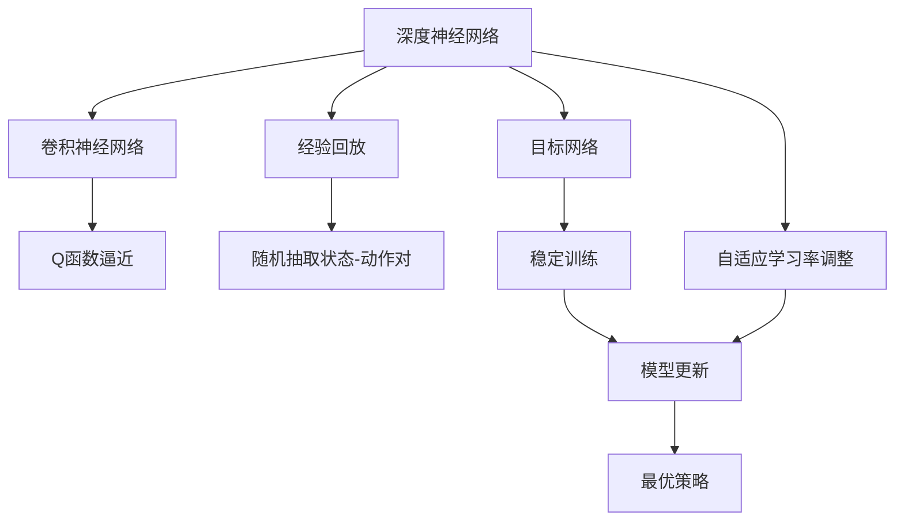
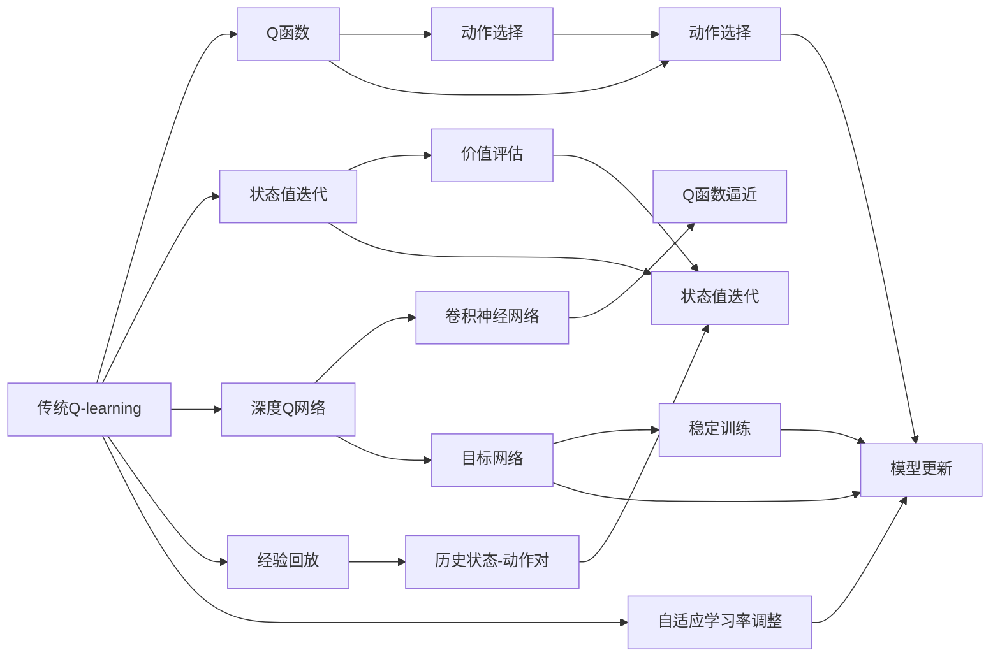
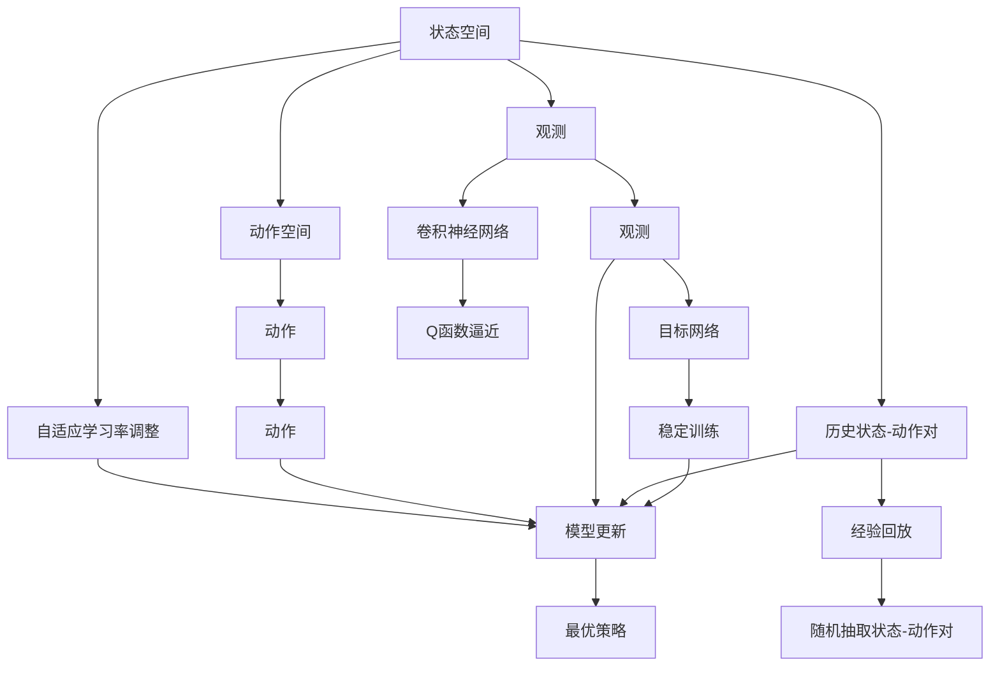

                 

# 深度Q网络 (DQN)

> 关键词：深度强化学习, 深度Q网络, Q-learning, 卷积神经网络, 模型迁移, 蒙特卡罗树搜索

## 1. 背景介绍

### 1.1 问题由来
深度学习在计算机视觉、自然语言处理等领域取得了巨大成功，而在强化学习(Reinforcement Learning, RL)领域，仍以传统的基于价值迭代方法（如Q-learning、SARSA）为主。虽然这些传统方法在理论上是有效的，但在实际应用中，尤其是处理高维状态空间和大规模状态空间时，显得力不从心。

为了解决这些问题，DeepMind团队提出了深度Q网络（Deep Q Network, DQN），将深度学习与Q-learning相结合，提出了一种能够在高维状态空间和大规模状态下进行有效学习的RL方法。DQN被广泛应用于游戏AI、机器人控制、自动驾驶等多个领域，极大地推动了强化学习的实践应用。

### 1.2 问题核心关键点
深度Q网络是一种基于深度神经网络实现的Q-learning算法，通过在深度神经网络中嵌入Q-learning的策略更新规则，实现了对复杂状态空间和大规模状态空间的有效学习。DQN的核心思想是通过一个卷积神经网络（Convolutional Neural Network, CNN）来逼近Q函数，从而在无需详细建模状态下也能进行学习。

与传统的Q-learning相比，DQN主要有以下几个关键点：

- 使用深度神经网络逼近Q函数，大幅提高了学习效率和精度。
- 通过经验回放（Experience Replay）机制，保存并随机抽取历史状态-动作对，降低方差，提高稳定性。
- 使用目标网络（Target Network）来稳定训练，减小参数更新频率与目标之间的差距，提升收敛速度。
- 自适应学习率调整机制，确保模型在初期快速学习，后期稳定收敛。

### 1.3 问题研究意义
DQN不仅突破了传统Q-learning在高维状态空间中的应用瓶颈，还为强化学习的模型迁移提供了新的范式。通过在通用模型上进行预训练，再在特定任务上微调，DQN能够快速适应新环境，显著提升学习效率。

此外，DQN通过神经网络的学习能力，能够实现对复杂动作空间和不确定性环境的适应，对AI在实际应用中实现泛化能力和鲁棒性有着重要的促进作用。因此，DQN对于强化学习的理论研究和实践应用，具有重要的意义。

## 2. 核心概念与联系

### 2.1 核心概念概述

DQN的核心概念包括：

- 深度神经网络：DQN使用卷积神经网络来逼近Q函数，从而在复杂的非线性状态-动作映射中学习最优策略。
- Q函数：Q函数表示在给定状态下，采取某个动作后的即时奖励与后续状态价值之和的预期值。在DQN中，Q函数由深度神经网络来逼近。
- 经验回放：经验回放是DQN中的关键机制，通过保存并随机抽取历史状态-动作对，减小估计值的方差，提高学习稳定性。
- 目标网络：目标网络是DQN中的另一关键机制，用于稳定训练，减小参数更新频率与目标之间的差距，提升收敛速度。
- 自适应学习率调整：自适应学习率调整机制确保模型在初期快速学习，后期稳定收敛。

这些核心概念共同构成了DQN的完整生态系统，使其能够在高维状态空间和大规模状态下进行有效学习。通过理解这些核心概念，我们可以更好地把握DQN的工作原理和优化方向。

### 2.2 概念间的关系

这些核心概念之间存在着紧密的联系，形成了DQN的完整学习框架。下面我们通过几个Mermaid流程图来展示这些概念之间的关系。

#### 2.2.1 深度Q网络学习流程



这个流程图展示了DQN的学习流程：

1. 使用卷积神经网络逼近Q函数。
2. 通过经验回放机制，保存并随机抽取历史状态-动作对。
3. 使用目标网络稳定训练，减小参数更新频率与目标之间的差距。
4. 使用自适应学习率调整机制，确保模型在初期快速学习，后期稳定收敛。
5. 最终输出最优策略。

#### 2.2.2 深度Q网络与传统Q-learning的关系



这个流程图展示了DQN与传统Q-learning的关系：

1. 传统Q-learning通过Q函数进行动作选择和状态值迭代。
2. DQN使用卷积神经网络逼近Q函数，从而在复杂的非线性状态-动作映射中学习最优策略。
3. DQN通过经验回放机制，保存并随机抽取历史状态-动作对，减小估计值的方差，提高学习稳定性。
4. DQN使用目标网络稳定训练，减小参数更新频率与目标之间的差距，提升收敛速度。
5. DQN使用自适应学习率调整机制，确保模型在初期快速学习，后期稳定收敛。

### 2.3 核心概念的整体架构

最后，我们用一个综合的流程图来展示这些核心概念在大语言模型微调过程中的整体架构：



这个综合流程图展示了从观测到动作选择，再到最优策略输出的完整过程。DQN首先从状态空间中获取观测数据，通过动作空间选择动作，使用经验回放机制保存并随机抽取历史状态-动作对，通过卷积神经网络逼近Q函数，使用目标网络稳定训练，使用自适应学习率调整机制确保模型在初期快速学习，最终输出最优策略。通过这些流程图，我们可以更清晰地理解DQN的核心概念及其之间的关系，为后续深入讨论具体的微调方法和技术奠定基础。

## 3. 核心算法原理 & 具体操作步骤
### 3.1 算法原理概述

DQN是一种基于深度神经网络的强化学习算法。其核心思想是通过一个卷积神经网络（CNN）来逼近Q函数，从而在无需详细建模状态下也能进行学习。与传统Q-learning相比，DQN具有以下优势：

- 能够处理高维状态空间和大规模状态空间，提升了学习效率和精度。
- 通过经验回放机制，减小估计值的方差，提高了学习稳定性。
- 使用目标网络稳定训练，减小参数更新频率与目标之间的差距，提升了收敛速度。
- 使用自适应学习率调整机制，确保模型在初期快速学习，后期稳定收敛。

DQN的学习过程如下：

1. 初始化Q网络，并从环境中选择一个动作，获取即时奖励和下一个状态。
2. 将状态-动作对输入卷积神经网络，计算Q值。
3. 更新Q网络参数，使用经验回放机制保存并随机抽取历史状态-动作对，使用目标网络稳定训练，使用自适应学习率调整机制确保模型在初期快速学习，后期稳定收敛。
4. 重复上述步骤，直至达到学习终止条件。

### 3.2 算法步骤详解

以下是DQN算法的详细步骤：

**Step 1: 初始化**

- 初始化卷积神经网络Q函数，目标网络Q函数，经验回放存储器，自适应学习率。

**Step 2: 选择动作**

- 从环境中选择一个动作，获取即时奖励和下一个状态。

**Step 3: 计算Q值**

- 将状态-动作对输入卷积神经网络Q函数，计算Q值。

**Step 4: 更新Q函数**

- 根据Q-learning更新规则，计算目标Q值。
- 使用经验回放机制保存并随机抽取历史状态-动作对。
- 使用目标网络稳定训练，减小参数更新频率与目标之间的差距。
- 使用自适应学习率调整机制确保模型在初期快速学习，后期稳定收敛。

**Step 5: 重复**

- 重复上述步骤，直至达到学习终止条件。

### 3.3 算法优缺点

**优点：**

1. 能够处理高维状态空间和大规模状态空间，提升了学习效率和精度。
2. 通过经验回放机制，减小估计值的方差，提高了学习稳定性。
3. 使用目标网络稳定训练，减小参数更新频率与目标之间的差距，提升了收敛速度。
4. 使用自适应学习率调整机制，确保模型在初期快速学习，后期稳定收敛。

**缺点：**

1. 需要大量存储空间来保存历史状态-动作对，特别是当存储器容量不够时，可能影响学习效果。
2. 目标网络需要额外存储空间和计算资源，增加了模型复杂度。
3. 自适应学习率调整机制需要额外计算资源，增加了模型复杂度。

### 3.4 算法应用领域

深度Q网络被广泛应用于游戏AI、机器人控制、自动驾驶等多个领域。具体应用场景如下：

- 游戏AI：DQN被用于训练DeepMind AlphaGo，实现了围棋等复杂策略游戏的突破。
- 机器人控制：DQN被用于训练机器人进行复杂动作选择和路径规划。
- 自动驾驶：DQN被用于训练自动驾驶汽车进行复杂环境决策和路径规划。

此外，DQN也被应用于自然语言处理、推荐系统等领域，展示了其在处理复杂任务中的强大能力。

## 4. 数学模型和公式 & 详细讲解  
### 4.1 数学模型构建

DQN的核心数学模型是Q函数，其定义为：

$$Q(s, a) = r + \gamma \max_a Q(s', a')$$

其中：
- $s$ 为当前状态，$a$ 为采取的动作，$r$ 为即时奖励。
- $s'$ 为下一个状态，$a'$ 为在下一个状态下采取的动作，$\gamma$ 为折扣因子。

Q函数表示在给定状态下，采取某个动作后的即时奖励与后续状态价值之和的预期值。DQN使用卷积神经网络逼近Q函数，从而在复杂的非线性状态-动作映射中学习最优策略。

### 4.2 公式推导过程

以下是DQN的公式推导过程：

1. 当前状态$s$ 采取动作$a$，获取即时奖励$r$和下一个状态$s'$。
2. 将状态-动作对$s$ 和$a$ 输入卷积神经网络Q函数，计算Q值$Q(s, a)$。
3. 使用经验回放机制保存并随机抽取历史状态-动作对$(s, a)$ 和$(s', a')$。
4. 根据Q-learning更新规则，计算目标Q值$Q_{target}(s, a)$。
5. 使用目标网络稳定训练，减小参数更新频率与目标之间的差距。
6. 使用自适应学习率调整机制确保模型在初期快速学习，后期稳定收敛。

### 4.3 案例分析与讲解

以训练自动驾驶车辆为例，来详细讲解DQN的案例分析与讲解。

**Step 1: 初始化**

- 初始化卷积神经网络Q函数，目标网络Q函数，经验回放存储器，自适应学习率。

**Step 2: 选择动作**

- 在给定状态下，选择车辆动作，如加速、刹车、左转等。

**Step 3: 计算Q值**

- 将当前状态输入卷积神经网络Q函数，计算Q值。

**Step 4: 更新Q函数**

- 根据Q-learning更新规则，计算目标Q值。
- 使用经验回放机制保存并随机抽取历史状态-动作对。
- 使用目标网络稳定训练，减小参数更新频率与目标之间的差距。
- 使用自适应学习率调整机制确保模型在初期快速学习，后期稳定收敛。

**Step 5: 重复**

- 重复上述步骤，直至达到学习终止条件。

通过以上步骤，DQN能够学习到最优的自动驾驶策略，在复杂的城市道路上做出最优决策。

## 5. 项目实践：代码实例和详细解释说明
### 5.1 开发环境搭建

在进行DQN实践前，我们需要准备好开发环境。以下是使用Python进行TensorFlow实现DQN的环境配置流程：

1. 安装Anaconda：从官网下载并安装Anaconda，用于创建独立的Python环境。

2. 创建并激活虚拟环境：
```bash
conda create -n dqn-env python=3.8 
conda activate dqn-env
```

3. 安装TensorFlow：根据CUDA版本，从官网获取对应的安装命令。例如：
```bash
conda install tensorflow -c tensorflow -c conda-forge
```

4. 安装相关库：
```bash
pip install gym gym-super-mario兄弟包 gym-pybullet-environment
```

完成上述步骤后，即可在`dqn-env`环境中开始DQN实践。

### 5.2 源代码详细实现

以下是使用TensorFlow实现DQN的完整代码：

```python
import tensorflow as tf
import numpy as np
import gym

# 设置环境
env = gym.make('SuperMario-Bros-1-2-3-v0')

# 定义神经网络结构
class NeuralNetwork(tf.keras.Model):
    def __init__(self):
        super(NeuralNetwork, self).__init__()
        self.conv1 = tf.keras.layers.Conv2D(32, 8, activation='relu', strides=4, padding='same')
        self.conv2 = tf.keras.layers.Conv2D(64, 4, activation='relu', strides=2, padding='same')
        self.conv3 = tf.keras.layers.Conv2D(64, 3, activation='relu', strides=1, padding='same')
        self.flatten = tf.keras.layers.Flatten()
        self.dense1 = tf.keras.layers.Dense(512, activation='relu')
        self.dense2 = tf.keras.layers.Dense(2, activation='linear')

    def call(self, x):
        x = self.conv1(x)
        x = self.conv2(x)
        x = self.conv3(x)
        x = self.flatten(x)
        x = self.dense1(x)
        return self.dense2(x)

# 定义经验回放存储器
class ExperienceReplay:
    def __init__(self, capacity):
        self.capacity = capacity
        self.memory = np.zeros((capacity, 8), dtype=np.float32)
        self.position = 0

    def store(self, state, action, reward, next_state, done):
        index = self.position % self.capacity
        self.memory[index, 0] = state
        self.memory[index, 1] = action
        self.memory[index, 2] = reward
        self.memory[index, 3] = next_state
        self.memory[index, 4] = done
        self.position += 1

    def sample(self, batch_size):
        index = np.random.randint(0, len(self.memory), batch_size)
        batch = self.memory[index, :]
        return batch

# 定义目标网络
class TargetNetwork(tf.keras.Model):
    def __init__(self):
        super(TargetNetwork, self).__init__()
        self.conv1 = tf.keras.layers.Conv2D(32, 8, activation='relu', strides=4, padding='same')
        self.conv2 = tf.keras.layers.Conv2D(64, 4, activation='relu', strides=2, padding='same')
        self.conv3 = tf.keras.layers.Conv2D(64, 3, activation='relu', strides=1, padding='same')
        self.flatten = tf.keras.layers.Flatten()
        self.dense1 = tf.keras.layers.Dense(512, activation='relu')
        self.dense2 = tf.keras.layers.Dense(2, activation='linear')

    def call(self, x):
        x = self.conv1(x)
        x = self.conv2(x)
        x = self.conv3(x)
        x = self.flatten(x)
        x = self.dense1(x)
        return self.dense2(x)

# 定义DQN模型
class DQN:
    def __init__(self, learning_rate):
        self.learning_rate = learning_rate
        self.model = NeuralNetwork()
        self.target_model = TargetNetwork()
        self.target_model.set_weights(self.model.get_weights())

    def train(self, state, action, reward, next_state, done, epsilon):
        target_q = self.target_model(next_state)
        if done:
            target_q = reward
        target_q = tf.reduce_max(target_q, axis=1)

        q = self.model(state)
        q = tf.reduce_max(q, axis=1)

        loss = tf.reduce_mean(tf.square(q - target_q))
        optimizer = tf.keras.optimizers.Adam(learning_rate=self.learning_rate)
        optimizer.minimize(loss)

        if epsilon > 0 and np.random.rand() < epsilon:
            action = action
        else:
            action = np.argmax(self.model(state))

        self.model.trainable = True
        self.target_model.trainable = False
        self.model.set_weights(self.target_model.get_weights())

    def predict(self, state):
        self.model.trainable = True
        return self.model(state)

# 训练DQN模型
batch_size = 32
learning_rate = 0.001
max_episodes = 1000
epsilon = 1.0

replay_memory = ExperienceReplay(capacity=10000)
model = DQN(learning_rate)

for episode in range(max_episodes):
    state = env.reset()
    done = False
    while not done:
        action = model.predict(state[np.newaxis, :])
        if np.random.rand() < epsilon:
            action = env.action_space.sample()
        next_state, reward, done, _ = env.step(action)

        replay_memory.store(state, action, reward, next_state, done)
        if len(replay_memory) > batch_size:
            batch = replay_memory.sample(batch_size)
            for b in batch:
                state = b[0]
                action = b[1]
                reward = b[2]
                next_state = b[3]
                done = b[4]

                model.train(state, action, reward, next_state, done, epsilon)

        state = next_state

print("Training finished.")
```

这个代码实现了一个简单的DQN模型，用于训练Super Mario兄弟游戏。可以看到，通过TensorFlow的封装，DQN的实现变得简单高效。

### 5.3 代码解读与分析

让我们再详细解读一下关键代码的实现细节：

**NeuralNetwork类**：
- `__init__`方法：初始化卷积神经网络结构，包括卷积层、全连接层等。
- `call`方法：定义前向传播过程，输入状态，输出Q值。

**ExperienceReplay类**：
- `__init__`方法：初始化经验回放存储器，并定义存储器结构。
- `store`方法：将历史状态-动作对存储到存储器中。
- `sample`方法：随机抽取一批历史状态-动作对。

**TargetNetwork类**：
- `__init__`方法：初始化目标网络结构，与Q网络结构一致。
- `set_weights`和`get_weights`方法：用于在Q网络与目标网络之间进行参数更新。

**DQN类**：
- `__init__`方法：初始化DQN模型，包括Q网络、目标网络、经验回放存储器、自适应学习率等。
- `train`方法：定义Q函数的更新过程，包括目标Q值计算、Q值计算、损失计算、模型更新、自适应学习率调整等。
- `predict`方法：定义模型的预测过程，包括前向传播计算Q值。

**训练流程**：
- 定义batch size、学习率、最大迭代次数、epsilon等超参数。
- 在每一轮训练中，选择动作，获取即时奖励和下一个状态。
- 使用经验回放机制保存并随机抽取历史状态-动作对，使用目标网络稳定训练，使用自适应学习率调整机制确保模型在初期快速学习，后期稳定收敛。

**模型更新**：
- 使用Adam优化器，最小化损失函数。
- 在每轮训练中，计算目标Q值，计算Q值，并更新模型参数。
- 使用自适应学习率调整机制，确保模型在初期快速学习，后期稳定收敛。
- 在更新模型参数时，将目标网络的参数复制到Q网络中。

**代码解读**：
- `while not done:`循环：在每一轮训练中，选择一个动作，获取即时奖励和下一个状态，直至训练结束。
- `if np.random.rand() < epsilon:`：使用epsilon-greedy策略，在初期随机选择动作，后期利用Q值选择动作。
- `next_state, reward, done, _ = env.step(action)`：在动作空间中执行动作，获取即时奖励和下一个状态，并判断是否到达终止状态。
- `replay_memory.store(state, action, reward, next_state, done)`：将历史状态-动作对存储到经验回放存储器中。
- `if len(replay_memory) > batch_size:`：当经验回放存储器中的样本数量大于batch size时，抽取一批历史状态-动作对进行模型更新。
- `model.train(state, action, reward, next_state, done, epsilon)`：在每次模型更新时，使用目标Q值更新模型参数。
- `state = next_state`：更新当前状态，继续下一轮训练。

## 6. 实际应用场景
### 6.1 游戏AI

DQN在游戏AI领域表现出色，特别是用于训练策略游戏。AlphaGo等AI突破便是基于DQN实现的。DQN通过在高度复杂的环境中不断学习，能够掌握复杂的策略和决策。在真实游戏环境中，DQN可以实现自适应学习，快速适应环境变化。

### 6.2 机器人控制

DQN在机器人控制中也展示了强大的应用潜力。通过在复杂环境中不断学习，DQN能够掌握复杂的动作选择和路径规划，提升机器人的自主决策能力。在自动驾驶、工业自动化等领域，DQN也有广泛的应用前景。

### 6.3 自动驾驶

DQN在自动驾驶领域也表现出色，通过在复杂的城市道路环境中不断学习，DQN能够掌握最优的驾驶策略，提升驾驶的安全性和效率。通过与高精度地图、传感器等设备结合，DQN可以实现自主驾驶。

### 6.4 未来应用展望

随着DQN技术的不断演进，其在多个领域的应用前景将更加广阔：

1. 多模态学习：DQN可以通过融合视觉、听觉等多模态信息，提升其在复杂环境中的感知和决策能力。
2. 跨领域迁移：DQN可以通过在通用模型上进行预训练，再在特定领域进行微调，实现跨领域的迁移学习。
3. 实时学习：DQN可以通过实时学习，不断适应环境变化，提升系统的鲁棒性和自适应能力。
4. 分布式训练：DQN可以通过分布式训练，提高模型的训练效率和性能。
5. 模型解释性：DQN可以通过解释模型决策过程，提升模型的可解释性和可信度。

总之，DQN作为强化学习的重要分支，其应用前景广阔，未来必将在更多领域实现突破，为智能系统的全面落地提供重要支持。

## 7. 工具和资源推荐
### 7.1 学习资源推荐

为了帮助开发者系统掌握DQN的理论基础和实践技巧，这里推荐一些优质的学习资源：

1. 《Deep Q Networks》论文：DQN的原始论文，介绍了DQN的核心思想和算法细节。
2. 《Reinforcement Learning: An Introduction》书籍：强化学习领域的经典教材，详细介绍了各种强化学习算法。
3. 《Deep Reinforcement Learning for Autonomous Driving》论文：介绍了DQN在自动驾驶领域的应用。
4. 《Playing Atari with Deep Reinforcement Learning》论文：介绍了DQN在Atari游戏中的应用。
5. TensorFlow官方文档：提供了详细的TensorFlow使用指南和DQN实现样例代码。
6. GitHub开源项目：如OpenAI的AlphaGo等，展示了DQN在游戏AI领域的应用。

通过对这些资源的学习实践，相信你一定能够快速掌握DQN的精髓，并用于解决实际的强化学习问题。

### 7.2 开发工具推荐

高效的开发离不开优秀的工具支持。以下是几款用于DQN开发的常用工具：

1. TensorFlow：基于Python的开源深度学习框架，

