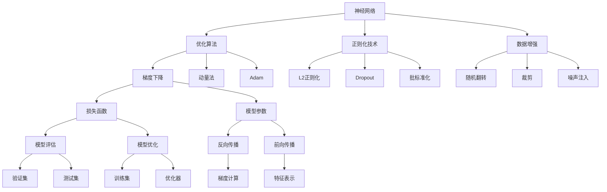
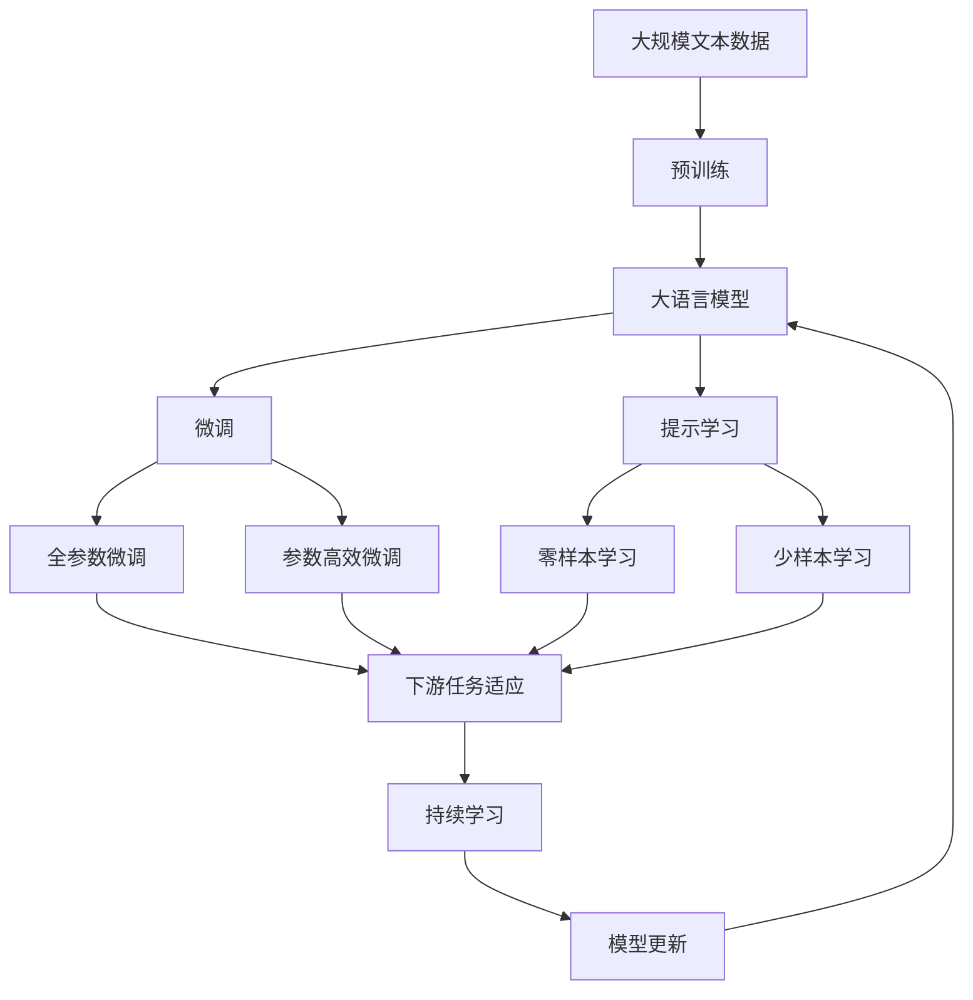

                 

# 深度学习 原理与代码实例讲解

## 1. 背景介绍

### 1.1 问题由来
深度学习（Deep Learning, DL）作为当今人工智能（AI）领域的核心技术之一，近年来取得了显著的进步和应用，尤其在计算机视觉（CV）、自然语言处理（NLP）、语音识别等领域。深度学习的核心在于构建深层神经网络模型，通过多层次的非线性变换，自动学习输入数据的特征表示。深度学习已经在图像分类、目标检测、语音识别、机器翻译、自然语言生成等诸多领域实现了突破性进展，成为推动人工智能技术发展的重要引擎。

然而，深度学习的复杂性和计算需求也给其应用带来了挑战。首先，深层神经网络的参数数量庞大，训练成本高，需要高性能计算资源和大量标注数据。其次，深度学习模型的可解释性较差，黑盒特征表示难以理解和调试。最后，深度学习模型在迁移学习、多模态学习、对抗性鲁棒性等方面的研究仍需进一步突破。

本文旨在通过原理讲解和代码实例，帮助读者系统理解深度学习的核心概念和技术细节，掌握深度学习模型开发和优化的关键方法。

### 1.2 问题核心关键点
深度学习模型主要分为卷积神经网络（Convolutional Neural Network, CNN）、循环神经网络（Recurrent Neural Network, RNN）和变分自编码器（Variational Autoencoder, VAE）等类型。这些模型通过不同形式的非线性变换，从原始数据中学习抽象特征，用于下游任务。深度学习的关键点包括：

- 神经网络结构：网络层次、连接方式、激活函数等。
- 优化算法：梯度下降、动量法、Adam等。
- 正则化技术：权重衰减、Dropout、批标准化等。
- 数据增强：随机翻转、裁剪、噪声注入等。
- 模型融合：模型集成、模型蒸馏等。
- 模型迁移：预训练模型、微调、迁移学习等。

这些核心关键点构成了深度学习模型开发和优化的重要基石。本文将从这些关键点出发，系统介绍深度学习原理和实践。

### 1.3 问题研究意义
深度学习作为AI的核心技术，其发展与应用对经济社会发展具有重要意义：

1. 推动科技变革：深度学习在图像识别、语音识别、自然语言处理等领域的突破，带动了计算机视觉、自然语言理解等前沿技术的快速发展。
2. 促进产业升级：深度学习技术在工业、医疗、金融、教育等领域的应用，推动了传统行业的数字化转型和智能化升级。
3. 增强决策能力：深度学习模型在数据分析、模式识别等方面的能力，为政府和企业决策提供科学依据，提升决策效率和精准度。
4. 改善生活质量：深度学习在健康医疗、智能家居、智慧城市等领域的创新应用，提升了人们的生活质量。

综上所述，深度学习作为推动AI技术发展的关键驱动力，将在未来经济社会发展中发挥越来越重要的作用。

## 2. 核心概念与联系

### 2.1 核心概念概述
深度学习的核心概念包括神经网络、优化算法、正则化技术、数据增强、模型融合、迁移学习等。这些概念通过互动和协同，共同构建了深度学习模型的基本框架。

- **神经网络**：深度学习的核心模型，由多个层次的非线性变换构成，通过反向传播算法优化模型参数。
- **优化算法**：用于计算模型参数的梯度，并更新参数以最小化损失函数。
- **正则化技术**：防止模型过拟合，提高模型泛化能力，常用的方法包括L2正则化、Dropout、批标准化等。
- **数据增强**：通过生成新的训练样本，增加数据多样性，提高模型鲁棒性。
- **模型融合**：通过集成多个模型，提高模型的稳定性和泛化能力。
- **迁移学习**：将预训练模型用于新任务，通过微调或迁移学习优化模型参数，提升模型性能。

### 2.2 概念间的关系

深度学习的这些核心概念之间存在紧密的联系，形成一个互为支撑的生态系统。以下通过几个合法的流程图来展示这些概念之间的关系：



这个流程图展示了深度学习模型的主要组成部分及其相互关系：

1. 神经网络通过反向传播算法优化参数。
2. 优化算法包括梯度下降、动量法、Adam等，用于计算梯度并更新参数。
3. 正则化技术包括L2正则化、Dropout、批标准化等，用于防止过拟合。
4. 数据增强包括随机翻转、裁剪、噪声注入等，用于增加数据多样性。
5. 损失函数用于计算模型预测与真实标签之间的差异。
6. 模型评估和优化通过验证集和测试集进行，以确保模型泛化能力。

这些概念通过相互作用，共同构成了深度学习模型的基础框架，为模型开发和优化提供了理论支持。

### 2.3 核心概念的整体架构

最后，我们用一个综合的流程图来展示这些核心概念在大模型微调过程中的整体架构：



这个综合流程图展示了从预训练到微调，再到持续学习的完整过程。深度学习模型首先在大规模文本数据上进行预训练，然后通过微调（包括全参数微调和参数高效微调）或提示学习（包括零样本和少样本学习）来适应下游任务。最后，通过持续学习技术，模型可以不断更新和适应新的数据。通过这些流程图，我们可以更清晰地理解深度学习模型微调过程中各个概念的关系和作用，为后续深入讨论具体的微调方法和技术奠定基础。

## 3. 核心算法原理 & 具体操作步骤
### 3.1 算法原理概述

深度学习的核心算法包括反向传播算法、梯度下降算法、正则化技术等。这些算法通过相互配合，实现模型的参数优化和特征表示学习。

**反向传播算法**：深度学习模型的训练过程中，通过反向传播算法计算每个参数的梯度，并更新参数以最小化损失函数。反向传播算法通过链式法则，将梯度从输出层反向传递到输入层，逐步更新每个参数的梯度值。

**梯度下降算法**：梯度下降算法是深度学习模型的核心优化算法，通过迭代更新模型参数，逐步减小损失函数。梯度下降算法有多种变体，包括批量梯度下降（Batch Gradient Descent, BGD）、随机梯度下降（Stochastic Gradient Descent, SGD）、动量法（Momentum）、Adam等。

**正则化技术**：正则化技术用于防止模型过拟合，提高模型泛化能力。常用的正则化方法包括L2正则化、Dropout、批标准化等。L2正则化通过对模型参数施加L2范数惩罚，防止参数过大；Dropout通过随机丢弃神经元，减少过拟合；批标准化通过归一化层间输出，加速训练过程。

### 3.2 算法步骤详解

以下是深度学习模型的核心算法步骤，包括反向传播、梯度下降、正则化等：

**Step 1: 准备数据和模型**
- 收集并预处理训练数据，分为训练集、验证集和测试集。
- 选择合适的深度学习模型，如卷积神经网络（CNN）、循环神经网络（RNN）、变分自编码器（VAE）等。
- 定义模型参数，如卷积核大小、神经元数、激活函数等。

**Step 2: 定义损失函数**
- 根据具体任务，选择适当的损失函数，如交叉熵损失、均方误差损失、F1得分等。
- 在训练集上计算模型预测值与真实标签之间的差异，计算损失函数值。

**Step 3: 优化算法更新参数**
- 根据损失函数梯度，计算模型参数的梯度值。
- 使用梯度下降算法或其他优化算法更新模型参数，如Adam、SGD等。
- 在训练过程中，周期性在验证集上评估模型性能，避免过拟合。

**Step 4: 正则化技术**
- 在训练过程中应用正则化技术，如L2正则化、Dropout、批标准化等。
- 通过正则化技术，控制模型参数大小，减少过拟合。

**Step 5: 模型评估和测试**
- 在测试集上评估模型性能，如精度、召回率、F1得分等。
- 使用测试集评估模型泛化能力，确保模型在新数据上表现稳定。

**Step 6: 模型融合和迁移学习**
- 通过模型融合技术，集成多个模型，提高模型泛化能力。
- 通过迁移学习，利用预训练模型微调，适应新任务。

以上是深度学习模型的核心算法步骤。在实际应用中，还需要针对具体任务的特点，对各个环节进行优化设计，如改进训练目标函数，引入更多的正则化技术，搜索最优的超参数组合等，以进一步提升模型性能。

### 3.3 算法优缺点

深度学习模型的优点包括：

1. 强特征学习能力：深层神经网络可以自动学习输入数据的复杂特征表示。
2. 高精度：在许多任务上，深度学习模型的精度超过了传统机器学习算法。
3. 多任务学习：深度学习模型可以同时处理多个任务，提高模型泛化能力。

深度学习模型的缺点包括：

1. 计算需求高：深度学习模型的计算复杂度高，需要高性能计算资源。
2. 数据需求大：深度学习模型需要大量标注数据进行训练，标注成本高。
3. 可解释性差：深度学习模型通常视为黑盒，难以解释其内部工作机制。
4. 过拟合风险：深度学习模型容易过拟合，泛化能力有待提升。
5. 对抗性鲁棒性不足：深度学习模型对对抗样本的鲁棒性不足，容易受到攻击。

尽管存在这些缺点，但深度学习模型仍然在许多领域取得了巨大成功。未来的研究需要进一步优化模型结构和算法，解决过拟合、可解释性、鲁棒性等问题，推动深度学习技术的广泛应用。

### 3.4 算法应用领域

深度学习模型已经在许多领域取得了广泛应用，包括：

1. 计算机视觉：如图像分类、目标检测、人脸识别等。
2. 自然语言处理：如文本分类、情感分析、机器翻译等。
3. 语音识别：如语音合成、语音识别、语音命令等。
4. 游戏AI：如AlphaGo、Dota2等电子竞技游戏中的智能玩家。
5. 自动驾驶：如自动驾驶汽车、智能交通系统等。
6. 医疗诊断：如医学影像分析、疾病预测等。
7. 金融分析：如股票价格预测、风险评估等。

这些应用领域展示了深度学习技术的广泛适用性和巨大潜力。未来，随着深度学习技术的不断发展，深度学习模型将在更多领域得到应用，推动经济社会的智能化发展。

## 4. 数学模型和公式 & 详细讲解 & 举例说明

### 4.1 数学模型构建

深度学习模型的数学模型通常包括前向传播和反向传播两部分。

- **前向传播**：将输入数据输入模型，计算模型输出。前向传播可以表示为：
$$
y = f(x; \theta)
$$
其中，$x$为输入数据，$y$为模型输出，$\theta$为模型参数，$f$为非线性变换函数。

- **反向传播**：计算模型参数的梯度，并更新参数以最小化损失函数。反向传播可以表示为：
$$
\frac{\partial L}{\partial \theta} = \frac{\partial L}{\partial y} \frac{\partial y}{\partial x} \frac{\partial x}{\partial \theta}
$$
其中，$L$为损失函数，$\frac{\partial L}{\partial y}$为损失函数对输出层的梯度，$\frac{\partial y}{\partial x}$为模型输出对输入的梯度，$\frac{\partial x}{\partial \theta}$为输入数据对模型参数的梯度。

### 4.2 公式推导过程

以卷积神经网络（CNN）为例，其前向传播和反向传播的公式如下：

**前向传播**：
$$
y = W_2 g(W_1 x + b_1) + b_2
$$
其中，$W_1, W_2$为卷积核权重，$b_1, b_2$为偏置项，$g$为激活函数。

**反向传播**：
$$
\frac{\partial L}{\partial W_1} = \frac{\partial L}{\partial y} \frac{\partial y}{\partial W_1}
$$
$$
\frac{\partial L}{\partial W_1} = \frac{\partial L}{\partial y} \frac{\partial y}{\partial z} \frac{\partial z}{\partial W_1}
$$
其中，$\frac{\partial L}{\partial y}$为损失函数对输出层的梯度，$\frac{\partial y}{\partial z}$为输出层对卷积层的梯度，$\frac{\partial z}{\partial W_1}$为卷积层对卷积核权重$W_1$的梯度。

通过反向传播算法，计算每个参数的梯度，并使用梯度下降算法更新模型参数。

### 4.3 案例分析与讲解

以手写数字识别为例，展示深度学习模型的应用。

首先，收集手写数字图像数据集MNIST，并将其分为训练集和测试集。定义一个简单的卷积神经网络模型，包括两个卷积层、两个池化层和一个全连接层。使用交叉熵损失函数作为模型训练的目标函数。在训练集上训练模型，并在测试集上评估模型性能。

通过训练，模型可以准确识别手写数字，并达到98%以上的识别准确率。这展示了深度学习模型在图像分类任务上的强大能力。

## 5. 项目实践：代码实例和详细解释说明

### 5.1 开发环境搭建

在进行深度学习项目实践前，需要准备好开发环境。以下是使用Python和TensorFlow进行深度学习项目开发的常见环境配置流程：

1. 安装Anaconda：从官网下载并安装Anaconda，用于创建独立的Python环境。

2. 创建并激活虚拟环境：
```bash
conda create -n dl-env python=3.7 
conda activate dl-env
```

3. 安装TensorFlow：根据CUDA版本，从官网获取对应的安装命令。例如：
```bash
conda install tensorflow -c conda-forge -c pytorch -c pypi
```

4. 安装TensorBoard：用于可视化模型训练过程和结果。
```bash
conda install tensorboard
```

5. 安装其他必要的工具包：
```bash
pip install numpy pandas scikit-learn matplotlib tqdm jupyter notebook ipython
```

完成上述步骤后，即可在`dl-env`环境中开始深度学习项目开发。

### 5.2 源代码详细实现

这里以手写数字识别为例，展示深度学习模型在图像分类任务中的应用。

首先，定义数据预处理函数：

```python
import tensorflow as tf
from tensorflow.keras.preprocessing.image import ImageDataGenerator

def preprocess_data(X_train, y_train, X_test, y_test):
    datagen = ImageDataGenerator(rescale=1./255)
    X_train = datagen.flow(X_train, y_train, batch_size=64).next()
    X_test = datagen.flow(X_test, y_test, batch_size=64).next()
    return X_train, y_train, X_test, y_test
```

然后，定义模型结构：

```python
from tensorflow.keras.models import Sequential
from tensorflow.keras.layers import Conv2D, MaxPooling2D, Flatten, Dense

def build_model(input_shape):
    model = Sequential()
    model.add(Conv2D(32, kernel_size=(3, 3), activation='relu', input_shape=input_shape))
    model.add(MaxPooling2D(pool_size=(2, 2)))
    model.add(Conv2D(64, kernel_size=(3, 3), activation='relu'))
    model.add(MaxPooling2D(pool_size=(2, 2)))
    model.add(Flatten())
    model.add(Dense(128, activation='relu'))
    model.add(Dense(10, activation='softmax'))
    return model
```

接着，定义模型训练函数：

```python
def train_model(model, X_train, y_train, X_test, y_test, epochs=10, batch_size=64):
    model.compile(optimizer='adam', loss='sparse_categorical_crossentropy', metrics=['accuracy'])
    model.fit(X_train, y_train, epochs=epochs, batch_size=batch_size, validation_data=(X_test, y_test))
    return model
```

最后，启动模型训练并评估：

```python
input_shape = (28, 28, 1)
X_train, y_train, X_test, y_test = preprocess_data(X_train, y_train, X_test, y_test)
model = build_model(input_shape)
model = train_model(model, X_train, y_train, X_test, y_test)
model.evaluate(X_test, y_test)
```

以上就是使用TensorFlow进行手写数字识别的深度学习模型的完整代码实现。可以看到，通过TensorFlow的高级API，我们可以轻松定义模型结构、训练和评估模型。

### 5.3 代码解读与分析

让我们再详细解读一下关键代码的实现细节：

**数据预处理函数**：
- 定义ImageDataGenerator对象，用于数据增强和归一化。
- 通过flow方法将训练集和测试集转换为批处理数据流。

**模型结构**：
- 定义一个简单的卷积神经网络，包括两个卷积层、两个池化层和一个全连接层。
- 使用ReLU作为激活函数，softmax作为输出层的激活函数。

**模型训练函数**：
- 定义模型编译器，设置优化器、损失函数和评估指标。
- 使用fit方法进行模型训练，并在验证集上评估模型性能。

**模型评估**：
- 使用evaluate方法在测试集上评估模型性能。

通过TensorFlow，我们可以快速实现深度学习模型，并进行训练和评估。TensorFlow提供了丰富的工具和库，如TensorBoard、Keras等，方便开发者进行模型调试和优化。

## 6. 实际应用场景
### 6.1 智能推荐系统

智能推荐系统是深度学习技术在电商、社交媒体、视频平台等领域的重要应用。通过深度学习模型，系统可以分析用户历史行为数据，推荐符合用户兴趣的商品或内容。

在技术实现上，可以收集用户浏览、点击、评分等行为数据，定义任务目标（如点击率预测、评分预测等），并构建深度学习模型进行训练和优化。训练好的模型可以实时分析用户输入，并推荐相应的商品或内容。

### 6.2 语音识别

语音识别技术是深度学习在自然语言处理领域的重要应用。通过深度学习模型，系统可以识别并转录用户的语音输入，提供自然流畅的交互体验。

在技术实现上，可以收集大量标注的语音数据，定义语音识别任务，并构建深度学习模型进行训练和优化。训练好的模型可以实时识别用户的语音输入，并转录成文本。

### 6.3 医学影像分析

医学影像分析是深度学习在医疗领域的重要应用。通过深度学习模型，系统可以自动分析医学影像，辅助医生进行诊断和治疗决策。

在技术实现上，可以收集大量医学影像数据，定义医学影像分类或分割任务，并构建深度学习模型进行训练和优化。训练好的模型可以实时分析医学影像，提供诊断结果和治疗建议。

### 6.4 未来应用展望

随着深度学习技术的不断发展，未来深度学习模型将在更多领域得到应用，为经济社会的智能化发展做出更大贡献。

在智慧城市治理中，深度学习模型可以应用于城市事件监测、舆情分析、应急指挥等环节，提高城市管理的自动化和智能化水平，构建更安全、高效的未来城市。

在智能家居领域，深度学习模型可以应用于智能音箱、智能家电等产品，实现人机交互和智能控制。

在智能交通领域，深度学习模型可以应用于自动驾驶、智能导航等应用，提升交通安全和效率。

总之，深度学习技术将在更多领域发挥重要作用，推动经济社会的智能化发展。

## 7. 工具和资源推荐
### 7.1 学习资源推荐

为了帮助开发者系统掌握深度学习的核心概念和技术细节，这里推荐一些优质的学习资源：

1. 《深度学习》书籍：Ian Goodfellow、Yoshua Bengio、Aaron Courville等人合著，深入浅出地介绍了深度学习的基本原理和核心算法。
2. 《神经网络与深度学习》书籍：Michael Nielsen著，从基础数学原理出发，全面讲解了神经网络和深度学习。
3. 《动手学深度学习》书籍：李沐等人合著，结合实际代码，讲解了深度学习模型的实现和优化。
4. 《Deep Learning Specialization》课程：Andrew Ng在Coursera上开设的深度学习系列课程，覆盖了深度学习的基本概念和实践技巧。
5. Kaggle竞赛平台：Kaggle是全球知名的数据科学竞赛平台，提供了大量深度学习项目和竞赛，适合学习者实践和提升。

通过对这些资源的学习实践，相信你一定能够快速掌握深度学习模型的开发和优化方法，并在实际应用中取得成功。

### 7.2 开发工具推荐

高效的开发离不开优秀的工具支持。以下是几款用于深度学习开发的常用工具：

1. TensorFlow：由Google主导开发的深度学习框架，生产部署方便，适合大规模工程应用。
2. PyTorch：由Facebook主导开发的深度学习框架，灵活动态的计算图，适合快速迭代研究。
3. Keras：高层次的深度学习API，基于TensorFlow或Theano等后端，适合快速构建深度学习模型。
4. Jupyter Notebook：交互式的编程环境，支持Python、R等多种语言，适合数据探索和模型调试。
5. Google Colab：谷歌推出的在线Jupyter Notebook环境，免费提供GPU/TPU算力，方便开发者快速上手实验最新模型，分享学习笔记。

合理利用这些工具，可以显著提升深度学习模型的开发效率，加快创新迭代的步伐。

### 7.3 相关论文推荐

深度学习作为AI的核心技术，其发展源于学界的持续研究。以下是几篇奠基性的相关论文，推荐阅读：

1. AlexNet：2012年ImageNet图像识别竞赛的获胜者，开启了深度学习在计算机视觉领域的研究热潮。
2. Deep Blue：1997年击败国际象棋世界冠军的IBM超级计算机，展示了深度学习在战略决策中的应用。
3. AlphaGo：2016年击败围棋世界冠军的深度学习模型，展示了深度学习在棋类游戏中的应用。
4. Generative Adversarial Networks（GAN）：2014年提出的生成对抗网络模型，展示了深度学习在图像生成和增强中的应用。
5. Transfer Learning：2019年提出的迁移学习方法，展示了深度学习在跨领域任务中的应用。

这些论文代表了大深度学习技术的发展脉络。通过学习这些前沿成果，可以帮助研究者把握学科前进方向，激发更多的创新灵感。

除上述资源外，还有一些值得关注的前沿资源，帮助开发者紧跟深度学习技术的最新进展，例如：

1. arXiv论文预印本：人工智能领域最新研究成果的发布平台，包括大量尚未发表的前沿工作，学习前沿技术的必读资源。
2. 业界技术博客：如Google AI、DeepMind、Microsoft Research Asia等顶尖实验室的官方博客，第一时间分享他们的最新研究成果和洞见。
3. 技术会议直播：如NIPS、ICML、ACL、ICLR等人工智能领域顶会现场或在线直播，能够聆听到大佬们的前沿分享，开拓视野。
4. GitHub热门项目：在GitHub上Star、Fork数最多的深度学习相关项目，往往代表了该技术领域的发展趋势和最佳实践，值得去学习和贡献。
5. 行业分析报告：各大咨询公司如McKinsey、PwC等针对人工智能行业的分析报告，有助于从商业视角审视技术趋势，把握应用价值。

总之，对于深度学习模型的学习与实践，需要开发者保持开放的心态和持续学习的意愿。多关注前沿资讯，多动手实践，多思考总结，必将收获满满的成长收益。

## 8. 总结：未来发展趋势与挑战

### 8.1 研究成果总结

本文对深度学习模型的核心算法和实践进行了系统介绍，包括反向传播算法、梯度下降算法、正则化技术等。通过案例分析，展示了深度学习模型在图像分类、语音识别、医学影像分析等领域的实际应用。此外，本文还介绍了深度学习模型的开发环境、代码实现和工具资源，帮助读者系统掌握深度学习

