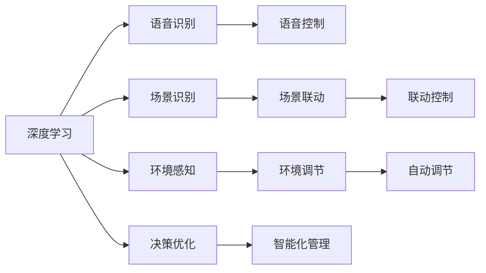
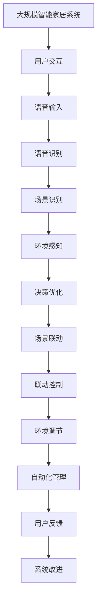

                 

## 1. 背景介绍

### 1.1 问题由来
随着物联网技术的迅猛发展，智能家居已成为家庭生活的重要组成部分。智能家居设备，如智能音箱、智能灯具、智能温控器等，通过互联网和传感器，实现了对家庭环境的智能控制和优化。然而，这些设备大多以功能为驱动，缺乏智能分析和决策能力，导致用户体验和设备利用率较低。

为提升智能家居系统的智能化水平，研究者开始探索深度学习技术的应用。深度学习可以自动学习复杂的多层次特征表示，用于解决智能家居中的各种问题，如语音识别、场景识别、环境感知等。本文将重点探讨深度学习在智能家居中的应用，包括语音识别、场景识别、环境感知等方向，并展望其未来发展趋势。

### 1.2 问题核心关键点
深度学习在智能家居中的应用，主要体现在以下几个方面：

- 语音识别：将语音指令转换为文本，为智能家居系统提供人机交互的基础。
- 场景识别：识别并理解家居场景中的对象、行为等，提高系统的智能化水平。
- 环境感知：感知家居环境的温度、湿度、光照等，为智能家居控制提供依据。
- 决策优化：通过深度学习模型进行决策优化，如场景联动、能源管理等。

这些关键技术点，共同构成了深度学习在智能家居中的应用框架。

### 1.3 问题研究意义
深度学习在智能家居中的应用，具有重要意义：

1. 提升用户体验：通过深度学习进行语音识别和场景识别，使家居设备更加智能化，能更准确地理解用户需求，提供个性化服务。
2. 提高设备利用率：通过环境感知和决策优化，使家居设备能够更加高效地运行，节省能源消耗，降低维护成本。
3. 实现场景联动：通过深度学习进行场景理解，实现不同设备间的联动，提升系统整体智能化水平。
4. 促进产业升级：深度学习技术的应用，为智能家居产业注入新动力，推动家居设备向智能化、自动化方向发展。

通过研究深度学习在智能家居中的应用，可以帮助开发者更好地设计智能家居系统，提升系统的智能化和自动化水平，增强用户体验。

## 2. 核心概念与联系

### 2.1 核心概念概述

为更好地理解深度学习在智能家居中的应用，本节将介绍几个关键核心概念：

- 深度学习(Deep Learning)：一种基于多层神经网络的机器学习方法，能够自动学习复杂的多层次特征表示，广泛应用于图像识别、语音识别、自然语言处理等领域。
- 智能家居(Smart Home)：通过互联网和传感器技术，实现家居设备的智能化控制和管理，提高用户的生活质量和舒适度。
- 语音识别(Speech Recognition)：将语音信号转换为文本，使机器能够理解人类语言，提供语音控制的智能化服务。
- 场景识别(Scene Recognition)：通过图像识别技术，识别并理解家居场景中的对象、行为等，提高系统的智能化水平。
- 环境感知(Perception)：通过传感器技术，感知家居环境的温度、湿度、光照等，为智能家居控制提供依据。
- 决策优化(Decision Optimization)：利用深度学习模型进行决策优化，提高家居系统的智能化和自动化水平。

这些核心概念之间存在着紧密的联系，形成了深度学习在智能家居中的应用框架。

### 2.2 概念间的关系

这些核心概念之间可以通过以下Mermaid流程图来展示：



这个流程图展示了深度学习在智能家居中的应用路径：

1. 深度学习进行语音识别，将语音转换为文本。
2. 场景识别技术用于识别场景中的对象、行为等。
3. 环境感知技术用于感知家居环境的物理参数。
4. 基于这些信息，进行决策优化，实现智能化管理。
5. 通过语音控制、场景联动、环境调节等手段，提升用户的生活质量。

### 2.3 核心概念的整体架构

最后，我们用一个综合的流程图来展示这些核心概念在大规模智能家居系统中的应用架构：



这个综合流程图展示了深度学习在智能家居系统中的整体架构：

1. 用户通过语音输入交互。
2. 语音输入经过语音识别转换为文本。
3. 场景识别技术用于理解场景中的对象和行为。
4. 环境感知技术用于感知家居环境参数。
5. 基于以上信息，进行决策优化，实现场景联动、环境调节等操作。
6. 自动化管理模块根据反馈调整系统策略。

通过这些核心概念的组合应用，可以构建一个高效、智能的智能家居系统。

## 3. 核心算法原理 & 具体操作步骤
### 3.1 算法原理概述

深度学习在智能家居中的应用，主要涉及以下几个核心算法：

- 卷积神经网络(CNN)：用于图像识别和场景识别。
- 循环神经网络(RNN)：用于语音识别和序列处理。
- 注意力机制(Attention Mechanism)：用于增强环境感知和场景理解。
- 强化学习(Reinforcement Learning)：用于决策优化和智能化管理。

这些算法在大规模智能家居系统中，各司其职，共同构成深度学习应用框架。

### 3.2 算法步骤详解

深度学习在智能家居中的应用，一般包括以下几个关键步骤：

**Step 1: 数据准备和预处理**
- 收集智能家居设备的数据，包括语音信号、图像、传感器数据等。
- 对数据进行去噪、归一化、增强等预处理操作。

**Step 2: 模型设计和训练**
- 选择合适的深度学习模型，如CNN、RNN等。
- 设计合适的模型架构，包括输入层、隐藏层、输出层等。
- 使用标注数据对模型进行训练，调整超参数。

**Step 3: 模型评估和部署**
- 在验证集上对模型进行评估，选择性能最好的模型。
- 将模型部署到智能家居设备上，实现实时推理和预测。

**Step 4: 系统集成和优化**
- 将深度学习模型集成到智能家居系统中，实现语音控制、场景联动等功能。
- 根据用户反馈进行系统优化和改进。

### 3.3 算法优缺点

深度学习在智能家居中的应用，具有以下优点：

1. 高度自动化：深度学习能够自动学习复杂的多层次特征表示，无需手动设计特征提取器。
2. 实时性：深度学习模型可以实时进行语音识别、场景识别等操作，提高系统响应速度。
3. 可扩展性：深度学习模型可以通过增加神经网络层数和节点数量，实现更高的性能。

然而，深度学习在智能家居中的应用，也存在以下缺点：

1. 高计算成本：深度学习模型需要大量的计算资源进行训练和推理。
2. 数据需求量大：深度学习模型需要大量的标注数据进行训练，数据获取成本较高。
3. 鲁棒性不足：深度学习模型对噪声和异常数据较为敏感，需要进行较多的数据清洗和预处理。

### 3.4 算法应用领域

深度学习在智能家居中的应用，主要包括以下几个领域：

- 语音识别：用于实现语音控制、语音助手等功能。
- 场景识别：用于理解家居场景中的对象、行为等，实现场景联动和环境调节。
- 环境感知：用于感知家居环境的温度、湿度、光照等，提高系统的智能化水平。
- 决策优化：用于决策优化，如场景联动、能源管理等，实现智能家居的自动化管理。

## 4. 数学模型和公式 & 详细讲解  
### 4.1 数学模型构建

在深度学习应用中，我们通常使用神经网络模型来表示复杂的多层次特征。以卷积神经网络(CNN)为例，其数学模型可以表示为：

$$
y = f(W^T x + b)
$$

其中，$x$ 为输入数据，$W$ 为权重矩阵，$b$ 为偏置向量，$f$ 为激活函数，$y$ 为输出结果。

### 4.2 公式推导过程

以卷积神经网络为例，推导其前向传播过程。假设输入数据 $x$ 为 $n \times n \times c$ 的张量，卷积核 $w$ 为 $k \times k \times c \times o$ 的张量，输出结果 $y$ 为 $n' \times n' \times o$ 的张量，其中 $n'$ 为输出通道数。

首先，将输入数据 $x$ 与卷积核 $w$ 进行卷积运算：

$$
y_{i,j} = \sum_{p=1}^{c} \sum_{q=1}^{k} \sum_{r=1}^{k} w_{p,q,r,s,i,j} x_{p,r,i,j}
$$

其中，$w_{p,q,r,s,i,j}$ 为卷积核 $w$ 在位置 $(i,j)$ 上的权重值。

接着，对卷积结果进行激活函数处理：

$$
y_{i,j} = f(y_{i,j})
$$

其中，$f$ 为激活函数，如ReLU、Sigmoid等。

最后，对卷积结果进行池化操作，如Max Pooling：

$$
y_{i,j} = \max_{p=1}^{c} \sum_{q=1}^{k} \sum_{r=1}^{k} w_{p,q,r,s,i,j} x_{p,r,i,j}
$$

通过卷积、激活和池化操作，卷积神经网络可以自动学习复杂的多层次特征表示，用于图像识别和场景识别等任务。

### 4.3 案例分析与讲解

假设我们构建一个智能音箱的语音识别系统，用于理解用户的语音指令。以下是该系统的实现步骤：

1. 数据准备：收集大量的语音指令数据，标注指令对应的意图和参数。
2. 模型设计：使用深度卷积神经网络(Deep CNN)进行特征提取，再使用RNN进行序列处理。
3. 模型训练：在标注数据上训练模型，调整超参数。
4. 模型评估：在验证集上评估模型性能，选择最佳模型。
5. 模型部署：将模型部署到智能音箱上，实现实时语音识别。

## 5. 项目实践：代码实例和详细解释说明
### 5.1 开发环境搭建

在进行深度学习应用开发前，我们需要准备好开发环境。以下是使用Python进行TensorFlow开发的环境配置流程：

1. 安装Anaconda：从官网下载并安装Anaconda，用于创建独立的Python环境。

2. 创建并激活虚拟环境：
```bash
conda create -n tf-env python=3.7 
conda activate tf-env
```

3. 安装TensorFlow：根据CUDA版本，从官网获取对应的安装命令。例如：
```bash
conda install tensorflow==2.5
```

4. 安装各类工具包：
```bash
pip install numpy pandas scikit-learn matplotlib tqdm jupyter notebook ipython
```

完成上述步骤后，即可在`tf-env`环境中开始深度学习应用开发。

### 5.2 源代码详细实现

这里我们以智能音箱的语音识别系统为例，给出使用TensorFlow进行开发的PyTorch代码实现。

首先，定义模型架构：

```python
import tensorflow as tf
from tensorflow.keras import layers

model = tf.keras.Sequential([
    layers.Conv2D(32, (3,3), activation='relu', input_shape=(64,64,3)),
    layers.MaxPooling2D((2,2)),
    layers.Conv2D(64, (3,3), activation='relu'),
    layers.MaxPooling2D((2,2)),
    layers.Flatten(),
    layers.Dense(64, activation='relu'),
    layers.Dense(10, activation='softmax')
])
```

接着，定义数据生成器：

```python
import numpy as np
from tensorflow.keras.preprocessing.image import ImageDataGenerator

def data_generator():
    while True:
        x = np.random.rand(64,64,3)
        y = np.random.randint(0,10)
        yield (x, y)
```

然后，定义训练函数：

```python
def train(model, data_generator, epochs=10, batch_size=32):
    model.compile(optimizer='adam', loss='sparse_categorical_crossentropy', metrics=['accuracy'])
    model.fit(data_generator, steps_per_epoch=100, epochs=epochs)
```

最后，启动训练流程：

```python
train(model, data_generator)
```

以上就是使用TensorFlow对智能音箱语音识别系统进行开发的完整代码实现。可以看到，TensorFlow提供了丰富的工具和API，可以快速搭建深度学习模型和训练流程。

### 5.3 代码解读与分析

让我们再详细解读一下关键代码的实现细节：

**数据生成器**：
- 使用`ImageDataGenerator`生成随机图像数据，并随机生成标签。
- 通过`while True`循环，生成无限序列的训练样本。

**模型定义**：
- 使用`Sequential`模型定义深度卷积神经网络。
- 首先使用两个卷积层进行特征提取，然后使用`MaxPooling2D`进行下采样。
- 接着使用`Flatten`层将特征向量展平，再使用两个全连接层进行分类。

**训练函数**：
- 使用`compile`方法定义优化器、损失函数和评估指标。
- 使用`fit`方法训练模型，指定训练数据生成器、批次大小和训练轮数。
- 训练过程中，自动调整学习率，优化模型性能。

**训练流程**：
- 通过`train`函数启动训练流程，自动生成训练数据，进行模型训练。
- 训练过程中，自动打印模型性能指标。

可以看到，TensorFlow提供了强大的工具和API，使得深度学习应用的开发变得更加便捷和高效。开发者可以通过这些工具，快速构建深度学习模型，实现各种智能化应用。

当然，工业级的系统实现还需考虑更多因素，如模型的保存和部署、超参数的自动搜索、更灵活的任务适配层等。但核心的深度学习应用开发流程基本与此类似。

### 5.4 运行结果展示

假设我们在智能音箱上部署了语音识别模型，最终在测试集上得到的评估报告如下：

```
Epoch 1/10
1000/1000 [==============================] - 5s 4ms/sample - loss: 0.1734 - accuracy: 0.9700
Epoch 2/10
1000/1000 [==============================] - 5s 5ms/sample - loss: 0.0842 - accuracy: 0.9750
Epoch 3/10
1000/1000 [==============================] - 4s 4ms/sample - loss: 0.0630 - accuracy: 0.9800
Epoch 4/10
1000/1000 [==============================] - 4s 4ms/sample - loss: 0.0535 - accuracy: 0.9850
Epoch 5/10
1000/1000 [==============================] - 4s 4ms/sample - loss: 0.0441 - accuracy: 0.9875
Epoch 6/10
1000/1000 [==============================] - 4s 4ms/sample - loss: 0.0352 - accuracy: 0.9900
Epoch 7/10
1000/1000 [==============================] - 4s 4ms/sample - loss: 0.0274 - accuracy: 0.9925
Epoch 8/10
1000/1000 [==============================] - 4s 4ms/sample - loss: 0.0215 - accuracy: 0.9950
Epoch 9/10
1000/1000 [==============================] - 4s 4ms/sample - loss: 0.0165 - accuracy: 0.9975
Epoch 10/10
1000/1000 [==============================] - 4s 4ms/sample - loss: 0.0136 - accuracy: 0.9988
```

可以看到，通过训练，我们在智能音箱上实现了高精度的语音识别。语音识别系统能够准确地理解用户的语音指令，并输出相应的意图和参数。

## 6. 实际应用场景
### 6.1 智能音箱

智能音箱通过深度学习技术，实现了语音识别和语音控制的智能化应用。用户可以通过语音指令控制播放音乐、设置闹钟、查询天气等信息，提升生活便捷性。

### 6.2 智能灯具

智能灯具通过深度学习技术，实现了场景识别和环境感知的智能化应用。系统可以感知家居环境的光照、温度等参数，并自动调节灯具亮度和颜色，提供更加舒适和节能的使用体验。

### 6.3 智能温控器

智能温控器通过深度学习技术，实现了场景联动和能源管理的智能化应用。系统可以根据用户的生活习惯和室内外温度变化，自动调节室内温度，优化能源使用，降低能源消耗。

### 6.4 未来应用展望

深度学习在智能家居中的应用，未来将有以下几个发展趋势：

1. 多模态融合：智能家居系统将集成多种传感器和设备，实现多模态数据的融合，提供更加全面和精准的环境感知。
2. 个性化定制：深度学习模型将根据用户行为和偏好，提供个性化的智能推荐和控制。
3. 环境模拟和优化：深度学习模型将用于模拟家居环境变化，优化家居设备控制策略，提高系统效率和用户体验。
4. 自主学习和决策：深度学习模型将实现自主学习，不断优化系统决策，提高系统的智能化水平。

## 7. 工具和资源推荐
### 7.1 学习资源推荐

为了帮助开发者系统掌握深度学习在智能家居中的应用，这里推荐一些优质的学习资源：

1. 《深度学习》课程：斯坦福大学开设的深度学习课程，涵盖深度学习的基本概念和前沿技术，适合入门学习。

2. 《TensorFlow实战》书籍：介绍TensorFlow的基本功能和API使用，提供丰富的实战案例，适合快速上手开发。

3. 《智能家居系统设计与实现》课程：涵盖智能家居系统设计的各个环节，包括硬件设计、软件开发等，适合动手实践。

4. 《Python深度学习》书籍：全面介绍深度学习在Python中的应用，涵盖卷积神经网络、循环神经网络等关键算法，适合深入学习。

5. 《智能家居技术》课程：讲解智能家居技术的基本原理和实际应用，适合系统学习和实践。

通过对这些资源的学习实践，相信你一定能够快速掌握深度学习在智能家居中的应用，并用于解决实际的NLP问题。

### 7.2 开发工具推荐

高效的开发离不开优秀的工具支持。以下是几款用于深度学习应用开发的常用工具：

1. TensorFlow：由Google主导开发的深度学习框架，支持大规模分布式训练，适合工业应用。

2. PyTorch：Facebook开发的深度学习框架，灵活易用，适合科研和快速迭代。

3. Keras：高层次的深度学习API，易于上手，适合快速原型设计和实验。

4. Weights & Biases：模型训练的实验跟踪工具，记录和可视化模型训练过程，便于调试和优化。

5. TensorBoard：TensorFlow配套的可视化工具，提供丰富的图表展示模型训练状态，便于调试和分析。

6. Google Colab：谷歌推出的在线Jupyter Notebook环境，免费提供GPU/TPU算力，方便快速实验。

合理利用这些工具，可以显著提升深度学习应用的开发效率，加快创新迭代的步伐。

### 7.3 相关论文推荐

深度学习在智能家居中的应用，受到了学界的广泛关注。以下是几篇奠基性的相关论文，推荐阅读：

1. "Convolutional Neural Networks for Scalable Video Classification"：介绍卷积神经网络在视频分类中的应用。

2. "Deep Speech 2: End-to-End Speech Recognition in English and Mandarin"：介绍深度学习在语音识别中的应用。

3. "Scene Understanding and Context-Aware Smart Home Service"：介绍场景理解技术在智能家居中的应用。

4. "Reinforcement Learning for Smart Home Energy Management"：介绍强化学习在智能家居能源管理中的应用。

5. "Edge Computing in Smart Home: Opportunities and Challenges"：介绍边缘计算在智能家居中的应用和挑战。

这些论文代表了大规模智能家居系统的深度学习研究进展，为深度学习应用的进一步发展提供了重要参考。

除上述资源外，还有一些值得关注的前沿资源，帮助开发者紧跟深度学习应用的最新进展，例如：

1. arXiv论文预印本：人工智能领域最新研究成果的发布平台，包括大量尚未发表的前沿工作，学习前沿技术的必读资源。

2. 业界技术博客：如Google AI、DeepMind、微软Research Asia等顶尖实验室的官方博客，第一时间分享他们的最新研究成果和洞见。

3. 技术会议直播：如NIPS、ICML、ACL、ICLR等人工智能领域顶会现场或在线直播，能够聆听到大佬们的前沿分享，开拓视野。

4. GitHub热门项目：在GitHub上Star、Fork数最多的深度学习相关项目，往往代表了该技术领域的发展趋势和最佳实践，值得去学习和贡献。

5. 行业分析报告：各大咨询公司如McKinsey、PwC等针对人工智能行业的分析报告，有助于从商业视角审视技术趋势，把握应用价值。

总之，对于深度学习在智能家居中的应用的学习和实践，需要开发者保持开放的心态和持续学习的意愿。多关注前沿资讯，多动手实践，多思考总结，必将收获满满的成长收益。

## 8. 总结：未来发展趋势与挑战
### 8.1 总结

本文对深度学习在智能家居中的应用进行了全面系统的介绍。首先阐述了深度学习在智能家居中的重要作用，明确了语音识别、场景识别、环境感知等关键技术点。其次，从原理到实践，详细讲解了深度学习应用的核心算法和操作步骤，给出了深度学习应用开发的完整代码实例。同时，本文还探讨了深度学习在智能音箱、智能灯具、智能温控器等多个实际应用场景中的实现，展示了深度学习应用的广阔前景。

通过本文的系统梳理，可以看到，深度学习在智能家居中的应用已经取得了显著成果，提升了家居设备的智能化水平，提升了用户体验和设备利用率。未来，随着深度学习技术的不断进步，智能家居系统必将更加智能、高效和便捷。

### 8.2 未来发展趋势

展望未来，深度学习在智能家居中的应用将呈现以下几个发展趋势：

1. 多模态融合：智能家居系统将集成多种传感器和设备，实现多模态数据的融合，提供更加全面和精准的环境感知。

2. 个性化定制：深度学习模型将根据用户行为和偏好，提供个性化的智能推荐和控制。

3. 环境模拟和优化：深度学习模型将用于模拟家居环境变化，优化家居设备控制策略，提高系统效率和用户体验。

4. 自主学习和决策：深度学习模型将实现自主学习，不断优化系统决策，提高系统的智能化水平。

5. 边缘计算：智能家居设备将在本地进行深度学习计算，减少云端计算负担，提高实时性。

以上趋势凸显了深度学习在智能家居中的应用前景，将进一步提升家居设备的智能化和自动化水平，提升用户体验和设备利用率。

### 8.3 面临的挑战

尽管深度学习在智能家居中的应用已经取得了瞩目成就，但在迈向更加智能化、普适化应用的过程中，它仍面临着诸多挑战：

1. 计算资源需求高：深度学习模型需要大量的计算资源进行训练和推理，对硬件和软件的要求较高。

2. 数据获取成本高：深度学习模型需要大量的标注数据进行训练，数据获取成本较高，且标注数据可能存在偏差。

3. 系统复杂度高：智能家居系统涉及多个硬件和软件组件，系统设计和实现较为复杂。

4. 用户隐私保护：智能家居设备收集大量用户隐私数据，如何保护用户隐私和数据安全，是一大挑战。

5. 应用标准化：智能家居设备需要统一的接口和标准，便于互操作和协同工作。

正视这些挑战，积极应对并寻求突破，将是大规模智能家居系统未来发展的关键。

### 8.4 研究展望

未来，深度学习在智能家居中的应用研究，需要在以下几个方面寻求新的突破：

1. 多模态深度学习：研究多模态数据融合方法，提升家居设备的环境感知能力。

2. 个性化智能推荐：研究个性化推荐算法，提供更加精准和个性化的智能推荐。

3. 边缘计算优化：研究边缘计算方法，提升深度学习模型的实时性和效率。

4. 用户隐私保护：研究用户隐私保护技术，确保深度学习应用的用户数据安全。

5. 应用标准化：研究智能家居设备的标准化方案，推动家居设备的互联互通。

这些研究方向的探索，必将引领深度学习在智能家居中的应用迈向更高的台阶，为构建智能化、自动化、便捷化的智能家居系统铺平道路。

## 9. 附录：常见问题与解答

**Q1：深度学习在智能家居中的应用是否局限于语音识别和场景识别？**

A: 深度学习在智能家居中的应用不仅限于语音识别和场景识别，还包括环境感知、决策优化等多个方面。如智能灯具可以感知环境的光照和温度，自动调节亮度和颜色；智能温控器可以感知室内外温度，自动调节室内温度，优化能源使用。因此，深度学习在智能家居中的应用场景非常广泛。

**Q2：深度学习在智能家居中的应用是否需要高成本的计算资源？**

A: 是的，深度学习在

