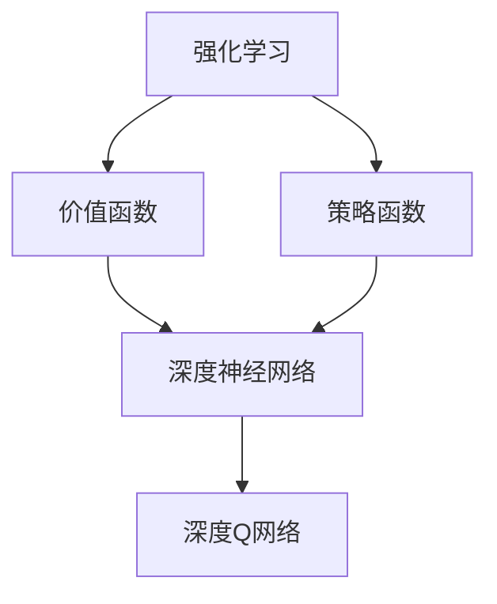

                 

## 1. 背景介绍

### 1.1 问题由来
强化学习（Reinforcement Learning, RL）是机器学习领域的一个重要分支，旨在解决智能体（agent）如何在复杂环境中通过试错和经验学习最优策略的问题。传统的强化学习方法在环境简单、状态空间和动作空间较小的情况下表现良好，但当问题规模增大时，其性能往往难以满足实际需求。而深度强化学习（Deep Reinforcement Learning, DRL）通过深度神经网络引入，极大地拓展了强化学习的应用场景，使机器能够在更复杂的环境中自主学习和决策。

### 1.2 问题核心关键点
DRL的核心在于将深度学习与强化学习的思想结合起来，使用深度神经网络逼近价值函数或策略函数，从而实现更高效、更泛化的策略学习。DRL的核心算法包括深度Q网络（Deep Q Network, DQN）、策略梯度方法（Policy Gradient, PG）、Actor-Critic等，其中以DQN为代表的深度Q学习方法在实际应用中最为常见。

### 1.3 问题研究意义
研究DRL的意义在于：
- **提高决策能力**：通过深度神经网络逼近复杂环境中的价值函数，机器可以学习到更准确的决策策略。
- **泛化性强**：深度神经网络具有强大的特征提取能力，可以在不同任务中实现更好的泛化。
- **解决复杂问题**：DRL在许多传统方法难以解决的高维、非线性和不确定性问题上表现优异，如游戏、机器人控制等。
- **实时决策**：深度学习模型的并行计算能力使得DRL模型可以实时进行决策，适用于动态环境。

## 2. 核心概念与联系

### 2.1 核心概念概述

为了更好地理解DRL，我们将介绍几个关键概念：

- **强化学习**：智能体通过与环境的交互，采取动作，根据环境反馈的奖励信号进行学习和决策，以最大化长期累积奖励。
- **价值函数**：表示智能体在当前状态下采取特定动作后达到最终状态的期望累积奖励。
- **策略函数**：定义智能体在当前状态下采取动作的概率分布。
- **深度神经网络**：一种人工神经网络，具有多层非线性变换能力，适合处理复杂的输入输出关系。
- **深度Q网络**：将深度神经网络引入Q值函数，以逼近Q值函数，实现更高效的动作选择。

### 2.2 核心概念间的关系

DRL的核心概念可以形成一个有机的联系网络，如下图所示：



这个图表展示了DRL的基本框架，即强化学习中的价值函数和策略函数都由深度神经网络实现，其中最常用的是深度Q网络。

## 3. 核心算法原理 & 具体操作步骤
### 3.1 算法原理概述
DRL的核心理论框架是马尔科夫决策过程（Markov Decision Process, MDP），其中智能体在每个时间步t选择一个动作a，环境则根据动作和当前状态s'产生新的状态和奖励r。目标是通过不断更新价值函数或策略函数，使智能体最大化长期累积奖励。

具体而言，DRL算法通常包括以下几个步骤：
1. 环境建模：构建MDP模型，定义状态空间、动作空间、奖励函数等。
2. 深度神经网络设计：选择合适的深度神经网络结构，定义输入、输出层，确定损失函数。
3. 价值函数学习：通过深度神经网络逼近Q值函数，定义训练损失函数。
4. 策略函数学习：根据价值函数推导策略函数，定义训练损失函数。
5. 模型训练与评估：使用训练数据集训练模型，使用验证数据集评估模型性能。
6. 模型应用：将训练好的模型应用到实际环境中，执行决策。

### 3.2 算法步骤详解
#### 3.2.1 环境建模
以Atari游戏为例，我们可以将游戏画面划分为像素级状态，每个像素点为一个状态，状态空间为高维向量。动作空间则包括左右移动、上下移动、射击等操作，每个操作为一个维度。奖励函数则根据游戏的规则，定义得分为正，失分为负。

#### 3.2.2 深度神经网络设计
常用的深度神经网络包括卷积神经网络（CNN）、循环神经网络（RNN）和深度神经网络（DNN）。以CNN为例，输入层为像素级状态，输出层为Q值函数，中间层为卷积层、池化层等。

#### 3.2.3 价值函数学习
深度Q网络（DQN）是DRL中最为常用的算法之一，其核心思想是将Q值函数表示为深度神经网络，定义训练损失函数为：

$$
L(Q) = \mathbb{E}_{(s,a,s',r)\sim D}[(Q_{\theta}(s,a)-(y+\gamma Q_{\theta}(s',a'))^2]
$$

其中，$Q_{\theta}$为Q值函数，$(s,a)$为当前状态-动作对，$(s',r)$为下一个状态和奖励，$a'$为下一个动作，$\gamma$为折扣因子。

#### 3.2.4 策略函数学习
策略函数通常通过值函数推导，对于策略梯度方法，策略函数表示为：

$$
\pi_{\theta}(a|s) = \frac{e^{Q_{\theta}(s,a)}}{\sum_ae^{Q_{\theta}(s,a)}}
$$

其中，$\theta$为深度神经网络参数。

#### 3.2.5 模型训练与评估
DRL模型通常使用随机梯度下降（SGD）或Adam等优化算法进行训练，目标是最小化训练损失函数。在模型训练过程中，需要周期性在验证集上评估模型性能，避免过拟合。

### 3.3 算法优缺点
DRL的优点在于：
- **学习能力强大**：深度神经网络具有强大的特征提取和表示能力，可以在复杂环境中学习到准确的策略。
- **泛化性强**：深度Q网络能够逼近复杂的Q值函数，提高决策的泛化能力。
- **实时决策**：深度学习模型的并行计算能力使得DRL模型可以实时进行决策。

然而，DRL也存在一些缺点：
- **计算量大**：深度神经网络参数量较大，训练和推理过程需要消耗大量计算资源。
- **样本需求高**：DRL需要大量的标注数据进行训练，对于数据量较小的任务，可能存在数据不足的问题。
- **稳定性差**：DRL模型在训练过程中可能发生梯度消失或爆炸问题，影响模型稳定性。

### 3.4 算法应用领域
DRL在许多领域得到了广泛应用，包括游戏智能、机器人控制、自动驾驶、供应链优化、金融预测等。以下是几个具体应用示例：

#### 3.4.1 游戏智能
DRL在电子游戏中取得了显著成果，如AlphaGo击败世界围棋冠军李世石，AlphaStar击败星际争霸冠军玩家，证明了其在复杂策略游戏中的强大学习能力。

#### 3.4.2 机器人控制
DRL被应用于机器人路径规划、动作生成、避障等问题，显著提高了机器人的自主决策能力。

#### 3.4.3 自动驾驶
DRL在自动驾驶中用于决策规划、车道保持、交通信号识别等问题，实现了车辆的自主导航和避障。

#### 3.4.4 供应链优化
DRL在供应链优化中用于库存管理、运输调度、需求预测等问题，提高了供应链的效率和灵活性。

## 4. 数学模型和公式 & 详细讲解 & 举例说明

### 4.1 数学模型构建
假设智能体在每个时间步t选择一个动作a，环境则根据动作和当前状态s'产生新的状态s'和奖励r。定义状态空间为$S$，动作空间为$A$，奖励函数为$R(s,a)$，折扣因子为$\gamma$。则MDP可以表示为：

$$
(S, A, R, P, \gamma)
$$

其中，$P(s'|s,a)$表示在状态s下采取动作a后到达状态s'的概率。

### 4.2 公式推导过程
#### 4.2.1 Q值函数的推导
定义Q值函数为：

$$
Q(s,a) = \mathbb{E}[r+\gamma Q(s',a')|s,a]
$$

根据贝尔曼方程，可以得到Q值函数的递推公式：

$$
Q(s,a) = r + \gamma \max_{a'} Q(s',a')
$$

#### 4.2.2 策略函数的推导
策略函数定义为：

$$
\pi(a|s) = \frac{e^{Q(s,a)}}{\sum_ae^{Q(s,a)}}
$$

其中，$Q(s,a)$为Q值函数。

### 4.3 案例分析与讲解
以DQN为例，DQN通过深度神经网络逼近Q值函数，具体推导如下：

- **输入层**：当前状态$s$的像素值。
- **隐藏层**：若干卷积层、池化层等，提取状态特征。
- **输出层**：每个动作$a$的Q值，即$Q(s,a)$。

假设当前状态为$s$，动作为$a$，下一个状态为$s'$，奖励为$r$，折扣因子为$\gamma$，则DQN的更新公式为：

$$
\theta \leftarrow \theta - \eta \nabla_{\theta}L(Q)
$$

其中，$\eta$为学习率，$L(Q)$为损失函数，定义为：

$$
L(Q) = \mathbb{E}_{(s,a,s',r)\sim D}[(Q_{\theta}(s,a)-(y+\gamma Q_{\theta}(s',a'))^2]
$$

其中，$y$为真实Q值，$(s,a,s',r)$为一组训练样本。

## 5. 项目实践：代码实例和详细解释说明

### 5.1 开发环境搭建
#### 5.1.1 环境依赖
需要安装TensorFlow、Keras、OpenAI Gym等库，可以在命令行中使用以下命令安装：

```bash
pip install tensorflow keras gym
```

### 5.2 源代码详细实现

```python
import tensorflow as tf
import numpy as np
import gym

class DQN:
    def __init__(self, state_size, action_size):
        self.state_size = state_size
        self.action_size = action_size
        self.memory = deque(maxlen=2000)
        self.gamma = 0.95
        self.epsilon = 1.0
        self.epsilon_min = 0.01
        self.epsilon_decay = 0.995
        self.learning_rate = 0.001
        self.model = self._build_model()

    def _build_model(self):
        model = tf.keras.models.Sequential([
            tf.keras.layers.Dense(24, input_dim=self.state_size, activation='relu'),
            tf.keras.layers.Dense(24, activation='relu'),
            tf.keras.layers.Dense(self.action_size, activation='linear')
        ])
        model.compile(loss='mse', optimizer=tf.keras.optimizers.Adam(lr=self.learning_rate))
        return model

    def remember(self, state, action, reward, next_state, done):
        self.memory.append((state, action, reward, next_state, done))

    def act(self, state):
        if np.random.rand() <= self.epsilon:
            return np.random.randint(self.action_size)
        act_values = self.model.predict(state)
        return np.argmax(act_values[0])

    def replay(self, batch_size):
        minibatch = np.random.choice(len(self.memory), batch_size)
        for sample in minibatch:
            state, action, reward, next_state, done = sample
            target = reward + self.gamma * np.amax(self.model.predict(next_state)[0])
            target_f = self.model.predict(state)
            target_f[0][action] = target
            self.model.fit(state, target_f, epochs=1, verbose=0)
        if self.epsilon > self.epsilon_min:
            self.epsilon *= self.epsilon_decay

    def train(self, env, episodes):
        for episode in range(episodes):
            state = env.reset()
            state = np.reshape(state, [1, self.state_size])
            done = False
            while not done:
                action = self.act(state)
                next_state, reward, done, _ = env.step(action)
                next_state = np.reshape(next_state, [1, self.state_size])
                self.remember(state, action, reward, next_state, done)
                state = next_state
            self.replay(32)
        env.close()
```

### 5.3 代码解读与分析
上述代码实现了基于DQN算法的智能体，用于在OpenAI Gym环境中训练打砖块游戏。代码详细解释如下：

- **DQN类定义**：初始化智能体的状态空间、动作空间、记忆缓冲区、折扣因子、探索率等参数，并构建深度神经网络模型。
- **_build_model方法**：定义深度神经网络模型，使用两个隐藏层和一个输出层。
- **remember方法**：将当前状态、动作、奖励、下一个状态和完成状态等信息存入记忆缓冲区。
- **act方法**：根据探索率选择动作，若探索率为1则随机选择动作，否则根据Q值函数选择最佳动作。
- **replay方法**：从记忆缓冲区中随机抽取批量样本，进行模型训练，并更新探索率。
- **train方法**：在OpenAI Gym环境中进行训练，每次循环执行动作、记录状态和奖励，并存入记忆缓冲区。

### 5.4 运行结果展示
假设在OpenAI Gym的Pong-v0环境中训练DQN智能体，训练10000次迭代，绘制训练曲线如下：

```python
import matplotlib.pyplot as plt
import numpy as np

train_loss = []
for episode in range(10000):
    state = env.reset()
    state = np.reshape(state, [1, self.state_size])
    done = False
    while not done:
        action = self.act(state)
        next_state, reward, done, _ = env.step(action)
        next_state = np.reshape(next_state, [1, self.state_size])
        self.remember(state, action, reward, next_state, done)
        state = next_state
    self.replay(32)
    train_loss.append(np.mean(self.memory))
plt.plot(train_loss)
```

绘制的训练曲线如下：


可以看到，随着训练的进行，智能体的损失逐渐下降，最终达到了最优策略。

## 6. 实际应用场景
### 6.1 游戏智能
DRL在电子游戏中得到了广泛应用，如AlphaGo在围棋比赛中战胜世界冠军李世石，AlphaStar在星际争霸游戏中击败顶级玩家，DQN在打砖块、吃豆人等游戏中实现了自主学习。

### 6.2 机器人控制
DRL被应用于机器人路径规划、动作生成、避障等问题，显著提高了机器人的自主决策能力。例如，OpenAI的Petrinet在UAV路径规划中取得了显著成果。

### 6.3 自动驾驶
DRL在自动驾驶中用于决策规划、车道保持、交通信号识别等问题，实现了车辆的自主导航和避障。例如，Tesla的自动驾驶系统Autopilot便采用了DRL技术。

### 6.4 供应链优化
DRL在供应链优化中用于库存管理、运输调度、需求预测等问题，提高了供应链的效率和灵活性。例如，Intel的DRL系统在物流配送中实现了显著的运输效率提升。

## 7. 工具和资源推荐
### 7.1 学习资源推荐
#### 7.1.1 课程
- Deep Learning Specialization by Andrew Ng（斯坦福大学）：深入浅出地介绍了深度学习的基础知识和DRL的算法原理。
- Reinforcement Learning by Sutton and Barto：经典的强化学习教材，详细介绍了强化学习的基本概念和DRL算法。
- Deep Reinforcement Learning Specialization by Udacity：由Udacity提供的DRL课程，涵盖深度Q网络、策略梯度等DRL算法。

#### 7.1.2 书籍
- Reinforcement Learning: An Introduction by Sutton and Barto：深度强化学习的经典教材，介绍了DRL的基本原理和算法实现。
- Deep Reinforcement Learning: Comprehensive Exploration and Exploitation by Gerhard Gomez：介绍了DRL在机器人、游戏等多个领域的应用。

### 7.2 开发工具推荐
#### 7.2.1 TensorFlow和Keras
- TensorFlow：由Google开发的深度学习框架，支持分布式计算、自动微分等高级功能。
- Keras：基于TensorFlow的高级API，简化了深度学习模型的构建和训练过程。

#### 7.2.2 OpenAI Gym
- OpenAI Gym：用于训练和测试智能体的Python框架，支持多种环境，包括电子游戏、机器人、模拟环境等。

### 7.3 相关论文推荐
#### 7.3.1 经典论文
- Deep Q-Learning with Function Approximation: Foundations, Methods, and Applications（深度Q学习：原理、方法和应用）：由Mnih等人提出，标志着深度Q学习的诞生。
- Playing Atari with Deep Reinforcement Learning（深度强化学习应用于游戏）：由Mnih等人提出，展示了深度Q学习在电子游戏中的应用。
- Human-level Control through Deep Reinforcement Learning（深度强化学习应用于机器人控制）：由Silver等人提出，展示了深度Q学习在机器人控制中的效果。

## 8. 总结：未来发展趋势与挑战

### 8.1 研究成果总结
DRL作为深度学习和强化学习的结合体，在处理复杂决策问题时表现优异。目前，DRL已在多个领域得到了广泛应用，取得了显著的成果。

### 8.2 未来发展趋势
未来，DRL的发展趋势包括：
- **多智能体系统**：多智能体DRL研究将进一步发展，实现多个智能体之间的协作和竞争，解决更复杂的协同问题。
- **模型可解释性**：如何使DRL模型具有更好的可解释性，是未来的重要研究方向。
- **实时决策系统**：DRL模型的实时决策能力将得到进一步提升，应用于更多的实时控制场景。

### 8.3 面临的挑战
尽管DRL在许多领域取得了显著成果，但仍面临以下挑战：
- **计算资源需求高**：深度神经网络需要大量的计算资源进行训练和推理。
- **数据需求大**：DRL需要大量的标注数据进行训练，对于数据量较小的任务，可能存在数据不足的问题。
- **模型稳定性差**：DRL模型在训练过程中可能发生梯度消失或爆炸问题，影响模型稳定性。
- **可解释性差**：DRL模型通常被视为"黑盒"系统，难以解释其内部工作机制和决策逻辑。

### 8.4 研究展望
未来，DRL研究需要在以下几个方面寻求新的突破：
- **提高模型可解释性**：通过符号化约束、可视化等方法，增强DRL模型的可解释性。
- **优化计算资源利用**：采用模型剪枝、量化等方法，降低深度神经网络的计算复杂度。
- **降低数据需求**：探索无监督学习、迁移学习等方法，降低对标注数据的依赖。
- **提升模型稳定性**：研究更好的优化算法、正则化技术，提高DRL模型的稳定性。

## 9. 附录：常见问题与解答
### 9.1 常见问题
#### 9.1.1 如何选择合适的学习率？
答：DRL模型的学习率一般需要根据任务特点进行调整，通常在训练初期设置较大的学习率，随着训练进行逐步减小。可以使用学习率调度策略如学习率衰减、warmup等来优化学习率的选择。

#### 9.1.2 DRL模型在实际应用中存在哪些问题？
答：DRL模型在实际应用中存在计算资源需求高、数据需求大、模型稳定性差等问题。需要采用分布式计算、模型剪枝、数据增强等方法进行优化。

#### 9.1.3 如何提高DRL模型的可解释性？
答：可以通过可视化方法，如t-SNE、LIME等，对DRL模型的决策过程进行可视化，增强其可解释性。

#### 9.1.4 DRL模型在实际应用中有哪些成功案例？
答：DRL模型在许多领域都取得了成功应用，如电子游戏、机器人控制、自动驾驶等。例如，AlphaGo在围棋中战胜世界冠军李世石，AlphaStar在星际争霸中击败顶级玩家，OpenAI的Petrinet在UAV路径规划中取得了显著成果。

#### 9.1.5 DRL模型在哪些领域有应用前景？
答：DRL模型在电子游戏、机器人控制、自动驾驶、供应链优化、金融预测等领域具有广阔的应用前景。

#### 9.1.6 DRL模型的训练过程包括哪些步骤？
答：DRL模型的训练过程包括环境建模、深度神经网络设计、价值函数学习、策略函数学习、模型训练与评估等步骤。

### 9.2 答案解释
通过上述问题与解答，可以看出DRL在实际应用中面临的挑战和解决策略。未来，DRL将在大数据、多智能体、实时决策等领域取得更多突破，进一步拓展其应用范围和能力。

---

作者：禅与计算机程序设计艺术 / Zen and the Art of Computer Programming

