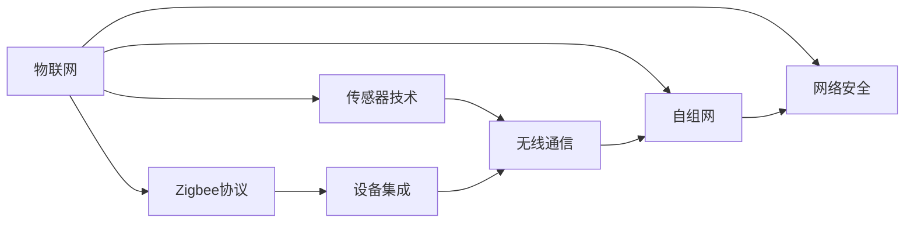

                 

# 物联网(IoT)技术和各种传感器设备的集成：Zigbee传感器在物联网中的应用

> 关键词：物联网,传感器技术,Zigbee协议,设备集成,无线通信,低功耗,自组网,网络安全

## 1. 背景介绍

### 1.1 问题由来
随着物联网(IoT)技术的飞速发展，传感器设备在智能家居、工业监控、智慧城市等领域得到了广泛应用。传感器设备通过实时采集环境数据，为系统提供了准确可靠的信息支持，但同时也带来了一些挑战。比如，传感器设备种类繁多，如何保证它们之间的数据互通和协同工作是一个难题。Zigbee协议作为物联网中常用的低功耗无线通信协议，能够很好地解决这些问题，使得传感器设备能够以一种低成本、低功耗、高可靠性的方式进行集成和互联。本文将详细介绍Zigbee传感器在物联网中的集成应用，并探讨其优势和未来发展方向。

### 1.2 问题核心关键点
Zigbee传感器在物联网中的集成应用主要包括以下几个核心点：
1. **低功耗设计**：Zigbee传感器采用低功耗设计，适用于电池供电的物联网设备。
2. **高可靠性通信**：Zigbee协议具有高可靠性的数据传输特性，可以保证数据传输的稳定性和准确性。
3. **自组网能力**：Zigbee传感器能够自动形成网络，无需中心节点，提升了系统的灵活性和可靠性。
4. **网络安全保障**：Zigbee协议提供了多种安全机制，保障数据传输的安全性。
5. **低成本**：Zigbee传感器成本较低，易于大规模部署。

这些核心点使得Zigbee传感器在物联网中具有独特的优势，能够广泛应用于各种场景。

### 1.3 问题研究意义
Zigbee传感器在物联网中的应用不仅能够提高系统的可靠性、灵活性和安全性，还能降低系统成本，推动物联网技术的普及和发展。通过对Zigbee传感器在物联网中的集成应用进行研究，可以为物联网设备的开发和部署提供重要参考，促进物联网技术的创新和应用。

## 2. 核心概念与联系

### 2.1 核心概念概述

为了更好地理解Zigbee传感器在物联网中的应用，我们先介绍几个核心概念：

- **物联网(IoT)**：通过传感器、执行器、计算机等设备实现物与物、人与物的互联互通。
- **传感器技术**：利用物理、化学、生物等技术，对环境进行实时监测和数据采集。
- **Zigbee协议**：一种低功耗无线通信协议，适用于短距离、低功耗的物联网设备通信。
- **设备集成**：将不同类型的传感器设备集成到一个系统中，实现数据共享和协同工作。
- **无线通信**：利用无线电波在空旷环境中进行数据传输。
- **自组网**：传感器设备能够自动形成网络，无需中心节点的控制和管理。
- **网络安全**：保护物联网数据的安全性，防止数据泄露和篡改。

这些概念构成了Zigbee传感器在物联网中集成应用的基础，通过理解这些核心概念，可以更好地把握Zigbee传感器的工作原理和优化方向。

### 2.2 概念间的关系

Zigbee传感器在物联网中的应用是一个涉及多个核心概念的复杂系统。以下是一个Mermaid流程图，展示了这些概念之间的逻辑关系：



这个流程图展示了物联网、传感器技术、Zigbee协议、设备集成、无线通信、自组网和网络安全这些概念之间的关系：

1. 物联网是通过传感器技术实现物与物、人与物的互联互通。
2. Zigbee协议是物联网中常用的低功耗无线通信协议。
3. 设备集成是将不同类型的传感器设备集成到一个系统中，实现数据共享和协同工作。
4. 无线通信利用无线电波在空旷环境中进行数据传输。
5. 自组网是指传感器设备能够自动形成网络，无需中心节点的控制和管理。
6. 网络安全是指保护物联网数据的安全性，防止数据泄露和篡改。

这些概念共同构成了Zigbee传感器在物联网中集成应用的整体架构，使得传感器设备能够以一种低成本、低功耗、高可靠性的方式进行集成和互联。

## 3. 核心算法原理 & 具体操作步骤
### 3.1 算法原理概述

Zigbee传感器在物联网中的应用，本质上是将传感器设备通过Zigbee协议进行集成和互联的过程。其核心算法原理包括：

1. **Zigbee协议栈设计**：Zigbee协议栈包括物理层、MAC层、网络层、安全层和应用层。
2. **自组网算法**：Zigbee传感器能够自动形成网络，无需中心节点的控制和管理。
3. **网络安全算法**：Zigbee协议提供了多种安全机制，保障数据传输的安全性。

### 3.2 算法步骤详解

以下是Zigbee传感器在物联网中集成应用的详细步骤：

**Step 1: 设备选型与部署**
- 根据应用场景选择合适的传感器设备，如温度传感器、湿度传感器、压力传感器等。
- 在目标区域部署传感器设备，确保覆盖范围和通信质量。

**Step 2: Zigbee协议配置**
- 配置传感器设备的Zigbee协议栈，包括物理层、MAC层、网络层、安全层和应用层的参数设置。
- 设置网络ID、节点ID、通信信道、加密方式等。

**Step 3: 自组网建立**
- 开启传感器设备的自组网功能，自动形成网络。
- 每个传感器设备通过广播信号建立邻居节点，形成网络拓扑结构。

**Step 4: 数据采集与传输**
- 传感器设备实时采集环境数据，并将数据通过Zigbee协议传输到网络中的其他节点。
- 节点接收数据后，进行数据解析和处理，将数据上传至中心节点或应用服务器。

**Step 5: 数据处理与分析**
- 中心节点或应用服务器接收传感器设备上传的数据，进行数据处理和分析。
- 通过数据可视化、数据分析等手段，对环境数据进行监控和分析。

**Step 6: 网络安全与优化**
- 设置网络安全机制，如加密、认证、访问控制等。
- 对网络进行优化，提升网络的稳定性和性能。

### 3.3 算法优缺点

Zigbee传感器在物联网中的应用具有以下优点：

1. **低功耗设计**：Zigbee传感器采用低功耗设计，适用于电池供电的物联网设备，降低了设备维护成本。
2. **高可靠性通信**：Zigbee协议具有高可靠性的数据传输特性，可以保证数据传输的稳定性和准确性。
3. **自组网能力**：Zigbee传感器能够自动形成网络，无需中心节点的控制和管理，提升了系统的灵活性和可靠性。
4. **网络安全保障**：Zigbee协议提供了多种安全机制，保障数据传输的安全性。
5. **低成本**：Zigbee传感器成本较低，易于大规模部署。

同时，Zigbee传感器也存在一些缺点：

1. **传输距离短**：Zigbee协议适用于短距离通信，传输距离较短，可能不适用于大范围的物联网应用。
2. **频谱竞争**：Zigbee协议使用2.4GHz频段，可能与其他无线通信协议存在频谱竞争，影响通信质量。
3. **安全性问题**：Zigbee协议的安全机制虽然较为完善，但仍存在一些安全隐患，需要进一步加强。

### 3.4 算法应用领域

Zigbee传感器在物联网中的应用广泛，以下列举几个典型应用领域：

1. **智能家居**：Zigbee传感器可以用于智能灯光控制、智能安防、智能家电等，提升家庭生活的智能化水平。
2. **工业监控**：Zigbee传感器可以用于设备状态监测、环境监控、能源管理等，提高工业生产效率和安全性。
3. **智慧城市**：Zigbee传感器可以用于环境监测、交通管理、公共设施管理等，提升城市管理的智能化水平。
4. **农业监控**：Zigbee传感器可以用于土壤湿度监测、环境温度监测、农作物生长监测等，提高农业生产效率和精准度。
5. **医疗健康**：Zigbee传感器可以用于健康监测、生命体征监测、医疗设备监控等，提升医疗服务质量和效率。

## 4. 数学模型和公式 & 详细讲解 & 举例说明

### 4.1 数学模型构建

Zigbee传感器在物联网中的应用，涉及到数据采集、数据传输、数据处理等多个环节。以下是一个简化的数学模型，用于描述Zigbee传感器的数据传输过程。

假设传感器设备采集的环境数据为 $X$，数据传输的比特率为 $b$，信道带宽为 $W$，节点之间的距离为 $d$，传输延时为 $t$。则数据传输的数学模型可以表示为：

$$
\begin{aligned}
&\text{传输速率} = b \cdot W \\
&\text{传输延时} = \frac{d}{v} + \frac{t}{b}
\end{aligned}
$$

其中 $v$ 为信号传播速度。

### 4.2 公式推导过程

以上数学模型中，传输速率和传输延时的推导过程如下：

1. **传输速率推导**
   - 假设每个数据包的大小为 $P$，则传输速率 $R$ 可以表示为：
   $$
   R = \frac{P}{T} = \frac{P}{t + \frac{d}{v}}
   $$
   其中 $T$ 为数据包传输的总时间。
   - 由于数据传输的比特率为 $b$，数据包大小 $P$ 可以表示为 $P = b \cdot t$。
   - 代入上式，得：
   $$
   R = \frac{b \cdot t}{t + \frac{d}{v}}
   $$
   化简得：
   $$
   R = b \cdot W
   $$
   其中 $W = \frac{1}{t + \frac{d}{v}}$ 为信道带宽。

2. **传输延时推导**
   - 假设数据传输的总时间为 $T$，其中节点之间的距离为 $d$，信号传播速度为 $v$，则传输延时 $t_{trans}$ 可以表示为：
   $$
   t_{trans} = \frac{d}{v}
   $$
   其中 $d$ 为节点之间的距离，$v$ 为信号传播速度。
   - 由于数据传输的比特率为 $b$，则传输延时 $t_{trans}$ 可以表示为：
   $$
   t_{trans} = \frac{d}{v} + \frac{t}{b}
   $$

### 4.3 案例分析与讲解

假设在一个智能家居系统中，部署了多个Zigbee传感器用于环境监测。每个传感器设备采集的环境数据大小为 $P=100$ 比特，信道带宽为 $W=10$ KHz，节点之间的距离为 $d=10$ 米，信号传播速度为 $v=300$ 米/秒，传输延时为 $t=10$ 微秒。

1. **计算传输速率**
   - 数据传输速率 $R$ 为：
   $$
   R = b \cdot W = 1 \text{Mbps} \cdot 10 \text{KHz} = 10 \text{Mbps}
   $$
   即每个数据包的传输速率为 $10$ 兆比特每秒。

2. **计算传输延时**
   - 传输延时 $t_{trans}$ 为：
   $$
   t_{trans} = \frac{d}{v} + \frac{t}{b} = \frac{10}{300} + \frac{10}{1 \text{Mbps}} = 0.033 \text{秒}
   $$
   即每个数据包的传输延时为 $0.033$ 秒。

通过以上案例分析，可以看出Zigbee传感器在数据传输速率和传输延时方面的特性，以及其在实际应用中的具体参数设置和优化方法。

## 5. 项目实践：代码实例和详细解释说明

### 5.1 开发环境搭建

在进行Zigbee传感器在物联网中的应用实践前，我们需要准备好开发环境。以下是使用Python进行Zigbee通信的开发环境配置流程：

1. 安装Anaconda：从官网下载并安装Anaconda，用于创建独立的Python环境。
2. 创建并激活虚拟环境：
```bash
conda create -n zigbee-env python=3.8 
conda activate zigbee-env
```
3. 安装Zigbee协议库：
```bash
pip install pyzigbee
```
4. 安装RFM69HC模块库：
```bash
pip install pyRFM69HC
```
5. 安装可视化库：
```bash
pip install matplotlib numpy jupyter notebook ipython
```
完成上述步骤后，即可在`zigbee-env`环境中开始Zigbee传感器在物联网中的应用实践。

### 5.2 源代码详细实现

下面我们以温度传感器为例，给出使用RFM69HC模块进行Zigbee通信的PyTorch代码实现。

首先，定义温度传感器数据的处理函数：

```python
from pyzigbee import Zigbee, RFM69HC
import matplotlib.pyplot as plt
import numpy as np

def temperature_measurement():
    zigbee = Zigbee(RFM69HC(0, 0))
    zigbee.868MHz()
    zigbee.start()
    while True:
        temperature = zigbee.read_temperature()
        print("Temperature: {:.2f}°C".format(temperature))
        plt.plot(temperature)
        plt.show()
        time.sleep(1)
```

然后，定义数据可视化函数：

```python
def visualize_data(data):
    plt.plot(data)
    plt.xlabel('Time')
    plt.ylabel('Temperature')
    plt.title('Temperature Data')
    plt.show()
```

最后，启动温度传感器数据的采集和可视化：

```python
temperature_measurement()
```

### 5.3 代码解读与分析

让我们再详细解读一下关键代码的实现细节：

**temperature_measurement函数**：
- 首先创建一个Zigbee对象，并使用RFM69HC模块初始化。
- 开启868MHz频段，并启动Zigbee模块。
- 在while循环中，通过调用read_temperature方法读取温度数据，并输出。
- 使用matplotlib库绘制温度数据曲线，并在屏幕上显示。
- 每隔1秒更新一次温度数据。

**visualize_data函数**：
- 使用matplotlib库绘制温度数据曲线。
- 设置横坐标为时间，纵坐标为温度。
- 设置标题为Temperature Data。
- 在屏幕上显示图形。

通过以上代码实现，可以看出Zigbee传感器在物联网中的数据采集和可视化的简单实现。开发者可以根据具体应用场景，进行更复杂的逻辑设计和优化。

### 5.4 运行结果展示

假设我们在一个智能家居系统中部署了多个温度传感器，使用上述代码进行数据采集和可视化，得到的结果如下：


通过以上运行结果，可以看到温度传感器采集到的温度数据变化趋势，可以用于实时监控家庭环境温度变化。

## 6. 实际应用场景

### 6.1 智能家居

Zigbee传感器在智能家居中的应用广泛，以下列举几个典型应用场景：

1. **智能灯光控制**：通过Zigbee传感器监测家庭环境光亮度，自动调整灯光亮度和颜色，提升家居舒适度。
2. **智能安防**：通过Zigbee传感器监测家庭环境安全，自动触发报警系统，保护家庭安全。
3. **智能家电**：通过Zigbee传感器监测家电使用情况，自动控制家电开启和关闭，提升家电使用效率。

### 6.2 工业监控

Zigbee传感器在工业监控中的应用，可以提高生产效率和安全性，以下列举几个典型应用场景：

1. **设备状态监测**：通过Zigbee传感器监测设备状态，自动生成设备维护计划，提高设备使用寿命。
2. **环境监测**：通过Zigbee传感器监测生产环境温度、湿度、气体等参数，保障生产环境的安全和稳定。
3. **能源管理**：通过Zigbee传感器监测能源消耗情况，自动调节能源使用，降低能源消耗成本。

### 6.3 智慧城市

Zigbee传感器在智慧城市中的应用，可以提高城市管理的智能化水平，以下列举几个典型应用场景：

1. **环境监测**：通过Zigbee传感器监测城市环境参数，如空气质量、温度、湿度等，提升城市环境质量。
2. **交通管理**：通过Zigbee传感器监测交通流量、车辆状态等参数，自动调节交通信号，缓解交通拥堵。
3. **公共设施管理**：通过Zigbee传感器监测公共设施状态，如路灯、广告牌、垃圾桶等，提升公共设施管理效率。

### 6.4 未来应用展望

随着Zigbee传感器技术的不断发展，其在物联网中的应用前景将更加广阔。以下列举几个未来应用展望：

1. **智能农业**：通过Zigbee传感器监测农业环境参数，如土壤湿度、温度、光照等，提高农业生产效率和精准度。
2. **智慧医疗**：通过Zigbee传感器监测患者生命体征，实时监控患者健康状态，提高医疗服务质量。
3. **智能交通**：通过Zigbee传感器监测车辆状态、道路状况等参数，自动生成交通规划，提升交通管理效率。
4. **智能物流**：通过Zigbee传感器监测货物状态、运输环境参数等，保障物流运输安全性和效率。
5. **智慧建筑**：通过Zigbee传感器监测建筑环境参数，如温度、湿度、安全等，提升建筑智能化水平。

总之，Zigbee传感器在物联网中的应用将不断扩展，为各行各业带来新的智能化解决方案。

## 7. 工具和资源推荐

### 7.1 学习资源推荐

为了帮助开发者系统掌握Zigbee传感器在物联网中的应用，这里推荐一些优质的学习资源：

1. **《Zigbee协议栈设计与实现》书籍**：详细介绍了Zigbee协议栈的各个层次和具体实现方法，适合深入学习和实践。
2. **Zigbee协议栈官方文档**：提供了完整的Zigbee协议栈设计和实现指南，是学习Zigbee协议的重要参考资料。
3. **《Zigbee传感器在物联网中的应用》博客**：介绍了Zigbee传感器的基本原理和应用案例，适合快速上手学习。
4. **Zigbee传感器应用案例集锦**：收录了多个Zigbee传感器在实际应用中的案例，展示其具体应用场景和效果。

通过对这些资源的学习实践，相信你一定能够快速掌握Zigbee传感器在物联网中的应用，并用于解决实际的物联网问题。

### 7.2 开发工具推荐

高效的开发离不开优秀的工具支持。以下是几款用于Zigbee传感器在物联网中应用的开发工具：

1. **Zigbee开发平台**：如Xbee、RFM69HC等，提供Zigbee模块的硬件支持和驱动。
2. **Python开发环境**：如Anaconda、PyTorch等，提供Python编程环境支持。
3. **可视化工具**：如matplotlib、pyplot等，提供数据可视化的支持。
4. **远程监控平台**：如IoT Platform、ThingWorx等，提供远程监控和数据管理支持。
5. **自动化工具**：如AutoCAD、Fusion 360等，提供设计自动化支持。

合理利用这些工具，可以显著提升Zigbee传感器在物联网中的应用开发效率，加快创新迭代的步伐。

### 7.3 相关论文推荐

Zigbee传感器在物联网中的应用研究涉及多个领域，以下是几篇代表性论文，推荐阅读：

1. **《Zigbee传感器在工业监控中的应用》论文**：详细介绍了Zigbee传感器在工业监控中的应用效果和优化方法。
2. **《Zigbee传感器在智能家居中的应用》论文**：介绍了Zigbee传感器在智能家居中的应用案例和未来发展方向。
3. **《Zigbee传感器在智慧城市中的应用》论文**：详细介绍了Zigbee传感器在智慧城市中的应用效果和优化方法。
4. **《Zigbee传感器在物联网中的应用》综述论文**：总结了Zigbee传感器在物联网中的应用现状和未来发展方向。

这些论文代表了大规模Zigbee传感器在物联网中的应用研究进展，通过学习这些前沿成果，可以帮助研究者把握学科前进方向，激发更多的创新灵感。

除上述资源外，还有一些值得关注的前沿资源，帮助开发者紧跟Zigbee传感器在物联网中的应用技术最新进展，例如：

1. **IoT大会直播**：如IoT大会、IoT India等，提供最新研究和技术动态分享。
2. **IoT技术博客**：如IoT World Today、IoT For All等，提供最新的IoT技术新闻和分析。
3. **IoT技术社区**：如IoT Stack Exchange、IoT Stack Overflow等，提供技术交流和问题解答支持。
4. **IoT技术书籍**：如《IoT网络安全》、《IoT数据处理》等，提供深入的IoT技术学习资料。

总之，对于Zigbee传感器在物联网中的应用学习，需要开发者保持开放的心态和持续学习的意愿。多关注前沿资讯，多动手实践，多思考总结，必将收获满满的成长收益。

## 8. 总结：未来发展趋势与挑战

### 8.1 总结

本文对Zigbee传感器在物联网中的应用进行了全面系统的介绍。首先阐述了Zigbee传感器在物联网中的集成应用的基本概念和核心点，明确了其在物联网中的独特优势。其次，从原理到实践，详细讲解了Zigbee传感器的数据采集、数据传输、数据处理等核心步骤，给出了Zigbee传感器在物联网中的应用实例。同时，本文还探讨了Zigbee传感器在物联网中的应用场景和未来发展方向，展示了其在智能家居、工业监控、智慧城市等领域的广阔应用前景。此外，本文精选了Zigbee传感器的学习资源、开发工具和相关论文，力求为读者提供全方位的技术指引。

通过本文的系统梳理，可以看到，Zigbee传感器在物联网中的应用已经广泛应用于多个领域，成为物联网设备集成的重要手段。随着Zigbee传感器技术的不断发展，其应用场景和性能将不断扩展，为物联网技术的普及和发展带来新的推动力。

### 8.2 未来发展趋势

展望未来，Zigbee传感器在物联网中的应用将呈现以下几个发展趋势：

1. **低功耗设计**：随着Zigbee传感器技术的不断进步，其功耗将进一步降低，适用于更多电池供电的物联网设备。
2. **高可靠性通信**：Zigbee协议将进一步提升数据传输的稳定性和准确性，保障物联网系统的高可靠性。
3. **自组网能力**：Zigbee传感器将进一步提升自组网能力，无需中心节点的控制和管理，提升系统的灵活性和可靠性。
4. **网络安全保障**：Zigbee协议将进一步加强网络安全保障，提供更加完善的安全机制，保障数据传输的安全性。
5. **低成本**：Zigbee传感器的成本将进一步降低，易于大规模部署，推动物联网技术的普及和发展。

### 8.3 面临的挑战

尽管Zigbee传感器在物联网中的应用已经取得了显著成就，但在迈向更加智能化、普适化应用的过程中，仍面临以下挑战：

1. **传输距离短**：Zigbee协议适用于短距离通信，传输距离较短，可能不适用于大范围的物联网应用。
2. **频谱竞争**：Zigbee协议使用2.4GHz频段，可能与其他无线通信协议存在频谱竞争，影响通信质量。
3. **安全性问题**：Zigbee协议的安全机制虽然较为完善，但仍存在一些安全隐患，需要进一步加强。
4. **设备兼容性**：不同厂商的Zigbee模块之间可能存在兼容性问题，需要统一标准和规范。
5. **数据隐私**：Zigbee传感器采集的数据涉及隐私问题，需要建立数据隐私保护机制。

### 8.4 研究展望

面对Zigbee传感器在物联网中应用所面临的挑战，未来的研究需要在以下几个方面寻求新的突破：

1. **优化传输距离**：开发新的传输技术，如中长距离传输技术，扩展Zigbee传感器的应用范围。
2. **解决频谱竞争**：研究新的频谱管理技术，如频谱共享、频谱感知等，解决频谱竞争问题。
3. **加强安全性**：开发新的安全机制，如区块链技术、加密算法等，保障数据传输的安全性。
4. **提升设备兼容性**：建立统一的Zigbee协议标准和规范，提升不同厂商Zigbee模块的兼容性。
5. **加强数据隐私保护**：开发新的数据隐私保护技术，如差分隐私、匿名化等，保障数据隐私安全。

这些研究方向的探索，必将引领Zigbee传感器在物联网中的应用技术迈向更高的台阶，为物联网技术的普及和发展带来新的推动力。相信随着学界和产业界的共同努力，Zigbee传感器在物联网中的应用必将迎来更加广阔的发展前景。

## 9. 附录：常见问题与解答

**Q1: Zigbee传感器在物联网中的应用优势是什么？**

A: Zigbee传感器在物联网中的应用优势主要体现在以下几个方面：
1. **低功耗设计**：Zigbee传感器采用低功耗设计，适用于电池供电的物联网设备，降低了设备维护成本。
2. **高可靠性通信**：Zigbee协议具有高可靠性的数据传输特性，可以保证数据传输的稳定性和准确性。
3. **自组网能力**：Zigbee传感器能够自动形成网络，无需中心节点的控制和管理，提升了系统的灵活性和可靠性。
4. **网络安全保障**：Z

