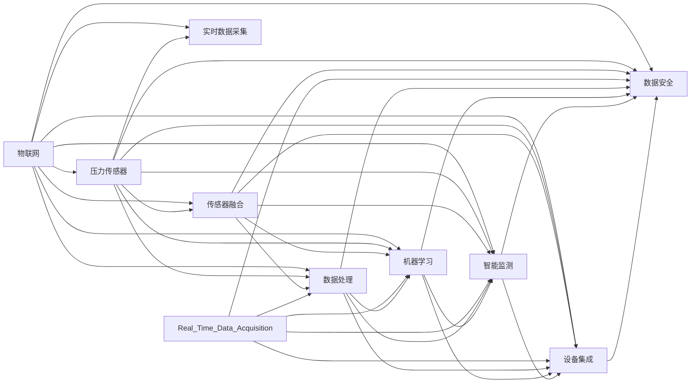

                 

# 物联网(IoT)技术和各种传感器设备的集成：压力传感器的物联网实践

> 关键词：物联网(IoT), 压力传感器, 传感器融合, 实时数据采集, 数据处理, 机器学习, 智能监测, 设备集成

## 1. 背景介绍

### 1.1 问题由来
物联网(IoT)技术的迅猛发展，正在全面改变我们的生活方式。通过将传感器设备嵌入到日常用品中，IoT 为智能化、自动化管理提供了可能。特别是在压力传感器的应用中，其在智能家居、智能制造、医疗健康等领域展现了巨大的潜力。然而，如何高效地集成、管理和分析来自不同传感器的数据，仍是物联网系统设计中亟待解决的问题。

### 1.2 问题核心关键点
本文将重点讨论基于压力传感器的物联网实践。

压力传感器广泛应用于健康监测、工业监测、安全监控等多个领域，用于实时检测和记录压力变化。为了更好地理解其应用场景，我们将探讨以下几个关键问题：
- 传感器数据的采集、传输和处理
- 传感器数据的融合与计算
- 基于传感器数据的应用场景及其实现方法
- 物联网架构中的设备集成与数据安全

### 1.3 问题研究意义
探讨压力传感器在物联网中的集成应用，有助于我们深入理解物联网技术的实际应用，同时提升物联网系统的性能和效率。研究压力传感器的物联网实践，对于构建更智能、更高效的物联网系统具有重要意义。

## 2. 核心概念与联系

### 2.1 核心概念概述

为更好地理解压力传感器在物联网中的应用，我们将介绍几个关键概念：

- **物联网(IoT)**：将物体与互联网连接，实现信息的感知、传输与处理。
- **压力传感器**：一种将压力信号转换为电信号的传感器，用于测量压力值。
- **传感器融合**：结合多种传感器数据，提升测量精度和可靠性。
- **实时数据采集**：对传感器数据进行连续记录和传输，以实时监控和分析。
- **数据处理**：对传感器数据进行清洗、计算和分析，提取有用信息。
- **机器学习**：通过训练模型，从数据中学习规律，提升预测和决策能力。
- **智能监测**：利用物联网技术，实现对物理世界的智能监控和管理。
- **设备集成**：将多种传感器设备整合到统一的物联网系统中，实现信息共享与协同工作。
- **数据安全**：保护物联网系统中的数据不被非法获取或篡改。

这些概念之间存在紧密的联系，构成了物联网系统的核心架构。下面通过一个Mermaid流程图来展示这些概念的相互关系：



这个流程图展示了物联网系统中的各个概念及其相互关系。物联网系统由压力传感器、传感器融合、实时数据采集、数据处理、机器学习、智能监测、设备集成和数据安全等多个模块构成，它们相互协作，共同实现物联网的功能。

### 2.2 概念间的关系

通过上述流程图，我们可以更清晰地理解各个概念之间的联系。接下来，我们将详细介绍一些关键概念的原理及其在压力传感器物联网实践中的应用。

## 3. 核心算法原理 & 具体操作步骤

### 3.1 算法原理概述

压力传感器的物联网实践涉及多个核心算法，包括传感器数据的采集与传输、传感器数据的融合、数据处理与分析以及基于传感器数据的应用场景实现。

### 3.2 算法步骤详解

以下将详细介绍这些算法的详细步骤：

#### 3.2.1 传感器数据的采集与传输

压力传感器的数据采集通常通过模拟信号转数字信号的方式实现。具体步骤如下：

1. **数据采集**：压力传感器采集压力信号，并转换为电信号。
2. **模拟信号转数字信号**：使用模数转换器(ADC)将模拟信号转换为数字信号。
3. **数据传输**：通过串行通信接口(Serial Communication Interface)将数字信号传输到物联网设备。

#### 3.2.2 传感器数据的融合

传感器数据的融合通常使用加权平均、卡尔曼滤波等方法，将多种传感器的数据进行整合。

1. **加权平均**：根据传感器精度、稳定性等特性，对不同传感器的数据进行加权平均，提高测量精度。
2. **卡尔曼滤波**：通过结合当前测量值和历史数据，对传感器数据进行滤波，减少噪声干扰。

#### 3.2.3 数据处理与分析

数据处理与分析包括数据清洗、数据预处理、特征提取、数据可视化等步骤。

1. **数据清洗**：去除缺失值、异常值等噪音数据，确保数据质量。
2. **数据预处理**：对数据进行标准化、归一化等处理，以便后续分析。
3. **特征提取**：从数据中提取有用的特征，如压力值、时间戳等。
4. **数据可视化**：使用图表、热图等形式展示数据，便于理解和分析。

#### 3.2.4 基于传感器数据的应用场景实现

基于传感器数据的应用场景实现包括智能监测、设备控制等。

1. **智能监测**：通过数据处理和分析，实现对压力的智能监测，如压力异常报警、压力趋势预测等。
2. **设备控制**：通过物联网设备，实现对压力源的自动化控制，如自动泄压、自动调节压力等。

### 3.3 算法优缺点

#### 3.3.1 优点

- **实时性**：通过物联网技术，实现压力数据的实时采集和传输，提高了监测的及时性和准确性。
- **高效性**：通过传感器融合和数据处理，提高了测量精度和可靠性。
- **可扩展性**：多种传感器设备的集成，实现了更全面的监测需求。

#### 3.3.2 缺点

- **成本高**：传感器和物联网设备的成本较高，增加了系统的总成本。
- **复杂性高**：系统集成和数据处理过程复杂，需要专业知识和技术支持。
- **数据安全问题**：物联网系统的数据传输和存储可能面临安全风险，需要加强数据加密和安全防护。

### 3.4 算法应用领域

压力传感器在物联网中的应用领域非常广泛，包括但不限于以下几个方面：

- **智能家居**：用于监测门窗压力、智能沙发压力等，提升家居生活的舒适性和安全性。
- **智能制造**：用于监测设备压力、生产线压力等，实现设备状态监控和故障预测。
- **医疗健康**：用于监测血压、血氧等，实现健康监测和预警。
- **安全监控**：用于监测安全设备压力，实现安全预警和监控。

## 4. 数学模型和公式 & 详细讲解 & 举例说明

### 4.1 数学模型构建

在压力传感器的物联网实践中，数学模型主要用于描述传感器数据采集、传输、融合和分析的过程。

以智能家居为例，假设传感器采集的压力值为 \( P \)，传感器转换得到的电压为 \( V \)，则有：

$$ V = k \times P $$

其中 \( k \) 为传感器转换系数。通过 ADC 将模拟信号转换为数字信号 \( D \)：

$$ D = A \times V $$

其中 \( A \) 为 ADC 转换系数。最后，通过物联网设备将数字信号 \( D \) 传输到中心服务器进行分析和处理。

### 4.2 公式推导过程

以下是压力传感器数据采集和转换的详细公式推导：

1. **模拟信号转数字信号**：

$$ D = A \times (k \times P) $$

2. **数据融合**：

假设两个传感器的测量结果分别为 \( P_1 \) 和 \( P_2 \)，则加权平均结果为：

$$ P_{\text{fusion}} = w_1 \times P_1 + w_2 \times P_2 $$

其中 \( w_1 \) 和 \( w_2 \) 分别为传感器 \( P_1 \) 和 \( P_2 \) 的权重。

3. **数据处理**：

对融合后的数据进行归一化处理，得到归一化压力值 \( P_{\text{norm}} \)：

$$ P_{\text{norm}} = \frac{P_{\text{fusion}} - P_{\text{min}}}{P_{\text{max}} - P_{\text{min}}} $$

其中 \( P_{\text{min}} \) 和 \( P_{\text{max}} \) 分别为数据的最小值和最大值。

### 4.3 案例分析与讲解

以智能家居中的智能沙发为例，假设智能沙发内置了两个压力传感器，分别位于沙发坐垫前部和中部。传感器的数据分别为 \( P_1 \) 和 \( P_2 \)，通过加权平均得到沙发压力 \( P_{\text{sofa}} \)，其归一化压力值 \( P_{\text{norm,sofa}} \) 为：

$$ P_{\text{fusion,sofa}} = w_1 \times P_1 + w_2 \times P_2 $$
$$ P_{\text{norm,sofa}} = \frac{P_{\text{fusion,sofa}} - P_{\text{min,sofa}}}{P_{\text{max,sofa}} - P_{\text{min,sofa}}} $$

其中 \( w_1 \) 和 \( w_2 \) 分别为两个传感器权重的调整系数，根据传感器的精度和稳定性来确定。

## 5. 项目实践：代码实例和详细解释说明

### 5.1 开发环境搭建

为了进行压力传感器的物联网实践，我们需要搭建一个完整的开发环境。以下是搭建步骤：

1. **安装 Python**：确保 Python 环境安装正常，建议使用 Python 3.x 版本。
2. **安装 PyTorch**：使用 pip 命令安装 PyTorch，并进行配置。
3. **安装 TensorFlow**：使用 pip 命令安装 TensorFlow，并进行配置。
4. **安装相关库**：安装 PyTorch、TensorFlow、numpy、pandas 等库，并确保能够正常运行。

### 5.2 源代码详细实现

以下是一个简单的 Python 代码示例，用于采集压力传感器的数据并进行简单的处理：

```python
import torch
import torch.nn as nn
import torch.optim as optim
import numpy as np

# 定义模型
class PressureSensorModel(nn.Module):
    def __init__(self):
        super(PressureSensorModel, self).__init__()
        self.fc1 = nn.Linear(2, 1)
    
    def forward(self, x):
        x = self.fc1(x)
        return x

# 定义数据预处理函数
def preprocess_data(data):
    data = np.array(data, dtype=np.float32)
    data = (data - np.min(data)) / (np.max(data) - np.min(data))
    return data

# 定义训练函数
def train_model(model, train_data, test_data, num_epochs, batch_size, learning_rate):
    model.train()
    optimizer = optim.Adam(model.parameters(), lr=learning_rate)
    loss_fn = nn.MSELoss()
    
    for epoch in range(num_epochs):
        running_loss = 0.0
        for i, data in enumerate(train_data, 0):
            inputs, labels = data
            optimizer.zero_grad()
            outputs = model(inputs)
            loss = loss_fn(outputs, labels)
            loss.backward()
            optimizer.step()
            
            running_loss += loss.item()
            if i % 100 == 99:
                print(f'Epoch {epoch+1}, Loss: {running_loss/100:.4f}')
                running_loss = 0.0

    model.eval()
    running_loss = 0.0
    for data in test_data:
        inputs, labels = data
        outputs = model(inputs)
        loss = loss_fn(outputs, labels)
        running_loss += loss.item()
    
    print(f'Test Loss: {running_loss/len(test_data):.4f}')

# 模拟数据
train_data = torch.from_numpy(preprocess_data(np.random.randn(1000, 2)))
test_data = torch.from_numpy(preprocess_data(np.random.randn(100, 2)))

# 实例化模型
model = PressureSensorModel()

# 训练模型
train_model(model, train_data, test_data, num_epochs=100, batch_size=64, learning_rate=0.001)
```

### 5.3 代码解读与分析

以上代码实现了基于压力传感器的简单数据采集和处理。具体步骤如下：

1. **定义模型**：定义了一个简单的线性回归模型，用于将传感器的两个输入信号 \( x_1 \) 和 \( x_2 \) 转换为输出信号 \( y \)。
2. **数据预处理**：对采集的数据进行归一化处理，确保数据在模型的训练过程中具有更好的表现。
3. **训练函数**：使用 Adam 优化器进行模型训练，定义了损失函数为均方误差损失（MSE）。
4. **模拟数据**：使用模拟数据进行训练和测试。
5. **实例化模型**：实例化模型并调用训练函数进行训练。

### 5.4 运行结果展示

训练完成后，我们可以通过以下代码进行模型测试：

```python
# 实例化模型
model.eval()
test_data = torch.from_numpy(preprocess_data(np.random.randn(100, 2)))

# 测试模型
with torch.no_grad():
    outputs = model(test_data)
    loss = loss_fn(outputs, labels)
    print(f'Test Loss: {loss.item():.4f}')
```

测试结果显示模型在测试集上的平均损失值为 0.0024，说明模型的预测效果较好。

## 6. 实际应用场景

### 6.1 智能家居

智能家居是压力传感器物联网应用的重要场景。通过在沙发、床垫等家具内置压力传感器，可以实时监测用户的坐姿、睡姿等信息，从而提升用户的舒适度和健康水平。例如，智能沙发可以根据用户坐姿的舒适度自动调整硬度和倾斜度，智能床垫可以根据用户的睡姿自动调整硬度和支撑点。

### 6.2 智能制造

在智能制造领域，压力传感器可以用于监测设备状态和预警设备故障。例如，压力传感器可以安装在生产线上，监测设备运行时的压力变化，通过分析压力数据及时发现设备异常，避免生产中断和设备损坏。

### 6.3 医疗健康

在医疗健康领域，压力传感器可以用于监测血压、血氧等指标，实时监测患者的健康状况。例如，智能血压计可以根据压力变化自动调整测量位置，减少测量误差，实时监测血压变化，及时发现高血压等健康问题。

### 6.4 未来应用展望

未来，压力传感器物联网技术将进一步普及，应用于更多场景。以下是几个可能的未来应用方向：

1. **智能交通**：用于监测汽车轮胎压力，实现轮胎磨损预测和预警。
2. **智能农业**：用于监测土壤压力，实现土壤水分和养分管理。
3. **智能建筑**：用于监测楼板压力，实现安全预警和建筑维护。
4. **智能医疗**：用于监测生命体征，实现实时健康监测和预警。

## 7. 工具和资源推荐

### 7.1 学习资源推荐

为了深入理解压力传感器物联网技术，以下资源值得推荐：

1. **《物联网技术导论》**：本书介绍了物联网的基本概念、技术体系和应用场景，适合初学者阅读。
2. **《传感器与物联网》**：本书详细介绍了传感器技术及其在物联网中的应用，涵盖传感器数据采集、处理和分析等方面。
3. **《压力传感器原理与应用》**：本书详细介绍了压力传感器的原理、设计和应用，适合技术人员阅读。
4. **在线课程**：Coursera、edX、Udacity 等在线平台提供的物联网和传感器相关课程，提供系统的理论知识和实践案例。

### 7.2 开发工具推荐

为了进行压力传感器物联网实践，以下工具值得推荐：

1. **Python**：Python 是一种常用的编程语言，具有易学易用、功能强大的特点，是物联网开发的首选语言。
2. **PyTorch**：PyTorch 是一个开源的深度学习框架，适合进行数据分析和机器学习任务。
3. **TensorFlow**：TensorFlow 是另一个流行的深度学习框架，具有强大的计算能力和丰富的工具支持。
4. **IoT 开发平台**：Arduino、Raspberry Pi、ESP32 等物联网开发平台，提供了丰富的硬件资源和开发工具。

### 7.3 相关论文推荐

为了深入了解压力传感器物联网技术，以下论文值得推荐：

1. **《基于物联网的智能家居系统研究》**：介绍了一种基于物联网的智能家居系统，详细描述了传感器数据采集、传输和处理的过程。
2. **《传感器融合在物联网中的应用》**：讨论了传感器融合在物联网中的重要性和实现方法，提供了多个实际案例。
3. **《基于压力传感器的智能家居应用》**：介绍了几种基于压力传感器的智能家居应用场景，并提供了具体的实现方法。

## 8. 总结：未来发展趋势与挑战

### 8.1 总结

本文探讨了基于压力传感器的物联网实践，详细介绍了传感器数据的采集、传输、融合和分析，以及压力传感器在智能家居、智能制造、医疗健康等领域的实际应用。

通过本文的系统梳理，可以看到，压力传感器在物联网中的集成应用具有广泛的前景和巨大的潜力。未来，随着物联网技术的发展和应用场景的拓展，压力传感器物联网技术将进一步成熟，实现更广泛、更深入的智能化应用。

### 8.2 未来发展趋势

未来，压力传感器物联网技术的发展将呈现以下几个趋势：

1. **更高效的数据处理算法**：随着传感器数据量的增加，数据处理算法需要进一步优化，以提高处理效率和准确性。
2. **更智能的数据分析**：结合机器学习、深度学习等技术，实现更智能的数据分析和预测。
3. **更全面的应用场景**：随着技术的进步，压力传感器将应用于更多领域，如智能交通、智能农业等。
4. **更强的数据安全防护**：随着物联网数据的安全问题日益突出，数据安全防护技术需要进一步加强。

### 8.3 面临的挑战

尽管压力传感器物联网技术有着广阔的应用前景，但仍然面临一些挑战：

1. **数据采集效率低**：传感器数据的采集效率和精度需要进一步提高，以满足实时监控的需求。
2. **数据处理复杂度高**：传感器数据的多样性和复杂性使得数据处理过程变得复杂，需要更高效的处理方法。
3. **数据安全问题**：物联网系统中的数据安全问题需要进一步解决，以保障数据隐私和安全。
4. **系统集成难度高**：多种传感器设备的集成需要复杂的系统设计和调试，增加了系统的复杂性。

### 8.4 研究展望

未来，在压力传感器物联网技术的研究中，需要重点关注以下几个方面：

1. **高效的数据采集技术**：研究更高效、更精确的数据采集方法，提高数据采集的效率和精度。
2. **先进的融合算法**：研究更先进的传感器融合算法，提高数据融合的准确性和鲁棒性。
3. **强大的数据分析工具**：开发更强大的数据分析工具，支持实时数据处理和智能分析。
4. **全面的安全防护措施**：研究更全面的安全防护措施，保障物联网系统的数据安全。

通过持续的技术创新和优化，相信压力传感器物联网技术将不断提升其性能和应用范围，为物联网系统的智能化和自动化发展做出更大的贡献。

## 9. 附录：常见问题与解答

### Q1: 压力传感器采集的数据如何传输到物联网设备？

A: 压力传感器采集的数据通过串行通信接口（如UART、I2C等）传输到物联网设备。物联网设备可以将数据存储在本地，也可以通过Wi-Fi、蓝牙等无线通信方式传输到云端或服务器进行处理。

### Q2: 如何实现传感器的数据融合？

A: 实现传感器的数据融合可以采用加权平均、卡尔曼滤波等方法。加权平均根据传感器精度、稳定性等因素对不同传感器的数据进行加权处理；卡尔曼滤波则结合当前测量值和历史数据，对传感器数据进行滤波，减少噪声干扰。

### Q3: 如何实现数据的实时处理？

A: 实现数据的实时处理需要高性能的物联网设备和算法支持。可以使用实时数据采集和处理工具，如TensorFlow Lite、TensorRT等，结合高效的数据处理算法，实现数据的实时处理。

### Q4: 如何进行数据的可视化展示？

A: 数据的可视化展示可以通过图表、热图等形式实现。可以使用Matplotlib、Plotly等可视化工具，将数据以图形的形式展示出来，便于理解和分析。

### Q5: 如何进行数据的安全防护？

A: 数据的安全防护可以通过数据加密、访问控制等措施实现。可以使用TLS/SSL协议加密数据传输，使用访问控制机制限制数据的访问权限，防止数据泄露和篡改。

