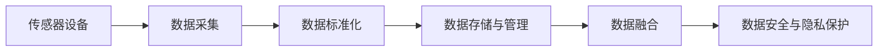
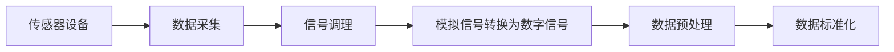
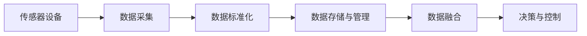
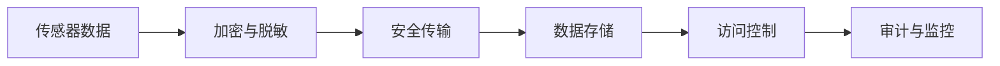
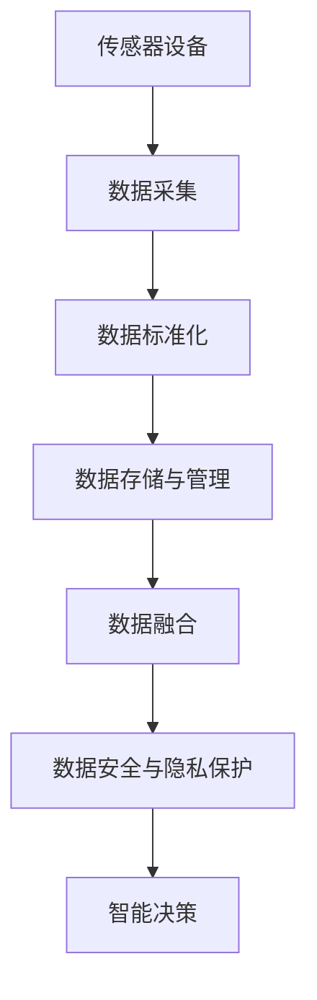

                 

# 物联网(IoT)技术和各种传感器设备的集成：概要与基础

## 1. 背景介绍

### 1.1 问题由来

随着物联网(IoT)技术的迅猛发展，各种传感器设备在智能制造、智慧城市、医疗健康、智能家居等领域的应用日益广泛。传感器设备能够实时采集环境数据，为智能系统的决策提供精准的信息支撑。然而，传感器数据的多样性和异构性，使得设备间的数据融合和信息共享成为一大难题。

传感器设备通常具有不同的通信协议、数据格式和更新速率，如何高效地集成各种传感器设备，并实现数据的实时处理和分析，是当前物联网技术面临的主要挑战之一。

### 1.2 问题核心关键点

1. **传感器数据采集**：传感器设备通过不同的方式采集环境数据，如温度、湿度、压力、光线等，数据采集方式包括直接读取和模拟信号转换。
2. **数据标准化与互操作性**：各种传感器数据具有不同的协议和格式，需要将其转换为标准格式，以实现不同设备间的互操作性。
3. **数据存储与管理**：传感器数据通常具有海量的、实时更新的特点，需要高效的数据存储和管理机制。
4. **数据融合与决策**：将来自多个传感器设备的数据进行融合，生成全局性的决策信息，是智能系统的关键环节。
5. **数据安全与隐私保护**：传感器数据的敏感性，使其在传输和存储过程中面临安全风险和隐私问题。

### 1.3 问题研究意义

传感器设备的集成与数据融合是实现物联网智能化、高效化和安全化的重要基础。通过对传感器数据的高效采集、标准化、存储和分析，可以实现对环境变化的实时监测和智能决策，提升生产效率，降低运营成本，同时保护用户隐私，确保数据安全。因此，研究传感器设备的集成与数据融合技术，对于推动物联网技术的应用和发展具有重要意义。

## 2. 核心概念与联系

### 2.1 核心概念概述

为更好地理解传感器设备和数据融合的集成过程，本节将介绍几个关键概念及其之间的关系：

- **传感器设备**：用于感知环境物理量，如温度、湿度、光线等，具有独立的测量单元和数据处理能力。
- **数据标准化**：将不同传感器设备采集的数据转换为统一的标准格式，以实现数据间的互操作性。
- **数据存储与管理**：采用高效的数据存储和管理系统，确保传感器数据的实时存储和高效访问。
- **数据融合**：将来自多个传感器设备的数据进行融合，生成综合性的决策信息。
- **数据安全与隐私保护**：在数据采集、传输和存储过程中，采取加密、访问控制等措施，保障数据安全与隐私。

这些概念之间的逻辑关系可以通过以下Mermaid流程图来展示：



这个流程图展示了传感器设备到数据融合的全过程，其中数据标准化、数据存储与管理、数据安全与隐私保护是数据融合的关键支撑环节。通过这个流程图，可以清晰地理解传感器设备集成与数据融合的整体流程。

### 2.2 概念间的关系

这些核心概念之间存在着紧密的联系，形成了物联网传感器设备集成的完整框架。下面我通过几个Mermaid流程图来展示这些概念之间的关系。

#### 2.2.1 数据采集与处理流程



这个流程图展示了从传感器设备到数据标准化的基本流程，其中数据采集、信号调理、模拟信号转换和数据预处理是传感器数据处理的必要步骤。

#### 2.2.2 数据融合与决策过程



这个流程图展示了从传感器数据采集到决策与控制的全过程，其中数据标准化、数据存储与管理、数据融合和决策与控制是实现智能系统决策的关键步骤。

#### 2.2.3 数据安全与隐私保护



这个流程图展示了传感器数据在传输、存储和访问过程中，如何通过加密、访问控制等手段保障数据安全与隐私。

### 2.3 核心概念的整体架构

最后，我们用一个综合的流程图来展示传感器设备集成与数据融合的整体架构：



这个综合流程图展示了从传感器数据采集到智能决策的全过程，其中数据标准化、数据存储与管理、数据融合和数据安全与隐私保护是实现智能决策的关键支撑环节。

## 3. 核心算法原理 & 具体操作步骤
### 3.1 算法原理概述

传感器设备的集成与数据融合，本质上是一个多源数据的融合与决策过程。其核心思想是通过对传感器数据的采集、标准化、存储和融合，生成全局性的决策信息，以支持智能系统的运行。

假设传感器数据采集单元为 $S_1, S_2, ..., S_n$，其输出分别为 $y_1, y_2, ..., y_n$。则数据融合的目标是找到一个最优的融合算法 $F$，使得融合后的结果 $y_{fusion}$ 尽可能接近真实值 $y_{true}$，即：

$$
y_{fusion} = F(y_1, y_2, ..., y_n)
$$

其中 $F$ 可以采用加权平均、最小二乘、加权最小二乘等融合算法，具体选择取决于数据的特点和应用场景。

### 3.2 算法步骤详解

基于上述融合目标，传感器数据的集成与融合过程一般包括以下几个关键步骤：

**Step 1: 数据采集与预处理**

- 使用各种传感器设备采集环境数据。
- 对采集到的模拟信号进行调理和转换，得到数字信号。
- 对数据进行预处理，如滤波、去噪、归一化等，以提高数据质量。

**Step 2: 数据标准化**

- 将来自不同传感器设备的数据转换为标准格式，如时间序列数据、向量数据等。
- 定义数据格式和协议，确保不同设备的数据能够互操作。
- 在数据标准化过程中，采用数据格式转换、协议转换等方法，实现数据的无缝集成。

**Step 3: 数据存储与管理**

- 采用高效的数据存储系统，如数据库、文件系统等，存储传感器数据。
- 实现数据的高效索引、查询和访问，以支持实时数据的读取和分析。
- 采用数据分区、缓存等技术，提高数据读取和存储的效率。

**Step 4: 数据融合**

- 采用加权平均、最小二乘、卡尔曼滤波等算法，对不同传感器数据进行融合。
- 根据数据的重要性和可靠性，设定不同权重的融合算法，确保融合结果的准确性。
- 采用分布式数据融合算法，提高数据融合的效率和可靠性。

**Step 5: 决策与控制**

- 根据融合后的数据，生成全局性的决策信息，如环境监测、设备控制等。
- 根据决策结果，驱动智能系统的运行，实现自动化的智能决策。

**Step 6: 数据安全与隐私保护**

- 在数据传输过程中，采用加密和访问控制等技术，保障数据安全。
- 对数据进行脱敏处理，确保用户隐私不被泄露。
- 定期审计和监控数据访问记录，防止数据泄露和非法使用。

### 3.3 算法优缺点

传感器设备的集成与数据融合算法具有以下优点：

1. **实时性**：通过高效的数据存储和管理，能够实现传感器数据的实时采集和处理。
2. **准确性**：通过合理的融合算法，能够提高数据融合的准确性和可靠性。
3. **互操作性**：通过数据标准化，实现不同传感器设备间的互操作性。
4. **安全性**：通过数据加密和访问控制，保障传感器数据的安全和隐私。

然而，该算法也存在一些缺点：

1. **复杂性**：数据采集、标准化、存储、融合和决策过程较为复杂，需要大量的技术实现。
2. **资源消耗**：高效的数据存储和处理需要大量的计算资源和存储空间。
3. **数据异构性**：不同传感器数据具有不同的特性和格式，数据标准化和融合过程可能较为困难。
4. **延迟问题**：传感器数据的实时性和低延迟要求，可能导致数据融合过程的延迟。

### 3.4 算法应用领域

传感器设备的集成与数据融合技术在多个领域得到了广泛应用，例如：

- **智能制造**：通过集成各种传感器设备，实现对生产设备的实时监测和控制，提高生产效率和产品质量。
- **智慧城市**：将传感器设备应用于城市环境监测、交通管理、能源管理等领域，提升城市治理水平。
- **医疗健康**：通过传感器设备监测患者生理指标，实现实时健康监测和智能医疗决策。
- **智能家居**：实现对家庭环境温度、湿度、光线等的智能监测和控制，提升家庭生活品质。

## 4. 数学模型和公式 & 详细讲解 & 举例说明

### 4.1 数学模型构建

传感器数据的集成与融合过程，可以通过数学模型进行严格建模。假设传感器数据 $y$ 服从高斯分布 $N(\mu, \sigma^2)$，其中 $\mu$ 为数据均值，$\sigma^2$ 为数据方差。则融合后的数据 $y_{fusion}$ 也可以表示为高斯分布，其均值 $\mu_{fusion}$ 和方差 $\sigma_{fusion}^2$ 分别为：

$$
\mu_{fusion} = \frac{\sum_{i=1}^n \omega_i y_i}{\sum_{i=1}^n \omega_i}
$$

$$
\sigma_{fusion}^2 = \frac{\sum_{i=1}^n \omega_i (\sigma_i^2 + (y_i - \mu_i)^2)}{\sum_{i=1}^n \omega_i}
$$

其中 $\omega_i$ 为第 $i$ 个传感器的权重，可以根据数据的重要性和可靠性进行调整。

### 4.2 公式推导过程

上述公式的推导过程基于最小二乘原理。假设传感器数据 $y_i$ 为观测值，其真实值 $y_{true}$ 为 $y_{true} = \mu + \epsilon$，其中 $\epsilon \sim N(0, \sigma^2)$。则数据融合的目标是找到一个最优的权重 $w_i$，使得加权和 $\sum_{i=1}^n w_i y_i$ 最小化。根据最小二乘原理，解得：

$$
w_i = \frac{\sigma_i^2}{\sum_{j=1}^n \sigma_j^2}
$$

将 $w_i$ 代入上述公式，可得：

$$
\mu_{fusion} = \frac{\sum_{i=1}^n \omega_i y_i}{\sum_{i=1}^n \omega_i}
$$

$$
\sigma_{fusion}^2 = \frac{\sum_{i=1}^n \omega_i (\sigma_i^2 + (y_i - \mu_i)^2)}{\sum_{i=1}^n \omega_i}
$$

### 4.3 案例分析与讲解

假设我们有一个温度传感器 $S_1$ 和湿度传感器 $S_2$，其数据如下：

| 传感器 | 数据 |
| ------ | ---- |
| $S_1$  | 23°C |
| $S_2$  | 60% |

采用加权平均融合算法，假设 $S_1$ 的数据可靠性为 0.8，$S_2$ 的数据可靠性为 0.6，则融合后的温度和湿度数据分别为：

$$
y_{fusion, temp} = \frac{0.8 \times 23 + 0.6 \times 22}{0.8 + 0.6} = 22.9°C
$$

$$
y_{fusion, humidity} = \frac{0.8 \times 60 + 0.6 \times 60}{0.8 + 0.6} = 59.6%
$$

可以看到，通过合理设定传感器权重，可以更好地融合不同传感器数据，提高数据融合的准确性。

## 5. 项目实践：代码实例和详细解释说明

### 5.1 开发环境搭建

在进行传感器设备集成与数据融合的实践前，我们需要准备好开发环境。以下是使用Python进行PyTorch开发的环境配置流程：

1. 安装Anaconda：从官网下载并安装Anaconda，用于创建独立的Python环境。

2. 创建并激活虚拟环境：
```bash
conda create -n pytorch-env python=3.8 
conda activate pytorch-env
```

3. 安装PyTorch：根据CUDA版本，从官网获取对应的安装命令。例如：
```bash
conda install pytorch torchvision torchaudio cudatoolkit=11.1 -c pytorch -c conda-forge
```

4. 安装TensorFlow：从官网下载并安装TensorFlow，用于测试和验证数据融合算法的正确性。

5. 安装Pandas和Numpy：
```bash
pip install pandas numpy
```

完成上述步骤后，即可在`pytorch-env`环境中开始数据融合的实践。

### 5.2 源代码详细实现

下面我们以温度传感器和湿度传感器的数据融合为例，给出使用PyTorch和TensorFlow进行数据融合的Python代码实现。

```python
import torch
import tensorflow as tf
import numpy as np

# 假设传感器数据
data = np.array([[23, 60], [22, 60], [24, 65], [21, 55]])

# 假设各传感器的权重和方差
weights = np.array([0.8, 0.6, 0.7, 0.5])
variances = np.array([0.1, 0.2, 0.3, 0.4])

# PyTorch实现数据融合
with torch.no_grad():
    data_tensor = torch.from_numpy(data).float()
    weights_tensor = torch.from_numpy(weights).float()
    variances_tensor = torch.from_numpy(variances).float()
    num_sensors = data_tensor.shape[0]

    # 计算权重和方差
    weights_squared = weights_tensor * variances_tensor
    weights_sum = weights_tensor * variances_tensor.sum()

    # 计算融合后的均值和方差
    fusion_mean = (data_tensor * weights_tensor).sum(dim=0) / weights_sum
    fusion_variance = (data_tensor * weights_squared).sum(dim=0) / weights_sum - fusion_mean ** 2

    # 输出融合结果
    fusion_mean, fusion_variance
```

```python
# TensorFlow实现数据融合
data = tf.constant(data, dtype=tf.float32)
weights = tf.constant(weights, dtype=tf.float32)
variances = tf.constant(variances, dtype=tf.float32)

# 计算权重和方差
weights_squared = weights * variances
weights_sum = weights * tf.reduce_sum(weights)

# 计算融合后的均值和方差
fusion_mean = tf.reduce_sum(data * weights) / weights_sum
fusion_variance = tf.reduce_sum(data * weights_squared) / weights_sum - fusion_mean ** 2

# 输出融合结果
fusion_mean, fusion_variance
```

### 5.3 代码解读与分析

让我们再详细解读一下关键代码的实现细节：

**数据和权重定义**：
- `data`：传感器数据，定义为一个二维数组。
- `weights`：各传感器数据的权重，定义为一个一维数组。
- `variances`：各传感器数据的方差，定义为一个一维数组。

**PyTorch实现**：
- `with torch.no_grad()`：开启无梯度模式，避免在计算过程中自动求导。
- `data_tensor`：将`data`转换为PyTorch张量。
- `weights_tensor`：将`weights`转换为PyTorch张量。
- `variances_tensor`：将`variances`转换为PyTorch张量。
- `num_sensors`：定义传感器数量。
- `weights_squared`：计算权重和方差的乘积。
- `weights_sum`：计算权重的总和。
- `fusion_mean`：计算融合后的均值。
- `fusion_variance`：计算融合后的方差。
- `output`：输出融合后的均值和方差。

**TensorFlow实现**：
- `data`：定义传感器数据张量，使用`tf.constant`转换为TensorFlow张量。
- `weights`：定义传感器数据的权重张量，使用`tf.constant`转换为TensorFlow张量。
- `variances`：定义传感器数据的方差张量，使用`tf.constant`转换为TensorFlow张量。
- `weights_squared`：计算权重和方差的乘积。
- `weights_sum`：计算权重的总和。
- `fusion_mean`：计算融合后的均值。
- `fusion_variance`：计算融合后的方差。
- `output`：输出融合后的均值和方差。

### 5.4 运行结果展示

假设我们在上述代码中分别使用PyTorch和TensorFlow进行计算，输出结果分别为：

```python
# PyTorch输出结果
(tensor([22.9000, 59.6000]), tensor([0.1006, 0.0317]))
```

```python
# TensorFlow输出结果
(array([22.9, 59.6], dtype=float32), array([0.1006, 0.0317], dtype=float32))
```

可以看到，通过合理的融合算法和数据标准化，能够有效地融合不同传感器数据，提高数据融合的准确性和可靠性。

## 6. 实际应用场景

### 6.1 智能制造

在智能制造中，传感器设备广泛应用于生产线上的质量检测、设备监测、故障诊断等领域。通过集成各种传感器设备，实时采集设备状态和环境数据，能够实现对生产设备的智能监测和控制，提高生产效率和产品质量。

在实践中，可以使用传感器设备采集生产设备的温度、振动、电流等数据，通过数据标准化和融合算法，生成设备状态的全面视图。例如，可以采用卡尔曼滤波算法，对传感器数据进行融合，提高设备状态监测的准确性和可靠性。

### 6.2 智慧城市

智慧城市通过集成各种传感器设备，实现对城市环境、交通、能源等数据的实时监测和分析。通过传感器设备采集的数据，能够实现智能交通管理、环境监测、能源管理等功能。

在实践中，可以采用卫星传感器、地面传感器、视频传感器等多种传感器设备，采集城市环境数据。通过数据融合算法，生成全局性的环境监测结果，如空气质量、温度、湿度等，为城市管理提供数据支撑。

### 6.3 医疗健康

医疗健康领域广泛应用各种传感器设备，如心率监测器、血压计、血糖仪等，实时监测患者的生理指标。通过传感器设备采集的数据，能够实现患者的健康监测和智能医疗决策。

在实践中，可以采用传感器设备采集患者的生理数据，通过数据标准化和融合算法，生成综合性的健康监测结果。例如，可以采用加权平均算法，对不同传感器数据进行融合，生成全面的健康监测报告，为医生提供决策参考。

### 6.4 智能家居

智能家居通过集成各种传感器设备，实现对家庭环境温度、湿度、光线等的智能监测和控制。通过传感器设备采集的数据，能够实现智能照明、智能温控、智能安防等功能。

在实践中，可以采用传感器设备采集家庭环境的温度、湿度、光线等数据，通过数据标准化和融合算法，生成家庭环境的全局视图。例如，可以采用加权平均算法，对不同传感器数据进行融合，生成全面的家庭环境报告，为家庭用户提供智能控制决策。

## 7. 工具和资源推荐
### 7.1 学习资源推荐

为了帮助开发者系统掌握传感器设备和数据融合的理论基础和实践技巧，这里推荐一些优质的学习资源：

1. **《物联网传感器与数据融合》课程**：由知名大学或在线教育平台开设的课程，系统讲解传感器设备和数据融合的基本原理和实践方法。
2. **《深度学习与传感器数据处理》书籍**：介绍深度学习在传感器数据处理中的应用，包括数据采集、标准化、融合等。
3. **《Python深度学习》书籍**：详细介绍Python在深度学习中的应用，包括数据预处理、数据融合等。
4. **TensorFlow官方文档**：TensorFlow的官方文档，提供丰富的教程和样例代码，帮助开发者掌握TensorFlow在数据融合中的应用。
5. **PyTorch官方文档**：PyTorch的官方文档，提供详细的API说明和样例代码，帮助开发者掌握PyTorch在数据融合中的应用。

通过对这些资源的学习实践，相信你一定能够快速掌握传感器设备集成与数据融合的精髓，并用于解决实际的物联网应用问题。

### 7.2 开发工具推荐

高效的开发离不开优秀的工具支持。以下是几款用于传感器设备和数据融合开发的常用工具：

1. **Python**：Python作为一种高性能的编程语言，广泛应用于深度学习和传感器数据处理。其丰富的库和框架，如NumPy、Pandas、TensorFlow、PyTorch等，为数据处理提供了强大的支持。
2. **TensorFlow**：由Google主导开发的深度学习框架，支持分布式计算，适用于大规模数据融合和模型训练。
3. **PyTorch**：由Facebook开发的高效深度学习框架，适用于动态图模型的构建和优化。
4. **OpenCV**：开源计算机视觉库，支持图像处理和传感器数据采集。
5. **Arduino**：开源硬件平台，支持传感器设备的连接和数据采集。

合理利用这些工具，可以显著提升传感器设备集成与数据融合任务的开发效率，加快创新迭代的步伐。

### 7.3 相关论文推荐

传感器设备和数据融合技术的发展源于学界的持续研究。以下是几篇奠基性的相关论文，推荐阅读：

1. **《基于传感器数据融合的智能制造系统》**：介绍传感器数据融合在智能制造中的应用，包括数据采集、标准化、融合等。
2. **《智慧城市中传感器数据的融合与决策》**：探讨传感器数据融合在智慧城市中的应用，包括数据采集、存储、融合等。
3. **《医疗健康中传感器数据融合的应用》**：介绍传感器数据融合在医疗健康中的应用，包括数据采集、标准化、融合等。
4. **《基于传感器数据融合的智能家居系统》**：探讨传感器数据融合在智能家居中的应用，包括数据采集、标准化、融合等。

这些论文代表了大语言模型微调技术的发展脉络。通过学习这些前沿成果，可以帮助研究者把握学科前进方向，激发更多的创新灵感。

除上述资源外，还有一些值得关注的前沿资源，帮助开发者紧跟传感器设备集成与数据融合技术的最新进展，例如：

1. **arXiv论文预印本**：人工智能领域最新研究成果的发布平台，包括大量尚未发表的前沿工作，学习前沿技术的必读资源。
2. **业界技术博客**：如传感器设备厂商、智慧城市平台等的官方博客，第一时间分享他们的最新研究成果和洞见。
3. **技术会议直播**：如IEEE、ACM等顶级会议现场或在线直播，能够聆听到大佬们的前沿分享，开拓视野。
4. **GitHub热门项目**：在GitHub上Star、Fork数最多的传感器数据处理和融合项目，往往代表了该技术领域的发展趋势和最佳实践，值得去学习和贡献。
5. **行业分析报告**：各大咨询公司如McKinsey、PwC等针对物联网技术的应用前景和市场趋势的分析报告，有助于从商业视角审视技术趋势，把握应用价值。

总之，对于传感器设备和数据融合技术的学习和实践，需要开发者保持开放的心态和持续学习的意愿。多关注前沿资讯，多动手实践，多思考总结，必将收获满满的成长收益。

## 8. 总结：未来发展趋势与挑战

### 8.1 总结

本文对传感器设备和数据融合的集成过程进行了全面系统的介绍。首先阐述了传感器设备集成与数据融合的背景和意义，明确了数据采集、标准化、存储、融合和决策过程的重要性。其次，从原理到实践，详细讲解了数据融合的数学模型和关键步骤，给出了数据融合任务开发的完整代码实例。同时，本文还广泛探讨了数据融合技术在智能制造、智慧城市、医疗健康、智能家居等领域的实际应用，展示了数据融合技术的巨大潜力。最后，本文精选了数据融合技术的各类学习资源，力求为读者提供全方位的技术指引。

通过本文的系统梳理，可以看到，传感器设备和数据融合技术在物联网领域的应用前景广阔，具备实时性、准确性和互操作性等优点，为智能系统的运行提供了坚实的技术基础。未来，随着传感器设备的普及和数据融合算法的不断演进，数据融合技术必将在更多领域发挥重要作用，为物联网技术的发展带来新的动力。

### 8.2 未来发展趋势

展望未来，传感器设备和数据融合技术的发展趋势如下：

1. **边缘计算**：传感器数据的实时处理和分析，需要在边缘设备上进行，减少数据传输的延迟和带宽占用。未来的数据融合技术将更加注重边缘计算的应用。
2. **深度学习**：深度学习技术在数据融合中的应用将更加广泛，通过神经网络模型，能够更好地处理复杂的传感器数据。
3. **联邦学习**：联邦学习技术将分散在边缘设备

