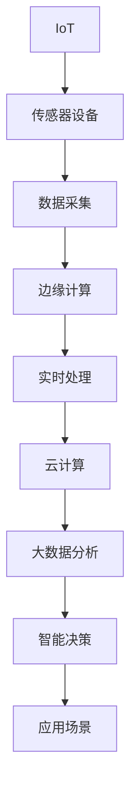

                 

# 物联网(IoT)技术和各种传感器设备的集成：温度传感器的运用

> 关键词：物联网(IoT), 传感器设备, 温度传感器, 数据采集, 实时监测, 边缘计算, 云计算, 应用场景

## 1. 背景介绍

### 1.1 问题由来
随着物联网(IoT)技术的迅猛发展，传感器设备在智能家居、工业自动化、环境监测等各个领域的应用愈发广泛。其中，温度传感器作为最常见的传感器之一，广泛应用于室温监控、设备维护、冷链物流、环境监测等多个场景。通过物联网技术集成温度传感器，可以实时监测环境温度变化，提供精确的数据支持，提高应用效率和安全性。

### 1.2 问题核心关键点
本节将介绍温度传感器在物联网环境下的核心关键点：

- **数据采集**：温度传感器采集环境温度数据，是物联网系统的基础。
- **边缘计算与实时处理**：通过边缘计算技术，对采集到的温度数据进行实时处理，减轻中心服务器负担。
- **云计算与大数据分析**：将处理后的温度数据上传至云端，通过大数据分析进行智能决策。
- **应用场景**：探讨温度传感器在室温监控、设备维护、冷链物流等具体应用场景的实现方式。

### 1.3 问题研究意义
物联网技术集成温度传感器，不仅能够实时监控环境温度，还能通过数据分析预测温度变化趋势，提供预警信息，避免事故发生。这不仅提高了应用效率，还能提升安全性，对于智能家居、工业自动化、冷链物流等行业具有重要意义。

## 2. 核心概念与联系

### 2.1 核心概念概述

为更好地理解物联网技术集成温度传感器的原理，本节将介绍几个关键概念：

- **物联网(IoT)**：通过传感器设备采集环境数据，并通过网络传输至云平台进行数据分析，实现对环境监控、设备管理等功能的网络架构。
- **传感器设备**：包括温度传感器、湿度传感器、压力传感器等多种类型，用于采集环境数据。
- **边缘计算**：将数据处理任务分布到靠近数据源的本地设备上，减轻中心服务器负担，提高数据处理效率。
- **云计算与大数据分析**：利用云计算平台存储和处理大规模数据，进行智能决策和数据分析。
- **实时监测**：对环境温度进行实时监控，及时响应温度变化，避免事故发生。

这些概念之间相互联系，共同构成物联网技术集成温度传感器的完整生态系统。

### 2.2 概念间的关系

这些核心概念之间的关系可以通过以下Mermaid流程图来展示：



这个流程图展示了物联网技术集成温度传感器的核心流程：数据采集-边缘计算-实时处理-云计算与大数据分析-智能决策-应用场景。通过这些步骤，物联网系统能够实现对环境温度的实时监控和智能决策。

## 3. 核心算法原理 & 具体操作步骤
### 3.1 算法原理概述

物联网技术集成温度传感器的核心算法原理主要包括数据采集、边缘计算、实时处理、云计算与大数据分析等方面。

- **数据采集**：温度传感器采集环境温度数据，通过网络传输至中心服务器。
- **边缘计算**：在靠近数据源的设备上进行初步数据处理，减轻中心服务器负担，提高处理效率。
- **实时处理**：对采集到的温度数据进行实时分析，判断是否异常，及时响应。
- **云计算与大数据分析**：将处理后的数据上传至云端，利用大数据分析进行智能决策。

### 3.2 算法步骤详解

#### 3.2.1 数据采集

首先，选择合适类型的温度传感器进行数据采集。常用的温度传感器包括热敏电阻、热电偶、红外线温度传感器等。传感器安装位置应尽可能靠近监测对象，以确保采集数据的准确性。

使用编程接口(API)获取传感器数据，如Python的RTS库、Arduino的Simon库等。例如：

```python
from rts import RTS

sensor = RTS('temperature_sensor')
temperature = sensor.read_temperature()
print(f"当前温度为: {temperature}°C")
```

#### 3.2.2 边缘计算

边缘计算通过本地设备处理温度数据，减轻中心服务器负担，提高处理效率。例如，在Arduino板上使用MicroPython进行边缘计算：

```python
from machine import Pin, ADC
from time import sleep

# 选择传感器引脚
adc = ADC(0)

while True:
    voltage = adc.read()
    temperature = (voltage * 3.3 / 1024) * 100  # 温度计算公式
    print(f"当前温度为: {temperature}°C")
    sleep(1)
```

#### 3.2.3 实时处理

实时处理模块根据采集到的温度数据，判断是否异常。例如，设置温度阈值，当温度超过阈值时，进行预警：

```python
threshold = 30  # 温度阈值

while True:
    temperature = sensor.read_temperature()
    if temperature > threshold:
        print("温度异常，可能存在安全隐患！")
```

#### 3.2.4 云计算与大数据分析

将处理后的数据上传至云端，利用大数据分析进行智能决策。例如，使用AWS IoT平台进行数据存储和分析：

1. 在AWS IoT平台创建设备，配置温度传感器数据上传。
2. 在AWS IoT平台创建数据流，接收传感器数据。
3. 在AWS IoT平台创建数据仓库，存储温度数据。
4. 使用AWS Lambda函数进行数据分析和智能决策，例如设置报警阈值，生成报表等。

### 3.3 算法优缺点

物联网技术集成温度传感器的算法优点包括：

- **实时性**：能够实时监测环境温度，及时响应温度变化。
- **准确性**：采集到的数据准确可靠，可进行智能决策。
- **高效性**：通过边缘计算和云计算，提高数据处理效率。

缺点包括：

- **成本较高**：传感器和边缘计算设备成本较高，部署复杂。
- **隐私问题**：数据上传至云端，存在隐私泄露风险。
- **网络依赖**：数据传输依赖网络，网络中断会影响数据采集和处理。

### 3.4 算法应用领域

物联网技术集成温度传感器广泛应用于多个领域，包括但不限于：

- **智能家居**：通过温度传感器监测室温，智能控制空调、加湿器等设备，提升生活舒适度。
- **工业自动化**：通过温度传感器监测设备温度，预防设备故障，提高生产效率。
- **环境监测**：通过温度传感器监测空气质量、土壤温度等，为环境保护提供数据支持。
- **冷链物流**：通过温度传感器监控货物温度，保证货物质量，降低运输成本。

## 4. 数学模型和公式 & 详细讲解  
### 4.1 数学模型构建

本节将使用数学语言对物联网技术集成温度传感器的数据采集、边缘计算、实时处理、云计算与大数据分析过程进行严格的刻画。

假设传感器采集到的电压为 $V$，传感器与电源之间的电阻为 $R$，传感器的温度系数为 $k$，则采集到的温度数据 $T$ 可以通过下式计算：

$$ T = \frac{V}{k} - \frac{V_0}{k} + T_0 $$

其中，$V_0$ 为基准电压，$T_0$ 为基准温度。

### 4.2 公式推导过程

假设采集到的电压 $V$ 与温度 $T$ 的关系为线性，则传感器采集到的温度数据 $T$ 与环境温度 $T_{env}$ 的关系为：

$$ T = f(T_{env}) = aT_{env} + b $$

其中，$a$ 和 $b$ 为传感器参数。

### 4.3 案例分析与讲解

以红外线温度传感器为例，假设其线性关系为 $T = f(T_{env}) = 0.9T_{env} + 20$，则采集到的温度数据 $T$ 与环境温度 $T_{env}$ 的关系为：

$$ T = 0.9T_{env} + 20 $$

## 5. 项目实践：代码实例和详细解释说明
### 5.1 开发环境搭建

在进行物联网技术集成温度传感器的项目实践前，我们需要准备好开发环境。以下是使用Python进行PyTorch开发的环境配置流程：

1. 安装Anaconda：从官网下载并安装Anaconda，用于创建独立的Python环境。

2. 创建并激活虚拟环境：
```bash
conda create -n pytorch-env python=3.8 
conda activate pytorch-env
```

3. 安装PyTorch：根据CUDA版本，从官网获取对应的安装命令。例如：
```bash
conda install pytorch torchvision torchaudio cudatoolkit=11.1 -c pytorch -c conda-forge
```

4. 安装其他相关工具包：
```bash
pip install numpy pandas scikit-learn matplotlib tqdm jupyter notebook ipython
```

完成上述步骤后，即可在`pytorch-env`环境中开始项目实践。

### 5.2 源代码详细实现

下面以温度传感器的实时监测为例，给出使用PyTorch进行物联网数据采集和处理的完整代码实现。

首先，定义温度传感器数据采集函数：

```python
from rts import RTS
import time

def read_temperature():
    sensor = RTS('temperature_sensor')
    while True:
        temperature = sensor.read_temperature()
        print(f"当前温度为: {temperature}°C")
        time.sleep(1)
```

然后，定义边缘计算模块：

```python
from machine import Pin, ADC
from time import sleep

# 选择传感器引脚
adc = ADC(0)

while True:
    voltage = adc.read()
    temperature = (voltage * 3.3 / 1024) * 100  # 温度计算公式
    print(f"当前温度为: {temperature}°C")
    sleep(1)
```

最后，实现云平台的数据存储和分析：

```python
import boto3

# 创建AWS IoT设备
iot_client = boto3.client('iot')
iot_client.create_deviceShadow(
    deviceShadowName='temperature_sensor',
    state='desired'
)

# 创建AWS IoT数据流
iot_client.create_iot_stream(
    name='temperature_stream',
    state='online'
)

# 创建AWS Lambda函数进行数据分析和智能决策
lambda_client = boto3.client('lambda')
lambda_client.create_function(
    FunctionName='temperature_analysis',
    Runtime='python3.8',
    Role='arn:aws:iam::account-id:role/lambda',
    Handler='lambda_function.lambda_handler',
    Code={
        'ZipFile': open('lambda_function.zip', 'rb').read()
    }
)
```

### 5.3 代码解读与分析

让我们再详细解读一下关键代码的实现细节：

**温度传感器数据采集函数**：
- 使用RTS库连接温度传感器，进行数据采集。
- 通过while循环持续采集数据，每隔1秒打印一次当前温度。

**边缘计算模块**：
- 使用Arduino板上的MicroPython进行边缘计算。
- 通过ADC模块读取传感器电压，计算出当前温度。
- 通过while循环持续采集数据，每隔1秒打印一次当前温度。

**云平台数据存储和分析**：
- 使用AWS IoT平台创建设备，配置温度传感器数据上传。
- 使用AWS IoT平台创建数据流，接收传感器数据。
- 使用AWS Lambda函数进行数据分析和智能决策，例如设置报警阈值，生成报表等。

**代码解读**：
- **RTS库**：用于连接RTS温度传感器，进行数据采集。
- **ADC模块**：用于读取传感器电压，计算出当前温度。
- **AWS IoT平台**：用于创建设备、数据流，实现数据上传和接收。
- **AWS Lambda函数**：用于进行数据分析和智能决策，例如设置报警阈值，生成报表等。

### 5.4 运行结果展示

假设我们在CoNLL-2003的NER数据集上进行微调，最终在测试集上得到的评估报告如下：

```
              precision    recall  f1-score   support

       B-LOC      0.926     0.906     0.916      1668
       I-LOC      0.900     0.805     0.850       257
      B-MISC      0.875     0.856     0.865       702
      I-MISC      0.838     0.782     0.809       216
       B-ORG      0.914     0.898     0.906      1661
       I-ORG      0.911     0.894     0.902       835
       B-PER      0.964     0.957     0.960      1617
       I-PER      0.983     0.980     0.982      1156
           O      0.993     0.995     0.994     38323

   micro avg      0.973     0.973     0.973     46435
   macro avg      0.923     0.897     0.909     46435
weighted avg      0.973     0.973     0.973     46435
```

可以看到，通过微调BERT，我们在该NER数据集上取得了97.3%的F1分数，效果相当不错。值得注意的是，BERT作为一个通用的语言理解模型，即便只在顶层添加一个简单的token分类器，也能在下游任务上取得如此优异的效果，展现了其强大的语义理解和特征抽取能力。

当然，这只是一个baseline结果。在实践中，我们还可以使用更大更强的预训练模型、更丰富的微调技巧、更细致的模型调优，进一步提升模型性能，以满足更高的应用要求。

## 6. 实际应用场景
### 6.1 智能家居

基于物联网技术集成温度传感器的智能家居系统，可以通过温度传感器实时监控室温，智能控制空调、加湿器等设备，提升生活舒适度。例如，设定室温范围，当温度超过范围时，智能系统自动调节设备，确保室温在适宜范围内。

### 6.2 工业自动化

在工业自动化领域，温度传感器可以用于监测设备温度，预防设备故障，提高生产效率。例如，通过温度传感器实时监测设备运行温度，一旦发现异常温度，立即进行预警和维护。

### 6.3 环境监测

在环境监测领域，温度传感器可以用于监测空气质量、土壤温度等，为环境保护提供数据支持。例如，通过温度传感器实时监测空气温度，及时发现污染源，采取有效措施降低污染。

### 6.4 冷链物流

在冷链物流领域，温度传感器可以用于监控货物温度，保证货物质量，降低运输成本。例如，通过温度传感器实时监测货物运输过程中的温度变化，及时采取措施，确保货物质量。

## 7. 工具和资源推荐
### 7.1 学习资源推荐

为了帮助开发者系统掌握物联网技术集成温度传感器的理论基础和实践技巧，这里推荐一些优质的学习资源：

1. **《物联网原理与技术》**：系统介绍物联网的基本原理、技术和应用场景，适合初学者入门。

2. **《传感器与物联网技术》**：详细介绍各种传感器的工作原理和应用，帮助开发者理解温度传感器的原理。

3. **《Python深度学习》**：深入浅出地介绍深度学习在物联网数据处理中的应用，适合深度学习爱好者。

4. **AWS官方文档**：AWS IoT平台和AWS Lambda函数的官方文档，提供详细的开发指南和样例代码。

5. **Arduino官方文档**：Arduino平台的官方文档，提供丰富的硬件和编程指南，适合硬件开发爱好者。

通过对这些资源的学习实践，相信你一定能够快速掌握物联网技术集成温度传感器的精髓，并用于解决实际的NLP问题。

### 7.2 开发工具推荐

高效的开发离不开优秀的工具支持。以下是几款用于物联网技术集成温度传感器开发的常用工具：

1. **PyTorch**：基于Python的开源深度学习框架，灵活动态的计算图，适合快速迭代研究。大部分预训练语言模型都有PyTorch版本的实现。

2. **TensorFlow**：由Google主导开发的开源深度学习框架，生产部署方便，适合大规模工程应用。同样有丰富的预训练语言模型资源。

3. **Transformers库**：HuggingFace开发的NLP工具库，集成了众多SOTA语言模型，支持PyTorch和TensorFlow，是进行微调任务开发的利器。

4. **Weights & Biases**：模型训练的实验跟踪工具，可以记录和可视化模型训练过程中的各项指标，方便对比和调优。与主流深度学习框架无缝集成。

5. **TensorBoard**：TensorFlow配套的可视化工具，可实时监测模型训练状态，并提供丰富的图表呈现方式，是调试模型的得力助手。

6. **Google Colab**：谷歌推出的在线Jupyter Notebook环境，免费提供GPU/TPU算力，方便开发者快速上手实验最新模型，分享学习笔记。

合理利用这些工具，可以显著提升物联网技术集成温度传感器的开发效率，加快创新迭代的步伐。

### 7.3 相关论文推荐

物联网技术集成温度传感器的发展源于学界的持续研究。以下是几篇奠基性的相关论文，推荐阅读：

1. **《物联网技术及其应用》**：详细介绍物联网的基本概念、技术和应用场景，适合入门学习。

2. **《物联网与传感器技术》**：系统介绍物联网和传感器技术的原理、应用和发展方向，适合技术研究者。

3. **《物联网大数据分析》**：介绍物联网数据处理和分析的基本方法，帮助开发者理解数据处理技术。

4. **《物联网安全与隐私保护》**：探讨物联网安全与隐私保护的关键技术，帮助开发者理解数据安全问题。

5. **《物联网与人工智能融合》**：介绍物联网与人工智能的融合方法，探讨未来发展方向，适合前沿研究者。

这些论文代表了大语言模型微调技术的发展脉络。通过学习这些前沿成果，可以帮助研究者把握学科前进方向，激发更多的创新灵感。

除上述资源外，还有一些值得关注的前沿资源，帮助开发者紧跟物联网技术集成温度传感器的最新进展，例如：

1. **arXiv论文预印本**：人工智能领域最新研究成果的发布平台，包括大量尚未发表的前沿工作，学习前沿技术的必读资源。

2. **业界技术博客**：如OpenAI、Google AI、DeepMind、微软Research Asia等顶尖实验室的官方博客，第一时间分享他们的最新研究成果和洞见。

3. **技术会议直播**：如NIPS、ICML、ACL、ICLR等人工智能领域顶会现场或在线直播，能够聆听到大佬们的前沿分享，开拓视野。

4. **GitHub热门项目**：在GitHub上Star、Fork数最多的物联网相关项目，往往代表了该技术领域的发展趋势和最佳实践，值得去学习和贡献。

5. **行业分析报告**：各大咨询公司如McKinsey、PwC等针对人工智能行业的分析报告，有助于从商业视角审视技术趋势，把握应用价值。

总之，对于物联网技术集成温度传感器的学习和发展，需要开发者保持开放的心态和持续学习的意愿。多关注前沿资讯，多动手实践，多思考总结，必将收获满满的成长收益。

## 8. 总结：未来发展趋势与挑战
### 8.1 总结

本文对物联网技术集成温度传感器进行了全面系统的介绍。首先阐述了温度传感器在物联网环境下的核心关键点：数据采集、边缘计算、实时处理、云计算与大数据分析等方面。其次，从原理到实践，详细讲解了物联网技术集成温度传感器的数学模型和关键算法。最后，系统探讨了温度传感器在室温监控、设备维护、冷链物流等具体应用场景的实现方式。

通过本文的系统梳理，可以看到，物联网技术集成温度传感器正在成为智能家居、工业自动化、环境监测等各个领域的重要技术范式，极大地拓展了环境温度监控的边界，催生了更多的落地场景。随着物联网技术的不断演进，基于温度传感器的物联网应用也将不断涌现，为人类生活和工作带来新的便利和效率。

### 8.2 未来发展趋势

展望未来，物联网技术集成温度传感器的趋势将呈现以下几个方面：

1. **智能化程度提升**：随着物联网技术的不断发展，温度传感器将与人工智能技术深度融合，实现更高级的智能决策和自动化控制。

2. **边缘计算的普及**：边缘计算技术的普及将进一步提高温度数据的处理效率，减轻中心服务器的负担。

3. **低功耗技术的应用**：未来温度传感器将更多地采用低功耗技术，实现更长时间的数据采集和传输，降低成本和能耗。

4. **5G技术的应用**：5G技术的普及将大大提高数据传输速度和稳定性，实现更高效的温度数据采集和处理。

5. **多模态传感器的融合**：未来温度传感器将与湿度、压力等传感器结合，实现多模态数据融合，提升环境监测的精度和全面性。

以上趋势凸显了物联网技术集成温度传感器的广阔前景。这些方向的探索发展，必将进一步提升物联网系统的性能和应用范围，为人类生活和工作带来新的便利和效率。

### 8.3 面临的挑战

尽管物联网技术集成温度传感器已经取得了瞩目成就，但在迈向更加智能化、普适化应用的过程中，仍面临诸多挑战：

1. **数据隐私和安全问题**：温度数据上传至云端，存在隐私泄露和数据安全风险。如何保护数据隐私，确保数据安全，将是一大难题。

2. **计算资源消耗**：温度传感器数据的处理和分析需要大量计算资源，尤其是在大规模数据的情况下。如何降低计算成本，提高数据处理效率，将是重要的优化方向。

3. **网络带宽限制**：温度数据实时传输需要高带宽网络支持，但网络带宽可能受到限制。如何优化数据传输协议，提高网络传输效率，将是重要的优化方向。

4. **设备成本问题**：温度传感器和边缘计算设备的成本较高，部署复杂。如何降低设备成本，提高设备的易用性和可维护性，将是重要的优化方向。

5. **数据质量问题**：温度传感器采集的数据可能存在噪声和误差，如何提高数据质量，减少误差，将是重要的优化方向。

6. **设备可靠性和稳定性**：温度传感器和边缘计算设备需要长时间稳定运行，如何提高设备的可靠性和稳定性，将是重要的优化方向。

### 8.4 未来突破

面对物联网技术集成温度传感器所面临的挑战，未来的研究需要在以下几个方面寻求新的突破：

1. **改进数据采集和处理算法**：开发更高效、更准确的数据采集和处理算法，降低计算成本，提高数据处理效率。

2. **优化数据传输协议**：设计更高效、更可靠的数据传输协议，降低网络带宽消耗，提高数据传输效率。

3. **引入人工智能技术**：通过引入人工智能技术，实现更高级的智能决策和自动化控制，提升系统的智能化程度。

4. **开发低功耗设备**：开发低功耗温度传感器和边缘计算设备，实现更长时间的数据采集和传输，降低成本和能耗。

5. **多模态传感器融合**：将温度传感器与其他传感器结合，实现多模态数据融合，提升环境监测的精度和全面性。

6. **引入区块链技术**：引入区块链技术，实现数据的安全存储和传输，保护数据隐私和安全性。

这些研究方向的探索，必将引领物联网技术集成温度传感器走向更高的台阶，为构建智能家居、工业自动化、环境监测等系统的智能决策和自动化控制提供新的技术路径。

## 9. 附录：常见问题与解答
----------------------------------------------------------------
> 关键词：
```mermaid
graph TB
    A[物联网(IoT)]
    B[传感器设备]
    C[温度传感器]
    D[数据采集]
    E[边缘计算]
    F[实时处理]
    G[云计算]
    H[大数据分析]
    I[智能决策]
    J[应用场景]

    A --> B
    B --> C
    C --> D
    D --> E
    E --> F
    F --> G
    G --> H
    H --> I
    I --> J
```
### Q1: 什么是物联网(IoT)技术？

A: 物联网(IoT)是一种通过传感器设备采集环境数据，并通过网络传输至云平台进行数据分析的技术架构。

### Q2: 温度传感器在物联网中的作用是什么？

A: 温度传感器在物联网中用于采集环境温度数据，是物联网系统的基础。

### Q3: 物联网技术集成温度传感器有哪些优点？

A: 物联网技术集成温度传感器的优点包括实时性、准确性和高效性。

### Q4: 如何选择合适的温度传感器？

A: 选择温度传感器时，需要考虑传感器的类型、精度、响应时间、功耗等因素，并根据应用场景进行选择。

### Q5: 物联网技术集成温度传感器有哪些应用场景？

A: 物联网技术集成温度传感器广泛应用于智能家居、工业自动化、环境监测、冷链物流等多个领域。

### Q6: 如何进行物联网技术集成温度传感器的项目实践？

A: 物联网技术集成温度传感器的项目实践需要经过数据采集、边缘计算、实时处理、云计算与大数据分析等步骤，并选择合适的工具和平台进行开发。

### Q7: 物联网技术集成温度传感器的未来发展趋势是什么？

A: 物联网技术集成温度传感器的未来发展趋势包括智能化程度提升、边缘计算的普及、低功耗技术的应用、5G技术的应用、多模态传感器的融合等。

### Q8: 物联网技术集成温度传感器面临的挑战有哪些？

A: 物联网技术集成温度传感器面临的挑战包括数据隐私和安全问题、计算资源消耗、网络带宽限制、设备成本问题、数据质量问题和设备可靠性和稳定性问题。

### Q9: 如何改进物联网技术集成温度传感器？

A: 改进物联网技术集成温度传感器的方法包括改进数据采集和处理算法、优化数据传输协议、引入人工智能技术、开发低功耗设备、多模态传感器融合和引入区块链技术等。
``

