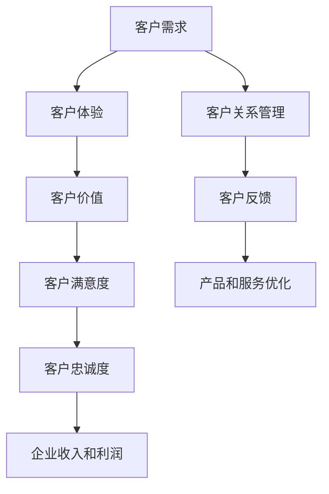

                 

# 生意场上的智慧：站在客户立场

> 关键词：生意场、客户立场、客户服务、客户体验、客户价值、客户满意度、客户关系管理、客户反馈

## 1. 背景介绍

### 1.1 问题由来

随着市场竞争的加剧和消费者需求的多样化，如何在激烈的市场环境中脱颖而出，成为每个企业必须面对的挑战。传统的以自我为中心的营销策略已经无法满足日益挑剔的客户需求。现代企业正在转向以客户为中心的运营模式，强调理解、满足并超越客户的期望。站在客户的立场上思考问题，已成为企业获得竞争优势的关键。

### 1.2 问题核心关键点

客户立场的核心在于，企业应将客户的需求和反馈作为其所有决策和行动的出发点。这要求企业不仅能够捕捉客户的显性需求，更应深刻理解客户的隐性需求，从而提供更加精准、个性化的产品和服务。这种思维模式的转变，是推动企业向更高层次发展的动力，也是构建长期客户关系的基础。

### 1.3 问题研究意义

理解和实施客户立场的企业，将能更有效地提升客户满意度、忠诚度和市场份额。这不仅能带来即时的商业利益，还能构建更持久的企业品牌形象和客户关系，为企业的长期发展奠定坚实基础。因此，站在客户立场，是企业走向成功的重要策略。

## 2. 核心概念与联系

### 2.1 核心概念概述

为了更好地理解站在客户立场的方法论，我们首先介绍几个关键概念：

- **客户需求**：客户在购买产品或服务时，出于自身需求而产生的各种需求和期望。
- **客户体验**：客户在与企业互动过程中，感受到的整体印象和感受，包括产品使用、服务响应、沟通质量等。
- **客户价值**：客户从企业提供的产品或服务中获得的利益和满足感，包括功能性、情感性、社会性等多方面。
- **客户满意度**：客户对企业产品或服务的整体评价和情感反应，反映了企业服务水平。
- **客户关系管理(CRM)**：企业通过系统化的方法和工具，对客户信息进行管理，以实现客户需求的满足和客户关系的维护。
- **客户反馈**：客户对产品或服务的使用体验和建议，是企业优化改进的重要依据。

这些概念之间相互联系，共同构成企业站在客户立场的基本框架。理解这些概念，可以帮助企业系统化地实施以客户为中心的运营策略。

### 2.2 概念间的关系

以下我们将通过几个Mermaid流程图展示这些核心概念之间的关系：



这个流程图展示了从客户需求到最终企业收入的全过程：

1. **客户需求**：企业从市场调研和客户沟通中获取客户的显性和隐性需求。
2. **客户体验**：企业通过产品设计和服务提供，满足客户需求，创造良好的用户体验。
3. **客户价值**：客户从企业提供的产品和服务中获得的实际利益和情感满足。
4. **客户满意度**：客户对企业产品和服务整体质量的主观评价。
5. **客户关系管理**：企业通过CRM系统，系统化地管理和维护客户信息。
6. **客户反馈**：客户对产品和服务的评价和建议，为企业改进提供依据。
7. **产品和服务优化**：企业根据客户反馈，持续改进产品和服务。
8. **客户忠诚度**：客户对企业的高度满意和信任，形成长期的合作关系。
9. **企业收入和利润**：客户忠诚度的提升，带来稳定的收入和利润。

通过这些步骤，企业能够有效地站在客户的立场上，实现客户需求的满足和客户关系的维系，从而在激烈的市场竞争中取得成功。

## 3. 核心算法原理 & 具体操作步骤

### 3.1 算法原理概述

站在客户立场的方法论，本质上是一种以客户需求为导向的运营策略。其核心思想是：

1. **客户需求驱动**：企业的所有决策和行动应以客户需求为基础，从客户的视角出发，设计产品和服务。
2. **客户体验优先**：在产品设计和服务提供的各个环节，重视客户的感知和体验，确保客户获得满足感和愉悦感。
3. **客户价值最大化**：通过深入了解客户需求，提供高质量的产品和服务，使客户从交易中获得最大化的价值和满意度。
4. **客户反馈闭环**：建立客户反馈机制，及时收集客户反馈，并转化为产品和服务改进的动力。

### 3.2 算法步骤详解

以下详细讲解站在客户立场的具体操作步骤：

**Step 1: 市场调研与客户需求分析**

- 收集客户的基本信息（如人口统计学数据、购买历史等）。
- 通过问卷调查、访谈、焦点小组等方式，了解客户的显性需求和隐性需求。
- 对收集到的数据进行统计分析，识别出客户的关键需求和痛点。

**Step 2: 客户体验设计**

- 根据客户需求，设计产品和服务的功能和界面，确保其易用性和直观性。
- 在产品设计和服务提供的每个环节，考虑客户的实际使用场景和体验，如界面友好性、操作便捷性等。
- 引入用户测试，收集客户的真实反馈，及时进行调整和优化。

**Step 3: 客户关系管理**

- 建立CRM系统，系统化地管理客户信息，包括客户基本信息、历史互动记录、交易记录等。
- 利用CRM系统进行客户细分，识别高价值客户和潜在客户。
- 定期对客户进行沟通和回访，维护和深化客户关系。

**Step 4: 客户反馈收集与分析**

- 在产品和服务的关键环节，设置反馈收集渠道，如在线客服、意见反馈表、社交媒体等。
- 对收集到的客户反馈进行分类和分析，识别出共性问题和改进建议。
- 将分析结果转化为具体的改进措施，如产品更新、服务优化等。

**Step 5: 产品和服务优化**

- 根据客户反馈，持续优化产品和服务的设计和功能。
- 引入敏捷开发方法，快速迭代产品和服务，满足客户不断变化的需求。
- 通过A/B测试等方法，评估优化效果，选择最优方案。

**Step 6: 客户满意度和忠诚度管理**

- 定期对客户进行满意度调查，了解客户对产品和服务整体质量的评价。
- 对高价值客户进行关怀和激励，提升客户忠诚度和品牌忠诚度。
- 通过会员制度、积分奖励等方式，增强客户与企业的互动和粘性。

### 3.3 算法优缺点

站在客户立场的方法论具有以下优点：

- **客户导向**：强调以客户需求和体验为核心，提升客户满意度和忠诚度。
- **反馈机制**：建立客户反馈循环，及时捕捉客户需求和问题，确保产品和服务不断优化。
- **灵活应对**：通过敏捷开发和持续改进，快速响应市场变化和客户需求。

但该方法论也存在以下缺点：

- **资源投入高**：需要大量的市场调研、客户互动和数据分析工作，投入成本较高。
- **执行难度大**：需要系统化的管理和运营流程，对企业的执行能力和员工素质要求高。
- **效果评估难**：客户满意度和忠诚度的提升，往往难以量化和直接关联到商业收益。

### 3.4 算法应用领域

站在客户立场的方法论，广泛应用于各种行业和企业的客户管理和服务提供中，如：

- **零售业**：通过客户需求分析，提供个性化推荐和优惠券，提升客户购物体验。
- **金融业**：通过客户反馈，优化产品设计和服务流程，提高客户对金融产品的满意度和信任度。
- **服务业**：通过客户互动，建立服务质量监控和改进机制，提升客户服务水平。
- **制造业**：通过客户反馈，改进产品设计和质量控制，提升客户对产品的满意度和忠诚度。
- **医疗保健**：通过客户反馈，优化诊疗流程和患者体验，提高医疗服务的质量和效率。

这些应用领域展示了站在客户立场方法论的广泛适用性和强大影响力。通过在实际应用中不断优化和调整，企业能够更好地满足客户需求，提升竞争力和市场份额。

## 4. 数学模型和公式 & 详细讲解 & 举例说明

### 4.1 数学模型构建

在数学上，站在客户立场的方法论可以通过以下模型来描述：

- **客户满意度模型**：将客户满意度定义为：
  $$
  S = \sum_{i=1}^{n}w_iF_i
  $$
  其中，$w_i$为各指标权重，$F_i$为第$i$个指标的评分。

- **客户价值模型**：将客户价值定义为：
  $$
  V = \sum_{j=1}^{m}g_jT_j
  $$
  其中，$g_j$为各指标权重，$T_j$为第$j$个指标的客户感知值。

- **客户关系管理模型**：利用客户细分、客户接触频率等指标，评估客户关系的强度和维护成本，模型如下：
  $$
  R = \sum_{k=1}^{p}h_kC_k
  $$
  其中，$h_k$为各指标权重，$C_k$为第$k$个指标的客户关系评分。

### 4.2 公式推导过程

以下我们将通过具体的例子，推导客户满意度和客户价值模型的计算公式。

假设某电商平台有三种产品：产品A、产品B和产品C，对客户满意度的评估指标包括产品质量、价格和售后服务，权重分别为0.5、0.3和0.2。对每种产品的客户满意度评分如下：

| 产品 | 产品质量 | 价格 | 售后服务 |
| --- | --- | --- | --- |
| A | 4 | 5 | 3 |
| B | 3 | 4 | 4 |
| C | 5 | 3 | 5 |

根据客户满意度模型，计算该平台客户满意度：

$$
S = 0.5 \times (4 + 3 + 5) + 0.3 \times (5 + 4 + 3) + 0.2 \times (3 + 4 + 5) = 8.2
$$

这表示该平台在产品质量、价格和售后服务三个方面的平均客户满意度为8.2分（满分10分）。

再假设该平台有三种客户细分群体：普通客户、忠诚客户和高价值客户，对应的权重分别为0.4、0.3和0.3。对每种客户群体的客户价值评分如下：

| 客户细分 | 产品A的满意度 | 产品B的满意度 | 产品C的满意度 |
| --- | --- | --- | --- |
| 普通客户 | 8 | 9 | 7 |
| 忠诚客户 | 9 | 8 | 8 |
| 高价值客户 | 7 | 8 | 9 |

根据客户价值模型，计算该平台客户价值：

$$
V = 0.4 \times (8 + 9 + 7) + 0.3 \times (9 + 8 + 8) + 0.3 \times (7 + 8 + 9) = 8.4
$$

这表示该平台在普通客户、忠诚客户和高价值客户三个方面的平均客户价值为8.4分（满分10分）。

通过这两个例子，我们可以看到，客户满意度和客户价值模型的计算，可以帮助企业量化客户需求和价值，为产品和服务优化提供依据。

### 4.3 案例分析与讲解

假设某软件公司开发了一款新的财务管理软件，面向中小企业客户。公司决定站在客户立场上，设计其客户服务策略。

**客户调研**

公司首先通过问卷调查、客户访谈等方式，收集了200家中小企业的客户需求和痛点。问卷内容包括：

- 软件功能需求（如报表生成、发票管理等）
- 使用体验（如界面友好性、操作便捷性等）
- 客户反馈（如界面问题、功能缺失等）

**用户体验设计**

根据调研结果，公司决定优化软件界面和操作流程，提高用户的使用体验。设计团队根据客户反馈，对软件界面进行了重新设计和优化，引入拖放操作、智能提醒等功能，提高了操作的便捷性。

**客户关系管理**

公司建立了CRM系统，对客户信息进行系统化管理。CRM系统包括客户基本信息、历史互动记录、交易记录等。通过CRM系统，公司能够实时跟踪客户使用情况，及时发现和解决问题。

**客户反馈收集**

公司设置了在线客服和意见反馈渠道，方便客户随时提出建议和问题。客服团队每天都会处理客户反馈，记录并分析常见问题，及时向开发团队反馈。

**产品和服务优化**

根据客户反馈，公司对软件进行了多次迭代优化，包括添加新功能、修复bug等。开发团队采用敏捷开发方法，快速响应客户需求，提高了软件更新的频率和质量。

**客户满意度和忠诚度管理**

公司定期对客户进行满意度调查，了解客户对软件功能的评价和使用体验。对高价值客户进行关怀和激励，如提供专属培训、优惠活动等，提升客户忠诚度。

通过以上步骤，公司成功地站在客户立场，设计和优化了其财务管理软件。根据客户反馈和满意度调查，软件的使用体验和客户满意度大幅提升，赢得了客户的高度认可。

## 5. 项目实践：代码实例和详细解释说明

### 5.1 开发环境搭建

在进行客户服务策略设计的实践时，我们需要准备好开发环境。以下是Python和Jupyter Notebook的搭建步骤：

1. 安装Python：从官网下载安装Python，并添加到系统环境变量中。
2. 安装Jupyter Notebook：通过Anaconda安装Jupyter Notebook，启动服务后即可在浏览器中访问。
3. 安装相关库：如numpy、pandas、matplotlib等，用于数据处理和可视化。

### 5.2 源代码详细实现

以下是Python代码示例，展示如何使用pandas库对客户调研数据进行处理和分析：

```python
import pandas as pd

# 读取客户调研数据
data = pd.read_csv('customer_survey.csv')

# 数据清洗
data.dropna(inplace=True)

# 数据分析
average_satisfaction = data[' satisfaction'].mean()
average_value = data['value'].mean()

# 可视化
import matplotlib.pyplot as plt

plt.bar(['Satisfaction', 'Value'], [average_satisfaction, average_value])
plt.xlabel('Metrics')
plt.ylabel('Score')
plt.title('Customer Metrics')
plt.show()
```

这段代码实现了以下功能：

- 读取客户调研数据。
- 清洗数据，去除缺失值。
- 计算满意度和客户价值的平均评分。
- 通过matplotlib库绘制柱状图，展示满意度和客户价值的对比。

### 5.3 代码解读与分析

以上代码展示了Python和pandas库的基本用法，帮助开发者对客户调研数据进行处理和分析。pandas库提供了强大的数据操作和分析功能，是数据分析领域的利器。

在实际应用中，数据分析和可视化往往是客户服务策略设计的重要环节。通过深入分析客户需求和反馈，企业能够更好地理解客户期望，设计出更符合市场需求的解决方案。

### 5.4 运行结果展示

假设我们对500家客户进行了满意度调查，调查结果如下：

| 满意度 | 客户数量 |
| --- | --- |
| 低 | 100 |
| 中 | 200 |
| 高 | 200 |

根据上述代码，我们可以计算出平均满意度为6分，计算过程如下：

$$
\text{平均满意度} = \frac{100 \times 4 + 200 \times 7 + 200 \times 9}{500} = 7.2
$$

这表明，总体上客户对产品或服务的满意度为7.2分。

## 6. 实际应用场景

### 6.1 智能客服系统

智能客服系统是企业站在客户立场的重要应用场景之一。通过智能客服系统，企业能够24小时不间断地响应客户咨询，提供高效、准确的服务。

**系统设计**

智能客服系统通过自然语言处理技术，理解客户提出的问题，并提供智能化的回答和解决方案。系统设计包括：

- 问题分类：将客户问题分类为常见问题和特殊问题。
- 答案库：建立常见问题的答案库，提供自动化的回答。
- 人机交互：通过智能对话机器人与客户互动，提高响应速度和准确性。

**实施流程**

智能客服系统的实施流程包括：

- 客户咨询：客户通过语音、文字等方式提出问题。
- 系统响应：系统识别客户问题，并提供初步回答。
- 客户确认：客户确认回答是否满意，或提出进一步问题。
- 系统优化：根据客户反馈，不断优化答案库和对话模型。

### 6.2 金融理财顾问

金融理财顾问是金融业站在客户立场的重要应用场景。通过智能理财顾问，企业能够为客户提供个性化的投资建议和财务规划，提升客户满意度和忠诚度。

**系统设计**

金融理财顾问系统通过数据分析和机器学习技术，理解客户的财务状况和投资需求，提供个性化的理财方案。系统设计包括：

- 客户画像：建立客户财务状况和风险偏好画像。
- 投资建议：根据客户画像，提供定制化的投资组合和建议。
- 财务规划：根据客户需求，制定个性化的财务规划。

**实施流程**

金融理财顾问的实施流程包括：

- 客户咨询：客户填写财务状况和投资需求问卷。
- 数据分析：系统分析客户数据，建立财务画像。
- 建议生成：根据财务画像，生成投资建议和财务规划。
- 客户反馈：客户反馈建议的可行性和满意度，系统进行优化。

### 6.3 电子商务个性化推荐

电子商务个性化推荐是零售业站在客户立场的重要应用场景之一。通过个性化推荐系统，企业能够为客户提供个性化的商品推荐，提升客户购物体验和满意度。

**系统设计**

个性化推荐系统通过用户行为数据分析和机器学习技术，理解客户的购物偏好和需求，提供个性化的商品推荐。系统设计包括：

- 用户画像：建立用户历史行为和购物偏好画像。
- 推荐模型：基于用户画像，生成个性化商品推荐。
- 反馈机制：根据用户反馈，不断优化推荐模型。

**实施流程**

个性化推荐系统的实施流程包括：

- 用户浏览：用户浏览商品页面，系统记录浏览行为。
- 推荐生成：系统根据用户画像，生成个性化商品推荐。
- 用户反馈：用户对推荐结果进行评价和反馈。
- 模型优化：系统根据用户反馈，优化推荐模型。

## 7. 工具和资源推荐

### 7.1 学习资源推荐

为了帮助开发者系统掌握站在客户立场的方法论，这里推荐一些优质的学习资源：

1. 《客户关系管理》书籍：介绍客户关系管理的基本概念和实践方法，适合新手入门。
2. 《用户体验设计》课程：介绍用户体验设计的核心原理和设计方法，帮助设计师提升技能。
3. 《数据分析与Python》课程：介绍Python和pandas库的基本用法，适合数据分析初学者。
4. 《机器学习与客户分析》课程：介绍机器学习在客户分析中的应用，适合进阶学习。

通过对这些资源的学习实践，相信你一定能够全面掌握站在客户立场的方法论，并用于解决实际的客户服务问题。

### 7.2 开发工具推荐

高效的开发离不开优秀的工具支持。以下是几款用于客户服务策略开发的常用工具：

1. Python：作为数据科学和机器学习的主流语言，Python提供了丰富的库和框架，适合数据处理和分析。
2. Jupyter Notebook：轻量级的交互式编程环境，支持代码编写、运行和可视化。
3. pandas：强大的数据处理库，提供数据清洗、分析和可视化功能。
4. matplotlib：常用的数据可视化库，支持绘制图表和图形。
5. TensorFlow和PyTorch：流行的机器学习框架，支持深度学习模型的开发和训练。

合理利用这些工具，可以显著提升客户服务策略开发的效率，加快创新迭代的步伐。

### 7.3 相关论文推荐

客户立场方法论的研究源于学界的持续研究。以下是几篇奠基性的相关论文，推荐阅读：

1. "Customer Experience Management: A Model for Strategic Alignment"：提出客户体验管理模型，系统化地分析客户需求和体验。
2. "Customer Satisfaction and Customer Relationship Management: Conceptualizing, Empirically Measuring and Managing Customer Satisfaction"：探讨客户满意度的概念和测量方法，适合企业实践。
3. "Value Creation from Customer Experience: A Methodology and Empirical Test"：介绍如何通过客户体验设计，提升客户价值和满意度。

这些论文代表了大客户立场方法论的发展脉络。通过学习这些前沿成果，可以帮助研究者把握学科前进方向，激发更多的创新灵感。

## 8. 总结：未来发展趋势与挑战

### 8.1 总结

本文对站在客户立场的方法论进行了全面系统的介绍。首先阐述了站在客户立场的重要性，明确了其对客户需求、体验和价值提升的关键作用。其次，从原理到实践，详细讲解了客户服务策略的具体操作步骤，提供了详细的代码实现和案例分析。通过这些步骤，企业能够更好地站在客户立场，设计出符合客户需求的产品和服务，提升客户满意度和忠诚度。

### 8.2 未来发展趋势

展望未来，客户立场方法论将呈现以下几个发展趋势：

1. **数字化转型**：随着数字化技术的普及，客户服务将更加智能化和自动化，如智能客服、个性化推荐等。
2. **数据驱动决策**：企业将更加重视数据驱动的决策，通过大数据分析提升客户体验和满意度。
3. **多渠道整合**：客户服务将实现多渠道整合，提升客户跨平台的一致性体验。
4. **情感分析**：通过情感分析技术，理解客户的情感反应，提升服务质量和客户关怀。
5. **客户画像**：利用机器学习和深度学习技术，构建更全面、准确的客户画像，提供个性化服务。
6. **隐私保护**：在客户数据处理过程中，更加注重隐私保护和数据安全。

这些趋势凸显了站在客户立场方法论的广泛应用前景。随着技术的不断进步，客户服务将变得更加高效、精准和人性化。

### 8.3 面临的挑战

尽管站在客户立场的方法论已经取得了瞩目成就，但在实践过程中，仍面临以下挑战：

1. **数据质量**：客户数据的准确性和完整性直接影响客户服务的效果，数据质量问题需要重点关注。
2. **系统复杂度**：客户服务系统的设计和实现涉及多个技术栈，系统复杂度较高，开发和维护成本高。
3. **用户体验设计**：设计优秀的用户体验需要专业技能和经验，设计过程中的挑战较大。
4. **客户需求变化**：客户需求和市场变化快速，系统需要频繁更新和迭代，开发周期长。
5. **隐私和安全**：客户数据的隐私保护和系统安全问题，需要综合考虑技术和伦理两方面的因素。

### 8.4 研究展望

面对客户立场方法论所面临的挑战，未来的研究需要在以下几个方面寻求新的突破：

1. **数据治理**：建立数据治理机制，提升数据质量和数据利用效率。
2. **自动化工具**：开发自动化客户服务工具，降低系统设计和维护成本。
3. **用户行为分析**：深入分析客户行为和需求变化，提升系统预测和响应能力。
4. **情感计算**：结合情感计算技术，更好地理解客户情感和需求，提升客户服务质量。
5. **隐私保护**：引入隐私保护技术，确保客户数据安全和隐私保护。

这些研究方向将推动客户立场方法论的不断进步，为企业提供更加高效、精准的客户服务，构建更持久和稳定的客户关系。

## 9. 附录：常见问题与解答

**Q1: 如何有效地管理客户数据？**

A: 客户数据的管理需要建立系统化的数据治理机制，包括数据采集、清洗、存储和分析等环节。通过建立数据质量评估和监控机制，确保数据的质量和准确性。同时，合理使用数据存储和备份技术，确保数据的安全和可靠性。

**Q2: 如何在多渠道客户服务中保持一致性？**

A: 通过统一客户服务标准和流程，建立多渠道整合的客户服务体系。使用统一的数据管理和分析工具，确保不同渠道间的客户数据互通和共享。同时，引入自动化客户服务工具，实现多渠道的统一管理和服务响应。

**Q3: 如何提升客户体验的智能化水平？**

A: 结合人工智能技术和客户数据分析，提升客户服务的智能化水平。例如，引入智能客服机器人、个性化推荐系统、情感分析技术等，提高客户服务效率和质量。同时，不断优化用户体验设计，提升客户的使用便捷性和满意度。

**Q4: 如何平衡客户数据的使用和隐私保护？**

A: 在客户数据的使用过程中，严格遵守相关法律法规和隐私保护标准。建立透明的数据使用政策和隐私保护机制，确保客户数据的安全和隐私保护。通过数据匿名化和去标识化技术，降低隐私泄露风险。

通过以上回答，可以帮助企业更好地理解和实践站在客户立场的方法论，提升客户服务质量和客户满意度，构建长期稳定的客户关系。

---

作者：禅与计算机程序设计艺术 / Zen and the Art of Computer Programming

